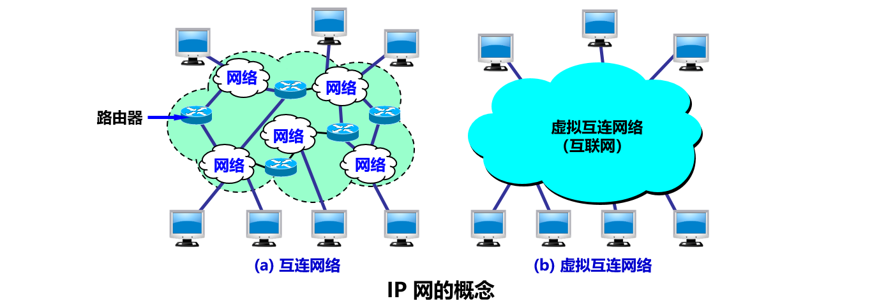
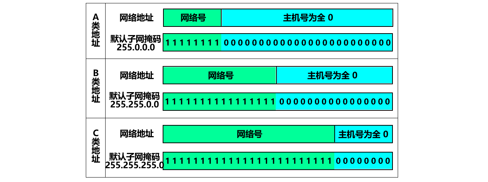
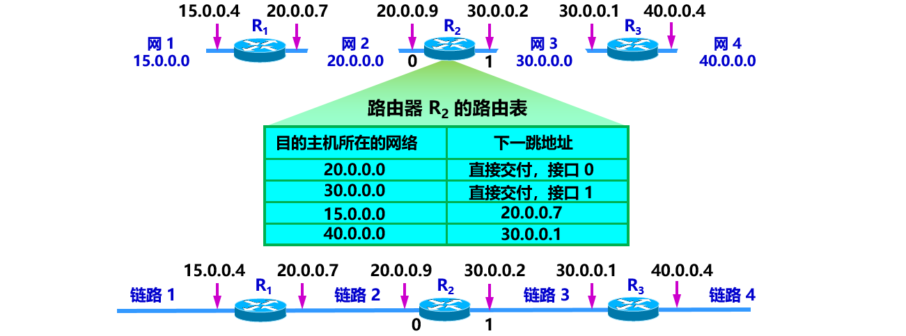

[TOC]

### 网络层

#### 概述

因为网络层是整个互联网的核心，因此应当让网络层尽可能**简单**。

 **TCP/IP** 体系中的**网络层**向上只提供**简单灵活的**、**无连接**的、**尽最大努力交付**的**数据报****服务**。网络层不提供服务质量的承诺，不保证分组交付的时限，所传送的分组可能出错、丢失、重复、和失序。 

使用 IP 协议，可以把异构的物理网络连接起来，使得在网络层看起来好像是一个统一的网络。



#### 网际协议IP

网际层 IP 协议及其配套协议。


与 **IP 协议**配套使用的还有三个协议：

- **地址解析协议 ARP**（Address Resolution Protocol）
- **网际控制报文协议 ICMP**（Internet Control Message Protocol）
- **网际组管理协议 IGMP**（Internet Group Management Protocol）

##### 1. 虚拟互联网络

所谓**虚拟互连网络**也就是逻辑互连网络，它是指互连起来的各种物理网络的**异构性**本来是客观存在的，但是我们利用**IP协议**就可以使这些性能各异的网从**用户看起来**就是**一个统一的网络**。使用 IP 协议的虚拟互连网络可简称为 **IP 网**。

**好处**是：当互连网上的主机进行通信时，就好像在一个网络上通信，而看不见互连的各具体**网络异构**的细节。

> Tip:如果在这种覆盖全球的IP网的上层使用TCP协议，那么就是现在的互联网（Internet）。

那如何**将异构的网络互相连接**起来呢？我们需要使用一些**中间设备**来使异构的网络互相连接起来：

**4 种中间设备**：

- **物理层**中继系统：**转发器**（转发器 转发器是最简单的互联设备，它没有“智能”，不能控制和分析信息，也不具备网络管理功能，只是简单地接受数据祯，逐一再生放大信号，然后把数据发往更远的网络结点，因此转发器只能用于同种网络的物理层上）

- **数据链路层**中继系统：**以太网交换机** 交换机能同时连通许多对的端口，使每一对相互通信的主机都能像独占通信媒体那样，进行无冲突地传输数据。

- **网络层**中继系统：**路由器**。路由器只涉及到物理场、数据链路层和网络层等三层。网桥和路由器的混合物：**桥路器**（brouter）。**同一网络**内部发送IP 数据报可以进行**直接交付**，**不需要经过路由器**。不同网络之间需要通过路由器进行间接交付。

- **网络层以上**的中继系统：**网关**（gateway）

> Tips:**网络互连**都是用**路由器**进行**网络互连**和**路由选择**。由于历史的原因，许多有关 TCP/IP 的文献将网络层使用的路由器称为**网关**。

##### 2. IP地址的编址方式

IP  地址的编址方式经历了三个历史**阶段**：

- 基础分类
- 子网划分
- 无分类

###### ① 基础分类

将 IP 地址划分为若干个**固定类**。 每一类地址都由**两个**固定长度的字段组成，其中一个字段是**==网络号== net-id**，它标志主机（或路由器）所连接到的**网络**，而另一个字段则是**==主机号== host-id**，它标志该**主机**（或路由器）。 主机号在它前面的**网络号**所指明的网络范围内必须是==**唯一**==的。 由此可见，一个 IP 地址在整个互联网范围内是唯一的。

这种**两级的 IP 地址结构**如下：


 可以记为： 


 各类 IP 地址的网络号字段和主机号字段： 


**A 类、B 类、C 类**地址**网络号（net-id）**字段分别是 1 个、2 个、3 个**字节长**。由于 IP 共 4 个字节，所以 A 类、B 类、C 类地址**主机**号（host-id）**，分别是 3 个、2 个、1 个字节长。**而在**网络号字段**的最前面有 **1-3 位**固定的**类别号**，分别为 **0,  10, 110**。

D 类地址（前 4 位是 1110）用于**多播**（一对多通信）。E 类地址（前 4 位是 1111）保留以后用。

**IP地址的指派范围**： 


 一般不使用的**特殊** IP 地址： 


Tips: 主机号**全 0**，代表这个网络的**网络地址**，**主机号全 1 代表广播地址**。很多文献和资料还使用传统的分类的 IP 地址。

**二级IP地址**的重要特点： 

- IP 地址是一种**分等级**的地址结构 。
- 实际上 IP 地址是标志一个**主机**（或路由器）和一条**链路**的**接口**（所以**一个路由器**至少应当有**两个不同的IP地址**，在不同的网络中都有一个 IP 地址）。
- 用转发器或网桥连接起来的若干个局域网**仍为一个网络**（网络号 net-id 相同）。
- 互联网**平等对待每一个IP地址**。
- 不同**网络号**的局域网必须使用路由器进行互连。
- 同一个局域网上的主机或路由器的 IP 地址中的网络号必须是一样的。

###### ② 子网划分

 那么首先为什么要划分子网？肯定是因为原先的**二级 IP 地**址**缺点**太多： 

- IP 地址空间的**利用率有时很低**。

- 给**每一个物理网络分配一个网络号**会使**路由表变得太大**因而使网络性能变坏。

- 两级的 IP 地址**不够灵活**。 

通过在**主机号**字段中拿一部分作为**子网号**，把两级 IP 地址划分为**三级 IP** 地址。

**==IP 地址 ::= {< 网络号 >, < 子网号 >, < 主机号 >}==**


**划分子网的基本思路与原理**：划分子网纯属**一个单位内部**的事情。单位对外仍然表现为没有划分子网的网络。 从主机号（host-id）**借用若干个位**作为**子网号 subnet-id**，而主机号 host-id 也就相应**减少**了若干个位。凡是从其他网络发送给本单位某个主机的 IP 数据报，仍然是根据 IP 数据报的目的网络号 net-id，先找到连接在本单位网络上的路由器。 然后此路由器在收到 IP 数据报后，再按目的**网络号** net-id 和**子网号** subnet-id 找到**目的子网**。 **最后**就将 IP 数据报直接交付目的**主机**。 

划分子网的例子：将一个 B 类 IP 划分成 3 个子网，划分成三个子网后对外仍是一个网络。外部网络看不到子网的存在。


特点：划分子网后 IP 地址就变成了**三级结构**。 划分子网只是把 IP 地址的主机号 **host-id** 这部分进行再划分，而**不改变 IP 地址原来的网络号 net-id**。减少了 IP 地址的浪费 使网络的组织更加灵活，更便于维护和管理。 

要使用子网，必须配置**子网掩码**。一个 B 类地址的默认子网掩码为 **255.255.0.0**，如果 B 类地址的子网占两个比特，那么子网掩码为 11111111 11111111 11000000 00000000，也就是 255.255.192.0。

划分子网增加了灵活性，但是**减少了**能够连接在网络中的**主机总数**。

**子网掩码**

```
PS:问题：假定有一个数据报（目的地址是145.13.3.10）已经到达了路由器R1,那么这个路由器如何把它转发到子网145.13.3.0呢？ 
```

我们知道 IP 数据报的首部并没有给出源或目的主机所在的网络是否划分了子网以及子网的信息。此时使用**子网掩码（subnet mask）**就可以**找出** IP 地址中的**子网部分**。

**规则**：子网掩码的长度还是为**32位**。**某位 ＝ 1：IP地址中的对应位为网络号和子网号** **某位 ＝ 0：IP 地址中的对应位为主机号**。子网掩码最好使用连续的 1（避免出错）。

现在就可以通过该子网的子网掩码（255.255.255.0）来**找到子网**145.13.3.0，**子网是根据子网掩码来划分的**。该子网的子网掩码划分如下图：


 一个重要的结论：**(IP 地址) AND (子网掩码)  = 网络地址**。 

注：同样的 IP 地址和不同的子网掩码可以得出相同的**网络**地址。

 A，B, C 类 IP 的默认子网掩码： 



**子网掩码的重要作用**：**路由器在和相邻路由器交换路由信息时，必须把自己所在网络（或子网）的==子网掩码==告诉相邻路由器**。 路由器的**路由表中**的每一个项目，除了要给出目的网络地址外，还必须同时给出该**网络的子网掩码（没有划分就是默认子网的掩码）**。 若一个路由器连接在两个子网上就拥有两个网络地址和两个子网掩码。

> Tips: 子网的划分分为**固定长度和变长子网**。划分子网增加了灵活性，但却**减少**了能够连接在网络上的**主机总数**。随着*无分类域间路由选择 CIDR* 的广泛使用，现在全 1 和全 0 的子网号也可以使用了，但一定要谨慎使用，确认你的路由器所用的路由选择软件是否支持全 0 或全 1 的子网号这种较新的用法。

使用固定长度子网时，所划分的所有子网的子网掩码都是相同的。

**使用子网时分组的转发**

前面已经说过了在不划分子网时的分组转发,那么在划分子网后，又该怎么转发分组呢？

我们可以知道这两者的区别仅仅在于能不能**直接得到目的地址的网络地址**。划分子网后，**网络地址**不仅取决于 IP 地址，还要取决于**子网掩码**。所以修改**分组算法**如下：

(1) 从收到的分组的首部提取目的 IP 地址 D。

(2) 先用各网络的**子网掩码和 D 逐位相“与”**，看是否和相应的网络地址匹配。若匹配，则将分组直接交付。否则就是间接交付， 执行 (3)。

(3) 若路由表中有目的地址为 D 的特定主机路由，则将分组传送给 指明的下一跳路由器；否则，执行 (4)。 

(4) 对路由表中的每一行，将**子网掩码和 D 逐位相“与**”。若结果与该行的目的网络地址匹配，则将分组传送给该行指明的下一跳路由器；否则，执行 (5)。 

(5) 若路由表中有一个默认路由，则将分组传送给路由表中所指明 的默认路由器；否则，执行 (6)。 

(6) 报告转发分组出错。

###### ③ **无分类编址CIDR**

用于**构建超网**。

历程：1987 年，RFC 1009 就指明了在一个划分子网的网络中可同时使用几个不同的子网掩码。 使用**变长子网掩码** VLSM(Variable Length Subnet Mask) 可进一步提高 IP 地址资源的利用率。 在 VLSM 的基础上又进一步研究出**无分类编址**方法，它的正式名字是**无分类域间路由选择 CIDR** (Classless Inter-Domain Routing)。 

**无分类编址 CIDR** 消除了传统 A 类、B 类和 C 类地址以及划分子网的概念，使用**==网络前缀和主机号==**来对 IP 地址进行编码，网络前缀的长度可以根据需要变化。

==**IP 地址 ::= {< 网络前缀号 >, < 主机号 >}**==


CIDR 的记法上采用在 **IP 地址**后面加上**==网络前缀长度==**的方法，例如 128.14.35.7/**20** 表示**前 20 位为网络前缀**  （这个数值**对应于三级编址中子网掩码中 1 的个数**） 。

CIDR 的地址掩码可以继续称为子网掩码，子网掩码**首 1 长度为网络前缀的长度**。

**CDIR 地址块**：CIDR 把**网络前缀都相同**的连续的 **IP 地址**组成“**CIDR 地址块**”。**我们只要知道 CIDR 地址块中的任何一个地址，就可以知道该地址块的最小地址、最大地址、地址数。**如：128.14.32.0/20 表示的地址块共有 212 个地址（因为斜线后面的 20 是网络前缀的位数，所以这个地址的**主机号是 12 位**），最小地址 128.14.32.0 最大地址 128.14.47.255。 

一个 CIDR 地址块中有很多地址，一个 CIDR 表示的网络就可以表示原来的**很多个网络**，并且在路由表中只需要**一个路由**就可以代替原来的多个路由，**减少了路由表项**的数量。把这种通过使用网络前缀来减少路由表项的方式称为**路由聚合**（自己理解为把多个网络聚合在了一起），也称为 **构成超网** 。**路由聚合有利于减少路由器之间的路由选择信息的交换**，从而提高了整个互联网的性能。 

在路由表中的项目由“网络前缀”和“下一跳地址”组成，在查找时可能会得到不止一个匹配结果 (之所以会有多个结果，是因为地址块又划分了地址块，如 ISP 给大学地址块，大学给院系划分地址块) ，应当采用**最长前缀**匹配来确定应该匹配哪一个。 因为**网络前缀越长，其地址块就越小，因而路由就越具体 (more specific)** 。

常用的 CIDR 地址块：


划分举例：

这个 ISP 共有 64 个 **C 类**网络。如果不采用 CIDR 技术，则在与该 ISP 的路由器交换路由信息的每一个路由器的路由表中，就需要有 64 个项目。但采用**地址聚合**后，只需用路由聚合后的 1 个项目 206.0.64.0/18 就能找到该 ISP。 


##### 3. IP地址与硬件地址

从**层次**的角度看， **硬件地址（MAC 地址）**（或物理地址）是**数据链路层**和**物理层**使用的地址。 **IP 地址**是**网络层和以上各**层使用的地址，是一种**逻辑地址**（称 IP 地址是逻辑地址是因为 IP 地址是用**软件实现**的）。 IP 数据报一旦交给了**数据链路层**就被封装成了 **MAC 帧**，硬件地址放在 MAC 帧的首部。


**路由器只根据目的站的 IP 地址的网络号进行路由选择**。在**具体的物理网络的链路层只能看见 MAC 帧而看不见 IP 数据报。在 IP 层抽象的互联网上只能看到 IP 数据报。** 


Tips：**IP 数据报**的首部的**源地址和目的地址**是**不变**的，而 **MAC 帧**首部中的 **MAC 源地址和目的地址**却是在**不断变换**的（通过不同的网络）。IP 层抽象的互联网**屏蔽**了下层很复杂的细节。 在抽象的网络层上讨论问题，就能够使用 统一的、抽象的 IP 地址 研究主机和主机或主机和路由器之间的通信。


**IP 地址放在 IP 数据报的首部，而硬件地址放在 MAC 帧的首部。在网络层和网络层以上使用的是 IP地址，而数据链路层及以下使用的是硬件地址。**整个IP 数据报成为 MAC 帧中的数据部分，因而在**数据链路层看不见数据报的 IP 地址**。

##### 4. 地址解析协议 ARP

我们知道了 MAC 地址和 IP 地址的区别及工作层次后，不禁又产生了疑问：

主机或路由器怎么知道应当在 **MAC 帧**的首部填入什么样的**硬件地址**？

路由器中的**路由表**又是怎么得出的？

我们先来看第一个问题，第一个问题的答案就是使用**==地址解析协议ARP==--从网络层使用的 IP 地址解析出在数据链路层使用的 MAC 硬件地址**。然后将 MAC 地址放到 MAC 帧的首部。

那么它是怎么解析的呢？每一个主机都设有一个 ==**ARP 高速缓存**== (ARP cache)（通过广播发送 APR 请求分组类似以太网交换机），里面有所在的局域网上的各主机和路由器的 **IP 地址**到**硬件地址（MAC 地址）**的**映射表**。

**APR 高速缓存的作用**：存放最近获得的 IP 地址到 MAC 地址的绑定，以**减少 ARP 广播的数量**。

APR**要点**：不管在网络层上使用的是什么协议，在实际**网络的链路**上传送数据帧时，最终还是必须使用**硬件地址**。==**ARP** 是解决**同一个局域网**上的**主机**或**路由器**的 **IP 地址**和硬件地址的**映射**问题。== **如果所要找的主机和源主机不在同一个局域网上，那么就要通过 ARP 找到一个位于本局域网上的某个==路由器==的硬件地址，然后把分组发送给这个路由器，让这个路由器把分组转发给下一个网络。剩下的工作就由==下一个网络==来做**。

> **既然在网络链路上传送的帧最终是按照硬件地址找到目的主机的，那么为什么还要使用抽象的 IP 地址？**

这是**因为**：IP 地址的分配是根据网络的**拓朴结构**，而不是根据谁制造了网络设置。若将高效的路由选择方案建立在设备制造商的基础上而不是网络所处的拓扑位置基础上，这种方案是不可行的。由于全世界存在着**各式各样的网络**，它们使用**不同的硬件地址**。要使这些**异构网络**能够互相通信就必须进行**非常复杂的硬件地址转换**工作，因此几乎是不可能的事。所以还是要通过 IP 地址来使这个问题简单化，总之，**在虚拟的 IP 网络上用 IP 地址进行通信给广大的计算机用户带来了很大的方便。**

网络层实现**主机之间的通信**，而链路层实现具体每段链路之间的通信。因此在通信过程中，**IP 数据报的源地址和目的地址始终不变**，而 **MAC 地址**随着链路的**改变而改变**。


==ARP 实现由 IP 地址得到 MAC 地址。==


每个主机都有一个 ARP **高速缓存**，里面有本局域网上的各主机和**路由器的 IP 地址到 MAC 地址的映射表**。

如果主机 A 知道主机 B 的 IP 地址，但是 ARP 高速缓存中**没有**该 IP 地址到 MAC 地址的映射，此时主机 A 通过**广播的方式发送 ARP 请求分组**，主机 B 收到该请求后会发送 ARP 响应分组给主机 A **告知其 MAC 地址**，随后主机 A 向其高速缓存中写入主机 B 的 IP 地址到 MAC 地址的**映射**。


##### 5. IP数据报的格式

一个 **IP 数据报**由**首部和数据**两部分组成。 **首部**的**前一部分是固定**长度，共 **20** 字节，是**所有 IP 数据报必须具有**的。 在首部的固定部分的后面是一些可选字段，其长度是可变的。


-  **版本**  : 有 4（IPv4）和 6（IPv6）两个值；
-  **首部长度**  : 占 **4 位**，因此最大值为 15。值为 1 表示的是 1 个 32 位字的长度，也就是 4 字节。因为固定部分长度为 20 字节，因此该值最小为 5。如果可选字段的长度不是 4 字节的整数倍，就用尾部的**填充**部分来填充。
-  **区分服务**  : 用来获得更好的服务，一般情况下不使用。
-  **总长度**  : 包括首部长度和数据部分长度。最长 **65536** 字节，总长度不能超过数据链路层的**最大传输单元 MTU** 的长度，超过需要对数据报进行**分片**处理。
-  **生存时间**  ：==TTL==，它的存在是为了防止无法交付的数据报在互联网中不断兜圈子。以路由器**跳数**为单位，经过一个路由器减 1。当 **TTL 为 0** 时就丢弃数据报。TTL 为 1 则只能在**本局域网**中传播。
-  **协议** ：指出携带的数据应该上交给**哪个协议**进行处理，例如 ICMP、TCP、UDP 、IP、IPv6、OSPF 等。
-  **首部检验和** ：因为数据报每经过一个**路由器**，都要重新**计算检验和**，因此检验和不包含数据部分可以减少计算的工作量。
-  **标识**  : 在数据报长度过长从而发生**分片**的情况下，相同数据报的不同分片具有**相同的标识符**。
-  **片偏移**  : 和标识符一起，用于发生**分片**的情况。片偏移的单位为 8 字节。各分出的数据片需要复制原来的头部信息但是改一下片偏移信息，由此判断不同分片属于同一个数据报。
-  **源地址**：4 字节。
-  **目的地址**：4 字节。

-  **可选字段**：长度可变，从 1 个字节到 40 个字节不等，取决于所选择的项目，用来支持排错、测量以及安全等措施，内容很丰富。填充部分，用 0 填充使可选字段的长度是 4 字节的整数倍。

##### 6. IP层转发分组的流程

> 我们知道在 IP 层转发分组是通过查找**路由表**来实现的，那么为什么通过查找路由表就可以知道该**怎么转发分组**呢？路由表里又存储的是什么呢？至于路由表的创建和维护就放在后面来说了。 

假设：有四个 A 类网络通过**三个路由器**连接在一起。每一个网络上都可能有成千上万个主机。 可以想像，若按目的主机号来制作路由表，每一个路由表就有 4 万个项目，即 4 万行（每一行对应于一台主机），则所得出的路由表就会过于**庞大**。 但若按主机所在的**网络地址**来制作路由表，那么每一个路由器中的路由表就**只包含 4 个项目**（每一行对应于一个**网络**），这样就可使路由表大大**简化**。

在路由表中，对每一条路由，最重要的就是**：目的网络地址，下一跳地址**。



**特点**：根据目的**网络地址**就能确定**下一跳路由器**，这样做的结果是： **IP 数据报最终一定可以找到目的主机所在目的网络上的路由器（可能要通过多次的间接交付）**。 只有到达最后一个路由器时，才试图向目的主机进行**直接交付**。

- **特定主机路由**：虽然互联网所有的分组转发都是基于**目的主机**所在的**网络**，但在大多数情况下都允许有这样的特例，即为特定的目的主机指明一个路由。 采用特定主机路由可使网络管理人员能更方便地控制网络和测试网络，同时也可在需要考虑某种安全问题时采用这种特定主机路由。

- **默认路由**：路由器还可采用**默认路由**以减少路由表所占用的空间和搜索路由表所用的时间。 这种转发方式在一个网络只有很少的对外连接时是很有用的。 默认路由在主机发送 IP 数据报时往往更能显示出它的好处。 如果一个主机连接在一个小网络上，而这个网络只用一个路由器和互联网连接，那么在这种情况下使用**默认路由**是非常合适的。

**路由器分组转发算法**：

(1) 从数据报的**首部**提取**目的**主机的 **IP 地址 D**, 得出目的**网络地址为 N**。 

(2) 若网络 N 与此**路由器直接相连**，则把数据报**直接交付**目的主机 D；否则是**间接交付**，执行 (3)。

(3) 若路由表中有目的地址为 D 的**特定主机路由**，则把数据报传送给**路由表中所指明的下一跳路由器**；否则，执行 (4)。 

(4) 若路由表中有到达网络 N 的路由，则把数据报传送给路由表指明的**下一跳**路由器；否则，执行 (5)。 

(5) 若路由表中有一个**默认路由**，则把数据报传送给路由表中所指明的**默认路由器**；否则，执行 (6)。 

(6) 报告转发分组**出错**。

> Tips: 当**路由器**收到待转发的数据报，不是将下一跳路由器的 IP 地址填入 IP 数据报，而是送交下层的**网络接口软件**。 网络接口软件使用 **ARP** 负责将**下一跳路由器的 IP 地址**转换成**硬件地址**，并将此硬件地址放在链路层的 **MAC 帧的首部**，然后根据这个**硬件地址找到下一跳路由器**。


#### 网际控制报文协议ICMP

ICMP 是为了更有效地转发 IP 数据报和提高交付成功的机会。它**封装**在 IP 数据报中，但是**不属于**高层协议。

##### 1. ICMP的种类

ICMP 报文的种类有**两种**，即 ==**ICMP 差错报告报文**和 **ICMP 询问报文**==。 报文类型如下。

ICMP **差错报告**报文共有 4 种：**终点不可达**、**时间超过**、**参数问题**、 **改变路由（重定向）(Redirect)** 。

ICMP **询问报文**有 2 种：回送请求和回答报文，时间戳和回答报文 。

| ICMP 报文类型 | 类型的值 |         ICMP 报文的类型         |
| :-----------: | :------: | :-----------------------------: |
| 差错报告报文  |    3     |         **终点不可达**          |
| 差错报告报文  |    11    |          **时间超过**           |
| 差错报告报文  |    12    |          **参数问题**           |
| 差错报告报文  |    5     |     **改变路由（重定向）**      |
|   询问报文    |  8 或 0  | 回送（Echo）请求或应答 （ping） |
|   询问报文    | 13 或 14 |        时间戳请求或应答         |

##### 2. ICMP报文格式

ICMP 报文的前 4 个字节是统一的格式，共有三个字段：即**类型**、**代码**和**检验和**。接着的 4 个字节的内容与 ICMP 的类型有关。 


ICMP 差错报告报文的数据字段的内容如下图。


##### 3. ICMP协议应用举例

###### ① Ping

Ping 是 **ICMP** 的一个重要应用，主要用来测试两台主机之间的**连通性**。

Ping 的原理是通过向目的主机发送 ICMP Echo 请求报文，目的主机收到之后会发送 Echo 回答报文。Ping 会根据时间和成功响应的次数估算出数据包往返时间以及丢包率。

###### ② Traceroute

**Traceroute** 是 ICMP 的另一个应用，用来跟踪一个**分组从源点到终点的路径**。

Traceroute 发送的 IP 数据报封装的是无法交付的 UDP 用户数据报，并由目的主机发送终点不可达差错报告报文。

- 源主机向目的主机发送一连串的 IP 数据报。第一个数据报 P1 的生存时间 TTL 设置为 1，当 P1 到达路径上的第一个路由器 R1 时，R1 收下它并把 TTL 减 1，此时 TTL 等于 0，R1 就把 P1 丢弃，并向源主机发送一个 ICMP 时间超过差错报告报文；
- 源主机接着发送第二个数据报 P2，并把 TTL 设置为 2。P2 先到达 R1，R1 收下后把 TTL 减 1 再转发给 R2，R2 收下后也把 TTL 减 1，由于此时 TTL 等于 0，R2 就丢弃 P2，并向源主机发送一个 ICMP 时间超过差错报文。
- 不断执行这样的步骤，直到最后一个数据报刚刚到达目的主机，主机不转发数据报，也不把 TTL 值减 1。但是因为数据报封装的是无法交付的 UDP，因此目的主机要向源主机发送 ICMP 终点不可达差错报告报文。
- 之后源主机知道了到达目的主机所经过的路由器 IP 地址以及到达每个路由器的往返时间。


#### 路由选择协议

##### 1. 概述

所谓**路由协议**，也就是讨论**路由表**是怎么得到的。 

理想的路由算法：算法必须是正确的和完整的。 算法在计算上应简单。 算法应能适应通信量和网络拓扑的变化，这就是说，要有**自适应性**。 算法应具有稳定性。 算法应是公平的。 算法应是最佳的。 

互联网采用**分层次**的**路由选择协议**。因为（1）互联网的规模非常大 （2）许多单位不希望自己内部的网络的布局细节被知道。 

所以，可以把互联网划分为许多个小的==**自治系统**==（Autonomous System）**AS**：一**个 AS 对其他 AS 表现出的是一个单一的和一致的路由选择策略**。 

互联网的**两大类**路由选择协议：


- **内部网关协议 IGP**（Interior Gateway Protocol） ：具体协议有 **RIP 协议，OSPF 协议**等。
- **外部网关协议 EGP** (Extern Gateway Protocol）：具体协议有 **BGP**。


上图显示，一个自治系统**内部**可以使用**不同的内部网关协议**，如 RIP 协议、OSPF 协议。两个自治系统**之间**使用**外部网关协议**进行路由选择，如 BGP 协议。

##### 2. 内部网关协议之RIP

RIP 是一种**分布式的、==基于距离向量==**的路由选择协议。 RIP 协议要求网络中的**每一个路由器**都要维护从**它自己到其他每一个**目的网络的**距离记录**。

RIP 认为一个好的路由就是它通过的路由器的数目少，即“**距离短**”。 **RIP 允许一条路径最多只能包含 ==15== 个路由器**。 “距离”的最大值为 16 时即相当于不可达。可见 **RIP 只适用于==小型互联网==**。 **RIP 不能在两个网络之间同时使用多条路由**。RIP 选择一个具有**最少路由器的路由**（即**最短路由**），哪怕还存在另一条**高速**(低时延)但路由器较多的路由。

**RIP 的三个特点**：

- 仅和**相邻路由器**交换信息。
- 交换的信息是当前本路由器所知道的**全部信息**，即自己的路由表。 
- 按固定的时间间隔交换路由信息，例如每隔 30 秒。当网络拓扑发生变化时，路由器也及时向**相邻路由器**通告拓扑变化后的路由信息。

**路由表的建立（**通过距离向量算法**）**：路由器在刚刚开始工作时，**只知道到直接连接的网络的距离**（此距离定义为 1）。它的路由表是空的。 以后，**每一个路由器也只和数目非常有限的相邻路由器交换并更新路由信息。 经过若干次更新后，所有的路由器最终都会知道到达==本自治系统中任何一个网络==的最短距离和下一跳路由器的地址**。

**距离向量算法**的基础就是 **Bellman-Ford** 算法，要点：设 X 是结点 A 到 B 的最短路径上的一个结点。 若把路径 A→B 拆成两段路径 A→X 和 X→B，则每一段路径 A→X 和 X→B 也都分别是结点 A 到 X 和结点 X 到 B 的最短路径。

RIP 协议的报文结构如下图。RIP 协议使用运输层的用户数据报 **UDP** 进行传送。报文由首部与路由组成。


**RIP 协议特点**：==**好消息传播得快，坏消息传播得慢**==。 RIP 存在的一个问题：当网络出现**故障**时，要经过比较长的时间 (例如数分钟) 才能将此信息传送到所有的路由器（坏消息传的慢）。仅适用于规模小的网络。 其最大的优点是实现简单，开销较小。

##### 3. 内部网关协议之OSPF

###### ① 概述

**开放最短路径优先 OSPF** (Open Shortest Path First)是为克服 RIP 的缺点在 1989 年开发出来的。**适用于==规模较大==的网络**。 

**OSPF** 最主要的特征就是使用**分布式的链路状态控制协议**，而不是像 RIP 那样的距离向量协议。

和 RIP 不同的是： 

（1）向本自治系统中**所有路由器**发送信息，这里使用的方法是**洪泛法**。 

（2）发送的信息就是与本路由器**相邻**的所有路由器的链路状态，但这只是路由器所知道的**部分信息**。 

（3）只有当**链路状态发生变化**时，路由器才向所有路由器使用洪泛法发送此消息。

**链路状态数据库**：由于各路由器之间频繁地交换链路状态信息，因此**所有的路由器**最终都能建立一个**链路状态数据库**。 这个数据库实际上就是==**全网的拓扑结构图**==，它在**全网范围内是一致**的（这称为链路状态数据库的同步）。 OSPF 的链路状态数据库能较快地进行更新，使各个路由器能及时更新其路由表。OSPF 的**更新过程收敛得快**是其重要的**优点**。 

OSPF 的**区域**：为了使 OSPF 能够用于规模很大的网络。OSPF 将一个自治系统再划分为若干个更小的范围，叫做**区域**。 每一个区域都有一个 32 位的区域标识符（用点分十进制表示）。 区域也不能太大，在一个区域内的路由器最好不超过 200 个。 如下图。路由器就可以分为主干路由器和区域边界路由等。


###### ② 工作原理

OSPF 简单说就是两个相邻的路由器通过发**报文的形式成为邻居关系**，邻居再**相互发送链路状态**信息形成邻接关系，之后各自根据**最短路径算法**算出路由，放在 OSPF 路由表，OSPF 路由与其他路由比较后优的加入**全局路由表**。整个过程使用了五种报文、三个阶段、四张表。 

|   类型   |                             含义                             |
| :------: | :----------------------------------------------------------: |
| 五种报文 |                Hello 报文：建立并维护邻居关系                |
|          |                DBD 报文：发送链路状态头部信息                |
|          | LSR 报文：把从 DBD 中找出需要的链路状态头部信息传给邻居，请求完整信息 |
|          |    LSU 报文：将 LSR 请求的头部信息对应的完整信息发给邻居     |
|          |               LSACK：收到 LSU 报文后确认该报文               |
| 三个阶段 |          邻居发现：通过发送 Hello 报文形成邻居关系           |
|          |         路由通告：邻居间发送链路状态信息形成邻接关系         |
|          |             路由计算：根据最短路径算法算出路由表             |
|  四张表  |              邻居表：主要记录形成邻居关系路由器              |
|          |               链路状态数据库：记录链路状态信息               |
|          |             OSPF 路由表：通过链路状态数据库得出              |
|          |             全局路由表：OSPF 路由与其他比较得出              |

OSPF **不用 UDP** 而是直接使用 **IP 数据报**传送，可以减少路由信息的通信量。OSPF 分组被当成 IP 数据报的数据部分。

##### 4. 外部网关协议之BGP

BGP（Border Gateway Protocol，边界网关协议）。BGP 是**不同自治系统的路由器之间**交换路由信息的协议，采用了**路径向量路由选择协议**。边界网关协议 BGP 只能是力求寻找一条能够到达目的网络且**比较好的路由**（不能兜圈子），而**并非**要寻找一条最佳路由。 

AS **之间**的路由选择很困难，主要是由于：

- 互联网规模很大；
- 各个 AS 内部使用不同的路由选择协议，无法准确定义路径的度量；
- AS 之间的路由选择必须考虑有关的策略，比如有些 AS 不愿意让其它 AS 经过。

BGP 只能寻找一条**比较好**的路由，而不是最佳路由。

**每个 AS** 都必须配置 **BGP 发言人**，通过在两个相邻 BGP 发言人之间**建立 TCP 连接**来交换路由信息。 

**BGP发言人**：每一个自治系统的管理员要选择至少一个**路由器**作为该自治系统的“ **BGP 发言人**” (BGP speaker) 。 一般说来，两个 BGP 发言人都是通过一个**共享网络**连接在一起的，而 BGP 发言人往往就是 **BGP 边界路由器**，但也可以不是 BGP 边界路由器。 每个 BGP 发言人除了运行 BGP 协议外，还必须运行该自治系统所使用的**内部网关协议**，如 OSPF 或 RIP 协议。


##### 5. 路由器

路由器是一种典型的==**网络层**==设备。 路由器是互联网中的关键设备。路由器从功能上可以划分为：**路由选择和分组转发**。转发分组只涉及到**网络层**。

路由器是一种具有**多个输入端口和多个输出端口**的专用计算机，其任务是转发分组。也就是说，将**路由器某个输入端口收到的分组**，按照分组要去的目的地（即目的网络），把该**分组从路由器的某个合适的输出端口转发给下一跳路由器**。

分组转发结构由三个部分组成：**交换结构、一组输入端口和一组输出端口**。

典型路由器结构如下图所示。


**转发和路由选择**的区别：“转发”(forwarding) 就是路由器根据转发表将用户的 IP 数据报**从合适的端口转发**出去。 “路由选择”(routing) 则是按照分布式算法，根据从各相邻路由器得到的关于网络拓扑的变化情况，动态地改变所选择的路由。 **路由表是根据路由选择算法得出的**。而**转发表是从路由表得出的**。 在讨论路由选择的原理时，往往不去区分转发表和路由表的区别。

路由器的**输入端口**里面装有**物理层、数据链路层和网络层的处理模块**。 数据链路层剥去帧首部和尾部后，将分组送到网络层的队列中排队等待处理。这会产生一定的时延。 输入端口中的查找和转发功能在路由器的交换功能中是最重要的。

若接收到的分组是路由器之间交换路由信息的分组（如 RIP 或 OSPF 分组），则把这种分组交给路由器中路由选择部分的路由选择处理机进行处理。若接收到的分组是数据分组，则按照分组首部中的目的地址查找转发表，根据结果分组就经过交换机构到达合适的输出端口。

##### 6. 交换机和路由器的区别

1. 路由器可以给你的局域网自动分配IP，虚拟拨号，就像一个交通警察，指挥着你的电脑该往哪走，你自己不用操心那么多了。交换机只是用来分配网络数据的。
2. 路由器在网络层，路由器根据IP地址寻址，路由器可以处理TCP/IP协议，交换机不可以。
3. 交换机在中继层，交换机根据MAC地址寻址。路由器可以把一个IP分配给很多个主机使用，这些主机对外只表现出一个IP。交换机可以把很多主机连起来，这些主机对外各有各的IP。
4. 路由器提供防火墙的服务，交换机不能提供该功能。集线器、交换机都是做端口扩展的，就是扩大局域网(通常都是以太网)的接入点，也就是能让局域网可以连进来更多的电脑。路由器是用来做网间连接，也就是用来连接不同的网络。

交换机是利用**物理地址或者说MAC地址**来确定转发数据的目的地址。而路由器则是利用不同网络的ID号(即IP地址)来确定数据转发的地址。IP地址是在软件中实现的，描述的是设备所在的网络，有时这些第三层的地址也称为协议地址或者网络地址。MAC地址通常是硬件自带的，由网卡生产商来分配的，而且已经固化到了网卡中去，一般来说是不可更改的。而IP地址则通常由网络管理员或系统自动分配。

**路由器和交换机的区别一**：交换机是一根网线上网，但是大家上网是分别拨号，各自使用自己的宽带，大家上网没有影响。而路由器比交换机多了一个虚拟拨号功能，通过同一台路由器上网的电脑是共用一个宽带账号，大家上网要相互影响。
**路由器和交换机的区别二**：交换机工作在中继层，交换机根据MAC地址寻址。路由器工作在网络层，根据IP地址寻址，路由器可以处理TCP/IP协议，而交换机不可以。

**路由器和交换机的区别三**：交换机可以使连接它的多台电脑组成局域网，如果还有代理服务器的话还可以实现同时上网功能而且局域网所有电脑是共享它的带宽速率的，但是交换机没有路由器的自动识别数据包发送和到达地址的功能。路由器可以自动识别数据包发送和到达的地址，路由器相当于马路上的警察，负责交通疏导和指路的。

**路由器和交换机的区别四**：举几个例子,路由器是小邮局，就一个地址(IP)，负责一个地方的收发(个人电脑，某个服务器，所以你家上网要这个东西)，交换机是省里的大邮政中心，负责由一个地址给各个小地方的联系。简单的说路由器专管入网，交换机只管配送，路由路由就是给你找路让你上网的，交换机只负责开门，交换机上面要没有路由你是上不了网的。

**路由器和交换机的区别五**：路由器提供了防火墙的服务。路由器仅仅转发特定地址的数据包，不传送不支持路由协议的数据包传送和未知目标网络数据包的传送，从而可以防止广播风暴。


#### IPv6

##### 1. IPv6格式

IPv6 仍支持**无连接**的传送，但将协议数据单元 **PDU** 称为**分组**。IPv6 数据报由两大部分组成： **基本首部** (base header) **有效载荷**(payload)。有效载荷也称为净负荷。有效载荷允许有零个或多个扩展首部 (extension header)，再后面是数据部分。 


IPv6 将首部长度变为**固定的 40 字节**，称为**基本首部**。 把首部中不必要的功能取消了，使得 IPv6 首部的字段数减少到只有 8 个。 IPv6 对首部中的某些字段进行了如下的更改： 


- **版本**(version)：4 位。它指明了协议的版本，对 IPv6 该字段总是 6。 

- **通信量类(**traffic class)：8 位。这是为了区分不同的 IPv6 数据报的类别或优先级。目前正在进行不同的通信量类性能的实验。
- **流标号**(flow label)：20 位。**“流”**是互联网络上从特定源点到特定终点的一系列数据报， “流”所经过的路径上的路由器都保证指明的服务质量。所有属于同一个**流的数据报都具有同样的流标号**。 
- **有效载荷长度**(payload length)：16 位。它指明 IPv6 数据报除基本首部以外的字节数（所有扩展首部都算在有效载荷之内），其最大值是 64 KB。 
- **下一个首部**(next header)：8 位。它相当于 IPv4 的协议字段或可选字段。 
- **跳数限制**(hop limit)：8 位。源站在数据报发出时即设定跳数限制。路由器在转发数据报时将跳数限制字段中的值减 1。 当跳数限制的值为零时，就要将此数据报丢弃。 
- **源地址**：128 位。是数据报的发送站的 IP 地址。 
- **目的地址**：128 位。是数据报的接收站的 IP 地址。 

##### 2. IPv6的地址

一个 IPv6 数据报的**目的地址**可以是以下三种基本类型地址之一：

- 单播(unicast) 传统的点对点通信。
- 多播(multicast) 多播是一对多点的通信，数据报发送到一组计算机中的每一个。IPv6 没有广播的术语，而是将广播看作多播的一个特例。
- 任播(anycast) IPv6 增加的一种类型。任播的终点是一组计算机，但数据报只交付给其中的一个，通常是距离最近的一个。

IPv6 把实现 IPv6 的**主机和路由器**均称为**结点**。IPv6 给结点的每一个接口指派一个 IP 地址，一个结点可以有多个单播地址，而其中的任何一个地址都可以当作到达该结点的目的地址。 

为了使地址再简洁，IPv6 使用**冒号十六进制记法**(colon hexadecimal notation，简写为 colon hex)，把每个 16 位的值用**十六进制**表示，各值之间用**冒号**分隔。冒号十六进制记法可以允许**零压缩**(zero compression)，即一连串连续地零可以用**一对冒号**取代，如 FF05:0:0:0:0:0:0:B3，可以写成：FF05::B3。在任一地址中只能**使用一次**零压缩。

**特殊地址**

- **未指明地址**：16 字节的**全 0 地址**，可缩写为两个冒号 **“::”**，这个地址**不能用作目的**地址，而只能为某个主机当作源地址使用，条件是这个主机还没有配置到一个标准的 IP 地址。
- **环回地址**：IPv6 的环回地址是 0:0:0:0:0:0:0:1(即**::1**)，作用和 IPv4 的环回地址一样。
- **基于IPv4的地址**：前缀为 0000 0000 保留一小部分地址作为与 IPv4 兼容的，这是因为必须要考虑到比较长的时期 IPv4 和 IPv6 将会同时存在，而有的结点不支持 IPv6，因此数据报在这两类结点之间转发时，就必须进行地址的转换。把 IPv4 地址嵌入到 IPv6 的方法：前 89 位为 0 接着 16 位全是1，然后是嵌入 IPv4 地址，这种地址叫做“IPv4**映射**的 IPv6 地址”。
- **本地链路单播地址**(Link-Local Unicast Address)：有些组织的网络使用 TCP/IP 协议，但并没有连接到因特网上。连接在这样的网络上的主机都可以使用这种本地地址进行通信，但不能和因特网上的其它主机通信。
- **全球单播地址**：使用最多的一类。可以分为三级，用 n 比特作为全球路由选择前缀，用 m 比特作为子网前缀。剩下的 128 - m - n 位比特作为接口标识符。

##### 3. IPv6的过渡

向 IPv6 过渡只能采用**逐步演进**的办法，同时，还必须使新安装的 IPv6 系统能够向后兼容：IPv6 系统必须能够接收和转发 IPv4 分组，并且能够为 IPv4 分组选择路由。 两种向 IPv6 过渡的策略： 

- **使用双协议栈** 
- **使用隧道技术**

###### ① 双协议栈

双协议栈 (dual stack) 是指在完全过渡到 IPv6 之前，使一部分主机（或路由器）装有**两个协议栈**，**一个 IPv4 和一个 IPv6**。 双协议栈的主机（或路由器）记为 IPv6/IPv4，表明它同时具有**两种 IP 地址**：一个 IPv6 地址和一个 IPv4 地址。 双协议栈主机在和 IPv6 主机通信时是采用 IPv6 地址，而和 IPv4 主机通信时就采用 IPv4 地址。 根据 DNS 返回的地址类型可以确定使用 IPv4 地址还是 IPv6 地址。 


###### ② 隧道技术

在 IPv6 数据报要**进入 IPv4 网络**时，把 IPv6 数据报**封装**成为 IPv4 数据报，整个的 IPv6 数据报变成了 IPv4 数据报的**数据部分**。 当 IPv4 数据报离开 IPv4 网络中的**隧道**时，再把数据部分（即原来的 IPv6 数据报）交给主机的 IPv6 协议栈。 从 BCD 中通过就像通过隧道一样。注意在隧道中传送的数据的数据报的源地址是 B 而目的地址是 E。


###### 4. ICMPv6

IPv6 也需要使用 ICMP 来反馈一些差错信息。新的版本即为 ICMPv6，它是面向报文的协议，它利用报文来报告差错，获取信息，探测邻站或管理多播通信等。


#### IP多播

IP 多播直观上可以按照下图理解，源主机只需要发送**一份数据**，而网络中的路由器在转发该数据时需要将它**复制多份**，分别发给在该个多播组内的所有主机。也就是说，IP多播必须依赖于**多播路由器**，这些路由器具有识别多播包的功能，当然，多播路由器也能转发单播包。 


我们知道，IP 网络中每个主机都有自己唯一的 IP 地址（为简化问题，这里忽略 NAT，只考虑公共 IP），那如何让一个多播数据包到达该多播组内的多台主机呢？肯定不能将这么多主机的 IP 地址都写入该多播数据包的目的 IP 包头域（长度限制），而是在该多播数据包的目的 IP 地址域中写入 D 类地址（224.0.0.0—239.225.225.225 前 4 bit固定为 1110），**每个 D 类地址对应一个多播组**，则 D 类地址可以标志 2^28 个多播组。因此，多播数据包与一般的**单播广播数据包的区别**是它的**目的 IP 地址为 D 类地址**，并且 IP 首部中的协议字段为2，表明采用的是IGMP 网际组管理协议。（需要注意的是多播数据包的目的 IP 地址实际上不可能对应某一台真实存在的主机的 IP 地址，也就是说该目的 IP 地址永远不可能作为源地址，即**多播 IP 地址只能用于目的 IP 地址，不能用于源 IP 地址**）。

PING 后面加多播地址就收不到响应。

IP 多播**分为**本局域网的硬件多播和在互联网范围的多播。

**网际组管理协议IGMP 和多播路由选择协议**

- IGMP 协议是让连接在本地局域网上的多播路由器知道本局域网上是否有主机参与或退出了某个多播组。

- IGMP用于支持主机和路由器进行多播的网际组管理协议 


#### 虚拟专用网VPN

由于 IP 地址的紧缺，一个机构能申请到的 IP 地址数往往远**小于**本机构所拥有的主机数。并且一个机构并不需要把所有的主机接入到外部的互联网中，机构内的计算机可以使用仅在**本机构有效的 IP 地址**（专用地址）。

有三个专用地址块：

- **10.0.0.0 \~ 10.255.255.255**
- **172.16.0.0 \~ 172.31.255.255**
- **192.168.0.0 \~ 192.168.255.255**

这些地址仅在**本机构内**使用，也叫本地地址，或叫**可重用地址**。

在互联网中的**路由器对目的地址是专用地址的数据报一律不进行转发。**

VPN 使用公用的互联网作为本机构各**专用网**之间的通信载体。专用指机构内的主机只与本机构内的其它主机通信；虚拟指好像是，而实际上并不是，它有经过公用的互联网。

VPN 的构建：如果专用网不同网点之间的通信必须经过公用的互联网，但又有**保密的要求**（使用 **IPSec 协议**），那么所有通过互联网传送的数据都必须**加密**。 一个机构要构建自己的 VPN 就必须为它的每一个场所购买**专门的硬件和软件**，并进行配置，使每一个场所的 VPN 系统都知道其他场所的地址。 

下图使用 **==IP 隧道技术==**实现虚拟专用网，场所 A 和 B 的通信经过互联网，如果场所 A 的主机 X 要和另一个场所 B 的主机 Y 通信，IP 数据报的源地址是 **10.1.0.1**，目的地址是 **10.2.0.3**。数据报先发送到与互联网相连的路由器 **R1**，R1 对内部数据进行加密，然后重新加上数据报的首部，**源地址**是路由器 R1 的**全球地址 125.1.2.3**，**目的地址**是路由器 R2 的**全球地址 194.4.5.6**。路由器 R2 收到数据报后将数据部分进行解密，恢复原来的数据报，此时**目的地址为 10.2.0.3**，就交付给 Y。


#### 网络地址转换 NAT

```
问题：在专用网上使用专用地址的主机如何与互联网上的主机通信（并不需要加密）？
```

**解决**： (1) 再申请一些全球 IP 地址。但这在很多情况下是不容易做到的。 (2)**采用网络地址转换 NAT**。这是目前使用得最多的方法。 需要在专用网连接到互联网的路由器上安装 NAT 软件。 

专用网内部的主机使用**本地 IP 地址**又想和互联网上的主机通信时，可以使用 **NAT 来将本地 IP 转换为全球 IP**。

**网络地址转换的过程**：内部主机 A 用本地地址 IPA 和互联网上主机 B 通信所发送的数据报必须经过 **NAT 路由器**。 NAT 路由器将数据报的源地址 IPA 转换成全球地址 IPG，并把转换结果记录到 **NAT 地址转换表**中，目的地址 IPB 保持不变，然后发送到互联网。 NAT 路由器收到主机 B 发回的数据报时，知道数据报中的源地址是 IPB 而目的地址是 IPG。 根据 NAT 转换表，NAT 路由器将目的地址 IPG 转换为 IPA，转发给最终的内部主机 A。 


在以前，NAT 将**本地 IP 和全球 IP 一一对应**，这种方式下拥有 n 个全球 IP 地址的专用网内最多只可以同时有 n 台主机接入互联网。为了更有效地利用全球 IP 地址，现在常用的 NAT 转换表把传输层的==**端口号**==也用上了，使得多个专用网内部的主机共用一个全球 IP 地址。使用端口号的 NAT 也叫做网络地址与端口转换 **NAPT**。


