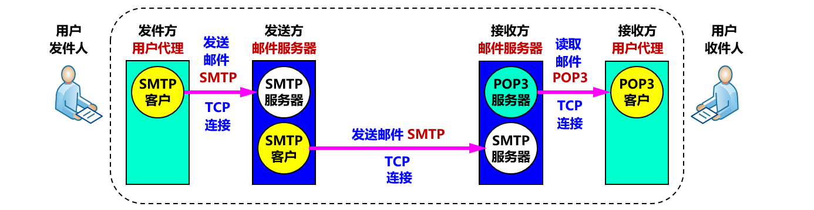

[TOC]

### 应用层

每个应用层协议都是为了解决某一类应用问题，而问题的解决又往往是通过位于不同主机中的多个应用进程之间的通信和协同工作来完成的。应用层的具体内容就是规定应用进程在通信时所遵循的协议。

应用层的许多协议都是基于客户服务器方式。客户 (client) 和服务器 (server) 都是指通信中所涉及的两个应用进程。客户服务器方式所描述的是进程之间服务和被服务的关系。客户是服务请求方，服务器是服务提供方。

**应用层常用端口表**

|       应用       | 应用层协议 |  端口号   | 传输层协议 |             备注             |
| :--------------: | :--------: | :-------: | :--------: | :--------------------------: |
|   **域名解析**   |  **DNS**   |  **53**   |  UDP/TCP   | 长度超过 512 字节时使用 TCP  |
| 动态主机配置协议 |  **DHCP**  |   67/68   |    UDP     |                              |
| 简单网络管理协议 |    SNMP    |  161/162  |    UDP     |                              |
|   文件传送协议   |  **FTP**   | **20/21** |    TCP     | **控制连接 21，数据连接 20** |
|   远程终端协议   |   TELNET   |  **23**   |    TCP     |                              |
|  超文本传送协议  |  **HTTP**  |  **80**   |    TCP     |                              |
| 简单邮件传送协议 |    SMTP    |    25     |    TCP     |                              |
|   邮件读取协议   |    POP3    |    110    |    TCP     |                              |
| 网际报文存取协议 |    IMAP    |    143    |    TCP     |                              |

 

#### 域名系统DNS

##### 1. **概述**

许多应用层软件经常直接使用**域名系统 DNS** (Domain Name System)，但计算机的用户只是间接而不是直接使用域名系统。 

互联网采用层次结构的**命名树**作为主机的名字，并使用**分布式**的域名系统 DNS。

名字到 IP 地址的解析是由**若干个域名服务器**程序完成的。域名服务器程序在专设的结点上运行，运行该程序的机器称为**域名服务器**。  

##### 2. **互联网域名结构**

- 互联网采用了**层次树状结构**的命名方法。
- 任何一个连接在互联网上的主机或路由器，都有一个唯一的层次结构的名字，即**域名**。
- 域名的结构由**标号序列**组成，各标号之间用点隔开：

```
… . 三级域名 . 二级域名 . 顶级域名
```

- 各标号分别代表不同**级别**的域名。 
- 域名只是个逻辑概念，并不代表计算机所在的物理地点。
- 变长的域名和使用有助记忆的字符串，是为了便于人来使用。而 IP 地址是定长的 32 位二进制数字则非常便于机器进行处理。
- 域名中的“点”和点分十进制 IP 地址中的“点”并无一一对应的关系。点分十进制 IP 地址中一定是包含三个“点”，但每一个域名中“点”的数目则不一定正好是三个。 

**顶级域名TLD（Top Level Domain）**

国家顶级域名 nTLD，例如：

- .cn 表示中国 ；.us 表示美国

通用顶级域名 gTLD
最早的顶级域名是：

- .com（公司和企业）；.org（非赢利性组织）；.edu（美国专用的教育机构）；.int（国际组织）

**互联网的域名空间**


##### 3. **域名服务器**

- 一个服务器所负责管辖的（或有权限的）范围叫做**区 (zone)**。
- 各单位根据具体情况来划分自己管辖范围的区。但在一个区中的所有节点必须是能够连通的。
- 每一个区设置相应的**权限域名服务器**，用来保存该区中的所有主机的域名到 IP 地址的映射。
- DNS 服务器的管辖范围不是以“域”为单位，而**是以“区”为单位**。

区的不同划分举例


树状结构的 DNS 域名服务器


**权限域名服务器**

- 负责一个**区**的域名服务器。
- 当一个权限域名服务器还不能给出最后的查询回答时，就会告诉发出查询请求的 DNS 客户，**下一步应当找哪一个权限域名服务器**。 

**本地域名服务器**

- 本地域名服务器对域名系统非常重要。
- 当一个主机发出 DNS 查询请求时，这个查询请求报文就**发送给本地域名服务器**。
- 每一个互联网服务提供者 ISP，或一个**大学**，甚至一个大学里的系，都可以拥有一个本地域名服务器，这种域名服务器有时也称为**默认域名服务器**。

##### 4. **域名解析过程**

- **主机向==本地域名服务器==的查询一般都是采用==递归查询==**。如果主机所询问的本地域名服务器不知道被查询域名的 IP 地址，那么本地域名服务器就以 DNS 客户的身份，向其他根域名服务器继续发出查询请求报文。
- **本地域名服务器向==根域名服务器==的查询通常是采用==迭代查询==**。当根域名服务器收到本地域名服务器的迭代查询请求报文时，要么给出所要查询的 IP 地址，要么告诉本地域名服务器：“你下一步应当向哪一个域名服务器进行查询”。然后让本地域名服务器进行后续的查询。


每个域名服务器都维护一个**高速缓存**，存放最近用过的名字以及从何处获得**名字映射信息**的记录。可大大减轻根域名服务器的负荷，使互联网上的 DNS 查询请求和回答报文的数量大为减少。 缓存应该设置合理的过期时间。

> **DNS 用什么协议传输？**

DNS 可以使用 **UDP 或者 TCP** 进行传输，使用的端口号都为 **53**。**大多数情况下 DNS 使用 ==UDP== 进行传输**。

那 TCP 是可靠的，UDP 不可靠。DNS 应该是**可靠**的，但它使用 UDP，**为什么？**

- UDP 速度**更快**。TCP 很慢，因为它需要 3 次握手。DNS 服务器上的**负载**也是一个重要因素。DNS 服务器（因为它们使用 UDP）没有保持连接。
- DNS 请求通常非常小，非常适合 UDP 段。
- UDP 不可靠，但可以在**应用层添加可靠性**。应用程序可以使用 UDP，并且可以通过在**应用程序层使用超时和重新发送**来实现可靠性。

在两种情况下会使用 **TCP** 进行传输：

- 如果返回的响应超过的 **512 字节**（UDP 最大只支持 512 字节的数据）。
- 区域传送（区域传送是主域名服务器向辅助域名服务器传送变化的那部分数据）。


#### 文件传送协议FTP

##### 1. **FTP 特点**

- 文件传送协议 FTP 只提供文件传送的一些**基本**的服务，它使用 **TCP** 可靠的运输服务。
- FTP 的主要功能是减少或消除在不同操作系统下处理文件的**不兼容**性。
- FTP 使用客户服务器方式。一个 FTP 服务器进程可同时为多个客户进程提供服务。FTP 的服务器进程由两大部分组成：一个**主进程**，负责接受新的请求；另外有**若干个从属进程**，负责处理单个请求。

##### 2. **主进程工作步骤**

- 打开熟知端口（端口号为 **21**），使客户进程能够连接上。
- **等待**客户进程发出连接请求。
- 启动**从属进程**来处理客户进程发来的请求。从属进程对客户进程的请求处理完毕后即终止，但从属进程在运行期间根据需要还可能创建其他一些子进程。
- 回到**等待**状态，继续接受其他客户进程发来的请求。主进程与从属进程的处理是并发地进行。 

##### 3. **两个TCP连接**

- **==控制连接==**在整个会话期间一直保持打开，FTP 客户发出的传送请求通过控制连接发送给服务器端的控制进程，但控制连接**不用**来传送文件。当客户进程向服务器进程发出建立**连接请求**时，要寻找连接服务器进程的**熟知端口 (21)**，同时还要告诉服务器进程自己的另一个端口号码，用于建立数据传送连接。
- 实际用于传输文件的是“**==数据连接==**”。服务器端的控制进程在接收到 FTP 客户发送来的文件传输请求后就创建“**数据传送进程”和“数据连接”**，用来连接客户端和服务器端的数据传送进程。服务器进程用自己**传送数据**的**熟知端口 (20)** 与客户进程所提供的端口号码建立数据传送连接。
- 数据传送进程实际完成文件的传送，在传送完毕后关闭“数据传送连接”并结束运行。两个连接如下图所示。


##### 4. **两种模式**

根据数据连接是否是**服务器端主动建立**，FTP 有主动和被动两种模式：

- **主动模式**：服务器端主动建立数据连接，其中服务器端的端口号为 **20**，客户端的端口号随机，但是必须大于 1024，因为 0\~1023 是熟知端口号。

- **被动模式**：客户端主动建立数据连接，其中客户端的端口号由客户端自己指定，服务器端的端口号随机。

**主动模式**要求客户端**开放端口号**给服务器端，需要去配置客户端的防火墙。被动模式只需要服务器端开放端口号即可，无需客户端配置防火墙。但是**被动模式**会导致服务器端的**安全性减弱**，因为开放了过多的端口号。

##### 5. **TFTP**

- TFTP (Trivial File Transfer Protocol) 是一个很小且易于实现的文件传送协议，其端口号码为  69。
- TFTP 使用客户服务器方式和使用 UDP 数据报，因此 TFTP 需要有自己的差错改正措施。
- TFTP 只支持文件传输而不支持交互。
- TFTP 没有一个庞大的命令集，没有列目录的功能，也不能对用户进行身份鉴别。 
- TFTP 很像停止等待协议。


#### 动态主机配置协议DHCP

在协议软件中，给协议参数赋值的动作叫做协议配置。一个协议软件在使用之前必须是已正确配置的。

连接到互联网的计算机的协议软件需要配置的参数包括：
（1）IP 地址
（2）子网掩码
（3）默认路由器的 IP 地址
（4）域名服务器的 IP 地址

- 这些信息通常存储在一个**配置文件**中，计算机在引导过程中可以对这个文件进行存取。 

**DHCP** (Dynamic Host Configuration Protocol) 提供了**即插即用的连网方式**，用户不再需要手动配置 IP 地址等信息。这种机制允许一台计算机加入新的网络和获取 IP 地址，而不用手工配置。

DHCP 配置的内容不仅是 IP 地址，还包括子网掩码、网关 IP 地址。

DHCP **工作过程**如下：

- 需要 IP 地址的主机在启动时就向 DHCP 服务器**广播**发送**发现报文**
    （**DHCPDISCOVER**），这时该主机就成为 DHCP 客户。
- 本地网络上**所有主机**都能收到此广播报文，但只有 **DHCP 服务器才回答**此广播报文。如下图所示。


- DHCP 服务器先在其数据库中查找该计算机的**配置信息**。若找到，则返回找到的信息。若找不到，则从服务器的 IP 地址池 (address pool) 中取一个地址分配给该计算机。DHCP服务器的回答报文叫做**提供报文（DHCPOFFER）**，DHCP 服务器返回信息是以**单播方式**进行，如下图所示。 


- DHCP 基于 **UDP** 工作，DHCP **服务器**运行在 67 号端口， DHCP **客户**运行在 68 号端口。

具体流程见下图

1. DHCP 服务器被动打开 UDP 端口 67， 等待客户端发来的报文。

2. 客户端发送 **Discover** 报文，该报文的目的地址为 **255.255.255.255:67**，源地址为 **0.0.0.0 : 68**，被放入 UDP 中，该报文被广播到同一个子网的所有**主机**上。如果客户端和 **DHCP 服务器**不在同一个子网，就需要使用中继代理。

3. DHCP 服务器收到 Discover 报文之后，发送 **Offer 报文**给客户端，该报文包含了客户端所需要的信息。因为客户端可能收到**多个 DHCP 服务器**提供的信息，因此客户端需要进行**选择**。

4. 如果客户端选择了某个 DHCP 服务器提供的信息，那么就发送 **Request 报文**给该 DHCP 服务器。

5. 被选择的 DHCP 服务器发送确认报文 DHCPACK，进入已绑定状态，并可**开始使用**得到的临时 IP 地址了。

    DHCP 客户现在要根据服务器提供的租用期 T 设置两个计时器 T1 和 T2，它们的超时时间分别是 0.5T 和 0.875T。当超时时间到就要请求更新租用期。

6. 租用期过了一半（T1 时间到），DHCP 发送请求报文 DHCPREQUEST，要求更新租用期。 

7. DHCP 服务器若同意，则发回确认报文 DHCPACK。DHCP 客户得到了新的租用期，重新设置计时器。

8. DHCP 服务器若不同意，则发回否认报 DHCPNACK。这时 DHCP 客户必须立即停止使用原来的 IP 地址，      而必须重新申请 IP 地址（回到步骤  2）。若 DHCP 服务器不响应步骤  6 的请求报文 DHCPREQUEST，则在租用期过了 87.5% 时，DHCP 客户必须重新发送请求报文 DHCPREQUEST（重复步骤  6），然后又继续后面的步骤。 

9. DHCP 客户可随时提前终止服务器所提供的租用期，这时只需向 DHCP 服务器发送释放报文 DHCPRELEASE 即可。


#### 远程登录协议

**TELNET** 用于登录到远程主机上，并且远程主机上的输出也会返回。

TELNET 可以适应许多计算机和操作系统的差异，例如不同操作系统系统的换行符定义。


#### 电子邮件协议

一个电子邮件系统由三部分组成：用户代理、邮件服务器以及邮件协议。

邮件协议包含发送协议和读取协议，发送协议常用 **SMTP**，读取协议常用 **POP3 和 IMAP**。



SMTP 基于 **TCP** 实现客户与服务器之间的通信。


##### 1. SMTP

SMTP 只能发送 **ASCII 码**，而互联网邮件扩充 MIME 可以发送二进制文件。MIME 并没有改动或者取代 SMTP，而是增加邮件主体的结构，定义了非 ASCII 码的编码规则。


##### 2. POP3

POP3 的特点是只要用户从服务器上读取了邮件，就把该邮件删除。

##### 3. IMAP

IMAP 协议中客户端和服务器上的邮件保持同步，如果不手动删除邮件，那么服务器上的邮件也不会被删除。IMAP 这种做法可以让用户随时随地去访问服务器上的邮件。


#### 应用进程跨越网络的通信

##### 1. 系统调用和应用编程接口

大多数操作系统使用**系统调用** (system call ) 的机制在应用程序和操作系统之间传递控制权。

对程序员来说，每一个系统调用和一般程序设计中的函数调用非常相似，只是系统调用是将控制权传递给了**操作系统**。


系统调用接口实际上就是应用进程的控制权和操作系统的控制权进行转换的一个接口。

使用系统调用之前要编写一些程序，特别是需要设置系统调用中的许多参数，因此这种系统调用接口又称为应用编程接口 API (Application Programming Interface) 。

**套接字的作用**

- 当应用进程需要使用网络进行通信时就发出**系统调用**，请求操作系统为其创建“**套接字**”，以便把网络通信所需要的系统资源分配给该应用进程。
- 操作系统为这些资源的总和用一个叫做**套接字描述符**的号码来表示。
- 应用进程所进行的网络操作都必须使用这个套接字描述符。
- 通信完毕后，应用进程通过一个关闭套接字的系统调用通知操作系统回收与该套接字描述符相关的所有资源。


##### 2. 几种常用的系统调用

当应用进程需要使用网络进行通信时，就发出系统调用。

使用 TCP/IP 应用编程接口 API，就可以编写基于互联网的网络应用程序了。

调用 API 时，用户可以使用 TCP 服务，也可以使用 UDP 等其他服务。

系统调用使用顺序的例子（里面包含一些常用的系统调用）


