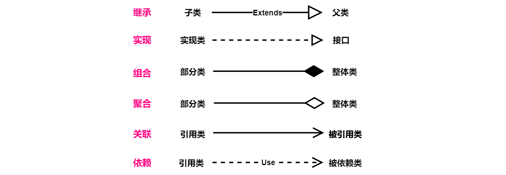
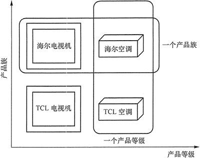

[TOC]

## 设计模式

### 一、面向对象思想

#### 面向对象思想的三大特性

- **封装：确保对象中的数据安全**。
- **继承：保证了对象的可扩展性**。
- **多态：保证了程序的灵活性**。

​                                                        --- **阿里巴巴**

##### 1. 封装

**数据被保护在抽象数据类型的内部，尽可能地隐藏内部的细节，只保留一些对外接口使之与外部发生联系**。用户无需知道对象内部的细节，但可以通过对象对外提供的接口来访问该对象。

以下 Person 类封装 name、gender、age 等属性，外界只能通过 **get**() 方法获取一个 Person 对象的 name 属性和 gender 属性，而无法获取 age 属性，但是 age 属性可以供 work() 方法使用。注意到 gender 属性使用 int 数据类型进行存储，封装使得用户注意不到这种实现细节。并且在需要修改 gender 属性使用的数据类型时，也可以在不影响客户端代码的情况下进行。

```java
public class Person {

    private String name;
    private int gender;
    private int age;

    public String getName() {
        return name;
    }

    public String getGender() {
        return gender == 0 ? "man" : "woman";
    }

    public void work() {
        if (18 <= age && age <= 50) {
            System.out.println(name + " is working very hard!");
        } else {
            System.out.println(name + " can't work any more!");
        }
    }
}
```

##### 2. 继承

**继承保证了对象的可扩展性**。

继承实现了  **IS-A**  关系，例如 Cat 和 Animal 就是一种 **IS-A** 关系，因此 Cat 可以继承自 Animal，从而获得 Animal **非 private** 的属性和方法。继承应该遵循里氏替换原则，**子类对象必须能够替换掉所有父类对象。**

Cat 可以当做 Animal 来使用，也就是说可以使用 Animal 引用 Cat 对象。父类引用指向子类对象称为 **向上转型** 。

```java
Animal animal = new Cat();
```

##### 3. 多态

**多态保证了程序的灵活性**。

多态分为**编译时多态**和**运行时多态**：

- **编译**时多态主要指方法的**重载**。
- **运行**时多态指程序中定义的对象引用所指向的**具体类型**（动态类型）在运行期间才确定。

运行时多态有**三个条件**：**继承**、**覆写**、**向上转型**。

下面的代码中，乐器类（Instrument）有两个子类：Wind 和 Percussion，它们都覆盖了父类的 play() 方法，并且在 main() 方法中使用父类 Instrument 来引用 Wind 和 Percussion 对象。在 Instrument 引用调用 play() 方法时，会执行实际引用对象所在类的 play() 方法，而不是 Instrument 类的方法。

```java
public class Instrument {

    public void play() {
        System.out.println("Instument is playing...");
    }
}

public class Wind extends Instrument {

    public void play() {
        System.out.println("Wind is playing...");
    }
}

public class Percussion extends Instrument {

    public void play() {
        System.out.println("Percussion is playing...");
    }
}

public class Music {

    public static void main(String[] args) {
        List<Instrument> instruments = new ArrayList<>();
        instruments.add(new Wind());
        instruments.add(new Percussion());
        for(Instrument instrument : instruments) {
            instrument.play();
        }
    }
}
```


#### 设计原则

##### 1. SOLID

| 简写 |                全拼                 |     中文翻译     |
| :--: | :---------------------------------: | :--------------: |
| SRP  | The Single Responsibility Principle | **单一责任**原则 |
| OCP  |      The Open Closed Principle      |   **开闭**原则   |
| LSP  |  The Liskov Substitution Principle  | **里氏替换**原则 |
| ISP  | The Interface Segregation Principle | **接口分离**原则 |
| DIP  | The Dependency Inversion Principle  | **依赖倒置**原则 |

###### (1) 单一责任原则

**一个类只负责一件事**。换句话说就是让修改一个类的原因应该只有一个，当这个类需要做**过多事情**的时候，就需要**分解这个类**。如果一个类承担的职责过多，就等于把这些职责耦合在了一起，一个职责的变化可能会削弱这个类完成其它职责的能力。

###### (2) 开闭原则

**类应该对扩展开放，对修改关闭。**扩展就是添加新功能的意思，因此该原则要求在**添加新功能时不需要修改代码**。符合开闭原则最典型的设计模式是**装饰者模式**，它可以动态地将责任附加到对象上，而不用去修改类的代码。

###### (3) 里氏替换原则

**子类对象必须能够替换掉所有父类对象**。继承是一种 **IS-A** 关系，**子类需要能够当成父类来使用，并且需要比父类更特殊**。如果不满足这个原则，那么各个子类的行为上就会有很大差异，增加继承体系的复杂度。

###### (4) 接口分离原则

**不应该强迫客户依赖于它们不用的方法**。因此使用**多个专门的接口比使用单一的总接口**要好。

###### (5) 依赖倒置原则

**高层模块不应该依赖于低层模块，二者都应该依赖于抽象；抽象不应该依赖于细节，细节应该依赖于抽象。**高层模块包含一个应用程序中重要的策略选择和业务模块，如果高层模块依赖于低层模块，那么低层模块的改动就会直接影响到高层模块，从而迫使高层模块也需要改动。

依赖于抽象意味着：**任何变量**都**不应该**持有一个**指向具体类的指针**或者引用；任何类都不应该从具体类派生；任何方法都不应该覆写它的任何基类中的已经实现的方法。

##### 2. 其他常见原则

除了上述的经典原则，在实际开发中还有下面这些常见的设计原则。

| 简写 |               全拼                |     中文翻译     |
| :--: | :-------------------------------: | :--------------: |
| LOD  |        The Law of Demeter         |  **迪米特**原则  |
| CRP  |   The Composite Reuse Principle   | **合成复用**原则 |
| CCP  |   The Common Closure Principle    | **共同封闭**原则 |
| SAP  | The Stable Abstractions Principle | **稳定抽象**原则 |
| SDP  | The Stable Dependencies Principle | **稳定依赖**原则 |

###### (1) 迪米特原则

**一个对象应当对其他对象有尽可能少的了解**。迪米特法则又叫作**最少知识原则**（Least Knowledge Principle，简写 LKP），就是说一个对象应当对其他对象有**尽可能少的了解**，不和陌生人说话。

###### (2) 合成复用原则

尽量使用**对象组合**，而不是通过继承来达到复用的目的。

###### (3) 共同封闭原则

一起修改的类，应该组合在一起（同一个包里）。如果必须修改应用程序里的代码，我们希望所有的修改都发生在一个包里（修改关闭），而不是遍布在很多包里。

###### (4) 稳定抽象原则

最稳定的包应该是最抽象的包，不稳定的包应该是具体的包，即包的抽象程度跟它的稳定性成正比。

###### (5) 稳定依赖原则

包之间的依赖关系都应该是稳定方向依赖的，包要依赖的包要比自己更具有稳定性。


### 二、UML类图

UML 类图是一种**结构图**，用于描述一个系统的**静态结构**。类图以反映类结构和类之间**关系**为目的，用以描述软件系统的结构，是一种**静态建模方法**。类图中的类，与面向对象语言中的类的概念是对应的。

#### 类图结构

在 UML 类图中，使用**长方形**描述一个**类的主要构成**，长方形分为**三层**，分别放置类的**名称、属性和方法**。


**一般类的类名**用正常字体粗体表示，如上图。**抽象类名用斜体字粗体**，如 ***User***；接口则需在上方加上**<\<interface>>**。

**属性和方法**都需要标注**可见性符号**，含义如下。

| 符号  |     含义      |
| :---: | :-----------: |
| **+** |  **public**   |
| **#** | **protected** |
| **-** |  **private**  |

另外，还可以用冒号`:`表明属性的类型和方法的**返回类型**，如`+$name:string`、`+getName():string`。类型说明**并非必须**。

#### 类之间的关系

类与类之间的关系主要有六种：**继承、实现、组合、聚合、关联和依赖**，这六种关系的箭头表示如下。



六种类关系中，**组合、聚合、关联**这三种类关系的代码结构一样，都是**用==属性==来保存对另一个==类的引用==**，所以要通过**内容间的关系**来区别。

##### 1. 继承

继承关系也称**泛化关系**（Generalization），用于描述**==父类与子类==**之间的关系。父类又称作**基类**，子类又称作**派生类**。继承关系中，子类继承父类的**所有功能**，父类所具有的属性、方法，子类应该都有。子类中除了与父类一致的信息以外，还包括额外的信息。

例如：公交车、出租车和小轿车**都是汽车**，他们都有名称，并且都能在路上行驶。

##### 2. 实现

实现关系（Implementation），主要用来规定==**接口和实现类**==的关系。接口（包括抽象类）是方法的集合，在实现关系中，类实现了接口，类中的方法实现了接口声明的所有方法。

例如：汽车和轮船都是交通工具，而交通工具只是一个可移动工具的抽象概念，船和车实现了具体移动的功能。


##### 3. 组合

组合关系（Composition）：**整体与部分的关系**，但是整体与部分**不可以分开**。组合关系表示类之间**整体与部分**的关系，整体和部分有**一致的生存期**。一旦整体对象不存在，部分对象也将不存在，是**同生共死**的关系。

例如：人由头部和身体组成，两者不可分割，共同存在。


##### 4. 聚合

聚合关系（Aggregation）：**整体和部分**的关系，整体与部分**可以分开**。聚合关系也表示类之间**整体与部分**的关系，成员对象是整体对象的**一部分**，但是成员对象**==可以脱离整体对象而独立存在==**。

例如：公交车司机和工衣、工帽是整体与部分的关系，但是可以分开，工衣、工帽可以穿在别的司机身上，公交司机也可以穿别的工衣、工帽。

##### 5. 关联

关联关系（Association）：表示一个==**类的属性保存了对另一个类的一个实例**==（或多个实例）的**引用**。关联关系是类与类之间**最常用**的一种关系，表示一类对象与另一类对象之间有联系。组合、聚合也属于关联关系，只是关联关系的类间关系比其他两种**要弱**。

关联关系有四种：双向关联、单向关联、自关联、多重数关联。在 UML 图中，**双向的关联可以有两个箭头**或者没有箭头，单向的关联或自关联**有一个箭头**。在多重性关系中，可以直接在关联直线上增加**一个数字**，表示与之对应的另一个类的对象的个数。

例如：汽车和司机，一辆汽车对应特定的司机，一个司机也可以开多辆车。

##### 6. 依赖

依赖关系（Dependence）：假设 A 类的**变化引起**了 B 类的变化，则说名 **B 类依赖于 A 类**。大多数情况下，依赖关系体现在==**某个类的方法使用另一个类的对象作为参数**==。

依赖关系是一种**“使用”关系**，特定事物的改变有可能会影响到使用该事物的其他事物，在需要表示一个事物使用另一个事物时使用依赖关系。

例如：汽车依赖汽油，如果没有汽油，汽车将无法行驶。

#### 综合示例

这六种类关系中，组合、聚合和关联的代码结构一样，可以从关系的强弱来理解，**各类关系从强到弱**依次是：**继承→实现→组合→聚合→关联→依赖**。如下是完整的一张 UML 关系图。


### 三、设计模式-创建型

创建型模式(Creational Pattern)对类的**实例化过程**进行了**抽象**，能够将软件模块中**对象的创建和对象的使用分离**。为了使软件的结构更加清晰，外界对于这些对象只需要知道它们共同的接口，而不清楚其具体的实现细节，使整个系统的设计更加符合单一职责原则。

创建型模式在**创建什么(What)，由谁创建(Who)，何时创建(When)**等方面都为软件设计者提供了尽可能大的灵活性。创建型模式隐藏了类的实例的创建细节，通过隐藏对象如何被创建和组合在一起达到使整个系统独立的目的。 

#### 单例模式（Singleton）

##### 1. 概述

确保**一个类==只有一个实例==**，并提供该实例的**全局访问点**。使用一个**私有构造函数**、一个**私有静态变量**以及一个**公有静态函数**来实现。私有构造函数保证了不能通过构造函数来创建对象实例，只能通过公有静态函数返回**唯一的私有静态变量**。

###### 优点：

1. 在内存里只有一个实例，减少了内存的开销，尤其是频繁的创建和销毁实例（比如管理学院首页页面缓存）。
2. 避免对资源的多重占用（比如写文件操作）。

###### 缺点：

没有接口，不能继承，与单一职责原则冲突，一个类应该只关心内部逻辑，而不关心外面怎么样来实例化。

##### 2. 使用场景

-  **数据库连接池**的设计一般也是采用单例模式，因为数据库连接是一种数据库资源，**线程池**也是类似的。
-  应用程序的**日志应用**，一般都可用单例模式实现，这一般是由于共享的日志文件一直处于打开状态，因为只能有一个实例去操作，否则内容不好追加。
-  **应用配置类**。
-  Windows 的 Task Manager（**任务管理器**）就是很典型的单例模式。
-  要求生产唯一序列号。
-  WEB 中的计数器，不用每次刷新都在数据库里加一次，用单例先缓存起来。
-  创建的一个对象需要消耗的资源过多，比如 I/O 与数据库的连接等。

##### 3. 类图


##### 4. 实现

单例模式有好多种**实现方式**，如下。

###### (1) 懒汉式1-线程不安全

**懒汉就是调用方法才进行实例化。**

非线程安全，即在多线程下可能会创建多次对象

```go
/**
 * 使用结构体代替类
 */
type Tool struct {
    values int
}

/**
 * 建立私有变量
 */
var instance *Tool

/**
 * 获取单例对象的方法，引用传递返回
 */
func GetInstance() *Tool {
    if instance == nil {
        instance = new(Tool)
    }
    return instance
}
```

###### (2) 懒汉式2-线程安全

在非线程安全的基本上，利用Sync.Mutex进行加锁,保证线程安全，但由于每次调用该方法都进行了加锁操作，在性能上相对不高效.

```go
/**
 * 锁对象
 */
var lock sync.Mutex
/**
 * 加锁保证线程安全
 */
func GetInstance() *Tool {
    lock.Lock()
    defer lock.Unlock()
    if instance == nil {
        instance = new(Tool)
    }
    return instance
}
```

###### (3) 饿汉式-线程安全

**饿汉就是一来就进行实例化**。

直接创建好对象，这样不需要判断为空，同时也是线程安全。唯一的缺点是在导入包的同时会创建该对象，并持续占有在内存中。

```go
var instance Tool

func GetInstance() *Tool {
    return &instance
}
```

###### (4) 双重校验锁-线程安全

在懒汉式（线程安全）的基础上再进行忧化，判少加锁的操作。保证线程安全同时不影响性能

```go
/**
* 锁对象
*/
var lock sync.Mutex

/**
* 第一次判断不加锁，第二次加锁保证线程安全，一旦对象建立后,获取对象就不用加锁了
*/
func GetInstance() *Tool {
    if instance == nil {
        lock.Lock()

        if instance == nil {
            instance = new(Tool)
        }

        lock.Unlock()
    }

    return instance
}
```

###### (5) sync.Once

通过sync.Once 来确保创建对象的方法只执行一次.

```go
var once sync.Once

func GetInstance() *Tool {
    once.Do(func() {
        instance = new(Tool)
    })
    return instance
}
```

sync.Once内部本质上也是双重检查的方式，但在写法上会比自己写双重检查更简洁，以下是Once的源码:

```go
func (o *Once) Do(f func()) {　　　//判断是否执行过该方法，如果执行过则不执行
    if atomic.LoadUint32(&o.done) == 1 {
        return
    }
    // Slow-path.
    o.m.Lock()
    defer o.m.Unlock()　　//进行加锁，再做一次判断，如果没有执行，则进行标志已经扫行并调用该方法
    if o.done == 0 {
        defer atomic.StoreUint32(&o.done, 1)
        f()
    }
}
```


#### 简单工厂模式（Simple Factory）

##### 1. 概述

在**创建一个对象**时不向客户暴露内部细节，并提供一个**创建对象的==通用接口==**。简单工厂把**实例化**的操作单独放到一个类中，这个类就成为**简单工厂类**，让**简单工厂类**来决定应该实例化哪个**具体子类**。**==创建对象的任务交给简单工厂==**。

这样做能把**客户类**和具体**子类**的实现解耦，客户类不再需要知道有哪些子类以及应当实例化哪个子类。客户类往往有**多个**，如果不使用简单工厂，那么所有的客户类都要知道所有子类的细节。而且一旦子类发生改变，例如增加子类，那么所有的客户类都要进行修改。

**优点**

* 工厂类含有必要的判断逻辑，可以决定在什么时候创建哪一个产品类的实例，客户端可以免除直接创建产品对象的责任，而仅仅“消费”产品；简单工厂模式通过这种做法实现了对责任的分割，它提供了专门的工厂类用于创建对象。
* 客户端无须知道所创建的具体产品类的类名，只需要知道具体产品类所对应的参数即可，对于一些复杂的类名，通过简单工厂模式可以减少使用者的记忆量。
* 通过引入配置文件，可以在不修改任何客户端代码的情况下更换和增加新的具体产品类，在一定程度上提高了系统的灵活性。

**缺点**

* 由于工厂类集中了所有产品创建逻辑，一旦不能正常工作，整个系统都要受到影响。
* 使用简单工厂模式将会增加系统中类的个数，在一定程序上增加了系统的复杂度和理解难度。
* 系统扩展困难，一旦添加新产品就不得不修改工厂逻辑，同样破坏了“开闭原则”；在产品类型较多时，有可能造成工厂逻辑过于复杂，不利于系统的扩展和维护。
* 简单工厂模式由于使用了静态工厂方法，造成工厂角色无法形成基于继承的等级结构。

**适用场景**

* 工厂类负责创建的对象比较少：由于创建的对象较少，不会造成工厂方法中的业务逻辑太过复杂。
* 客户端只知道传入工厂类的参数，对于如何创建对象不关心：客户端既不需要关心创建细节，甚至连类名都不需要记住，只需要知道类型所对应的参数。

##### 2. 类图


##### 3. 实现

```go
package main

import (
    "fmt"
)

type Operater interface { //运算接口
    Operate(int, int) int
}

//加法运算类，实现了运算接口
type AddOperate struct {  
}
func (this *AddOperate)Operate(rhs int, lhs int)  int {
    return rhs + lhs
}

//减法运算类，实现了运算接口
type SubOperate struct { 
}
func (this *SubOperate)Operate(rhs int, lhs int) int {
    return rhs - lhs
}

type OperateFactory struct {
}

func NewOperateFactory()  *OperateFactory {
    return &OperateFactory{}
}

func (this *OperateFactory)CreateOperate(operatename string) Operater {
    switch   operatename {
        case "+":
            return &AddOperate{}
        case "-":
            return &SubOperate{}
        default:
            panic("无效运算符号")
            return nil
    }
}

int main() {
    defer func() {
        if err := recover(); err != nil {
            fmt.Println(err)
        }
    }{}
    Operator := NewOperateFactory().CreateOperate("+")  //这时候Operator 不可能为nil
    fmt.Printf("add result is %d\n", Operator.Operate(1,2)) //add result is 3
    return
}
```

在这个例子中，各种运算方法类实现了运算接口，在业务上如果想添加一种运算方法，只需要增加一个实现运算接口的类，并且在工厂类中添加一个类型判断。这种设计适合于业务类型并不是很多的情况，如果业务类型非常多，那么在工作类中就会有一个很长switch...case结构，这时候使用方法工厂模式会比较合适。

在正常情况下，工厂类可以用一个函数代替。但是为了其类图逻辑的美观会将它定义为一个工厂类。简单工厂方法将业务类型判断的逻辑放在工厂类中，使得调用工厂类过程比较简单和统一。假如将简单工厂模式中的工厂类的逻辑判断转移到工厂类调用者上，就会变成工厂方法模式，这样的话一个具体的工厂类会与一个具体的产品类一一对应。如果再进一步，一个具体工厂类中组合多个具体产品类，那么方法工厂模式就会变成抽象工厂模式了。

在应用过程中可以说各有各的好处，必须看具体的应用场景，比如如果将工厂类产生具体的产品的逻辑放在调用工厂类过程后面的业务逻辑基本一致，那么采用简单工厂方法会比其他两中工厂方法好。而如果调用工厂类产生具体产品类后的业务逻辑都不大相同，那么简单工厂模式就不是一个很好的选择。


#### 工厂方法模式（Factory Method）

##### 1. 概述

定义了一个**创建对象的接口**，但由**子类**决定要**实例化哪个类**。**工厂方法把==实例化操作推迟到子类==**。工厂方法模式是对简单工厂模式进一步的**解耦**，因为在工厂方法模式中是**一个子类对应一个工厂类**，而这些**工厂类都实现于一个抽象接口**。这相当于是把原本会因为业务代码而庞大的简单工厂类，拆分成了**==一个个的工厂类==**，这样代码就不会都耦合在同一个类里了。

在简单工厂中，创建对象的是**工厂类**，而在工厂方法中，是由==**子类来创建对象**==。

下图中，Factory 有一个 **doSomething**() 方法，这个方法需要用到一个**产品对象**，这个产品对象由 factoryMethod() 方法创建。该方法是**抽象**的，需要由**子类去实现**。


组成（下面代码）：

- **抽象工厂**（Factory）：提供了创建产品的接口，调用者通过它访问具体工厂的工厂方法 **newProduct**() 来创建产品。
- **工厂方法**（factoryMethod）：主要是实现抽象工厂中的抽象方法，完成具体产品的创建。
- **具体工厂**（三个 ConcreteFactory）：具体用于产生产品的小工厂。
- **抽象产品角色**（Product 接口）：定义产品。
- **具体产品角色**（Product 接口的实现类）：实现了抽象产品角色所定义的接口，由具体工厂来创建，它同具体工厂之间一一对应。

##### 2. 实现

```go
package factorymethod

//Operator 是被封装的实际类接口
type Operator interface {
	SetA(int)
	SetB(int)
	Result() int
}

//OperatorFactory 是工厂接口
type OperatorFactory interface {
	Create() Operator
}

//OperatorBase 是Operator 接口实现的基类，封装公用方法
type OperatorBase struct {
	a, b int
}

//SetA 设置 A
func (o *OperatorBase) SetA(a int) {
	o.a = a
}

//SetB 设置 B
func (o *OperatorBase) SetB(b int) {
	o.b = b
}

//PlusOperatorFactory 是 PlusOperator 的工厂类
type PlusOperatorFactory struct{}

func (PlusOperatorFactory) Create() Operator {
	return &PlusOperator{
		OperatorBase: &OperatorBase{},
	}
}

//PlusOperator Operator 的实际加法实现
type PlusOperator struct {
	*OperatorBase
}

//Result 获取结果
func (o PlusOperator) Result() int {
	return o.a + o.b
}

//MinusOperatorFactory 是 MinusOperator 的工厂类
type MinusOperatorFactory struct{}

func (MinusOperatorFactory) Create() Operator {
	return &MinusOperator{
		OperatorBase: &OperatorBase{},
	}
}

//MinusOperator Operator 的实际减法实现
type MinusOperator struct {
	*OperatorBase
}

//Result 获取结果
func (o MinusOperator) Result() int {
	return o.a - o.b
}
```

工厂方法把简单工厂的内部逻辑判断转移到了客户端代码来进行。

如果需要**添加功能**，本来是改工厂类的，而现在是**修改客户端**。而且各个不同功能的实例对象的创建代码，也没有耦合在同一个工厂类里，这也是工厂方法模式对**简单工厂模式解耦**的一个体现。工厂方法模式克服了简单工厂会违背开-闭原则的缺点，又保持了封装对象创建过程的优点。

但工厂方法模式的缺点是每增加一个**产品类**，就需要增加一个对应的**工厂类**，增加了额外的**开发量**。


#### 抽象工厂模式（Abstract Factory）

##### 1. 概述

> **抽象工厂与工厂方法模式的区别**

抽象工厂与工厂方法模式的区别在于：**抽象工厂**是可以**生产==多个产品==**的，例如 MysqlFactory 里可以生产 MysqlUser 以及 MysqlLogin 两个产品，而这两个产品又是属于**一个系列**的，因为它们都是属于 MySQL 数据库的表。而**工厂方法**模式则只能生产**一个产品**，例如 MysqlFactory 里就只可以生产一个 MysqlUser 产品。

抽象工厂模式是工厂方法模式的**升级版本**，工厂方法模式**只生产一个等级**的产品，而**抽象工厂模式可生产多个等级**的产品。

> **如何理解同对象族？**

**工厂方法**模式只考虑生产**同等级**的产品，但是在现实生活中许多工厂是**综合型**的工厂，能生产**多等级（种类）** 的产品，如农场里既养动物又种植物，电器厂既生产电视机又生产洗衣机或空调，大学既有软件专业又有生物专业等。

**抽象工厂模式**将考虑**多等级产品**的生产，将同一个**具体工厂**所生产的位于**不同等级的一组产品称为一个产品族**，如下图所示的是**海尔**工厂和 **TCL** 工厂所生产的电视机与空调对应的关系图。



抽象工厂模式**创建的是==对象家族==**，也就是**很多对象**而不是一个对象，并且这些对象是==**相关**==的，也就是说**必须一起创建**出来。而工厂方法模式只是用于创建一个对象，这和抽象工厂模式有很大不同。

**抽象工厂模式用到了工厂方法模式来创建单一对象**，AbstractFactory 中的 createProductA() 和 createProductB() 方法都是让子类来实现，这两个方法单独来看就是在创建一个对象，这**符合**工厂方法模式的定义。

至于创建对象的家族这一概念是在 **Client** 体现，Client 要通过 **AbstractFactory** 同时调用两个方法来创建出两个对象，在这里这两个对象就有很大的**相关性**，Client 需要**同时创建出**这两个对象。

从高层次来看，**抽象工厂使用了==组合==，即 Cilent 组合了 AbstractFactory，而工厂方法模式使用了==继承==**。

**意图**：

提供一个创建一系列相关或相互依赖对象的接口，而无需指定它们具体的类。

**主要解决**：

主要解决接口选择的问题。

**何时使用**：

系统的产品有多于一个的产品族，而系统只消费其中某一族的产品。

**如何解决**：

在一个产品族里面，定义多个产品。

**关键代码**：

在一个工厂里聚合多个同类产品。

**应用实例**：

工作了，为了参加一些聚会，肯定有两套或多套衣服吧，比如说有商务装（成套，一系列具体产品）、时尚装（成套，一系列具体产品），甚至对于一个家庭来说，可能有商务女装、商务男装、时尚女装、时尚男装，这些也都是成套的，即一系列具体产品。假设一种情况（现实中是不存在的，要不然，没法进入共产主义了，但有利于说明抽象工厂模式），在您的家中，某一个衣柜（具体工厂）只能存放某一种这样的衣服（成套，一系列具体产品），每次拿这种成套的衣服时也自然要从这个衣柜中取出了。用 OOP 的思想去理解，所有的衣柜（具体工厂）都是衣柜类的（抽象工厂）某一个，而每一件成套的衣服又包括具体的上衣（某一具体产品），裤子（某一具体产品），这些具体的上衣其实也都是上衣（抽象产品），具体的裤子也都是裤子（另一个抽象产品）。

**优点**：

当一个产品族中的多个对象被设计成一起工作时，它能保证客户端始终只使用同一个产品族中的对象。

**缺点**：

产品族扩展非常困难，要增加一个系列的某一产品，既要在抽象的 Creator 里加代码，又要在具体的里面加代码。

**使用场景**：

1、QQ 换皮肤，一整套一起换。 2、生成不同操作系统的程序。

**注意事项**：

产品族难扩展，产品等级易扩展。

##### 2. 应用场景

使用抽象工厂模式常见场景。

1. 当需要创建的对象是一系列相互关联或相互依赖的**产品族**时，如电器工厂中的**电视机、洗衣机、空调**等。
2. 系统中有多个**产品族**，但每次只使用其中的某一族产品。如有人只喜欢穿某一个品牌的衣服和鞋。
3. 系统中提供了**产品的类库**，且所有产品的接口相同，客户端不依赖产品实例的创建细节和内部结构。
4. 

##### 3. 类图

抽象工厂模式的主要角色如下。

1. **抽象工厂**（Abstract Factory）：提供了创建产品的接口，它包含多个创建产品的方法 newProduct()，可以创建多个不同等级的产品。
2. **具体工厂**（Concrete Factory）：主要是实现抽象工厂中的多个抽象方法，完成具体产品的创建。
3. **抽象产品**（Product）：定义了产品的规范，描述了产品的主要特性和功能，抽象工厂模式有多个抽象产品。
4. **具体产品**（ConcreteProduct）：实现了抽象产品角色所定义的接口，由具体工厂来创建，它 同具体工厂之间是多对一的关系。抽象工厂模式的主要角色如下。
    - **抽象工厂**（Abstract Factory）：提供了创建产品的接口，它包含多个创建产品的方法 newProduct()，可以创建多个不同等级的产品。
    - **具体工厂**（Concrete Factory）：主要是实现抽象工厂中的多个抽象方法，完成具体产品的创建。
    - **抽象产品**（Product）：定义了产品的规范，描述了产品的主要特性和功能，抽象工厂模式有多个抽象产品。
    - **具体产品**（ConcreteProduct）：实现了抽象产品角色所定义的接口，由具体工厂来创建，它 同具体工厂之间是多对一的关系。


##### 4. 实现

两个抽象产品**系列**。

```go
package abstractfactory

import "fmt"

//OrderMainDAO 为订单主记录
type OrderMainDAO interface {
	SaveOrderMain()
}

//OrderDetailDAO 为订单详情纪录
type OrderDetailDAO interface {
	SaveOrderDetail()
}

//DAOFactory DAO 抽象模式工厂接口
type DAOFactory interface {
	CreateOrderMainDAO() OrderMainDAO
	CreateOrderDetailDAO() OrderDetailDAO
}

//RDBMainDAP 为关系型数据库的OrderMainDAO实现
type RDBMainDAO struct{}

//SaveOrderMain ...
func (*RDBMainDAO) SaveOrderMain() {
	fmt.Print("rdb main save\n")
}

//RDBDetailDAO 为关系型数据库的OrderDetailDAO实现
type RDBDetailDAO struct{}

// SaveOrderDetail ...
func (*RDBDetailDAO) SaveOrderDetail() {
	fmt.Print("rdb detail save\n")
}

//RDBDAOFactory 是RDB 抽象工厂实现
type RDBDAOFactory struct{}

func (*RDBDAOFactory) CreateOrderMainDAO() OrderMainDAO {
	return &RDBMainDAO{}
}

func (*RDBDAOFactory) CreateOrderDetailDAO() OrderDetailDAO {
	return &RDBDetailDAO{}
}

//XMLMainDAO XML存储
type XMLMainDAO struct{}

//SaveOrderMain ...
func (*XMLMainDAO) SaveOrderMain() {
	fmt.Print("xml main save\n")
}

//XMLDetailDAO XML存储
type XMLDetailDAO struct{}

// SaveOrderDetail ...
func (*XMLDetailDAO) SaveOrderDetail() {
	fmt.Print("xml detail save")
}

//XMLDAOFactory 是RDB 抽象工厂实现
type XMLDAOFactory struct{}

func (*XMLDAOFactory) CreateOrderMainDAO() OrderMainDAO {
	return &XMLMainDAO{}
}

func (*XMLDAOFactory) CreateOrderDetailDAO() OrderDetailDAO {
	return &XMLDetailDAO{}
}
```

抽象工厂模式最大的好处是**易于交换产品系列**。抽象工厂模式的另一个好处就是它**让具体的创建实例过程与客户端分离**，客户端是通过它们的抽象接口操作实例，产品实现类的具体类名也被具体的工厂实现类分离，不会出现在客户端代码中。

##### 5. 拓展

抽象工厂的==改进==：

- 1、简单工厂 + 抽象工厂
- 2、**反射**  + 简单工厂
- 3、反射 + 配置文件 + 简单工厂


#### 生成器模式（Builder）

##### 1. 概述

封装一个对象的==**构造过程**==，并允许按**步骤**构造。是用于**构建复杂对象**的一种模式。指将一个复杂对象的**构造**与它的**表示分离**，使同样的构建过程可以创建不同的表示。它是将一个复杂的对象分解为多个简单的对象，然后一步一步构建而成。它将变与不变相分离，即产品的组成部分是不变的，但每一部分是可以灵活选择的。

使用 Builder 模式来**替代多参数构造函数**是一个比较好的实践法则。常常会面临编写一个有**多个构造函数的实现类**(假设类名叫 User)，如下：

```java
User(String name);
User(String name, int age);
User(String name, int age, String address);
User(String name, int age, String address, int cardID);
```

这样一系列的构造函数主要目的就是为了提供更多的客户调用选择，以处理不同的构造请求。这种方法很常见，也很有效力，但是它的缺点也很多。

编码时需要写**多种参数组合的构造函数**，而且其中还需要设置默认参数值，这是一个需要**细心而又枯燥**的工作。其次，这样的构造函数**灵活性也不高**，而且在调用时不得不提供一些没有意义的参数值，例如，User("Ace", -1, "SH")，显然年龄为负数没有意义，但是又不的不这样做，得以符合 Java 的规范。如果这样的代码发布后，后面的维护者就会很头痛，因为他根本不知道这个 -1 是什么含义。对于这样的情况，就非常适合使用 Builder 模式。

> **与工厂方法模式的区别**

建造者（Builder）模式和工厂模式的**关注点**不同：生成器模式注重**零部件的组装过程**，而工厂方法模式更注重**零部件的创建过程**，但两者可以结合使用。

**意图**：

将一个复杂的构建与其表示相分离，使得同样的构建过程可以创建不同的表示。

**主要解决：**

主要解决在软件系统中，有时候面临着"一个复杂对象"的创建工作，其通常由各个部分的子对象用一定的算法构成；由于需求的变化，这个复杂对象的各个部分经常面临着剧烈的变化，但是将它们组合在一起的算法却相对稳定。

**何时使用：**

一些基本部件不会变，而其组合经常变化的时候。

**如何解决：将变与不变分离开。**

**关键代码：**

**建造者：**

创建和提供实例，

#### **导演**：

管理建造出来的实例的依赖关系。

**应用实例：**

1. 去肯德基，汉堡、可乐、薯条、炸鸡翅等是不变的，而其组合是经常变化的，生成出所谓的"套餐"。
2. JAVA 中的 StringBuilder。

**优点：**

1. 建造者独立，易扩展。
2. 便于控制细节风险。

**缺点：**

1. 产品必须有共同点，范围有限制。
2. 如内部变化复杂，会有很多的建造类。

##### 2. 使用场景

建造者（Builder）模式创建的是**复杂对象**，其产品的各个部分经常面临着剧烈的变化，但将它们组合在一起的算法却相对稳定，所以它通常在以下场合使用。

- 创建的**对象较复杂**，由多个部件构成，各部件面临着复杂的变化，但构件间的建造顺序是稳定的。
- 创建复杂对象的算法独立于该对象的组成部分以及它们的装配方式，即产品的构建过程和最终的表示是独立的。


##### 3. 类图

建造者（Builder）模式的**主要角色**如下。

1. **产品角色**（Product）：它是包含多个组成部件的复杂对象，由具体建造者来创建其各个零部件。
2. **抽象建造者**（Builder）：它是一个包含创建产品各个子部件的抽象方法的接口，通常还包含一个返回复杂产品的方法 getResult()。
3. **具体建造者**(Concrete Builder）：实现 Builder 接口，完成复杂产品的各个部件的具体创建方法。
4. **指挥者**（Director）：它调用建造者对象中的部件构造与装配方法完成复杂对象的创建，在指挥者中不涉及具体产品的信息。


##### 2. 实现

Builder 模式的要点就是通过**一个代理**来完成**对象的构建过程**。这个代理职责就是完成构建的各个步骤，同时它也是易扩展的。

```go
package builder

//Builder 是生成器接口
type Builder interface {
	Part1()
	Part2()
	Part3()
}

type Director struct {
	builder Builder
}

// NewDirector ...
func NewDirector(builder Builder) *Director {
	return &Director{
		builder: builder,
	}
}

//Construct Product
func (d *Director) Construct() {
	d.builder.Part1()
	d.builder.Part2()
	d.builder.Part3()
}

type Builder1 struct {
	result string
}

func (b *Builder1) Part1() {
	b.result += "1"
}

func (b *Builder1) Part2() {
	b.result += "2"
}

func (b *Builder1) Part3() {
	b.result += "3"
}

func (b *Builder1) GetResult() string {
	return b.result
}

type Builder2 struct {
	result int
}

func (b *Builder2) Part1() {
	b.result += 1
}

func (b *Builder2) Part2() {
	b.result += 2
}

func (b *Builder2) Part3() {
	b.result += 3
}

func (b *Builder2) GetResult() int {
	return b.result
}
```


#### 原型模式（Prototype）

##### 1. 概述

使用==**原型实例**==指定要创建**对象的类型**，通过==**复制**==这个**原型来创建新对象**。这种模式是实现了一个原型接口，该接口用于创建当前对象的克隆。当直接创建对象的代价比较大时，则采用这种模式。例如，一个对象需要在一个高代价的数据库操作之后被创建。我们可以缓存该对象，在下一个请求时返回它的克隆，在需要的时候更新数据库，以此来减少数据库调用。

例如小明的水果店即将开业，需要做一些**宣传**和**优惠券**，这时只需要**一张优惠券**然后通过打印店**复制一大堆**，下次还需要搞活动的时候直接拿去复印就好了，不需要每一张每一张手动的去重新制作。

**原型模式的优点：**

- 扩展性好，增加或减少**具体原型**对系统没有任何影响。
- 原型模式提供了简化的创建结构，常常与**工厂方法**模式一起使用。
- 如果创建对象的实例比较复杂的时候，原型模式可以简化对象的创建过程。
- 可以使用深克隆的方式保存对象的状态，在操作过程中可以追溯操作日志，做撤销和回滚操作。

**原型模式的缺点：**

- 需要为**每一个类**配置一个**克隆方法**，而且该克隆方法位于一个类的内部，当对已有的类进行改造时，需要修改源代码，违背了开闭原则。
- 在做**深克隆**的时候，如果对象之间存在多重嵌套的引用时，为了实现克隆，对每一层对象对应的类都必须支持深克隆实现起来比较麻烦。

##### 2. 使用场景

原型模式通常适用于以下场景。

- 资源优化场景。
- 类初始化需要消化非常多的资源，这个资源包括数据、硬件资源等。
- 性能和安全要求的场景。
- 通过 new 产生一个对象需要非常繁琐的数据准备或访问权限，则可以使用原型模式。
- 一个对象多个修改者的场景。
- 一个对象需要提供给其他对象访问，而且各个调用者可能都需要修改其值时，可以考虑使用原型模式拷贝多个对象供调用者使用。
-  在实际项目中，原型模式很少单独出现，一般是和工厂方法模式一起出现，通过 clone 的方法创建一个对象，然后由工厂方法提供给调用者。

**注意事项：**

与通过对一个类进行实例化来构造新对象不同的是，原型模式是通过拷贝一个现有对象生成新对象的。浅拷贝实现 Cloneable，重写，深拷贝是通过实现 Serializable 读取二进制流。

##### 3. 类图

原型模式包含以下主要角色。

1. **抽象原型类**：规定了具体原型对象必须实现的接口。
2. **具体原型类**：**实现**抽象原型类的 **clone**() 方法，它是**可被复制**的对象。
3. **访问类**：**使用**具体原型类中的 **clone**() 方法来**复制新的对象**。


##### 4. 实现

**Prototype** 原型类：声明==**克隆方法**==的接口，是所有具体原型类的**公共类**。

```go
package prototype

//Cloneable 是原型对象需要实现的接口
type Cloneable interface {
	Clone() Cloneable
}

type PrototypeManager struct {
	prototypes map[string]Cloneable
}

func NewPrototypeManager() *PrototypeManager {
	return &PrototypeManager{
		prototypes: make(map[string]Cloneable),
	}
}

func (p *PrototypeManager) Get(name string) Cloneable {
	return p.prototypes[name]
}

func (p *PrototypeManager) Set(name string, prototype Cloneable) {
	p.prototypes[name] = prototype
}
```

根据在复制原型对象的同时是否复制在原型对象中的引用类型成员变量，原型模式分为两种：**浅克隆**（Shallow Clone）、**深克隆**（Deep Clone）。

##### 5. 拓展

原型模式可扩展为**带原型管理器**的原型模式，它在原型模式的基础上增加了一个**原型管理器 PrototypeManager 类**。该类用 **HashMap** 保存**多个复制的原型**，Client 类可以通过管理器的 get(String id) 方法从中**获取**复制的原型。


### 四、设计模式-行为型

行为型模式(Behavioral Pattern)是对在不同的对象之间划分责任和算法的抽象化。行为型模式不仅仅关注**类和对象的结构**，而且重点关注它们之间的**相互作用**。通过行为型模式，可以更加清晰地划**分类与对象的职责**，并研究系统在运行时实例对象之间的交互。在系统运行时，对象并不是孤立的，它们可以通过相互通信与协作完成某些复杂功能，一个对象在运行时也将影响到其他对象的运行。 

**行为型模式分为类行为型模式和对象行为型模式两种：**

- **类行为型模式：** 类的行为型模式使用继承关系在几个类之间分配行为，类行为型模式主要通过多态等方式来分配父类与子类的职责。
- **对象行为型模式：** 对象的行为型模式则使用对象的聚合关联关系来分配行为，对象行为型模式主要是通过对象关联等方式来分配两个或多个类的职责。根据“合成复用原则”，系统中要尽量使用关联关系来取代继承关系，因此大部分行为型设计模式都属于对象行为型设计模式。

#### 责任链模式（Chain Of Responsibility）

##### 1. 概述

在这种模式中，通常每个接收者都包含对另一个接收者的引用。如果一个对象不能处理该请求，那么它会把相同的请求传给下一个接收者，依此类推。使**多个对象都有机会处理请求**，从而避免请求的发送者和接收者之间的耦合关系。将这些对象连成**一条链**，并沿着这**条链**发送该请求，**直到有一个对象处理它为止**。

由于责任链的**创建**完全在**客户端**，因此新增新的具体处理者对原有类库没有任何影响，只需添加新的类，然后在客户端调用时添加即可。符合开闭原则。


主要优点如下。

1. 降低了对象之间的**耦合度**。该模式使得一个对象无须知道到底是哪一个对象处理其请求以及链的结构，发送者和接收者也无须拥有对方的明确信息。
2. 增强了系统的可扩展性。可以根据需要增加新的请求处理类，满足开闭原则。
3. 增强了给对象指派职责的灵活性。当工作流程发生变化，可以动态地改变链内的成员或者调动它们的次序，也可动态地新增或者删除责任。
4. 责任链简化了对象之间的连接。每个对象只需保持一个指向其后继者的引用，不需保持其他所有处理者的引用，这**避免**了使用众多的 **if 或者 if···else** 语句。
5. 责任分担。每个类只需要处理自己该处理的工作，不该处理的传递给下一个对象完成，**明确各类的责任范围，符合类的单一职责原则**。


其主要缺点如下。

1. **不能保证每个请求一定被处理**。由于一个请求没有明确的接收者，所以不能保证它一定会被处理，该请求可能一直传到链的末端都得不到处理。
2. 对比较长的职责链，请求的处理可能涉及**多个处理对象**，系统**性能**将受到一定影响。
3. 职责链建立的合理性要靠客户端来保证，增加了客户端的复杂性，可能会由于职责链的错误设置而导致系统出错，如可能会造成**循环调用**。

##### 2. 使用场景

###### (1) 现实中的场景

- 公司里面，请假条的审批过程：如果请假天数小于3天，主任审批；如果请假天数大于等于3天，小于10天，经理审批；如果大于等于10天，小于30天，总经理审批；如果大于等于30天，提示拒绝

###### (2) 开发中的常见场景

- 有多个对象可以处理同一个请求，具体哪个对象处理该请求由运行时刻自动确定。
- 在不明确指定接收者的情况下，向多个对象中的一个提交一个请求。
- 可动态指定一组对象处理请求。

##### 3. 类图

职责链模式主要包含以下**角色**。

1. **抽象处理器**（Handler）角色：定义一个处理请求的接口，包含**抽象处理方法和一个后继连接**。
2. **具体处理器**（ConcreteHandler）角色：实现抽象处理者的处理方法，判断能否处理本次请求，如果可以处理请求则处理，否则将**该请求转给它的后继者**。
3. **客户类**（Client）角色：创建**处理链**，并向**链头**的具体处理者对象提交请求，它不关心处理细节和请求的传递过程。


##### 4. 实现

```go
package chain

import "fmt"

type Manager interface {
	HaveRight(money int) bool
	HandleFeeRequest(name string, money int) bool
}

type RequestChain struct {
	Manager
	successor *RequestChain
}

func (r *RequestChain) SetSuccessor(m *RequestChain) {
	r.successor = m
}

func (r *RequestChain) HandleFeeRequest(name string, money int) bool {
	if r.Manager.HaveRight(money) {
		return r.Manager.HandleFeeRequest(name, money)
	}
	if r.successor != nil {
		return r.successor.HandleFeeRequest(name, money)
	}
	return false
}

func (r *RequestChain) HaveRight(money int) bool {
	return true
}

type ProjectManager struct{}

func NewProjectManagerChain() *RequestChain {
	return &RequestChain{
		Manager: &ProjectManager{},
	}
}

func (*ProjectManager) HaveRight(money int) bool {
	return money < 500
}

func (*ProjectManager) HandleFeeRequest(name string, money int) bool {
	if name == "bob" {
		fmt.Printf("Project manager permit %s %d fee request\n", name, money)
		return true
	}
	fmt.Printf("Project manager don't permit %s %d fee request\n", name, money)
	return false
}

type DepManager struct{}

func NewDepManagerChain() *RequestChain {
	return &RequestChain{
		Manager: &DepManager{},
	}
}

func (*DepManager) HaveRight(money int) bool {
	return money < 5000
}

func (*DepManager) HandleFeeRequest(name string, money int) bool {
	if name == "tom" {
		fmt.Printf("Dep manager permit %s %d fee request\n", name, money)
		return true
	}
	fmt.Printf("Dep manager don't permit %s %d fee request\n", name, money)
	return false
}

type GeneralManager struct{}

func NewGeneralManagerChain() *RequestChain {
	return &RequestChain{
		Manager: &GeneralManager{},
	}
}

func (*GeneralManager) HaveRight(money int) bool {
	return true
}

func (*GeneralManager) HandleFeeRequest(name string, money int) bool {
	if name == "ada" {
		fmt.Printf("General manager permit %s %d fee request\n", name, money)
		return true
	}
	fmt.Printf("General manager don't permit %s %d fee request\n", name, money)
	return false
}
```


#### 解释器模式（Interpreter）

##### 1. 概述

为**语言**创建**解释器**，通常由**语言的语法和语法分析来定义**。定义一个语言，定义它的**文法**的一种表示，并定义一个解释器，该解释器使用该表示来**解释**语言中的句子。

- 是一种**不常用**的设计模式；
- 用于描述如何构成一个简单的语言解释器，**主要用于使用面向对象语言开发的编译器和解释器设计**；
- 当我们需要开发一种新的语言时，可以考虑使用解释器模式；
- **尽量不要使用**解释器模式，后期维护会有很大麻烦。在项目中，可以使用 Jruby，Groovy、java 的 js 引擎来替代解释器的作用。

##### 2. 使用场景

开发中场景：

1. EL **表达式**的处理。
2. **正则表达式**解释器。
3. SQL 语法的**解释器**。
4. 数学表达式解析器，如现成的工具包: Math Expression String Parser、Expression4J 等。

##### 3. 类图

- **抽象表达式**（Abstract Expression）角色：定义解释器的接口，约定解释器的解释操作，主要包含解释方法 interpret()。
- 终结符表达式（Terminal  Expression）角色：是抽象表达式的子类，用来实现文法中与终结符相关的操作，文法中的每一个终结符都有一个具体终结表达式与之相对应。
- **非终结符表达式**（Nonterminal Expression）角色：也是抽象表达式的子类，用来实现文法中与非终结符相关的操作，文法中的每条规则都对应于一个非终结符表达式。
- **环境（Context）角色**：通常包含各个解释器需要的数据或是公共的功能，一般用来传递被所有解释器共享的数据，后面的解释器可以从这里获取这些值。


##### 4. 实现

```go

package interpreter

import (
	"strconv"
	"strings"
)

type Node interface {
	Interpret() int
}

type ValNode struct {
	val int
}

func (n *ValNode) Interpret() int {
	return n.val
}

type AddNode struct {
	left, right Node
}

func (n *AddNode) Interpret() int {
	return n.left.Interpret() + n.right.Interpret()
}

type MinNode struct {
	left, right Node
}

func (n *MinNode) Interpret() int {
	return n.left.Interpret() - n.right.Interpret()
}

type Parser struct {
	exp   []string
	index int
	prev  Node
}

func (p *Parser) Parse(exp string) {
	p.exp = strings.Split(exp, " ")

	for {
		if p.index >= len(p.exp) {
			return
		}
		switch p.exp[p.index] {
		case "+":
			p.prev = p.newAddNode()
		case "-":
			p.prev = p.newMinNode()
		default:
			p.prev = p.newValNode()
		}
	}
}

func (p *Parser) newAddNode() Node {
	p.index++
	return &AddNode{
		left:  p.prev,
		right: p.newValNode(),
	}
}

func (p *Parser) newMinNode() Node {
	p.index++
	return &MinNode{
		left:  p.prev,
		right: p.newValNode(),
	}
}

func (p *Parser) newValNode() Node {
	v, _ := strconv.Atoi(p.exp[p.index])
	p.index++
	return &ValNode{
		val: v,
	}
}

func (p *Parser) Result() Node {
	return p.prev
}
```


#### 迭代器模式（Iterator）

##### 1. 概述

在现实生活以及程序设计中，经常要访问一个聚合对象中的**各个元素**，如数据结构中的**链表遍历**，通常的做法是将链表的创建和遍历都放在同一个类中，但这种方式不利于程序的扩展，如果要更换遍历方法就必须修改程序源代码，这违背了 “开闭原则”。

既然将遍历方法封装在聚合类中不可取，那么聚合类中**不提供遍历方法**，将遍历方法由用户自己实现是否可行呢？答案是同样不可取，因为这种方式会存在两个缺点：

1. 暴露了聚合类的内部表示，使其数据不安全。
2. 增加了客户的负担。

**“迭代器模式”**能较好地克服以上缺点，它在**客户访问类与聚合类**之间**插入一个迭代器**，这**分离了聚合对象与其遍历行为**，对客户也**隐藏**了其内部细节，且满足“单一职责原则”和“开闭原则”，如  Java 中的 Collection、List、Set、Map 等都包含了迭代器。

迭代器模式提供了一种**顺序访问聚合对象元素**的方法，并且**不暴露**聚合对象的**内部表示**。

##### 2. 使用场景

**开发中常见的场景**：

- 访问一个聚合对象的内容而无须暴露它的内部表示。
- 需要为聚合对象提供多种遍历方式。
- 为遍历不同的聚合结构提供一个统一的接口。

##### 3. 类图

- **Aggregate** 是**聚合类**，其中 createIterator() 方法可以产生一个 Iterator，聚合类就好比 一个**集合类**，产生 Iterator 时即将聚合类的元素放入到迭代器 Iterator 中；
- **Iterator** 主要定义了 **hasNext**() 和 **next**() 方法。
- **Client** 组合了 Aggregate，为了迭代遍历 Aggregate，也需要组合 Iterator。


##### 4. 实现

```go
package iterator

import "fmt"

type Aggregate interface {
	Iterator() Iterator
}

type Iterator interface {
	First()
	IsDone() bool
	Next() interface{}
}

type Numbers struct {
	start, end int
}

func NewNumbers(start, end int) *Numbers {
	return &Numbers{
		start: start,
		end:   end,
	}
}

func (n *Numbers) Iterator() Iterator {
	return &NumbersIterator{
		numbers: n,
		next:    n.start,
	}
}

type NumbersIterator struct {
	numbers *Numbers
	next    int
}

func (i *NumbersIterator) First() {
	i.next = i.numbers.start
}

func (i *NumbersIterator) IsDone() bool {
	return i.next > i.numbers.end
}

func (i *NumbersIterator) Next() interface{} {
	if !i.IsDone() {
		next := i.next
		i.next++
		return next
	}
	return nil
}

func IteratorPrint(i Iterator) {
	for i.First(); !i.IsDone(); {
		c := i.Next()
		fmt.Printf("%#v\n", c)
	}
}
```


#### 中介者模式（Mediator）

##### 1. 概述

**集中相关对象之间复杂的沟通和控制**方式。解耦多个==**同事对象**==之间的交互关系。每个对象都持有**中介者对象**的**引用**，**只跟中介者对象打交道**。我们通过**中介者对象**统一管理这些交互关系。

如果一个系统中，**对象之间的联系呈网状结构**，对象之间存在大量的多对多关系，导致关系很复杂。

比如说，一个公司有三个部门：财务部、人事部、销售部。这是可以引入一个**中介者对象**（总经理），各个同事对象只跟中介者对象打交道，将复杂的网络结构化解成为**星型结构**。


##### 2. 使用场景

开发中常见的场景：

- 中国加入 WTO 之前是各个国家相互贸易，结构复杂，现在是各个国家通过 WTO 来互相贸易。
- 机场调度系统。
- MVC 框架，其中C（控制器）就是 M（模型）和 V（视图）的中介者。
- 系统中对象之间存在比较复杂的引用关系，导致它们之间的依赖关系结构混乱而且难以复用该对象。
- 想通过一个中间类来封装多个类中的行为，而又不想生成太多的子类。

##### 3. 类图

- **Mediator**：**中介者**，定义一个接口用于与各同事（Colleague）对象通信。

- **ConcreteMediator**：中介者实现类，具体实现中介功能。

- **Colleague**：**同事**，相关对象。代表一类差不多等级的事物。

- **ConcreteColleague**：同事实现类。

    


##### 4. 实现

Alarm（闹钟）、CoffeePot（咖啡壶）、Calendar（日历）、Sprinkler（喷头）是一组**相关**的对象，在**某个对象的事件产生时需要去操作其它对象**，形成了下面这种依赖结构：


使用中介者模式可以将复杂的依赖结构变成**星形结构**：


 

```go
package mediator

import (
	"fmt"
	"strings"
)

type CDDriver struct {
	Data string
}

func (c *CDDriver) ReadData() {
	c.Data = "music,image"

	fmt.Printf("CDDriver: reading data %s\n", c.Data)
	GetMediatorInstance().changed(c)
}

type CPU struct {
	Video string
	Sound string
}

func (c *CPU) Process(data string) {
	sp := strings.Split(data, ",")
	c.Sound = sp[0]
	c.Video = sp[1]

	fmt.Printf("CPU: split data with Sound %s, Video %s\n", c.Sound, c.Video)
	GetMediatorInstance().changed(c)
}

type VideoCard struct {
	Data string
}

func (v *VideoCard) Display(data string) {
	v.Data = data
	fmt.Printf("VideoCard: display %s\n", v.Data)
	GetMediatorInstance().changed(v)
}

type SoundCard struct {
	Data string
}

func (s *SoundCard) Play(data string) {
	s.Data = data
	fmt.Printf("SoundCard: play %s\n", s.Data)
	GetMediatorInstance().changed(s)
}

type Mediator struct {
	CD    *CDDriver
	CPU   *CPU
	Video *VideoCard
	Sound *SoundCard
}

var mediator *Mediator

func GetMediatorInstance() *Mediator {
	if mediator == nil {
		mediator = &Mediator{}
	}
	return mediator
}

func (m *Mediator) changed(i interface{}) {
	switch inst := i.(type) {
	case *CDDriver:
		m.CPU.Process(inst.Data)
	case *CPU:
		m.Sound.Play(inst.Sound)
		m.Video.Display(inst.Video)
	}
}

```


#### 命令模式（Command）

##### 1. 概述

将一个**请求**封装为一个**对象**，从而使你可用不同的**请求对客户进行参数化**，对请求**排队**或记录请求**日志**，以及支持**可取消**的操作。将**命令**封装成**对象**中，具有以下作用：

- 使用**命令来参数化**其它对象
- 将命令放入队列中进行**排队**
- 将命令的操作记录到**日志**中
- 支持**可撤销**的操作

命令模式的主要**优点**如下。

- 降低系统的耦合度。命令模式能将调用操作的对象与实现该操作的对象解耦。
- **增加或删除命令**非常方便。采用命令模式增加与删除命令不会影响其他类，它满足“开闭原则”，对扩展比较灵活。
- 可以实现**宏命令**。命令模式可以与组合模式结合，将多个命令装配成一个组合命令，即宏命令。
- 方便实现 **Undo 和 Redo** 操作。**命令模式**可以与后面介绍的备忘录模式结合，实现命令的**撤销与恢复**。

其**缺点**是：

- 可能产生**大量具体命令类**。因为计对每一个具体操作都需要设计一个具体命令类，这将增加系统的复杂性。

##### 2. 使用场景

**何时使用**：在某些场合，比如要对行为进行"**==记录、撤销/重做、事务==**"等处理，这种无法抵御变化的紧耦合是不合适的。在这种情况下，如何将"行为请求者"与"行为实现者"解耦？将一组行为抽象为对象，可以实现二者之间的松耦合。

**主要解决**：在软件系统中，行为请求者与行为实现者通常是一种紧耦合的关系，但某些场合，比如需要对行为进行记录、撤销或重做、事务等处理时，这种无法抵御变化的紧耦合的设计就不太合适。

**开发中常见的场景**：

- Struts2中，**action** 的整个调用过程中就有命令模式。Struts 其实就是一种将请求和呈现分离的技术，其中必然涉及命令模式的思想。比如 : struts 1 中的 action 核心控制器 ActionServlet 只有一个，相当于 Invoker，而模型层的类会随着不同的应用有不同的模型类，相当于具体的 Command。
- 数据库**事务机制**的底层实现。
- 命令的**撤销和恢复**。


##### 3. 类图

经典的命令模式包括 4 个角色：

- **Command 接口**：定义命令的统一**接口**。拥有执行命令的抽象方法 **execute**() 和撤销命令的 **undo**()。
- **ConcreteCommand**：Command 接口的**实现类**，用来执行**具体的命令**，某些情况下可以直接用来**充当Receiver**。
- **Receiver**：命令的实际**执行者**。
- **Invoker**：命令的**请求者**，是命令模式中**最重要**的角色。这个角色用来**对各个命令进行控制**。


##### 4. 实现

```go
package command

import "fmt"

type Command interface {
	Execute()
}

type StartCommand struct {
	mb *MotherBoard
}

func NewStartCommand(mb *MotherBoard) *StartCommand {
	return &StartCommand{
		mb: mb,
	}
}

func (c *StartCommand) Execute() {
	c.mb.Start()
}

type RebootCommand struct {
	mb *MotherBoard
}

func NewRebootCommand(mb *MotherBoard) *RebootCommand {
	return &RebootCommand{
		mb: mb,
	}
}

func (c *RebootCommand) Execute() {
	c.mb.Reboot()
}

type MotherBoard struct{}

func (*MotherBoard) Start() {
	fmt.Print("system starting\n")
}

func (*MotherBoard) Reboot() {
	fmt.Print("system rebooting\n")
}

type Box struct {
	button1 Command
	button2 Command
}

func NewBox(button1, button2 Command) *Box {
	return &Box{
		button1: button1,
		button2: button2,
	}
}

func (b *Box) PressButton1() {
	b.button1.Execute()
}

func (b *Box) PressButton2() {
	b.button2.Execute()
}

```


#### 备忘录模式（Memento）

##### 1. 概述

在**不违反封装**的情况下获得对象的**内部状态**，从而在需要时可以将对象**恢复**到**最初状态**。就是保存某个对象**内部状态**的拷贝，这样**以后**就可以将该对象**恢复到原先的状态**。又叫**快照模式**。提供了一种可以恢复状态的机制。当用户需要时能够比较方便地将数据恢复到**某个历史的状态**。 

##### 2. 使用场景

**开发中常见的应用场景** ：

1. 棋类游戏中的，悔棋。
2. 普通软件中的，**撤销**操作。
3. 数据库软件中的，事务管理中的，**回滚**操作。
4. 实现**历史记录**功能。

##### 3. 类图

- **Originator**：原始对象，即**需要保存状态**的对象。
- **Caretaker**：负责**保存**好备忘录。
- **Menento**：**备忘录**，**存储原始对象的的状态**。备忘录实际上有两个接口，一个是提供给 Caretaker 的窄接口：它只能将备忘录传递给其它对象；一个是提供给 Originator 的宽接口，允许它访问到先前状态所需的所有数据。理想情况是只允许 Originator 访问本备忘录的内部状态。


##### 4. 实现

```go
package memento

import "fmt"

type Memento interface{}

type Game struct {
	hp, mp int
}

type gameMemento struct {
	hp, mp int
}

func (g *Game) Play(mpDelta, hpDelta int) {
	g.mp += mpDelta
	g.hp += hpDelta
}

func (g *Game) Save() Memento {
	return &gameMemento{
		hp: g.hp,
		mp: g.mp,
	}
}

func (g *Game) Load(m Memento) {
	gm := m.(*gameMemento)
	g.mp = gm.mp
	g.hp = gm.hp
}

func (g *Game) Status() {
	fmt.Printf("Current HP:%d, MP:%d\n", g.hp, g.mp)
}

```


#### 观察者模式（发布订阅模式）（Observer）

##### 1. 概述

定义对象之间的**一对多**依赖，当一个对象状态改变时，它的**所有依赖都会收到通知并且自动更新状态**。**主题**（Subject）是**被观察的对象**，而其所有**依赖者**（Observer）称为**观察者**。简单来说，就是 **发布-订阅模式**，发布者发布信息，订阅者获取信息，订阅了就能收到信息，没订阅就收不到信息。

比如：有一个微信公众号服务，不定时发布一些消息，关注公众号就可以收到推送消息，取消关注就收不到推送消息。


观察者模式的优缺点：

**优点：**

- 观察者和被观察者之间抽象**耦合**。观察者模式容易扩展，被观察者只持有观察者集合，并不需要知道具体观察者内部的实现。
- 对象之间的保持高度的协作。当被观察者发生变化时，所有被观察者**都会通知**到，然后做出相应的动作。

**缺点：**

- 如果观察者太多，被观察者通知观察者消耗的时间很多，影响系统的性能。
- 当观察者集合中的某一观察者错误时就会导致系统卡壳，因此一般会**采用异步**方式。

**跟代理模式对比**：观察者模式和代理模式主要区别在它们**功能不一样**，观察者模式强调的是**被观察者反馈结果**，而代理模式是**同根负责做同样的事情**。

##### 2. 使用场景

**开发中常见的场景**：

1. 聊天室程序的，服务器**转发给所有客户端**。
2. 京东商城中，群发某商品**打折信息**。
3. Servlet 中，**监听器**的实现。
4. **邮件订阅**。
5. 网络游戏(多人联机对战)场景中，服务器将客户端的状态进行分发。

##### 3. 类图

- **主题**（Subject）具有**注册和移除**观察者、并**通知**所有观察者的功能，主题是通过**维护一张观察者列表**来实现这些操作的。

- **观察者**（Observer）的注册功能需要调用主题的 **registerObserver**() 方法。


##### 4. 实现

比如**天气预报系统**会不定时发布一些消息，关注的用户就可以收到推送消息，取消关注就收不到推送消息。

```go
package observer

import "fmt"

type Subject struct {
	observers []Observer
	context   string
}

func NewSubject() *Subject {
	return &Subject{
		observers: make([]Observer, 0),
	}
}

func (s *Subject) Attach(o Observer) {
	s.observers = append(s.observers, o)
}

func (s *Subject) notify() {
	for _, o := range s.observers {
		o.Update(s)
	}
}

func (s *Subject) UpdateContext(context string) {
	s.context = context
	s.notify()
}

type Observer interface {
	Update(*Subject)
}

type Reader struct {
	name string
}

func NewReader(name string) *Reader {
	return &Reader{
		name: name,
	}
}

func (r *Reader) Update(s *Subject) {
	fmt.Printf("%s receive %s\n", r.name, s.context)
}
```


#### 状态模式（State）

##### 1. 概述

允许对象在**内部状态改变**时改变它的**行为**，对象看起来好像修改了它所属的类。用于解决系统中复杂对象的状态转换以及不同状态下行为 的封装问题。

当有状态的对象与外部事件产生互动时，其内部状态会发生改变，从而使得其行为也随之发生改变。如人的情绪有高兴的时候和伤心的时候，不同的情绪有不同的行为，当然外界也会影响其情绪变化。

对这种有状态的对象编程，传统的解决方案是：将这些所有可能发生的情况全都考虑到，然后**使用 if-else 语句**来做状态判断，再进行不同情况的处理。但当对象的状态很多时，程序会变得很复杂。这违背了“开闭原则”，不利于程序的扩展。

以上问题如果采用“状态模式”就能很好地得到解决。状态模式的解决思想是：当控制一个对象状态转换的条件表达式过于复杂时，把相关“判断逻辑”提取出来，放到一系列的状态类当中，这样可以把原来复杂的逻辑判断简单化。

##### 2. 使用场景

**开发中常见的场景**：

1. 银行系统中账号状态的管理。
2. OA 系统中公文状态的管理。
3. 酒店系统中，房间状态的管理。
4. 线程对象各状态之间的切换。

##### 3. 类图

1. **环境（Context）角色**：也称为**上下文**，它定义了客户感兴趣的接口，维护**一个当前状态**，并将与状态相关的操作委托给当前状态对象来处理。
2. **抽象状态（State）角色**：定义一个接口，用以封装环境对象中的**特定状态所对应的行为**。
3. **具体状态（Concrete  State）角色**：实现抽象状态**所对应的行为**。


##### 4. 实现

```go
package state

import "fmt"

type Week interface {
	Today()
	Next(*DayContext)
}

type DayContext struct {
	today Week
}

func NewDayContext() *DayContext {
	return &DayContext{
		today: &Sunday{},
	}
}

func (d *DayContext) Today() {
	d.today.Today()
}

func (d *DayContext) Next() {
	d.today.Next(d)
}

type Sunday struct{}

func (*Sunday) Today() {
	fmt.Printf("Sunday\n")
}

func (*Sunday) Next(ctx *DayContext) {
	ctx.today = &Monday{}
}

type Monday struct{}

func (*Monday) Today() {
	fmt.Printf("Monday\n")
}

func (*Monday) Next(ctx *DayContext) {
	ctx.today = &Tuesday{}
}

type Tuesday struct{}

func (*Tuesday) Today() {
	fmt.Printf("Tuesday\n")
}

func (*Tuesday) Next(ctx *DayContext) {
	ctx.today = &Wednesday{}
}

type Wednesday struct{}

func (*Wednesday) Today() {
	fmt.Printf("Wednesday\n")
}

func (*Wednesday) Next(ctx *DayContext) {
	ctx.today = &Thursday{}
}

type Thursday struct{}

func (*Thursday) Today() {
	fmt.Printf("Thursday\n")
}

func (*Thursday) Next(ctx *DayContext) {
	ctx.today = &Friday{}
}

type Friday struct{}

func (*Friday) Today() {
	fmt.Printf("Friday\n")
}

func (*Friday) Next(ctx *DayContext) {
	ctx.today = &Saturday{}
}

type Saturday struct{}

func (*Saturday) Today() {
	fmt.Printf("Saturday\n")
}

func (*Saturday) Next(ctx *DayContext) {
	ctx.today = &Sunday{}
}
```


#### 策略模式（Strategy）

##### 1. 概述

定义**一系列算法**，封装**每个算法**，并使它们可以**互换**。策略模式对应于解决某一个问题的一个**算法族**，允许用户从该算法族中**任选一个算法**解决某一问题，同时可以方便的更换算法或者增加新的算法。并且由**客户端决定调用哪个**算法。

策略模式可以让算法**独立于**使用它的客户端。

在软件开发中也常常遇到类似的情况，当实现某一个功能存在多种算法或者策略，我们可以根据环境或者条件的不同选择不同的算法或者策略来完成该功能，如数**据排序策略**有冒泡排序、选择排序、插入排序、二叉树排序等。

**策略模式本质是**：分离算法，选择实现。

**策略模式的优点**：

- 开闭原则。
- 避免使用多重条件转移语句。
- 提高了算法的保密性和安全性：可使用策略模式以避免暴露复杂的，与算法相关的数据结构。

**策略模式体现了面向对象程序设计中非常重要的两个原则**：

1. 封装变化的概念。
2. 编程中使用接口，而不是使用的是具体的实现类(面向接口编程)。

##### 2. 使用场景

开发中常见的场景：

- JAVASE 中 GUI 编程中，布局管理 。
- Spring 框架中，Resource 接口，**资源访问**。
- javax.servlet.http.HttpServlet#service()。
- 如果一个方法有大量 if else 语句，可通过**策略模式**来消除掉。
- 一个系统，需要**动态地在几个算法中选择一种**，可用策略模式实现。
- 系统有很多类，而他们的区别仅仅在于他们的行为不同。
- java.util.Comparator#**compare**()
- javax.servlet.http.**HttpServlet**
- javax.servlet.Filter#**doFilter**()

##### 3. 类图

- 抽象策略（Strategy）接口：定义了一个算法族，包含  **behavior**() 方法。
- **具体策略**（Concrete Strategy）类：**实现**了抽象策略定义的接口，提供具体的算法实现。
- 上下文环境（**Context**） 是使用到该算法族的类，其中的 **doSomething**() 方法会调用 behavior()，setStrategy(Strategy) 方法可以动态地改变 strategy 对象，也就是说能**动态地改变 Context 所使用的算法**。Context 持有一个策略类的引用，最终给客户端调用。


##### 4. 实现

```go
package strategy

import "fmt"

type Payment struct {
	context  *PaymentContext
	strategy PaymentStrategy
}

type PaymentContext struct {
	Name, CardID string
	Money        int
}

func NewPayment(name, cardid string, money int, strategy PaymentStrategy) *Payment {
	return &Payment{
		context: &PaymentContext{
			Name:   name,
			CardID: cardid,
			Money:  money,
		},
		strategy: strategy,
	}
}

func (p *Payment) Pay() {
	p.strategy.Pay(p.context)
}

type PaymentStrategy interface {
	Pay(*PaymentContext)
}

type Cash struct{}

func (*Cash) Pay(ctx *PaymentContext) {
	fmt.Printf("Pay $%d to %s by cash", ctx.Money, ctx.Name)
}

type Bank struct{}

func (*Bank) Pay(ctx *PaymentContext) {
	fmt.Printf("Pay $%d to %s by bank account %s", ctx.Money, ctx.Name, ctx.CardID)

}
```


##### 5. 拓展

策略模式类图与状态模式类图好像啊。

> **与状态模式的比较**

状态模式的类图和策略模式类似，并且都是能够**动态**改变对象的行为。但是**状态模式**是通过**状态转移**来改变 Context 所组合的 State 对象，而**策略模式**是通过 Context **本身的决策**来改变组合的 Strategy 对象。所谓的**状态转移**，是指 Context 在运行过程中由于一些条件发生改变而使得 State 对象发生改变，注意必须要是在运行过程中。

**状态模式**主要是用来解决**状态转移**的问题，当状态发生转移了，那么 Context 对象就会改变它的行为；而**策略模式**主要是用来**封装一组可以互相替代的算法族**，并且可以根据需要**动态地去替换** Context 使用的算法。


#### 模板方法模式（Template Method）

##### 1. 概述

定义**算法框架**，并将一些步骤的**实现延迟到子类**。通过模板方法，**子类可以重新定义算法的某些步骤**，而**不用改变算法的结构**。

例如，去银行办理业务一般要经过以下 4 个流程：**取号、排队、办理具体业务、对银行工作人员进行评分**等，其中取号、排队和对银行工作人员进行评分的业务对每个客户是一样的，可以在父类中实现，但是办理具体业务却因人而异，它可能是存款、取款或者转账等，可以延迟到子类中实现。

这样的例子在生活中还有很多，例如，一个人每天会**起床、吃饭、做事、睡觉**等，其中“做事”的内容每天可能不同。我们把这些规定了流程或格式的实例定义成模板，允许使用者根据自己的需求去更新它，例如，简历模板、论文模板、Word 中模板文件等。

**核心**：父类中**定义好处理步骤**，具体实现延迟到**子类实现**。

**什么时候用到模板方法模式**：实现一个算法时，**整体步骤很固定**。但是**某些部分易变**，易变部分可以抽象出来，供子类实现。

##### 2. 使用场景

**开发中常见的场景**：非常频繁，各个框架，类库中都有他的影子。比如：

1. 在造房子的时候，地基、走线、水管都一样，只有在建筑的后期才有加壁橱加栅栏等差异。
2. 西游记里面菩萨定好的 81 难，这就是一个顶层的逻辑骨架。
3. spring 中对 Hibernate 的支持，将一些已经定好的方法封装起来，比如开启事务、获取 Session、关闭 Session 等，程序员不重复写那些已经规范好的代码，直接丢一个实体就可以保存。

##### 3. 类图

(1) **抽象类**（Abstract Class）：负责给出一个算法的轮廓和骨架。它由一个模板方法和若干个基本方法构成。这些方法的定义如下。

① 模板方法：定义了算法的骨架，按某种**顺序调用**其包含的基本方法。

② 基本方法：是整个算法中的一个**步骤**，包含以下几种类型。

- 抽象方法：在抽象类中申明，由具体子类实现。
- 具体方法：在抽象类中已经实现，在具体子类中可以继承或重写它。
- 钩子方法：在抽象类中已经实现，包括用于判断的逻辑方法和需要子类重写的空方法两种。


(2) **具体子类**（Concrete Class）：实现抽象类中所定义的抽象方法和钩子方法，它们是一个顶级逻辑的一个组成步骤。


##### 4. 实现

**冲咖啡和冲茶**都有类似的流程，但是**某些步骤**会有点不一样，要求**复用那些相同步骤**的代码。如下图有两个方法不同，两个方法相同。


```go
package templatemethod

import "fmt"

type Downloader interface {
	Download(uri string)
}

type template struct {
	implement
	uri string
}

type implement interface {
	download()
	save()
}

func newTemplate(impl implement) *template {
	return &template{
		implement: impl,
	}
}

func (t *template) Download(uri string) {
	t.uri = uri
	fmt.Print("prepare downloading\n")
	t.implement.download()
	t.implement.save()
	fmt.Print("finish downloading\n")
}

func (t *template) save() {
	fmt.Print("default save\n")
}

type HTTPDownloader struct {
	*template
}

func NewHTTPDownloader() Downloader {
	downloader := &HTTPDownloader{}
	template := newTemplate(downloader)
	downloader.template = template
	return downloader
}

func (d *HTTPDownloader) download() {
	fmt.Printf("download %s via http\n", d.uri)
}

func (*HTTPDownloader) save() {
	fmt.Printf("http save\n")
}

type FTPDownloader struct {
	*template
}

func NewFTPDownloader() Downloader {
	downloader := &FTPDownloader{}
	template := newTemplate(downloader)
	downloader.template = template
	return downloader
}

func (d *FTPDownloader) download() {
	fmt.Printf("download %s via ftp\n", d.uri)
}
```


#### 访问者模式（Visitor）

##### 1. 概述

为一个对象结构（比如组合结构）**增加新能力**。表示一个作用于某对象结构中的各元素的操作。它使你可以在**不改变**各元素类别的前提下**定义**作用于这些元素的**新操作**。

**模式动机**：对于存储在一个集合中的对象，他们可能具有**不同的类型(即使有一个公共的接口)**，对于该集合中的对象，可以接受一类称为访问者的对象来访问，**不同的访问者其访问方式也有所不同**。

例如，公园中存在多个景点，也存在多个游客，不同的游客对同一个景点的评价可能不同；医院医生开的处方单中包含多种药元素，査看它的划价员和药房工作人员对它的处理方式也不同，划价员根据处方单上面的药品名和数量进行划价，药房工作人员根据处方单的内容进行抓药。

##### 2. 使用场景

**开发中的场景** : (应用范围**非常窄**，了解即可)：

1. XML 文档解析器设计。
2. 编译器的设计。
3. 复杂集合对象的处理。
4. 对象结构中对象对应的类很少改变，但经常需要在此对象结构上定义新的操作。
5. 需要对一个对象结构中的对象进行很多不同的并且不相关的操作，而需要避免让这些操作"污染"这些对象的类，也不希望在增加新操作时修改这些类。

##### 3. 类图

- **Visitor**：访问者，为每一个 ConcreteElement 声明一个 visit 操作
- **ConcreteVisitor**：具体访问者，存储遍历过程中的累计结果
- **ObjectStructure**：对象结构，可以是组合结构，或者是一个集合。


##### 4. 实现

```go
package visitor

import "fmt"

type Customer interface {
	Accept(Visitor)
}

type Visitor interface {
	Visit(Customer)
}

type EnterpriseCustomer struct {
	name string
}

type CustomerCol struct {
	customers []Customer
}

func (c *CustomerCol) Add(customer Customer) {
	c.customers = append(c.customers, customer)
}

func (c *CustomerCol) Accept(visitor Visitor) {
	for _, customer := range c.customers {
		customer.Accept(visitor)
	}
}

func NewEnterpriseCustomer(name string) *EnterpriseCustomer {
	return &EnterpriseCustomer{
		name: name,
	}
}

func (c *EnterpriseCustomer) Accept(visitor Visitor) {
	visitor.Visit(c)
}

type IndividualCustomer struct {
	name string
}

func NewIndividualCustomer(name string) *IndividualCustomer {
	return &IndividualCustomer{
		name: name,
	}
}

func (c *IndividualCustomer) Accept(visitor Visitor) {
	visitor.Visit(c)
}

type ServiceRequestVisitor struct{}

func (*ServiceRequestVisitor) Visit(customer Customer) {
	switch c := customer.(type) {
	case *EnterpriseCustomer:
		fmt.Printf("serving enterprise customer %s\n", c.name)
	case *IndividualCustomer:
		fmt.Printf("serving individual customer %s\n", c.name)
	}
}

// only for enterprise
type AnalysisVisitor struct{}

func (*AnalysisVisitor) Visit(customer Customer) {
	switch c := customer.(type) {
	case *EnterpriseCustomer:
		fmt.Printf("analysis enterprise customer %s\n", c.name)
	}
}

```


#### 空对象（Null）

##### 1. 概述

使用什么都不做的**空对象来代替 NULL**。一个方法返回 NULL，意味着方法的调用端需要去检查返回值是否是 NULL，这么做会**导致非常多的冗余的检查代码**。并且如果某一个调用端忘记了做这个检查返回值，而直接使用返回的对象，那么就有可能抛出空指针异常 NPE。

##### 2. 类图


##### 3. 实现

**抽象操作**。

```java
public abstract class AbstractOperation {
    abstract void request();
}
```

**不为空**时的行为

```java
public class RealOperation extends AbstractOperation {
    @Override
    void request() {
        System.out.println("do something");
    }
}
```

**为空时**的行为

```java
public class NullOperation extends AbstractOperation{
    @Override
    void request() {
        // do nothing
    }
}
```

```java
public class Client {
    public static void main(String[] args) {
        //  使用抽象父类来进行操作 
        AbstractOperation abstractOperation = func(-1);
        abstractOperation.request();
    }
	// 根据不同的情况返回不同的对象
    public static AbstractOperation func(int para) {
        if (para < 0) {
            return new NullOperation();
        }
        return new RealOperation();
    }
}
```


### 五、设计模式-结构型

**结构型模式(Structural Pattern)：** 描述如何将**类或者对象结合在一起形成更大的结构**，就像搭积木，可以通过简单积木的组合形成复杂的、功能更为**强大的结构**。

**结构型模式可以分为类结构型模式和对象结构型模式：**  

- 类结构型模式关心类的组合，由多个类可以组合成一个更大的系统，在类结构型模式中一般只存在继承关系和实现关系。
- 对象结构型模式关心类与对象的组合，通过关联关系使得在一个类中定义另一个类的实例对象，然后通过该对象调用其方法。根据“合成复用原则”，在系统中尽量使用关联关系来替代继承关系，因此大部分结构型模式都是对象结构型模式。

#### 适配器模式（Adapter）

##### 1. 概述

把一个**类接口**转换成另一个用户需要的接口。Adapter 模式使得原本由于**接口不兼容**而不能一起工作的那些类可以一起工作。

在软件设计中也可能出现：需要开发的具有某种业务功能的组件在现有的组件库中**已经存在**，但它们与当前系统的**接口规范不兼容**，如果重新开发这些组件成本又很高，这时用**适配器模式**能很好地解决这些问题。

例如，讲中文的人同讲英文的人对话时需要一个**翻译**，用直流电的笔记本电脑接交流电源时需要一个**电源适配器**，用计算机访问照相机的 SD 内存卡时需要一个**读卡器**等。


定义一个**包装类**，用于**包装不兼容接口的对象**：

- **包装类 = 适配器 Adapter**。
- **被包装对象 = 适配者Adaptee = 被适配的类。**

**类的适配器模式和对象的适配器模式的选择：**

适配器模式的形式分为：**类的适配器模式 & 对象的适配器模式**

- 灵活使用时：选择对象的适配器模式，类适配器使用对象继承的方式，是静态的定义方式；而对象适配器使用对象组合的方式，是动态组合的方式。
- 需要同时配源类和其子类：选择对象的适配器，对于对象适配器，一个适配器可以把多种不同的源适配到同一个目标。
- 需要重新定义 Adaptee 的部分行为：选择类适配器。对于类适配器，适配器可以重定义 Adaptee 的部分行为，相当于子类覆盖父类的部分实现方法。对于对象适配器，要重定义 Adaptee 的行为比较困难。
- 仅仅希望使用方便时：选择类适配器，对于类适配器，仅仅引入了一个对象，并不需要额外的引用来间接得到Adaptee。对于对象适配器，需要额外的引用来间接得到Adaptee。

##### 2. 使用场景

- 系统需要复用现有类，而该类的接口**不符合**系统的需求，可以使用适配器模式使得原本由于接口不兼容而不能一起工作的那些类可以一起工作。
- 多个组件功能**类似**，但接口**不统一**且可能会经常切换时，可使用适配器模式，使得客户端可以以统一的接口使用它们。
- 需要一个**统一的输出接口**，但是**输入类型却不可预知**。通过接口转换，将一个类插入另一个类系中。（比如老虎和飞禽，现在多了一个飞虎，在不增加实体的需求下，增加一个适配器，在里面包容一个虎对象，实现飞的接口。）

##### 3. 类图

适配器模式（Adapter）包含以下主要角色。

1. **目标（Target）接口**：当前系统业务**所期待**的接口，它可以是抽象类或接口。
2. **适配者（Adaptee）类**：它是**被访问**和适配的**现存组件库**中的组件接口。
3. **适配器（Adapter）类**：它是一个**转换器**，通过继承或引用适配者的对象，把**适配者接口转换成目标接口**，让客户按目标接口的格式访问适配者。


##### 4. 实现

```go
package adapter

//Target 是适配的目标接口
type Target interface {
	Request() string
}

//Adaptee 是被适配的目标接口
type Adaptee interface {
	SpecificRequest() string
}

//NewAdaptee 是被适配接口的工厂函数
func NewAdaptee() Adaptee {
	return &adapteeImpl{}
}

//AdapteeImpl 是被适配的目标类
type adapteeImpl struct{}

//SpecificRequest 是目标类的一个方法
func (*adapteeImpl) SpecificRequest() string {
	return "adaptee method"
}

//NewAdapter 是Adapter的工厂函数
func NewAdapter(adaptee Adaptee) Target {
	return &adapter{
		Adaptee: adaptee,
	}
}

//Adapter 是转换Adaptee为Target接口的适配器
type adapter struct {
	Adaptee
}

//Request 实现Target接口
func (a *adapter) Request() string {
	return a.SpecificRequest()
}

```


#### 桥接模式（Bridge）

##### 1. 概述

将**抽象与实现分离**开来，使它们可以**独立变化**。就像一个桥，将**两个变化维度连接**起来。各个维度都可以**独立的变化**。故称之为桥接模式。

**核心要点** ： 处理**多层继承**结构，处理**多维度变化**的场景，将各个维度设计成独立的继承结构，使各个维度可以独立的扩展在抽象层建立关联。

在现实生活中，某些类具有**两个或多个维度**的变化，如图形既可按**形状分，又可按颜色分**。如何设计类似于 Photoshop 这样的软件，能画不同形状和不同颜色的图形呢？如果用继承方式，m 种形状和 n 种颜色的图形就有 m×n 种，不但对应的**子类很多**，而且扩展困难。

当然，这样的例子还有很多，如不同颜色和字体的文字、不同品牌和功率的汽车、不同性别和职业的男女、支持不同平台和不同文件格式的媒体播放器等。如果用桥接模式就能很好地解决这些问题。

它是用**组合关系代替继承关系**来实现，从而降低了抽象和实现这两个可变维度的耦合度。

##### 2. 使用场景

**实际开发中应用场景**：

1. JDBC 驱动程序。
2. AWT 中的 Peer 架构。
3. 银行日志管理：格式分类：操作日志、交易日志、异常日志。距离分类：本地记录日志、异地记录日志。

##### 3. 类图

桥接（Bridge）模式包含以下主要角色。

1. **抽象化**（Abstraction）角色：定义抽象类，并包含一个对**实现化对象的引用**。
2. **扩展抽象化**（Refined  Abstraction）角色：是**抽象化角色的子类**，实现父类中的业务方法，并通过**组合关系**调用实现化角色中的业务方法。
3. **实现化**（Implementor）角色：定义实现化角色的接口，供扩展抽象化角色调用。
4. **具体实现化**（Concrete Implementor）角色：给出实现化角色接口的**具体实现**。


##### 4. 实现

```go
package bridge

import "fmt"

type AbstractMessage interface {
	SendMessage(text, to string)
}

type MessageImplementer interface {
	Send(text, to string)
}

type MessageSMS struct{}

func ViaSMS() MessageImplementer {
	return &MessageSMS{}
}

func (*MessageSMS) Send(text, to string) {
	fmt.Printf("send %s to %s via SMS", text, to)
}

type MessageEmail struct{}

func ViaEmail() MessageImplementer {
	return &MessageEmail{}
}

func (*MessageEmail) Send(text, to string) {
	fmt.Printf("send %s to %s via Email", text, to)
}

type CommonMessage struct {
	method MessageImplementer
}

func NewCommonMessage(method MessageImplementer) *CommonMessage {
	return &CommonMessage{
		method: method,
	}
}

func (m *CommonMessage) SendMessage(text, to string) {
	m.method.Send(text, to)
}

type UrgencyMessage struct {
	method MessageImplementer
}

func NewUrgencyMessage(method MessageImplementer) *UrgencyMessage {
	return &UrgencyMessage{
		method: method,
	}
}

func (m *UrgencyMessage) SendMessage(text, to string) {
	m.method.Send(fmt.Sprintf("[Urgency] %s", text), to)
}
```


#### 组合模式（Composite）

##### 1. 概述

存在很多“**部分-整体**”的关系，例如，大学中的部门与学院、总公司中的部门与分公司、学习用品中的书与书包、生活用品中的衣月艮与衣柜以及厨房中的锅碗瓢盆等。在软件开发中也是这样，例如，文件系统中的文件与文件夹、窗体程序中的简单控件与容器控件等。对这些简单对象与复合对象的处理，如果用组合模式来实现会很方便。

将对象组合成**树形结构**来表示“**整体-部分**”层次关系，允许用户以**相同的方式处理单独对象和组合对象**。

##### 2. 使用场景

**开发中的应用场景**：

1. 操作系统的资源管理器
2. GUI 中的**容器层次图**
3. **XML 文件解析**
4. OA 系统中，组织结构的处理
5. **Junit 单元测试框架** : 底层设计就是典型的组合模式，TestCase(叶子)、TestUnite(容器)、Test接口(抽象)

##### 3. 类图

1. **component** (抽象构件：**容器**)：它可以是接口或者抽象类，为**叶子**构建和**子容器**构建对象声明接口，在该角色中可以包含**所有子类共有的行为的实现和声明**。在抽象构建中定义了访问及管理它的子构件的方法，如增加子构件，删除子构件，获取子构件等。它**定义了叶子和容器构件的共同点**。
2. **leaf**(**叶子**构建)：叶子构建可以说就是各**种类型的文件**！叶子构建没有子构件。它**实现了抽象构建中的定义的行为**。对于那些访问子容器，删除子容器，增加子容器的就报错。
3. **compsite**(**子容器**构建)：它在组合模式中表示容器节点对象，容器结点是子节点，可以是子容器，也可以是叶子构建，它提供一个集合来存储子节点。它有容器特征，可以包含子节点。

**组件（Component）类**是**组合类**（Composite）和**叶子类**（Leaf）的父类，可以把**组合类**看成是树的**中间节点。**

**组合对象拥有一个或者多个组件对象**，因此组合对象的操作可以委托给组件对象去处理，而组件对象可以是另一个组合对象或者叶子对象。


##### 4. 实现

```go
package composite

import "fmt"

type Component interface {
	Parent() Component
	SetParent(Component)
	Name() string
	SetName(string)
	AddChild(Component)
	Print(string)
}

const (
	LeafNode = iota
	CompositeNode
)

func NewComponent(kind int, name string) Component {
	var c Component
	switch kind {
	case LeafNode:
		c = NewLeaf()
	case CompositeNode:
		c = NewComposite()
	}

	c.SetName(name)
	return c
}

type component struct {
	parent Component
	name   string
}

func (c *component) Parent() Component {
	return c.parent
}

func (c *component) SetParent(parent Component) {
	c.parent = parent
}

func (c *component) Name() string {
	return c.name
}

func (c *component) SetName(name string) {
	c.name = name
}

func (c *component) AddChild(Component) {}

func (c *component) Print(string) {}

type Leaf struct {
	component
}

func NewLeaf() *Leaf {
	return &Leaf{}
}

func (c *Leaf) Print(pre string) {
	fmt.Printf("%s-%s\n", pre, c.Name())
}

type Composite struct {
	component
	childs []Component
}

func NewComposite() *Composite {
	return &Composite{
		childs: make([]Component, 0),
	}
}

func (c *Composite) AddChild(child Component) {
	child.SetParent(c)
	c.childs = append(c.childs, child)
}

func (c *Composite) Print(pre string) {
	fmt.Printf("%s+%s\n", pre, c.Name())
	pre += " "
	for _, comp := range c.childs {
		comp.Print(pre)
	}
}
```


#### 装饰者模式（Decorator）

##### 1. 概述

为对象**动态添加功能**。也叫包装器模式（Wrapper），装饰模式是一种用于替代继承的技术，无需通过子类增加继承就能拓展对象的新功能；使用对象的**关联关系**替代继承关系，更加灵活，同时避免类型体系的快速膨胀。

在现实生活中，常常需要对**现有产品增加新的功能或美化其外观**，如房子装修、相片加相框等。在软件开发过程中，有时想用一些现存的组件。这些组件可能只是完成了一些核心功能。但在不改变其结构的情况下，可以**动态**地扩展其功能。所有这些都可以釆用装饰模式来实现。

**优点：**

- 扩展对象功能，比继承灵活，不会导致类个数急剧增加；
- 可以对一个对象进行多次装饰，创造出不同行为的组合，得到功能更加强大的对象；
- 具体构建类和具体装饰类可以独立变化，用户可以根据需要自己增加；
- 新的具体构件子类和具体装饰子类。

**缺点：**

- 产生很多小对象。大量小对象占据内存，一定程度上影响性能；
- 装饰模式易于出错，调试排查比较麻烦。

##### 2. 使用场景

开发中使用的场景：

1. 典型应用场景就是：**IO 中输入流和输出流**的设计；
2. Swing 包中图形界面构件功能；
3. Servlet API 中提供了一个 reques t对象的 Decorator 设计模式的默认实现类 HttpServletRequestWrapper，HttpServletRequestWrapper 类，**增强了 request 对象**的功能；

##### 3. 类图

装饰模式主要包含以下角色。

1. 抽象构件（Component）角色：定义一个抽象接口以规范准备接收附加责任的对象。
2. 具体构件（Concrete  Component）角色：实现抽象构件，通过装饰角色为其添加一些职责。
3. 抽象装饰（Decorator）角色：继承抽象构件，并包含具体构件的实例，可以通过其子类扩展具体构件的功能。
4. 具体装饰（ConcreteDecorator）角色：实现抽象装饰的相关方法，并给具体构件对象添加附加的责任。

装饰者（Decorator）和具体组件（ConcreteComponent）都继承自组件（Component），具体组件的方法实现不需要依赖于其它对象，而装饰者组合了一个组件，这样它可以装饰其它装饰者或者具体组件。

、所谓装饰，就是把这个装饰者套在被装饰者之上，从而动态扩展被装饰者的功能。装饰者的方法有一部分是自己的，这属于它的功能，然后调用被装饰者的方法实现，从而也保留了被装饰者的功能。可以看到，具体组件应当是装饰层次的最低层，因为只有具体组件的方法实现不需要依赖于其它对象。


##### 4. 实现

设计不同种类的**饮料**，饮料可以添加**配料**，比如可以添加牛奶，并且支持**动态添加新配料**。

每增加一种配料，该饮料的价格就会增加，要求计算一种饮料的价格。

> **开闭原则**

类应该**对扩展开放，对修改关闭**：也就是添加新功能时不需要修改代码。饮料可以动态添加新的配料，而不需要去修改饮料的代码。

不可能把所有的类设计成都满足这一原则，应当把该原则应用于**最有可能发生改变**的地方。

下图表示在 **DarkRoast 饮料**上新增新添加 **Mocha 配料**，之后又添加了 **Whip 配料**。DarkRoast 被 Mocha 包裹，Mocha 又被 Whip 包裹。它们都继承自**相同父类**，都有 cost() 方法，外层类的 cost() 方法调用了内层类的 cost() 方法。


```go
package decorator

type Component interface {
	Calc() int
}

type ConcreteComponent struct{}

func (*ConcreteComponent) Calc() int {
	return 0
}

type MulDecorator struct {
	Component
	num int
}

func WarpMulDecorator(c Component, num int) Component {
	return &MulDecorator{
		Component: c,
		num:       num,
	}
}

func (d *MulDecorator) Calc() int {
	return d.Component.Calc() * d.num
}

type AddDecorator struct {
	Component
	num int
}

func WarpAddDecorator(c Component, num int) Component {
	return &AddDecorator{
		Component: c,
		num:       num,
	}
}

func (d *AddDecorator) Calc() int {
	return d.Component.Calc() + d.num
}
```

##### 5. 拓展

> **装饰模式和桥接模式的区别**

两个模式都是为了解决**过多子类对象**问题。但他们的诱因不一样。桥模式是对象自身现有机制**沿着多个维度变化**，是既有部分不稳定。装饰模式是为了**增加新的**功能。


#### 外观模式（Facade）

##### 1. 概述

在现实生活中，常常存在办事较复杂的例子，如办房产证或注册一家公司，有时要同**多个小部门**联系，这时要是有一个综合部门能解决一切手续问题就好了。

软件设计也是这样，当一个系统的功能越来越强，**子系统**会越来越多，客户对系统的访问也变得越来越复杂。这时如果系统内部发生改变，客户端也要跟着改变，这违背了“开闭原则”，也违背了“迪米特法则”，所以有必要为多个子系统提供一个统一的接口，从而降低系统的耦合度，这就是外观模式的目标。

提供了一个**统一的接口**，用来访问**子系统中的一群接口**，从而让**子系统**更容易使用。

**外观模式核心**： 为子系统提供**统一的入口**。封装子系统的复杂性，便于客户端调用。使得客户端和子系统之间解耦，让子系统内部的模块功能更容易扩展和维护。

通过**门面 Facade** 来与**子系统**打交道。

##### 2. 使用场景

**开发中常见的场景** ： 应用频率很高。哪里都会遇到。各种技术和框架中，都有外观模式的使用。如：

- Hibernate 提供的**工具类**。
- Spring JDBC **工具类**等。

##### 3. 类图

简单来说，该模式就是把一些**复杂的流程**封装成一个**接口**供给外部用户更简单的使用。

这个模式中，设计到 3 个角色。

- **子系统角色** （Sub System）: 实现了子系统的功能。它对客户角色和 Facade 时未知的。它内部可以有系统内的相互交互，也可以由供外界调用的接口。
- **门面角色**（facade）：外观模式的核心。它被客户角色调用，它熟悉子系统的功能。内部根据客户角色的需求预定了几种功能的组合。
- **客户角色**（client） : 通过调用 Facede 来完成要实现的功能。


##### 4. 实现

```go
package facade

import "fmt"

func NewAPI() API {
	return &apiImpl{
		a: NewAModuleAPI(),
		b: NewBModuleAPI(),
	}
}

//API is facade interface of facade package
type API interface {
	Test() string
}

//facade implement
type apiImpl struct {
	a AModuleAPI
	b BModuleAPI
}

func (a *apiImpl) Test() string {
	aRet := a.a.TestA()
	bRet := a.b.TestB()
	return fmt.Sprintf("%s\n%s", aRet, bRet)
}

//NewAModuleAPI return new AModuleAPI
func NewAModuleAPI() AModuleAPI {
	return &aModuleImpl{}
}

//AModuleAPI ...
type AModuleAPI interface {
	TestA() string
}

type aModuleImpl struct{}

func (*aModuleImpl) TestA() string {
	return "A module running"
}

//NewBModuleAPI return new BModuleAPI
func NewBModuleAPI() BModuleAPI {
	return &bModuleImpl{}
}

//BModuleAPI ...
type BModuleAPI interface {
	TestB() string
}

type bModuleImpl struct{}

func (*bModuleImpl) TestB() string {
	return "B module running"
}

```


#### 享元模式（Flyweight）

##### 1. 概述

利用**共享**的方式来支持**大量细粒度**的对象，这些对象一部分**内部状态是相同**的。

例如，围棋和五子棋中的黑白棋子，图像中的坐标点或颜色，局域网中的路由器、交换机和集线器，教室里的桌子和凳子等。这些对象有很多相似的地方，如果能把它们相同的部分提取出来共享，则能节省大量的系统资源，这就是享元模式的产生背景。

**享元模式核心**：

1. 享元模式以共享的方式高效地支持大量细粒度对象的重用。
2. 利用**缓存**来加速**大量小对象**的访问时间。
3. 享元对象能做到共享的关键是**区分**了内部状态和外部状态。
    • 内部状态：可以共享，不会随环境变化而改变
    • 外部状态：不可以共享，**会随环境变化而改变**

享元模式的优缺点：
**优点**

- 极大减少内存中对象的**数量**
- 相同或相似对象内存中**只存一份**，极大的节约资源，提高系统性能
- 外部状态相对独立，不影响内部状态

**缺点**

- 模式较复杂，使程序逻辑复杂化
- 为了节省内存，共享了内部状态，分离出外部状态，而读取外部状态使运行时间变长。用**时间换取了空间**。

##### 2. 使用场景

1. 享元模式由于其共享的特性，可以在**==任何“池”==**中操作，比如：**线程池**、数据库连接池、**Integer 缓存池**。
2. 系统中有大量对象。
3. 这些对象消耗大量内存。
4. 这些对象的状态大部分可以外部化。
5. 这些对象可以按照内蕴状态分为很多组，当把外蕴对象从对象中剔除出来时，每一组对象都可以用一个对象来代替。
6. 系统不依赖于这些对象身份，这些对象是不可分辨的。

##### 3. 类图

- **Flyweight**：享元**对象**
- **IntrinsicState**：内部状态，享元对象共享**内部**状态
- **ExtrinsicState**：外部状态，每个享元对象的**外部**状态**不同**


##### 4. 实现

```go
package flyweight

import "fmt"

type ImageFlyweightFactory struct {
	maps map[string]*ImageFlyweight
}

var imageFactory *ImageFlyweightFactory

func GetImageFlyweightFactory() *ImageFlyweightFactory {
	if imageFactory == nil {
		imageFactory = &ImageFlyweightFactory{
			maps: make(map[string]*ImageFlyweight),
		}
	}
	return imageFactory
}

func (f *ImageFlyweightFactory) Get(filename string) *ImageFlyweight {
	image := f.maps[filename]
	if image == nil {
		image = NewImageFlyweight(filename)
		f.maps[filename] = image
	}

	return image
}

type ImageFlyweight struct {
	data string
}

func NewImageFlyweight(filename string) *ImageFlyweight {
	// Load image file
	data := fmt.Sprintf("image data %s", filename)
	return &ImageFlyweight{
		data: data,
	}
}

func (i *ImageFlyweight) Data() string {
	return i.data
}

type ImageViewer struct {
	*ImageFlyweight
}

func NewImageViewer(filename string) *ImageViewer {
	image := GetImageFlyweightFactory().Get(filename)
	return &ImageViewer{
		ImageFlyweight: image,
	}
}

func (i *ImageViewer) Display() {
	fmt.Printf("Display: %s\n", i.Data())
}
```


#### 代理模式（Proxy）

##### 1. 概述

**控制对其它对象的访问**。可以详细控制访问某个（某类）对象的方法，在调用这个方法前做**前置处理**，调用这个方法后做**后置处理**。对类的功能进行增强。

**分类**：

- **静态代理**(静态定义代理类)：静态代理需要自己写很多代理类。
- **动态代理**(动态生成代理类) : JDK 自带的**动态代理**， javaassist 字节码操作库实现, **CGLIB**。

**JDK自带的动态代理：**

java.lang.reflect.**Proxy** , 作用：动态生成代理类和对象。

java.lang.reflect.**InvocationHandler**(处理器接口) , 可以通过 invoke 方法实现对真实角色的代理访问。每次通过Proxy 生成代理类对象时都要指定对应的处理器对象。

**动态代理相比于静态代理的优点**：抽象角色中(接口)声明的所以方法都被转移到调用处理==器一个==集中的方法中处理，这样，我们可以更加灵活和统一的处理众多的方法。

##### 2. 使用场景

**应用场景：**

- **安全代理**：屏蔽对真实角色的直接访问。
- **远程代理**：通过代理类处理远程方法调用(RMI)。
- **延迟加载**：先加载轻量级的代理对象，真正需要再加载真实对象。( 比如你要开发一个大文档查看软件，大文档中有大的图片，有可能一个图片有 100MB，在打开文件时不可能将所有的图片都显示出来，这样就可以使用代理模式，当需要查看图片时，用 proxy 来进行大图片的打开。)

**常用方法：**

- 虚代理
- COW代理
- 远程代理
- 保护代理
- Cache 代理
- 防火墙代理
- 同步代理
- 智能指引

**开发框架中应用场景**：实际上，随便选择一个技术框架**都会**用到代理模式！

- struts2 中**拦截器**的实现
- 数据库**连接池关闭**处理
- Hibernate 中**延时加载**的实现
- AspectJ 的实现 , spring 中 **AOP** 的实现
- Mybatis 中实现**拦截器插件**
- **日志**拦截
- **声明式事务处理**
- **Web Service**
- RMI 远程方法调用
- java.lang.reflect.Proxy

##### 3. 类图

代理有以下四类：

- **远程代理**（Remote Proxy）：控制对远程对象（不同地址空间）的访问，它负责将请求及其参数进行编码，并向不同地址空间中的对象发送已经编码的请求。
- **虚拟代理**（Virtual Proxy）：根据需要创建开销很大的对象，它可以缓存实体的附加信息，以便延迟对它的访问，例如在网站加载一个很大图片时，不能马上完成，可以用虚拟代理缓存图片的大小信息，然后生成一张临时图片代替原始图片。
- **保护代理**（Protection Proxy）：按权限控制对象的访问，它负责检查调用者是否具有实现一个请求所必须的访问权限。
- **智能代理**（Smart Reference）：取代了简单的指针，它在访问对象时执行一些附加操作：记录对象的引用次数；当第一次引用一个对象时，将它装入内存；在访问一个实际对象前，检查是否已经锁定了它，以确保其它对象不能改变它。


##### 4. 实现

```go
package proxy

type Subject interface {
	Do() string
}

type RealSubject struct{}

func (RealSubject) Do() string {
	return "real"
}

type Proxy struct {
	real RealSubject
}

func (p Proxy) Do() string {
	var res string

	// 在调用真实对象之前的工作，检查缓存，判断权限，实例化真实对象等。。
	res += "pre:"

	// 调用真实对象
	res += p.real.Do()

	// 调用之后的操作，如缓存结果，对结果进行处理等。。
	res += ":after"

	return res
}
```


