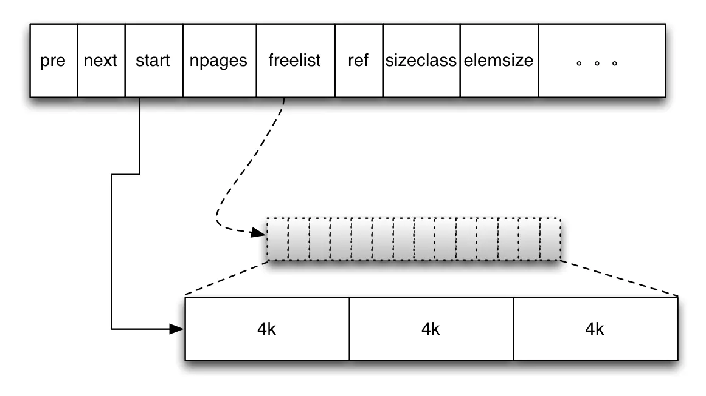
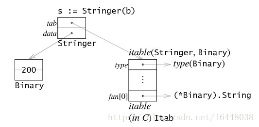
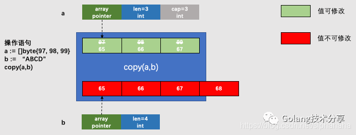
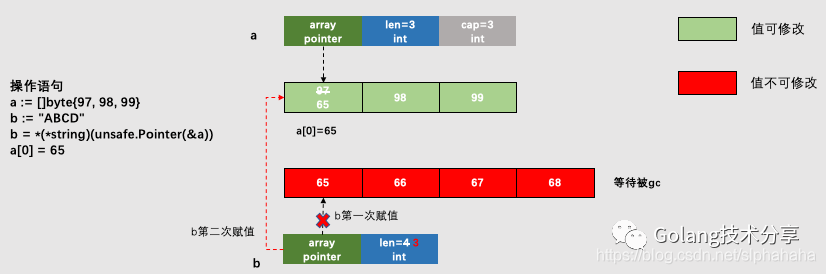

[toc]


#### 1.go map底层原理及实现

总体来说golang的map是hashmap，是使用**数组+链表**的形式实现的，使用**拉链法消除hash冲突**。

golang的map由两种重要的结构，**hmap和bmap**，hmap中包含一个指向bmap数组的指针，key经过hash函数之后得到一个数，这个数低位用于选择bmap(当作bmap数组指针的下标)，高位用于放在bmap的[8]uint8数组中，用于快速试错。然后一个bmap可以指向下一个bmap(拉链)。

Golang中`map`的底层实现是一个散列表，因此实现`map`的过程实际上就是实现散表的过程。在这个散列表中，主要出现的结构体有两个，一个叫**`hmap`**(`a header for a go map`)，一个叫**`bmap`**(`a bucket for a Go map`，通常叫其`bucket`)。这两种结构的样子分别如下所示：

##### **Hmap:**


##### **Bucket:**

Golang的map中用于存储的结构是bucket数组。而bucket(即`bmap`)的结构是怎样的呢？


使用的`map`中的key和value就存储在这里。**“高位哈希值”数组记录的是当前bucket中key相关的“索引”**，稍后会详细叙述。还有一个字段是一个**指向扩容后的bucket的指针，使得bucket会形成一个链表结构**。

##### **hmap和bmap的关系：**


而bucket又是一个链表，所以，整体的结构应该是这样的：


哈希表的特点是会有一个哈希函数，对你传来的key进行哈希运算，得到唯一的值，一般情况下都是一个数值。Golang的`map`中也有这么一个哈希函数，也会算出唯一的值，对于这个值的使用，Golang也是很有意思。

Golang把求得的值按照用途一分为二：**高位和低位**。

**低位用于寻找当前key属于`hmap`中的哪个bucket，而高位用于寻找bucket中的哪个key**。上文中提到：bucket中有个属性字段是“高位哈希值”数组，这里存的就是蓝色的高位值，用来声明当前bucket中有哪些“key”，便于搜索查找。 需要特别指出的一点是：我们`map`中的**key/value值都是存到同一个数组中的**。数组中的顺序是这样的:


这样做的好处是：在key和value的**长度不同**的时候，可**以消除padding(内存对齐)带来的空间浪费**。

现在，我们可以得到Go语言`map`的整个的结构图了：(hash结果的**低位用于选择把KV放在bmap数组中的哪一个**bmap中，**高位用于key的快速预览**，用于快速试错)


##### **map的扩容**

当以上的哈希表增长的时候，Go语言会将bucket数组的数量扩充一倍，产生一个新的bucket数组，并将旧数组的数据迁移至新数组。

**判断扩充的条件**，就是哈希表中的**加载因子**(即loadFactor)。

加载因子是一个阈值，一般表示为：**散列包含的元素数除以位置总数**。是一种“产生冲突机会”和“空间使用”的平衡与折中：加载因子越小，说明空间空置率高，空间使用率小，但是加载因子越大，说明空间利用率上去了，但是“产生冲突机会”高了。

每种哈希表的都会有一个加载因子，数值超过加载因子就会为哈希表扩容。
Golang的map的加载因子的公式是：**map长度 / 2^B**(这是代表bmap数组的长度，B是取的低位的位数)阈值是6.5。其中B可以理解为已扩容的次数。

当Go的map长度增长到大于加载因子所需的map长度时，Go语言就会将**产生一个新的bucket数组**，然后把旧的bucket数组移到一个属性字段**oldbucket**中。

注意：并不是立刻把旧的数组中的元素转义到新的bucket当中，而是，**只有当访问到具体的某个bucket的时候，会把bucket中的数据转移到新的bucket中**。

注意：并不会直接删除旧的bucket，而是**把原来的引用去掉**，利用GC清除内存。

##### **map中数据的删除**

```
1、如果``key``是一个指针类型的，则直接将其置为空，等待GC清除；
2、如果是值类型的，则清除相关内存。
3、同理，对``value``做相同的操作。
4、最后把key对应的高位值对应的数组index置为空。
```

#### 2.sync.map

**并发安全**的map

1. 以空间换效率，通过**read和dirty**两个map来提高读取效率
2. 优先从read map中读取(无锁)，否则再从dirty map中读取(加锁)
3. 动态调整，当misses次数过多时，将dirty map提升为read map
4. 延迟删除，删除只是为value打一个标记，在dirty map提升时才执行真正的删除

`read map` 和 `dirty map` 的**存储方式**是不一致的。

前者使用 **`atomic.Value`**，后者只是单纯的使用 map。原因是 `read map` 使用 `lock free` 操作，必须保证 `load/store` 的**原子性**；而 `dirty map` 的 `load+store` 操作是由 lock（就是 mutex）来保护的。

##### load

1、**首先是 fast path，直接在 read 中找**，如果找到了直接调用 entry 的 load 方法，取出其中的值。
2、如果 read 中没有这个 key，且 amended 为 fase，说明 dirty 为空，那直接返回空和 false。
3、如果 read 中没有这个 key，且 **amended 为 true**，说明 **dirty 中可能存在我们要找的 key**。当然要**先上锁**，再尝试去 dirty 中查找。在这之前，仍然有一个 **double check** 的操作。若还是没有在 read 中找到，那么就从 dirty 中找。不管 dirty 中有没有找到，都要"记一笔"，因为在 dirty 被提升为 read 之前，都会进入这条路。

对于`missLocked`会直接将 misses 的值加 1，表示一次未命中，**如果 misses 值小于 m.dirty 的长度，就直接返回**。否则，将 m.dirty 晋升为 read，并清空 dirty，清空 misses 计数值。这样，之前一段时间新加入的 key 都会进入到 read 中，从而能够提升 read 的命中率。

##### store

1、首先还是**去read map中查询，存在并且p!=expunged,直接修改**。（由于**修改的是 entry 内部的 pointer**，因此 **dirty map 也可见**）
2、如果read map中**存在该key，但p == expunged**。**加锁更新**p的状态，然后直接**更新该entry** (此时m.dirtynil或m.dirty[key]e)
3、如果read map中不存在该Key，但**dirty map中存在该key，直接写入更新entry(read map中仍然没有)**
4、如果read map和dirty map**都不存在该key**

- a. 如果dirty map为空，则需要创建dirty map，并从read map中拷贝未删除的元素
- b. 更新**amended字段，标识dirty map中存在read map中没有的key**
- c. 将k v写入dirty map中，read.m不变

##### delete

1、先去read map中寻找，如果存在就直接删除
2、如果没找到，并且 read.amended为true代表dirty map中存在，依照传统进行 **double check**。
3、read map找到就删除，没找到判断dirty map是否存在，存在了就删除

##### loadorstore

结合了 Load 和 Store 的功能，如果 map 中存在这个 key，那么返回这个 key 对应的 value；否则，将 key-value 存入 map。
这在需要先执行 Load 查看某个 key 是否存在，之后再更新此 key 对应的 value 时很有效，因为 LoadOrStore 可以并发执行。

##### 总结

除了Load/Store/Delete之外，sync.Map还提供了LoadOrStore/Range操作，但没有提供Len()方法，这是因为要统计有效的键值对只能先提升dirty map(dirty map中可能有read map中没有的键值对)，再遍历m.read(由于延迟删除，不是所有的键值对都有效)，这其实就是Range做的事情，因此在不添加新数据结构支持的情况下，sync.Map的长度获取和Range操作是同一复杂度的。这部分只能看官方后续支持。

1、sync.map 是线程安全的，读取，插入，删除也都保持着常数级的时间复杂度。

2、通过**读写分离，降低锁时间来提高效率，适用于读多写少的场景**。

3、Range 操作需要提供一个函数，参数是 k,v，返回值是一个布尔值：f func(key, value interface{}) bool。

4、调用 Load 或 LoadOrStore 函数时，如果在 read 中没有找到 key，则会将 misses 值原子地增加 1，**当 misses 增加到和 dirty 的长度相等时，会将 dirty 提升为 read。以期减少“读 miss”**。

5、**新写入的 key 会保存到 dirty 中**，如果这时 dirty 为 nil，就会先新创建一个 dirty，并将 read 中未被删除的元素拷贝到 dirty。

6、当 dirty 为 nil 的时候，read 就代表 map 所有的数据；**当 dirty 不为 nil 的时候，dirty 才代表 map 所有的数据。**

#### 3.GMP模型

- M结构是Machine，**系统线程**，它由操作系统管理，**goroutine就是跑在M之上的**；M是一个很大的结构，里面维护小对象内存cache（mcache）、当前执行的goroutine、随机数发生器等等非常多的信息。
- P结构是Processor，**处理器(当P有任务时需要创建或者唤醒一个系统线程来执行它队列里的任务。所以P/M需要进行绑定，构成一个执行单元)**，它的主要用途就是用来执行goroutine，它**维护了一个goroutine队列**，即runqueue。Processor的让我们从N:1调度到M:N调度的重要部分。
- G是goroutine实现的核心结构，它包含了栈，指令指针，以及其他对调度goroutine很重要的信息，例如其阻塞的channel。

> Processor的数量是在启动时被设置为环境变量GOMAXPROCS的值，或者通过运行时调度函数GOMAXPROCS()进行设置。Processor数量固定意味着任意时刻只有GOMAXPROCS个线程在运行着go代码

##### 正常情况下

所有的goroutine运行在同一个M系统线程中，每一个M系统线程维护一个Processor，任何时刻，**一个Processor中只有一个goroutine**，其他goroutine在runqueue中**等待**。一个goroutine运行完自己的时间片后，让出上下文，回到runqueue中。 多核处理器的场景下，为了运行goroutines，**每个M系统线程会持有一个Processor**。

如果两个M都在一个CPU上运行，这就是并发；如果两个M在不同的CPU上运行，这就是并行。在正常情况下，scheduler（调度器）会按照上面的流程进行调度，当一个G（goroutine）的时间片结束后将P（Processor）分配给下一个G，但是线程会发生阻塞等情况，看一下goroutine对线程阻塞等的处理。

##### 线程阻塞

当正在运行的goroutine（G0）阻塞的时候，例如进行系统调用，会再创建一个系统线程（M1)，当前的M0线程放弃了它的Processor（P），**P转到新的线程中去运行**。


##### runqueue执行完成

当其中一个Processor的runqueue为空，没有goroutine可以调度，它会从另外一个上下文偷取一半的goroutine。


> 首先创建一个G对象，G对象保存到P本地队列或者是全局队列。P此时去唤醒一个M。P继续执行它的执行序。M寻找是否有空闲的P，如果有则将该G对象移动到它本身。接下来M执行一个调度循环(调用G对象->执行->清理线程→继续找新的Goroutine执行)。
> M执行过程中，随时会发生上下文切换。当发生上线文切换时，需要对执行现场进行保护，以便下次被调度执行时进行现场恢复。Go调度器**M的栈保存在G对象上**，只需要将M所需要的寄存器(SP、PC等)保存到G对象上就可以实现现场保护。当这些寄存器数据被保护起来，就随时可以做上下文切换了，在中断之前把现场保存起来。如果此时G任务还没有执行完，M可以将任务重新丢到P的任务队列，等待下一次被调度执行。当再次被调度执行时，M通过访问G的vdsoSP、vdsoPC寄存器进行现场恢复(从上次中断位置继续执行)。

#### 4.切片和数组

##### 数组

1. Go中的数组是值类型，换句话说，如果你将一个数组赋值给另外一个数组，那么，实际上就是将整个数组拷贝一份。
2. 如果Go中的数组作为函数的参数，那么实际传递的参数是一份数组的拷贝，而不是数组的指针。这个和C要区分开。因此，在Go中如果将数组作为函数的参数传递的话，那效率就肯定没有传递指针高了。
3. array的长度也是Type的一部分，这样就说明[10]int和[20]int是不一样的。在**初始化后长度是固定的**，无法修改其长度。

##### 切片

切片本身并不是动态数组或者数组指针。它内部实现的数据结构**通过指针引用底层数组**，设定相关属性将数据读写操作限定在指定的区域内。**切片本身是一个只读对象，其工作机制类似数组指针的一种封装。**

切片（slice）是对数组一个连续片段的引用，所以切片是一个引用类型（因此更类似于 C/C++ 中的数组类型，或者 Python 中的 list 类型）。这个片段可以是整个数组，或者是由起始和终止索引标识的一些项的子集。需要注意的是，**终止索引标识的项不包括在切片内**。切片提供了一个与指向数组的动态窗口。


给定项的切片索引可能比相关数组的相同元素的索引小。和数组不同的是，**切片的长度可以在运行时修改**，最小为 0 最大为相关数组的长度：切片是一个长度可变的数组。

###### 切片扩容

新的切片和之前的切片已经不同了，因为新的切片更改了一个值，并没有影响到原来的数组，**新切片指向的数组是一个全新的数组**。并且 **cap 容量**也发生了变化。

**扩容的策略**：

**如果切片的容量小于 1024 个元素，于是扩容的时候就翻倍增加容量**。

一旦元素个数**超过 1024 个元素**，那么增长因子就变成 1.25 ，即**每次增加原来容量的四分之一**。

**注意：扩容扩大的容量都是针对原来的切片容量而言的，而不是针对原来数组的长度而言的。**

###### 切片拷贝

有坑，容易在拷贝之后仍旧指向原数组，造成可以修改原数组。

#### 5.GC

##### 垃圾回收常见方法

###### **引用计数（reference counting）**

通过在对象上增加自己被引用的次数，被其他对象引用时加1，引用自己的对象被回收时减1，引用数为0的对象即为可以被回收的对象。这种算法在内存比较紧张和实时性比较高的系统中使用的比较广泛，如ios cocoa框架，php，python等。

优点：方式简单，回收速度快。

缺点：

1. 需要额外的空间存放计数。
2. 无法处理循环引用（如a.b=b;b.a=a这种情况）。
3. 频繁更新引用计数降低了性能。

**标记-清除（mark and sweep）**

该方法分为两步，标记从根变量开始迭代得遍历所有被引用的对象，**对能够通过应用遍历访问到的对象都进行标记为“被引用”**；标记完成后进行清除操作，**对没有标记过的内存进行回收**（回收同时可能伴有碎片整理操作）。

这种方法解决了引用计数的不足，但是也有比较明显的问题：**每次启动垃圾回收都会暂停当前所有的正常代码执行，回收时系统响应能力大大降低**！当然后续也出现了很多mark&sweep算法的变种（如三色标记法）优化了这个问题。

**复制收集**

复制收集的方式只需要对对象进行一次扫描。准备一个「**新的空间**」，从根开始，对对象进行扫，如果存在对这个对象的引用，就把它复制到「新空间中」。**一次扫描结束之后，所有存在于「新空间」的对象就是所有的非垃圾对象。**

这两种方式各有千秋，**标记清除的方式节省内存但是两次扫描需要更多的时间，对于垃圾比例较小的情况占优势。复制收集更快速但是需要额外开辟一块用来复制的内存，对垃圾比例较大的情况占优势。**特别的，复制收集有「**局部性**」的优点。

在复制收集的过程中，会按照对象**被引用的顺序**将对象复制到新空间中。于是，**关系较近的对象被放在距离较近的内存空间的可能性会提高**，这叫做局部性。局部性高的情况下，内存缓存会更有效地运作，程序的性能会提高。

对于标记清除，有一种**标记-压缩**算法的衍生算法：

对于压缩阶段，它的工作就是移动所有的可达对象到堆内存的同一个区域中，使他们紧凑的排列在一起，从而将所有非可达对象释放出来的空闲内存都集中在一起，通过这样的方式来达到**减少内存碎片**的目的。

**分代收集（generation）**

这种收集方式用了程序的一种特性：大部分对象会从产生开始在很短的时间内变成垃圾，而存在的很长时间的对象往往都有较长的生命周期。

根据对象的存活周期不同将内存划分为新生代和老年代，**存活周期短的为新生代，存活周期长的为老年代**。这样就可以根据每块内存的特点采用最适当的收集算法。

新创建的对象存放在称为 新生代（young generation）中（一般来说，新生代的大小会比 老年代小很多）。**高频对新生成的对象进行回收，称为「小回收」，低频对所有对象回收，称为「大回收」**。每一次「小回收」过后，就把存活下来的对象归为老年代，「小回收」的时候，遇到老年代直接跳过。大多数分代回收算法都采用的「复制收集」方法，因为小回收中垃圾的比例较大。

这种方式存在一个问题：如果在某个新生代的对象中，存在「老生代」的对象对它的引用，它就不是垃圾了，那么怎么制止「小回收」对其回收呢？这里用到了一中叫做写屏障的方式。

**程序对所有涉及修改对象内容的地方进行保护，被称为「写屏障」（Write Barrier）。写屏障不仅用于分代收集，也用于其他GC算法中。**

在此算法的表现是，用一个**记录集**来记录从新生代到老生代的引用。如果有两个对象A和B，当对A的对象内容进行修改并加入B的引用时，如果①A是「老生代」②B是「新生代」。则将这个引用加入到记录集中。「小回收」的时候，因为记录集中有对B的引用，所以B不再是垃圾。

##### 三色标记算法

三色标记算法是对标记阶段的改进，原理如下：

1. 起初所有对象都是**白色**。
2. 从根出发扫描**所有可达对象，标记为灰色**，放入待处理队列。
3. 从队列取出灰色对象，将**其引用对象标记为灰色放入队列**，**自身标记为黑色**。
4. 重复 3，**直到灰色对象队列为空**。此时白色对象即为垃圾，进行回收。

三色标记的一个明显好处是**能够让用户程序和 mark 并发的进行**。

##### GO的垃圾回收器

总体采用的是经典的**mark and sweep**算法。

- v1.3以前版本 **STW**（Stop The World）

    go runtime在一定条件下（内存超过阈值或定期如2min），暂停所有任务的执行，进行mark&sweep操作，操作完成后启动所有任务的执行。在内存使用较多的场景下，go程序在进行垃圾回收时会发生非常明显的卡顿现象（Stop The World）。

- v1.3 **Mark STW, Sweep** 并行

    1.3版本中，go runtime**分离了mark和sweep操作**，和以前一样，也是先暂停所有任务执行并启动mark，mark完成后马上就重新启动被暂停的任务了，让sweep任务和普通协程任务一样并行的和其他任务一起执行。如果运行在多核处理器上，go会试图将gc任务放到单独的核心上运行而尽量不影响业务代码的执行。go team自己的说法是减少了50%-70%的暂停时间。

- v1.5 **三色标记法**

    go 1.5正在实现的垃圾回收器是“非分代的、非移动的、并发的、三色的标记清除垃圾收集器”。这种方法的**mark操作是可以渐进执行的而不需每次都扫描整个内存空间**，可以**减少stop the world的时间**。

- v1.8 **混合写屏障**（hybrid write barrier）

    **采用一种混合的 write barrier 方式来避免堆栈重新扫描。**

    混合屏障的优势在于它**允许堆栈扫描永久地使堆栈变黑**（没有STW并且没有写入堆栈的障碍），这**完全消除了堆栈重新扫描的需要**，从而消除了对堆栈屏障的需求。重新扫描列表。特别是堆栈障碍在整个运行时引入了显着的复杂性，并且干扰了来自外部工具（如GDB和基于内核的分析器）的堆栈遍历。

    混合屏障不需要读屏障，因此指针读取是常规的内存读取; 它确保了进步，因为物体单调地从白色到灰色再到黑色。

    混合屏障的缺点很小。它可能会导致更多的浮动垃圾，**因为它会在标记阶段的任何时刻保留从根（堆栈除外）可到达的所有内容。**然而，在实践中，当前的Dijkstra障碍可能几乎保留不变。混合屏障还禁止某些优化：特别是，如果Go编译器可以静态地显示指针是nil，则Go编译器当前省略写屏障，但是在这种情况下混合屏障需要写屏障。这可能会略微增加二进制大小。

**小结：**

通过go team多年对gc的不断改进和忧化，GC的卡顿问题在1.8 版本基本上可以做到 1 毫秒以下的 GC 级别。 实际上，**gc低延迟是有代价的，其中最大的是吞吐量的下降**。由于需要**实现并行处理，线程间同步和多余的数据生成复制都会占用实际逻辑业务代码运行的时间**。GHC的全局停止GC对于实现高吞吐量来说是十分合适的，而Go则更擅长与低延迟。
并行**GC的第二个代价是不可预测的堆空间扩大**。程序在GC的运行期间仍能不断分配任意大小的堆空间，因此我们需要在到达最大的堆空间之前实行一次GC，但是过早实行GC会造成不必要的GC扫描，这也是需要衡量利弊的。因此在使用Go时，需**要自行保证程序有足够的内存空间**。

##### GC流程

GO的GC是并行GC, 也就是**GC的大部分处理和普通的go代码是同时运行**的, 这让GO的GC流程比较复杂.

1. Stack scan：收集根对象（全局变量，和G stack），开启写屏障。全局变量、开启写屏障需要STW，G stack只需要停止该G就好**，时间比较少。
2. Mark: 标记所有根对象**, **和根对象可以到达的所有对象不被回收**。
3. Mark Termination: **重新扫描全局变量，和上一轮改变的stack（写屏障），完成标记工作。这个过程需要STW**。
4. Sweep: **按标记结果清扫span**

目前整个GC流程会进行两次STW(Stop The World), 第一次是Stack scan阶段, 第二次是Mark Termination阶段.

第一次STW会准备根对象的扫描, 启动写屏障(Write Barrier)和辅助GC(mutator assist).

第二次STW会重新扫描部分根对象, 禁用写屏障(Write Barrier)和辅助GC(mutator assist).

##### 写屏障

因为go支持**并行GC**, GC的扫描和go代码可以同时运行, 这样带来的问题是**GC扫描的过程中go代码有可能改变了对象的依赖树。**

例如开始扫描时发现根对象A和B, B拥有C的指针。

1. GC先扫描A，A放入黑色
2. B把C的指针交给A
3. GC再扫描B，B放入黑色
4. C在白色，会回收；但是A其实引用了C。

为了避免这个问题, **go在GC的标记阶段会启用写屏障**(Write Barrier).

启用了写屏障(Write Barrier)后，在GC第三轮rescan阶段，根据写屏障标记将C放入灰色，防止C丢失。

#### 6.sync pool的实现原理

用来**保存和复用临时对象**，以减少内存分配，降低CG压力。它池化的对象会在未来的某个时候被毫无预兆地移除掉。而且，如果没有别的对象引用这个被移除的对象的话，这个被移除的对象就会被垃圾回收掉。

1. sync.Pool 本身就是**线程安全**的，多个 goroutine 可以并发地调用它的方法存取对象；
2. sync.Pool **不可在使用之后再复制使用**。

Go 1.13 之前的 sync.Pool 的实现有 2 大问题：

1. **每次 GC 都会回收创建的对象**。导致get命中率下降；
2. **底层实现使用了 Mutex**，对这个锁并发请求竞争激烈的时候，会导致性能的下降。

在 Go 1.13 中，sync.Pool 做了大量的优化。**Go 对 Pool 的优化就是避免使用锁，同时将加锁的 queue 改成 lock-free 的 queue 的实现，给即将移除的元素再多一次“复活”的机会。**

sync.Pool 的数据结构如下图所示：


Pool 最重要的两个字段是 **local 和 victim**，因为它们两个主要用来**存储空闲的元素**。

**每次垃圾回收的时候，Pool 会把 victim 中的对象移除，然后把 local 的数据给 victim**，这样的话，local 就会被清空，而 victim 就像一个**垃圾分拣站**，里面的东西可能会被当做垃圾丢弃了，但是里面有用的东西也可能被捡回来重新使用。

victim 中的元素如果被 Get 取走，那么这个元素就很幸运，因为它又“活”过来了。但是，如果这个时候 Get 的并发不是很大，元素没有被 Get 取走，那么就会被移除掉，因为没有别人引用它的话，就会被垃圾回收掉。

所有当前主要的空闲可用的元素都存放在 local 字段中，**请求元素时也是优先从 local 字段中查找可用的元素**。local 字段包含一个 `poolLocalInternal` 字段，并提供 CPU 缓存对齐，从而避免 false sharing。

而 poolLocalInternal 也包含两个字段：private 和 shared。

- private，代表一个缓存的元素，而且**只能由相应的一个 P 存取**。因为一个 P 同时只能执行一个 goroutine，所以不会有并发的问题。
- shared，可以**由任意的 P 访问**，但是只有本地的 P 才能 pushHead/popHead，其它 P 可以 popTail，相当于**只有一个本地的 P 作为生产者（Producer），多个 P 作为消费者（Consumer），它是使用一个 local-free 的 queue 列表实现的**。

sync.Pool提供了三个对外的方法：

##### New

Pool struct 包含一个 New 字段，这个字段的类型是**函数 func() interface{}**。当调用 Pool 的 Get 方法从池中获取元素，没有更多的空闲元素可返回时，就会调用这个 New 方法来创建新的元素。如果你没有设置 New 字段，没有更多的空闲元素可返回时，Get 方法将返回 nil，表明当前没有可用的元素。New 是可变的字段。这就意味着，你可以在程序运行的时候改变创建元素的方法。

##### Get

会从 Pool**取走**一个元素，这也就意味着，这个元素会从 Pool 中移除，返回给调用者。不过，除了返回值是正常实例化的元素，Get 方法的返回值还可能会是一个 nil。

###### 原理

首先，从**本地的 private 字段中获取可用元素**，因为没有锁，获取元素的过程会非常快，如果没有获取到，就尝试从**本地的 shared** 获取一个，如果还没有，会使用 `getSlow` 方法去其它的 shared 中“偷”一个。最后，如果没有获取到，就尝试使用 New 函数创建一个新的。

重点是 getSlow 方法，它**首先要遍历所有的 local，尝试从它们的 shared 弹出一个元素**。如果还没找到一个，那么，就开始对 victim 下手了。在 vintim 中查询可用元素的逻辑还是一样的，**先从对应的 victim 的 private 查找，如果查不到，就再从其它 victim 的 shared 中查找。**

##### Put

将一个元素返还给 Pool，Pool 会把这个元素保存到池中，并且可以复用。但如果 Put 一个 nil 值，Pool 就会忽略这个值。

###### 原理

**优先设置本地 private**，如果 private 字段已经有值了，那么就**把此元素 push 到本地队列**中。

##### 坑

###### 内存泄露

例如使用sync,Pool做buffer池的时候，可以往这个元素中增加大量的 byte 数据，这会导致**底层的 byte slice 的容量可能会变得很大**。这个时候，**即使 Reset 再放回到池子中，这些 byte slice 的容量不会改变，所占的空间依然很大**。而且，因为 Pool 回收的机制，**这些大的 Buffer 可能不被回收，而是会一直占用很大的空间**，这属于内存泄漏的问题。

在使用 sync.Pool 回收 buffer 的时候，**一定要检查回收的对象的大小**。如果 buffer 太大，就不要回收了，否则就太浪费了。

###### 内存浪费

池子中的 buffer 都比较大，但在实际使用的时候，很多时候只需要一个小的 buffer，这也是一种浪费现象。

要做到物尽其用，尽可能不浪费的话，我们可以**将 buffer 池分成几层**。首先，小于 512 byte 的元素的 buffer 占一个池子；其次，小于 1K byte 大小的元素占一个池子；再次，小于 4K byte 大小的元素占一个池子。这样分成几个池子以后，就可以**根据需要，到所需大小的池子中获取 buffer 了。**

#### 7.map里面解决hash冲突怎么做的，冲突了元素放在头还是尾？

拉链法。HashMap在JDK7用的是头插法，理由是刚放入的是热点数据，更容易被继续访问到，但这其实是个伪命题,因为JDK7中rehash的时候，旧链表迁移新链表的时候，如果在新表的数组索引位置相同，则链表元素会倒置(就是因为头插) 所以最后的结果 还是打乱了插入的顺序 。在JDK8开始容易造成死链接，而且如果链表的长度大于等于8 ，那么链表将转化为红黑树；当长度小于等于6时，又会变成一个链表。

#### 8.channel有无缓冲槽的区别，主要还是从同步和异步来讲

无缓冲的用来做同步的，如果向channel发送数据或者接受数据没有被对方消费的话，就会阻塞，有缓冲的在达到设定上限之前不会阻塞。

#### 9.Java和go的共同点和区别

1.函数重载

Go上**不允许函数重载**，**必须具有方法和函数的唯一名称**。java允许函数重载。

2.多态

Java默认允许**多态**。而，Go没有。

3.路由配置

Go语言使用HTTP协议进行路由配置；而java使用Akka.routing.ConsistentHashingRouter和Akka.routing.ScatterGatherFirstCompletedRouter进行路由配置。

4.可扩展性

Go代码可以自动扩展到多个核心；而，Java并不总是具有足够的可扩展性。

5.继承

Go语言的**继承通过匿名组合完成**：基类以Struct的方式定义，子类只需要把基类作为成员放在子类的定义中，**支持多继承**。Java的继承通过extends关键字完成，不支持多继承。

#### 10.go的优势

1.性能

2.易学性

3.并发性&通道

4.编译快速

5.Gofmt，强制代码格式

**缺点**：

错误处理、框架、软件包管理

#### 12.怎么限制gouroutine的数量？

带缓冲的chan通道，chan满了就阻塞。

优雅：做一个goroutine池，同时加入waitgroup，等待所有结束了再退出。

#### 14.go内存分配机制


从图中，很容易看到有三大模块：**Heap, Cental,Cache**。central在实际逻辑中是属于heap的子模块。

##### Cache

**1.Cache**：**线程私有的**，每个线程都有一个cache，**用来存放小对象**。由于每个线程都有cache，所以**获取空闲内存是不用加锁的**。cache层的主要目的就是**提高小内存的频繁分配释放速度**。 我们在写程序的时候，其实绝大多数的内存申请都是小于32k的，属于小对象，因此这样的内存分配全部走本地cache，不用向操作系统申请显然是非常高效的。

从cache中申请内存的函数是：`void *runtime·MCache_Alloc(MCache *c, int32 sizeclass, uintptr size, int32 zeroed)`

参数size是要申请的内存大小，这个大小可能比申请内存时指定的大小稍大。


 从图可以看到cache有一个容量为61的**数组list**，**每个数组单元挂一个链表**，链表的每个节点就是一块**可用内存**，**同一个链表中节点的大小是一样的**，但是**不同数组单元的链表下的节点大小是不一样的**，数组的下标（0-60）就是不同的sizeclass。

**MCache_Alloc分配内存的过程**是：根据**sizeclass参数**从list中取出一个内存块**链表**，如果这个链表不为空，就**把这个链表的可用节点返回**；==如果为空，说明cache中没有满足此类大小的缓存内存，就要从central中去取一部分此类大小的缓存，再把第一个节点返回使用，其他剩余的内存块挂到这个链表上，为下一次分配作准备。== cache的内存分配逻辑很简单，就是cache取不到就从central取。除去内存分配外，cache上还有很多**状态计数器**，主要用来统计内存分配情况，如：**分配的内存量，缓存的内存量**等，用于其它相关类查询内存情况以及profile等。

​    cache释放主要有两个条件：a，**某个内存链表过长**（>=256 ）时，会截取此链表的一部分节点，返还给central；b，**整个cache缓存过大**（>=1M）,同样将每个链表返还部分节点给central。

##### Central

**2.Central**:**所有线程共享的组件**，不是独占的，因此**需要加锁**操作。它其实也是一个**缓存**，**cache的一个上游用户**，但缓存的不是小对象内存块，而是**一组一组的内存page**（一个page4K）。从图2可以看出，**在heap结构里，使用了一个0到n的数组来存储了一批central**，并不是只有一个central对象。从上面结构定义可以知道这个**数组长度位61个元素**，也就是说**heap里其实是维护了61个central**，这61个central对应了cache中的list数组，也就是**每一个sizeclass就有一个central**。所以，**在cache中申请内存时，如果在某个sizeclass的内存链表上找不到空闲内存，那么cache就会向对应的sizeclass的central获取一批内存块**。注意，这里central数组的定义里面使用填充字节，这是因为**多线程会并发访问不同central避免false sharing**。

```go
struct MCentral
{
        Lock;
        int32 sizeclass;
        MSpan nonempty;
        MSpan empty;
        int32 nfree;
};
```

nonempty和empty两个字段很重要，它们都是**MSpan类型**，这两个字段**分别挂一个span节点构造的双向链表**，只是这个双向链表的**头节点不作使用**。**nonempty意思是非空**，表示这个链表上存储的span节点都是非空状态，也就是说这些**span节点都有空闲的内存**，empty表示span都是空的，没有空闲可用。**一开始，empty就是空的，当nonempty上的一个span被用完后，就会将span移到empty中**。

central内存分配过程： central通过``int32 runtime·MCentral_AllocList(MCentral *c, int32 n, MLink **pfirst)``方法获取一批内存给cache。这个逻辑也很简单，但是要关注下填充nonempty的情况，也就是**central没有空闲内存要向heap申请**的情况。这里是调用MCentral_Grow函数实现。首先通过MHeap_Alloc**向heap申请一个span**，然后**将span给切分成central对应的sizeclass的小内存块**，**将这些小内存块串成链表挂在span的freelist上**，最后**将span放到nonempty链表中**。central一次只申请一个span，这个span含有多少page是根据central对应的sizeclass确定。

central的释放过程：**ceche释放的时候，是将一批小内存块返还给central**，central在接收到内存块的时候，会**把每个内存块分配返还给对应的span**，在把内存返还给span后，如果span先前被用完内存，待在empty中那么此刻就需要把它移到nonempty中，表示又有内存用了。在归还内存块给span后，**如果span的每个page内存都回收回来了，也就是没有任何内存被使用了，此刻就将这个span整体归还给heap了。**

central这一层管理的**粒度就是span**，所以span是一个非常重要的工具组件。

##### Heap

**3.Heap：****所有底层线程共享**，是离go程序最远的一层，也是离OS最近的一层。主要是**从OS申请内存交给central**。在64位平台，heap从OS申请到的**内存地址保留区是136G，而bitmap要8G空间，因此真正可申请的内存就是128G。

无论是分配小内存还是大对象，都需要通过``MSpan* runtime·MHeap_Alloc(MHeap *h, uintptr npage, int32 sizeclass, int32 acct, int32 zeroed)``函数。**向heap要内存，不是以字节为单位，而是page**（npage参数）。**sizeClass为0表示绕过cache和central直接分配大内存**。从heap申请的page肯定是连续的，并通过span来管理。所有返回值是一个span而不是page数组。

**heap内存分配过程**：分配逻辑位于mheap.c中的MHeap_AllocLocked函数。图2中可以看出，heap结构中包括**free和large**两个域，free是一个256个单元的数组，每个单元上存储一个span链表，但不同的单元span含有page的个数也是不同的。span含page的个数等于span在数组中的单元下标（index，free【2】含有2个page）。如果一个span的page数超过255，那这个span就被放到large链表中。**从heap要内存，要根据page的数目从free或large链表中获取合适的span**。如果page大到连large链表中都没有合适的span，就只能调用MHeap_Grow函数从OS中去申请，填充heap，再试图分配。拿到的span所含的page数目大于了请求的page数目，并不会将这个span返回，而是将其拆分成两个span，将剩余span重新放回free或large链表中去。全部返回就太浪费了。

heap的释放：**central交还heap内存的时候，主要也就是将span放到free或large链表中去**。

heap复杂的不是分配内存，而是要维护很多元数据，比如图2中的**map域，维护的就是page到span的映射**，也就是任何一块内存在算出page后也就知道它属于哪个span了，这样才能做到正确回收内存。**bitmap结构，用来标记内存，为gc服务**。

总的来说，小对象的分配顺序是：

**canche（返回一个内存块）->central(返回一个包含一系列内存块的链表)->heap(返回一个span)->MM(返回span)**

##### MSpan

 MSPan是**内存分配器的基础工具组件**，简称span，是**用来管理一组组page对象**。page就是一个**4k大小的内存块**。span将这一个个连续的page给管理起来。



span是一个**双向链表**（pre/next）。**span可能用于分配小对象，也可以用来分配大对象**。分配不同的对象，span管理的元数据不相同。npages表示此span存储的page的个数。start可以看作一个page指针，指向第一个page，这样可以可以很容易的获取后续其它page了，因为它们是连续的。start的类型的pageID，所以可以看出**start保存的不是第一个page的起始地址，而是第一个page的id值**。这个id是算出来的（**page的地址除以4096**，当然需要保证每个page按4k对齐）。start是span最重要的字段，小对象时，它维护好所有的page，最后page会被切成一个一个连续的内存，内存块大小是小对象的大小，切分出来的内存块将被链接成一个链表挂在freelist字段上。sizeclass为0时，表示大对象，这个时候freelist就没什么用了。

**应用层面用new和用make分配内存**

new：内建函数new（T）分配了零值填充的T类型的内存空间，并返回其地址。**一个*T类型的值**。用go的术语说，**它返回了一个指针，指向新分配的类型T的零值**。使用者用new创建的一个数据结构的实体并可以直接工作。如bytes.Buffer的文档所述：Buffer的零值是一个准备好了的空缓存。

make：内建函数**make（T，args）只能创建slice，map和channel，**并**返回一个有初始值（非零）的T类型，而不是*T**。导致这三个类型有所不同的原因是指向数据结构的引用在使用前必须初始化。如，一个slice，是一个包含指向数据（内部array）的指针，长度和容量的三项描述，在这些项目初始化之前，slice为nil。对于slice，map和channel，make初始化了内部的数据结构，填充适当的值。

**务必记得 make 仅适用于 map，slice 和 channel，并且返回的不是指针。应当用 new 获得特定的指针**.

#### 15.go的多态实现

Golang中的多态可以通过接口来实现。**定义接口的所有方法的任何类型都表示隐式实现该接口。类型接口的变量可以保存实现该接口的任何值。**接口的这个属性用于实现GO的多态性。

```go
package main
import (
	"fmt"
)
 
type Person interface {
	SayHello()
}
type Girl struct {
	Sex string
}
type Boy struct {
	Sex string
}
 
func (this *Girl) SayHello() {
	fmt.Println("Hi, I am a " + this.Sex)
}
 
func (this *Boy) SayHello() {
	fmt.Println("Hi, I am a " + this.Sex)
}
 
func main() {
	g := &Girl{"girl"}
	b := &Boy{"boy"}
	
	p := map[int]Person{}
	p[0] = g
	p[1] = b
 
	for _, v := range p {
		v.SayHello()
	} 
}
```

#### 16.interface的底层实现

**Go的interface是由两种类型来实现的：iface和eface。**其中，**iface表示的是包含方法的interface**，例如：

```Go
type Person interface {
    Print()
}
```

而**eface代表的是不包含方法的interface**，即

```go
type Person interface {}
```

或者

```Go
var person interface{} = xxxx实体
```

##### eface


一共有两个属性构成，一个是**类型信息**`_type`，一个是**数据信息**。
其中，`_type`可以认为是Go语言中所有类型的公共描述，Go语言中几乎所有的数据结构都可以抽象成`_type`，是所有类型的表现，可以说是万能类型，`data`是指向具体数据的指针。

赋值后：


##### iface


`itab`是`iface`不同于`eface`比较关键的数据结构。其可包含两部分：一部分是确定唯一的**包含方法的interface的具体结构类型**，一部分是**指向具体方法集的指针**。

进行赋值之后：



#### 17.golang的context包

Go 标准库的 Context 不仅提供了上下文传递的信息，还提供了 cancel、timeout 等其它信息。

context本质上的数据结构是树。context的创建者称为root节点，其一般是一个处理上下文的独立goroutine。r**oot节点负责创建Context的具体对象，并将其传递到其下游调用的goroutine**. 下游的goroutine可以继续封装改Context对象（使用装饰者模式）再传递更下游的goroutine.这些**下游goroutine的Context 对象实例都要逐层向上注册。这样通过root节点的Context对象就可以遍历整个Context对象树**，所以通知也能通知到下游的goroutine.

##### 使用场景

- 上下文信息传递 （request-scoped），比如处理 http 请求、在请求处理链路上传递信息；
- 控制子 goroutine 的运行；
- 超时控制的方法调用；
- 可以取消的方法调用。

##### 实现方法

包 context 定义了 Context 接口：

```go
type Context interface {
    Deadline() (deadline time.Time, ok bool)
    Done() <-chan struct{}
    Err() error
    Value(key interface{}) interface{}
}
```

- **Deadline 方法会返回这个 Context 被取消的截止日期**。如果没有设置截止日期，ok 的值是 false。
- **Done 方法返回一个 Channel 对象**。在 Context 被取消时，此 Channel 会被 close，如果没被取消，可能会返回 nil。**如果 Done 没有被 close，Err 方法返回 nil；如果 Done 被 close，Err 方法会返回 Done 被 close 的原因**。
- **Value 返回此 ctx 中和指定的 key 相关联的 value。**

Context 中实现了 **2 个常用的生成顶层 Context 的方法**。

- **context.Background()**：返回一个非 nil 的、空的 Context，没有任何值，不会被 cancel，不会超时，没有截止日期。一般用在主函数、初始化、测试以及创建根 Context 的时候。
- **context.TODO()**：返回一个非 nil 的、空的 Context，没有任何值，不会被 cancel，不会超时，没有截止日期。当你不清楚是否该用 Context，或者目前还不知道要传递一些什么上下文信息的时候，就可以使用这个方法。

##### 使用规则

1. 一般函数使用 Context 的时候，会把这个参数放在**第一个参数**的位置。
2. 从来**不把 nil 当做 Context 类型的参数值**，可以使用 context.Background() 创建一个空的上下文对象，也不要使用 nil。
3. Context 只用来**临时做函数之间的上下文透传，不能持久化 Context 或者把 Context 长久保存**。把 Context 持久化到数据库、本地文件或者全局变量、缓存中都是错误的用法。
4. **key 的类型不应该是字符串类型或者其它内建类型，否则容易在包之间使用 Context 时候产生冲突**。使用 WithValue 时，key 的类型应该是自己定义的类型。
5. 常常使用 **struct{}作为底层类型定义 key 的类型**。对于 exported key 的静态类型，常常是接口或者指针。这样可以尽量减少内存分配。

##### 创建特殊用途context

###### WithValue

WithValue 基于 parent Context 生成一个新的 Context，保存了一个 key-value 键值对。它常常用来传递上下文。

```go
type valueCtx struct {
    Context
    key, val interface{}
}
```

它持有一个 key-value 键值对，还持有 parent 的 Context。**它覆盖了 Value 方法，优先从自己的存储中检查这个 key，不存在的话会从 parent 中继续检查。**

Go 标准库实现的 Context 还实现了**链式查找**。如果不存在，还会向 parent Context 去查找，如果 parent 还是 valueCtx 的话，还是遵循相同的原则：valueCtx 会嵌入 parent，所以还是会查找 parent 的 Value 方法的。

###### WithCancel

返回parent的副本，只是副本中的**Done channel是新建的对象**，它的类型是**cancelCtx**

###### WithTimeout

和WithDeadline一样，只不过一个参数是**超时时间**，一个是**截止时间**

###### WithDeadline

返回一个parent的副本，并且设置了一个不晚于参数d的截止时间，类型为timerCtx（或者是cancelCtx）

#### 18.string类型转为[]byte发生了什么？

byte是uint8的别名,string是8位字节的集合，通常但不一定代表UTF-8编码的文本。string可以为空，但是不能为nil。**string的值是不能改变的。**

string定义如下：

```go
type stringStruct struct {
	str unsafe.Pointer
	len int
}
```

stringStruct代表的就是一个string对象，str指针指向的是某个数组的首地址，len代表的数组长度。

string与[]byte在底层结构上是非常的相近（**后者的底层表达仅多了一个cap属性，因此它们在内存布局上是可对齐的**），这也就是为何builtin中内置函数copy会有一种特殊情况`copy(dst []byte, src string) int`的原因了。对于[]byte与string而言，**两者之间最大的区别就是string的值不能改变。**

字符串的值不能被更改，但**可以被替换**。 string结构体的**str指针指向的是一个字符常量的地址**， 这个地址里面的内容是不可以被改变的，因为它是**只读**的，但是这个**指针可以指向不同的地址**。

##### 标准转换

###### string转[]byte

源码在`src/runtime/string.go`中

```go
// The constant is known to the compiler.
// There is no fundamental theory behind this number.
const tmpStringBufSize = 32

type tmpBuf [tmpStringBufSize]byte

func stringtoslicebyte(buf *tmpBuf, s string) []byte {
	var b []byte
	if buf != nil && len(s) <= len(buf) {
		*buf = tmpBuf{}
		b = buf[:len(s)]
	} else {
		b = rawbyteslice(len(s))
	}
	copy(b, s)
	return b
}

// rawbyteslice allocates a new byte slice. The byte slice is not zeroed.
func rawbyteslice(size int) (b []byte) {
	cap := roundupsize(uintptr(size))
	p := mallocgc(cap, nil, false)
	if cap != uintptr(size) {
		memclrNoHeapPointers(add(p, uintptr(size)), cap-uintptr(size))
	}

	*(*slice)(unsafe.Pointer(&b)) = slice{p, size, int(cap)}
	return
}
```

这里有两种情况：**s的长度是否大于32**。当大于32时，go需要**调用mallocgc分配一块新的内存**（大小由s决定），**当x的数据较大时，标准转换方式会有一次分配内存的操作**。

最后**通过copy函数实现string到[]byte的拷贝**，具体实现在``src/runtime/slice.go``中的``slicestringcopy``方法。

```go
func slicestringcopy(to []byte, fm string) int {
	if len(fm) == 0 || len(to) == 0 {
		return 0
	}

  // copy的长度取决与string和[]byte的长度最小值
	n := len(fm)
	if len(to) < n {
		n = len(to)
	}

  // 如果开启了竞态检测 -race
	if raceenabled {
		callerpc := getcallerpc()
		pc := funcPC(slicestringcopy)
		racewriterangepc(unsafe.Pointer(&to[0]), uintptr(n), callerpc, pc)
	}
  // 如果开启了memory sanitizer -msan
	if msanenabled {
		msanwrite(unsafe.Pointer(&to[0]), uintptr(n))
	}

  // 该方法将string的底层数组从头部复制n个到[]byte对应的底层数组中去（这里就是copy实现的核心方法，在汇编层面实现 源文件为memmove_*.s）
	memmove(unsafe.Pointer(&to[0]), stringStructOf(&fm).str, uintptr(n))
	return n
}
```

copy实现：



###### []byte转string

```go
// Buf is a fixed-size buffer for the result,
// it is not nil if the result does not escape.
func slicebytetostring(buf *tmpBuf, b []byte) (str string) {
	l := len(b)
	if l == 0 {
		// Turns out to be a relatively common case.
		// Consider that you want to parse out data between parens in "foo()bar",
		// you find the indices and convert the subslice to string.
		return ""
	}
  // 如果开启了竞态检测 -race
	if raceenabled {
		racereadrangepc(unsafe.Pointer(&b[0]),
			uintptr(l),
			getcallerpc(),
			funcPC(slicebytetostring))
	}
  // 如果开启了memory sanitizer -msan
	if msanenabled {
		msanread(unsafe.Pointer(&b[0]), uintptr(l))
	}
	if l == 1 {
		stringStructOf(&str).str = unsafe.Pointer(&staticbytes[b[0]])
		stringStructOf(&str).len = 1
		return
	}

	var p unsafe.Pointer
	if buf != nil && len(b) <= len(buf) {
		p = unsafe.Pointer(buf)
	} else {
		p = mallocgc(uintptr(len(b)), nil, false)
	}
	stringStructOf(&str).str = p
	stringStructOf(&str).len = len(b)
  // 拷贝字节数组至字符串
	memmove(p, (*(*slice)(unsafe.Pointer(&b))).array, uintptr(len(b)))
	return
}

// 实例stringStruct对象
func stringStructOf(sp *string) *stringStruct {
	return (*stringStruct)(unsafe.Pointer(sp))
}
```

可见，当数组长度超过32时，同样需要调用**mallocgc分配一块新内存**。最后通过**memmove完成拷贝**。

##### 强转换

###### 1.万能的unsafe.Pointer指针

在go中，**任何类型的指针*T都可以转换为unsafe.Pointer类型的指针**，它可以**存储任何变量的地址**。同时，unsafe.Pointer类型的指针也可以**转换回普通指针**，而且可以**不必和之前的类型*T相同**。另外，unsafe.Pointer类型还可以**转换为uintptr类型**，该类型**保存了指针所指向地址的数值**，从而可以使我们对地址进行数值计算。以上就是强转换方式的实现依据。

而string和slice在reflect包中，对应的结构体是``reflect.StringHeader和reflect.SliceHeader``，它们是string和slice的运行时表达。

```go
type StringHeader struct {
	Data uintptr
	Len  int
}
type SliceHeader struct {
	Data uintptr
	Len  int
	Cap  int
}
```

###### 2.内存布局

从string和slice的运行时表达可以看出，除了SilceHeader多了一个int类型的**Cap字段**，Date和Len字段是一致的。所以，它们的内存布局是可对齐的，这说明我们就可以直接通过unsafe.Pointer进行转换。

###### []byte转string



###### string转[]byte图解


##### 为啥强转换性能会比标准转换好？

对于标准转换，无论是从[]byte转string还是string转[]byte都会涉及**底层数组的拷贝**。**而强转换是直接替换指针的指向**，从而使得string和[]byte指向同一个底层数组。这样，当然后者的性能会更好。

##### 为啥在上述测试中，当x的数据较大时，标准转换方式会有一次分配内存的操作，从而导致其性能更差，而强转换方式却不受影响？

标准转换时，当数据长度大于32个字节时，需要通过**mallocgc申请新的内存，之后再进行数据拷贝工作**。而强转换只是更改指针指向。所以，当转换数据较大时，两者性能差距会愈加明显。

##### 既然强转换方式性能这么好，为啥go语言提供给我们使用的是标准转换方式？

首先，我们需要知道Go是一门类型安全的语言，而安全的代价就是性能的妥协。但是，性能的对比是相对的，这点性能的妥协对于现在的机器而言微乎其微。另外强转换的方式，会给我们的程序带来极大的安全隐患。

##### 为啥string要设计为不可修改的？

string不可修改，意味它是**只读**属性，这样的好处就是：在**并发场景下，我们可以在不加锁的控制下，多次使用同一字符串**，在保证高效共享的情况下而不用担心安全问题。

#### 19.实现一个压测工具

golang编写一个http客户端，支持参数http request -c 5 -r 1000 http://**** 客户端，输出所有响应

#### 20.map怎么实现顺序读取？

借助额外的数据结构比如slice 等，对key进行排序，遍历slice得到顺序输出。

#### 21.协程泄漏

如果你启动了一个 **goroutine，但并没有符合预期的退出**，直到程序结束，此goroutine才退出，这种情况就是 goroutine 泄露。当 goroutine 泄露发生时，该 goroutine 的**栈(一般 2k 内存空间起)一直被占用不能释放**，goroutine 里的函数**在堆上申请的空间也不能被垃圾回收器回收**。

#### 22.空结构体的用处

空结构体不占用内存空间，地址不变

1. **实现集合set**

    Go 语言标准库没有提供 Set 的实现，通常使用 map 来代替。而**对于集合来说，只需要 map 的键，而不需要值**。

    声明为`map[string]struct{}`，由于struct{}是空，不关心内容，这样map便改造为set 。

    map可以通过“comma ok”机制来获取该key是否存在,例如`_, ok := map["key"]`,如果没有对应的值，ok为false。可以通过定义成`map[string]struct{}`的形式，**值不再占用内存**。其值仅有两种状态，有或无。如果定义的是`map[string]bool`，则结果有true、false或没有三种状态，而且即使是将值设置为 bool 类型，也会多占据 1 个字节。因此呢，将 map 作为集合(Set)使用时，可以将值类型定义为空结构体，**仅作为占位符使用**即可。

2. 实现chan struct{} 不占用内存空间，**实现传递信号的通道**，不发送数据

3. **仅包含方法的结构体**

    在部分场景下，结构体只包含方法，不包含任何的字段。这时候我们就可以使用空结构体。

#### 23.Go的Mutex和RWmutex及实现原理

##### Mutex互斥锁

Lock、Unlock


###### 初版

通过一个 **flag 变量**，标记当前的锁是否被某个 goroutine 持有。如果这个 flag 的值是 1，就代表锁已经被持有，那么，其它竞争的 goroutine 只能等待；如果这个 flag 的值是 0，就可以通过 **CAS** 将这个 flag 设置为 1，标识锁被当前的这个 goroutine 持有了。

CAS 指令将**给定的值**和**一个内存地址中的值**进行比较，如果它们是同一个值，就使用新值替换内存地址中的值，这个操作是原子性的。


**Unlock 方法可以被任意的 goroutine 调用释放锁，即使是没持有这个互斥锁的 goroutine，也可以进行这个操作。这是因为，Mutex 本身并没有包含持有这把锁的 goroutine 的信息，所以，Unlock 也不会对此进行检查。Mutex 的这个设计一直保持至今。**

###### 给新人机会


这个字段的第一位（最小的一位）来表示这个锁是否被持有，第二位代表是否有唤醒的 goroutine，剩余的位数代表的是等待此锁的 goroutine 数。所以，state 这一个字段被分成了三部分，代表三个数据。


**在锁释放唤醒之后，它并不能像先前一样直接获取到锁，还是要和正在请求锁的 goroutine 进行竞争**。这会**给后来请求锁的 goroutine 一个机会**，也**让 CPU 中正在执行的 goroutine 有更多的机会获取到锁**，在一定程度上提高了程序的性能。

**释放锁**的时候：

第一种情况，如果没有其它的 waiter，说明对这个锁的竞争的 goroutine 只有一个，那就可以直接返回了；如果这个时候有唤醒的 goroutine，或者是又被别人加了锁，那么，无需我们操劳，其它 goroutine 自己干得都很好，当前的这个 goroutine 就可以放心返回了。

第二种情况，如果有等待者，并且没有唤醒的 waiter，那就需要**唤醒一个等待的 waiter**。在唤醒之前，需要将 waiter 数量减 1，并且将 mutexWoken 标志设置上，这样，Unlock 就可以返回了。

**相对于初版的设计，这次的改动主要就是，新来的 goroutine 也有机会先获取到锁，甚至一个 goroutine 可能连续获取到锁，就会减少上下文的切换，提高效率，打破了先来先得的逻辑。**

###### 多给些机会

如果新来的 goroutine 或者是被唤醒的 goroutine 首次获取不到锁，它们就会通过**自旋**（spin，通过循环不断尝试）的方式，尝试检查锁是否被释放。在尝试一定的自旋次数后，再执行原来的逻辑。

对于**临界区代码执行非常短**的场景来说，这是一个非常好的优化。因为临界区的代码耗时很短，锁很快就能释放，而抢夺锁的 goroutine 不用通过休眠唤醒方式等待调度，直接 spin 几次，可能就获得了锁。

###### 解决饥饿


将饥饿模式的最大等待时间阈值设置成了 1 毫秒，这就意味着，一旦等待者等待的时间超过了这个阈值，**Mutex 的处理就有可能进入饥饿模式，优先让等待者先获取到锁**。通过加入饥饿模式，可以避免把机会全都留给新来的 goroutine，保证了请求锁的 goroutine 获取锁的公平性，对于我们使用锁的业务代码来说，不会有业务一直等待锁不被处理。

###### 正常模式和饥饿模式

**正常模式下，waiter 都是进入先入先出队列，被唤醒的 waiter 并不会直接持有锁，而是要和新来的 goroutine 进行竞争**。新来的 goroutine 有先天的优势，它们正在 CPU 中运行，可能它们的数量还不少，所以，在高并发情况下，被唤醒的 waiter 可能比较悲剧地获取不到锁，这时，它会被插入到队列的前面。如果 waiter 获取不到锁的时间超过阈值 1 毫秒，那么，这个 Mutex 就进入到了饥饿模式。

**在饥饿模式下，Mutex 的拥有者将直接把锁交给队列最前面的 waiter**。新来的 goroutine 不会尝试获取锁，即使看起来锁没有被持有，它也不会去抢，也不会 spin，它会加入到等待队列的尾部。

如果拥有 Mutex 的 waiter 发现下面两种情况的其中之一，它就会把这个 Mutex 转换成正常模式:

- 此 **waiter 已经是队列中的最后一个 waiter 了**，没有其它的等待锁的 goroutine 了；
- 此 waiter 的**等待时间小于 1 毫秒**。

正常模式拥有更好的性能，因为即使有等待抢锁的 waiter，goroutine 也可以连续多次获取到锁。

饥饿模式是对公平性和性能的一种平衡，它避免了某些 goroutine 长时间的等待锁。在饥饿模式下，优先对待的是那些一直在等待的 waiter。


##### RWMutex

- Lock/Unlock：写操作时调用的方法。
- RLock/RUnlock：读操作时调用的方法。
- RLocker：这个方法的作用是为读操作返回一个 Locker 接口的对象。

**RWMutex 的零值是未加锁的状态**，所以，当你使用 RWMutex 的时候，无论是声明变量，还是嵌入到其它 struct 中，都**不必显式地初始化。**

**如果你遇到可以明确区分 reader 和 writer goroutine 的场景，且有大量的并发读、少量的并发写，并且有强烈的性能需求，你就可以考虑使用读写锁 RWMutex 替换 Mutex。**

###### 实现原理

**Go 标准库中的 RWMutex 设计是 Write-preferring 方案。一个正在阻塞的 Lock 调用会排除新的 reader 请求到锁。**基于Mutex实现。

```go
type RWMutex struct {
  w           Mutex   // 互斥锁解决多个writer的竞争
  writerSem   uint32  // writer信号量
  readerSem   uint32  // reader信号量
  readerCount int32   // reader的数量
  readerWait  int32   // writer等待完成的reader的数量
}

const rwmutexMaxReaders = 1 << 30 //定义最大的reader数量
```

**RLock/RUnlock 的实现**

readerCount 这个字段有双重含义：

- 没有 writer 竞争或持有锁时，readerCount 和我们正常理解的 reader 的计数是一样的；
- 但是，如果**有 writer 竞争锁或者持有锁时**，那么，readerCount 不仅仅承担着 reader 的计数功能，还能够**标识当前是否有 writer 竞争或持有锁**，在这种情况下，请求锁的 reader 阻塞等待锁的释放。

调用 RUnlock 的时候，我们需要将 Reader 的计数减去 1 ，因为 reader 的数量减少了一个。但是，第 8 行的 AddInt32 的返回值还有另外一个含义。如果它是负值，就表示当前有 writer 竞争锁，在这种情况下，还会调用 rUnlockSlow 方法，检查是不是 reader 都释放读锁了，如果读锁都释放了，那么可以唤醒请求写锁的 writer 了。

当一个或者多个 reader 持有锁的时候，竞争锁的 writer 会等待这些 reader 释放完，才可能持有这把锁。打个比方，在房地产行业中有条规矩叫做“**买卖不破租赁**”，意思是说，就算房东把房子卖了，新业主也不能把当前的租户赶走，而是要等到租约结束后，才能接管房子。这和 RWMutex 的设计是一样的。当 writer 请求锁的时候，是无法改变既有的 reader 持有锁的现实的，也不会强制这些 reader 释放锁，它的优先权只是限定后来的 reader 不要和它抢。

所以，**rUnlockSlow 将持有锁的 reader 计数减少 1 的时候，会检查既有的 reader 是不是都已经释放了锁，如果都释放了锁，就会唤醒 writer，让 writer 持有锁**。

#### 24.TreeMap和HashMap的区别

- HashMap是通过hashcode()对其内容进行**快速查找**的；HashMap中的元素是**没有顺序**的；

    TreeMap中所有的元素都是有某一**固定顺序**的，如果需要得到一个有序的结果，就应该使用TreeMap；

- HashMap和TreeMap**都不是线程安全**的；

- HashMap：基于**hash表**实现的；为了优化HashMap的空间使用，可以**调优初始容量和负载因子**；

    TreeMap：基于**红黑树**实现的；TreeMap就没有调优选项，因为**红黑树总是处于平衡**的状态；

- HashMap：适用于Map**插入，删除，定位**元素；

    TreeMap：适用于**按自然顺序或自定义顺序遍历**键（key）；

#### 25.Go怎么做深拷贝？

```go
package main
 
import (
   "fmt"
)
 
// 定义一个Robot结构体
type Robot struct {
   Name  string
   Color string
   Model string
}
 
func main() {
   robot1 := Robot{
      Name:  "小白-X型-V1.0",
      Color: "白色",
      Model: "小型",
   }
   robot2 := robot1	//深拷贝
   /*
   robot2 := &robot1 //浅拷贝，赋值一个地址
   robot1 := new(Robot)	//使用new方式，返回*Robot的内存地址
   */
   fmt.Printf("Robot 1：%s\t内存地址：%p \n", robot1, &robot1)
   fmt.Printf("Robot 2：%s\t内存地址：%p \n", robot2, &robot2)
 
   fmt.Println("修改Robot1的Name属性值")
   robot1.Name = "小白-X型-V1.1"
 
   fmt.Printf("Robot 1：%s\t内存地址：%p \n", robot1, &robot1)
   fmt.Printf("Robot 2：%s\t内存地址：%p \n", robot2, &robot2)
 }
```

#### 26.defer的执行顺序

1. 后defer的先执行。
2. defer的执行顺序**在return之后，但是在返回值返回给调用方之前**，所以使用defer可以达到修改返回值的目的。

#### 27.切片怎么扩容，扩容过程需不需要重新写入

如果切片长度超过容量时候，切片会进行自动扩容（扩容过程通过拷贝实现的），需要注意的当切片扩容时，其会新开一块内存来存储扩容后的切片，相比前后其内存地址已经改变。

#### 28.Go的协程可不可以自己让出CPU

 不同的是，Golang 在 runtime、系统调用等多方面对 goroutine 调度进行了封装和处理，**当遇到长时间执行或者进行系统调用时，会主动把当前 goroutine 的CPU (P) 转让出去，让其他 goroutine 能被调度并执行**，也就是 Golang 从语言层面支持了协程。

协程是**非抢占式**的调度，**无法实现公平的任务调用。也无法直接利用多核优势**。

#### 29.Go的协程只能挂在一个线程上面吗？

不是，在GMP模型中，如果当前线程M空闲，可以去别的M挂着的等待执行的G队列中拿一半来进行执行。

#### 30.return, defer，recover，Panic执行顺序

1. **return之后执行defer**。
2. defer是按照队列的顺序执行，先进后出。
3. **panic之后执行defer**。
4. **panic会中断流程，panic之后的逻辑不会运行**。
5. **如果不想影响主流程的逻辑应该在函数方法中recover**。

#### 31.Channel在什么情况下会Panic？

- close为nil的chan
- send已经close的chan
- close已经close的chan

#### 32.什么情况下 M 会进入自旋的状态？

M 是系统线程。为了保证自己不被释放，所以自旋。这样一旦有 G 需要处理，M 可以直接使用，不需要再创建。**M 自旋表示此时没有 G 需要处理。**

#### 33.syncLock和channel的性能对比

go test -bench=.可以看出锁版本性能比channel版本性能至少好两到三倍的。

chan底层其实也是使用了加锁的机制来实现通信的（注意**缓冲区大于0的chan在读取和写入数据的时候才会加锁，若是不带缓冲的chan，则是不会加锁的即效率是最高的，但是会出现阻塞情况**）

chan的通信具体是由``go runtime``来控制的，若有很多个goroutine在竞争同一个chan的锁的时候，当然可能会导致**锁竞争耗时太多**从而表现为通道通信比使用传统的锁要慢。

**channel的核心是数据流动，关注到并发问题中的数据流动，把流动的数据放到channel中，就能使用channel解决这个并发问题**。**mutex的能力是数据不动，某段时间只给一个协程访问数据的权限擅长数据位置固定的场景**

**channel + mutex思维**: 一个大并发问题，可以分解成很多小的并发问题，每个小的并发都可以单独选型：channel or mutex。但对于整个大的问题，通常不是channel or mutex，而是``channel plus mutex``。

#### 34.内存分配的不同方法的优缺点

##### 静态内存分配

内存分配在程序编译之前完成，且在程序的整个运行期间都存在，例如全局变量、静态变量等。

##### 栈分配

在函数执行时，函数内的局部变量的存储单元在栈上创建，函数执行结束时这些存储单元**自动释放**。由编译器**自动分配自动释放**，用于存放**局部变量和参数**，栈内的对象**先进后出**，所以先创建的对象会后析构。栈由于是编译器自动管理的，所以栈内的对象不会存在内存泄露问题。

##### 动态内存分配

堆分配（又称动态内存分配）。程序在运行时用malloc或者new申请内存，程序员自己用free或者delete释放，动态内存的生存期由我们自己决定。如果管理不当会导致**内存泄露**的问题，内存泄露指已经分配的内存空间无法被系统回收也无法被继续使用。

#### 35.Golang slice 不断 append，是如何给它分配内存的？slice 如果分配的 capacity 是 10，那当容量到多大的时候才会扩容？8、9、10？

10

#### 36.面向对象的几个特性

- 抽象（有待商榷）
- 封装
- 继承
- 多态

基本原则：

- 单一职责原则
- 开放封闭原则
- 里氏替换原则
- 依赖倒置原则
- 接口隔离原则

#### 37.什么是多态，泛型

一个类实例（对象）的**相同方法在不同情形有不同表现形式**。多态机制**使具有不同内部结构的对象可以共享相同的外部接口**。

泛型允许程序员在强类型程序设计语言中编写代码时使用一些以后才指定的类型，**在实例化时作为参数指明这些类型**。

#### 38.slice，map都是安全的吗？

都不是线程安全的。

slice在并发执行中不会报错，但是数据会丢失

map在并发执行中会直接panic，尽量不要做map的并发，如果用并发要加锁，保证map的操作要么读，要么写。

#### 39.线程安全的map锁，锁分段的细节

##### 加读写锁:扩展map，支持并发读写

##### 分片加锁：高效的并发map

**尽量减少锁的粒度和锁的持有时间**。Go 比较知名的分片并发 map 的实现是``orcaman/concurrent-map``。它默认采用 32 个分片，

- **GetShard 是一个关键的方法，能够根据 key 计算出分片索引**。
- 增加或者查询的时候，首先根据分片索引得到分片对象，然后**对分片对象加锁进行操作**

##### 应对特殊场景的sync.map

- **空间换时间**。通过**冗余的两个数据结构**（只读的 read 字段、可写的 dirty），来减少加锁对性能的影响。对只读字段（read）的操作不需要加锁。
- 优先从 read 字段读取、更新、删除，因为对 read 字段的读取不需要锁。
- **动态调整**。miss 次数多了之后，将 dirty 数据提升为 read，避免总是从 dirty 中加锁读取。
- **double-checking**。加锁之后先还要再检查 read 字段，确定真的不存在才操作 dirty 字段。
- **延迟删除**。删除一个键值只是打标记，只有在提升 dirty 字段为 read 字段的时候才清理删除的数据。

###### store

Store 既**可以是新增元素，也可以是更新元素**。如果运气好的话，**更新的是已存在的未被删除的元素，直接更新即可，不会用到锁**。如果运气不好，需要**更新（重用）删除的对象、更新还未提升的 dirty 中的对象，或者新增加元素的时候就会使用到了锁**，这个时候，性能就会下降。

所以从这一点来看，sync.Map 适合那些**只会增长的缓存系统，可以进行更新，但是不要删除，并且不要频繁地增加新元素**。

新加的元素需要放入到 dirty 中，如果 dirty 为 nil，那么需要从 read 字段中复制出来一个 dirty 对象。

###### Load

Load 方法用来读取一个 key 对应的值。它也是从 read 开始处理，一开始并不需要锁。但是，如果请求的 key 不存在或者是新加的，就需要加锁从 dirty 中读取。所以，读取不存在的 key 会因为加锁而导致性能下降，**读取还没有提升的新值的情况下也会因为加锁性能下降。**

missLocked 增加 miss 的时候，**如果 miss 数等于 dirty 长度，会将 dirty 提升为 read**，并将 dirty 置空。

###### Delete

Delete 方法是先从 read 操作开始，因为不需要锁。如果 read 中不存在，那么就需要从 dirty 中寻找这个项目。最终，如果项目存在就删除（将它的值标记为 nil）。**如果项目不为 nil 或者没有被标记为 expunged，那么还可以把它的值返回**。

#### 40.hash表是如何实现的扩容

有两种情况下，需要做扩容。一种是存的kv数据太多了，已经超过了当前map的负载。还有一种是overflow的bucket过多了。这个阈值是一个定值，经验得出的结论，所以我们这里不考究。

如果满足条件二，扩容后的buckets 的数量和原来是一样的，说明可能是**空kv占据的坑太多了**，通过map扩容做内存整理。**如果是因为kv 量多导致map负载过高，那就扩一倍的量**。

##### 数据迁移

扩容完成后，需要做数据的迁移。数据的迁移不是一次完成的，是使用时才会做对应bucket的迁移。也就是逐步做到的数据迁移。

看需要操作的bucket是不是在旧的buckets里面，如果在就搬迁。搬迁是逐步进行的，每进行一次复制，会做至少一次搬迁工作。

**nevacuate 标识的是当前的进度**，如果都搬迁完，应该和2^B的长度是一样的（这里说的B是oldbuckets 里面的B，毕竟新的buckets长度可能是2^(B+1))。

在evacuate 方法实现是把这个位置对应的bucket，以及其冲突链上的数据都转移到新的buckets上。

#### 41.上下文切换的细节

上下文切换（有时也称做进程切换或任务切换）是指 **CPU 从一个进程或线程切换到另一个进程或线程**。cpu发生进程或者线程切换时，所依赖的**数据集合**，比如一个函数有外部变量，函数运行时，必须获取外部变量，这些变量值的集合就是上下文。也可以是指CPU的各种寄存器的值，程序计数器里的内容（下一条指令地址等）。

对于CPU密集型任务，多线程处理会发生上下文切换，会影响到执行速度，如果时IO密集型，多线程技术优点尽显。

##### 切换流程

1. 挂起一个进程，将这个进程在 CPU 中的状态（上下文）存储于内存中的某处
2. 从**用户态切换到内核态**，在内存中检索下一个进程的上下文并将其**在 CPU 的寄存器中恢复**
3. 跳转到程序计数器所指向的位置（即跳转到进程被中断时的代码行），从内核态切换到用户态，以恢复该进程

##### 减少上下文切换

- **无锁并发编程**，**锁的获取与释放会发生上下文切换**，多线程时会影响效率。无锁并发编程就是将数据分块，每个线程处理各自模块。
- **CAS算法**，并发编程时通过CAS算法更新数据，而不必加锁。
- 使用最少线程，**减少不必要的线程创建，自定义线程池**。
- **使用协程，在单线程中维护多任务调度**，处理任务间切换。

#### 42.如何让n个线程执行完后一起结束？

##### WaitGroup

- Add，用来设置 WaitGroup 的计数值；主要操作的是 state 的计数部分。你可以为计数值**增加一个 delta 值**，内部通过原子操作把这个值加到计数值上。
- Done，用来将 WaitGroup 的计数值减 1，其实就是调用了 Add(-1)；
- Wait，调用这个方法的 goroutine 会一直阻塞，直到 WaitGroup 的计数值变为 0。不断检查 state 的值。如果其中的计数值变为了 0，那么说明所有的任务已完成，调用者不必再等待，直接返回。如果计数值大于 0，说明此时还有任务没完成，那么调用者就变成了等待者，需要加入 waiter 队列，并且阻塞住自己。

###### 实现

WaitGroup 的数据结构。它包括了一个 noCopy 的辅助字段，一个 state1 记录 WaitGroup 状态的数组。

- noCopy 的辅助字段，主要就是**辅助 vet 工具检查是否通过 copy 赋值这个 WaitGroup 实例**。不能在第一次使用之后复制。
- state1，一个具有复合意义的字段，**包含 WaitGroup 的计数、阻塞在检查点的 waiter 数和信号量**。

#### 43.如何实现一个锁

#### 44.上层协程结束了，如何通知子协程也结束？

可以使用channel通知，也可以使用waitgroup, context。

#### 45.协程的栈空间大小有限制吗？会主动扩展吗？

##### 协程栈详细布局


##### 计算函数栈空间

一个函数占用的栈空间主要由以下几个部分组成：

- 本地变量
- 函数调用其他函数的参数
- 函数调用其他参数的返回值

##### 判断栈空间不足

golang检测栈扩容的主要条件是**SP是否达到了栈保护的边界，也就是我们前面图中的StackGuard**。基本思想是如果SP小于StackGuard，那么需要进行栈扩容，否则无需栈扩容。

但是这里有个问题是：因为每个函数调用都会作这样的检查，对于函数调用的开销会增加，而且这种增加是无条件的。

为了避免该问题，Golang作了优化：**对于极小的，明显不用扩容就不做检查了。我们前面看到的stackLimit就开始发挥作用了**。

###### 函数栈极小，无需扩容

如果**函数f需要的栈大小小于stackSmall=128B**, 且此时**sp还是小于stackguard**，那么这时候认为它还是安全的，无需进行栈扩容。
这点也很好理解：如果当前sp还位于安全区域，而且此时调用的函数需要的栈很小，不会触及stack.lo的话，确实没有必要再去给它分配新的栈。


###### 函数栈适中，需要判断

这种情况就真的需要插入额外的判断指令。


这时候判断需要栈扩容的条件是**函数延伸的栈不应该超过stackLimit的限制**

##### 栈空间扩容

对协程的栈进行扩容必然是原有堆栈空间不足，因此，我们首先需要**切换到该线程的堆栈上来调用扩容函数**。否则就变成了鸡生蛋和蛋生鸡的问题了：要调用新函数来进行栈扩容，而调用新函数又需要新的栈。

其次，**在新的栈空间申请成功后，我们还需要将现有栈的内容全部拷贝过去**。拷贝完成后还得继续现有的函数流程走下去(我们需要能够**从线程堆栈切换回协程堆栈**)。因此，在调用扩容函数时需要**将一些当前的运行环境保存下来**。

- 将当前申请扩容stack的协程**记录在m_morebuf**中，这样后面切换到m.g0协程分配堆栈成功后知道返回到哪个协程继续执行。
- 将申请分配新堆栈的协程执行环境记录下来，这样下次返回该协程时知道从哪继续执行
- 切换到线程的调度协程和线程堆栈
- 申请成功后，切换到协程堆栈

最终调用了**newstack来进行实际的栈扩容**：

申请的新的栈大小是原来的两倍，将原有数据拷贝过来。

#### 46.Go的性能问题怎么排查？(profile)

使用pprof和go-torch排查golang的性能问题。

#### 47.len(), cap()

容量是指**从它的第一个元素开始数，到其底层数组元素末尾的个数**。长度指**可以使用的大小**。

容量的用处在哪？在与当你用 appen d扩展长度时，如果新的长度小于容量，不会更换底层数组，否则，go 会新申请一个底层数组，拷贝这边的值过去，把原来的数组丢掉。也就是说，容量的用途是：**在数据拷贝和内存申请的消耗与内存占用之间提供一个权衡**。

而长度，则是为了帮助你限制切片可用成员的数量，提供边界查询的。所以用 make 申请好空间后，需要注意**不要越界**【**越 len** 】

#### 48.读程序

```go
const (
    i=7
    j
    k
)
// i j k分别等于多少  7 7 7
```

#### 49.defer，panic

```go
defer（"1"）
defer（"2"）
//请问以上输出顺序 2 1

defer（"1"）
defer（"2"）
panic（"3"）
//请问输出结果  2 1 panic:3
```

#### 50.如果一个协程Panic了，整个程序会怎么样？

整个程序会退出，除非使用defer和recover机制。

#### 51.Channel实现原理

channel 内部就是一个带锁的队列。channel的数据结构：

```go
type hchan struct {
	qcount   uint           // 当前队列中剩余元素个数
	dataqsiz uint           // 环形队列长度，即可以存放的元素个数
	buf      unsafe.Pointer // 环形队列指针
	elemsize uint16         // 每个元素的大小
	closed   uint32	        // 标识关闭状态
	elemtype *_type         // 元素类型
	sendx    uint           // 队列下标，指示元素写入时存放到队列中的位置
	recvx    uint           // 队列下标，指示元素从队列的该位置读出
	recvq    waitq          // 等待读消息的goroutine队列
	sendq    waitq          // 等待写消息的goroutine队列
	lock mutex              // 互斥锁，chan不允许并发读写
}
```

从数据结构可以看出channel由队列、类型信息、goroutine等待队列组成.

##### 环形队列

chan内部实现了一个环形队列作为其缓冲区，队列的长度是创建chan时指定的。


- dataqsiz指示了队列长度为6，即可缓存6个元素；
- buf指向队列的内存，队列中还剩余两个元素；
- qcount表示队列中还有两个元素；
- sendx指示后续写入的数据存储的位置，取值[0, 6)；
- recvx指示从该位置读取数据, 取值[0, 6)；

##### 等待队列

从channel读数据，如果channel缓冲区为空或者没有缓冲区，当前goroutine会被阻塞。
向channel写数据，如果channel缓冲区已满或者没有缓冲区，当前goroutine会被阻塞。

被阻塞的goroutine将会挂在channel的**等待队列**中：

- 因读阻塞的goroutine会被向channel写入数据的goroutine唤醒；
- 因写阻塞的goroutine会被从channel读数据的goroutine唤醒；

**一般情况下recvq和sendq至少有一个为空。只有一个例外，那就是同一个goroutine使用select语句向channel一边写数据，一边读数据。**

##### 类型信息

**一个channel只能传递一种类型的值，类型信息存储在hchan数据结构**中。

- **elemtype代表类型**，用于数据传递过程中的赋值；
- **elemsize代表类型大小，用于在buf中定位元素位置**。

##### 锁

一个channel**同时仅允许被一个goroutine读写**，为简单起见，后续部分说明读写过程时不再涉及加锁和解锁。

##### channel读写

###### 1.创建channel

创建channel的过程实际上是**初始化hchan结构**。其中**类型信息和缓冲区长度由make语句传入**，**buf的大小则与元素大小和缓冲区长度共同决定**。

###### 2.向channel写数据

向一个channel中写数据简单过程如下：

1. 如果**等待接收队列recvq不为空**，说明**缓冲区中没有数据或者没有缓冲区**，此时**直接从recvq取出G,并把数据写入，最后把该G唤醒**，结束发送过程；
2. 如果**缓冲区中有空余位置，将数据写入缓冲区**，结束发送过程；
3. 如果**缓冲区中没有空余位置，将待发送数据写入G，将当前G加入sendq，进入睡眠，等待被读goroutine唤醒**；


###### 从channel中读数据

从一个channel读数据简单过程如下：

1. 如果**等待发送队列sendq不为空，且没有缓冲区，直接从sendq中取出G，把G中数据读出，最后把G唤醒**，结束读取过程；
2. 如果**等待发送队列sendq不为空，此时说明缓冲区已满，从缓冲区中首部读出数据，把G中数据写入缓冲区尾部，把G唤醒**，结束读取过程；
3. 如果**缓冲区中有数据，则从缓冲区取出数据**，结束读取过程；
4. 将**当前goroutine加入recvq，进入睡眠，等待被写goroutine唤醒**；


###### 关闭channel

关闭channel时会**把recvq中的G全部唤醒**，**本该写入G的数据位置为nil**。**把sendq中的G全部唤醒，但这些G会panic**。

##### channel常见用法

###### 1.单向channel

单向channel指只能用于发送或接收数据，**实际上并没有单向channel**。我们知道channel可以通过参数传递，所谓单向channel只是对channel的一种使用限制，这跟C语言使用const修饰函数参数为只读是一个道理。

- func readChan(chanName <-chan int)： 通过形参限定函数内部只能从channel中读取数据
- func writeChan(chanName chan<- int)： 通过形参限定函数内部只能向channel中写入数据

###### 2.select

使用select可以监控多channel，比如监控多个channel，当其中某一个channel有数据时，就从其读出数据。

**从channel中读出数据的顺序是随机的，事实上select语句的多个case执行顺序是随机的**。

**select的case语句读channel不会阻塞，尽管channel中没有数据**。这是由于**case语句编译后调用读channel时会明确传入不阻塞的参数，此时读不到数据时不会将当前goroutine加入到等待队列，而是直接返回**。

###### 3.range

通过range可以持续从channel中读出数据，好像在遍历一个数组一样，当channel中没有数据时会阻塞当前goroutine，与读channel时阻塞处理机制一样。

注意：**如果向此channel写数据的goroutine退出时，系统检测到这种情况后会panic，否则range将会永久阻塞**。

#### 52.怎么控制多个协程：定时开始，定时退出，条件开始，条件退出。（现场写）

#### 53.磁盘IO的时候怎么调度？

#### 54.网络IO的时候会出现什么情况？

#### 55.任务队列怎么实现

创建一个带缓冲区的channel，任务放入channel。开goroutine从channel中取出任务进行执行。类似于生产者-消费者模式。

#### 57.怎么阻塞一个协程？

通过channel来阻塞。

#### 58.什么时候会触发GC？

可分为 **手动触发 和 系统触发** 两种方式。手动触发一般很少用，主要由开发者通过调用 `runtime.GC()` 函数来实现，而对于系统自动触发是 `运行时` 根据一些条件判断来进行的。

不管哪种触发方式，底层回收机制是一样的，开始执行GC的是 `gcStart()`函数，它有一个 `gcTrigger` 参数，是一个触发条件结构体，它的结构体也很简单。

```go
type gcTrigger struct {
    kind gcTriggerKind
    now  int64  // gcTriggerTime: current time
    n    uint32 // gcTriggerCycle: cycle number to start
}
```

其实**在Golang 内部所有的GC都是通过 `gcStart()` 函数，然后指定一个gcTrigger 的参数来开始的**，而手动触发指定的条件值为 gcTriggerCycle。

对于 `kind` 的值有三种，分别为``gcTriggerHeap``、 ``gcTriggerTime`` 和 ``gcTriggerCycle``。

- `gcTriggerHeap` **堆内存的分配的大小达到了控制器计算的大小**，将启动GC；主要是 mallocgc()函数,其中分析内存对象大小又分多种情况，建议看下源码实现。
- `gcTriggerTime` **自从上次GC后间隔时间达到了runtime.forcegcperiod时间（默认为2分钟）**，将启动GC；主要是 sysmon监控线程
- `gcTriggerCycle` **Trigger的循环次数达到了指定的次数n**，**如果当前没有开启垃圾收集，则启动GC；主要是 runtime.GC()**

运行时会通过 gcTrigger.test() 函数来决定是否需要触发GC，只要满足上面基中一个即可。

> 对于系统自动触发这种，**Golang 从一个程序的开始到运行，它又是如何一步一步监控到这个条件的呢**？

其实 runtime 在程序启动时，会在一个初始化函数 `init()` 里启用一个 `forcegchelper()` 函数，这个函数位于 proc.go 文件。

为了减少系统资源占用，在 `forcegchelper` 函数里会通过 goparkunlock() 函数**主动让自己陷入休眠**，以后由 `sysmon()` **监控线程根据条件来恢复这个gc goroutine**。可以看到 `sysmon()` 会在一个 `for` 语句里一直判断这个`gcTriggerTime` 这个条件是否满足，如果满足的话，会将 `forcegc.g` 这个`goroutine`添加到全局队列里进行调度(这里 `forcegc` 是一个全局变量)。

#### 59.GC怎么调优？

> 命令行调用go程序代码，输出gc信息到日志
>
> ```go
> GODEBUG=gctrace=1 go run test.go 2> log.file
> ```

- 根据实际硬件情况，可以调整GC的堆内存触发GC的大小；

- **减少对象分配**：所谓减少对象的分配，实际上是尽量做到，对象的重用。

- string与[]byte转化，会给GC造成压力；

    两者发生转换的时候，**底层数据结结构会进行复制，因此导致gc效率会变低**。解决策略:

    1. **一直使用[]byte，特别是在数据传输方面**，[]byte中也包含着许多string会常用到的有效的操作。
    2. ：使用**更为底层的操作直接进行转化**，**避免复制行为**的发生(主要是使用``unsafe.Pointer``直接进行转化）

- **字符串拼接**:尽量减少使用+对字符串进行拼接，由于采用+来进行string的连接会生成新的对象，降低gc的效率，好的方式是通过append函数来进行

#### 60.Go中两个map对象如何比较

Golang中要比较两个map实例需要**使用`reflect`包的`DeepEqual()`方法**。如果相比较的两个map满足以下条件，方法返回true：

- 1.两个map**都为nil或者都不为nil，并且长度要相等**
- 2.**相同的map对象或者所有key要对应相同**
- 3.**map对应的value也要深度相等**

#### 61.golang多态，父类方法重写

使用接口来实现多态。**所有实现了接口的类型，都可以把它的值保存在一个接口类型的变量中。在 Go 中，我们使用接口的这种特性来实现多态**。通过多个不同的类（struct）实现同一个接口，可以将不同的类通过接口来进行表示。

重写父类方法之后可以显式的调用父类方法。

#### 62.go怎么操作内核线程？

#### 63.协程栈内存少，不是很容易爆栈吗？

会在达到边界条件时自动扩容。

#### 64.写一个会爆栈的代码？

#### 65.map除了使用哈希表还用了什么？

数组、链表、红黑树。

#### 66.Go中struct组合和Java继承的区别

Go中使用组合来实现伪继承。

##### 组合不是继承

###### 1.方法的接受者没有变

当我们嵌入一个类型，这个类型的方法就变成了外部类型的方法，但是当它被调用时，**方法的接受者是内部类型(嵌入类型)，而非外部类型。**

###### 2.内嵌类型不是基类

如果对基于 `类` 来实现的面向对象语言比较熟悉的话， 可能会倾向于将 `内嵌类型` 看作一个基类， 而 `外部类型` 看作其子类或者继承类， 或者将 `外部类型` 看作 `"is a"` `内嵌类型` 。 但这样理解是错误的。

###### 3.匿名冲突(duplicate field) 和隐式名字

匿名成员也有一个隐式的名字，以其类型名称（去掉包名部分）作为成员变量的名字。 因此不能同一级同时包含两个类型相同的匿名成员， 这会导致名字冲突。

#### 67.slice分配在堆上还是栈上？

> 我如何知道在堆还是堆栈上分配了变量？
>
> 从正确性的角度来看，您不需要知道。只要有对它的引用，Go中的每个变量都存在。实现选择的存储位置与语言的语义无关。
>
> 存储位置确实会影响编写高效的程序。如果可能，Go编译器将在该函数的堆栈框架中分配该函数本地的变量。但是，**如果编译器无法证明函数返回后未引用该变量，则编译器必须在垃圾回收堆上分配该变量，以避免悬空指针错误**。另外，**如果局部变量很大，则将其存储在堆中而不是堆栈中可能更有意义**。
>
> 在当前的编译器中，**如果使用了变量的地址，则该变量是在堆上分配的候选对象**。但是，基本的转义分析可以识别某些情况，其中此类变量不会超出函数的返回范围，而是可以驻留在堆栈中。

slice引用了底层的数组，无法保证函数返回之后就结束引用，所以slice的底层的数组分配在堆上。

#### 68.goroutine切换的时候上下文环境放在哪里？

将寄存器和栈信息保存在自己的G对象中。

#### 69.goroutine的调度出现在什么情况下？调度时发生了什么？

goroutine的调度使用抢占式的时间片轮转调度，发生在当前的协程出现阻塞，或者自己分配的时间片到了的时候。调度的时候，当前goroutine把自己的上下文环境保存在自己的G对象里面，等待下次调用时恢复，把自己放到队列的末尾。然后首先从本地的G队列中去一个，没有就去全局取，一次性取满P或者拿走全局的，还没有就去别的M上面偷一半，恢复它的上下文，然后进行执行。

#### 70.讲一下reflect

#### 71.使用context遇到的问题

context不能塞到结构体里，只能作为函数的第一参数，而且一般都命名为ctx.

不要把本应该作为函数参数的类型塞到 context 中，context 存储的应该是一些共同的数据。例如：登陆的 session、cookie 等。

同一个 context 可能会被传递到多个 goroutine，别担心，context 是并发安全的。

不要向函数传入一个 nil 的 context，如果你实在不知道传什么，标准库给你准备好了一个 context：todo。

#### 72.使用interface的好处

##### interface

面向对象编程中，接口定义了对象的行为，具体的实现行为取决于对象。

在Go中，**接口是一组方法签名**(声明的是一组方法的集合)。当一个类型为接口中的所有方法提供定义时，它被称为实现该接口。它与oop非常相似。**接口指定类型应具有的方法，类型决定如何实现这些方法**。

interface实现了：**Go 类型系统的核心概念：我们根据类型可以执行的操作而不是其所能容纳的数据类型来设计抽象。**

##### interface{ }

`interface{}` 类型，**空接口**，是导致很多混淆的根源。`interface{}` 类型是没有方法的接口。由于没有 `implements` 关键字，所以所有类型都至少实现了 0 个方法，所以 **所有类型都实现了空接口**。这意味着，如果您编写一个函数以 `interface{}` 值作为参数，那么您可以为该函数提供任何值。但是当值传递给函数时，将执行类型转换，将值转换为interface{ }类型的值，所以值在运行时只有一个静态类型interface{}

##### 指针和接口

接口的另一个微妙之处是接口定义**没有规定一个实现者是否应该使用一个指针接收器或一个值接收器来实现接口**。当给定一个接口值时，不能保证底层类型是否为指针。

**因为一个指针类型可以通过其相关的值类型来访问值类型的方法，但是反过来不行。** **Go 中的所有东西都是按值传递的。每次调用函数时，传入的数据都会被复制。对于具有值接收者的方法，在调用该方法时将复制该值。**

#### 73.对象是如何分配到内存的？

#### 74.GO 逃逸分析

任何时候，**一个值被分享到函数栈帧范围之外，它都会在堆上被重新分配**。这是逃逸分析算法发现这些情况和管控这一层的工作。（内存的）完整性在于确保对任何值的访问始终是准确、一致和高效的。

逃逸分析是一种**确定指针动态范围的方法**，可以分析**在程序的哪些地方可以访问到指针**。它涉及到指针分析和形状分析。 当一个变量(或对象)在子程序中被分配时，**一个指向变量的指针可能逃逸到其它执行线程中**，或者去调用子程序。如果使用尾递归优化（通常在函数编程语言中是需要的），对象也可能逃逸到被调用的子程序中。 **如果一个子程序分配一个对象并返回一个该对象的指针，该对象可能在程序中的任何一个地方被访问到——这样指针就成功“逃逸”了**。**如果指针存储在全局变量或者其它数据结构中，它们也可能发生逃逸**，这种情况是当前程序中的指针逃逸。 逃逸分析需要确定指针所有可以存储的地方，保证指针的生命周期只在当前进程或线程中。

逃逸分析的用处（为了性能）

最大的好处应该是**减少gc的压力**，**不逃逸的对象分配在栈上，当函数返回时就回收了资源，不需要gc标记清除**。因为逃逸分析完后可以确定哪些变量可以分配在栈上，栈的分配比堆快，性能好。同步消除，如果你定义的对象的方法上有同步锁，但在运行时，却只有一个线程在访问，此时逃逸分析后的机器码，会去掉同步锁运行。

**go消除了堆和栈的区别**。go在一定程度消除了堆和栈的区别，因为go在编译的时候进行逃逸分析，来决定一个对象放栈上还是放堆上，不逃逸的对象放栈上，可能逃逸的放堆上。

##### 开启逃逸分析日志

> 编译参数加入 -gcflags '-m -l'

#### 75.Go 管理依赖 gomod命令，gomod最后的版本号如果没有tag，是怎么生成的？


#### 76.go协程交叉顺序打印数组

#### 77.Go内存分配，和tcmalloc的区别

#### 78.go http包

#### 79.Go如何检测死锁？

##### pprof

在你程序启动的时候，**把pprof服务用一个单独的goroutine跑起来**，然后，你可以写一个脚本，**定时去检查pprof/goroutine页面有没有出现sync.runtime_SemacquireMutex**，如果出现了，你可以采取一些报警措施，报警怎么做就因人而异了，我的项目是会在发现锁等待的时候，**调用程序的http接口，然后程序把pprof的内容打印到日志**，并通过我们预设的接口触发报警。

需要注意的是，出现sync.runtime_SemacquireMutex**并不一定是死锁或者长时间锁等待**，可能只是你的脚本请求页面的那个时刻**刚好有锁处于等待状态**，但这个锁可能马上就被获取到了，这其实是非常正常的，所以我们可以**将报警的条件设置的苛刻一些，比如连续5次都获取到了sync.runtime_SemacquireMutex**，这个就有可能真的是某个goroutine连续5次的持续时间没有获取到锁，这时候你就得好好看看了。

**自己实现**：获取goroutine ID，存储当前协程没有释放的lock的对象，这时候当其他协程去lock的时候，会触发prelock检测，检测有没有冲突lock关系。

#### 80.go的开源框架的源码理解

Gin

#### 81.包管理相关

Go Modules

#### 82.go值传递

传递是指在调用函数时将实际参数复制一份传递到函数中，这样在函数中如果对参数进行修改，将不会影响到实际参数。默认情况下，Go 语言使用的是值传递，即在调用过程中不会影响到实际参数。

引用传递是指在调用函数时将实际参数的地址传递到函数中，那么在函数中对参数所进行的修改，将影响到实际参数。

#### 83.Go除了goroutine还有什么处理并发的办法？

channel、goroutine、waitgroup

#### 84.Go测试，性能调优

#### 85.for range陷阱

**在range中遍历的变量是一个副本。**

在range中无法直接对变量进行修改。

range遍历先对每个元素拷贝之后放到栈中，如果使用的接收者是指针类型的，则会把同一个地址操作很多次，得到相同的结果。

**首先是slice的坑**

```go
func main() {
	arr := []int{1, 2, 3}
	newArr := []*int{}
	for _, v := range arr {
		newArr = append(newArr, &v)
	}
	for _, v := range newArr {
		fmt.Println(*v)
	}
}
// 输出 3 3 3
```

之所以会输出`3 3 3`是因为`for range`在循环时，**`go`会创建一个额外的变量去存储循环的元素**，所以**在每一次迭代中，该变量都会被重新赋值**。由于这里使用的是指针，所以就出现上面的这种情况。我们可以用`&arr[i]`去替代`&v`。

下面是一个**在循环体内修改遍历的对象**的场景：

```go
func main() {
	a := []int{1,2,3}
	for _, v := range a {
		a = append(a, v)
	}
	fmt.Println(a)
}
// 输出 [1 2 3 1 2 3]
```

之所以只输出两遍`1 2 3`而不是一直循环下去，是因为**`for range`在编译期间，就会把`a`赋值给一个新的变量，所以我们遍历的其实已经不是`a`变量了**。

**遍历`map`，无序的场景**：

```go
func main() {
	m := map[int]struct{}{
		1: {},
		2: {},
		3: {},
		4: {},
		5: {},
	}

	for k := range m {
		fmt.Println(k)
	}
}
// 输出不定
```

`map`在遍历时，**起始遍历索引是一个随机数，所以这里的输出结果是不能确定的**.

**遍历`map`时删除元素**

```go
func main() {
	m := map[int]struct{}{
		1:{},
		2:{},
		3:{},
		4:{},
		5:{},
	}
	count := 0
	for range m {
		if count == 0 {
			delete(m, 5)
		}
		count++
	}
	fmt.Println(count)
}
// 输出 4或5
```

