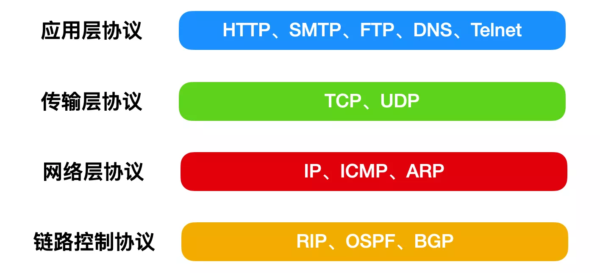
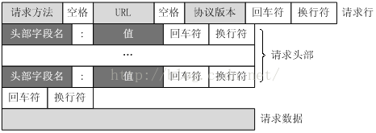
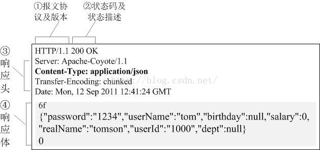

[toc]


#### 1.tcp三握四挥

**TCP 建立连接：三次握手**

1. client: syn
2. server: syn+ack
3. client: ack

**TCP 断开连接：四次挥手**

1. client: fin
2. server: ack
3. server: fin
4. client: ack

#### 2.syn flood

讲的挺好的一篇文章

https://blog.csdn.net/qq_34777600/article/details/81946514

##### TCP攻击三类：

 1.**FLOOD类攻击**，例如**发送海量的syn,syn_ack,ack,fin等报文**，占用服务器资源，使之无法提供服务。

 2.**连接耗尽类攻击**，如与被攻击方，完成三次握手后不再发送报文一直维持连接，或者立刻发送FIN或RST报文，断开连接后再次快速发起新的连接等，**消耗TCP连接资源**。 

3.**利用协议特性攻击**：例如攻击这建好连接之后，基于TCP的流控特性，立马就**把TCP窗口值设为0**，然后断开连接，则服务器就要等待Windows开放，造成资源不可用。或者发送异常报文，可能造成被攻击目标崩溃。

Syn-Flood攻击是当前网络上最为常见的DDoS攻击，也是最为经典的拒绝服务攻击，它利用了TCP协议实现上的一个缺陷，通过**向网络服务所在端口发送大量的伪造源地址的攻击报文**，就可能造成目标服务器中的**半开连接队列被占满**，从而阻止其他合法用户进行访问。

它的数据包特征通常是，源发送了大量的SYN包，并且**缺少三次握手的最后一步握手ACK回复**。

#####  flood防御

###### cookie源认证

原理是syn报文首先**由DDOS防护系统来响应syn_ack**。带上特定的 sequence number （记为cookie）。真实的客户端会返回一个ack 并且 Acknowledgment number 为 cookie+1。 而伪造的客户端，将不会作出响应。这样我们就可以知道那些IP对应的客户端是真实的，将真实客户端IP加入白名单。下次访问直接通过，而其他伪造的syn报文就被拦截。

###### **reset认证**

Reset认证利用的是TCP协议的可靠性，也是首先由DDOS防护系统来响应syn。防护设备收到syn后响应syn_ack,将Acknowledgement number (确认号)设为特定值（记为cookie）。当真实客户端收到这个报文时，发现确认号不正确，将发送reset报文，并且sequence number 为cookie + 1。 而伪造的源，将不会有任何回应。这样我们就可以将真实的客户端IP加入白名单。

###### TCP首包丢弃

该算法利用了TCP/IP协议的重传特性，来自某个源IP的第一个syn包到达时被直接丢弃并记录状态(五元组)，在该源IP的第2个syn包到达时进行验证，然后放行。

当防御设备接到一个IP地址的SYN报文后:

1. 接受到syn报文   -> 简单比对该IP是否存在于白名单中:  存在则转发到后端，否则进行第2步
2. 不存在于白名单中 -> 检查是否是该IP在一定时间段内的首次SYN报文： 不是则进行第3步，是则进行第5步
3. 不是首次SYN报文 -> 检查是否重传报文： 是重传则转发并加入白名单，不是则丢弃并加入黑名单
4. 是首次SYN报文  -> 丢弃并等待一段时间以试图接受该IP的SYN重传报文，等待超时则判定为攻击报文加入黑名单。

###### TCP代理

首包丢弃方案对用户体验会略有影响，因为丢弃首包重传会增大业务的响应时间，有鉴于此发展出了一种更优的**TCP Proxy方案**。所有的SYN数据报文**由清洗设备接受**，按照SYN Cookie方案处理。和设备成功建立了TCP三次握手的IP地址被判定为合法用户加入白名单，由设备伪装真实客户端IP地址再与真实服务器完成三次握手，随后转发数据。而指定时间内没有和设备完成三次握手的IP地址，被判定为恶意IP地址屏蔽一定时间。除了SYN Cookie结合TCP Proxy外，清洗设备还具备多种畸形TCP标志位数据包探测的能力，通过对SYN报文返回非预期应答测试客户端反应的方式来鉴别正常访问和恶意行为。

#### 3.syn cookie

SYN Cookie是对TCP服务器端的三次握手做一些修改，专门用来防范SYN Flood攻击的一种手段。它的原理是，在TCP服务器接收到TCP SYN包并返回TCP SYN + ACK包时，不分配一个专门的数据区，而是根据这个SYN包计算出一个cookie值。这个cookie作为将要返回的SYN ACK包的初始序列号。当客户端返回一个ACK包时，根据包头信息计算cookie，与返回的确认序列号(初始序列号 + 1)进行对比，如果相同，则是一个正常连接，然后，分配资源，建立连接。

#### 4.登录过程：cookie session机制

客户端请求服务器，如果服务器需要记录该用户状态，就向客户端浏览器发一个cookie。客户端浏览器会把cookie保存起来。当浏览器再请求该网站时，浏览器把请求的网址连同该cookie一同提交给服务器。服务器检查该cookie，以此来辨认用户状态。
session是另一种记录客户状态的机制，不同的是cookie保存在客户端浏览器中，而session保存在服务器上。客户端浏览器访问服务器的时候，服务器把客户端信息以某种形式记录在服务器上，这就是session。客户端浏览器再次访问时只需要从该session中查找该客户的状态就可以了。**session相当于程序在服务器上建立的一份用户的档案，用户来访的时候只需要查询用户档案表就可以了。**

虽然session保存在服务器，但是它的正常运行仍然需要客户端浏览器的支持。这是因为**session需要使用cookie作为识别标志**。HTTP协议是无状态的，session不能依据HTTP连接来判断是否为同一客户，因此服务器向客户端浏览器发送一个名为SESSIONID的cookie，它的值为该Session的id。Session依据该cookie来识别是否为同一用户。

对于不支持cookie的手机浏览器，有另一种解决方案：URL地址重写。**URL地址重写的原理是将该用户session的id信息重写到URL地址中，服务器能够解析重写后的URL获取session的id**。这样即使客户端不支持cookie，也可以使用session来记录用户状态。

#### 5.四次挥手，为什么要多中间两次？

因为断开链接的时候，仍可能有数据仍在继续发送，需要确保发送方的数据发出并已被成功接受，还有就是如果缺少中间两次，被动断开方并不知道主动断开方是否收到自己的响应，如果ack包丢失，发起断开方将继续发送消息，而由于被动方已经断开，无法收到，主动方将重复发送fin包，并维持连接状态，占用大量的资源。

#### 6.TCP可靠传输，怎么实现？

1. 应用数据被**分割**成 TCP 认为最适合发送的**数据块**。
2. TCP 给发送的每一个**包进行编号**，接收方对数据包进行排序，把有序数据传送给应用层。
3. **校验和：** TCP 将保持它首部和数据的检验和。这是一个端到端的检验和，目的是检测数据在传输过程中的任何变化。如果收到段的检验和有差错，TCP 将丢弃这个报文段和不确认收到此报文段。
4. TCP 的接收端会**丢弃重复**的数据。
5. **流量控制：** TCP 连接的每一方都有固定大小的缓冲空间，TCP的接收端只允许发送端发送接收端缓冲区能接纳的数据。当接收方来不及处理发送方的数据，能提示发送方降低发送的速率，防止包丢失。TCP 使用的流量控制协议是可变大小的滑动窗口协议。 （TCP 利用**滑动窗口**实现流量控制）
6. **拥塞控制：** 当网络拥塞时，减少数据的发送。
7. **ARQ 协议：** 也是为了实现可靠传输的，它的基本原理就是每发完一个分组就停止发送，等待对方确认。在收到确认后再发下一个分组。
8. **超时重传：** 当 TCP 发出一个段后，它启动一个定时器，等待目的端确认收到这个报文段。如果不能及时收到一个确认，将重发这个报文段。

#### 7.TCP半连接状态

##### 半开连接

 从协议的角度讲，TCP的半开连接是指**TCP连接的一端异常崩溃，或者在未通知对端的情况下关闭连接**，这种情况下不可以正常收发数据，否则会产生RST。比如一个常见的情况是TCP连接的一端异常断电，就会导致TCP的半开连接。**如果没有数据传输，对端就不会知道本端的异常而一直处于ESTABLISHED状态**(TCP有存活检测机制)。

另外从linux实现的角度来说，因为**linux内部有个半连接队列**，TCP半开连接是指发送了TCP连接请求，等待对方应答的状态，此时连接并没有完全建立起来,双方还无法进行通信交互的状态，此时就称为半连接。由于一个完整的TCP连接需要经过三次握手才能完成,这里**把三次握手之前的连接都称之为半连接**。

##### 半关连接

 TCP的半关连接是指**TCP连接只有一方发送了FIN，另一方没有发出FIN包，仍然可以在一个方向上正常发送数据。**

#### 8.http头部

##### 通用首部字段

|    首部字段名     |                    说明                    |
| :---------------: | :----------------------------------------: |
| **Cache-Control** |             控制**缓存**的行为             |
|    Connection     | 控制不再转发给代理的首部字段、管理持久连接 |
|       Date        |           创建报文的**日期**时间           |
|      Pragma       |                报文**指令**                |
|      Trailer      |             报文末端的首部一览             |
| Transfer-Encoding |         指定报文主体的传输编码方式         |
|      Upgrade      |               升级为其他协议               |
|        Via        |            代理服务器的相关信息            |
|      Warning      |                  错误通知                  |

##### 请求首部字段

|     首部字段名      |                      说明                       |
| :-----------------: | :---------------------------------------------: |
|     **Accept**      |        **用户**代理可处理的**媒体类型**         |
|   Accept-Charset    |                  优先的字符集                   |
|   Accept-Encoding   |                 优先的内容编码                  |
|   Accept-Language   |             优先的语言（自然语言）              |
|  **Authorization**  |      **Web 认证信息**（可存放 **Token**）       |
|       Expect        |              期待服务器的特定行为               |
|        From         |               用户的电子邮箱地址                |
|      **Host**       |               请求资源所在服务器                |
|    **If-Match**     |              比较实体标记（ETag）               |
|  If-Modified-Since  |               比较资源的更新时间                |
|    If-None-Match    |        比较实体标记（与 If-Match 相反）         |
|      If-Range       |      资源未更新时发送实体 Byte 的范围请求       |
| If-Unmodified-Since | 比较资源的更新时间（与 If-Modified-Since 相反） |
|    Max-Forwards     |                 最大传输逐跳数                  |
| Proxy-Authorization |         代理服务器要求客户端的认证信息          |
|        Range        |               实体的字节范围请求                |
|     **Referer**     |          对请求中 URI 的**原始获取方**          |
|         TE          |                传输编码的优先级                 |
|     User-Agent      |              HTTP 客户端程序的信息              |

##### 响应首部字段

|      首部字段名      |             说明             |
| :------------------: | :--------------------------: |
|    Accept-Ranges     |   是否接受字节**范围请求**   |
|       **Age**        |   推算资源**创建**经过时间   |
|       **ETag**       |      资源的**匹配信息**      |
|       Location       |   令客户端重定向至指定 URI   |
|  Proxy-Authenticate  | 代理服务器对客户端的认证信息 |
|     Retry-After      |   对再次发起请求的时机要求   |
|      **Server**      |  HTTP 服务器的**安装信息**   |
|       **Vary**       | 代理**服务器缓存**的管理信息 |
| **WWW-Authenticate** | 服务器对客户端的**认证信息** |

##### 实体首部字段

|    首部字段名    |            说明             |
| :--------------: | :-------------------------: |
|    **Allow**     | 资源可**支持的 HTTP 方法**  |
| Content-Encoding |   实体主体适用的编码方式    |
| Content-Language |     实体主体的自然语言      |
|  Content-Length  | 实体主体部分的大小（bites） |
| Content-Location |     替代对应资源的 URI      |
|   Content-MD5    |     实体主体的报文摘要      |
|  Content-Range   |     实体主体的位置范围      |
|   Content-Type   |     实体主体的媒体类型      |
|   **Expires**    | 实体主体**过期的日期**时间  |
|  Last-Modified   |   资源的最后修改日期时间    |

#### 9.长连接和短链接(怎么实现的、区别以及应用场景)

##### 短连接

```
连接->传输数据->关闭连接
比如HTTP是无状态的的短链接，浏览器和服务器每进行一次HTTP操作，就建立一次连接，但任务结束就中断连接。
因为连接后接收了数据就断开了，所以每次数据接受处理不会有联系。 这也是HTTP协议无状态的原因之一。
```

##### 长连接

1. 连接->传输数据->保持连接 -> 传输数据-> ...........->直到一方关闭连接，多是客户端关闭连接。
2. 长连接指建立SOCKET连接后不管是否使用都保持连接，但安全性较差。

##### 应用场景

**长连接多用于操作频繁，点对点的通讯，而且连接数不能太多情况**。每个TCP连接都需要三步握手，这需要时间，如果每个操作都是先连接，再操作的话那么处理速度会降低很多，所以每个操作完后都不断开，再次处理时直接发送数据包就OK了，不用建立TCP连接。例如：**数据库**的连接用长连接， 如果用短连接频繁的通信会造成socket错误，而且频繁的socket 创建也是对资源的浪费。

而像**WEB网站的http服务一般都用短链接**，因为长连接对于服务端来说会耗费一定的资源，而像WEB网站这么频繁的成千上万甚至上亿客户端的连接用短连接会更省一些资源，如果用长连接，而且同时有成千上万的用户，如果每个用户都占用一个连接的话，那可想而知吧。所以**并发量大，但每个用户无需频繁操作**情况下需用短连好。

##### **TCP的keep alive和HTTP的Keep-alive**

TCP的keep alive是检查当前TCP连接是否活着；HTTP的Keep-alive是要让一个TCP连接活久点。

HTTP长连接之后的好处，包括可以使用**HTTP 流水线技术**（管道化连接），它是指，**在一个TCP连接内，多个HTTP请求可以并行，下一个HTTP请求在上一个HTTP请求的应答完成之前就发起。**

#### 10.http和https的区别，https建立连接的过程

##### http和https

**端口** ：HTTP 的 URL由“http://”起始且默认使用端口 **80**，而 HTTPS 的 URL 由“https://”起始且默认使用端口 **443**。

**安全性和资源消耗：** HTTP 协议运行在 TCP 之上，所有传输的内容都是**明文**，客户端和服务器端都**无法验证对方的身份**。HTTPS 是运行在 **SSL/TLS** 之上的 HTTP 协议，**SSL/TLS 运行在 TCP** 之上。所有传输的内容都经过**加密**，加密采用**对称加密，但对称加密的密钥用服务器方的证书进行了非对称加密**。所以说，HTTP 安全性没有 HTTPS 高 ，但是 HTTPS 比 HTTP 耗费更多服务器资源。

##### https建立连接过程

一个 HTTPS 请求实际上包含了**两次 HTTP** 传输，可以细分为 8 步。

1.客户端向服务器发起 **HTTPS 请求**，连接到服务器的 **443 端口**。

2.服务器端有一个密钥对，即**公钥和私钥**，是用来进行非对称加密使用的，**服务器端保存着私钥**，不能将其泄露，公钥可以发送给任何人。

3.服务器将自己的**公钥发送给客户端**。

4.客户端收到服务器端的公钥之后，会对**公钥进行检查**，验证其**合法性**，如果发现发现公钥有问题，那么 HTTPS 传输就无法继续。严格的说，这里应该是**验证服务器发送的==数字证书==的合法性**，关于客户端如何验证数字证书的合法性，上文已经说明。如果**公钥合格**，那么**客户端**会生成一个**随机值**，这个随机值就是用于进行对称加密的**密钥**，我们将该密钥称之为 client key，即**客户端密钥**，这样在概念上和服务器端的密钥容易进行区分。然后用服务器的**公钥**对**客户端密钥进行==非对称加密==**，这样客户端密钥就变成密文了，至此，HTTPS 中的第一次 HTTP 请求结束。

5.**客户端**会发起 HTTPS 中的**第二个** HTTP 请求，将**加密之后的客户端密钥发送给服务器**。

6.服务器接收到客户端发来的密文之后，会用自己的**私钥**对其进行**非对称解密**，解密之后的明文就是**客户端密钥**，然后用客户端密钥对数据进行==**对称加密**==，这样数据就变成了**密文**。

7.然后服务器将**加密后的密文**发送给客户端。

8.客户端收到服务器发送来的密文，用客户端密钥对其进行对称解密，得到服务器发送的数据。这样 HTTPS 中的第二个 HTTP 请求结束，整个 HTTPS 传输完成。

#### 11.http1.0，1.1和2.0的区别

##### 1.1相比于1.0

进行了**网络和带宽的优化**，增加了更多**缓存处理**策略，增加**新的错误状态码**，host头处理，**支持长连接**。

##### 2.0相比1.1

- **新的二进制格式**（Binary Format），HTTP1.x的解析是**基于文本**。基于文本协议的格式解析存在天然缺陷，文本的表现形式有多样性，要做到健壮性考虑的场景必然很多，二进制则不同，只认0和1的组合。基于这种考虑HTTP2.0的协议解析决定采用二进制格式，实现方便且健壮。
- **多路复用**（MultiPlexing），即**连接共享**，即每一个request都是是用作连接共享机制的。一个request对应一个id，这样**一个连接上可以有多个request**，每个连接的request可以随机的混杂在一起，接收方可以根据request的 id将request再归属到各自不同的服务端请求里面。
- **header压缩**，如上文中所言，对前面提到过HTTP1.x的header带有大量信息，而且每次都要重复发送，**HTTP2.0使用encoder来减少需要传输的header大小**，通讯双方各自cache一份header fields表，既避免了重复header的传输，又减小了需要传输的大小。
- **服务端推送**（server push）。例如网页有一个sytle.css的请求，在客户端收到sytle.css数据的同时，服务端会将sytle.js的文件推送给客户端，当客户端再次尝试获取sytle.js时就可以直接从缓存中获取到，不用再发请求了。

#### 12.网络七层模型和五层模型

##### OSI七层模型

应用层：各种应用程序协议，http,FTP,SMTP等

表示层：信息语法语义关联。如加密解密、压缩解压缩等

会话层：不同机器的用户建立会话及管理

传输层：接受上层的数据，必要的时候进行分割，交给网络层传输

网络层：控制子网的运行，如逻辑分组，路由分组转发等

数据链路层：物理寻址，将原始比特流转换为逻辑传输线路

物理层：物理通信设备上原始比特流传输

##### 五层模型

-  **应用层** ：**为特定应用程序提供数据传输服务**，例如 **HTTP、DNS 等协议**。数据单位为报文。
-  **传输层** ：**为进程提供通用数据传输服务**。由于应用层协议很多，定义通用的传输层协议就可以支持不断增多的应用层协议。运输层包括两种协议：传输控制协议 **TCP**，提供面向连接、可靠的数据传输服务，数据单位为报文段；用户数据报协议 **UDP**，提供无连接、尽最大努力的数据传输服务，数据单位为用户数据报。TCP 主要提供完整性服务，UDP 主要提供及时性服务。
-  **网络层** ：**为主机提供数据传输服务**。而传输层协议是为主机中的进程提供数据传输服务。网络层把传输层传递下来的报文段或者用户数据报封装成分组。在计算机网络中进行通信的两个计算机之间可能会经过很多个数据链路，也可能还要经过很多通信子网。网络层的任务就是选择合适的网间路由和交换结点， 确保数据及时传送。网络层协议主要有 **IP （网际互连协议），ARP （地址解析）协议**等。
-  **数据链路层** ：针对的还是**主机之间的数据传输**服务，而主机之间可以有很多链路，链路层协议就是为同一链路的主机提供数据传输服务。数据链路层把网络层传下来的分组封装成帧。链路层协议有 **PPP 协议、CSMA/CD 协议**等。
-  **物理层** ：**考虑的是怎样在传输媒体上传输数据比特流，而不是指具体的传输媒体**。物理层的作用是尽可能屏蔽传输媒体和通信手段的差异，使数据链路层感觉不到这些差异。

#### 13.TCP拥塞控制

在某段时间，若对网络中某资源的需求超过了该资源所能提供的可用部分，网络的**性能**就要变坏。这种现象称为**拥塞** (congestion)。

解决拥塞问题的**两条思路**：

- 增加网络可用资源；
- 减少用户对资源的需求。

**拥塞控制**：基于**拥塞窗口变量+几种拥塞控制算法**实现。 

##### 拥塞控制算法

###### 慢开始

**目的**：用来确定网络的负载能力或拥塞程度。

**算法的思路**：由小到大**逐渐**增大拥塞窗口数值，直到窗口门限。

**cwnd = cwnd * 2***

###### 拥塞避免

###### 快重传

- **发送方**只要一连收到**三个重复确认**，就知道接收方确实**没有收到**报文段，因而应当**立即进行重传**（即“**快重传**”），这样就不会出现超时，发送方也不就会误认为出现了网络拥塞。
- 使用快重传可以使整个网络的**吞吐量**提高约 20%。 
- 不难看出，快重传并非取消重传计时器，而是在某些情况下可以**更早地（更快地）重传**丢失的报文段。 
- 采用**快重传 FR** (Fast Retransmission) 算法可以让**发送方**尽早知道发生了个别报文段的丢失。
- 快重传算法首先要求接收方**不要等待**自己发送数据时才进行捎带确认，而是要**立即发送确认**，即使收到了**失序**的报文段也要**立即**发出对已收到的报文段的**重复确认**。

###### 快恢复

当发送端收到连续三个重复的确认时，由于发送方现在认为网络**很可能==没有==发生拥塞**，因此现在**不需要**执行慢开始算法，而是执行**快恢复算法** FR (Fast Recovery) 算法：

**（1）慢开始门限 ssthresh = 当前拥塞窗口 cwnd / 2 ；**
**（2）新拥塞窗口 cwnd = 慢开始门限 ssthresh ；**
**（3）开始执行拥塞避免算法，使拥塞窗口缓慢地线性增大。** 

#### 14.ping指令的实现，涉及到哪些协议

向指定的IP地址发送一定长度的数据包，按照约定，若指定IP地址存在的话，会返回同样大小的数据包，当然，若在特定的时间内没有返回，就是“超时”，就认为指定的IP不存在。

由于ping使用的是**ICMP协议**，有些防火墙会屏蔽ICMP协议，所以有时候ping的结果只能作为参考，ping不通并不一定说明对方IP不存在。

#### 15.tcp的粘包问题

发送端为了将多个发往接收端的包，更加高效的的发给接收端，于是采用了优化算法（Nagle算法），**将多次间隔较小、数据量较小的数据，合并成一个数据量大的数据块，然后进行封包**。那么这样一来，接收端就必须使用高效科学的拆包机制来分辨这些数据。

##### 造成TCP粘包的原因

**发送方原因**

TCP默认使用Nagle算法（主要作用：减少网络中报文段的数量），而Nagle算法主要做两件事：

1. 只有上一个分组得到确认，才会发送下一个分组
2. 收集多个小分组，在一个确认到来时一起发送

Nagle算法造成了发送方可能会出现粘包问题

**接收方原因**

TCP接收到数据包时，并不会马上交到应用层进行处理，或者说应用层并不会立即处理。实际上，**TCP将接收到的数据包保存在接收缓存里，然后应用程序主动从缓存读取收到的分组**。这样一来，如果TCP接收数据包到缓存的速度大于应用程序从缓存中读取数据包的速度，多个包就会被缓存，应用程序就有可能读取到多个首尾相接粘到一起的包。

##### 如何处理粘包？

**发送方**

对于发送方造成的粘包问题，可以通过**关闭Nagle算法**来解决，使用**TCP_NODELAY**选项来关闭算法。

**接收方**

接收方没有办法来处理粘包现象，只能将问题交给应用层来处理。

**应用层**

应用层的解决办法简单可行，不仅能解决接收方的粘包问题，还可以解决发送方的粘包问题。

解决办法：循环处理，应用程序从接收缓存中读取分组时，**读完一条数据，就应该循环读取下一条数据，直到所有数据都被处理完成**，但是如何判断每条数据的长度呢？

1. **格式化数据**：每条数据有固定的格式（开始符，结束符），这种方法简单易行，但是选择开始符和结束符时一定要确保每条数据的内部不包含开始符和结束符。
2. **发送长度**：发送每条数据时，将数据的长度一并发送，例如规定数据的前4位是数据的长度，应用层在处理时可以根据长度来判断每个分组的开始和结束位置。

#### 16.https的过程？

1. 客户端请求网址，服务器接收到请求后返回证书公钥 
2. 客户端验证证书的有效性和合法性，然后生成一个随机值 
3. 客户端通过证书的公钥加密随机值，将加密后的密钥发送给服务器 
4. 服务器通过私钥解密密钥，通过解密后的密钥加密要发送的内容 
5. 客户端通过密钥解密接受的内容

#### 17.http keep-alive作用

使客户端到服务器端的连接持续有效，当出现对服务器的后继请求时，Keep-Alive功能避免了建立或者重新建立连接。可以一次连接多次请求。

#### 18.fasthttp为什么快？

它的高性能主要源自于“复用”，通过服务协程和内存变量的复用，节省了大量资源分配的成本。

##### 工作协程的复用

worker协程和连接协程之间通过channel通信，内部维护了一个ready状态的channel列表，**连接协程收到新的conn以后，找到空闲的channel，把连接通过channel交给相应的worker**，worker协程处理完当前连接后把channel归还到空闲列表等待下一个请求。

##### 内存变量复用 

fasthttp内部大量使用了sync.Pool，为多次使用的变量**节省了大量的内存申请开销**，我们举最常用的RequestCtx为例，每次的请求开始时，先在ctxPool中查找可复用的ctx变量，请求完成以后，把变量归还到Pool中。

当然，这样的复用实际上可能会给使用者带来额外的学习成本，**RequestCtx变量不能在handle函数以外的地方使用**，例如如果我们要做一些**异步的操作时，必须把所需的数据拷贝出来给到新的协程**，否则会出现无法预知的并发错误，这一点一定要切记。

#### 19.http2.0的多路复用怎么实现的？

在一个HTTP的连接上，多路“HTTP消息”同时工作。

HTTP/2设计是基于“二进制帧”进行设计的，这种设计无疑是一种“高超的艺术”，因为它实现了一个目的：一切可预知，一切可控。帧是一个数据单元，实现了**对消息的封装**。帧的字节中保存了不同的信息，前9个字节对于每个帧都是一致的，“服务器”解析HTTP/2的数据帧时只需要解析这些字节，就能准确的知道整个帧期望多少字节数来进行处理信息。如果使用HTTP/1.1的话，你需要发送完上一个请求，才能发送下一个；**由于HTTP/2是分帧的，请求和响应可以交错甚至可以复用**。

“流”的概念：**HTTP/2连接上独立的、双向的帧序列交换。流ID（帧首部的6-9字节）用来标识帧所属的流**。

#### 20.DNS基于什么协议，有没有基于http的DNS协议？

DNS在区域传输的时候使用TCP协议，其他时候使用UDP协议。

**DNS区域传输的时候使用TCP协议：**

1.辅域名服务器会**定时（一般3小时）向主域名服务器进行查询**以便了解数据是否有变动。如有变动，会执行一次区域传送，进行数据同步。区域传送使用TCP而不是UDP，因为数据同步传送的数据量比一个请求应答的数据量要多得多。

2.TCP是一种**可靠连接，保证了数据的准确性**。

**域名解析时使用UDP协议：**

**客户端向DNS服务器查询域名，一般返回的内容都不超过512字节，用UDP传输即可**。不用经过三次握手，这样DNS服务器负载更低，响应更快。

##### 基于http的DNS解析器

HTTPDNS 其实就是自己搭建了一套DNS ，不用传统的DNS 解析了。HTTPDNS 是基于HTTP 协议的DNS 服务器集群，分布在多个地点和运营商。当客户端需要DNS 解析的时候，直接通过HTTP协议进行请求这个服务器集群，得到就近的地址。

HTTPDNS 相当于每个客户端，都有自己的域名解析。自己做一个自己的地址簿，而不使用统一的地址簿。

 HTTPDNS 在解析的过程中，不像老DNS 协议那样递归调用一圈，一个HTTP的请求就能搞定，要实时更新的时候，马上就能起作用。HTTPDNS 的缓存设计为三层，分为：**客户端、缓存、数据源**三层。

#### 21.什么是网关？网关的作用

网关**在网络层以上实现网络互连**，是最复杂的网络互连设备，仅用于两个高层协议不同的网络互连。

是一种充当转换重任的计算机系统或设备。使用在不同的通信协议、数据格式或语言，甚至体系结构完全不同的两种系统之间，网关是一个**翻译器**。与网桥只是简单地传达信息不同，网关**对收到的信息要重新打包，以适应目的系统的需求**。

#### 22.Http的方法，GET和POST区别，HTTP状态码，502和504的区别

|    方法     |          说明          | 幂等性 |
| :---------: | :--------------------: | :----: |
|   **GET**   |      **获取资源**      |        |
|  **POST**   |    传输实**体主体**    |   否   |
|   **PUT**   |        传输文件        |        |
|  **HEAD**   |    获得报文**首部**    |        |
| **DELETE**  |        删除文件        |        |
| **OPTIONS** |     询问支持的方法     |        |
|  **TRACE**  |        追踪路径        |        |
| **CONNECT** | 要求用隧道协议连接代理 |        |

GET和POST区别：

- **GET是从服务器上获取数据，POST是向服务器传送数据**。 
- GET是把**参数**数据队列加到提交表单的ACTION属性所指的**URL中**，值和表单内各个字段一一对应，在URL中可以看到。POST是通过HTTP POST机制，将表单内各个字段与其内容放置在HTML HEADER内一起传送到ACTION属性所指的URL地址。用户看不到这个过程。 **因为GET设计成传输小数据，而且最好是不修改服务器的数据，所以浏览器一般都在地址栏里面可以看到，但POST一般都用来传递大数据，或比较隐私的数据，所以在地址栏看不到**，能不能看到不是协议规定，是浏览器规定的。**GET只支持ASCII，POST支持Unicode编码**
- 对于GET方式，服务器端用**Request.QueryString**获取变量的值，对于POST方式，服务器用**Request.Form**获取提交的数据。
- **GET传送的数据量较小，不能大于2KB。POST传送的数据量较大，一般被默认为不受限制**。只不过要修改form里面的那个type参数
- **GET安全性非常低，POST安全性较高**。 如果没有加密，他们安全级别

#### 23.HTTP如何保存用户状态

1. **基于Session实现的会话保持**
    在会话开始时，服务器将会话状态保存起来（本机内存或数据库中），然后分配一个**会话标识**（SessionId）给客户端，这个会话标识一般保存在**客户端Cookie**中，以后每次浏览器发送http请求都会带上Cookie中的SessionId到服务器，服务器拿到会话标识就可以把之前存储在服务器端的状态信息与会话联系起来，实现会话保持（如果**遇到浏览器禁用Cookie的情况，则可以通过url重写的方式将会话标识放在url的参数里**，也可实现会话保持）
2. **基于Cookie实现的会话保持**
    基于Cookie实现会话保持与上述基于Session实现会话保持的最主要区别是**前者完全将会话状态信息存储在浏览器Cookie中**，这样一来每次浏览器发送HTTP请求的时候都会带上状态信息，因此也就可以实现状态保持。

#### 24.HTTPS对称加密和非对称加密

对称加密：**加密密钥与解密密钥是相同的密码体制**

非对称加密：**加密密钥 PK**（public key，即公钥）是向公众**公开**的，而**解密密钥 SK**（secret key，即私钥或秘钥）则是需要**保密**的。加密算法 E 和解密算法 D 也都是**公开**的。虽然私钥 SK 是由公钥 PK 决定的，但却**不能**根据 PK 计算出 SK。 

#### 25.为什么TCP建立连接的时候少一次握手？

TCP建立连接的三次握手其实是四次握手的优化版，将服务器端对客户端的连接响应和自己的建立连接请求合并在一起进行握手。在建立连接的时候，不存在像断开连接的时候可能被动断开连接方的数据还没发送完的情况，所以中间两次握手可以合并起来。

#### 26.Http3.0

为了解决Http2.0多路复用底层的TCP协议的队头阻塞带来的问题，搞了一个**基于 UDP 协议的“QUIC”协议**，让HTTP跑在QUIC上而不是TCP上。

- 实现了类似TCP的流量控制、传输可靠性的功能。**0RTT 建连可以说是 QUIC 相比 HTTP2 最大的性能优势**。
- 集成了TLS加密功能。
- 多路复用，彻底解决TCP中队头阻塞的问题

#### 27.Http的Post和Put的区别

post不是幂等的

**put:**client对一个URI发送一个Entity，服务器在这个URI下如果已经又了一个Entity，那么此刻服务器应该替换成client重新提交的，也由此保证了PUT的幂等性。如果服务器之前没有Entity ，那么服务器就应该将client提交的放在这个URI上。 如果用PUT来达到更改资源，需要client提交资源全部信息，如果只有部分信息，不应该使用PUT（因为**服务器使用client提交的对象整体替换服务器的资源**）。

POST主要**作用在一个集合资源之上的**（url），而**PUT主要作用在一个具体资源之上的**（url/xxx），通俗一下讲就是，如URL可以在客户端确定，那么可使用PUT，否则用POST。

#### 28.Http2.0具体怎么实现，为什么要二进制分帧，有哪些好处，共享连接能同时发送多少个文件？

##### http2.0实现

1. 二进制分帧。
2. 多路复用共享连接。基于二进制分帧，HTTP 2.0可以在共享TCP连接的基础上，同时发送请求和响应。**HTTP消息被分解为独立的帧，而不破坏消息本身的语义，交错发送出去，最后在另一端根据流ID和首部将它们重新组合起来**。 
3. 请求优先级。
4. 服务端推送。推送，缓存，提高响应速度。
5. 首部压缩。在客户端和服务端之间使用“首部表”来跟踪和存储之前发送的键-值对。不需要每次通信都需要再携带首部。压缩算法使用HPACK。

##### 二进制分帧的好处

是建立http2.0协议的基础，可以使请求和响应信息划分为更小的帧结构，更方便的进行传输。也是多路复用共享TCP连接的基础，才能在一次连接将多个请求和响应的信息传输，通过给无序的帧标号，可以双方接收后再重新整理。

#### 29.Http的重定向机制

-  **301 Moved Permanently** ：**永久性**重定向。
-  **302 Found** ：**临时性**重定向。
-  **303 See Other** ：和 302 有着相同的功能，但是 303 明确要求客户端应该采用 **GET 方法**获取资源。
-  **304 Not Modified** ：如果**请求报文**首部包含**一些条件**，例如：**If-Match，If-Modified-Since，If-None-Match，If-Range，If-Unmodified-Since**，如果**不满足**条件，则服务器会返回 **304 状态码**。（其实这与重定向**没有**关系）。
-  **307 Temporary Redirect** ：临时重定向，与 302 的含义类似，但是 307 要求浏览器**不会**把重定向请求的 POST 方法改成 GET 方法。

#### 30.TCP的粘包拆包

tcp是以**流动的方式传输数据**，传输的最小单位为一个报文段（segment）。tcp Header中有个Options标识位，常见的标识为mss(Maximum Segment Size)指的是，**连接层每次传输的数据有个最大限制MTU**(Maximum Transmission Unit)，一般是1500比特，超过这个量要分成多个报文段，mss则是这个最大限制减去TCP的header，光是要传输的数据的大小，一般为1460比特。换算成字节，也就是180多字节。

tcp为提高性能，**发送端会将需要发送的数据发送到缓冲区，等待缓冲区满了之后，再将缓冲中的数据发送到接收方。同理，接收方也有缓冲区这样的机制，来接收数据。**

发生TCP粘包、拆包主要是由于下面一些原因：

1. 应用程序写入的数据大于套接字缓冲区大小，这将会发生拆包。
2. 应用程序写入数据小于套接字缓冲区大小，网卡将应用多次写入的数据发送到网络上，这将会发生粘包。
3. 进行mss（最大报文长度）大小的TCP分段，当TCP报文长度-TCP头部长度>mss的时候将发生拆包。
4. 接收方法不及时读取套接字缓冲区数据，这将发生粘包。

既然知道了**tcp是无界的数据流**，且协议本身无法避免粘包，拆包的发生，那我们只能在**应用层**数据协议上，加以控制。通常在制定传输数据时，可以使用如下方法：

1. 使用带消息头的协议、**消息头存储消息开始标识及消息长度信息**，服务端获取消息头的时候解析出消息长度，然后向后读取该长度的内容。
2. 设置**定长消息**，服务端每次读取既定长度的内容作为一条完整消息。
3. 设置**消息边界**，服务端从网络流中按消息编辑分离出消息内容。

#### 31.TCP和UDP区别

1. TCP面向连接，UDP无连接

2. TCP提供可靠的服务，通过TCP连接传送的数据，无差错，不丢失，不重复，且按序到达。

    UDP尽最大努力交付，即不保证可靠交付。

3. TCP传输效率相对较低。

    UDP传输效率高，适用于对高速传输和实时性有较高的通信或广播通信。

4. TCP连接只能是点到点、一对一的。

    UDP支持一对一，一对多，多对一和多对多的交互通信。

5. UDP头部更小，传输开销更小，8字节码，TCP20字节。

#### 32.Tcp报文结构

 TCP 报文段首部的**前 20** 个字节是**固定**的，后面有 4N 字节是根据需要而增加的选项 (N 是整数)。因此 TCP 首部的最小长度是 **20 字节**。

- **==源端口和目的端口==**：各占 **2 字节**。端口是运输层与应用层的服务接口。运输层的复用和分用功能都要通过端口才能实现。 
- **==序号 seq==** ：占 **4 字节**。TCP 连接中传送的数据流中的**每一个字节**都编上一个**序号**。序号字段的值则指的是**本报文段**所发送的数据的**第一个字节**的序号。 
- **==确认号 ack==**：占 4 字节，是**期望**收到对方的**下一个报文段**的数据的**第一个字节**的序号。 

```
若确认号ack = N，则表明：到序号 N - 1 为止的所有数据都已正确收到
```

- **数据偏移**：即**首部长度**。占 4 位，它指出 TCP 报文段的**数据起始处**距离 TCP 报文段的起始处有多远。“数据偏移”的单位是 32 位字（以 4 字节为计算单位）。 
- **保留**：占 6 位，保留为今后使用，但目前应置为 0。
- **紧急 URG**：当 URG = 1 时，表明紧急指针字段**有效**。它告诉系统此报文段中有紧急数据，应尽快传送(相当于高优先级的数据)。 
- **==确认 ACK 标志位==**：只有当 **ACK = 1** 时**确认号字段才有效**。当 ACK = 0 时，确认号无效。 
- **推送 PSH**：接收 TCP 收到 PSH = 1 的报文段，就尽快地交付接收应用进程，而不再等到整个缓存都填满了后再向上交付。 
- **复位 RST**：当 RST = 1 时，表明 TCP 连接中出现严重差错（如由于主机崩溃或其他原因），必须释放连接，然后再重新建立运输连接。 
- ==**同步 SYN 标志位**==：（**Syn**chronize Sequence Numbers）同步 **SYN = 1** 表示这是一个==**连接请求或连接接受**==报文。在**连接时**用来**同步序号**。   
- **==终止 FIN 标志位==**：用来**释放**一个连接。**FIN = 1** 表明此报文段的**发送端**的数据已**发送完毕**，并**要求释放连接**。 
- **==窗口==**：占 2 字节，用来让**对方设置**发送窗口的依据，单位为字节。窗口字段明确指出了现在**允许对方发送**的数据量，窗口值常在动态变化着。
- **校验和**：占 2 字节。检验和字段检验的范围包括首部和数据这两部分。在计算检验和时，临时在 TCP 报文段的前面加上 12 字节的伪首部。
- **紧急指针字段**：占 16 位，指出在本报文段中紧急数据共有多少个字节（紧急数据放在本报文段数据的最前面）。 
- **选项**：长度可变。TCP 最初只规定了一种选项，即**最大报文段长度 MSS**。MSS 告诉对方 TCP：“我的缓存所能接收的报文段的数据字段的最大长度是 MSS 个字节” 。其他选项：窗口扩大选项、时间戳选项、选择确认选项。MSS (Maximum Segment Size) 是 TCP 报文段中的数据字段的最大长度。数据字段加上 TCP 首部才等于整个的 TCP 报文段。所以，MSS 是“TCP 报文段长度减去 TCP 首部长度”。
- **填充**：这是为了使整个首部长度是 **4 字节**的**整数倍**。

#### 33.TCP拥塞控制和流量控制

|                      流量控制                      |                           拥塞控制                           |
| :------------------------------------------------: | :----------------------------------------------------------: |
| 抑制发送端发送数据的速率，以使接收端**来得及接收** | **防止**过多的数据**注入到网络**中，使网络中的路由器或链路**不致过载** |
|      是点对点通信量的控制，是**端到端**的问题      | 是一个**全局性**的过程，涉及到与降低网络传输性能有关的所有因素 |
|                  使用滑动窗口实现                  |     使用拥塞窗口变量+拥塞控制算法实现，还要配合滑动窗口      |

#### 34.网络通信双方的流程

- **服务器端：**

– 申请一个**socket** (socketWatch)用来监听的

– **绑定**到一个IP地址和一个端口上

– **开启侦听**，等待接授客户端的连接

– 当有连接时创建一个用于和连接进来的客户端进行通信的**socket**(socketConnection)

– 即续监听,等侍下一个客户的连接

- **客户端：**

– 申请一个socket(socketClient)

– 连接服务器（指明IP地址和端口号）

#### 35.http断点续传的原理？

HTTP协议的**GET方法，支持只请求某个资源的某一部分**；

206 Partial Content 部分内容响应；

Range 请求的资源范围；

Content-Range 响应的资源范围；

**在连接断开重连时，客户端只请求该资源未下载的部分，而不是重新请求整个资源**，来实现断点续传。

分块请求资源实例：

Eg1：**Range: bytes=306302-** ：请求这个资源从306302个字节到末尾的部分；

Eg2：**Content-Range: bytes 306302-604047/604048**：响应中指示携带的是该资源的第306302-604047的字节，该资源共604048个字节；

**客户端通过并发的请求相同资源的不同片段，来实现对某个资源的并发分块下载**。从而达到快速下载的目的。目前流行的FlashGet和迅雷基本都是这个原理。

多线程下载的原理：

- 下载工具开启多个发出HTTP请求的线程；

- 每个http请求只请求资源文件的一部分：Content-Range: bytes 20000-40000/47000；

- 合并每个线程下载的文件。

#### 36.arp协议

地址解析协议，是一个把IP地址转换为物理地址的TCP/IP协议。

相关要素：路由表，转发，广播，ARP缓存

#### 37.转发分组的详细过程

1. 提取数据报首部中的**目的IP地址**
2. 判断目的IP地址所在的网络**是否与本路由器直接相连**。如果是，就直接交付给目的网洛：如果不是执行3
3. 检查路由器表中是否有目的IP地址的**特定主机路由**。如果有，按特定主机路由转发：如果没有，执行4
4. 逐条检查路由表。若找到匹配路由，则按照路由表进行转发：若所有路由均不匹配，则执行5
5. 若路由表中设置有默认路由，则按照默认路由表转发：否则，执行6
6. 向源主机报错。

#### 38.tcp访问一个主机如果主机端口不存在返回什么信息

##### TCP建立连接异常情况分析

1. 试图与一个**不存在**的端口建立连接（主机正常）

    这里的不存在的端口是指在服务器端没有程序监听在该端口。我们的客户端就调用connect，试图与其建立连接。

    这种情况下我们在客户端通常会收到如下异常内容：

    > [Errno 111] **Connection refused（连接拒绝）**

    当客户端的SYNC包到达服务端时，TCP协议没有找到监听的套接字，就会向客户端发送一个错误的报文，告诉客户端产生了错误。而该错误报文就是一个**包含RST的报文**。这种异常情况也很容易模拟。

2. 试图与一个**某端口建立连接但该主机已经宕机**（主机宕机）

    这也是一种比较常见的情况，当某台服务器主机宕机了，而客户端并不知道，仍然尝试去与其建立连接。这种场景也是分为2种情况的，一种是刚刚宕机，另外一种是宕机了很长时间。为什么要分这2种情况？

    这主要根ARP协议有关系，ARP会在本地缓存失效，TCP客户端就无法向目的服务端发送数据包了。

    刚刚宕机的情况，此时客户端是可以向服务端发送数据包的。但是由于服务器宕机，因此不会给客户端发送任何回复。

3. 建立连接时，服务器应用被阻塞（或者僵死）

    还有一种情况是在客户端建立连接的过程中服务端应用处于僵死状态，这种情况在实际中也会经常出现（我们假设仅仅**应用程序僵死，而内核没有僵死**）。

    服务端通过**accept接口返回一个新的套接字**，这时就可以和客户端进行数据往来了。也就是在用户层面来说，**accept返回结果说明3次握手完成了，否则accept会被阻塞**。

    accept会通过软中断陷入内核中，最终会调用tcp协议的inet_csk_accept函数，该函数会**从队列中查找是否有处于ESTABLISHED状态的套接字**。如果有则返回该套接字，否则阻塞当前进程。也就是说这里只是一个查询的过程，**并不参与三次握手的任何逻辑**。

    三次握手的本质是什么呢？实际上就是客户端与服务端一个不断交流的过程，而这个交流过程就是通过3个数据包完成的。而这个数据包的发送和处理实际上都是在**内核**中完成的。对于TCP的服务端来说，**当它收到SYNC数据包时，就会创建一个套接字的数据结构并给客户端回复ACK，再次收到客户端的ACK时会将套接字数据结构的状态转换为ESTABLISHED，并将其发送就绪队列中**。而这整个过程**跟应用程序没有关系**。

    当上面套接字加入就绪队列时，accept函数就被唤醒了，然后就可以获得新的套接字并返回。但我们回过头来看一下，**在accept返回之前，其实三次握手已经完成，也就是连接已经建立了**。

    另外一个是**如果accept没有返回，客户端是否可以发送数据？答案是可以的**。因为数据的发送和接受都是在内核态进行的。**客户端发送数据后，服务端的网卡会先接收，然后通过中断通知IP层，再上传到TCP层**。TCP层根据目的端口和地址将数据存入关联的缓冲区。如果此时应用程序有读操作（例如read或recv），那么数据会**从内核态的缓冲区拷贝到用户态的缓存**。否则，数据会一直在内核态的缓冲区中。总的来说，**TCP的客户端是否可以发送数据与服务端程序是否工作没有任何关系**。

    当然，如果是整个机器都卡死了，那就是另外一种情况了。这种情况就我们之前分析的第2种情况了。因为，由于机器完全卡死，TCP服务端无法接受任何消息，自然也无法给客户端发送任何应答报文。

#### 39.那怎么知道这个信息是什么呢

通过tcpdump 抓包抓到的一个个tcp 的pcap 包，可以通过wireshark 打开。

#### 40.网络的整个协议栈




#### 41.一个TCP程序的具体步骤

#### 42.网络定时器的机制

##### 采用sleep函数

sleep函数在**实现时用了SIGALRM信号机制**， 在多线程程序中处理信号是个相当麻烦的事情，应当尽量避免

原因：

1. 如果要处理多个定时任务，就要不断触发SIGALRM信号，并在信号处理函数中执行到期任务
2. **在**多线程环境下，产生的信号是传递给整个进程的，一般而言，所有线程都有机会收到这个信号，要做特殊的信号阻塞处理、考虑线程安全问题
3. SIGALRM信号**按照固定的频率生成**，由alarm或settimer函数设定定时周期T保持不变。如果定时时间周期不是T的整数倍，那么实际执行时和与其时间将会有偏差

##### 采用timerfd + epoll

timerfd是Linux为用户程序提供的一个定时器接口。这个接口基于文件描述符，**通过文件描述符的可读事件进行超时通知**，**在定时器超时的那一刻变得可读**，这样就能很方便地融入到 select/poll 框架中，用统一的方式来处理 IO 事件和超时事件。

优点：

1. 由timerfd可以方便的创建多个定时器，由epoll进行监听，实现简单

缺点：

1. 创建多个定时器时，需要占用多个timerfd
2. epoll和timerfd必须搭配使用，也就造成了添加一个定时器至少包含三个系统调用(timerfd_create()、 timerfd_settime()、epoll_ctl())，若服务端要面对大量的网络连接与大量的定时器使用，那么这对性能应该存在一定影响

##### 采用链表

- 将定时器作为链表节点管理
- 插入/删除/查找时进行遍历判断

时间复杂度上：

1. 无序链表: 插入时直接头插O(1), 删除和超时时需要遍历判断定时器情况O(n)
2. 有序链表: 采用升序链表, 插入时需要找到合适的位置, 时间复杂度是O(n), 删除和超时, 距今时间最近的定时器节点一定是在起始处, 所以事件复杂度是O(1)

##### 采用时间轮

时间轮**提前确定好时间的间隔**，在每一个槽上都是一个链表，这个链表中的时间都是一致的，不同链表上的定时时间相差槽间隔的整数倍，当指针指向当前格子时，便将所有超时时间直接处理，并且移除。

优点：

1. 将定时器散列到不同的链表上，这样每条链表上的定时器数目将会明显少于链表上的定时器数目，插入操作效率提高。

时间复杂度：

- 时间复杂度是O(1)
- 删除: O(1)
- 超时: O(1)

##### 采用时间堆

之前链表和时间轮都是以固定的频率一次检测到期的定时器，然后执行到期定时器上的回调函数，时间堆是实现定时器的另外一种思路：**将所有定时器中超时时间最小的一个定时器的超时值作为间隔**，每次调用时时间最小的定时器必然到期，然后执行定时器上的回调函数，之后再从剩余的定时器上找出超时时间最小的一个，并将这段时间作为下一个时间间隔。

采用数据结构：最小堆

时间复杂度上：

1. 最小堆保证最小的节点在顶部, 所以删除, 超时的时间复杂是O(1)
2. 因为最小堆的性质要求, 插入时间复杂度也是O(lgn)

#### 43.网络的协议栈，为什么要分层？

一灵活性好：当任何一层发生变化时，只要层间接口关系保持不变，则在这层以上或以下各层均不受影响。此外，对某一层提供的服务还可进行修改。当某层提供的服务不再需要时，甚至可以将这层取消，更容易管理。


二各层之间是独立的：在各层间标准化接口，允许不同的产品只提供各层功能的一部分，某一层不需要知道它的下一层是如何实现的，而仅仅需要知道该层通过层间的接口所提供的服务。由于每一层只实现一种相对独立的功能，所以比较容易实现！

#### 44.URL的格式

协议://用户名:密码@子域名.域名.顶级域名:端口号/目录/文件名.文件后缀?参数=值#标志

一般格式

<协议>://<主机>:<端口>/<路径>

#### 45.动态路由

路由器能够自动地建立自己的路由表，并且能够根据实际情况的变化适时地进行调整。

常见的动态路由协议有以下几个：

##### RIP

**路由信息协议**（RIP） 是内部网关协议IGP中最先得到广泛使用的协议。RIP是一种分布式的**基于距离向量**的路由选择协议，是因特网的标准协议，其最大优点就是实现简单，开销较小。

仅和相邻路由器交换信息（当前路由器所知的全部信息，即自己的路由表）。基于UDP传送数据。

##### OSPF

OSPF(Open Shortest Path First**开放式最短路径优先**）是一个内部网关协议(Interior Gateway Protocol，简称IGP），用于在单一自治系统内决策路由。

向本自己系统中的所有路由器发送信息，泛洪法，信息包含所有与本路由器相邻的路由器的状态。使用IP数据报直接传送。

##### IS-IS

IS-IS（Intermediate System-to-Intermediate System，**中间系统到中间系统**）路由协议最初是ISO为CLNP（Connection Less Network Protocol，无连接网络协议）设计的一种动态路由协议。

##### BGP

**边界网关协议**（BGP）是**运行于 TCP 上的一种自治系统的路由协议**。 BGP 是唯一一个用来处理像因特网大小的网络的协议，也是唯一能够妥善处理好不相关路由域间的多路连接的协议。力求寻找一条能够到达目的网络且**比较好的路由**（不能兜圈子），而**并非**要寻找一条最佳路由。 BGP发言人之间建立TCP连接交换路由信息。

#### 46.HTTP的报文格式

##### 请求

###### 请求行

由请求方法字段、URL字段和HTTP协议版本字段3个字段组成，它们用空格分隔。比如 GET /data/info.html HTTP/1.1

###### 请求头部

HTTP客户程序向服务器发送请求的时候**必须指明请求类型**(一般是GET或者 POST)。大多数请求头并不是必需的，但Content-Length除外。**对于POST请求来说 Content-Length必须出现**。

###### 空行

通过一个空行，告诉服务器请求头部到此为止。

###### 请求数据

若方法字段是GET，则此项为空，没有数据；若方法字段是POST,则通常来说此处放置的就是要提交的数据



##### 响应

由三部分组成：响应行、响应头、响应体

###### 响应行

一般由**协议版本、状态码及其描述**组成 比如 HTTP/1.1 200 OK

###### 响应头

用于描述服务器的基本信息，以及数据的描述，服务器通过这些数据的描述信息，可以通知客户端如何处理等一会儿它回送的数据。

设置HTTP响应头往往和状态码结合起来。

###### 响应体

就是响应的消息体，如果是纯数据就是返回纯数据，如果请求的是HTML页面，那么返回的就是HTML代码，如果是JS就是JS代码，如此之类。



#### 47.Time_Wait？有什么方法可以避免Time_Wait?TIME_WAIT 是主动断开连接的一方还是被动断开的一方？

可以一看https://www.cnblogs.com/albert32/p/13414204.html

主动断开连接放进行TIME_WAIT取2MSL(报文最大生存时间)主要是保证主动断开方对于被动断开方的FIN的响应能够被接收到，正常关断，如果未正常响应，则服务端会重新发送FIN报文，就是为了解决这个问题。同时等待一段时间是为了让本次连接产生的报文从网络中都消失，下一个连接的时候不会出现旧的报文。

##### Time_Wait调优

###### **net.ipv4.tcp_timestamps**

**两个4字节的时间戳字段**，其中第一个4字节字段用来保存**发送该数据包的时间**，第二个4字节字段用来保存**最近一次接收对方发送到数据的时间**。

###### **net.ipv4.tcp_tw_reuse**

出现TIME_WAIT状态的连接，一定出现在主动关闭连接的一方。所以，当**主动关闭连接的一方，再次向对方发起连接请求的时候**（例如，客户端关闭连接，客户端再次连接服务端，此时可以复用了；负载均衡服务器，主动关闭后端的连接，当有新的HTTP请求，负载均衡服务器再次连接后端服务器，此时也可以复用），**可以复用TIME_WAIT状态的连接**。

通过字面解释以及例子说明，可以看到，tcp_tw_reuse应用的场景：某一方，需要不断的通过“**短连接**“连接其他服务器，总是**自己先关闭连接**(TIME_WAIT在自己这方)，**关闭后又不断的重新连接对方**。

> **当连接被复用了之后，延迟或者重发的数据包到达，新的连接怎么判断，到达的数据是属于复用后的连接，还是复用前的连接呢？**
>
> 那就需要依赖前面提到的两个时间字段了。复用连接后，这条连接的时间被更新为当前的时间，当延迟的数据达到，延迟数据的时间是小于新连接的时间，所以，内核可以通过时间判断出，延迟的数据可以安全的丢弃掉了。

这个配置，依赖于连接双方，同时对timestamps的支持。同时，这个配置，仅仅影响做为客户端的角色，连接服务端[connect(dest_ip, dest_port)]时复用TIME_WAIT的socket。

###### **net.ipv4.tcp_tw_recycle**

当开启了这个配置后，**内核会快速的回收处于TIME_WAIT状态的socket连接**。多快？**不再是2MSL，而是一个RTO**（retransmission timeout，**数据包重传的timeout时间**）的时间，这个时间根据RTT动态计算出来，但是远小于2MSL。

有了这个配置，还是需要保障丢失重传或者延迟的数据包，不会被新的连接(注意，这里不再是复用了，而是之前处于TIME_WAIT状态的连接已经被destroy掉了，新的连接，刚好是和某一个被destroy掉的连接使用了相同的五元组而已)所错误的接收。在启用该配置，当一个**socket连接进入TIME_WAIT状态后**，**内核里会记录包括该socket连接对应的五元组中的对方IP等在内的一些统计数据**，当然也包括从该对方IP所接收到的最近的一次数据包时间。**当有新的数据包到达，只要时间晚于内核记录的这个时间，数据包都会被统统的丢掉**。

这个配置，依赖于连接双方对timestamps的支持。同时，这个配置，主要影响到了inbound的连接（对outbound的连接也有影响，但是不是复用），即**做为服务端角色，客户端连进来，服务端主动关闭了连接，TIME_WAIT状态的socket处于服务端，服务端快速的回收该状态的连接。**

由此，如果客户端处于NAT的网络(多个客户端，同一个IP出口的网络环境)，如果配置了tw_recycle，就可能在一个RTO的时间内，只能有一个客户端和自己连接成功(不同的客户端发包的时间不一致，造成服务端直接把数据包丢弃掉)。

#### 48.Time_wait，Close_wait分别出现在哪个阶段，会造成什么影响？ 

主动断开方向被动断开方发送FIN报文，进入FIN-WAIT-1状态，被动断开方收到后回复ACK（主动方收到ACK进入FIN-WAIT-2状态），同时通知上层应用，并进入close_wait阶段。等待上层应用数据发送完成本次连接的数据后进行关闭，结束Close_wait,发送FIN报文，进入last_ack阶段。主动断开方在收到FIN报文后，发送ACK并进入Time_Wait阶段，等待2MSL后close。

一条Socket处于TIME_WAIT状态，它也是一条“存在“的socket，内核里也需要有保持它的数据：

1) 内核里有保存所有连接的一个hash table，这个hash table里面既包含TIME_WAIT状态的连接，也包含其他状态的连接。主要用于有新的数据到来的时候，从这个hash table里快速找到这条连接。

2) 还有一个hash table用来保存所有的bound ports，主要用于可以快速的找到一个可用的端口或者随机端口

由于内核需要保存这些数据，必然，会占用一定的内存。

同时也会占用这个socket，一共65536个端口。新来的连接无法建立连接。

#### 49.http和tcp的区别，什么时候用http，什么时候用tcp

http再建立TCP连接之后，需要再升级。同时是采用请求-响应的方式进行数据传送，http1.0以下是短连接，1.1以上是长连接，半双工，而TCP可以全双工的进行双向传输数据。

- 用HTTP的情况：双方不需要时刻保持连接在线，比如客户端资源的获取、文件上传等。
- 用Socket（TCP）的情况：大部分即时通讯应用(QQ)、聊天室、苹果APNs等

#### 50.tcp调优相关参数

- net.core.netdev_max_backlog = 400000
    \#该参数决定了，网络设备接收数据包的速率比内核处理这些包的速率快时，允许送到队列的数据包的最大数目
- net.core.optmem_max = 10000000
    \#该参数指定了**每个套接字所允许的最大缓冲区的大小**
- net.core.rmem_default = 10000000
    \#指定了**接收套接字缓冲区大小的缺省值**（以字节为单位）。
- net.core.rmem_max = 10000000
    \#指定了**接收套接字缓冲区大小的最大值**（以字节为单位）。
- net.core.somaxconn = 100000
    \#Linux kernel参数，表示**socket监听的backlog(监听队列)上限**
- net.core.wmem_default = 11059200
    \#定义**默认的发送窗口大小**；对于更大的 BDP 来说，这个大小也应该更大。
- net.core.wmem_max = 11059200
    \#定义**发送窗口的最大大小**；对于更大的 BDP 来说，这个大小也应该更大。
- net.ipv4.conf.all.rp_filter = 1
    net.ipv4.conf.default.rp_filter = 1
    \#严谨模式 1 (推荐)
    \#松散模式 0
- net.ipv4.tcp_congestion_control = bic
    \#默认推荐设置是 htcp
- net.ipv4.tcp_window_scaling = 0
    \#关闭tcp_window_scaling
    \#启用 RFC 1323 定义的 window scaling；要支持超过 64KB 的窗口，必须启用该值。
- net.ipv4.tcp_ecn = 0
    \#把TCP的**直接拥塞通告(tcp_ecn)关掉**
- net.ipv4.tcp_sack = 1
    \#关闭tcp_sack
    \#启用有选择的应答（Selective Acknowledgment），
    \#这可以**通过有选择地应答乱序接收到的报文来提高性能**（这样可以让发送者只发送丢失的报文段）；
    \#（对于广域网通信来说）这个选项应该启用，但是这会增加对 CPU 的占用。
- net.ipv4.tcp_max_tw_buckets = 10000
    \#表示系统**同时保持TIME_WAIT套接字的最大数量**
- net.ipv4.tcp_max_syn_backlog = 8192
    \#表示**SYN队列长度**，默认1024，改成8192，可以容纳更多等待连接的网络连接数。
- net.ipv4.tcp_syncookies = 1
    \#表示**开启SYN Cookies**。当出现SYN等待队列溢出时，启用cookies来处理，可防范少量SYN攻击，默认为0，表示关闭；
- net.ipv4.tcp_timestamps = 1
    \#**开启TCP时间戳**
    \#以一种比重发超时更精确的方法来启用对 RTT 的计算；为了实现更好的性能应该启用这个选项。
- net.ipv4.tcp_tw_reuse = 1
    \#表示**开启重用**。允许将TIME-WAIT sockets重新用于新的TCP连接，默认为0，表示关闭；
- net.ipv4.tcp_tw_recycle = 1
    \#表示**开启TCP连接中TIME-WAIT sockets的快速回收**，默认为0，表示关闭。
- net.ipv4.tcp_fin_timeout = 10
    \#表示如果套接字由本端要求关闭，这个参数决定了它**保持在FIN-WAIT-2状态的时间**。
- net.ipv4.tcp_keepalive_time = 1800
    \#表示当keepalive起用的时候，**TCP发送keepalive消息的频度**。缺省是2小时，改为30分钟。
- net.ipv4.tcp_keepalive_probes = 3
    \#如果对方不予应答，**探测包的发送次数**
- net.ipv4.tcp_keepalive_intvl = 15
    \#keepalive**探测包的发送间隔**
- net.ipv4.tcp_mem
    \#确定 **TCP 栈应该如何反映内存使用**；每个值的单位都是内存页（通常是 4KB）。
    \#第一个值是内存使用的下限。
    \#第二个值是内存压力模式开始对缓冲区使用应用压力的上限。
    \#第三个值是内存上限。在这个层次上可以将报文丢弃，从而减少对内存的使用。对于较大的 BDP 可以增大这些值（但是要记住，其单位是内存页，而不是字节）。
- net.ipv4.tcp_rmem
    \#与 tcp_wmem 类似，不过它表示的是为**自动调优所使用的接收缓冲区的值**。
- net.ipv4.tcp_wmem = 30000000 30000000 30000000
    \#**为自动调优定义每个 socket 使用的内存**。
    \#第一个值是为 socket 的发送缓冲区分配的最少字节数。
    \#第二个值是默认值（该值会被 wmem_default 覆盖），缓冲区在系统负载不重的情况下可以增长到这个值。
    \#第三个值是发送缓冲区空间的最大字节数（该值会被 wmem_max 覆盖）。
- net.ipv4.ip_local_port_range = 1024 65000
    \#表示用于**向外连接的端口范围**。缺省情况下很小：32768到61000，改为1024到65000。
- net.ipv4.netfilter.ip_conntrack_max=204800
    \#设置**系统对最大跟踪的TCP连接数的限制**
- net.ipv4.tcp_slow_start_after_idle = 0
    \#**关闭tcp的连接传输的慢启动**，即**先休止一段时间，再初始化拥塞窗口**。
- net.ipv4.route.gc_timeout = 100
    \#**路由缓存刷新频率，当一个路由失败后多长时间跳到另一个路由**，默认是300。
- net.ipv4.tcp_syn_retries = 1
    \#在内核放弃建立连接之前发送SYN包的数量。
- net.ipv4.icmp_echo_ignore_broadcasts = 1
    \# 避免放大攻击
- net.ipv4.icmp_ignore_bogus_error_responses = 1
    \# **开启恶意icmp错误消息保护**
- net.inet.udp.checksum=1
    \#**防止不正确的udp包的攻击**
- net.ipv4.conf.default.accept_source_route = 0
    \#**是否接受含有源路由信息的ip包**。参数值为布尔值，1表示接受，0表示不接受。
    \#在充当网关的linux主机上缺省值为1，在一般的linux主机上缺省值为0。
    \#从安全性角度出发，建议你关闭该功能。

#### 51.路由器IP包进路由器到出路由器哪些改变了？数据链路层呢？

IP数据报的TTL会变，生存计时器-1

首部校验和是根据首部生成的，TTL字段变化，首部校验和随之也要变化。

可能变化的有 标志、片偏移，数据报总长度。

经过数据链路层传输的时候进行以太网封装，只有3个字段，目的MAC，源MAC和3层协议类型

#### 52.https证书校验

查验SSL 证书是不是由电脑浏览器中“**受信赖的根证书授予组织**”授予

查验SSL证书中的**证书注销目录**，查验证书是不是被证书授予组织注销

查验此SSL证书是不是**到期**

查验布署此SSL**证书的网址的网站域名是不是与证书中的网站域名相同**

IE电脑浏览器会到**诈骗网址数据库此网址是不是早已列为诈骗网址信用黑名单**

#### 53.NAT

网络地址转换。在专用网上使用专用地址的主机如何与互联网上的主机通信，需要将本地的IP转换为全球IP。

**网络地址转换的过程**：内部主机 A 用本地地址 IPA 和互联网上主机 B 通信所发送的数据报必须经过 **NAT 路由器**。 NAT 路由器**将数据报的源地址 IPA 转换成全球地址 IPG**，并把转换结果记录到 **NAT 地址转换表**中，目的地址 IPB 保持不变，然后发送到互联网。 NAT 路由器**收到主机 B 发回的数据报时**，知道数据报中的源地址是 IPB 而目的地址是 IPG。 根据 NAT 转换表，NAT 路由器**将目的地址 IPG 转换为 IPA**，转发给最终的内部主机 A。 

以前，NAT 将**本地 IP 和全球 IP 一一对应**，这种方式下拥有 n 个全球 IP 地址的专用网内最多只可以同时有 n 台主机接入互联网。为了更有效地利用全球 IP 地址，现在常用的 NAT 转换表把**传输层**的==**端口号**==也用上了，使得**多个专用网内部的主机共用一个全球 IP 地址**。使用端口号的 NAT 也叫做**网络地址与端口转换** **NAPT**。

**DNAT**目的网络地址转换：当**内部需要提供对外服务时**（如对外发布web网站），外部地址发起主动连接，由路由器或者防火墙上的网关接收这个连接，然后将连接转换到内部，此过程是由带有公网IP的网关替代内部服务来接收外部的连接，然后在内部做地址转换，此转换称为DNAT，主要用于内部服务对外发布。

**SNAT**源网络地址转换：**内部地址要访问公网上的服务时**（如web访问），内部地址会主动发起连接，由路由器或者防火墙上的网关对内部地址做个地址转换，将内部地址的私有IP转换为公网的公有IP，网关的这个地址转换称为SNAT，主要用于内部共享IP访问外部。

#### 54.traceroute原理

**路由跟踪**，就是获取从主机A到达目标主机B这个过程中**所有需要经过的路由设备的转发接口IP**。

通过向目标**发送不同IP生存时间 (TTL) 值的数据包**，路径上的每个路由器在转发数据包之前至少将数据包上的 TTL 减 1。数据包上的 TTL 减为 0 时，路由器应该**将“超时”的消息发回源系统**。先发送 TTL 为 1 的数据包，并在随后的每次发送过程将TTL递增 1，**直到目标响应或 TTL 达到最大值**，从而确定路由。

##### 基于TCP实现

端口存在：**返回第二次握手包**。
否则：Unix/Linux：返回RST包，重置连接。Windows： 无响应……

##### 基于ICMP实现

返回回显应答报文。

##### 基于UDP实现

端口存在：直接丢给对应进程，无返回。
端口不存在：返回端口不可达的ICMP报文。
（因此UDP探测时，一般选择没人用的大端口）。

#### 55.网络中有很多sync_recv是发生了什么？

sync_recv是TCP建立连接的三次握手的中间状态，是服务端口收到SYN包并发送[SYN，ACK]包后所处的状态。

网络中有很多sync_recv可能是：

1. 请求方或客户端没有收到服务器发送的[SYN,ACK]包，可能是因为网络问题导致

2. 请求方收到但没有ACK。这种情况还有两种可能：

    - 一种是**对方根本就不打算ACK**，如**SYN Flood类型的DOS/DDOS攻击**；

    - 另一种可能是**对方收到的[SYN,ACK]包不合法**，常见的是SYN包的**目的地址（服务地址）**和**应答[SYN,ACK]包的源地址不同**。这种情况在**只配置了DNAT而不进行SNAT的服务网络环境下容易出现**，主要是由于inbound（SYN包）和outbound（[SYN,ACK]包）的包**穿越了不同的网关/防火墙/负载均衡器**，从而导致[SYN,ACK]路由到互联网的源地址（一般是防火墙的出口地址）与SYN包的目的地址（服务的虚拟IP)不同，这时**客户机无法将SYN包和[SYN,ACK]包关联在一起**，从而会认为已发出的SYN包还没有被应答，于是继续等待应答包。

        这样服务器端的连接一直保持在SYN_RCVD状态（半开连接）直到超时。

#### 56.TLS连接过程

1. client hello：握手第一步是**客户端向服务端发送 Client Hello 消息**，这个消息里包含了一个客户端生成的随机数 **Random1**、客户端支持的**加密套件**（Support Ciphers）和 SSL Version 等信息。
2. server hello：第二步是**服务端向客户端发送 Server Hello 消息**，这个消息会从 Client Hello 传过来的 Support Ciphers 里确定一份加密套件，这个套件**决定了后续加密和生成摘要时具体使用哪些算法**，另外还会生成一份随机数 **Random2**。注意，至此客户端和服务端都拥有了两个随机数（Random1+ Random2），这两个随机数会在后续生成对称秘钥时用到。
3. server certificate：这一步是**服务端将自己的证书下发给客户端**，让客户端验证自己的身份，客户端验证通过后**取出证书中的公钥**。
4. Server Hello Done：Server Hello Done **通知客户端 Server Hello 过程结束**。
5. Client Key Exchange：上面客户端根据服务器传来的公钥生成了 **PreMaster Key**，Client Key Exchange 就是将这个 key 传给服务端，服务端再用自己的私钥解出这个 **PreMaster Key** 得到客户端生成的 **Random3**。至此，客户端和服务端都拥有 **Random1** + **Random2** + **Random3**，两边再根据同样的算法就可以生成一份秘钥，握手结束后的应用层数据都是使用这个秘钥进行对称加密。为什么要使用三个随机数呢？这是因为 SSL/TLS 握手过程的数据都是明文传输的，并且**多个随机数种子来生成秘钥不容易被暴力破解**出来
6. Change Cipher Spec(Client)：这一步是客户端通知服务端**后面再发送的消息都会使用前面协商出来的秘钥加密**了，是一条事件消息。
7. Finished(Client)：**客户端发送Finished报文**。该报文包含连接至今全部报文的整理校验值。这次握手协议是否能成功，要以服务器是否能够正确解密该报文作为判定标准。
8. Change Cipher Spec(Server)：服务器同样发送Change Cipher Spec报文给客户端
9. Finished(Server)：服务器同样发送Finished报文给客户端
10. Application Data：到这里，双方已安全地协商出了同一份秘钥，所有的应用层数据都会用这个秘钥加密后再通过 TCP 进行可靠传输。 
11. Alert：warning, close notify：最后由客户端断开连接。断开连接时，发送close_notify报文。上图做了一些省略，在这步之后再发送一种叫做MAC（Message Authentication Code）的报文摘要。MAC能够查知报文是否遭到篡改，从而保护报文的完整性。
12. demand client certificate：Certificate Request 是服务端要求客户端上报证书，这一步是可选的，对于安全性要求高的场景会用到。
13. check server certificate：客户端收到服务端传来的证书后，先从 CA 验证该证书的合法性，验证通过后取出证书中的服务端公钥，再生成一个随机数 **Random3**，再用服务端公钥非对称加密 **Random3** 生成 **PreMaster Key**。

#### 57.对称加密和非对称加密，为啥客户端不直接用服务器端发送过来的公钥加密信息进行传递？

非对称加密的**加解密效率是非常低的**，而 http 的应用场景中通常端与端之间存在**大量的交互**，非对称加密的效率是无法接受的。

在 HTTPS 的场景中**只有服务端保存了私钥，一对公私钥只能实现单向的加解密**，所以 HTTPS 中内容传输加密采取的是对称加密，而不是非对称加密。

#### 58.http可以基于udp实现吗？

HTTP3。虽然 HTTP/2 解决了很多之前旧版本的问题，但是它还是存在一个巨大的问题，主要是底层支撑的 TCP 协议造成的。上文提到 HTTP/2 使用了多路复用，一般来说同一域名下只需要使用一个 TCP 连接。但当这个连接中出现了**丢包**的情况，那就会导致 HTTP/2 的表现情况反倒不如 HTTP/1 了。因为在出现丢包的情况下，**整个 TCP 都要开始等待重传，也就导致了后面的所有数据都被阻塞了**。但是对于 HTTP/1.1 来说，可以开启多个 TCP 连接，出现这种情况反到只会影响其中一个连接，剩余的 TCP 连接还可以正常传输数据。

Google 就自己架起炉灶搞了一个基于 UDP 协议的 QUIC 协议，并且使用在了 HTTP/3 上，HTTP/3 之前名为 HTTP-over-QUIC，从这个名字中我们也可以发现，HTTP/3 最大的改造就是**使用了 QUIC**。

- 0RTT

    使用类似 **TCP 快速打开**的技术，缓存当前会话的上下文，在下次恢复会话的时候，只需要将之前的缓存传递给服务端验证通过就可以进行传输了。0RTT 建连可以说是 QUIC 相比 HTTP/2 最大的性能优势。

    1、传输层 0RTT 就能建立连接。

    2、加密层 0RTT 就能建立加密连接

- 多路复用

    QUIC 原生实现了多路复用功能，并且传输的单个数据流可以保证有序交付且不会影响其它数据流，这样的技术就解决了前边提到的 TCP 多路复用存在的问题。

    同 HTTP/2 一样，同一个 QUIC 连接上可以创建多个 stream 来发送多个 HTTP 请求，但是，QUIC 是基于 UDP 的，因为一个连接上的多个 stream 之间没有依赖，所以不存在 HTTP/2 中的问题。比如 stream2 丢了一个 UDP 包，不会影响后面跟着 Stream3 和 Stream4，不存在 TCP 队头阻塞。虽然 stream2 的那个包需要重新传，但是 stream3、stream4 的包无需等待就可以发给用户

- 另外 QUIC 在**移动端**的表现也会比 TCP 好。因为 **TCP 是基于 IP 和端口去识别连接**的，这种方式在多变的移动端网络环境下是很脆弱的。而 **QUIC 是通过 ID 的方式去识别一个连接**，不管你网络环境如何变化，只要 ID 不变，就能迅速重连上。

- 加密认证的报文

    TCP 协议头部没有经过任何加密和认证，所以在传输过程中很容易被中间网络设备篡改、注入和窃听，比如修改序列号与滑动窗口。这些行为有可能是出于性能优化，也有可能是主动攻击。相比之下，QUIC 的 packet 可以说是武装到了牙齿。除了个别报文比如 PUBLIC_RESET 和 CHLO，**所有报文头部都是经过认证的，报文 Body 都是经过加密的**。

- 前向纠错机制

    QUIC 协议有一个非常独特的特性，称为**前向纠错**，每个数据包除了它本身的内容之外，还**包括了部分其它数据包的数据**，因此**少量的丢包可以通过其它包的冗余数据直接组装而无需重传**。

    前向纠错**牺牲了每个数据包可以发送数据的上限，但是减少了因为丢包导致的数据重传次数**。这会取得更好的效果，因为数据重传将会消耗更多的时间，包括确认数据包丢失、请求重传与等待新数据包等步骤。

    假如说这次我要发送三个包，那么协议会算出这三个包的异或值并单独发出一个校验包，也就是总共发出了四个包，当出现其中的非校验包丢包的情况时，可以通过另外三个包计算出丢失的数据包的内容。当然这种技术只能使用在丢失一个包的情况下，如果出现丢失多个包就不能使用纠错机制了，只能使用重传的方式了。


#### 59.TCP快速打开

TCP快速打开是对TCP的一种简化握手手续的拓展，用于提高两端点间连接的打开速度。简而言之，就是**在TCP的三次握手过程中传输实际有用的数据**。

它通过握手开始时的SYN包中的**TFO cookie**来**验证一个之前连接过的客户端**。如果验证成功，它可以在三次握手最终的ACK包收到之前就开始发送数据，这样便跳过了一个绕路的行为，更在传输开始时就降低了延迟。这个加密的Cookie被存储在客户端，在一开始的连接时被设定好。然后每当客户端连接时，这个Cookie被重复返回。

##### 请求过程

###### 请求FTO cookie

1. 客户端发送SYN数据包，该数据包**包含Fast Open选项，且该选项的Cookie为空**，这表明客户端请求Fast Open Cookie；
2. 支持TCP Fast Open的服务器**生成Cookie**，并将其置于SYN-ACK数据包中的Fast Open选项以发回客户端；
3. 客户端收到SYN-ACK后，**缓存**Fast Open选项中的Cookie。

###### 实施FTO

1. 客户端发送SYN数据包，**该数据包包含数据**（对于普通TCP握手过程，SYN数据包中不包含数据）以及此前记录的**Cookie**；
2. 支持TCP Fast Open的服务器会对收到Cookie进行校验：如果Cookie有效，服务器将在SYN-ACK数据包中**对SYN和数据进行确认**，服务器随后将数据递送至相应的应用程序；否则，服务器将**丢弃SYN数据包中包含的数据**，且其随后发出的SYN-ACK数据包将**仅确认SYN的对应序列号**；
3. 如果服务器接受了SYN数据包中的数据，服务器可在握手完成之前发送数据；
4. 客户端将**发送ACK确认服务器发回的SYN以及数据**，但如果客户端在初始的SYN数据包中发送的数据未被确认，则客户端将重新发送数据；
5. 此后的TCP连接和非TFO的正常情况一致。

注：客户端在请求并存储了Fast Open Cookie之后，可以**不断重复TCP Fast Open直至服务器认为Cookie无效**（通常为过期）

#### 60.TCP如何从一对一变一对多？

利用socket编程类似的解决方案，服务端一个端口负责监听socket连接，有连接到来，便新建一个套接字，开启一个子线程来负责处理与连接用户的通信，主线程则继续监听该端口，等待新的连接。

#### 61.TCP能建立多少连接？

**client**每次发起tcp连接请求时，除非绑定端口，通常会让系统选取一个空闲的本地端口（local port），该**端口是独占的，不能和其他tcp连接共享**。端口0有特殊含义，全部作为**client理论最大65535个**。

server通常**固定在某个本地端口上监听**，等待client的连接请求。**不考虑地址重用**的情况下，**即使server端有多个ip，本地监听端口也是独占的**，因此server端tcp连接4元组中**只有remote ip（也就是client ip）和remote port（客户端port）是可变**的，因此最大tcp连接为**客户端ip数×客户端port数**，对IPV4，不考虑ip地址分类等因素，最大tcp连接数约为2的32次方（ip数）×2的16次方（port数），也就是server端单机最大tcp连接数约为**2的48次方**。

上面给出的是理论上的单机最大连接数，在实际环境中，受到机器资源、操作系统等的限制，特别是**sever端，其最大并发tcp连接数远不能达到理论上限**。在unix/linux下限制连接数的主要因素是**内存和允许的文件描述符个数（每个tcp连接都要占用一定内存，每个socket就是一个文件描述符）**，另外**1024以下的端口通常为保留端口**。

对server端，通过增加内存、修改最大文件描述符个数等参数，单机最大并发TCP连接数超过10万 是没问题的，国外 Urban Airship 公司在产品环境中已做到 50 万并发 。在实际应用中，对大规模网络应用，还需要考虑C10K 问题。

#### 62.HTTPS什么情况是不可靠的？中间人攻击？

某些网站使用自签证书。最容易被假冒和伪造，被欺诈网站利用，收到中间人共计。

用户访问部署了自签SSL证书的网站，遇到浏览器警告提示时，网站通常会告知用户点击“继续浏览”，用户逐渐养成了忽略浏览器警告提示的习惯，这就给了中间人攻击可乘之机，使网站更容易受到中间人攻击。典型的SSL中间人攻击就是**中间人与用户或服务器在同一个局域网，中间人可以截获用户的数据包，包括SSL数据包，并做一个假的服务器SSL证书与用户通信，从而截获用户输入的机密信息**。当网站被假的SSL证书替换时，浏览器会警告用户此证书不受信任，需要用户确认是否信任此证书，用户习惯性点击“继续浏览”，中间人攻击轻而易举的实现了。

##### 中间人攻击

针对SSL的中间人攻击方式主要有两类，分别是SSL劫持攻击和SSL剥离攻击：

###### SSL劫持攻击

SSL劫持攻击即**SSL证书欺骗攻击**，攻击者为了获得HTTPS传输的明文数据，需要**先将自己接入到客户端和目标网站之间**；在传输过程中**伪造服务器的证书，将服务器的公钥替换成自己的公钥**，这样，中间人就可以得到明文传输带Key1、Key2和Pre-Master-Key，从而窃取客户端和服务端的通信数据；

但是对于客户端来说，如果中间人伪造了证书，**在校验证书过程中会提示证书错误**，由用户选择继续操作还是返回，由于大多数用户的安全意识不强，会选择继续操作，此时，中间人就可以获取浏览器和服务器之间的通信数据。

###### SSL剥离攻击

这种攻击方式也**需要将攻击者设置为中间人**，之后**将HTTPS范文替换为HTTP返回给浏览器**，而**中间人和服务器之间仍然保持HTTPS服务器**。由于HTTP是明文传输的，所以中间人可以获取客户端和服务器传输数据。

#### 63.如何使用udp实现可靠传输

- 1、添加**seq/ack机制**，确保数据发送到对端
- 2、添加**发送和接收缓冲区**，主要是**用户超时重传**。
- 3、添加**超时重传**机制。

传输层无法保证数据的可靠传输，只能通过应用层来实现了。实现的方式可以参照tcp可靠性传输的方式，只是实现不在传输层，实现转移到了应用层。

 发送：包的**分片**、包**确认**、包的**重发**

 接收：包的**调序**、包的**序号确认**

开源程序：RUDP、RTP、UDT

#### 64.DNS怎么查？

1. 在浏览器中输入域名，操作系统会先检查自己**本地的hosts文件**是否有这个**网址映射关系**，如果有，就先调用这个IP地址映射，完成域名解析。 

2. 如果hosts里没有这个域名的映射，则查找**本地DNS解析器缓存**，是否有这个网址映射关系，如果有，直接返回，完成域名解析。 

3. 如果hosts与本地DNS解析器缓存都没有相应的网址映射关系，首先会**找TCP/ip参数中设置的首选DNS服务器，在此我们叫它本地DNS服务器**，此服务器收到查询时，如果要查询的域名，包含在本地配置区域资源中，则返回解析结果给客户机，完成域名解析，此解析具有权威性。 

4. 如果要查询的域名，不由本地DNS服务器区域解析，**但该服务器已缓存了此网址映射关系，则调用这个IP地址映射**，完成域名解析，此解析不具有权威性。 

5. 如果本地DNS服务器**本地区域文件与缓存解析都失效**，则根据本地DNS服务器的设置（**是否设置转发器**）进行查询，如果未用转发模式，本地DNS就把**请求发至13台根DNS**，根DNS服务器收到请求后会**判断这个域名是谁来授权管理**，并**会返回一个负责该顶级域名服务器的一个IP**。**本地DNS服务器收到IP信息后，将会联系负责的这台服务器**。这台负责服务器收到请求后，如果自己无法解析，它就会找一个管理域的下一级DNS服务器地址给本地DNS服务器。当本地DNS服务器收到这个地址后，就会找域服务器，重复上面的动作，进行查询，直至找到主机。 

6. 如果用的是转发模式，**此DNS服务器就会把请求转发至上一级DNS服务器**，由上一级服务器进行解析，上一级服务器如果不能解析，或找根DNS或把转请求转至上上级，以此**循环**。不管是本地DNS服务器用是是转发，还是根提示，**最后都是把结果返回给本地DNS服务器，由此DNS服务器再返回给客户机**。 

- **主机向==本地域名服务器==的查询一般都是采用==递归查询==**。如果主机所询问的本地域名服务器不知道被查询域名的 IP 地址，那么本地域名服务器就以 **DNS 客户**的身份，向其他**根域名服务器**继续发出查询请求报文。
- **本地域名服务器向==根域名服务器==的查询通常是采用==迭代查询==**。当根域名服务器收到本地域名服务器的迭代查询请求报文时，要么给出所要查询的 IP 地址，要么告诉本地域名服务器：“你下一步应当向哪一个域名服务器进行查询”。然后让本地域名服务器进行后续的查询。

每个域名服务器都维护一个**高速缓存**，存放最近用过的名字以及从何处获得**名字映射信息**的记录。可大大减轻根域名服务器的负荷，使互联网上的 DNS 查询请求和回答报文的数量大为减少。 缓存应该设置合理的过期时间。

#### 65.DNS解析拿到IP之后怎么拿到端口？

根据协议使用默认的端口进行通信。

#### 66.服务器收到请求怎么处理？来了多个请求怎么处理？

1. 客户发起请求到**服务器网卡**；

2. 服务器网卡接受到请求后**转交给内核处理**；

3. 内核根据请求对应的**套接字**，将请求交给**工作在用户空间的Web服务器进程**

4. Web服务器进程根据用户请求，**向内核进行系统调用，申请获取相应资源**（如index.html）

5. 内核发现web服务器进程请求的是一个存放在**硬盘上的资源，因此通过驱动程序连接磁盘**

6. **内核调度磁盘**，获取需要的资源

7. 内核将资源存放在自己的**缓冲区**中，并**通知Web服务器进程**

8. Web服务器进程**通过系统调用取得资源，并将其复制到进程自己的缓冲区**中

9. Web服务器进程**形成响应**，通过**系统调用再次发给内核以响应用户请求**

10. **内核将响应发送至网卡**

11. **网卡发送响应给用户**

用户请求-->送达到用户空间-->系统调用-->内核空间-->内核到磁盘上读取网页资源->返回到用户空间->响应给用户。

理论上**有多少块CPU就可以同时处理多少请求**，会建立一个请求队列。如果同时有多个请求过来一般会根据时间和优先级排序，先处理优先级高+先到达的。

#### 67.get能把参数放在body吗？post能把参数放在URL吗？

http协议允许get携带参数，但是语言实现的http库都不允许。GET 被设计来**用 URIL来识别资源**，如果让它的**请求体中携带数据**，那么通常的**缓存服务便失效了**，URI 不能作为缓存的 Key。

post可以把参数放在URL中，但是如果参数长度过大会提交失败。

#### 68.http的无状态是什么意思？

1、协议对于事务处理**没有记忆能力**

2、对**同一个url请求没有上下文关系**

3、**每次的请求都是独立的**，它的**执行情况和结果与前面的请求和之后的请求是无直接关系的**，它不会受前面的请求应答情况直接影响，也不会直接影响后面的请求应答情况

4、服务器中**没有保存客户端的状态，客户端必须每次带上自己的状态去请求服务器**

#### 69.为什么TCP比UDP慢？

1. TCP面向连接，UDP无连接，TCP需要有建立连接和断开连接的过程

2. TCP保证可靠传输，超时重传、自动请求重传等机制，可能需要等待；
3. TCP有端到端的校验和，出错重传机制；
4. TCP根据对方缓存大小进行数据分段和流量控制；
5. TCP根据网络拥塞状况进行拥塞控制；
6. TCP首部字段最小20字节，而UDP只有8个字节，传输的开销比较小

#### 70.从应用层到网络层各层的header都有什么不同的功能？

数据链路层的首部称为帧首部，主要作用是对帧进行定界；

网络层的IP数据报的首部：版本，首部长度，总长度，生存时间TTL，协议，首部校验和，源地址和目的地址；

传输层：

UDP：源端口，目的端口，长度，校验和

TCP：源端口，目的端口，序号seq，确认号ack，数据偏移（首部长度），同步SYN标志位，终止FIN标志位，校验和，填充

#### 100.一个网页的请求过程

