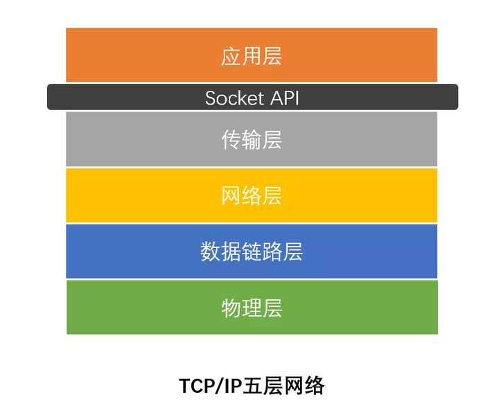

[toc]


#### 1.IO多路复用，epoll与select，poll对比，实现和区别

##### 1.IO模型

###### 同步和异步

针对比如接口调用，服务调用，API类库调用等

**同步**：用者必须要等待这个接口的磁盘读写或者网络通信的操作执行完毕了，调用者才能返回

**异步**：调用者调用接口之后，直接就返回了，他去干别的事儿了，也不管那个接口的磁盘读写或者是网络通信是否成功，然后这个接口后续如果干完了自己的任务，比如写完了文件或者是什么的，会反过来通知调用者，之前你的那个调用成功了。可以通过一些内部通信机制来通知，也可以通过回调函数来通知。

###### 阻塞和非阻塞

针对底层IO操作

**阻塞**：比如现在我们的程序想要通过网络读取数据，如果是阻塞IO模式，一旦发起请求到操作系统内核去从网络中读取数据，就会阻塞在那里，必须要等待网络中的数据到达了之后，才能从网络读取数据到内核，再从内核返回给程序。

**非阻塞**：程序发送请求给内核要从网络读取数据，但是此时网络中的数据还没到，此时不会阻塞住，内核会返回一个异常消息给程序，程序可以干点别的，然后不断去**轮询**去访问内核，看请求的数据是否读取到了。

###### BIO，NIO和AIO

**BIO**：主要就是**同步阻塞**IO模型，代码里调用IO相关接口，发起IO操作之后，程序就会同步等待，**这个同步指的是程序调用IO API接口的层面而言**。而IO API在底层的IO操作是**基于阻塞IO**来的，向操作系统内核发起IO请求，系统内核会等待数据就位之后，才会执行IO操作，执行完毕了才会返回。

**NIO**是**同步非阻塞**，也就是说如果你调用NIO接口去执行IO操作，其实还是同步等待的，但是在底层的IO操作上 ，会对系统内核发起非阻塞IO请求，以非阻塞的形式来执行IO。也就是说，**如果底层数据没到位，那么内核返回异常信息，不会阻塞住，但是NIO接口内部会采用非阻塞方式过一会儿再次调用内核发起IO请求，直到成功为止。**但是之所以说是同步非阻塞，这里的**“同步”指的就是因为在你的代码调用NIO接口层面是同步的**，你还是要同步**等待底层IO操作真正完成了才可以返回**，只不过**在执行底层IO的时候采用了非阻塞的方式**来执行罢了。

###### **NIO网络通信与IO多路复用模型**

如果基于NIO进行网络通信，采取的就是多路复用的IO模型，这个多路复用IO模型针对的是网络通信中的IO场景来说的。简单来说，就是在基于Socket进行网络通信的时候，如果有多个客户端跟你的服务端建立了Socket连接，那你就需要维护多个Socket连接。

而所谓的多路复用IO模型，就是说你的代码直接通过一个select函数调用，直接会进入一个同步等待的状态。

这也是为什么说**NIO一定是“同步”的，因为你必须在这里同步等待某个Socket连接有请求到来**。

接着你就要同步等着select函数去对底层的多个 Socket 连接进行轮询，不断的查看各个 Socket 连接谁有请求到达，就可以让select函数返回，交给我们的程序来处理。

**select函数在底层会通过非阻塞的方式轮询各个Socket**，任何一个Socket如果没有数据到达，那么非阻塞的特性会立即返回一个信息。

然后select函数可以轮询下一个Socket，**不会阻塞在某个Socket上**，所以底层是基于这种非阻塞的模式来“监视”各个Socket谁有数据到达的。

这就是所谓的“同步非阻塞”，但是因为操作系统把上述工作都封装在一个select函数调用里了，可以对多路Socket连接同时进行监视，所以就把这种模型称之为“IO多路复用”模型。

通过这种IO多路复用的模型，就可以用一个线程，调用一个select函数，然后监视大量的客户端连接了。

###### **AIO**

AIO，也叫做NIO 2.0，他就支持异步IO模型了。我们先说一下异步IO模型是什么意思。

简单来说，就是你的程序可以基于AIO API发起一个请求，比如说接收网络数据，AIO API底层会基于异步IO模型来调用操作系统内核。此时不需要去管这个IO是否成功了，AIO接口会直接返回，你的程序也会直接返回。

因为BIO、NIO都是同步的，你发起IO请求，都必须同步等待IO操作完成。但是这里你发起一个IO请求，直接AIO接口就返回了，你就可以干别的事儿了，纯异步的方式。不过你**需要提供一个回调函数给AIO接口**，一旦底层系统内核完成了具体的IO请求，比如网络读写之类的，就会回调你提供的回调函数。

###### **用户空间和内核空间**

用户空间是**常规进程**所在区域，是**非特权**区域：比如，在该区域执行的代码就**不能直接访问硬件设备**。 

内核空间是**操作系统**所在区域。内核代码有特别的权力：它能与设备控制器通讯，控制着用户区域进程的运行状态，等等。最重要的是，**所有 I/O 都直接（如这里所述）通过内核空间**。 

**当进程请求 I/O 操作的时候，它执行一个系统调用（有时称为陷阱）将控制权移交给内核**。 C/C++程序员所熟知的底层函数 open( )、read( )、write( )和 close( )要做的无非就是建立和执行适当的系统调用。当内核以这种方式被调用，它随即采取任何必要步骤，**找到进程所需数据，并把数据传送到用户空间内的指定缓冲区**。内核试图对数据进行高速缓存或预读取，因此进程所需数据可能已经在内核空间里了。如果是这样，该数据只需简单地拷贝出来即可。如果数据不在内核空间，则进程被挂起，内核着手把数据读进内存。 

**把数据从内核空间拷贝到用户空间似乎有些多余。为什么不直接 让磁盘控制器把数据送到用户空间的缓冲区呢？**这样做有几个问题。首先，硬件通常不能直接访问用户空间 。其次，像磁盘这样基于块存储的硬件设备操作的是固定大小的数据块，而用户进程请求的可能是任意大小的或非对齐的数据块。在数据往来于用户空间与存储设备的过程中，**内核负责数据的分解、再组合工作，因此充当着中间人的角色**。

**==I/O多路复用发生在read()操作之前，也就是传输fd==**。

##### select，poll，epoll对比

###### select

- select**能监控的描述符个数**由内核中的FD_SETSIZE限制，仅为**1024**，这也是select**最大的缺点**，因为现在的服务器并发量远远不止1024。即使能重新编译内核改变FD_SETSIZE的值，但这并不能提高select的性能。
- 每次调用select都会**线性扫描所有描述符的状态**，在select结束后，用户也要线性扫描fd_set数组才知道哪些描述符准备就绪，等于说**每次调用复杂度都是O（n）的**，在并发量大的情况下，每次扫描都是相当耗时的，很有可能有未处理的连接等待超时。
- 每次调用select都要**在用户空间和内核空间里进行内存复制fd描述符等信息**。

###### poll

- poll使用**pollfd结构**来存储fd，**突破了select中描述符数目的限制**。采用**链表**的方式替换原有fd_set数据结构，poll使用pollfd的指针，pollfd结构包含了要监视的event和发生的evevt，不再使用select传值的方法。更方便，而使其没有连接数的限制。
- 与select的后两点类似，poll**仍然需要将pollfd数组拷贝到内核空间**，之后依次扫描fd的状态，整体复杂度依然是**O（n）**的，在并发量大的情况下服务器性能会快速下降。

###### epoll

- epoll维护的描述符数目**不受到限制**，而且**性能不会随着描述符数目的增加而下降**。
- 服务器的特点是经常维护着大量连接，但其中某一时刻读写的操作符数量却不多。epoll先通过epoll_ctl**注册一个描述符到内核中**，并一直维护着而不像poll每次操作都将所有要监控的描述符传递给内核；在**描述符读写就绪时，通过回调函数将自己加入就绪队列中**，之后**epoll_wait返回该就绪队列**。也就是说，epoll基本不做无用的操作，**时间复杂度仅与活跃的客户端数有关**，而不会随着描述符数目的增加而下降。
- epoll在传递内核与用户空间的消息时使用了**内存共享，而不是内存拷贝**，这也使得epoll的效率比poll和select更高。

###### 总结

在选择select，poll，epoll时要根据具体的使用场合以及这三种方式的自身特点：
1、表面上看epoll的性能最好，但是在连接数少并且连接都十分活跃的情况下，select和poll的性能可能比epoll好，毕竟**epoll的通知机制需要很多函数回调**。
2、select低效是因为每次它都需要轮询。但低效也是相对的，视情况而定，也可通过良好的设计改善。


#### 2.内核态用户态，使用场景，切换方式

##### 内核态用户态

根据**进程访问资源的特点**，我们可以把**进程**在系统上的运行分为**两个级别**：

1. **用户态(user mode)** ：用户态运行的进程或可以直接读取**用户程序**的数据。
2. **系统态(kernel mode)**：可以简单的理解系统态运行的进程或程序几乎可以访问计算机的任何资源，不受限制。

**为什么需要两个？**

在 CPU 的所有指令中，有些指令是非常危险的，如果使用不当，将会造成系统崩溃等后果。

为了避免这种情况发生，CPU 将指令划分为**特权级(内核态)指令**和**非特权级(用户态)指令。**

**对于那些危险的指令只允许内核及其相关模块调用，对于那些不会造成危险的指令，就允许用户应用程序调用。**

* 内核态(核心态,特权态): **内核态是操作系统内核运行的模式。**
    内核态控制**计算机的硬件资源，如硬件设备，文件系统等等**，并为上层应用程序提供执行环境。

* 用户态: **用户态是用户应用程序运行的状态。**
    应用程序必须依托于内核态运行,因此用户态的态的操作权限比内核态是要低的，
    如**磁盘，文件**等，访问操作都是受限的。
* 系统调用: 系统调用是操作系统为应用程序提供能够访问到内核态的资源的接口。

我们运行的**程序基本都是运行在用户态**，如果我们调用操作系统提供的系统态级别的子功能咋办呢？那就需要**系统调用**了！

也就是说在我们运行的用户程序中，凡是**与系统态级别的资源有关的操作**（如文件管理、进程控制、内存管理等)，都必须通过系统调用方式向操作系统提出服务请求，并由操作系统代为完成。

##### 切换方式

* **系统调用**: 系统调用是用户态**主动要求**切换到内核态的一种方式，
    用户应用程序通过操作系统调用内核为上层应用程序开放的接口来执行程序。
* **异常**: 当 CPU 在执行用户态的应用程序时，**发生了某些不可知的异常**。
    于是当前用户态的应用进程切换到处理此异常的内核的程序中去。
* **硬件设备的中断**: 当硬件设备完成用户请求后，会向 CPU 发出相应的中断信号，
    这时 CPU 会暂停执行下一条即将要执行的指令，转而去执行与中断信号对应的应用程序，
    如果先前执行的指令是用户态下程序的指令，那么这个转换过程也是用户态到内核态的转换。

Linux 的系统调用主要有以下这些：

|     Task     | Commands                               |
| :----------: | -------------------------------------- |
| **进程控制** | **fork**(); **exit**(); **wait**();    |
| **进程通信** | **pipe**(); **shmget**(); mmap();      |
| **文件操作** | **open**(); **read**(); **write**();   |
| **设备操作** | ioctl(); **read**(); write();          |
| **信息维护** | **getpid**(); alarm(); **sleep**();    |
|   **安全**   | **chmod**(); **umask**(); **chown**(); |

#### 3.进程，线程，协程

链接：https://www.cnblogs.com/Survivalist/p/11527949.html

**进程**，直观点说，保存在硬盘上的程序运行以后，会在内存空间里形成一个独立的内存体，这个内存体**有自己独立的地址空间，有自己的堆**，上级挂靠单位是**操作系统**。**操作系统会以进程为单位，分配系统资源（CPU时间片、内存等资源），进程是资源分配的最小单位**。

**线程**，有时被称为轻量级进程(Lightweight Process，LWP），**是操作系统调度（CPU调度）执行的最小单位**。

##### 进程和线程的区别

1. 线程是**程序执行**的最小单位，而进程是操作系统**分配资源**的最小单位；
2. 一个进程由一个或多个线程组成，线程是一个进程中代码的不同执行路线；
3. 进程之间相互独立，但同一进程下的各个线程之间共**享程序的内存空间**(包括代码段、数据集、堆等)及一些进程级的资源(如打开文件和信号)，**某进程内的线程在其它进程不可见**；
4. 调度和切换：线程上下文切换比进程上下文切换要快得多。

##### 任务调度

大部分操作系统(如Windows、Linux)的任务调度是采用**时间片轮转的抢占式调度**方式。

在一个进程中，当一个线程任务执行几毫秒后，会由操作系统的**内核进行调度**，通过硬件的计数器中断处理器，让该线程强制暂停并将该线程的寄存器放入内存中，通过查看线程列表决定接下来执行哪一个线程，并从内存中恢复该线程的寄存器，最后恢复该线程的执行，从而去执行下一个任务。上述过程中，任务执行的那一小段时间叫做时间片，任务正在执行时的状态叫运行状态，被暂停的线程任务状态叫做就绪状态，意为等待下一个属于它的时间片的到来。

##### 多线程与多核

现在的电脑一般是双核四线程、四核八线程，是采用**超线程技术**将一个物理处理核心模拟成两个逻辑处理核心，对应两个内核线程，所以在操作系统中看到的CPU数量是实际物理CPU数量的两倍。

程序一般不会直接去使用内核线程，而是去使用内核线程的一种高级接口——**轻量级进程**（Lightweight Process，LWP），轻量级进程就是我们通常意义上所讲的线程，也被叫做**用户线程**。由于每个轻量级进程都由一个内核线程支持，因此只有先支持内核线程，才能有轻量级进程。

用户线程与内核线程的对应关系有三种模型：一对一模型、多对一模型、多对多模型。

##### 一对一模型

一个用户线程就唯一地对应一个内核线程，一个用户线程就唯一地映射到一个物理CPU的内核线程，线程之间的并发是真正的并发。

###### 优点

一对一模型使用户线程具有与内核线程一样的优点，**一个线程因某种原因阻塞时其他线程的执行不受影响**；此处，一对一模型也可以让多线程程序在多处理器的系统上有更好的表现。

###### 缺点

1. 许多操作系统限制了内核线程的数量，因此一对一模型会使用户线程的数量受到限制；
2. 许多操作系统内核线程调度时，上下文切换的开销较大，导致用户线程的执行效率下降。

##### 多对一模型

将多个用户线程映射到一个内核线程上，线程之间的切换由用户态的代码来进行，系统内核感受不到线程的实现方式。用户线程的建立、同步、销毁等都在用户态中完成，不需要内核的介入。

###### 优点

多对一模型的线程上下文切换速度要快许多；此外，多对一模型对用户线程的数量几乎无限制。

###### 缺点

1. 如果其中一个用户线程阻塞，那么其它所有线程都将无法执行，因为此时内核线程也随之阻塞了；
2. 在多处理器系统上，处理器数量的增加对多对一模型的线程性能不会有明显的增加，因为所有的用户线程都映射到一个处理器上了。

##### 多对多模型

将多个用户线程映射到多个内核线程上。由线程库负责在可用的可调度实体上调度用户线程，这使得线程的上下文切换非常快，因为它避免了系统调用。但是增加了复杂性和优先级倒置的可能性，以及在用户态调度程序和内核调度程序之间没有广泛（且高昂）协调的次优调度。

多对多模型的优点有：

1. 一个用户线程的阻塞不会导致所有线程的阻塞，因为此时还有别的内核线程被调度来执行；
2. 多对多模型对用户线程的数量没有限制；
3. 在多处理器的操作系统中，多对多模型的线程也能得到一定的性能提升，但提升的幅度不如一对一模型的高。

##### 线程的生命周期

当线程的数量小于处理器的数量时，线程的并发是真正的并发，不同的线程运行在不同的处理器上。但当线程的数量大于处理器的数量时，线程的并发会受到一些阻碍，此时并不是真正的并发，因为此时至少有一个处理器会运行多个线程。

在单个处理器运行多个线程时，并发是一种模拟出来的状态。操作系统采用时间片轮转的方式轮流执行每一个线程。线程是程序执行的最小单位，也是任务执行的最小单位。

进程在运行过程有三种状态：就绪、运行、阻塞，创建和退出状态描述的是进程的创建过程和退出过程。

- 创建：进程正在创建，还不能运行。操作系统在创建进程时要进行的工作包括**分配和建立进程控制块表项、建立资源表格并分配资源、加载程序并建立地址空间**；
- 就绪：**时间片已用完，此线程被强制暂停，等待**下一个属于它的时间片到来；
- 运行：此线程正在执行，**正在占用时间片**；
- 阻塞：也叫等待状态，**等待某一事件(如IO或另一个线程)执行完**；
- 退出：进程已结束，所以也称结束状态，**释放操作系统分配的资源**。

**线程**：

- 创建：一个新的线程被创建，等待该线程被调用执行；
- 就绪：**时间片已用完**，此线程被强制暂停，等待下一个属于它的时间片到来；
- 运行：此线程正在执行，正在占用时间片；
- 阻塞：也叫等待状态，等待某一事件(如IO或另一个线程)执行完；
- 退出：**一个线程完成任务或者其他终止条件发生**，该线程终止进入退出状态，退出状态释放该线程所分配的资源。

##### 协程

Coroutines，是一种基于线程之上，但又比线程更加轻量级的存在，由程序员自己写程序来管理的轻量级线程叫做『**用户空间线程**』，具有**对内核来说不可见**的特性。

###### 协程的目的

在传统的J2EE系统中都是基于每个请求占用一个线程去完成完整的业务逻辑（包括事务）。所以系统的吞吐能力取决于每个线程的操作耗时。如果遇到很耗时的I/O行为，则整个系统的吞吐立刻下降，因为这个时候**线程一直处于阻塞状态，如果线程很多的时候，会存在很多线程处于空闲状态（等待该线程执行完才能执行）**，造成了资源应用不彻底。

而协程的目的就是**当出现长时间的I/O操作时，通过让出目前的协程调度，执行下一个任务的方式，来消除ContextSwitch上的开销**。

###### 协程的特点

1. 线程的切换由操作系统负责调度，协程由**用户自己进行调度**，因此**减少了上下文切换**，提高了效率。
2. 线程的默认Stack大小是1M，而协程更轻量，接近1K。因此可以在相同的内存中开启更多的协程。
3. 由于在同一个线程上，因此可以**避免竞争关系而使用锁**。
4. 适用于被阻塞的，且需要**大量并发**的场景。但**不适用于大量计算的多线程**，遇到此种情况，更好实用线程去解决。

###### 协程的原理

协程是基于线程的。内部实现上，**维护了一组数据结构和 n 个线程**，真正的执行还是线程，**协程执行的代码被扔进一个待执行队列中**，由这 n 个线程从队列中拉出来执行。这就解决了协程的执行问题。那么协程是怎么切换的呢？答案是：golang 对各种 io函数 进行了封装，这些封装的函数提供给应用程序使用，而其**内部调用了操作系统的异步 io函数，当这些异步函数返回 busy 或 bloking 时，golang 利用这个时机将现有的执行序列压栈**，**让线程去拉另外一个协程的代码来执行**，基本原理就是这样，利用并封装了操作系统的异步函数。包括 linux 的 epoll、select 和 windows 的 iocp、event 等。

当**出现IO阻塞**的时候，由协程的调度器进行**调度**，通过将数据流立刻yield掉（**主动让出**），并且**记录当前栈上的数据，阻塞完后立刻再通过线程恢复栈**，并把阻塞的结果放到这个线程上去跑，这样看上去好像跟写同步代码没有任何差别，这整个流程可以称为coroutine，而跑在由`coroutine`负责调度的线程称为`Fiber`。比如Golang里的 go关键字其实就是负责开启一个`Fiber`，让`func`逻辑跑在上面。

由于协程的暂停完全由程序控制，发生在**用户态**上；而线程的阻塞状态是由操作系统内核来进行切换，发生在内核态上。因此，协程的开销远远小于线程的开销，也就没有了ContextSwitch上的开销。


#### 4.进程通信方法

##### 1.管道

**半双工**的，具有固定的读端和写端。

分为命名管道FIFO，无名管道Pipe，除了建立、打开、删除的方式不同外，这两种管道几乎是一样的。他们都是通过内核缓冲区实现数据传输。

- pipe用于**相关进程**之间的通信，例如父进程和子进程，它通过pipe()系统调用来创建并打开，当最后一个使用它的进程关闭对他的引用时，pipe将**自动撤销**。
- FIFO即命名管道，**在磁盘上有对应的节点，但没有数据块**——换言之，只是**拥有一个名字和相应的访问权限**，通过mknode()系统调用或者mkfifo()函数来建立的。一旦建立，**任何进程都可以通过文件名将其打开和进行读写，而不局限于父子进程**，当然前提是进程对FIFO有适当的访问权。**当不再被进程使用时，FIFO在内存中释放，但磁盘节点仍然存在**。
- 将另一个程序当做一个新的进程在当前程序进程中启动，则它算是**当前程序的子进程**，这种方式我们成为**高级管道方式**。

管道的实质是一个内核缓冲区，进程以先进先出的方式从缓冲区存取数据：管道一端的进程顺序地将进程数据写入缓冲区，另一端的进程则顺序地读取数据，该缓冲区可以看做一个循环队列，读和写的位置都是自动增加的，一个数据只能被读一次，读出以后再缓冲区都不复存在了。当缓冲区读空或者写满时，有一定的规则控制相应的读进程或写进程是否进入等待队列，当空的缓冲区有新数据写入或慢的缓冲区有数据读出时，就**唤醒等待队列中的进程继续读写**。

##### 2.消息队列

消息队列，就是**一系列保存在内核中消息的列表**。用户进程可以向消息队列添加消息，也可以向消息队列读取消息。消息队列与管道通信相比，其**优势**是**对每个消息指定特定的消息类型，接收的时候不需要按照队列次序，而是可以根据自定义条件接收特定类型的消息**。可以把消息看做一个记录，**具有特定的格式以及特定的优先级**。

进程间通过消息队列通信，主要是：创建或打开消息队列，添加消息，读取消息和控制消息队列。

##### 3.共享内存

共享内存**允许两个或多个进程共享一个给定的存储区**，这一段存储区可以被两个或两个以上的进程**映射至自身的地址空间中**，一个进程写入共享内存的信息，可以被其他使用这个共享内存的进程，通过一个简单的内存读取读出，从而实现了进程间的通信。

采用共享内存进行通信的一个主要好处是**效率高**，因为进程可以直接读写内存，而**不需要任何数据的拷贝**，对于像管道和消息队里等通信方式，则需要再内核和用户空间进行四次的数据拷贝，而共享内存则只拷贝两次：一次从输入文件到共享内存区，另一次从共享内存到输出文件。

一般而言，进程之间在共享内存时，并不总是读写少量数据后就解除映射，有新的通信时在重新建立共享内存区域；而是**保持共享区域，直到通信完毕为止**，这样，数据内容一直保存在共享内存中，并没有写回文件。共享内存中的内容往往是**在解除映射时才写回文件**，因此，采用共享内存的通信方式效率非常高。

共享内存有两种实现方式：1、内存映射 2、共享内存机制

##### 4.信号量

信号量（semaphore）与已经介绍过的 IPC 结构不同，它是一个**计数器**。信号量用于实现进程间的**互斥与同步**，而**不是用于存储进程间通信数据**。可以用来控制多个进程对共享资源的访问。它常作为一种锁机制，防止某进程正在访问共享资源时，其他进程也访问该资源。

信号量**用于进程间同步，若要在进程间传递数据需要结合共享内存。**

信号量基于操作系统的 PV 操作，**程序对信号量的操作都是原子操作**。

每次对信号量的 PV 操作不仅限于对信号量值加 1 或减 1，而且可以加减任意正整数。

支持信号量组。

##### 5.信号

用于通知接收进程某个事件已经发生。

##### 6.套接字( socket )  

与其他通信机制不同的是，它**可用于不同机器间的进程通信**。通过运行一个进程监听某个端口进行通信。


#### 5.什么是**零拷贝**？

链接：https://www.cnblogs.com/rickiyang/p/13265043.html

##### 虚拟文件系统

将操作系统底层的不同文件系统封装起来，为上层提供一个统一规范的文件系统调用接口。

###### 主要模块

1. 超级模块，保存文件元数据；
2. 目录项模块，存储的是目录下的所有文件的inode号和文件名等信息；
3. Inode模块，文件的唯一标识号；
4. 打开文件列表模块，包含所有内核已经打开的文件。已经打开的文件对象由 open 系统调用在内核中创建，也叫**文件句柄**。
5. file_operations 模块。这个模块中维护一个数据结构，是一系列函数指针的集合，其中包含所有可以使用的系统调用函数；
6. address_space 模块，它表示一个文件在页缓存中已经缓存了的物理页。

##### IO缓冲区

buffer 是一个用于**存储速度不同步**的设备或**优先级不同**的设备之间传输数据的区域。一方面，通过缓冲区，可以**使进程之间的相互等待变少**，从而使从速度慢的设备读入数据时，速度快的设备的操作进程不发生间断。另一方面，可以**保护硬盘或减少网络传输的次数**。

###### **Buffer 和 Cache**

cache 是高速缓存，用于 **CPU 和内存**之间的缓冲；

buffer是 I/O 缓存，用于**内存和硬盘**的缓冲。

简单的说，cache 是加速 **读**，而 buffer 是缓冲 **写**，前者解决读的问题，保存从磁盘上读出的数据，后者是解决写的问题，保存即将要写入到磁盘上的数据。

###### **Buffer Cache和 Page Cache**

都是为了处理设备和内存交互时高速访问的问题。buffer cache可称为块缓冲器，page cache可称为页缓冲器。

page cache 面向的是**虚拟内存**，块 I/O 缓存 Buffer cache 是面向**块设备**。

两者最大的区别是**缓存的粒度**。buffer cache 面向的是文件系统的块，而内核的内存管理组件采用了比文件系统的块更高级别的抽象：页(page)，其处理的性能更高。因此**和内存管理交互的缓存组件，都使用页缓存**。

##### 文件读写基本流程

###### **读文件**

1. **进程**调用库函数向**内核**发起读文件**请求**；
2. 内核通过检查进程的**文件描述符**定位到虚拟文件系统的**已打开文件列表项**；
3. 调用该文件可用的**系统调用函数** `read()`；
4. `read()` 函数通过文件表项链接到**目录项模块**，根据传入的文件路径，在目录项模块中检索，找到该文件的 `inode`；
5. 在 `inode` 中，通过**文件内容偏移量计算出要读取的页**；
6. 通过 `inode` 找到文件对应的 `address_space`；
7. 在 `address_space` 中访问该**文件的页缓存树**，查找对应的页缓存结点：
    1. 如果页缓存命中，那么直接返回文件内容；
    2. 如果页缓存缺失，那么产生一个页缺失异常，创建一个页缓存页，同时通过`inode` 找到文件该页的磁盘地址，读取相应的页填充该缓存页；
    3. 重新进行第 6 步查找页缓存；
8. 文件内容读取成功。

总结一下：**`inode` 管磁盘，`address_space` 接内存，两者互相指针链接**。

###### **写文件**

前5步和读文件一致，在 `address_space` 中查询对应页的页缓存是否存在；

6. 如果页缓存命中，直接把文件内容修改更新在页缓存的页中，写文件就结束了。这时候**文件修改位于页缓存**，并没有写回到磁盘文件中去。

7. 如果页缓存缺失，那么产生一个页缺失异常，创建一个页缓存页，同时通过 `inode` 找到文件该页的磁盘地址，读取相应的页填充该缓存页。此时缓存页命中，进行第 6 步。
8. 一个页缓存中的页如果被修改，那么会被标记成**脏页**，脏页需要写回到磁盘中的文件块。有两种方式可以把脏页写回磁盘：

9. 手动调用 `sync()` 或者 `fsync()` 系统调用把脏页写回；
10. pdflush 进程会定时把脏页写回到磁盘。

同时注意，脏页不能被置换出内存，如果脏页正在被写回，那么会被设置写回标记，这时候该页就被上锁，其他写请求被阻塞直到锁释放。

##### Linux I/O 读写方式

Linux 提供了**轮询、I/O 中断以及 DMA 传输**这 3 种**磁盘与主存**之间的数据传输机制。其中轮询方式是基于**死循环**对 I/O 端口进行不断检测。I/O 中断方式是指**当数据到达时，磁盘主动向 CPU 发起中断请求，由 CPU 自身负责数据的传输过程**。 DMA 传输则在 I/O 中断的基础上引入了 **DMA 磁盘控制器**，由 DMA 磁盘控制器负责数据的传输，**降低了 I/O 中断操作对 CPU 资源的大量消耗**。

##### 传统IO存在的问题

Linux 系统中，传统的访问方式是通过 `write()` 和 `read()` 两个系统调用实现的，通过 `read()` 函数读取文件到到缓存区中，然后通过 `write()`方法把缓存中的数据输出到网络端口。


**上下文切换**：当用户程序向内核发起系统调用时，CPU 将用户进程从用户态切换到内核态；当系统调用返回时，CPU 将用户进程从内核态切换回用户态。**内核态和用户态切换**

**CPU 拷贝**：由 CPU 直接处理数据的传送，数据拷贝时会一直占用 CPU 的资源。

**DMA 拷贝**：由 CPU 向 DMA 磁盘控制器下达指令，让 DMA 控制器来处理数据的传送，数据传送完毕再把信息反馈给 CPU，从而减轻了 CPU 资源的占有率。

基于传统的 I/O **读取方式**，read 系统调用会触发 2 次上下文切换，1 次 DMA 拷贝和 1 次 CPU 拷贝，发起数据读取的流程如下：

1. 用户进程通过`read()`函数向内核 (kernel) 发起系统调用，上下文从用户态 (user space) 切换为内核态 (kernel space)；
2. CPU 利用 DMA 控制器将数据从主存或硬盘拷贝到内核空间 (kernel space) 的读缓冲区 (read buffer)；
3. CPU 将读缓冲区 (read buffer) 中的数据拷贝到用户空间 (user space) 的用户缓冲区 (user buffer)。
4. 上下文从内核态 (kernel space) 切换回用户态 (user space)，read 调用执行返回。

基于传统的 I/O **写入方式**，`write()` 系统调用会触发 2 次上下文切换，1 次 CPU 拷贝和 1 次 DMA 拷贝，用户程序发送网络数据的流程如下：

1. 用户进程通过 `write()` 函数向内核 (kernel) 发起系统调用，上下文从用户态 (user space) 切换为内核态(kernel space)。
2. CPU 将用户缓冲区 (user buffer) 中的数据拷贝到内核空间 (kernel space) 的网络缓冲区 (socket buffer)。
3. CPU 利用 DMA 控制器将数据从网络缓冲区 (socket buffer) 拷贝到网卡进行数据传输。
4. 上下文从内核态 (kernel space) 切换回用户态 (user space)，write 系统调用执行返回。

##### 零拷贝方式

在 Linux 中零拷贝技术主要有 3 个实现思路：用户态直接 I/O、减少数据拷贝次数以及写时复制技术。

- **用户态直接 I/O**：**应用程序可以直接访问硬件存储**，操作系统内核只是辅助数据传输。这种方式依旧存在用户空间和内核空间的上下文切换，硬件上的数据直接拷贝至了用户空间，不经过内核空间。因此，直接 I/O 不存在内核空间缓冲区和用户空间缓冲区之间的数据拷贝。
- **减少数据拷贝次数**：在数据传输过程中，避免数据在用户空间缓冲区和系统内核空间缓冲区之间的CPU拷贝，以及数据在系统内核空间内的CPU拷贝，这也是当前**主流零拷贝技术的实现思路**。
- **写时复制技术**：写时复制指的是**当多个进程共享同一块数据时，如果其中一个进程需要对这份数据进行修改，那么将其拷贝到自己的进程地址空间中，如果只是数据读取操作则不需要进行拷贝操作。**


###### 用户态直接 I/O

使得应用进程或**运行在用户态下的库函数直接访问硬件设备**，数据直接跨过内核进行传输，极大提高了性能。

**缺点：**

1. 只能适用于**不需要内核缓冲区处理的应用程序**，这些应用程序通常在进程地址空间**有自己的数据缓存机制**，称为**自缓存应用程序**，如**数据库管理系统**就是一个代表。
2. 这种方法直接操作磁盘 I/O，由于 **CPU 和磁盘 I/O 之间的执行时间差距，会造成资源的浪费**，解决这个问题需要和**异步 I/O 结合**使用。

###### mmap + write

使用 mmap + write 代替原来的 read + write 方式，减少了 1 次 CPU 拷贝操作。mmap 是 Linux 提供的一种内存映射文件方法，即**将一个进程的地址空间中的一段虚拟地址映射到磁盘文件地址**。

使用 mmap 的目的是**将内核中读缓冲区(read buffer)的地址与用户空间的缓冲区(user buffer)进行映射**，从而实现**内核缓冲区与应用程序内存的共享**，省去了将数据从内核读缓冲区(read buffer)拷贝到用户缓冲区(user buffer)的过程，然而内核读缓冲区(read buffer)仍需将数据拷贝到内核写缓冲区(socket buffer)。

缺陷：

mmap 主要的用处是提高 I/O 性能，特别是针对大文件。对于小文件，内存映射文件反而会**导致碎片空间的浪费**，因为内存映射总是要**对齐页边界**，最小单位是 4 KB，一个 5 KB 的文件将会映射占用 8 KB 内存，也就会浪费 3 KB 内存。

另外 mmap 隐藏着一个**陷阱**，当**使用 mmap 映射一个文件时，如果这个文件被另一个进程所截获，那么 write 系统调用会因为访问非法地址被 SIGBUS 信号终止**，SIGBUS 默认会杀死进程并产生一个 coredump，如果服务器被这样终止那损失就可能不小。

解决这个问题通常使用文件的**租借锁**：首先为文件申请一个租借锁，当其他进程想要截断这个文件时，内核会发送一个实时的 `RT_SIGNAL_LEASE` 信号，告诉当前进程有进程在试图破坏文件，这样 write 在被 SIGBUS 杀死之前，会被中断，返回已经写入的字节数，并设置 errno 为 success。

通常的做法是**在 mmap 之前加锁，操作完之后解锁**。

###### sendfile

sendfile 目的是**简化通过网络在两个通道之间进行的数据传输过程**。sendfile 系统调用的引入，不仅减少了 CPU 拷贝的次数，还减少了上下文切换的次数。

**数据可以直接在内核空间内部进行 I/O 传输**，从而**省去了数据在用户空间和内核空间之间的来回拷贝**。与 mmap 内存映射方式不同的是， sendfile 调用中 I/O 数据**对用户空间是完全不可见**的。也就是说，这是一次完全意义上的数据传输过程。

缺点：

只能适用于那些不需要用户态处理的应用程序。

###### sendfile + DMA gather copy

DMA 辅助的 sendfile可以去掉剩下的一次内核态的拷贝。简单说就是利用DMA进行从读缓冲区到网卡的拷贝操作，减少CPUcopy。

###### splice

sendfile 只适用于将数据从文件拷贝到 socket 套接字上，同时需要硬件的支持，这也限定了它的使用范围。Linux 在 2.6.17 版本引入 splice 系统调用，不仅不需要硬件支持，还实现了**两个文件描述符之间的数据零拷贝**。

在内核空间的读缓冲区 (read buffer) 和网络缓冲区 (socket buffer) 之间**建立管道** (pipeline)，从而避免了两者之间的 CPU 拷贝操作。

splice 拷贝方式也同样存在用户程序不能对数据进行修改的问题。除此之外，它使用了 Linux 的管道缓冲机制，可以用于任意两个文件描述符中传输数据，但是它的**两个文件描述符参数中有一个必须是管道设备**。

###### 写时复制

在某些情况下，内核缓冲区可能被多个进程所共享，如果某个进程想要这个共享区进行 write 操作，由于 write 不提供任何的锁操作，那么就会对共享区中的数据造成破坏，写时复制的引入就是 **Linux 用来保护数据的**。

写时复制指的是当多个进程共享同一块数据时，如果其中一个进程需要对这份数据进行修改，那么就需要将其拷贝到自己的进程地址空间中。这样做并不影响其他进程对这块数据的操作，**每个进程要修改的时候才会进行拷贝**，所以叫写时拷贝。这种方法在某种程度上能够降低系统开销，如果某个进程永远不会对所访问的数据进行更改，那么也就永远不需要拷贝。

缺点：

需要 MMU 的支持，**MMU 需要知道进程地址空间中哪些页面是只读的**，**当需要往这些页面写数据时，发出一个异常给操作系统内核，内核会分配新的存储空间来供写入的需求**。

###### 缓冲区共享

缓冲区共享方式完全改写了传统的 I/O 操作，传统的 Linux I/O 接口支持数据在应用程序地址空间和操作系统内核之间交换，这种交换操作导致所有的数据都需要进行拷贝。

如果采用 fbufs 这种方法，**需要交换的是包含数据的缓冲区**，这样就消除了多余的拷贝操作。应用程序将 fbuf 传递给操作系统内核，这样就能减少传统的 write 系统调用所产生的数据拷贝开销。

同样的应用程序通过 fbuf 来接收数据，这样也可以减少传统 read 系统调用所产生的数据拷贝开销。

fbuf 的思想是**每个进程都维护着一个缓冲区池，这个缓冲区池能被同时映射到用户空间 (user space) 和内核态 (kernel space)，内核和用户共享这个缓冲区池，这样就避免了一系列的拷贝操作**。

缺点：

缓冲区共享的难度在于管理共享缓冲区池需要应用程序、网络软件以及设备驱动程序之间的紧密合作，而且如何改写 API 目前还处于试验阶段并不成熟。

##### Linux零拷贝对比

无论是传统 I/O 拷贝方式还是引入零拷贝的方式，**2 次 DMA Copy** 是都少不了的，因为两次 DMA 都是依赖硬件完成的。

| 拷贝方式                   | CPU拷贝 | DMA拷贝 |   系统调用   | 上下文切换 |
| -------------------------- | :-----: | :-----: | :----------: | :--------: |
| 传统方式(read + write)     |    2    |    2    | read / write |     4      |
| 内存映射(mmap + write)     |    1    |    2    | mmap / write |     4      |
| sendfile                   |    1    |    2    |   sendfile   |     2      |
| sendfile + DMA gather copy |    0    |    2    |   sendfile   |     2      |
| splice                     |    0    |    2    |    splice    |     2      |

#### 6.虚拟内存？怎么写虚拟内存？

**虚拟内存的重要意义是它定义了一个连续的虚拟地址空间**，并且 **把内存扩展到硬盘空间**。虚拟内存让进程有独享地址空间的错觉。让程序可以**拥有超过系统物理内存大小的可用内存空间**。

涉及到**swap交换空间，局部性原理（时间，空间），虚拟存储器**。

##### 技术实现

**虚拟内存的实现需要建立在离散分配的内存管理方式的基础上。** 

1. **请求分页存储管理** ：分页存储管理+请求**调页功能和页面置换**功能。
2. **请求分段存储管理** ：分段存储管理+**请求调段功能、分段置换**功能。
3. **请求段页式存储管理**

**请求分页存储管理不要求将作业全部地址空间同时装入主存**。基于这一点，请求分页存储管理可以提供虚存，而分页存储管理却不能提供虚存。

当一个进程试图访问虚拟地址空间中的某个数据时，会经历下面两种情况的过程：

1. CPU想访问某个虚拟内存地址，**找到进程对应的页表中的条目**，**判断有效位**
2. 如果有效位为1，说明在页表条目中的物理内存地址不为空，根据物理内存地址，访问物理内存中的内容，返回
3. 如果有效位为0，但页表条目中还有地址，这个地址是磁盘空间的地址，这时触发**缺页异常**，系统把物理内存中的一些数据拷贝到磁盘上，腾出所需的空间，并且**更新页表**。此时重新执行访问之前虚拟内存的指令

#### 7.页表，实现机制

进程的页式存储方式是**分散存储**的。

页表是一种特殊的数据结构，存放着各个虚拟页的状态，是否映射，是否缓存.。进程要知道哪些内存地址上的数据在物理内存上，哪些不在，还有在物理内存上的哪里，这就需要用页表来记录。页表的每一个表项分为两部分，第一部分记录此页是否在物理内存上，第二部分记录物理内存页的地址(如果在的话)。当进程访问某个虚拟地址，就会先去看页表，如果发现对应的数据不在物理内存中，则发生缺页异常。

**每一个进程**，只要在内存里面，就会拥有一张**页表**，页表也保存在内存里面。
进程内部，把程序和数据按照页框大小进行划分，分别保存，起始页码为0。在**页表中，包含与进程分页数相同数量的页表项**，每一个页表项由两部分组成，即**页号和其对应物理地址**（即物理块号，也是页框号），物理地址对应的页号=页表始址+页号*页表项长度（地址变换机构的硬件操作）。
在进程没有处于运行状态，但是存在于内存当中时，**进程控制块PCB中会保存页表在内存中的存储位置**，即始址+长度。
当进程转为运行状态，操作系统会根据PCB，把PCB中的页表信息调进**页表寄存器PTR**，地址变换机构根据页表、地址（页号、偏移量）找到相应程序和数据进行运行。

#### 8.多线程如何实现线程安全？

##### 同步

###### 阻塞（加锁）

无论共享数据是否真的会出现竞争，它都要进行加锁。

###### 非阻塞（CAS）

**基于冲突检测的乐观并发策略**，先进行操作，如果没有其他线程争用共享数据，那操作就成功了；如果共享数据有争用，产生了冲突，那就再采用其他的**补偿措施**。

非阻塞的实现CAS（compareandswap）：CAS指令需要有3个操作数，分别是**内存地址、旧的预期值**（用A表示）和**新值**（用B表示）。CAS指令执行时，CAS指令指令时，当且仅当V处的值符合旧预期值A时，处理器用B更新V处的值，否则它就不执行更新，但是**无论是否更新了V处的值，都会返回V的旧值**，上述的处理过程是一个**原子操作**。

**CAS缺点：**

​    **ABA问题**：因为CAS需要在操作值的时候检查下值有没有发生变化，如果没有发生变化则更新，但是一个值原来是A，变成了B，又变成了A，那么使用CAS进行检查时会发现它的值没有发生变化，但是实际上却变化了。

​    ABA问题的**解决思路就是使用版本号**。在变量前面追加版本号，每次变量更新的时候把版本号加一，那么A-B-A就变成了1A-2B-3C。

##### 无同步

###### 可重入代码

可重入代码（ReentrantCode）也称为纯代码（Pure Code），可以在代码执行的任何时刻中断它，转而去执行另外一段代码，而在控制权返回后，原来的程序不会出现任何错误。**所有的可重入代码都是线程安全的，但是并非所有的线程安全的代码都是可重入的**。 可重入代码的特点是**不依赖存储在堆上的数据和公用的系统资源、用到的状态量都是由参数中传入、不调用非可重入的方法等。**

###### 线程本地存储

把共享数据的**可见范围**限制在同一个线程之内。这样无需同步也能保证线程之间不出现数据的争用问题。

消费队列的架构模式（如“**生产者-消费者**”模式）都会将产品的消费过程尽量在一个线程中消费完。Web中一个请求对应一个服务器线程（Thread-per-Request）”的处理方式也是。

#### 9.可重入锁

可重入就是说某个线程已经获得某个锁，可以再次获取锁而不会出现死锁。

#### 10.Linux文件系统

#### 11.Linux命令

tail pwd chmod losf netstat top

#### 12.为什么线程的切换比协程慢？

主要在于**线程切换需要借助内核完成**，意味着 用户态 --> 内核态 --> 用户态，
而**协程切换只在用户态就可以完成**， 用户态 --> 用户态

用户态和内核态的切换是一部分的开销

切换频率，**线程切换频率比协程切换的频率高很多**， 因为协程库大多都在 IO 阻塞才切换.还有协程是串行的，线程是并行的，**协程是自主让渡执行时间，而且都跑在一个核心上，不需要复杂的调度算法**，不需要优先级管理，而线程，其自身不让渡核心时间，还有优先级。 操作系统需要像指挥交通那样指挥，所以耗时。

#### 13.socket相关

#### 14.cpu的上下文切换问题

##### CPU 上下文

在每个任务运行前，CPU 都需要知道任务从哪里加载、又从哪里开始运行，也就是说，**需要系统事先帮它设置好 CPU 寄存器和程序计数器**(Program Counter，PC)。**CPU 寄存器**，是 CPU 内置的容量小、但速度极快的内存。而**程序计数器，则是用来存储 CPU 正在执行的指令位置、或者即将执行的下一条指令位置**。它们都是 CPU 在运行任何任务前，**必须的依赖环境**，因此也被叫做 CPU 上下文。而这些保存下来的上下文，会存储在系统内核中，并在任务重新调度执行时再次加载进来。这样就能保证任务原来的状态不受影响，让任务看起来还是连续运行。

**根据任务的不同**，CPU的上下文切换可以分为不同的场景，也就是进程上下文切换、线程上下文切换、中断上下文切换。

##### **进程上下文切换**

进程既可以在用户空间运行，又可以在内核空间中运行。进程在用户空间运行时，被称为进程的用户态，而陷入内核空间的时候，被称为进程的内核态。从用户态到内核态的转变，需要通过系统调用来完成。**系统调用的过程发生 CPU 上下文的切换**。

CPU 寄存器里原来用户态的指令位置，需要先保存起来。接着，为了执行内核态代码，CPU 寄存器需要更新为内核态指令的新位置。最后才是跳转到内核态运行内核任务。而系统调用结束后，CPU 寄存器需要恢复原来用户保存的状态，然后再切换到用户空间，继续运行进程。所以，**一次系统调用的过程，其实是发生了两次 CPU 上下文切换**。不过，需要注意的是，系统调用过程中，并不会涉及到虚拟内存等进程用户态的资源，也不会切换进程。这跟我们通常所说的进程上下文切换是不一样的：

- 进程上下文切换，是指从一个进程切换到另一个进程运行。
- 而系统调用过程中一直是同一个进程在运行。

系统调用过程通常称为特权模式切换，而不是上下文切换。但实际上，系统调用过程中，CPU 的上下文切换还是无法避免的。

###### 进程上下文切换跟系统调用又有什么区别呢?

**进程是由内核来管理和调度的，进程的切换只能发生在内核态**。所以，进程的上下文不仅包括了虚拟内存、栈、全局变量等用户空间的资源，还包括了内核堆栈、寄存器等内核空间的状态。

因此，进程的上下文切换就比系统调用时多了一步：在保存当前进程的**内核状态和 CPU 寄存器**之前，需要先把该**进程的虚拟内存、栈**等保存下来;而加载了下一进程的内核态后，还需要**刷新进程的虚拟内存和用户栈**。

如下图所示，保存上下文和恢复上下文的过程并不是“免费”的，需要内核在 CPU 上运行才能完成。

##### **线程上下文切换**

 线程与进程最大的区别在于，**线程是调度的基本单位，而进程则是资源拥有的基本单位**。说白了，所谓**内核中的任务调度，实际上的调度对象是线程;而进程只是给线程提供了虚拟内存、全局变量等资源**。所以，对于线程和进程，我们可以这么理解：

- 当进程只有一个线程时，可以认为进程就等于线程。
- 当进程拥有多个线程时，这些线程会**共享相同的虚拟内存和全局变量等资源**。这些资源在上下文切换时是不需要修改的。
- 另外，**线程也有自己的私有数据，比如栈和寄存器**等，这些在上下文切换时也是需要保存的。

这么一来，线程的上下文切换其实就可以分为两种情况：

​    第一种， **前后两个线程属于不同进程**。此时，因为资源不共享，所以**切换过程就跟进程上下文切换是一样**。

​    第二种，**前后两个线程属于同一个进程**。此时，因为虚拟内存是共享的，所以在切换时，虚拟内存这些资源就保持不动，只需要切换线程的私有数据、寄存器等不共享的数据。

##### **中断上下文切换**

​    为了快速响应硬件的事件，**中断处理会打断进程的正常调度和执行，转而调用中断处理程序**，响应设备事件。而在打断其他进程时，就需要将进程当前的状态保存下来，这样在中断结束后，进程仍然可以从原来的状态恢复运行。

**对同一个 CPU 来说，中断处理比进程拥有更高的优先级**，所以中断上下文切换并不会与进程上下文切换同时发生。同样道理，由于中断会打断正常进程的调度和执行，所以大部分中断处理程序都短小精悍，以便尽可能快的执行结束。

另外，跟进程上下文切换一样，中断上下文切换也需要消耗 CPU，切换次数过多也会耗费大量的 CPU，甚至严重降低系统的整体性能。所以，当你发现中断次数过多时，就需要注意去排查它是否会给你的系统带来严重的性能问题。

#### 15.755是什么权限？

拥有者可读可写可执行 群组可读可执行 其他组可读可执行

#### 16.linux 查找当前文件后20行

tail -n 20 filename

#### 17.Linux统计字符出现的个数

Grep -o objStr filename|wc - l

#### 18.Linux的进程调度算法

##### 1. 批处理系统

**批处理系统**没有太多的用户操作，在该系统中，调度算法目标是**保证吞吐量和周转时间**（从**提交到终止**的时间）。

###### ① 先来先服务first-come first-serverd（FCFS）

按照请求的顺序进行调度。

有利于长作业，但不利于短作业，因为短作业必须一直等待前面的长作业执行完毕才能执行，而长作业又需要执行很长时间，造成了短作业等待时间过长。

###### ② 短作业优先shortest job first（SJF）

按估计运行时间**最短**的顺序进行调度。

长作业有可能会饿死，处于一直等待短作业执行完毕的状态。因为如果一直有短作业到来，那么长作业永远得不到调度。

###### ③ 最短剩余时间优先shortest remaining time next（SRTN）

按估计剩余时间最短的顺序进行调度。

##### 2. 交互式系统

交互式系统有大量的用户交互操作，在该系统中调度算法的目标是**快速地进行响应**。

###### ① 时间片轮转算法

将所有就绪进程按 **FCFS** (先来先服务)的原则排成一个队列，每次调度时，把 CPU 时间分配给**队首进程**，该进程可以执行一个时间片。当时间片用完时，由计时器发出时钟**中断**，调度程序便停止该进程的执行，并将它送往就绪队列的末尾，同时继续把 CPU 时间分配给队首的进程。

时间片轮转算法的效率和**时间片的大小**有很大关系：

- 因为进程切换都要保存进程的信息并且载入新进程的信息，如果时间片太小，会导致进程切换得太频繁，在进程切换上就会花过多时间。
- 而如果时间片过长，那么实时性就不能得到保证。

###### ② 优先级调度算法

为每个进程分配一个**优先级**，按优先级进行调度。

为了防止低优先级的进程永远等不到调度，可以随着时间的推移增加等待进程的优先级。

###### ③ 多级反馈队列算法

一个进程需要执行 100 个时间片，如果采用时间片轮转调度算法，那么需要**交换 100 次**。

多级队列是为这种需要**连续执行多个时间片**的进程考虑，它设置了**多个队列**，每个队列时间片大小都不同，例如 1, 2, 4, 8 ,..。进程在第一个队列没执行完，就会被移到**下一个队列**。这种方式下，之前的进程只需要交换 7 次。

每个**队列优先权**也不同，最上面的优先权最高。因此只有上一个队列没有进程在排队，才能调度当前队列上的进程。

可以将这种调度算法看成是**时间片轮转调度算法和优先级调度算法**的**==结合==**。UNIX 操作系统采取的便是这种调度算法。

#### 19.Linux的watch和Ctrl+C是怎么实现的？

##### linux下的watch命令

在linux下，watch是**周期性的执行下一个命令，并全屏显示执行结果**。

- -n --interval 指定间隔时间
- -d --differences 高亮显示变化的区域
- -d=cumulative 把变动过的地方都高亮显示，不管最近的那次有没有变动
- -t --no-title 关闭watch命令在屏幕顶部的时间间隔、命令和时间的输出

FreeBSD和Linux下watch命令不同。在Linux下，watch是周期性的执行下一个程序，并全屏显示执行结果。而FreeBSD下的watch命令是查看其它用户的正在运行的操作，watch允许你偷看其它terminal正在做的事，前提是超级用户。

#### 20.内存泄漏和内存溢出的区别？有什么危害？

内存溢出是分配的内存空间被使用完，无可用空间。而内存泄漏是分配的内存由于某些原因，导致无法被回收，时间久了也会导致内存溢出。

#### 21.分页和分段内存管理有什么区别？

(1) **页是信息的物理单位**，分页是**为实现离散分配方式**，以消减内存的外零头，提高内存的利用率。**段则是信息的逻辑单位**，它含有**一组其意义相对完整的信息**。分段的目的是为了能**更好地满足用户的需要**。

(2) 页的大小固定且由系统决定；而段的长度却不固定，决定于用户所编写的程序。

(3) **分页的地址空间是一维的**，程序员只需利用一个记忆符，即可表示一个地址；而**分段的作业地址空间是二维**的，程序员在标识一个地址时，既需给出**段名，又需给出段内地址**。

#### 22.copy是操作符还是内置函数？

#### 23.进程的五种状态及状态间转移


- 新创建态
- 就绪状态（ready）：等待被调度
- 运行状态（running）
- 阻塞状态（waiting）：等待资源
- 结束态

应该注意以下内容：

- 只有就绪态和运行态可以**相互转换**，其它的都是单向转换。就绪状态的进程通过调度算法从而获得 CPU 时间，转为运行状态；而运行状态的进程，在分配给它的 CPU 时间片用完之后就会转为就绪状态，等待下一次调度。
- 阻塞状态是缺少需要的资源从而由运行状态转换而来，但是该资源不包括 CPU 时间，缺少 CPU 时间会从运行态转换为就绪态。

#### 24.僵尸进程和孤儿进程，有什么危害？

##### 孤儿进程

一个**父进程**退出，而它的一个或多个子进程还在运行，那么这些子进程将成为孤儿进程。

孤儿进程将被 **init 进程**（进程号为 1）所收养，并由 init 进程对它们完成**状态收集工作**。

由于孤儿进程会被 init 进程收养，所以孤儿进程不会对系统造成危害。

##### 僵尸进程

一个子进程的进程描述符在子进程退出时不会释放，**只有当父进程通过 wait() 或 waitpid() 获取了子进程信息后才会释放**。如果**子进程退出，而父进程并没有调用 wait() 或 waitpid()**，那么子进程的**进程描述符**仍然保存在系统中，这种进程称之为僵尸进程。

僵尸进程通过 ps 命令显示出来的状态为 **Z（zombie）**。

系统所能使用的进程号是有限的，如果产生大量僵尸进程，将因为**没有可用的进程号**而导致系统不能产生新的进程。

要**消灭**系统中大量的僵尸进程，只需要将其**父进程**杀死，此时僵尸进程就会变成孤儿进程，从而被 init 进程所收养，这样 init 进程就会释放所有的僵尸进程所占有的资源，从而结束僵尸进程。

#### 25.硬链接和软链接

##### 1. 实体链接（硬链接）

在目录下创建一个条目，记录着**文件名与 inode 编号**，这个 inode 就是**源文件的 inode**。

**删除任意一个**条目，文件还是**存在**，只要**引用数量不为 0**。

有以下限制：**不能跨越文件系统、不能对目录进行链接**。

##### 2. 符号链接（软链接）

符号链接文件保存着**源文件所在的绝对路径**，在读取时会定位到**源文件**上，可以理解为 **Windows 的快捷方式。**

当**源文件**被删除了，链接文件就**打不开**了。

因为记录的是**路径**，所以可以为**==目录==建立链接**。

#### 26.TCP time_wait状态存在的原因

**客户端**接收到服务器端的 **FIN 报文**后进入此状态，此时**并不是直接进入 CLOSED** 状态，还需要等待一个**时间计时器**设置的时间 **2MSL**。这么做有两个理由：

- 确保**最后一个确认报文**能够到达。如果 **B 没收到** A 发送来的**确认报文**，那么就会**重新发送连接释放**请求报文，A 等待一段时间就是为了处理这种情况的发生。
- 等待一段时间是为了让本连接持续时间内所产生的**所有报文都从网络中消失**，使得下一个新的连接**不会出现旧的连接**请求报文。

#### 27.**Linux如何从网卡驱动中读取数据？**

#### 28.计算机组成部分

运算器、控制器、存储器、输入设备和输出设备

#### 29.socket如何标识

#### 30.二进制的原码反码，补码

##### 原码

一个正数，转换为二进制位就是这个正数的原码。负数的绝对值转换成二进制位然后在高位补1就是这个负数的原码。

##### 反码

正数的反码就是原码，负数的反码等于**原码除符号位以外所有的位取反。**

##### 补码

正数的补码与原码相同，负数的补码为其原码除符号位外所有位取反（得到反码了），然后最低位加1.

#### 31.计算机中的文字乱码，字符集和字符编码的含义、如何区分？（[文章](https://www.cnblogs.com/skynet/archive/2011/05/03/2035105.html)）

#### 32.程序的压栈出栈含义

堆栈是RAM中划出的一片特殊存储区，用于临时存放一些重要数据（这些数据存放一会后是必须回到原位的），其中数据的位置由堆栈指针确定，而数据的存放和读取则由入栈指令和出栈指令控制，入出必须对应成对的使用才能使压入的数据正确的回到压入前的位置。
比如：当前正在运行某程序，要调用一个子程序，而子程序中会用到A、B、C三单元，主程序中这三个单元中现有的信息在子程序运行结束后还要继续用的，那么就需要用堆栈临时保存这些数据，等子程序结束后再还原。入栈时是压入A、压入B、压入C，出栈则必须是出C、出B、出A。这就好比子弹夹，先压进去的子弹在下，后压进去的在上，子弹进入枪膛（相当于出栈）则是相反，先上面后下面，正如一楼“一叠盘子”的比喻。这种用法的约定，是堆栈本身特性决定的，必须遵守。

#### 33.Linux awk指令

awk是一个强大的**文本分析工具**，相对于grep的查找，sed的编辑，awk在其**对数据分析并生成报告时**，显得尤为强大。简单来说awk就是**把文件逐行的读入，以空格为默认分隔符将每行切片，切开的部分再进行各种分析处理。**

#### 34.对缓存的理解

系统层面（L1、L2、L3）、网络层面（浏览器缓存）、服务器层面（redis）

#### 35.Linux nginx日志文件找出次数最多的IP

sort、uniq、awk

#### 36.Linux 查看一个端口的运行情况

```shell
查看到进程占用的端口号
netstat -anp | grep pid
```

#### 37.用过定时任务吗？

Corn

#### 38.常用的shell命令

#### 39.Linux内核了解

#### 40.mmu内存管理单元

有时称作**分页内存管理单元**（英语：**paged memory management unit**，缩写为**PMMU**）。它是一种负责处理中央处理器（CPU）的内存访问请求的计算机硬件。它的功能包括虚拟地址到物理地址的转换（即虚拟内存管理）、内存保护、中央处理器高速缓存的控制。

除了提供虚拟内存管理，让应用程序可以使用超出物理内存的空间之外，还对实际的物理内存进行分割和保护，使得每个软件任务只能访问其分配到的内存空间。如果某个任务试图访问其他任务的内存空间，内存管理单元将自动产生异常，保护其他任务的程序和数据不受破坏。

#### 41.死锁

##### 必要条件

- **互斥**：每个资源要么已经分配给了一个进程，要么就是可用的。
- **占有和等待**：已经得到了某个资源的进程可以**再请求新**的资源。
- **不可抢占**：已经分配给一个进程的资源**不能强制性地被抢占**，它只能被占有它的进程**显式地释放**。
- **环路等待**：有两个或者两个以上的**进程组成一条环路**，该环路中的每个进程都在等待下一个进程所占有的资源。

##### 处理死锁

- **鸵鸟策略**
- **死锁检测与死锁恢复**
    - 利用**抢占**恢复
    - 利用**回滚**恢复
    - 通过**杀死进程**恢复
- **死锁预防** 
- **死锁避免**

#### 42.在linux下怎么查找一个日志文件一个方法返回的不同code码的个数

#### 43.如何解决孤儿进程的出现？

#### 44.一个文件中去重后的IP地址数目

Awk

#### 45.如何查看某个进程占用的内存大小？

ps aux | grep xxx

#### 46.内存分页的目的？

分页机制允许进程的物理地址空间可以是非连续的（因而一些**内存碎片**可以得到利用）
而且**交换空间**也是’分为‘同样大小的页，在将内存块备份到交换空间时更容易处理

#### 47.线程共享的有什么？不共享的有什么？协程呢？

##### 线程共享

###### 资源

- 堆。由于堆是在进程空间中开辟出来的，所以它是理所当然地被共享的;
- 全局变量。全局变量它是与具体某一函数无关的，所以也与特定线程无关;因此也是共享的

###### 环境

进程**代码段**，进程的**公有数据**（利用这些共享的数据，线程很容易的实现相互之间的通讯），进程**打开的文件描述符**，信号的处理器，进程的**当前目录和进程用户ID与进程组ID**。

##### 线程独享

###### 资源

- 栈
- 寄存器。每个线程里存放着寄存器的副本是不一样的

###### 个性

- 线程ID
- 寄存器组的值
- 线程的堆栈
- 错误返回码
- 线程的信号屏蔽码
- 线程的优先级

##### 协程共享

全局变量

堆

##### 协程不共享

栈

#### 48.死锁的必要条件

- 互斥
- 占有和等待
- 不可抢占
- 环路等待

#### 49.死锁的预防

###### ① 破坏互斥条件

例如假脱机打印机技术允许若干个进程同时输出，唯一真正请求物理打印机的进程是打印机守护进程。

###### ② 破坏占有和等待条件

一种实现方式是规定所有进程在**开始执行前请求所需要的全部资源**。

###### ③ 破坏不可抢占条件

###### ④ 破坏环路等待

给资源**统一编号**，进程只能**按编号顺序**来请求资源。

##### 50. 死锁避免

1. 判断“系统安全状态”法

在进行系统资源分配之前，**先计算此次资源分配的安全性**。若此次分配不会导致系统进入不安全状态，则将资源分配给**进程； 否则，让进程**等待。 

2. 银行家算法
    - 申请的贷款额度不能超过银行现有的资金总额
    - 分批次向银行提款，但是贷款额度不能超过一开始最大需求量的总额
    - 暂时不能满足客户申请的资金额度时，在有限时间内给予贷款
    - 客户要在规定的时间内还款

#### 50.vim怎么查询一个单词，怎么做匹配？

1. 从头搜索：/hello
2. 从尾搜索：?hello
3. 精确搜索："<“表示匹配单词开头，”>“表示匹配单词末尾，匹配完整单词”?<hello>“或者”/<hello>"。如输入"/hel"、"/<hel"、"/llo>"，可能搜索到hello

#### 51.说几个你常用的Linux命令

#### 52.怎么判断一个进程的状态，用什么命令

1. 如果想看进程的基本信息bai，ps就可以了，但ps查看的时间其实是真正cpu运行的时间，而不是程序启动的时间，如下

```shell
[root@e conf]# ps -e|grep ps
383 ? 00:00:00 kpsmoused
17287 pts/1 00:00:00 ps

```

2. 如果想看更详细的信息，可以用-o选项，选择要查看的项目

```shell
[root@e conf]# ps -eo pid,lstart,cmd|grep sshd
2153 Fri Dec 21 17:21:10 2012 sshd: root@pts/2
16902 Thu Dec 27 09:08:50 2012 sshd: root@notty
17309 Thu Dec 27 11:28:43 2012 grep sshd
18397 Tue Dec 25 14:00:38 2012 /usr/sbin/sshd
18399 Tue Dec 25 14:00:41 2012 sshd: root@notty
23272 Wed Dec 26 15:40:58 2012 sshd: root@pts/1
其中pid表示进程号，lstart是启动时间
另外还有etime 表示运行的时间， nlwp表示线程数，详细的可以看help
```

3. 查看进程的状态信息

    Linux下进程的详细信息会被记录在``/proc/PID/status`文件中，其中PID为某个进程的Process ID。现在假设有个程序ID为788，那么我们只要

    ```shell
    cat /proc/788/status
    ```

    至于如何得到PID，可以用”ps aux | grep ‘进程名’” 找到pid.

ps工具标识进程的5种状态码:

- D 不可中断 uninterruptible sleep (usually IO)
- R 运行 runnable (on run queue)
- S 中断 sleeping
- T 停止 traced or stopped
- Z 僵死 a defunct ("zombie") process

#### 53.vim怎么跳到最前面，怎么跳到最后面

```
:0或:1跳到文件第一行
:$跳到文件最后一行
```

#### 54.一个文件太大应该怎么打开

在Linux下用VIM打开大小几个G、甚至几十个G的文件时，是非常慢的。

这时，我们可以利用下面的方法**分割文件，然后再打开**:

1. 查看文件的前多少行

    ```shell
    head -10000 /var/lib/mysql/slowquery.log > temp.log
    上面命令的意思是：把slowquery.log文件前10000行的数据写入到temp.log文件中。
    ```

2. 查看文件的后多少行

```shell
tail -10000 /var/lib/mysql/slowquery.log > temp.log
上面命令的意思是：把slowquery.log文件后10000行的数据写入到temp.log文件中。
```

3. 查看文件的几行到几行

```shell
sed -n '10,10000p' /var/lib/mysql/slowquery.log > temp.log
上面命令的意思是：把slowquery.log文件第10到10000行的数据写入到temp.log文件中。
```

4. 根据查询条件导出

```shell
cat catalina.log | grep  '2017-09-06 15:15:42' > test.log
```

5. 实时监控文件输出

```shell
tail -f catalina.out
```

#### 55.怎么查看cpu，磁盘io，网络io

##### top

整机查看，内存，CPU，进程数等

##### uptime

系统性能命令的精简版

##### CPU：vmstat 

vmstat -n 2 3 :系统采样，2秒间隔，采样3次
一般vmstat工具的使用是通过两个数字参数来完成的，第一个参数是采样的时间间隔数单位是秒，第二个参数是采样的次数

##### 查看所有CPU核信息 :mpstat 

```shell
mpstat [选项][<时间间隔>[<次数>]]
```

##### 内存：free

一般都使用 free -m 查看全部内存

##### 查看进程占用内存：pidstat -p 进程号 -r  采样间隔秒数

##### 硬盘：df

查看磁盘剩余空闲数

df：命令查询出来的是字节

df -h 用人类能看懂的方式打开

##### 磁盘IO：iostat

磁盘I/O性能评估命令：iostat -xdk 2 3,   2s间隔，3次

###### 查看进程占用的磁盘IO

pidstat -d 采样间隔秒数 -p 进程号

#####  网络IO：ifstat

默认本地没有，下载ifstat

#### 56.怎么查看一个文件的大小 

1. 最简单的查看方法可以使用`ls -ll、ls-lh`命令进行查看，当使用ls -ll，会显示成**字节大小**，而ls- lh会以KB、MB等为单位进行显示，这样比较直观一些。
2. 通过命令`du -h –max-depth=1 *`，可以**查看当前目录下各文件、文件夹的大小**，这个比较实用。
3. **查询当前目录总大小**可以使用`du -sh`，其中s代表统计汇总的意思，即只输出一个总和大小。

#### 57.怎么看端口占用情况

##### lsof

lsof(list open files)是一个列出当前系统打开文件的工具。

lsof 查看端口占用语法格式：

```sh
lsof -i:端口号
```

需要 root 用户的权限来执行

##### netstat

**netstat -tunlp** 用于显示 tcp，udp 的端口和进程等相关情况。

netstat 查看端口占用语法格式：

```shell
netstat -tunlp | grep 端口号
```

- -t (tcp) 仅显示tcp相关选项
- -u (udp)仅显示udp相关选项
- -n 拒绝显示别名，能显示数字的全部转化为数字
- -l 仅列出在Listen(监听)的服务状态
- -p 显示建立相关链接的程序名

#### 58.grep怎么用

Linux系统中grep命令是一种强大的文本搜索工具，它能使用正则表达式搜索文本，并把匹 配的行打印出来。grep全称是Global Regular Expression Print，表示全局正则表达式版本，它的使用权限是所有用户。

[options]主要参数：

－c：只输出匹配行的计数。
－I：不区分大 小写(只适用于单字符)。
－h：查询多文件时不显示文件名。
－l：查询多文件时只输出包含匹配字符的文件名。
－n：显示匹配行及 行号。
－s：不显示不存在或无匹配文本的错误信息。
－v：显示不包含匹配文本的所有行。
pattern正则表达式主要参数：
\： 忽略正则表达式中特殊字符的原有含义。
^：匹配正则表达式的开始行。
$: 匹配正则表达式的结束行。
\<：从匹配正则表达 式的行开始。
\>：到匹配正则表达式的行结束。
[ ]：单个字符，如[A]即A符合要求 。
[ - ]：范围，如[A-Z]，即A、B、C一直到Z都符合要求 。
。：所有的单个字符。
\* ：有字符，长度可以为0。

#### 59.怎么看一个进程主要是哪个函数在消耗性能？

使用`GNU profiler(gprof)`工具可对程序的**函数调用次数，函数占用时间**，精确展示。是程序开发的一个有用的工具。

用法：在**编译时加入 gcc -pg 选项**。正常运行程序后，会产生一个gmon.out文件.

通过如下命令可查看程序运行中各函数调用次数以及运行时间。

```shell
$ gprof app gmon.out > report.txt
```

输出结果会展示在report文件中。

#### 60.怎么定位一个300万次中出现一次的错误


#### 61.怎么杀死一个进程

- kill - 通过进程 ID 来结束进程
- killall - 通过进程名字来结束进程 

kill 发送SIGTERM（15）信号给进程，告诉进程，你需要被关闭，请自行停止运行并退出。kill -9 发送SIGKILL信号给进程，告诉进程，你被终结了，请立刻退出。

TERM(或数字9）表示“无条件终止”；因此 kill - 9 表示强制杀死该进程；与SIGTERM相比，这个**信号不能被捕获或忽略，同时接收这个信号的进程在收到这个信号时不能执行任何清理。**

最经常使用的结束进程的信号是：

| Signal Name | Single Value | Effect         |
| :---------- | :----------- | :------------- |
| SIGHUP      | 1            | 挂起           |
| SIGINT      | 2            | 键盘的中断信号 |
| SIGKILL     | 9            | 发出杀死信号   |
| SIGTERM     | 15           | 发出终止信号   |
| SIGSTOP     | 17, 19, 23   | 停止进程       |

#### 62.协程为什么比线程轻量级

因为协程不需要进行用户态到内核态的切换，协程的整个调度在用户程序层面进行。协程占用的资源量更小，同时在一个线程上运行，不存在写变量冲突的问题，共享资源不需要加锁，所以可以减少大量的开销。

#### 63.协程怎么绑定线程的？

#### 64.协程怎么调度？

协程是编译器级别的，通过插入相关的代码使得代码段能够实现分段式的执行，**重新开始的地方是yield关键字指定的，一次一定会跑到一个yield对应的地方**。

GMP调度模型采取的是任务队列型的调度。

#### 65.虚拟内存和物理内存的关系

虚拟内存是一个**连续的地址空间（这也只是进程认为），而实际上，它通常是被分隔成多个物理内存碎片，还有一部分存储在外部磁盘存储器上，在需要时进行数据交换。**

进程开始要访问一个地址，它可能会经历下面的过程：

1. 每次我要访问地址空间上的某一个地址，都需要**把地址翻译为实际物理内存地址**，所有进程共享这整一块物理内存，**每个进程只把自己目前需要的虚拟地址空间映射到物理内存上**
2. 进程需要知道**哪些地址空间上的数据在物理内存上，哪些不在**（可能这部分存储在磁盘上），还有在物理内存上的哪里，这就需要通过**页表来记录**
3. 页表的每一个表项分两部分，第一部分记录此页是否在物理内存上，第二部分记录物理内存页的地址（如果在的话）
4. 当进程访问某个虚拟地址的时候，就会先去看页表，如果**发现对应的数据不在物理内存上，就会发生缺页异常**
5. 缺页异常的处理过程，操作系统立即阻塞该进程，并将硬盘里对应的页换入内存，然后使该进程就绪，如果内存已经满了，没有空地方了，那就找一个页覆盖，至于具体覆盖的哪个页，就需要看操作系统的页面置换算法是怎么设计的了。

#### 66.内核态和用户态切换为什么会消耗性能？

程序执行到**系统调用**时，首先使用类似int 80H的软中断指令，**保存现场**，去的系统调用号，在内核态执行，然后恢复现场，每个进程都会有两个栈，一**个内核态栈和一个用户态栈**。当执行int中断执行时就会由用户态，栈转向内核栈。**系统调用时需要进行栈的切换**。而且内核代码对用户不信任，需要进行额外的检查。**系统调用的返回过程有很多额外工作，比如检查是否需要调度等**。 

系统调用一般都需要**保存用户程序的上下文**(context), 在进入内核得时候需要保存用户态得寄存器，在内核态返回用户态得时候会恢复这些寄存器得内容。这是一个开销的地方。 如果需要在不同用户程序间切换的话，那么还要更新cr3寄存器，这样会更换每个程序的虚拟内存到物理内存映射表的地址，也是一个比较高负担的操作。

#### 67.协程如果像你说的这么牛逼，为什么只有Go支持呢，其他语言为什么这一两年才开始有协程库？协程这个概念好多年前就有了不是吗？

**协程的好处：**

- 无需线程上下文切换的开销
- 无需原子操作锁定及同步的开销
- 方便切换控制流，简化编程模型
- 高并发+高扩展性+低成本：一个CPU支持上万的协程都不是问题。所以很适合用于高并发处理。

 **缺点：**

- **无法利用多核资源**：协程的**本质是个单线程**,它不能同时将 单个CPU 的多个核用上,**协程需要和进程配合才能运行在多CPU上**.当然我们日常所编写的绝大部分应用都没有这个必要，除非是cpu密集型应用。
- **进行阻塞（Blocking）操作（如IO时）会阻塞掉整个程序**：这一点和事件驱动一样，可以使用异步IO操作来解决

#### 68.Linux对一个文件中内容相同的行去重

先使用sort 命令可针对文本文件的内容，以行为单位进行排序。相同行就成了相邻行。

uniq 命令用于去除文件中重复的行，这个命令可以配合 sort 命令使用，将排序过程中出现的重复行去掉。

以上操作对文件进行排序，并去除重复的行，同时在行首显示重复出现的次数。

#### 69.断点调试的原理

调试断点，**依赖于父进程和子进程之间的通信**，打断点实际是在被调试的程序中，**改变断点附近程序的代码**，这个断点**使得被调试的程序，暂时停止**，然后**发送信号给父进程**（**调试器**进程），然后**父进程能够得到子进程的变量和状态**。达到调试的目的。

修改断点附近程序的指令地址为**0xcc**，这个地址的指令就是int 3，含义是，是**当前用户态程序发生中断**，告诉内核当前程序有断点，那么**内核中会向当前进程发送SIGTRAP信号，使当前进程暂停**。**父进程调用wait函数，等待子进程的运行状态发生改变**，这时子进程由于int 3中断，子进程暂停，父进程就可以开始调试子进程的程序了.

#### 70.ctrl+c会发生什么？原理？

Ctrl + C 和Ctrl + Z都是中断命令,但是他们的作用却不一样.

Ctrl + C 是强制中断程序的执行,进程已经终止。 Ctrl + C 发送 **SIGINT信号** 

Ctrl + Z 的**是将任务中止（暂停的意思）**,但是此任务并没有结束,他仍然在进程中他只是**维持挂起的状态**,用户可以使用fg/bg操作继续前台或后台的任务,fg命令重新启动前台被中断的任务,bg命令把被中断的任务放在后台执行.

Ctrl + D **不是发送信号，而是表示一个特殊的二进制值**，表示 **EOF**。在shell中表示退出当前的shell。

#### 71.给一长串带‘../’ ‘./’ linux文件路径 输出真实路径

#### 72.内存中的数据结构一般用什么？

红黑树。优点在于旋转开销比AVL树开销要低

#### 74.页面置换算法

1. 最佳置换算法OPT（理想）

2. 最近最久未使用LRU

    内存中维护一个所有页面的**==链表==**。当一个页面被访问时，将这个页面移到链表表头。这样就能保证**链表表尾的页面**是最近最久未访问的。因为**每次访问**都需要**更新链表**，因此这种方式实现的 LRU **代价很高**。

3. 最近未使用NRU

    NRU **优先换出已经被修改的脏页面**（R=0，M=1），而**不是被频繁使用的干净页面**（R=1，M=0）。

4. 先进先出FIFO

5. 第二次机会算法

    当页面被**访问 (读或写) 时设置该页面的 R 位为 1**。需要替换的时候，检查**最老页面的 R 位**。如果 R 位是 0，那么这个页面既老又没有被使用，可以立刻置换掉；**如果是 1，就将 R 位清 0，并把该页面放到链表的尾端，修改它的装入时间使它就像刚装入的一样**，然后继续从链表的头部开始搜索。

6. 时钟

    第二次机会算法需要在**链表**中移动页面，降低了效率。时钟算法使用**环形链表**将页面连接起来，再使用一个**指针**指向最老的页面。

#### 75.举个乐观锁的例子

1. **使用数据版本（Version）记录机制实现**，这是乐观锁最常用的一种实现方式。何谓数据版本？即为数据增加一个版本标识，一般是通过为数据库表增加一个数字类型的 “version” 字段来实现。当读取数据时，将version字段的值一同读出，数据每更新一次，对此version值加一。当我们提交更新的时候，判断数据库表对应记录的当前版本信息与第一次取出来的version值进行比对，如果数据库表当前版本号与第一次取出来的version值相等，则予以更新，否则认为是过期数据。 
2. **使用时间戳**（timestamp）。乐观锁定的第二种实现方式和第一种差不多，同样是在需要乐观锁控制的table中增加一个字段，名称无所谓，字段类型使用时间戳（timestamp）, 和上面的version类似，也是在更新提交的时候检查当前数据库中数据的时间戳和自己更新前取到的时间戳进行对比，如果一致则OK，否则就是版本冲突。

例如使用CAS算法进行数据操作的时候。比较到不一样的数据才进行置换。

#### 76.socket编程

socket 的诞生是为了应用程序能够更方便的将数据经由传输层来传输，所以它本质上就是对 TCP/IP 的运用进行了一层封装，然后应用程序直接调用 socket API 即可进行通信。https://www.zhihu.com/question/29637351




####  77.堆和栈的区别

1、申请方式的不同。栈由系统自动分配，而堆是人为申请开辟;

2、申请大小的不同。栈获得的空间较小，而堆获得的空间较大;

3、申请效率的不同。栈由系统自动分配，速度较快，而堆一般速度比较慢;

4、存储内容的不同。栈在函数调用时，**函数调用语句的下一条可执行语句的地址第一个进栈，然后函数的各个参数进栈，其中静态变量是不入栈的**。而堆一般是在头部用一个字节存放堆的大小，堆中的具体内容是人为安排;

5、底层不同。**栈是连续的空间，而堆是不连续的空间**。

 1.栈内存存储的是局部变量而堆内存存储的是实体；

 2.栈内存的更新速度要快于堆内存，因为局部变量的生命周期很短；

 3.栈内存存放的**变量生命周期一旦结束就会被释放**，而堆内存存放的实体会**被垃圾回收机制不定时的回收**。

#### 78.为什么要有共享内存？共享内存在操作系统的那个区域？

共享内存，就是**多个进程间共同地使用同一段物理内存空间**，它是通过**将同一段物理内存映射到不同进程的虚拟空间来实现的**。采用共享内存通信的一个显而易见的好处是**效率高**，因为**进程可以直接读写内存，而不需要任何数据的拷贝**。对于像管道和消息队列等通信方式，则需要在内核和用户空间进行四次的数据拷贝，而共享内存则**只拷贝两次数据**[1]：一次从输入文件到共享内存区，另一次从共享内存区到输出文件。实际上，进程之间在共享内存时，并不总是读写少量数据后就解除映射，有新的通信时，再重新建立共享内存区域。而是**保持共享区域，直到通信完毕为止**，这样，数据内容一直保存在共享内存中，并没有写回文件。共享内存中的内容往往是在解除映射时才写回文件的。因此，采用共享内存的通信方式效率是非常高的。共享内存需要信号机制来实现同步。

#### 79.进程有自己独立的内存 那共享内存是怎么实现的？

系统调用mmap()通过**映射一个普通文件**实现共享内存。系统V则是通过**映射特殊文件系统shm中的文件实现进程间的共享内存通信**。也就是说，每个共享内存区域对应特殊文件系统shm(存储在内存而非磁盘)中的一个文件。

**mmap()系统调用实现原理：**
mmap()系统调用使得进程之间**通过映射同一个普通文件**实现共享内存。普通文件被映射到进程地址空间后，进程可以**像访问普通内存一样对文件进行访问，不必再调用read()，write（）等操作**。
注：实际上，mmap()系统调用并不是完全为了用于共享内存而设计的。它本身提供了不同于一般对普通文件的访问方式，进程可以像读写内存一样对普通文件的操作。而Posix或系统V的共享内存IPC则纯粹用于共享目的，当然mmap()实现共享内存也是其主要应用之一。

**System V共享内存原理**：
进程间需要共享的数据被放在一个叫做**IPC共享内存区域**的地方，所有需要访问该共享区域的进程都要**把该共享区域映射到本进程的地址空间中去**。系统V共享内存**通过shmget获得或创建一个IPC共享内存区域，并返回相应的标识符**。内核在保证shmget获得或创建一个共享内存区，初始化该共享内存区相应的shmid_kernel结构注同时，还将在特殊文件系统shm中，创建并打开一个同名文件，并在内存中建立起该文件的相应dentry及inode结构，**新打开的文件不属于任何一个进程**（**任何进程都可以访问该共享内存区**）。所有这一切都是系统调用shmget完成的。

注：**每一个共享内存区都有一个控制结构**struct **shmid_kernel**，shmid_kernel是共享内存区域中非常重要的一个数据结构，它是存储管理和文件系统结合起来的桥梁。该结构中最重要的一个域应该是shm_file，它存储了将被映射文件的地址。**每个共享内存区对象都对应特殊文件系统shm中的一个文件**，一般情况下，特殊文件系统shm中的文件是不能用read()、write()等方法访问的，当采取共享内存的方式把其中的文件映射到进程地址空间后，可直接采用访问内存的方式对其访问。

#### 80.深拷贝和浅拷贝

**浅拷贝**（shallowCopy）只是**增加了一个指针指向已存在的内存地址**，

**深拷贝**（deepCopy）是**增加了一个指针并且申请了一个新的内存，使这个增加的指针指向这个新的内存**，

使用深拷贝的情况下，释放内存的时候不会因为出现**浅拷贝时释放同一个内存**的错误。

**浅复制**：仅仅是**指向被复制的内存地址，如果原地址发生改变，那么浅复制出来的对象也会相应的改变**。

**深复制**：在计算机中开辟一块**新的内存地址**用于存放复制的对象。

##### 数据类型

**基本数据类型**的特点：直接存储在栈(stack)中的数据

**引用数据类型**的特点：存储的是该对象在栈中引用，**真实的数据存放在堆内存**里。引用数据类型在栈中存储了指针，该指针指向堆中该实体的起始地址。当解释器寻找引用值时，会首先检索其在栈中的地址，取得地址后从堆中获得实体。

深拷贝和浅拷贝是**只针对Object和Array这样的引用数据类型的**。

##### 赋值和浅拷贝的区别

**把一个对象赋值给一个新的变量时**，**赋的其实是该对象的在栈中的地址，而不是堆中的数据**。也就是**两个对象指向的是同一个存储空间**，**无论哪个对象发生改变，其实都是改变的存储空间的内容，因此，两个对象是联动的**。

浅拷贝是**按位拷贝对象**，它会**创建一个新对象**，这个对象有着原始对象属性值的一份精确拷贝。如果属性是基本类型，拷贝的就是基本类型的值；如果**属性是内存地址（引用类型），拷贝的就是内存地址** ，因此如果其中一个对象改变了这个地址，就会影响到另一个对象。即**默认拷贝构造函数只是对对象进行浅拷贝复制(逐个成员依次拷贝)，即只复制对象空间而不复制资源**。


#### 81.虚拟内存会不会对GC造成影响？

#### 82.回调函数的作用

回调函数就是一个**通过函数指针调用的函数**。如果你**把函数的指针（地址）作为参数传递给另一个函数，当这个指针被用来调用其所指向的函数时，我们就说这是回调函数**。回调函数不是由该函数的实现方直接调用，而是在特定的事件或条件发生时由另外的一方调用的，**用于对该事件或条件进行响应**。

函数指针也是一种指针，只是它指向的不是整型，字符型而是函数。在C中，**每个函数在编译后都是存储在内存中**，并且每个函数都有一个入口地址，根据这个地址，我们便可以访问并使用这个函数。**函数指针就是通过指向这个函数的入口，从而调用这个函数**。

可以**把调用者与被调用者分开**。调用者不关心谁是被调用者，所有它需知道的，只是存在一个具有某种特定原型、某些限制条件（如返回值为int）的被调用函数。回调可**用于通知机制**，例如，有时要在程序中设置一个计时器，每到一定时间，程序会得到相应的通知，但通知机制的实现者对我们的程序一无所知。而此时，就需有一个特定原型的函数指针，用这个指针来进行回调，来通知我们的程序事件已经发生。

#### 83.read/write和mmap的区别？

##### linux文件系统的三层结构

每个进程中都有一个**用户文件描述符表**，表项指向一个**全局的文件表中的某个表项**，文件表表项有一个**指向内存inode的指针**，每个inode**唯一标识一个文件**。如果同时有多个进程打开同一文件，他们的用户文件描述符表项指向不同的文件表项，但是这些文件表项会指向同一个inode。

此时又会引出另外一个：**page cache**。内核会**为每个文件单独维护一个page cache**，用户进程对于文件的大多数读写操作会直接作用到page cache上，内核会选择在适当的时候将page cache中的内容写到磁盘上（当然我们可以**手工fsync控制回写**），这样可以大大减少磁盘的访问次数，从而提高性能。Page cache是linux内核文件访问过程中很重要的数据结构，page cache中会**保存用户进程访问过得该文件的内容，这些内容以页为单位保存在内存中**，当用户需要访问文件中的某个偏移量上的数据时，内核会以偏移量为索引，找到相应的内存页，如果该页没有读入内存，则需要访问磁盘读取数据。为了提高页的查询速度同时节省page cache数据结构占用的内存，linux内核**使用树来保存page cache中的页**。

##### read/write系统调用

1. 访问文件，这涉及到**用户态到内核态的转换**
2. 读取硬盘文件中的对应数据，内核会采用**预读**的方式，比如我们需要访问100字节，内核实际会将按照4KB(内存页的大小)存储在page cache中
3. 将read中需要的数据，**从page cache中拷贝到用户缓冲区中**

##### mmap系统调用

是**将硬盘文件映射到用内存中**，说的底层一些是**将page cache中的页直接映射到用户进程地址空间中**，从而进程可以直接访问自身地址空间的虚拟地址来访问page cache中的页，这样不涉及page cache到用户缓冲区之间的拷贝。

##### 区别

1. mmap**只需要一次系统调用**，后续操作不需要系统调用

2. 访问的数据**不需要在page cache和用户缓冲区之间拷贝**

    从上所述，当频繁对一个文件进行读取操作时，**mmap会比read高效一些**。

##### page cache

从磁盘文件中读取的内容都会存在page cache中，但当我们**关闭这个文件时，page cache中内容会立马释放掉吗？**

答案是否，磁盘的读取速度比内存慢太多，如果能命中page cache可以显著提升性能，万一后续又有对这个文件的操作，系统就可以很快速的响应。当然，这些文件内容也不是一直存在page cache中的，一般只要**系统有空闲物理内存，内核都会拿来当缓存使用**，但当**物理内存不够用**，内存会清理出部分page cache应急，这也就是告诉我们程序对于物理内存的使用能省则省，交给内核使用，作用很大。

还有就是**普通的write调用只是将数据写到page cache中，并将其标记为dirty就返回了**，**磁盘I/O通常不会立即执行**，这样做的好处是**减少磁盘的回写次数，提供吞吐率，不足就是机器一旦意外挂掉，page cache中的数据就会丢失**。一般安全性比较高的程序会在每次write之后，调用fsync立即将page cache中的内容回写到磁盘中。

#### 84.终端和终端启动的进程的联系

1. 每当打开一个终端都会启动一个bash进程

2. linux系统里面所有的进程的关系可以看做一个树形结构，系统持续运行，进程的不断启动就是不断fork的过程

3. init进程是所有进程的祖先，它的pid（进程id）为1，ppid（父进程id）也为1，因为它没有父进程，系统内的其他进程都是由它或者它的子进程fork而来。
4. 在linux上作业的终端对应了一个bash进程，在**其上运行的命令和程序都是bash的子进程，或由bash的子进程衍生**。
5. 一个session是由一组进程组构成的，每个进程组又由多个进程构成.**在一个bash上运行的程序都归属于一个session**（除非特别处理），而这个bash就是这个session的leader。每个session又可以关联一个控制终端（Controlling Terminal）。
6. 当控制终端（对应gnome-ternimal）检测到**终端设备断开连接**时，会**通知设备的控制进程**，即**发送SIGHUP信号给session leader**（对应bash进程）。
7. bash在**第一次收到SIGHUP时**先**把信号发给session内其他进程**，导致用户启动的进程退出.然后再次发送SIGHUP命令给自己，将自己杀死.

要使终端关闭时进程不退出，有以下几种情况：

1. 用户进程**拦截SIGHUP信号**.(nohup 启动的程序会忽略SIGHUP信号，而不是拦截)
2. 用户进程**和bash进程不在一个session**。需要调用**setsid**方法，该方法的作用是新建一个新的session，并使自己成为leader。（直接用setsid）

**使用&后台运行程序：**

- 结果会输出到终端
- 使用Ctrl + C发送SIGINT信号，程序免疫
- 关闭session发送SIGHUP信号，程序关闭

**使用nohup运行程序：**

- 结果默认会输出到nohup.out

- 使用Ctrl + C发送SIGINT信号，程序关闭

- 关闭session发送SIGHUP信号，程序免疫

**使用nohup和&配合来启动程序：**

- 同时免疫SIGINT和SIGHUP信号

#### 85.kill -9无法杀死进程有哪些原因？

1. 该进程是**僵尸进程**（STAT z），此时**进程已经释放所有的资源，但是没有被父进程释放**。僵尸进程要等到父进程结束，或者重启系统才可以被释放。

2. 进程处于“**核心态**”，并且**在等待不可获得的资源**，处于“核心态 ”的资源默认忽略所有信号。只能重启系统。

kill 只能杀死**处于用户状态**的进程。

#### 86.Linux下两个路径如何判断等同？（简化路径）

