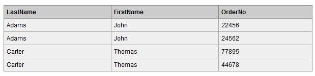

[toc]


#### 1.为什么采用自增索引，而不是系统随机生成的

1、如果表使用自增主键，那么每次插入新的记录，记录就会**顺序添加**到当前索引节点的后续位置，当一页写满，就会自动开辟一个新的页

2、如果使用非自增主键，由于每次插入主键的值近似于随机，因此**每次新纪录都要被插到现有索引页得中间某个位置**，此时MySQL不得不为了将新记录插到合适位置而**移动数据**，甚至目标页面可能已经被回写到磁盘上而从缓存中清掉，此时又要从磁盘上读回来，这增加了很多开销，**同时频繁的移动、分页操作造成了大量的碎片**，得到了不够紧凑的索引结构，后续不得不通过**OPTIMIZE TABLE**来重建表并优化填充页面。

1. InnoDB中表中的数据是**直接存储在主键聚簇索引的叶子节点中**的，每插入一条记录，其实都是增加一个叶子节点，如果主键是顺序的，只需要把新增的一条记录存储在上一条记录的后面，当页达到最大填充因子的时候，下一跳记录就会写入新的页中，这种情况下，**主键页就会近似于被顺序的记录填满**。
2. 若表的主键不是顺序的id，而是无规律数据，比如字符串，InnoDB无法加单的把一行记录插入到索引的最后，而是需要找一个合适的位置（已有数据的中间位置），甚至产生大量的页分裂并且移动大量数据，在寻找合适位置进行插入时，目标页可能不在内存中，这就导致了**大量的随机IO操作**，影响插入效率。除此之外，大量的页分裂会导致大量的内存碎片。

#### 2.mysql为什么采用B+树，相比B树和平衡二叉树有什么优劣？

红黑树等平衡树也可以用来实现索引，但是文件系统及数据库系统普遍采用 B Tree 作为索引结构，主要有以下两个原因：

**（一）更少的检索次数**

**平衡树检索数据的时间复杂度等于树高 h**，而树高大致为 O(h)=**O(logdN)**，其中 **d 为每个节点的出度**。

红黑树的出度为 2，而 **B Tree 的出度一般都非常大**。红黑树的树高 h 很明显比 B Tree 大非常多，因此检索的次数也就更多。

B+Tree 相比于 B-Tree 更适合外存索引，因为 B+Tree 内**节点去掉了 data 域**，因此**可以拥有更大的出度，检索效率会更高。**同时作为关系数据库，B+树的结点之间用链指针连接的特性**更适合范围性的查找**。

**（二）利用计算机预读特性**

为了减少磁盘 I/O，磁盘往往不是严格按需读取，而是每次都会预读。这样做的理论依据是计算机科学中著名的**局部性原理**：当一个数据被用到时，其附近的数据也通常会马上被使用。预读过程中，磁盘进行顺序读取，顺序读取不需要进行磁盘寻道，并且只需要很短的旋转时间，因此速度会非常快。

操作系统一般将内存和磁盘分割成固态大小的块，每一块称为一页，内存与磁盘以页为单位交换数据。**数据库系统将索引的一个节点的大小设置为页的大小**，使得一次 I/O 就能完全载入一个节点，并且可以利用预读特性，相邻的节点也能够被预先载入。

#### 3.mysql索引和mongoDB区别

B+树和B树。B树所有**数据都存在节点上，叶子节点之间无关联**；B+树所有数据都存在叶子节点上，且**节点之间有有链指针**，叶子节点以上的节点存的是数据所在的位置（也就是指针）。

##### Mongodb和Mysql索引选型

1)首先两种数据库都选择**平衡m叉树作为底层索引结构**，因为平衡树m叉树是同种元素序列情况下的**深度最小**的m叉排序树。这可以减少m叉树元素查找的深度，从而提升平均查找效率。B树和B+树都是平衡m叉树。
2)Mongodb选择B树为索引结构，Mongodb是典型的**非关系数据库**，设计之初就不会用来做多个遍历操作，那么如果**要查询单条数据的话只要进行一次中序遍历**，查到与叶子上数据相同的节点即可。
3)Mysql是典型的关系型数据库，选择B+树的原因是**所有节点的数据都有前后关系**，因为**有链指针**，由于非终结点并不是最终指向文件内容的结点，而只是叶子结点中关键字的索引。因此任何关键字的查找必须走一条从根结点到叶子结点的路。所有关键字查询的路径长度相同，导致每一个数据的查询效率相当，**B+树的查询效率更加稳定**。而且把**所有同一内部节点的关键字存放在同一盘块中**，这样磁盘容纳的关键字数量也越多，一次性读入内存的需要查找的关键字也就越多，相对**IO读写次数就降低**了。

#### 4.隔离级别及解决问题

##### 读未提交

##### 读已提交（丢失修改，脏读）

##### 可重复读（不可重复读）

加间隙锁解决幻读

##### 串行化

#### 5.什么情况适合建立索引？

##### 适合建索引

     　　1. 频繁**作为where条件语句查询**的字段

          2. **关联字段**需要建立索引，例如**外键字段**，student表中的classid,  classes表中的schoolid 等

              3. **排序字段**可以建立索引

                  4. **分组字段**可以建立索引，因为分组的前提是排序

            3. **统计字段**可以建立索引，例如count(),max()

##### 不适合建索引

　　1.**频繁更新**的字段不适合建立索引

　　2.where条件中用不到的字段不适合建立索引

　　3.**表数据可以确定比较少**的不需要建索引

　　4.数据重复且发布比较均匀的的字段不适合建索引（**唯一性太差**的字段不适合建立索引），例如性别，真假值

     　　5. **参与列计算的列**不适合建索引

#### 6.如何通过索引避免出现重复ID？(建立唯一索引)

它与"普通索引"类似，不同的就是：

**索引列的值必须唯一，但允许有空值**。如果是组合索引，则列值的组合必须唯一。它有以下几种创建方式：
（1）创建索引：CREATE UNIQUE INDEX indexName ON tableName(tableColumns(length))
（2）修改表结构：ALTER tableName ADD UNIQUE [indexName] ON (tableColumns(length))
（3）创建表的时候直接指定：CREATE TABLE tableName ( [...], UNIQUE [indexName] (tableColumns(length)

#### 7.数据库中已经有重复ID数据，如何去重？(自连接)

#### 8.覆盖索引和非覆盖索引的区别

覆盖索引：SQL只需要通过索引就可以返回查询所需要的数据，而不必通过二级索引查到主键之后再去查询数据。

#### 9.mysql存储引擎的区别

#### 10.mysql聚集索引和非聚集索引，以及底层实现

MyISAM和InnoDB，分别实现了非聚簇索引和聚簇索引。

##### 非聚簇索引

非聚簇索引的**主索引和辅助索引几乎是一样**的，只是主索引不允许重复，不允许空值，他们的**叶子结点的key都存储指向键值对应的数据的物理地址**。

非聚簇索引的**数据表和索引表是分开存储的**。非聚簇索引中的数据是**根据数据的插入顺序保存**。因此非聚簇索引**更适合单个数据的查询**。插入顺序不受键值影响。

##### 聚簇索引

聚簇索引的**主索引的叶子结点存储的是键值对应的数据本身**，**辅助索引的叶子结点存储的是键值对应的数据的主键键值**。因此主键的值长度越小越好，类型越简单越好。

聚簇索引的**数据和主键索引存储在一起**。

聚簇索引的数据是**根据主键的顺序保存**。因此适合按主键索引的**区间查找，可以有更少的磁盘I/O**，加快查询速度。但是也是因为这个原因，聚簇索引的**插入顺序最好按照主键单调的顺序插入，否则会频繁的引起页分裂(BTree插入时的一个操作)，严重影响性能**。

#### 11.mysql怎么监控流量？

Openfalcon

#### 12.怎么建索引？

```sql
CREATE TABLE IF NOT EXISTS `mytable` (
   `id` bigint(20) unsigned NOT NULL AUTO_INCREMENT,
   `video_id` bigint unsigned NOT NULL DEFAULT 0,
   `uid` int unsigned NOT NULL DEFAULT 0,
   `country` varchar(194)  NOT NULL ,
   `class` varchar(64)  NOT NULL ,
   `status` tinyint(4) unsigned NOT NULL DEFAULT '0',
   `video_view` bigint(20) unsigned NOT NULL DEFAULT '0',
   `created` timestamp  NOT NULL DEFAULT CURRENT_TIMESTAMP,
   PRIMARY KEY (
       `id`
   )
) ENGINE=InnoDB DEFAULT CHARSET=utf8mb4 COLLATE=utf8mb4_unicode_ci;
SELECT * FROM mytable WHERE created > ? AND class = ? AND country IN (?) ORDER BY created DESC LIMIT 100;
SELECT * FROM mytable WHERE class = ? AND country IN (?) ORDER BY video_view DESC LIMIT 100;
SELECT * FROM mytable WHERE created > ? AND class IN (?) LIMIT 100;
SELECT * FROM mytable WHERE created > ? AND country IN (?) LIMIT 100;
```

#### 13一个SQL语句的执行过程

##### 查询语句

- 先检查该语句是**否有权限**，如果没有权限，直接返回错误信息，如果有权限，在 MySQL8.0 版本以前，会先**查询缓存**，以这条 sql 语句为 key 在内存中查询是否有结果，如果有直接缓存，如果没有，执行下一步。
- 通过**分析器进行词法分析**，提取 sql 语句的**关键元素**，然后判断这个 sql 语句是否有语法错误，比如关键词是否正确等等，如果检查没问题就执行下一步。
- 接下来就是**优化器进行确定执行方案**，根据自己的优化算法进行选择执行效率最好的一个方案（优化器认为，有时候不一定最好）执行。

- 进行**权限校验**，如果没有权限就会返回错误信息，如果有权限就会调用数据库引擎接口，返回引擎的执行结果。

##### 更新语句

其实条语句也基本上会沿着上一个查询的流程走，只不过执行更新的时候肯定要记录日志，这就会引入日志模块了，MySQL 自带的日志模块式 **binlog（归档日志）** ，所有的存储引擎都可以使用，我们常用的 InnoDB 引擎还自带了一个日志模块 **redo log（重做日志）**，我们就以 InnoDB 模式下来探讨这个语句的执行流程。流程如下：

- 先查询到这一条数据，如果有缓存，也是会用到缓存。
- 然后拿到查询的语句，把 age 改为 19，然后调用引擎 API 接口，写入这一行数据，InnoDB 引擎把数据保存在内存中，同时**记录 redo log**，此时 redo log 进入 **prepare 状态**，然后告诉执行器，执行完成了，随时可以提交。
- 执行器收到通知后**记录 binlog**，然后调用引擎接口，**提交 redo log 为提交状态**。
- 更新完成。

#### 14.mysql的join的计算的算法？

SQL的实现join的三种算法，分别是Nested Loop Join，Hash join，Sort Merge Join。MySQL只支持**Nested Loop Join**

NLJ是通过**两层循环**，用**第一张表做Outter Loop，第二张表做Inner Loop**，**Outter Loop的每一条记录跟Inner Loop的记录作比较，符合条件的就输出**。而NLJ又有3种细分的算法：

##### *1.Simple Nested Loop Join（SNLJ）*

SNLJ就是两层循环全量扫描连接的两张表，得到符合条件的两条记录则输出，这也就是**让两张表做笛卡尔积，比较次数是R * S**，是比较暴力的算法，会比较耗时。

##### *2.Index Nested Loop Join（INLJ）*

INLJ是在SNLJ的基础上做了优化，**通过连接条件确定可用的索引**，**在Inner Loop中扫描索引而不去扫描数据本身**，从而提高Inner Loop的效率。
而INLJ也有缺点，就是**如果扫描的索引是非聚簇索引，并且需要访问非索引的数据，会产生一个回表读取数据的操作，这就多了一次随机的I/O操作**。

在MySQL5.6中，对INLJ的**回表操作进行了优化**，增加了Batched Key Access Join（**批量索引访问的表关联方式**）和Multi Range Read（mrr，**多范围读取**）特性，**在join操作中缓存所需要的数据的rowid**，再批量去获取其数据，**把I/O从多次零散的操作优化为更少次数批量的操作**，提高效率。

##### *3.Block Nested Loop Join（BNLJ）*

一般情况下，MySQL优化器**在索引可用的情况下**，会**优先选择使用INLJ算法**，但是**在无索引可用，或者判断full scan可能比使用索引更快的情况**下，还是**不会选择使用过于粗暴的SNLJ算法**。这里就出现了BNLJ算法了，BNLJ在SNLJ的基础上使用了**join buffer**，会**提前读取Inner Loop所需要的记录到buffer中**，以提高Inner Loop的效率。


#### 15.堆组织表，索引组织表，索引聚簇表

##### 堆组织表

通常我们默认建的表就是堆组织表。此类型的表中，数据会以**堆**的方式进行管理，**增加数据时候，会使用段中找到的第一个能放下此数据的自由空间**。当从表中删除数据时候，则允许以后的UPDATE和INSERT重用这部分空间，它是以一种有些**随机**的方式使用。

**全表扫描时，会按命中的顺序来获取数据，而不是按插入的顺序**。这是一个必要要了解的重要的数据库概念。一般来说，**数据库表本质上是无序的数据组合**。

```mysql
Create table test( 
  Id int, 
  Name varchar2(10) 
 );
```

##### 索引组织表(IOT)

就是**存储在一个索引结构中的表**，数据**按主键进行存储和排序**。适用的场景：

- **完全由主键组成的表**。这样的表如果采用堆组织表，则表本身完全是多余的开销，因为所有的数据全部同样也保存在索引里，此时，堆表是没用的。
- **代码查找表**。如果你**只会通过一个主键来访问一个表**，这个表就非常适合实现为IOT.
- 如果想**保证数据存储在某个位置上，或者希望数据以某种特定的顺序物理存储**，IOT就是一种合适的结构。 

**IOT提供如下的好处**：

- **提高缓冲区缓存效率**，因为给定查询在缓存中需要的块更少。
- **减少缓冲区缓存访问**，这会改善可扩缩性。
- **获取数据的工作总量更少**，因为获取数据更快。
- 每个查询完成的物理I/O更少。
- 如果**经常在一个主键或唯一键上使用between查询**，也是如此。如果数据**有序**地物理存储，就能提升这些查询的性能。

```mysql
create table indexTable(
  ID varchar2 (10), 
  NAME varchar2 (20), 
  constraint pk_id primary key (ID)
  ) organization index;
```

##### 索引聚簇表

聚簇是指：如果**一组表有一些共同的列**，则**将这样一组表存储在相同的数据库块**中；聚簇还表示**把相关的数据存储在同一个块上**。利用聚簇，**一个块可能包含多个表的数据**。概念上就是**如果两个或多个表经常做链接操作，那么可以把需要的数据预先存储在一起**。

聚簇还可以用于**单个表，可以按某个列将数据分组存储**。 

**语法**：

索引聚簇表是**基于一个索引聚簇（index cluster）创建**的。里面记录的是**各个聚簇键**。聚簇键和我们用得做多的索引键不一样，**索引键指向的是一行数据，聚簇键指向的是一个ORACLE BLOCK**。我们可以先通过以下命令创建一个索引簇。

######  什么时候不应该使用聚簇？

1. 如果**预料到聚簇中的表会大量修改**：必须知道，**索引聚簇会对DML的性能产生某种负面影响**（特别是INSERT语句）。管理聚簇中的数据需要做更多的工作。
2. 如果**需要对聚簇中的表执行全表扫描**：不只是必须对你的表中的数据执行全面扫描，还必须对（可能的）多个表中的数据进行全面扫描。由于需要扫描更多的数据， 所以全表扫描耗时更久。
3. 如果你认为需要频繁地**TRUNCATE和加载表：聚簇中的表不能截除**。这是显然的，因为聚簇在一个块上存储了多个表，必须删除聚簇表中的行。

因此，如果**数据主要用于读**（这并不表示“从来不写”；聚簇表完全可以修改），**而且要通过索引来读**（可以是聚簇键索引，也可以是聚簇表上的其他索引），另外**会频繁地把这些信息联结在一起**，此时聚簇就很适合。

#### 16.多级索引，最左前缀匹配

##### 二级索引

**叶子节点中存储主键值**，每次查找数据时，根据索引找到叶子节点中的主键值，根据主键值再到聚簇索引中得到完整的一行记录。

问题：

1.相比于叶子节点中存储行指针，二级索引存储主键值会占用更多的空间，那为什么要这样设计呢？

　　**InnoDB在移动行时，无需维护二级索引，因为叶子节点中存储的是主键值，而不是指针**。

2.那么InnoDB有了聚簇索引，为什么还要有二级索引呢？

　　聚簇索引的叶子节点存储了一行完整的数据，而**二级索引只存储了主键值，相比于聚簇索引，占用的空间要少**。当我们需要为表建立多个索引时，如果都是聚簇索引，那将占用大量内存空间，所以InnoDB中主键所建立的是聚簇索引，而**唯一索引、普通索引、前缀索引**等都是二级索引。

##### 最左前缀匹配

在MySQL建立联合索引时会遵守最左前缀匹配原则，即最左优先，**在检索数据时从联合索引的最左边开始匹配**。

索引的底层是一颗B+树，那么联合索引的底层也就是一颗B+树，只不过联合索引的B+树节点中存储的是键值。由于**构建一棵B+树只能根据一个值来确定索引关系**，所以**数据库依赖联合索引最左的字段来构建**。

#### 17.锁的算法（Record Lock\Gap Lock\Next-key Lock）,悲观锁和乐观锁

**InnoDB 存储引擎的锁的算法有三种：**

- Record lock：**单个行记录上**的锁。
- Gap lock：**间隙锁**，锁定一个**范围，不包括记录本身**。
- Next-key lock：record+gap 锁定一个范围，包含记录本身。

#### 18.1-3范式

1NF:字段不可分;

2NF:有主键，非主键字段依赖主键;

3NF:非主键字段不能相互依赖;

解释:

1NF:原子性 字段不可再分,否则就不是关系数据库;

2NF:唯一性 一个表只说明一个事物;

3NF:每列都与主键有直接关系，不存在传递依赖;

#### 19.Mysql查询优化

##### 1. 使用Explain进行分析

**Explain** 用来分析 **SELECT** 查询语句，开发人员可以通过分析 Explain 结果来优化查询语句。

比较重要的字段有：

- **select_type** : 查询类型，有简单查询、联合查询、子查询等
- **key** : 使用的索引
- **rows** : 扫描的行数

##### 2. 优化数据访问

###### ① 减少请求的数据量

- 只返回**必要的列**：最好**不要使用 SELECT *** 语句。
- 只返回**必要的行**：使用 **LIMIT** 语句来**限制**返回的数据。
- **缓存**重复查询的数据：使用**缓存**可以避免在数据库中进行查询，特别在要查询的数据经常被重复查询时，缓存带来的查询性能提升将会是非常明显的。

###### ② 减少服务器端扫描的行数

最有效的方式是**使用索引来覆盖查询**。

##### 3. 重构查询方式

###### ① 切分大查询

一个**大查询**如果**一次性执行**的话，可能一次锁住很多数据、占满整个事务日志、耗尽系统资源、阻塞很多小的但重要的查询。

###### ② 分解大连接查询

将一个**大连接**查询分解成对每一个表进行**一次单表查询**，然后在应用程序中进行关联，这样做的好处有：

- 让缓存更高效。对于连接查询，如果其中一个表发生变化，那么整个查询缓存就无法使用。而分解后的多个查询，即使其中一个表发生变化，对其它表的查询缓存依然可以使用。
- **分解成多个单表查询**，这些单表查询的缓存结果更可能被其它查询使用到，从而减少冗余记录的查询。
- 减少锁竞争；
- 在**应用层进行连接**，可以更容易对数据库进行拆分，从而更容易做到高性能和可伸缩（阿里推荐）。
- 查询本身效率也可能会有所提升。例如下面的例子中，使用 IN() 代替连接查询，可以让 MySQL 按照 ID 顺序进行查询，这可能比随机的连接要更高效。

#### 20.事务的特性ACID

原子性（Atomicity，或称不可分割性）、一致性（Consistency）、隔离性（Isolation，又称独立性）、持久性（Durability）

- 原子性：一个事务（transaction）中的所有操作可以被视为一个不可分割的**最小执行单元**，要么**全部完成**，要么全部不完成，不会结束在中间某个环节。事务在执行过程中发生错误，会被**回滚**（Rollback）到事务开始前的状态，就像这个事务从来没有执行过一样。
- 一致性：数据库在事务执行前后都保持一致性状态。在一致性状态下，所有事务对一个数据的读取结果都是相同的。在事务开始之前和事务结束以后，数据库的完整性没有被破坏。
- 隔离性：一个事务所做的修改在**最终提交**以前，对其它事务是**不可见**的。
- 一旦事务**提交**，则其所做的**修改**将会**永远保存**到数据库中。即使系统发生崩溃，事务执行的结果也不能丢失。

#### 21.Mysql怎么去查询的，什么时候走索引，什么时候不走？

哪些情况下不走索引：

- 如果MySQL估计使用**全表扫秒比使用索引快**，则不适用索引。

    例如，如果列key均匀分布在1和100之间，下面的查询使用索引就不是很好：select * from table_name where key>1 and key<90;

- 如果**条件中有or**，即使其中有条件带索引也不会使用

    例如：select * from table_name where key1='a' or key2='b';如果在key1上有索引而在key2上没有索引，则该查询也不会走索引

- 复合索引，如果索引列**不是复合索引的第一部分**，则不使用索引（即**不符合最左前缀**）

    例如，复合索引为(key1,key2),则查询select * from table_name where key2='b';将不会使用索引

- 如果**like是以 % 开始的**，则该列上的索引不会被使用。

    例如select * from table_name where key1 like '%a'；该查询即使key1上存在索引，也不会被使用。

- 如果**列为字符串，则where条件中必须将字符常量值加引号**，否则即使该列上存在索引，也不会被使用。

    例如,select * from table_name where key1=1;如果key1列保存的是字符串，即使key1上有索引，也不会被使用。

- 如果使用MEMORY/HEAP表，并且where条件中不使用“=”进行索引列，那么不会用到索引，head表只有在“=”的条件下才会使用索引

#### 22.mysql怎么存储时间？把邮戳转化为日常格式时间的函数？

##### 字符串存储日期

缺点：占用空间大；比较效率低：只能逐个字符对比，不能用日期相关的API计算

##### Datetime和Timestamp

首选TimeStamp。

- DateTime类型**没有时区信息**的（时区无关）
    DateTime 类型保存的时间都是当前会话所设置的时区对应的时间。这样就会有什么问题呢？当你的时区更换之后，比如你的**服务器更换地址或者更换客户端连接时区设置**的话，就会导致你从数据库中读出的时间错误。

- Timestamp和时区有关
    Timestamp 类型字段的值会随着服务器时区的变化而变化，自动换算成相应的时间，说简单点就是在不同时区，查询到同一个条记录此字段的值会不一样。

- DateTime 类型**消耗空间更大**
    Timestamp 只需要使用 **4 个字节**的存储空间，但是 DateTime 需要耗费 **8 个字节**的存储空间。但是，这样同样造成了一个问题，**Timestamp 表示的时间范围更小**。DateTime ：1000-01-01 00:00:00 ~ 9999-12-31 23:59:59。Timestamp：1970-01-01 00:00:01 ~ 2037-12-31 23:59:59

##### 数值型时间戳

我们也可以使用int或者bigint类型的数值也就是时间戳来表示时间

**unix_timestamp将时间转化成时间戳格式。**
**from_unixtime将时间戳转化成时间格式。**

#### 23.mysql的锁，用什么语句实现数据库锁？

##### 封锁粒度

行级锁和表级索

##### 封锁类型

###### 读写锁

- 排它锁，写锁
- 共享锁，读锁

###### 意向锁

通过引入**意向锁**，例如一个事务想对表加锁，就不需要单独检测每一行是否加锁，只需要知道是否在这个表上加了意向锁即可。因为进行行锁之前，需要先对整个表加意向锁。

##### 封锁协议

###### 三级封锁协议

**一级封锁协议**：事务 T 要**修改数据** A 时必须加 **X 锁**，直到 T **结束才释放锁**。解决**丢失修改**问题，因为不能同时有两个事务对同一个数据进行修改，那么事务的修改就不会被覆盖。

**二级封锁协议**：在一级的基础上，要求**读取数据** A 时必须**加 S 锁**，读取完==**马上释放 S 锁**==。可以**解决读脏数据**问题，因为如果一个事务在对数据 A 进行**修改**，根据 1 级封锁协议，会加 **X 锁**，那么就**不能再加 S 锁**了，也就是**不会读入**数据。

**三级封锁协议**：在二级的基础上，要求**读取数据 A** 时必须**加 S 锁**，直到==**事务结束**==了**才能释放 S 锁**。（注意前面是读完**立即**释放）。可以解决**不可重复读**的问题，因为**读 A** 时，其它事务**不能对 A 加 X 锁**，从而**避免了在读的期间数据发生改变**。

###### 两段锁协议

加锁和解锁分为**两个阶段**进行。可串行化调度是指，通过**并发控制**，使得**并发执行**的事务结果与**某个串行**执行的事务结果**相同**。事务遵循两段锁协议是**保证可串行化调度**的充分条件。

MySQL 的 **InnoDB 存储**引擎采用**两段锁协议**，会根据**隔离级别**在需要的时候**自动加锁**，并且所有的锁都是在**同一时刻**被释放，这被称为**隐式锁定**。

InnoDB 也可以使用特定的语句进行**显示锁定**：

```sql
SELECT ... LOCK In SHARE MODE;
SELECT ... FOR UPDATE;
```


#### 24.联合索引的使用原则

1. 需要**加索引的字段，要在 where 条件中**
2. 数据量少的字段不需要加索引
3. 如果 **where 条件中是OR关系，加索引不起作用**
4. **符合最左原则**

#### 25.Innodb的索引有哪些？

##### 1.B+树索引

适用于**全键值、键值范围和键前缀**查找，其中键前缀查找只适用于==**最左前缀**==查找。如果**不是按照索引列的顺序进行查找，则无法使用索引。**

InnoDB 的 B+Tree 索引分为**主索引和辅助索引**。主索引的**叶子节点** data 域记录着**完整**的**数据**记录，这种索引方式被称为==**聚簇索引**==。因为无法把数据行存放在两个不同的地方，所以一个表只能有**一个**聚簇索引。

**辅助索引**的**叶子节点**的 data 域记录着**主键的值**，因此在使用**辅助索引**进行查找时，需要先查找到**主键值**，然后再到主索引中进行查找。

##### 2.哈希索引

**哈希索引**能以 **O(1)** 时间进行查找，但是**失去了有序性**：

- **无法**用于**排序与分组**；
- 只支持**精确查找**，无法用于**部分查找和范围查找**。

InnoDB 存储引擎有一个特殊的功能叫“**自适应哈希索引**”，当某个索引值被使用的**非常频繁**时，会在 **B+Tree 索引之上**再创建一个**哈希索引**，这样就让 B+Tree 索引具有哈希索引的一些优点，比如**快速**的哈希查找。就是对需要查询的字段做一次哈希，然后进行查找。查找速度非常快，性能也很高。

##### 3. 全文索引

MyISAM 存储引擎支持**全文索引**，用于查找文本中的**关键词**，而不是直接比较是否相等。

查找条件使用 ==**MATCH AGAINST**==，而不是普通的 WHERE。

全文索引使用**倒排索引**实现，它记录着**关键词**到其所在**文档的映射**。

InnoDB 存储引擎在 MySQL 5.6.4 版本中也开始支持全文索引。

##### 4. 空间数据索引

MyISAM 存储引擎支持**空间数据索引**（**R-Tree**），可以用于**地理数据**存储。空间数据索引会从所有维度来索引数据，可以有效地使用任意维度来进行组合查询。必须使用 GIS 相关的函数来维护数据。

#### 26.如果一个表查询，插入等很慢，该怎么解决？

##### 1. 针对偶尔很慢的情况

一条 SQL 大多数情况正常，偶尔才能出现很慢的情况，针对这种情况，我觉得这条SQL语句的书写本身是没什么问题的，而是其他原因导致的

###### ① 数据库在刷新脏页（flush）

当我们要往数据库插入一条数据、或者要更新一条数据的时候，我们知道数据库会在**内存**中把对应字段的数据更新了，但是更新之后，这些更新的字段并不会马上同步持久化到**磁盘**中去，而是把这些更新的记录写入到 redo log 日记中去，等到空闲的时候，在通过 redo log 里的日记把最新的数据同步到**磁盘**中去。

当内存数据页跟磁盘数据页内容不一致的时候，我们称这个内存页为“**脏页**”。内存数据写入到磁盘后，内存和磁盘上的数据页的内容就一致了，称为“干净页”。

**刷脏页有下面 4 种场景（后两种不用太关注“性能”问题）**：

- **redolog 写满了：**redo log 里的容量是有限的，如果数据库一直很忙，更新又很频繁，这个时候 redo log 很快就会被写满了，这个时候就没办法等到空闲的时候再把数据同步到磁盘的，只能暂停其他操作，全身心来把数据同步到磁盘中去的，而这个时候，**就会导致我们平时正常的SQL语句突然执行的很慢**，所以说，数据库在在同步数据到磁盘的时候，就有可能导致我们的SQL语句执行的很慢了。
- **内存不够用了：**如果一次查询较多的数据，恰好碰到所查数据页不在内存中时，需要申请内存，而此时恰好内存不足的时候就需要淘汰一部分内存数据页，如果是干净页，就直接释放，**如果恰好是脏页就需要刷脏页**。
- **MySQL 认为系统“空闲”的时候：**这时系统没什么压力。
- **MySQL 正常关闭的时候：**这时候，MySQL 会把内存的脏页都 flush 到磁盘上，这样下次 MySQL 启动的时候，就可以直接从磁盘上读数据，启动速度会很快。

###### ② 拿不到锁

这个就比较容易想到了，我们要执行的这条语句，刚好这条语句涉及到的**表**，别人在用，并且加锁了，我们拿不到锁，只能慢慢等待别人释放锁了。或者，表没有加锁，但要使用到的某个一行被加锁了，这个时候，我也没办法啊。

如果要判断是否真的在等待锁，我们可以用 **show processlist** 这个命令来查看当前的状态。

##### 2. 针对一直都很慢的情况

###### ① 没有用到索引

- SQL 就没用索引。只能走全表扫描。
- 写了索引但是没用到索引。要注意这种**字段上有索引，但由于自己的疏忽，导致系统没有使用索引**的情况了。
- **函数操作导致没有用上索引**。如果我们在查询的时候，对字段进行了函数操作，也是会导致没有用上索引的。

#### 27.mysql索引重建问题

##### 1. 索引重建和重组有什么用？

当修改表中数据，数据库引擎**自动维护索引的数据和结构**。但是随着修改**次数的累积**，可能会现：

- **索引中记录的数据顺序(逻辑顺序)和数据的实际顺序不一致**(物理顺序)，这也称之为**外部碎片**。
- 索引页的**数据填充度变小(页密度)**，也称之为**内部碎片**。
    有索引碎片是正常的，但是有大量的碎片，会**降低查询性能**，可以通过重建和重组索引来**减少或消除碎片**。

##### 2. 索引重建和重组有什么区别？

- 重建是删除索引并重新创建。通过这种方式**移除碎片、回收磁盘空间**(根据现有的或指定的填充因子压缩(Compact)页数据)、对相邻页中的索引进行重新排列。重组索引使用的系统资源最少。它在叶级层**从左至右，重新排列叶级页使之于索引的逻辑顺序一致**。同时也会对页按填充因子进行压缩。由此可知重建对于消除碎片和空间回收上的程度更高。
- 重建索引是**单个**事务，如果指定了ALL关键字，则所有的索引重建**做为一个事务**。重组索引(包括指定了ALL)，在内部会分解为**多个较小**的事务执行。重建事务回滚，需要回滚所有已经发生的修改。重组可以在任意时间点停止并且只回滚当前的某个较小的事务，已经发生的修改不会回滚(这个有点像DBCC SHRINKFILE)。
- **重组只能在ONLINE模式下，重建可以指定为ONLINE或者OFFLINE**。

##### 3. 索引重建时的ONLINE和OFFLINE选项是什么意思？

- OFFLINE时，会**在表上获取锁来阻止所有用户的访问**，然后**将旧索引的数据复制到新索引中**,完成重建后才会释放表锁。
- ONLINE时，也是复制旧索引数据到新索引中，**同时旧索引是可以读写的**。重建过程中旧索引的修改操作同时会被应用到新索中，还有一个中间数据结构实现新旧数据的映射和修改冲突。**在重建完成后，会使用Sch-M（架构修改锁）锁定表非常短的时间，然后使用新索引替代旧索引，并释放Sch-M**。
- **本地临时表的索引不能使用ONLINE模式**。
- 相对来说，ONLINE要比OFFLINE使用更多的资源，但**提供并发支持**。

##### 4. 在重组(或重建)大表的索引时，日志文件变得很大，怎么办？

说明一下，小表的索引整理问题没有太多意义。

数据库的**所有**有操作都需要记录到日志，这个跟哪种**恢复模式**没有关系。也就是说从数据库的角度来看，这些日志都是它必须要写的。我们要做的是：**引导它少写点日志和提高写日志的性能**。

- 我们知道重组始终是ONLINE模式，它提供了并发支持，却会使用更多资源。这些资源中就包括日志。重建索引时的ONLINE和OFFLINE的选择，要结合前一点和实际系统应用情况考虑。我们可以做一些准备工作，比如：**重建前先截断日志，对日志文件做一次手动增长来避免自动增长**。
- 事务在提交或者回滚后才能被截断，从前面的问题的，我们也知道重建的事务是原子性的，而重组被分成了多个小事务。也就说，在**重建过程中，我们不能截断它的日志，而重组时可以截断**。同理，**不要在显式事务中使用ONLINE**,这会导致**显式事务提交后，才能截断日志。**
- 考虑使用 **SORT_IN_TEMPDB**选项。这个选项使得**索引整理的事务日志写到tempdb，而不是用户数据库**。这样就减少了用户数据库事务日志量，当然tempdb的空间要足够。如果tempdb位于独立的磁盘，就可以进一步的减少与用户数据库的存储空间和性能的竞争。
- 如果可能,可以考虑**切换到simple和bulk_logged恢复模式**，索引的重建和重组可以**利用最小化日志减少日志量**。最小化日志，它**不对每一行数据记录日志，而是对页和区的改变写日志。但是它不支持时间点还原**。
- 如果需要**预留日志空间，索引大小的2~3倍**会比较**安全**。

##### 5. 在重建大表的索引时，数据文件也增长到很大了，怎么办？

索引**重建过程中，旧索引结构和新索引结构是并存的，如果是ONLINE模式下，还有一个中间数据结构存在**。如果涉及到数据排序操作，数据排序的临时数据结构也是需要占用空间的。跟日志的问题一样，我们能做的是**减弱，不可能杜绝**。

- **合理**配置MAXDOP选项。可以**使用多个处理器来执行与索引语句关联的扫描、排序和索引操作**。
- 对于临时的排序空间，它一次只能被一个索引操作使用，所以如果执行多个索引操作，只需要**保证临时排序空间与最大的那个索引一样大即可**。例如删除并重建聚集索引时，会同时重建相关的非聚集索引，只需要保证预留的空间与其中最大那个索引一样大即可。
- 当SORT_IN_TEMPDB=ON时，临时排序空间则位于tempdb(重建索引的事务日志也在tempdb)。如=OFF，则排序空间位于当前用户数据库中。
- 对于ONLINE模式重建的中间数据结构的位置，由SORT_IN_TEMPDB决定，跟上一点一样。
- **ONLINE操作使用行版本控制，这样读取行时不需要S锁，避免了并发的数据修改事务对索引操作的影响**。使用了行版本，对于并发的数据修改操作，在tempdb中存储相关的行版本数据也需要一些空间。

#### 28.大表通过主键ID删除数据会不会慢？为什么？

IO阻塞或者网络阻塞，主从延迟。

#### 29.drop,delete和truncate

**drop**：删除内容和定义，释放空间。简单来说就是**把整个表去掉**.以后要新增数据是不可能的,除非新增一个表

**truncate**：删除内容、释放空间但不删除定义。与drop不同的是,他**只是清空表数据**而已

**delete**：删除内容不删除定义，不释放空间

##### DELETE

1. delete是DML，执行delete操作时，每次从表中删除一行，并且同时将该行的的删除操作记录在redo和undo表空间中以便进行回滚（rollback）和重做操作，但要注意表空间要足够大，需要手动提交（commit）操作才能生效，可以通过rollback撤消操作。

2. delete**可根据条件删除表中满足条件的数据，如果不指定where子句，那么删除表中所有记录**。

3. delete语句**不影响表所占用的extent**，高水线(high watermark)保持原位置不变

##### TRUNCATE

1. truncate是DDL，**会隐式提交，所以，不能回滚，不会触发触发器**。

2. truncate会删除表中所有记录，并且将**重新设置高水线和所有的索引**，缺省情况下将空间释放到minextents个extent，除非使用reuse storage。不会记录日志，所以执行速度很快，但**不能通过rollback撤消操作**。

3. 对于外键（foreignkey ）约束引用的表，不能使用 truncate table，而应使用不带 where 子句的 delete 语句。

4. truncatetable不能用于参与了索引视图的表。

#### 30.数据库出现读性能问题，如何解决？

- 读写分离
- 分库分表
- 使用explain分析select语句
- 优化数据访问
    - 减少请求的数据量，只返回必要的行和列
    - 减少服务端扫描行数，使用索引覆盖查询
- 重构查询方式
    - 切分大查询
    - 分解大连接查询，将对多个表的查询，分成对每一个表进行一次单表查询

#### 31.mysql的主从复制

##### 1.复制步骤

- master记录**更改**的明细，存入到**二进制日志**（binary log），如记录增删改的过程，**不记录查询的过程**。
- master **发送同步消息**给 slave。
- slave 收到消息后，将 master 的**二进制日志**复制到本地的**中继日志**（relay log）。
- slave **重现**中继日志中的消息，从而改变数据库的数据。 

涉及三个线程：

-  **binlog 线程** ：负责将主服务器上的数据更改写入**二进制日志**（Binary log）中。
-  **I/O 线程** ：负责从主服务器上读取二进制日志，并写入从服务器的**中继日志**（Relay log）。
-  **SQL 线程** ：负责读取中继日志，解析出主服务器已经执行的数据更改并在从服务器中执行。

##### 2.日志

|   复制方式    |                             特点                             |                             优点                             |                             缺点                             |
| :-----------: | :----------------------------------------------------------: | :----------------------------------------------------------: | :----------------------------------------------------------: |
|    **row**    | 基于行的格式复制，记录需要修改的**每行的数据信息**。 如果一个SQL修改了2w行的数据，那么就会记录2w行的日志格式 | 保证了数据的**强一致性**，且由于记录的是执行后的结果，在从库上执行还原也会比较快 | 日志记录**数量很多**，日志文件巨大，主从之间的**传输需要更多的时间**。 |
| **statement** | 基于段的日志格式复制，也就是记录下**更改的 SQL 记录**，而不是更改的行的记录。 |                      日志记录量**最小**                      | 对于一些输出结果不确定的函数，**在从库上执行一遍很可能会出现问题**，如 uuid，从库根据日志**还原**主库数据的时候需要执行一遍SQL，**时间相对较慢**。 |
|   **mixed**   | 混合上面两种日志格式记录记录日志，至于什么时候使用哪种日志方式由MySQL本身决定。 |               可以平衡上面两种日志格式的优缺点               |                                                              |

##### 3.复制方式

**异步复制**：主库写入一个事务 commit 提交并执行完之后，，将日志记录到 **binlog**，将结果反馈给**客户端**，**最后将日志传输到从库**。  该复制经常遇到的问题是：因为 binlog 日志是推送的，所有主库和从库之间存在一定的**延迟**。 这样就会造成很多问题，比如主库因为磁盘损坏等故障突然崩掉，导致 binlog 日志不存在，同时因为延迟 binlog 还没有推送到从库，从库也就会丢失很多被主库提交的事物，从而造成**主从不一致**。 

**半同步复制**：主库写入一个事务 commit 提交并执行完之后，并**不直接**将请求反馈给前端应用用户，而是等待**从库也接收到** binlog 日志并成功写入中继日志后，主库才返回 commit 操作成功给客户端。半同步复制保障了事物执行后，至少有**两份日志记录**，一份在主库的 binlog 上 ，另一份至少在从库的中继日志 Relay log 上，这样就极大的**保证了数据的一致性**。 

**并行复制**，指的是从库开启多个线程，并行读取 relay log 中不同库的日志，然后**并行重放不同库的日志**，这是库级别的并行。

##### 4.主从延时解决

* **分库**，将**一个主库拆分为多个主库**，每个主库的写并发就减少了几倍，此时主从延迟可以忽略不计。
* **打开 MySQL 支持的并行复制，多个库并行复制**。如果说某个库的写入并发就是特别高，单库写并发达到了 2000/s，并行复制还是没意义。
* 重写代码，写代码的同学，要慎重，插入数据时立马查询可能查不到。
* 如果确实是存在必须先插入，立马要求就查询到，然后立马就要反过来执行一些操作，对这个查询**设置直连主库**。**不推荐**这种方法，你要是这么搞，读写分离的意义就丧失了。

#### 32.sql和nosql数据库的区别

##### 存储方式

SQL数据存在特定结构的表中；而NoSQL则更加灵活和可扩展，存储方式可以省是JSON文档、哈希表或者其他方式。

##### 表/数据集合的数据的关系

在SQL中，**必须定义好表和字段结构后才能添加数据**。表结构可以在被定义之后更新，但是如果有比较大的结构变更的话就会变得比较复杂。

在NoSQL中，数据可以在任何时候任何地方添加，不需要先定义表。NoSQL也可以在数据集中建立索引。以MongoDB为例，会**自动在数据集合创建后创建唯一值_id字段**，这样的话就可以在数据集创建后增加索引。

从这点来看，**NoSQL可能更加适合初始化数据还不明确或者未定的项目中**。

##### 外部数据存储

SQL中需要外键来关联外部数据表。而在NoSQL中除了这种规范化的外部数据表做法以外，我们还能用非规范化方式**把外部数据直接放到原数据集中**，以提高查询效率。缺点也比较明显，更新会比较麻烦。

##### SQL中join查询

SQL中可以使用JOIN表链接方式**将多个关系数据表中的数据用一条简单的查询语句查询出来**。而NoSQL暂未提供类似JOIN的查询方式对多个数据集中的数据做查询。所以大部分NoSQL使用非规范化的数据存储方式存储数据。

##### 数据耦合性

SQL中不允许删除已经被使用的外部数据，以保证数据完整性。而NoSQL中则没有这种强耦合的概念，可以随时删除任何数据。

##### 事务

SQL中如果**多张表数据需要同批次被更新**，即如果其中一张表更新失败的话其他表也不能更新成功。这种场景可以通过事务来控制，可以在所有命令完成后再统一提交事务。而NoSQL中**没有事务这个概念，每一个数据集的操作都是原子级的**。

##### 性能

Nosql省略了关系结构化的方面，理论查询性能要优于关系数据库。

##### 优缺点对比

###### SQL

优点：

- 保持**数据的一致性**（事务处理）
- 可以进行join等**复杂查询**。
- 通用化，技术成熟。

缺点：

- 数据读写**必须经过sql解析**，大量数据、高并发下**读写性能不足**。
- 对数据做读写，或修改数据结构时**需要加锁，影响并发操作**。
- 无法适应非结构化存储。
- **扩展困难**。
- 昂贵、复杂。

###### NoSQL

优点：

- **高并发**，大数据下读写能力较强。
- 基本支持**分布式**，易于扩展，可伸缩。
- 简单，弱结构化存储。

缺点：

- join等复杂操作能力较弱。
- 事务支持较弱。
- 通用性差。
- 无完整约束复杂业务场景支持较差。

#### 33.什么情况下b树比b+树好？

(1)B树的**树内存储数据**，因此查询单条数据的时候，B树的查询效率不固定，最好的情况是O(1)。我们可以认为在做**单一数据查询的时候，使用B树平均性能更好**。但是，由于**B树中各节点之间没有指针相邻，因此B树不适合做一些数据遍历操作**。

(2)B+树的数据只出现在叶子节点上，因此**在查询单条数据的时候，查询速度非常稳定**。因此，在做单一数据的查询上，其**平均性能并不如B树**。但是，B+树的**叶子节点上有指针进行相连，因此在做数据遍历的时候，只需要对叶子节点进行遍历即可，这个特性使得B+树非常适合做范围查询**。

#### 34.B+树node大小多少？为什么？

4K。等于操作系统中每一页的大小，一个节点的大小设为一页或页的倍数最为合适。因为如果一个节点的大小 < 1页，那么读取这个节点的时候其实读取的还是一页，这样就造成了资源的浪费。而对于大多数业务，一页的大小已经足够了。同时，在读取的时候，每次读取一个节点只用置换一个页面就可以了。

- 对于**叶子节点**，**如果一行数据大小为1k，那么一页就能存4条数据**；
- 对于**非叶子节点**，**如果key使用的是bigint，则为8字节**，**指针在mysql中为6字节**，**一共是14字节**，则4k能存放4 * 1024 / 14 = 292个索引指针**。于是可以算出，对于**一颗高度为2的B+树**，**根节点存储索引指针节点，那么它有292个叶子节点存储数据**，每个叶子节点可以存储4条数据，**一共 292x 4 = 1168条数据**。而**对于高度为3的B+树**，就可以存放 292x 292 x 4= **341056 条数据（三十多万条数据）**，也就是对于三十多万条的数据，我们只需要高度为3的B+树就可以完成，通过主键查询只需要3次IO操作就能查到对应数据。所以在 InnoDB 中B+树高度一般为3层时，就能满足数十万级的数据存储，所以一个节点为1页，也就是4k是比较合理的。

#### 35.数据库有多少种索引？主键和普通区别

主键，唯一，普通，全文，联合。

唯一性、全表只有一个主键索引、主键不为空，主键可作外键

#### 36.反三范式？什么时候反三范式？反三范式有什么坏处？

反范式化指的是通过**增加冗余或重复的数据来提高数据库的读性能**。

反范式化可以**减少关联查询join的次数**。

在大量查询涉及到多个表的关联操作的时候使用反三范式，减少join表的次数。

会增加一些**空间占用**，以及**对冗余数据的维护工作**。

#### 37.复合索引的存储数据结构

创建了一个联合索引也会生成一个索引树，同样是**B+树**的结构，只不过它的**data部分存储的是联合索引所在行的主键值**。

#### 38.火车买票，多区间，设计表

#### 39.抖音，关注，粉丝，设计表

#### 40.手写SQL找某个列的最大的记录

#### 41.数据库中死锁的情况

**死锁的第一种情况**

一个用户A 访问表A(锁住了表A),然后又访问表B；另一个用户B 访问表B(锁住了表B)，然后企图访问表A；这时用户A由于用户B已经锁住表B，它必须等待用户B释放表B才能继续，同样用户B要等用户A释放表A才能继续，这就死锁就产生了。

解决方法：

这种死锁比较常见，是由于**程序的BUG产生**的，除了调整的程序的逻辑没有其它的办法。仔细分析程序的逻辑，对于数据库的多表操作时，尽量**按照相同的顺序进行处理，尽量避免同时锁定两个资源**，如操作A和B两张表时，总是按先A后B的顺序处理， 必须同时锁定两个资源时，要保证在任何时刻都应该按照相同的顺序来锁定资源。

**死锁的第二种情况**

用户A查询一条纪录，然后修改该条纪录；这时用户B修改该条纪录，这时用户A的事务里锁的性质由查询的**共享锁**企图上升到**独占锁**，而用户B里的独占锁由于A 有共享锁存在所以必须等A释放掉共享锁，而A由于B的独占锁而无法上升的独占锁也就不可能释放共享锁，于是出现了死锁。这种死锁比较隐蔽，但在稍大点的项 目中经常发生。如在某项目中，**页面上的按钮点击后，没有使按钮立刻失效，使得用户会多次快速点击同一按钮，这样同一段代码对数据库同一条记录进行多次操作**，很容易就出现这种死锁的情况。

解决方法：

1、对于按钮等控件，**点击后使其立刻失效**，不让用户重复点击，**避免对同时对同一条记录操作**。
2、**使用乐观锁进行控制**。乐观锁大多是基于数据版本（Version）记录机制实现。
3、使用悲观锁进行控制。悲观锁大多数情况下依靠数据库的锁机制实现，以保证操作最大程度的独占性。但随之而来的就是数据库性能的大量开销，特别是对长事务而言，这样的开销往往无法承受。如一个金融系统， 当某个操作员读取用户的数据，并在读出的用户数据的基础上进行修改时（如更改用户账户余额），如果采用悲观锁机制，也就意味着整个操作过程中（从操作员读 出数据、开始修改直至提交修改结果的全过程，甚至还包括操作员中途去煮咖啡的时间），数据库记录始终处于加锁状态，可以想见，如果面对成百上千个并发，这样的情况将导致灾难性的后果。所以，采用悲观锁进行控制时一定要考虑清楚。

**死锁的第三种情况**

**如果在事务中执行了一条不满足条件的update语句，则执行全表扫描**，把**行级锁**上升为**表级锁**，多个这样的事务执行后，就很容易产生死锁和阻塞。类似的情况还有当表中的数据量非常庞大而索引建的过少或不合适的时候，使得**经常发生全表扫描**，最终应用系统会越来越慢，最终发生**阻塞**或**死锁**。

解决方法：

SQL语句中不要使用太复杂的关联多表的查询；使用“执行计划”对SQL语句进行分析，对于有全表扫描的SQL语句，建立相应的索引进行优化。

#### 42.inner join和left join，right join, full join区别


##### inner join 

在两张表进行连接查询时，只保留两张表中**完全匹配的结果集**。

```mysql
SELECT Persons.LastName, Persons.FirstName, Orders.OrderNo
FROM Persons
INNER JOIN Orders
ON Persons.Id_P=Orders.Id_P
ORDER BY Persons.LastName
```

查询结果集： 



##### left join

**在两张表进行连接查询时，会返回左表所有的行，即使在右表中没有匹配的记录**.

```mysql
SELECT Persons.LastName, Persons.FirstName, Orders.OrderNo
FROM Persons
LEFT JOIN Orders
ON Persons.Id_P=Orders.Id_P
ORDER BY Persons.LastName
```

查询结果如下： 


##### right join

**在两张表进行连接查询时，会返回右表所有的行，即使在左表中没有匹配的记录**

```mysql
SELECT Persons.LastName, Persons.FirstName, Orders.OrderNo
FROM Persons
RIGHT JOIN Orders
ON Persons.Id_P=Orders.Id_P
ORDER BY Persons.LastName
```

 查询结果如下：


##### full join

**在两张表进行连接查询时，返回左表和右表中所有没有匹配的行。**

```mysql
SELECT Persons.LastName, Persons.FirstName, Orders.OrderNo
FROM Persons
FULL JOIN Orders
ON Persons.Id_P=Orders.Id_P
ORDER BY Persons.LastName
```

查询结果如下： 


#### 43.百万级Mysql怎么处理？

1.主从库 2.读写分离 3.集群 4.负载均衡 5.查询缓存 6.raid(磁盘阵列)