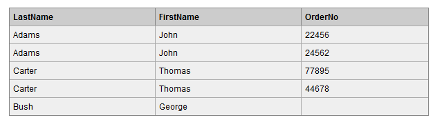
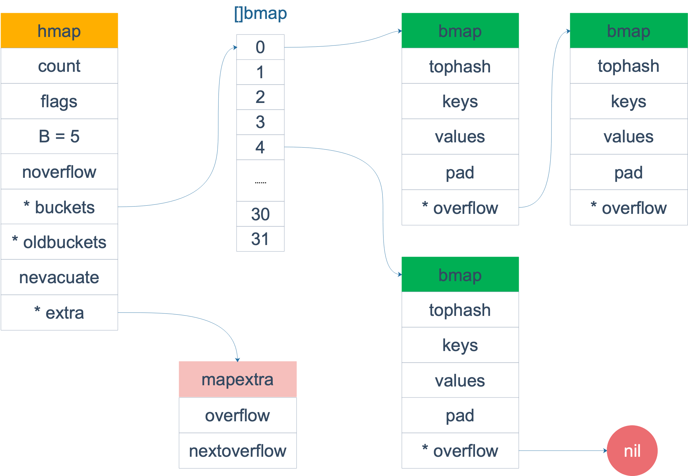

[toc]


### 1.Go相关

#### 1.go map底层原理及实现

总体来说golang的map是hashmap，是使用**数组+链表**的形式实现的，使用**拉链法消除hash冲突**。

golang的map由两种重要的结构，**hmap和bmap**，hmap中包含一个指向bmap数组的指针，key经过hash函数之后得到一个数，这个数低位用于选择bmap(当作bmap数组指针的下标)，高位用于放在bmap的[8]uint8数组中，用于快速试错。然后一个bmap可以指向下一个bmap(拉链)。

Golang中`map`的底层实现是一个散列表，因此实现`map`的过程实际上就是实现散表的过程。在这个散列表中，主要出现的结构体有两个，一个叫**`hmap`**(`a header for a go map`)，一个叫**`bmap`**(`a bucket for a Go map`，通常叫其`bucket`)。这两种结构的样子分别如下所示：

##### **Hmap:**


##### **Bucket:**

Golang的map中用于存储的结构是bucket数组。而bucket(即`bmap`)的结构是怎样的呢？


使用的`map`中的key和value就存储在这里。**“高位哈希值”数组记录的是当前bucket中key相关的“索引”**，稍后会详细叙述。还有一个字段是一个**指向扩容后的bucket的指针，使得bucket会形成一个链表结构**。

##### **hmap和bmap的关系：**


而bucket又是一个链表，所以，整体的结构应该是这样的：


哈希表的特点是会有一个哈希函数，对你传来的key进行哈希运算，得到唯一的值，一般情况下都是一个数值。Golang的`map`中也有这么一个哈希函数，也会算出唯一的值，对于这个值的使用，Golang也是很有意思。

Golang把求得的值按照用途一分为二：**高位和低位**。

**低位用于寻找当前key属于`hmap`中的哪个bucket，而高位用于寻找bucket中的哪个key**。上文中提到：bucket中有个属性字段是“高位哈希值”数组，这里存的就是蓝色的高位值，用来声明当前bucket中有哪些“key”，便于搜索查找。 需要特别指出的一点是：我们`map`中的**key/value值都是存到同一个数组中的**。数组中的顺序是这样的:


这样做的好处是：在key和value的**长度不同**的时候，可**以消除padding(内存对齐)带来的空间浪费**。

现在，我们可以得到Go语言`map`的整个的结构图了：(hash结果的**低位用于选择把KV放在bmap数组中的哪一个**bmap中，**高位用于key的快速预览**，用于快速试错)


##### **map的扩容**

当以上的哈希表增长的时候，Go语言会将bucket数组的数量扩充一倍，产生一个新的bucket数组，并将旧数组的数据迁移至新数组。

**判断扩充的条件**，就是哈希表中的**加载因子**(即loadFactor)。

加载因子是一个阈值，一般表示为：**散列包含的元素数除以位置总数**。是一种“产生冲突机会”和“空间使用”的平衡与折中：加载因子越小，说明空间空置率高，空间使用率小，但是加载因子越大，说明空间利用率上去了，但是“产生冲突机会”高了。

每种哈希表的都会有一个加载因子，数值超过加载因子就会为哈希表扩容。
Golang的map的加载因子的公式是：**map长度 / 2^B**(这是代表bmap数组的长度，B是取的低位的位数)阈值是6.5。其中B可以理解为已扩容的次数。

当Go的map长度增长到大于加载因子所需的map长度时，Go语言就会将**产生一个新的bucket数组**，然后把旧的bucket数组移到一个属性字段**oldbucket**中。

注意：并不是立刻把旧的数组中的元素转义到新的bucket当中，而是，**只有当访问到具体的某个bucket的时候，会把bucket中的数据转移到新的bucket中**。

注意：并不会直接删除旧的bucket，而是**把原来的引用去掉**，利用GC清除内存。

##### **map中数据的删除**

```
1、如果``key``是一个指针类型的，则直接将其置为空，等待GC清除；
2、如果是值类型的，则清除相关内存。
3、同理，对``value``做相同的操作。
4、最后把key对应的高位值对应的数组index置为空。
```

#### 2.sync.map

**并发安全**的map

1. 以空间换效率，通过**read和dirty**两个map来提高读取效率
2. 优先从read map中读取(无锁)，否则再从dirty map中读取(加锁)
3. 动态调整，当misses次数过多时，将dirty map提升为read map
4. 延迟删除，删除只是为value打一个标记，在dirty map提升时才执行真正的删除

`read map` 和 `dirty map` 的**存储方式**是不一致的。

前者使用 **`atomic.Value`**，后者只是单纯的使用 map。原因是 `read map` 使用 `lock free` 操作，必须保证 `load/store` 的**原子性**；而 `dirty map` 的 `load+store` 操作是由 lock（就是 mutex）来保护的。

##### load

1、**首先是 fast path，直接在 read 中找**，如果找到了直接调用 entry 的 load 方法，取出其中的值。
2、如果 read 中没有这个 key，且 amended 为 fase，说明 dirty 为空，那直接返回空和 false。
3、如果 read 中没有这个 key，且 **amended 为 true**，说明 **dirty 中可能存在我们要找的 key**。当然要**先上锁**，再尝试去 dirty 中查找。在这之前，仍然有一个 **double check** 的操作。若还是没有在 read 中找到，那么就从 dirty 中找。不管 dirty 中有没有找到，都要"记一笔"，因为在 dirty 被提升为 read 之前，都会进入这条路。

对于`missLocked`会直接将 misses 的值加 1，表示一次未命中，**如果 misses 值小于 m.dirty 的长度，就直接返回**。否则，将 m.dirty 晋升为 read，并清空 dirty，清空 misses 计数值。这样，之前一段时间新加入的 key 都会进入到 read 中，从而能够提升 read 的命中率。

##### store

1、首先还是**去read map中查询，存在并且p!=expunged,直接修改**。（由于**修改的是 entry 内部的 pointer**，因此 **dirty map 也可见**）
2、如果read map中**存在该key，但p == expunged**。**加锁更新**p的状态，然后直接**更新该entry** (此时m.dirtynil或m.dirty[key]e)
3、如果read map中不存在该Key，但**dirty map中存在该key，直接写入更新entry(read map中仍然没有)**
4、如果read map和dirty map**都不存在该key**

- a. 如果dirty map为空，则需要创建dirty map，并从read map中拷贝未删除的元素
- b. 更新**amended字段，标识dirty map中存在read map中没有的key**
- c. 将k v写入dirty map中，read.m不变

##### delete

1、先去read map中寻找，如果存在就直接删除
2、如果没找到，并且 read.amended为true代表dirty map中存在，依照传统进行 **double check**。
3、read map找到就删除，没找到判断dirty map是否存在，存在了就删除

##### loadorstore

结合了 Load 和 Store 的功能，如果 map 中存在这个 key，那么返回这个 key 对应的 value；否则，将 key-value 存入 map。
这在需要先执行 Load 查看某个 key 是否存在，之后再更新此 key 对应的 value 时很有效，因为 LoadOrStore 可以并发执行。

##### 总结

除了Load/Store/Delete之外，sync.Map还提供了LoadOrStore/Range操作，但没有提供Len()方法，这是因为要统计有效的键值对只能先提升dirty map(dirty map中可能有read map中没有的键值对)，再遍历m.read(由于延迟删除，不是所有的键值对都有效)，这其实就是Range做的事情，因此在不添加新数据结构支持的情况下，sync.Map的长度获取和Range操作是同一复杂度的。这部分只能看官方后续支持。

1、sync.map 是线程安全的，读取，插入，删除也都保持着常数级的时间复杂度。

2、通过**读写分离，降低锁时间来提高效率，适用于读多写少的场景**。

3、Range 操作需要提供一个函数，参数是 k,v，返回值是一个布尔值：f func(key, value interface{}) bool。

4、调用 Load 或 LoadOrStore 函数时，如果在 read 中没有找到 key，则会将 misses 值原子地增加 1，**当 misses 增加到和 dirty 的长度相等时，会将 dirty 提升为 read。以期减少“读 miss”**。

5、**新写入的 key 会保存到 dirty 中**，如果这时 dirty 为 nil，就会先新创建一个 dirty，并将 read 中未被删除的元素拷贝到 dirty。

6、当 dirty 为 nil 的时候，read 就代表 map 所有的数据；**当 dirty 不为 nil 的时候，dirty 才代表 map 所有的数据。**

#### 3.GMP模型

- M结构是Machine，**系统线程**，它由操作系统管理，**goroutine就是跑在M之上的**；M是一个很大的结构，里面维护小对象内存cache（mcache）、当前执行的goroutine、随机数发生器等等非常多的信息。
- P结构是Processor，**处理器(当P有任务时需要创建或者唤醒一个系统线程来执行它队列里的任务。所以P/M需要进行绑定，构成一个执行单元)**，它的主要用途就是用来执行goroutine，它**维护了一个goroutine队列**，即runqueue。Processor的让我们从N:1调度到M:N调度的重要部分。
- G是goroutine实现的核心结构，它包含了栈，指令指针，以及其他对调度goroutine很重要的信息，例如其阻塞的channel。

> Processor的数量是在启动时被设置为环境变量GOMAXPROCS的值，或者通过运行时调度函数GOMAXPROCS()进行设置。Processor数量固定意味着任意时刻只有GOMAXPROCS个线程在运行着go代码

##### 正常情况下

所有的goroutine运行在同一个M系统线程中，每一个M系统线程维护一个Processor，任何时刻，**一个Processor中只有一个goroutine**，其他goroutine在runqueue中**等待**。一个goroutine运行完自己的时间片后，让出上下文，回到runqueue中。 多核处理器的场景下，为了运行goroutines，**每个M系统线程会持有一个Processor**。

如果两个M都在一个CPU上运行，这就是并发；如果两个M在不同的CPU上运行，这就是并行。在正常情况下，scheduler（调度器）会按照上面的流程进行调度，当一个G（goroutine）的时间片结束后将P（Processor）分配给下一个G，但是线程会发生阻塞等情况，看一下goroutine对线程阻塞等的处理。

##### 线程阻塞

当正在运行的goroutine（G0）阻塞的时候，例如进行系统调用，会再创建一个系统线程（M1)，当前的M0线程放弃了它的Processor（P），**P转到新的线程中去运行**。


##### runqueue执行完成

当其中一个Processor的runqueue为空，没有goroutine可以调度，它会从另外一个上下文偷取一半的goroutine。


> 首先创建一个G对象，G对象保存到P本地队列或者是全局队列。P此时去唤醒一个M。P继续执行它的执行序。M寻找是否有空闲的P，如果有则将该G对象移动到它本身。接下来M执行一个调度循环(调用G对象->执行->清理线程→继续找新的Goroutine执行)。
> M执行过程中，随时会发生上下文切换。当发生上线文切换时，需要对执行现场进行保护，以便下次被调度执行时进行现场恢复。Go调度器**M的栈保存在G对象上**，只需要将M所需要的寄存器(SP、PC等)保存到G对象上就可以实现现场保护。当这些寄存器数据被保护起来，就随时可以做上下文切换了，在中断之前把现场保存起来。如果此时G任务还没有执行完，M可以将任务重新丢到P的任务队列，等待下一次被调度执行。当再次被调度执行时，M通过访问G的vdsoSP、vdsoPC寄存器进行现场恢复(从上次中断位置继续执行)。

#### 4.切片和数组

##### 数组

1. Go中的数组是值类型，换句话说，如果你将一个数组赋值给另外一个数组，那么，实际上就是将整个数组拷贝一份。
2. 如果Go中的数组作为函数的参数，那么实际传递的参数是一份数组的拷贝，而不是数组的指针。这个和C要区分开。因此，在Go中如果将数组作为函数的参数传递的话，那效率就肯定没有传递指针高了。
3. array的长度也是Type的一部分，这样就说明[10]int和[20]int是不一样的。在**初始化后长度是固定的**，无法修改其长度。

##### 切片

切片本身并不是动态数组或者数组指针。它内部实现的数据结构**通过指针引用底层数组**，设定相关属性将数据读写操作限定在指定的区域内。**切片本身是一个只读对象，其工作机制类似数组指针的一种封装。**

切片（slice）是对数组一个连续片段的引用，所以切片是一个引用类型（因此更类似于 C/C++ 中的数组类型，或者 Python 中的 list 类型）。这个片段可以是整个数组，或者是由起始和终止索引标识的一些项的子集。需要注意的是，**终止索引标识的项不包括在切片内**。切片提供了一个与指向数组的动态窗口。


给定项的切片索引可能比相关数组的相同元素的索引小。和数组不同的是，**切片的长度可以在运行时修改**，最小为 0 最大为相关数组的长度：切片是一个长度可变的数组。

###### 切片扩容

新的切片和之前的切片已经不同了，因为新的切片更改了一个值，并没有影响到原来的数组，**新切片指向的数组是一个全新的数组**。并且 **cap 容量**也发生了变化。

**扩容的策略**：

**如果切片的容量小于 1024 个元素，于是扩容的时候就翻倍增加容量**。

一旦元素个数**超过 1024 个元素**，那么增长因子就变成 1.25 ，即**每次增加原来容量的四分之一**。

**注意：扩容扩大的容量都是针对原来的切片容量而言的，而不是针对原来数组的长度而言的。**

###### 切片拷贝

有坑，容易在拷贝之后仍旧指向原数组，造成可以修改原数组。

#### 5.GC

##### 垃圾回收常见方法

###### **引用计数（reference counting）**

通过在对象上增加自己被引用的次数，被其他对象引用时加1，引用自己的对象被回收时减1，引用数为0的对象即为可以被回收的对象。这种算法在内存比较紧张和实时性比较高的系统中使用的比较广泛，如ios cocoa框架，php，python等。

优点：方式简单，回收速度快。

缺点：

1. 需要额外的空间存放计数。
2. 无法处理循环引用（如a.b=b;b.a=a这种情况）。
3. 频繁更新引用计数降低了性能。

**标记-清除（mark and sweep）**

该方法分为两步，标记从根变量开始迭代得遍历所有被引用的对象，**对能够通过应用遍历访问到的对象都进行标记为“被引用”**；标记完成后进行清除操作，**对没有标记过的内存进行回收**（回收同时可能伴有碎片整理操作）。

这种方法解决了引用计数的不足，但是也有比较明显的问题：**每次启动垃圾回收都会暂停当前所有的正常代码执行，回收时系统响应能力大大降低**！当然后续也出现了很多mark&sweep算法的变种（如三色标记法）优化了这个问题。

**复制收集**

复制收集的方式只需要对对象进行一次扫描。准备一个「**新的空间**」，从根开始，对对象进行扫，如果存在对这个对象的引用，就把它复制到「新空间中」。**一次扫描结束之后，所有存在于「新空间」的对象就是所有的非垃圾对象。**

这两种方式各有千秋，**标记清除的方式节省内存但是两次扫描需要更多的时间，对于垃圾比例较小的情况占优势。复制收集更快速但是需要额外开辟一块用来复制的内存，对垃圾比例较大的情况占优势。**特别的，复制收集有「**局部性**」的优点。

在复制收集的过程中，会按照对象**被引用的顺序**将对象复制到新空间中。于是，**关系较近的对象被放在距离较近的内存空间的可能性会提高**，这叫做局部性。局部性高的情况下，内存缓存会更有效地运作，程序的性能会提高。

对于标记清除，有一种**标记-压缩**算法的衍生算法：

对于压缩阶段，它的工作就是移动所有的可达对象到堆内存的同一个区域中，使他们紧凑的排列在一起，从而将所有非可达对象释放出来的空闲内存都集中在一起，通过这样的方式来达到**减少内存碎片**的目的。

**分代收集（generation）**

这种收集方式用了程序的一种特性：大部分对象会从产生开始在很短的时间内变成垃圾，而存在的很长时间的对象往往都有较长的生命周期。

根据对象的存活周期不同将内存划分为新生代和老年代，**存活周期短的为新生代，存活周期长的为老年代**。这样就可以根据每块内存的特点采用最适当的收集算法。

新创建的对象存放在称为 新生代（young generation）中（一般来说，新生代的大小会比 老年代小很多）。**高频对新生成的对象进行回收，称为「小回收」，低频对所有对象回收，称为「大回收」**。每一次「小回收」过后，就把存活下来的对象归为老年代，「小回收」的时候，遇到老年代直接跳过。大多数分代回收算法都采用的「复制收集」方法，因为小回收中垃圾的比例较大。

这种方式存在一个问题：如果在某个新生代的对象中，存在「老生代」的对象对它的引用，它就不是垃圾了，那么怎么制止「小回收」对其回收呢？这里用到了一中叫做写屏障的方式。

**程序对所有涉及修改对象内容的地方进行保护，被称为「写屏障」（Write Barrier）。写屏障不仅用于分代收集，也用于其他GC算法中。**

在此算法的表现是，用一个**记录集**来记录从新生代到老生代的引用。如果有两个对象A和B，当对A的对象内容进行修改并加入B的引用时，如果①A是「老生代」②B是「新生代」。则将这个引用加入到记录集中。「小回收」的时候，因为记录集中有对B的引用，所以B不再是垃圾。

##### 三色标记算法

三色标记算法是对标记阶段的改进，原理如下：

1. 起初所有对象都是**白色**。
2. 从根出发扫描**所有可达对象，标记为灰色**，放入待处理队列。
3. 从队列取出灰色对象，将**其引用对象标记为灰色放入队列**，**自身标记为黑色**。
4. 重复 3，**直到灰色对象队列为空**。此时白色对象即为垃圾，进行回收。

三色标记的一个明显好处是**能够让用户程序和 mark 并发的进行**。

##### GO的垃圾回收器

总体采用的是经典的**mark and sweep**算法。

- v1.3以前版本 **STW**（Stop The World）

    go runtime在一定条件下（内存超过阈值或定期如2min），暂停所有任务的执行，进行mark&sweep操作，操作完成后启动所有任务的执行。在内存使用较多的场景下，go程序在进行垃圾回收时会发生非常明显的卡顿现象（Stop The World）。

- v1.3 **Mark STW, Sweep** 并行

    1.3版本中，go runtime**分离了mark和sweep操作**，和以前一样，也是先暂停所有任务执行并启动mark，mark完成后马上就重新启动被暂停的任务了，让sweep任务和普通协程任务一样并行的和其他任务一起执行。如果运行在多核处理器上，go会试图将gc任务放到单独的核心上运行而尽量不影响业务代码的执行。go team自己的说法是减少了50%-70%的暂停时间。

- v1.5 **三色标记法**

    go 1.5正在实现的垃圾回收器是“非分代的、非移动的、并发的、三色的标记清除垃圾收集器”。这种方法的**mark操作是可以渐进执行的而不需每次都扫描整个内存空间**，可以**减少stop the world的时间**。

- v1.8 **混合写屏障**（hybrid write barrier）

    **采用一种混合的 write barrier 方式来避免堆栈重新扫描。**

    混合屏障的优势在于它**允许堆栈扫描永久地使堆栈变黑**（没有STW并且没有写入堆栈的障碍），这**完全消除了堆栈重新扫描的需要**，从而消除了对堆栈屏障的需求。重新扫描列表。特别是堆栈障碍在整个运行时引入了显着的复杂性，并且干扰了来自外部工具（如GDB和基于内核的分析器）的堆栈遍历。

    混合屏障不需要读屏障，因此指针读取是常规的内存读取; 它确保了进步，因为物体单调地从白色到灰色再到黑色。

    混合屏障的缺点很小。它可能会导致更多的浮动垃圾，**因为它会在标记阶段的任何时刻保留从根（堆栈除外）可到达的所有内容。**然而，在实践中，当前的Dijkstra障碍可能几乎保留不变。混合屏障还禁止某些优化：特别是，如果Go编译器可以静态地显示指针是nil，则Go编译器当前省略写屏障，但是在这种情况下混合屏障需要写屏障。这可能会略微增加二进制大小。

**小结：**

通过go team多年对gc的不断改进和忧化，GC的卡顿问题在1.8 版本基本上可以做到 1 毫秒以下的 GC 级别。 实际上，**gc低延迟是有代价的，其中最大的是吞吐量的下降**。由于需要**实现并行处理，线程间同步和多余的数据生成复制都会占用实际逻辑业务代码运行的时间**。GHC的全局停止GC对于实现高吞吐量来说是十分合适的，而Go则更擅长与低延迟。
并行**GC的第二个代价是不可预测的堆空间扩大**。程序在GC的运行期间仍能不断分配任意大小的堆空间，因此我们需要在到达最大的堆空间之前实行一次GC，但是过早实行GC会造成不必要的GC扫描，这也是需要衡量利弊的。因此在使用Go时，需**要自行保证程序有足够的内存空间**。

##### GC流程

GO的GC是并行GC, 也就是**GC的大部分处理和普通的go代码是同时运行**的, 这让GO的GC流程比较复杂.

1. Stack scan：收集根对象（全局变量，和G stack），开启写屏障。全局变量、开启写屏障需要STW，G stack只需要停止该G就好**，时间比较少。
2. Mark: 标记所有根对象**, **和根对象可以到达的所有对象不被回收**。
3. Mark Termination: **重新扫描全局变量，和上一轮改变的stack（写屏障），完成标记工作。这个过程需要STW**。
4. Sweep: **按标记结果清扫span**

目前整个GC流程会进行两次STW(Stop The World), 第一次是Stack scan阶段, 第二次是Mark Termination阶段.

第一次STW会准备根对象的扫描, 启动写屏障(Write Barrier)和辅助GC(mutator assist).

第二次STW会重新扫描部分根对象, 禁用写屏障(Write Barrier)和辅助GC(mutator assist).

##### 写屏障

因为go支持**并行GC**, GC的扫描和go代码可以同时运行, 这样带来的问题是**GC扫描的过程中go代码有可能改变了对象的依赖树。**

例如开始扫描时发现根对象A和B, B拥有C的指针。

1. GC先扫描A，A放入黑色
2. B把C的指针交给A
3. GC再扫描B，B放入黑色
4. C在白色，会回收；但是A其实引用了C。

为了避免这个问题, **go在GC的标记阶段会启用写屏障**(Write Barrier).

启用了写屏障(Write Barrier)后，在GC第三轮rescan阶段，根据写屏障标记将C放入灰色，防止C丢失。

#### 6.sync pool的实现原理

用来**保存和复用临时对象**，以减少内存分配，降低CG压力。它池化的对象会在未来的某个时候被毫无预兆地移除掉。而且，如果没有别的对象引用这个被移除的对象的话，这个被移除的对象就会被垃圾回收掉。

1. sync.Pool 本身就是**线程安全**的，多个 goroutine 可以并发地调用它的方法存取对象；
2. sync.Pool **不可在使用之后再复制使用**。

Go 1.13 之前的 sync.Pool 的实现有 2 大问题：

1. **每次 GC 都会回收创建的对象**。导致get命中率下降；
2. **底层实现使用了 Mutex**，对这个锁并发请求竞争激烈的时候，会导致性能的下降。

在 Go 1.13 中，sync.Pool 做了大量的优化。**Go 对 Pool 的优化就是避免使用锁，同时将加锁的 queue 改成 lock-free 的 queue 的实现，给即将移除的元素再多一次“复活”的机会。**

sync.Pool 的数据结构如下图所示：


Pool 最重要的两个字段是 **local 和 victim**，因为它们两个主要用来**存储空闲的元素**。

**每次垃圾回收的时候，Pool 会把 victim 中的对象移除，然后把 local 的数据给 victim**，这样的话，local 就会被清空，而 victim 就像一个**垃圾分拣站**，里面的东西可能会被当做垃圾丢弃了，但是里面有用的东西也可能被捡回来重新使用。

victim 中的元素如果被 Get 取走，那么这个元素就很幸运，因为它又“活”过来了。但是，如果这个时候 Get 的并发不是很大，元素没有被 Get 取走，那么就会被移除掉，因为没有别人引用它的话，就会被垃圾回收掉。

所有当前主要的空闲可用的元素都存放在 local 字段中，**请求元素时也是优先从 local 字段中查找可用的元素**。local 字段包含一个 `poolLocalInternal` 字段，并提供 CPU 缓存对齐，从而避免 false sharing。

而 poolLocalInternal 也包含两个字段：private 和 shared。

- private，代表一个缓存的元素，而且**只能由相应的一个 P 存取**。因为一个 P 同时只能执行一个 goroutine，所以不会有并发的问题。
- shared，可以**由任意的 P 访问**，但是只有本地的 P 才能 pushHead/popHead，其它 P 可以 popTail，相当于**只有一个本地的 P 作为生产者（Producer），多个 P 作为消费者（Consumer），它是使用一个 local-free 的 queue 列表实现的**。

sync.Pool提供了三个对外的方法：

##### New

Pool struct 包含一个 New 字段，这个字段的类型是**函数 func() interface{}**。当调用 Pool 的 Get 方法从池中获取元素，没有更多的空闲元素可返回时，就会调用这个 New 方法来创建新的元素。如果你没有设置 New 字段，没有更多的空闲元素可返回时，Get 方法将返回 nil，表明当前没有可用的元素。New 是可变的字段。这就意味着，你可以在程序运行的时候改变创建元素的方法。

##### Get

会从 Pool**取走**一个元素，这也就意味着，这个元素会从 Pool 中移除，返回给调用者。不过，除了返回值是正常实例化的元素，Get 方法的返回值还可能会是一个 nil。

###### 原理

首先，从**本地的 private 字段中获取可用元素**，因为没有锁，获取元素的过程会非常快，如果没有获取到，就尝试从**本地的 shared** 获取一个，如果还没有，会使用 `getSlow` 方法去其它的 shared 中“偷”一个。最后，如果没有获取到，就尝试使用 New 函数创建一个新的。

重点是 getSlow 方法，它**首先要遍历所有的 local，尝试从它们的 shared 弹出一个元素**。如果还没找到一个，那么，就开始对 victim 下手了。在 vintim 中查询可用元素的逻辑还是一样的，**先从对应的 victim 的 private 查找，如果查不到，就再从其它 victim 的 shared 中查找。**

##### Put

将一个元素返还给 Pool，Pool 会把这个元素保存到池中，并且可以复用。但如果 Put 一个 nil 值，Pool 就会忽略这个值。

###### 原理

**优先设置本地 private**，如果 private 字段已经有值了，那么就**把此元素 push 到本地队列**中。

##### 坑

###### 内存泄露

例如使用sync,Pool做buffer池的时候，可以往这个元素中增加大量的 byte 数据，这会导致**底层的 byte slice 的容量可能会变得很大**。这个时候，**即使 Reset 再放回到池子中，这些 byte slice 的容量不会改变，所占的空间依然很大**。而且，因为 Pool 回收的机制，**这些大的 Buffer 可能不被回收，而是会一直占用很大的空间**，这属于内存泄漏的问题。

在使用 sync.Pool 回收 buffer 的时候，**一定要检查回收的对象的大小**。如果 buffer 太大，就不要回收了，否则就太浪费了。

###### 内存浪费

池子中的 buffer 都比较大，但在实际使用的时候，很多时候只需要一个小的 buffer，这也是一种浪费现象。

要做到物尽其用，尽可能不浪费的话，我们可以**将 buffer 池分成几层**。首先，小于 512 byte 的元素的 buffer 占一个池子；其次，小于 1K byte 大小的元素占一个池子；再次，小于 4K byte 大小的元素占一个池子。这样分成几个池子以后，就可以**根据需要，到所需大小的池子中获取 buffer 了。**

#### 7.map里面解决hash冲突怎么做的，冲突了元素放在头还是尾？

拉链法。HashMap在JDK7用的是头插法，理由是刚放入的是热点数据，更容易被继续访问到，但这其实是个伪命题,因为JDK7中rehash的时候，旧链表迁移新链表的时候，如果在新表的数组索引位置相同，则链表元素会倒置(就是因为头插) 所以最后的结果 还是打乱了插入的顺序 。在JDK8开始容易造成死链接，而且如果链表的长度大于等于8 ，那么链表将转化为红黑树；当长度小于等于6时，又会变成一个链表。

#### 8.channel有无缓冲槽的区别，主要还是从同步和异步来讲

无缓冲的用来做同步的，如果向channel发送数据或者接受数据没有被对方消费的话，就会阻塞，有缓冲的在达到设定上限之前不会阻塞。

#### 9.Java和go的共同点和区别

1.函数重载

Go上**不允许函数重载**，**必须具有方法和函数的唯一名称**。java允许函数重载。

2.多态

Java默认允许**多态**。而，Go没有。

3.路由配置

Go语言使用HTTP协议进行路由配置；而java使用Akka.routing.ConsistentHashingRouter和Akka.routing.ScatterGatherFirstCompletedRouter进行路由配置。

4.可扩展性

Go代码可以自动扩展到多个核心；而，Java并不总是具有足够的可扩展性。

5.继承

Go语言的**继承通过匿名组合完成**：基类以Struct的方式定义，子类只需要把基类作为成员放在子类的定义中，**支持多继承**。Java的继承通过extends关键字完成，不支持多继承。

#### 10.go的优势

1.性能

2.易学性

3.并发性&通道

4.编译快速

5.Gofmt，强制代码格式

**缺点**：

错误处理、框架、软件包管理

#### 12.怎么限制gouroutine的数量？

带缓冲的chan通道，chan满了就阻塞。

优雅：做一个goroutine池，同时加入waitgroup，等待所有结束了再退出。

#### 14.go内存分配机制


从图中，很容易看到有三大模块：**Heap, Cental,Cache**。central在实际逻辑中是属于heap的子模块。

##### Cache

**1.Cache**：**线程私有的**，每个线程都有一个cache，**用来存放小对象**。由于每个线程都有cache，所以**获取空闲内存是不用加锁的**。cache层的主要目的就是**提高小内存的频繁分配释放速度**。 我们在写程序的时候，其实绝大多数的内存申请都是小于32k的，属于小对象，因此这样的内存分配全部走本地cache，不用向操作系统申请显然是非常高效的。

从cache中申请内存的函数是：`void *runtime·MCache_Alloc(MCache *c, int32 sizeclass, uintptr size, int32 zeroed)`

参数size是要申请的内存大小，这个大小可能比申请内存时指定的大小稍大。


 从图可以看到cache有一个容量为61的**数组list**，**每个数组单元挂一个链表**，链表的每个节点就是一块**可用内存**，**同一个链表中节点的大小是一样的**，但是**不同数组单元的链表下的节点大小是不一样的**，数组的下标（0-60）就是不同的sizeclass。

**MCache_Alloc分配内存的过程**是：根据**sizeclass参数**从list中取出一个内存块**链表**，如果这个链表不为空，就**把这个链表的可用节点返回**；==如果为空，说明cache中没有满足此类大小的缓存内存，就要从central中去取一部分此类大小的缓存，再把第一个节点返回使用，其他剩余的内存块挂到这个链表上，为下一次分配作准备。== cache的内存分配逻辑很简单，就是cache取不到就从central取。除去内存分配外，cache上还有很多**状态计数器**，主要用来统计内存分配情况，如：**分配的内存量，缓存的内存量**等，用于其它相关类查询内存情况以及profile等。

​    cache释放主要有两个条件：a，**某个内存链表过长**（>=256 ）时，会截取此链表的一部分节点，返还给central；b，**整个cache缓存过大**（>=1M）,同样将每个链表返还部分节点给central。

##### Central

**2.Central**:**所有线程共享的组件**，不是独占的，因此**需要加锁**操作。它其实也是一个**缓存**，**cache的一个上游用户**，但缓存的不是小对象内存块，而是**一组一组的内存page**（一个page4K）。从图2可以看出，**在heap结构里，使用了一个0到n的数组来存储了一批central**，并不是只有一个central对象。从上面结构定义可以知道这个**数组长度位61个元素**，也就是说**heap里其实是维护了61个central**，这61个central对应了cache中的list数组，也就是**每一个sizeclass就有一个central**。所以，**在cache中申请内存时，如果在某个sizeclass的内存链表上找不到空闲内存，那么cache就会向对应的sizeclass的central获取一批内存块**。注意，这里central数组的定义里面使用填充字节，这是因为**多线程会并发访问不同central避免false sharing**。

```go
struct MCentral
{
        Lock;
        int32 sizeclass;
        MSpan nonempty;
        MSpan empty;
        int32 nfree;
};
```

nonempty和empty两个字段很重要，它们都是**MSpan类型**，这两个字段**分别挂一个span节点构造的双向链表**，只是这个双向链表的**头节点不作使用**。**nonempty意思是非空**，表示这个链表上存储的span节点都是非空状态，也就是说这些**span节点都有空闲的内存**，empty表示span都是空的，没有空闲可用。**一开始，empty就是空的，当nonempty上的一个span被用完后，就会将span移到empty中**。

central内存分配过程： central通过``int32 runtime·MCentral_AllocList(MCentral *c, int32 n, MLink **pfirst)``方法获取一批内存给cache。这个逻辑也很简单，但是要关注下填充nonempty的情况，也就是**central没有空闲内存要向heap申请**的情况。这里是调用MCentral_Grow函数实现。首先通过MHeap_Alloc**向heap申请一个span**，然后**将span给切分成central对应的sizeclass的小内存块**，**将这些小内存块串成链表挂在span的freelist上**，最后**将span放到nonempty链表中**。central一次只申请一个span，这个span含有多少page是根据central对应的sizeclass确定。

central的释放过程：**ceche释放的时候，是将一批小内存块返还给central**，central在接收到内存块的时候，会**把每个内存块分配返还给对应的span**，在把内存返还给span后，如果span先前被用完内存，待在empty中那么此刻就需要把它移到nonempty中，表示又有内存用了。在归还内存块给span后，**如果span的每个page内存都回收回来了，也就是没有任何内存被使用了，此刻就将这个span整体归还给heap了。**

central这一层管理的**粒度就是span**，所以span是一个非常重要的工具组件。

##### Heap

**3.Heap：****所有底层线程共享**，是离go程序最远的一层，也是离OS最近的一层。主要是**从OS申请内存交给central**。在64位平台，heap从OS申请到的**内存地址保留区是136G，而bitmap要8G空间，因此真正可申请的内存就是128G。

无论是分配小内存还是大对象，都需要通过``MSpan* runtime·MHeap_Alloc(MHeap *h, uintptr npage, int32 sizeclass, int32 acct, int32 zeroed)``函数。**向heap要内存，不是以字节为单位，而是page**（npage参数）。**sizeClass为0表示绕过cache和central直接分配大内存**。从heap申请的page肯定是连续的，并通过span来管理。所有返回值是一个span而不是page数组。

**heap内存分配过程**：分配逻辑位于mheap.c中的MHeap_AllocLocked函数。图2中可以看出，heap结构中包括**free和large**两个域，free是一个256个单元的数组，每个单元上存储一个span链表，但不同的单元span含有page的个数也是不同的。span含page的个数等于span在数组中的单元下标（index，free【2】含有2个page）。如果一个span的page数超过255，那这个span就被放到large链表中。**从heap要内存，要根据page的数目从free或large链表中获取合适的span**。如果page大到连large链表中都没有合适的span，就只能调用MHeap_Grow函数从OS中去申请，填充heap，再试图分配。拿到的span所含的page数目大于了请求的page数目，并不会将这个span返回，而是将其拆分成两个span，将剩余span重新放回free或large链表中去。全部返回就太浪费了。

heap的释放：**central交还heap内存的时候，主要也就是将span放到free或large链表中去**。

heap复杂的不是分配内存，而是要维护很多元数据，比如图2中的**map域，维护的就是page到span的映射**，也就是任何一块内存在算出page后也就知道它属于哪个span了，这样才能做到正确回收内存。**bitmap结构，用来标记内存，为gc服务**。

总的来说，小对象的分配顺序是：

**canche（返回一个内存块）->central(返回一个包含一系列内存块的链表)->heap(返回一个span)->MM(返回span)**

##### MSpan

 MSPan是**内存分配器的基础工具组件**，简称span，是**用来管理一组组page对象**。page就是一个**4k大小的内存块**。span将这一个个连续的page给管理起来。


span是一个**双向链表**（pre/next）。**span可能用于分配小对象，也可以用来分配大对象**。分配不同的对象，span管理的元数据不相同。npages表示此span存储的page的个数。start可以看作一个page指针，指向第一个page，这样可以可以很容易的获取后续其它page了，因为它们是连续的。start的类型的pageID，所以可以看出**start保存的不是第一个page的起始地址，而是第一个page的id值**。这个id是算出来的（**page的地址除以4096**，当然需要保证每个page按4k对齐）。start是span最重要的字段，小对象时，它维护好所有的page，最后page会被切成一个一个连续的内存，内存块大小是小对象的大小，切分出来的内存块将被链接成一个链表挂在freelist字段上。sizeclass为0时，表示大对象，这个时候freelist就没什么用了。

**应用层面用new和用make分配内存**

new：内建函数new（T）分配了零值填充的T类型的内存空间，并返回其地址。**一个*T类型的值**。用go的术语说，**它返回了一个指针，指向新分配的类型T的零值**。使用者用new创建的一个数据结构的实体并可以直接工作。如bytes.Buffer的文档所述：Buffer的零值是一个准备好了的空缓存。

make：内建函数**make（T，args）只能创建slice，map和channel，**并**返回一个有初始值（非零）的T类型，而不是*T**。导致这三个类型有所不同的原因是指向数据结构的引用在使用前必须初始化。如，一个slice，是一个包含指向数据（内部array）的指针，长度和容量的三项描述，在这些项目初始化之前，slice为nil。对于slice，map和channel，make初始化了内部的数据结构，填充适当的值。

**务必记得 make 仅适用于 map，slice 和 channel，并且返回的不是指针。应当用 new 获得特定的指针**.

#### 15.go的多态实现

Golang中的多态可以通过接口来实现。**定义接口的所有方法的任何类型都表示隐式实现该接口。类型接口的变量可以保存实现该接口的任何值。**接口的这个属性用于实现GO的多态性。

```go
package main
import (
	"fmt"
)
 
type Person interface {
	SayHello()
}
type Girl struct {
	Sex string
}
type Boy struct {
	Sex string
}
 
func (this *Girl) SayHello() {
	fmt.Println("Hi, I am a " + this.Sex)
}
 
func (this *Boy) SayHello() {
	fmt.Println("Hi, I am a " + this.Sex)
}
 
func main() {
	g := &Girl{"girl"}
	b := &Boy{"boy"}
	
	p := map[int]Person{}
	p[0] = g
	p[1] = b
 
	for _, v := range p {
		v.SayHello()
	} 
}
```

#### 16.interface的底层实现

**Go的interface是由两种类型来实现的：iface和eface。**其中，**iface表示的是包含方法的interface**，例如：

```Go
type Person interface {
    Print()
}
```

而**eface代表的是不包含方法的interface**，即

```go
type Person interface {}
```

或者

```Go
var person interface{} = xxxx实体
```

##### eface


一共有两个属性构成，一个是**类型信息**`_type`，一个是**数据信息**。
其中，`_type`可以认为是Go语言中所有类型的公共描述，Go语言中几乎所有的数据结构都可以抽象成`_type`，是所有类型的表现，可以说是万能类型，`data`是指向具体数据的指针。

赋值后：


##### iface


`itab`是`iface`不同于`eface`比较关键的数据结构。其可包含两部分：一部分是确定唯一的**包含方法的interface的具体结构类型**，一部分是**指向具体方法集的指针**。

进行赋值之后：


#### 17.golang的context包

Go 标准库的 Context 不仅提供了上下文传递的信息，还提供了 cancel、timeout 等其它信息。

##### 使用场景

- 上下文信息传递 （request-scoped），比如处理 http 请求、在请求处理链路上传递信息；
- 控制子 goroutine 的运行；
- 超时控制的方法调用；
- 可以取消的方法调用。

##### 实现方法

包 context 定义了 Context 接口：

```go
type Context interface {
    Deadline() (deadline time.Time, ok bool)
    Done() <-chan struct{}
    Err() error
    Value(key interface{}) interface{}
}
```

- **Deadline 方法会返回这个 Context 被取消的截止日期**。如果没有设置截止日期，ok 的值是 false。
- **Done 方法返回一个 Channel 对象**。在 Context 被取消时，此 Channel 会被 close，如果没被取消，可能会返回 nil。**如果 Done 没有被 close，Err 方法返回 nil；如果 Done 被 close，Err 方法会返回 Done 被 close 的原因**。
- **Value 返回此 ctx 中和指定的 key 相关联的 value。**

Context 中实现了 **2 个常用的生成顶层 Context 的方法**。

- **context.Background()**：返回一个非 nil 的、空的 Context，没有任何值，不会被 cancel，不会超时，没有截止日期。一般用在主函数、初始化、测试以及创建根 Context 的时候。
- **context.TODO()**：返回一个非 nil 的、空的 Context，没有任何值，不会被 cancel，不会超时，没有截止日期。当你不清楚是否该用 Context，或者目前还不知道要传递一些什么上下文信息的时候，就可以使用这个方法。

##### 使用规则

1. 一般函数使用 Context 的时候，会把这个参数放在**第一个参数**的位置。
2. 从来**不把 nil 当做 Context 类型的参数值**，可以使用 context.Background() 创建一个空的上下文对象，也不要使用 nil。
3. Context 只用来**临时做函数之间的上下文透传，不能持久化 Context 或者把 Context 长久保存**。把 Context 持久化到数据库、本地文件或者全局变量、缓存中都是错误的用法。
4. **key 的类型不应该是字符串类型或者其它内建类型，否则容易在包之间使用 Context 时候产生冲突**。使用 WithValue 时，key 的类型应该是自己定义的类型。
5. 常常使用 **struct{}作为底层类型定义 key 的类型**。对于 exported key 的静态类型，常常是接口或者指针。这样可以尽量减少内存分配。

##### 创建特殊用途context

###### WithValue

WithValue 基于 parent Context 生成一个新的 Context，保存了一个 key-value 键值对。它常常用来传递上下文。

```go
type valueCtx struct {
    Context
    key, val interface{}
}
```

它持有一个 key-value 键值对，还持有 parent 的 Context。**它覆盖了 Value 方法，优先从自己的存储中检查这个 key，不存在的话会从 parent 中继续检查。**

Go 标准库实现的 Context 还实现了**链式查找**。如果不存在，还会向 parent Context 去查找，如果 parent 还是 valueCtx 的话，还是遵循相同的原则：valueCtx 会嵌入 parent，所以还是会查找 parent 的 Value 方法的。

###### WithCancel

返回parent的副本，只是副本中的**Done channel是新建的对象**，它的类型是**cancelCtx**

###### WithTimeout

和WithDeadline一样，只不过一个参数是**超时时间**，一个是**截止时间**

###### WithDeadline

返回一个parent的副本，并且设置了一个不晚于参数d的截止时间，类型为timerCtx（或者是cancelCtx）

#### 18.string类型转为[]byte发生了什么？

byte是uint8的别名,string是8位字节的集合，通常但不一定代表UTF-8编码的文本。string可以为空，但是不能为nil。**string的值是不能改变的。**

string定义如下：

```go
type stringStruct struct {
	str unsafe.Pointer
	len int
}
```

stringStruct代表的就是一个string对象，str指针指向的是某个数组的首地址，len代表的数组长度。

string与[]byte在底层结构上是非常的相近（**后者的底层表达仅多了一个cap属性，因此它们在内存布局上是可对齐的**），这也就是为何builtin中内置函数copy会有一种特殊情况`copy(dst []byte, src string) int`的原因了。对于[]byte与string而言，**两者之间最大的区别就是string的值不能改变。**

字符串的值不能被更改，但**可以被替换**。 string结构体的**str指针指向的是一个字符常量的地址**， 这个地址里面的内容是不可以被改变的，因为它是**只读**的，但是这个**指针可以指向不同的地址**。

##### 标准转换

###### string转[]byte

源码在`src/runtime/string.go`中

```go
// The constant is known to the compiler.
// There is no fundamental theory behind this number.
const tmpStringBufSize = 32

type tmpBuf [tmpStringBufSize]byte

func stringtoslicebyte(buf *tmpBuf, s string) []byte {
	var b []byte
	if buf != nil && len(s) <= len(buf) {
		*buf = tmpBuf{}
		b = buf[:len(s)]
	} else {
		b = rawbyteslice(len(s))
	}
	copy(b, s)
	return b
}

// rawbyteslice allocates a new byte slice. The byte slice is not zeroed.
func rawbyteslice(size int) (b []byte) {
	cap := roundupsize(uintptr(size))
	p := mallocgc(cap, nil, false)
	if cap != uintptr(size) {
		memclrNoHeapPointers(add(p, uintptr(size)), cap-uintptr(size))
	}

	*(*slice)(unsafe.Pointer(&b)) = slice{p, size, int(cap)}
	return
}
```

这里有两种情况：**s的长度是否大于32**。当大于32时，go需要**调用mallocgc分配一块新的内存**（大小由s决定），**当x的数据较大时，标准转换方式会有一次分配内存的操作**。

最后**通过copy函数实现string到[]byte的拷贝**，具体实现在``src/runtime/slice.go``中的``slicestringcopy``方法。

```go
func slicestringcopy(to []byte, fm string) int {
	if len(fm) == 0 || len(to) == 0 {
		return 0
	}

  // copy的长度取决与string和[]byte的长度最小值
	n := len(fm)
	if len(to) < n {
		n = len(to)
	}

  // 如果开启了竞态检测 -race
	if raceenabled {
		callerpc := getcallerpc()
		pc := funcPC(slicestringcopy)
		racewriterangepc(unsafe.Pointer(&to[0]), uintptr(n), callerpc, pc)
	}
  // 如果开启了memory sanitizer -msan
	if msanenabled {
		msanwrite(unsafe.Pointer(&to[0]), uintptr(n))
	}

  // 该方法将string的底层数组从头部复制n个到[]byte对应的底层数组中去（这里就是copy实现的核心方法，在汇编层面实现 源文件为memmove_*.s）
	memmove(unsafe.Pointer(&to[0]), stringStructOf(&fm).str, uintptr(n))
	return n
}
```

copy实现：


###### []byte转string

```go
// Buf is a fixed-size buffer for the result,
// it is not nil if the result does not escape.
func slicebytetostring(buf *tmpBuf, b []byte) (str string) {
	l := len(b)
	if l == 0 {
		// Turns out to be a relatively common case.
		// Consider that you want to parse out data between parens in "foo()bar",
		// you find the indices and convert the subslice to string.
		return ""
	}
  // 如果开启了竞态检测 -race
	if raceenabled {
		racereadrangepc(unsafe.Pointer(&b[0]),
			uintptr(l),
			getcallerpc(),
			funcPC(slicebytetostring))
	}
  // 如果开启了memory sanitizer -msan
	if msanenabled {
		msanread(unsafe.Pointer(&b[0]), uintptr(l))
	}
	if l == 1 {
		stringStructOf(&str).str = unsafe.Pointer(&staticbytes[b[0]])
		stringStructOf(&str).len = 1
		return
	}

	var p unsafe.Pointer
	if buf != nil && len(b) <= len(buf) {
		p = unsafe.Pointer(buf)
	} else {
		p = mallocgc(uintptr(len(b)), nil, false)
	}
	stringStructOf(&str).str = p
	stringStructOf(&str).len = len(b)
  // 拷贝字节数组至字符串
	memmove(p, (*(*slice)(unsafe.Pointer(&b))).array, uintptr(len(b)))
	return
}

// 实例stringStruct对象
func stringStructOf(sp *string) *stringStruct {
	return (*stringStruct)(unsafe.Pointer(sp))
}
```

可见，当数组长度超过32时，同样需要调用**mallocgc分配一块新内存**。最后通过**memmove完成拷贝**。

##### 强转换

###### 1.万能的unsafe.Pointer指针

在go中，**任何类型的指针*T都可以转换为unsafe.Pointer类型的指针**，它可以**存储任何变量的地址**。同时，unsafe.Pointer类型的指针也可以**转换回普通指针**，而且可以**不必和之前的类型*T相同**。另外，unsafe.Pointer类型还可以**转换为uintptr类型**，该类型**保存了指针所指向地址的数值**，从而可以使我们对地址进行数值计算。以上就是强转换方式的实现依据。

而string和slice在reflect包中，对应的结构体是``reflect.StringHeader和reflect.SliceHeader``，它们是string和slice的运行时表达。

```go
type StringHeader struct {
	Data uintptr
	Len  int
}
type SliceHeader struct {
	Data uintptr
	Len  int
	Cap  int
}
```

###### 2.内存布局

从string和slice的运行时表达可以看出，除了SilceHeader多了一个int类型的**Cap字段**，Date和Len字段是一致的。所以，它们的内存布局是可对齐的，这说明我们就可以直接通过unsafe.Pointer进行转换。

###### []byte转string


###### string转[]byte图解


##### 为啥强转换性能会比标准转换好？

对于标准转换，无论是从[]byte转string还是string转[]byte都会涉及**底层数组的拷贝**。**而强转换是直接替换指针的指向**，从而使得string和[]byte指向同一个底层数组。这样，当然后者的性能会更好。

##### 为啥在上述测试中，当x的数据较大时，标准转换方式会有一次分配内存的操作，从而导致其性能更差，而强转换方式却不受影响？

标准转换时，当数据长度大于32个字节时，需要通过**mallocgc申请新的内存，之后再进行数据拷贝工作**。而强转换只是更改指针指向。所以，当转换数据较大时，两者性能差距会愈加明显。

##### 既然强转换方式性能这么好，为啥go语言提供给我们使用的是标准转换方式？

首先，我们需要知道Go是一门类型安全的语言，而安全的代价就是性能的妥协。但是，性能的对比是相对的，这点性能的妥协对于现在的机器而言微乎其微。另外强转换的方式，会给我们的程序带来极大的安全隐患。

##### 为啥string要设计为不可修改的？

string不可修改，意味它是**只读**属性，这样的好处就是：在**并发场景下，我们可以在不加锁的控制下，多次使用同一字符串**，在保证高效共享的情况下而不用担心安全问题。

#### 19.实现一个压测工具

golang编写一个http客户端，支持参数http request -c 5 -r 1000 http://**** 客户端，输出所有响应

#### 20.map怎么实现顺序读取？

借助额外的数据结构比如slice 等，对key进行排序，遍历slice得到顺序输出。

#### 21.协程泄漏

如果你启动了一个 **goroutine，但并没有符合预期的退出**，直到程序结束，此goroutine才退出，这种情况就是 goroutine 泄露。当 goroutine 泄露发生时，该 goroutine 的**栈(一般 2k 内存空间起)一直被占用不能释放**，goroutine 里的函数**在堆上申请的空间也不能被垃圾回收器回收**。

#### 22.空结构体的用处

空结构体不占用内存空间，地址不变

1. **实现集合set**

    Go 语言标准库没有提供 Set 的实现，通常使用 map 来代替。而**对于集合来说，只需要 map 的键，而不需要值**。

    声明为`map[string]struct{}`，由于struct{}是空，不关心内容，这样map便改造为set 。

    map可以通过“comma ok”机制来获取该key是否存在,例如`_, ok := map["key"]`,如果没有对应的值，ok为false。可以通过定义成`map[string]struct{}`的形式，**值不再占用内存**。其值仅有两种状态，有或无。如果定义的是`map[string]bool`，则结果有true、false或没有三种状态，而且即使是将值设置为 bool 类型，也会多占据 1 个字节。因此呢，将 map 作为集合(Set)使用时，可以将值类型定义为空结构体，**仅作为占位符使用**即可。

2. 实现chan struct{} 不占用内存空间，**实现传递信号的通道**，不发送数据

3. **仅包含方法的结构体**

    在部分场景下，结构体只包含方法，不包含任何的字段。这时候我们就可以使用空结构体。

#### 23.Go的Mutex和RWmutex及实现原理

##### Mutex互斥锁

Lock、Unlock


###### 初版

通过一个 **flag 变量**，标记当前的锁是否被某个 goroutine 持有。如果这个 flag 的值是 1，就代表锁已经被持有，那么，其它竞争的 goroutine 只能等待；如果这个 flag 的值是 0，就可以通过 **CAS** 将这个 flag 设置为 1，标识锁被当前的这个 goroutine 持有了。

CAS 指令将**给定的值**和**一个内存地址中的值**进行比较，如果它们是同一个值，就使用新值替换内存地址中的值，这个操作是原子性的。


**Unlock 方法可以被任意的 goroutine 调用释放锁，即使是没持有这个互斥锁的 goroutine，也可以进行这个操作。这是因为，Mutex 本身并没有包含持有这把锁的 goroutine 的信息，所以，Unlock 也不会对此进行检查。Mutex 的这个设计一直保持至今。**

###### 给新人机会


这个字段的第一位（最小的一位）来表示这个锁是否被持有，第二位代表是否有唤醒的 goroutine，剩余的位数代表的是等待此锁的 goroutine 数。所以，state 这一个字段被分成了三部分，代表三个数据。


**在锁释放唤醒之后，它并不能像先前一样直接获取到锁，还是要和正在请求锁的 goroutine 进行竞争**。这会**给后来请求锁的 goroutine 一个机会**，也**让 CPU 中正在执行的 goroutine 有更多的机会获取到锁**，在一定程度上提高了程序的性能。

**释放锁**的时候：

第一种情况，如果没有其它的 waiter，说明对这个锁的竞争的 goroutine 只有一个，那就可以直接返回了；如果这个时候有唤醒的 goroutine，或者是又被别人加了锁，那么，无需我们操劳，其它 goroutine 自己干得都很好，当前的这个 goroutine 就可以放心返回了。

第二种情况，如果有等待者，并且没有唤醒的 waiter，那就需要**唤醒一个等待的 waiter**。在唤醒之前，需要将 waiter 数量减 1，并且将 mutexWoken 标志设置上，这样，Unlock 就可以返回了。

**相对于初版的设计，这次的改动主要就是，新来的 goroutine 也有机会先获取到锁，甚至一个 goroutine 可能连续获取到锁，就会减少上下文的切换，提高效率，打破了先来先得的逻辑。**

###### 多给些机会

如果新来的 goroutine 或者是被唤醒的 goroutine 首次获取不到锁，它们就会通过**自旋**（spin，通过循环不断尝试）的方式，尝试检查锁是否被释放。在尝试一定的自旋次数后，再执行原来的逻辑。

对于**临界区代码执行非常短**的场景来说，这是一个非常好的优化。因为临界区的代码耗时很短，锁很快就能释放，而抢夺锁的 goroutine 不用通过休眠唤醒方式等待调度，直接 spin 几次，可能就获得了锁。

###### 解决饥饿


将饥饿模式的最大等待时间阈值设置成了 1 毫秒，这就意味着，一旦等待者等待的时间超过了这个阈值，**Mutex 的处理就有可能进入饥饿模式，优先让等待者先获取到锁**。通过加入饥饿模式，可以避免把机会全都留给新来的 goroutine，保证了请求锁的 goroutine 获取锁的公平性，对于我们使用锁的业务代码来说，不会有业务一直等待锁不被处理。

###### 正常模式和饥饿模式

**正常模式下，waiter 都是进入先入先出队列，被唤醒的 waiter 并不会直接持有锁，而是要和新来的 goroutine 进行竞争**。新来的 goroutine 有先天的优势，它们正在 CPU 中运行，可能它们的数量还不少，所以，在高并发情况下，被唤醒的 waiter 可能比较悲剧地获取不到锁，这时，它会被插入到队列的前面。如果 waiter 获取不到锁的时间超过阈值 1 毫秒，那么，这个 Mutex 就进入到了饥饿模式。

**在饥饿模式下，Mutex 的拥有者将直接把锁交给队列最前面的 waiter**。新来的 goroutine 不会尝试获取锁，即使看起来锁没有被持有，它也不会去抢，也不会 spin，它会加入到等待队列的尾部。

如果拥有 Mutex 的 waiter 发现下面两种情况的其中之一，它就会把这个 Mutex 转换成正常模式:

- 此 **waiter 已经是队列中的最后一个 waiter 了**，没有其它的等待锁的 goroutine 了；
- 此 waiter 的**等待时间小于 1 毫秒**。

正常模式拥有更好的性能，因为即使有等待抢锁的 waiter，goroutine 也可以连续多次获取到锁。

饥饿模式是对公平性和性能的一种平衡，它避免了某些 goroutine 长时间的等待锁。在饥饿模式下，优先对待的是那些一直在等待的 waiter。


##### RWMutex

- Lock/Unlock：写操作时调用的方法。
- RLock/RUnlock：读操作时调用的方法。
- RLocker：这个方法的作用是为读操作返回一个 Locker 接口的对象。

**RWMutex 的零值是未加锁的状态**，所以，当你使用 RWMutex 的时候，无论是声明变量，还是嵌入到其它 struct 中，都**不必显式地初始化。**

**如果你遇到可以明确区分 reader 和 writer goroutine 的场景，且有大量的并发读、少量的并发写，并且有强烈的性能需求，你就可以考虑使用读写锁 RWMutex 替换 Mutex。**

###### 实现原理

**Go 标准库中的 RWMutex 设计是 Write-preferring 方案。一个正在阻塞的 Lock 调用会排除新的 reader 请求到锁。**基于Mutex实现。

```go
type RWMutex struct {
  w           Mutex   // 互斥锁解决多个writer的竞争
  writerSem   uint32  // writer信号量
  readerSem   uint32  // reader信号量
  readerCount int32   // reader的数量
  readerWait  int32   // writer等待完成的reader的数量
}

const rwmutexMaxReaders = 1 << 30 //定义最大的reader数量
```

**RLock/RUnlock 的实现**

readerCount 这个字段有双重含义：

- 没有 writer 竞争或持有锁时，readerCount 和我们正常理解的 reader 的计数是一样的；
- 但是，如果**有 writer 竞争锁或者持有锁时**，那么，readerCount 不仅仅承担着 reader 的计数功能，还能够**标识当前是否有 writer 竞争或持有锁**，在这种情况下，请求锁的 reader 阻塞等待锁的释放。

调用 RUnlock 的时候，我们需要将 Reader 的计数减去 1 ，因为 reader 的数量减少了一个。但是，第 8 行的 AddInt32 的返回值还有另外一个含义。如果它是负值，就表示当前有 writer 竞争锁，在这种情况下，还会调用 rUnlockSlow 方法，检查是不是 reader 都释放读锁了，如果读锁都释放了，那么可以唤醒请求写锁的 writer 了。

当一个或者多个 reader 持有锁的时候，竞争锁的 writer 会等待这些 reader 释放完，才可能持有这把锁。打个比方，在房地产行业中有条规矩叫做“**买卖不破租赁**”，意思是说，就算房东把房子卖了，新业主也不能把当前的租户赶走，而是要等到租约结束后，才能接管房子。这和 RWMutex 的设计是一样的。当 writer 请求锁的时候，是无法改变既有的 reader 持有锁的现实的，也不会强制这些 reader 释放锁，它的优先权只是限定后来的 reader 不要和它抢。

所以，**rUnlockSlow 将持有锁的 reader 计数减少 1 的时候，会检查既有的 reader 是不是都已经释放了锁，如果都释放了锁，就会唤醒 writer，让 writer 持有锁**。

#### 24.TreeMap和HashMap的区别

- HashMap是通过hashcode()对其内容进行**快速查找**的；HashMap中的元素是**没有顺序**的；

    TreeMap中所有的元素都是有某一**固定顺序**的，如果需要得到一个有序的结果，就应该使用TreeMap；

- HashMap和TreeMap**都不是线程安全**的；

- HashMap：基于**hash表**实现的；为了优化HashMap的空间使用，可以**调优初始容量和负载因子**；

    TreeMap：基于**红黑树**实现的；TreeMap就没有调优选项，因为**红黑树总是处于平衡**的状态；

- HashMap：适用于Map**插入，删除，定位**元素；

    TreeMap：适用于**按自然顺序或自定义顺序遍历**键（key）；

#### 25.Go怎么做深拷贝？

```go
package main
 
import (
   "fmt"
)
 
// 定义一个Robot结构体
type Robot struct {
   Name  string
   Color string
   Model string
}
 
func main() {
   robot1 := Robot{
      Name:  "小白-X型-V1.0",
      Color: "白色",
      Model: "小型",
   }
   robot2 := robot1	//深拷贝
   /*
   robot2 := &robot1 //浅拷贝，赋值一个地址
   robot1 := new(Robot)	//使用new方式，返回*Robot的内存地址
   */
   fmt.Printf("Robot 1：%s\t内存地址：%p \n", robot1, &robot1)
   fmt.Printf("Robot 2：%s\t内存地址：%p \n", robot2, &robot2)
 
   fmt.Println("修改Robot1的Name属性值")
   robot1.Name = "小白-X型-V1.1"
 
   fmt.Printf("Robot 1：%s\t内存地址：%p \n", robot1, &robot1)
   fmt.Printf("Robot 2：%s\t内存地址：%p \n", robot2, &robot2)
 }
```

#### 26.defer的执行顺序

1. 后defer的先执行。
2. defer的执行顺序**在return之后，但是在返回值返回给调用方之前**，所以使用defer可以达到修改返回值的目的。

#### 27.切片怎么扩容，扩容过程需不需要重新写入

如果切片长度超过容量时候，切片会进行自动扩容（扩容过程通过拷贝实现的），需要注意的当切片扩容时，其会新开一块内存来存储扩容后的切片，相比前后其内存地址已经改变。

#### 28.Go的协程可不可以自己让出CPU

 不同的是，Golang 在 runtime、系统调用等多方面对 goroutine 调度进行了封装和处理，**当遇到长时间执行或者进行系统调用时，会主动把当前 goroutine 的CPU (P) 转让出去，让其他 goroutine 能被调度并执行**，也就是 Golang 从语言层面支持了协程。

协程是**非抢占式**的调度，**无法实现公平的任务调用。也无法直接利用多核优势**。

#### 29.Go的协程只能挂在一个线程上面吗？

不是，在GMP模型中，如果当前线程M空闲，可以去别的M挂着的等待执行的G队列中拿一半来进行执行。

#### 30.return, defer，recover，Panic执行顺序

1. **return之后执行defer**。
2. defer是按照队列的顺序执行，先进后出。
3. **panic之后执行defer**。
4. **panic会中断流程，panic之后的逻辑不会运行**。
5. **如果不想影响主流程的逻辑应该在函数方法中recover**。

#### 31.Channel在什么情况下会Panic？

- close为nil的chan
- send已经close的chan
- close已经close的chan

#### 32.什么情况下 M 会进入自旋的状态？

M 是系统线程。为了保证自己不被释放，所以自旋。这样一旦有 G 需要处理，M 可以直接使用，不需要再创建。**M 自旋表示此时没有 G 需要处理。**

#### 33.syncLock和channel的性能对比

go test -bench=.可以看出锁版本性能比channel版本性能至少好两到三倍的。

chan底层其实也是使用了加锁的机制来实现通信的（注意**缓冲区大于0的chan在读取和写入数据的时候才会加锁，若是不带缓冲的chan，则是不会加锁的即效率是最高的，但是会出现阻塞情况**）

chan的通信具体是由``go runtime``来控制的，若有很多个goroutine在竞争同一个chan的锁的时候，当然可能会导致**锁竞争耗时太多**从而表现为通道通信比使用传统的锁要慢。

**channel的核心是数据流动，关注到并发问题中的数据流动，把流动的数据放到channel中，就能使用channel解决这个并发问题**。**mutex的能力是数据不动，某段时间只给一个协程访问数据的权限擅长数据位置固定的场景**

**channel + mutex思维**: 一个大并发问题，可以分解成很多小的并发问题，每个小的并发都可以单独选型：channel or mutex。但对于整个大的问题，通常不是channel or mutex，而是``channel plus mutex``。

#### 34.内存分配的不同方法的优缺点

##### 静态内存分配

内存分配在程序编译之前完成，且在程序的整个运行期间都存在，例如全局变量、静态变量等。

##### 栈分配

在函数执行时，函数内的局部变量的存储单元在栈上创建，函数执行结束时这些存储单元**自动释放**。由编译器**自动分配自动释放**，用于存放**局部变量和参数**，栈内的对象**先进后出**，所以先创建的对象会后析构。栈由于是编译器自动管理的，所以栈内的对象不会存在内存泄露问题。

##### 动态内存分配

堆分配（又称动态内存分配）。程序在运行时用malloc或者new申请内存，程序员自己用free或者delete释放，动态内存的生存期由我们自己决定。如果管理不当会导致**内存泄露**的问题，内存泄露指已经分配的内存空间无法被系统回收也无法被继续使用。

#### 35.Golang slice 不断 append，是如何给它分配内存的？slice 如果分配的 capacity 是 10，那当容量到多大的时候才会扩容？8、9、10？

#### 36.面向对象的几个特性

#### 37.什么是多态，泛型

#### 42.slice，map都是安全的吗？

#### 43.线程安全的map锁分段的细节

#### 44.hash表是如何实现的扩容

#### 45.上下文切换的细节

#### 46.如何让n个线程执行完后一起结束？

#### 47.如何实现一个锁

#### 48.上层协程结束了，如何通知子协程也结束？

#### 49.协程的栈空间大小有限制吗？会主动扩展吗？

#### 50.Golang context应用场景

#### 51.Context的数据结构(树)

#### 52.WaitGroup

#### 53.Go的性能问题怎么排查？(profile)

#### 54.len(), cap()

#### 55.读程序

```go
const (
    i=7
    j
    k
)
// i j k分别等于多少
```

#### 56.defer，panic

```go
defer（"1"）
defer（"2"）
//请问以上输出顺序

defer（"1"）
defer（"2"）
panic（"3"）
//请问输出结果
```

#### 57.panic,recover 怎么用？

#### 58.如果一个协程Panic了，整个程序会怎么样？

#### 59.Channel实现原理

#### 60.怎么控制多个协程：定时开始，定时退出，条件开始，条件退出。（现场写）

#### 61.磁盘IO的时候怎么调度？

#### 62.网络IO的时候会出现什么情况？

#### 63.任务队列怎么实现

#### 64.怎么控制并发量？

#### 65.怎么阻塞一个协程？

#### 66.select怎么用？

#### 67.什么时候会触发GC？

#### 68.GC怎么调优？

#### 69.Go中两个map对象如何比较、

#### 70.golang多态，父类方法重写

#### 71.go怎么操作内核线程？

#### 72.协程 栈内存少，不是很容易爆栈吗？

#### 73.写一个会爆栈的代码？

#### 74.Go具体并发优秀在哪？实际测试，benchmark等

#### 75.map除了使用哈希表还用了什么？

比如B+树

#### 76.Go中struct组合和Java继承的区别

#### 77.channel有缓冲无缓冲区别

#### 78.slice分配在堆上还是栈上？

#### 79.goroutine切换的时候上下文环境放在哪里？

#### 80.讲一下reflect

#### 81.goroutine的调度出现在什么情况下？调度时发生了什么？

#### 82.interface，channel底层实现

#### 83.使用context遇到的问题

#### 84.Go的多线程Panic recover

#### 85.使用interface的好处

#### 86.对象是如何分配到内存的？

#### 87.GO 逃逸分析

#### 88.Go 管理依赖 gomod命令，gomod最后的版本号如果没有tag，是怎么生成的？

#### 89.go协程交叉顺序打印数组

#### 90.Go内存分配，和tcmalloc的区别

#### 91.go http包

#### 92.Go如何检测死锁？

#### 93.如何实现只开100个协程？

#### 94.go的开源框架的源码理解

#### 95.包管理相关

#### 96.go值传递

#### 97.Go除了goroutine还有什么处理并发的办法？

#### 98.Go测试，性能调优

#### 99.for range陷阱

#### 100.用Go实现一个栈


### 2.计算机网络

#### 1.tcp三握四挥

**TCP 建立连接：三次握手**

1. client: syn
2. server: syn+ack
3. client: ack

**TCP 断开连接：四次挥手**

1. client: fin
2. server: ack
3. server: fin
4. client: ack

#### 2.syn flood

讲的挺好的一篇文章

https://blog.csdn.net/qq_34777600/article/details/81946514

##### TCP攻击三类：

 1.**FLOOD类攻击**，例如**发送海量的syn,syn_ack,ack,fin等报文**，占用服务器资源，使之无法提供服务。

 2.**连接耗尽类攻击**，如与被攻击方，完成三次握手后不再发送报文一直维持连接，或者立刻发送FIN或RST报文，断开连接后再次快速发起新的连接等，**消耗TCP连接资源**。 

3.**利用协议特性攻击**：例如攻击这建好连接之后，基于TCP的流控特性，立马就**把TCP窗口值设为0**，然后断开连接，则服务器就要等待Windows开放，造成资源不可用。或者发送异常报文，可能造成被攻击目标崩溃。

Syn-Flood攻击是当前网络上最为常见的DDoS攻击，也是最为经典的拒绝服务攻击，它利用了TCP协议实现上的一个缺陷，通过**向网络服务所在端口发送大量的伪造源地址的攻击报文**，就可能造成目标服务器中的**半开连接队列被占满**，从而阻止其他合法用户进行访问。

它的数据包特征通常是，源发送了大量的SYN包，并且**缺少三次握手的最后一步握手ACK回复**。

#####  flood防御

###### cookie源认证

原理是syn报文首先**由DDOS防护系统来响应syn_ack**。带上特定的 sequence number （记为cookie）。真实的客户端会返回一个ack 并且 Acknowledgment number 为 cookie+1。 而伪造的客户端，将不会作出响应。这样我们就可以知道那些IP对应的客户端是真实的，将真实客户端IP加入白名单。下次访问直接通过，而其他伪造的syn报文就被拦截。

###### **reset认证**

Reset认证利用的是TCP协议的可靠性，也是首先由DDOS防护系统来响应syn。防护设备收到syn后响应syn_ack,将Acknowledgement number (确认号)设为特定值（记为cookie）。当真实客户端收到这个报文时，发现确认号不正确，将发送reset报文，并且sequence number 为cookie + 1。 而伪造的源，将不会有任何回应。这样我们就可以将真实的客户端IP加入白名单。

###### TCP首包丢弃

该算法利用了TCP/IP协议的重传特性，来自某个源IP的第一个syn包到达时被直接丢弃并记录状态(五元组)，在该源IP的第2个syn包到达时进行验证，然后放行。

当防御设备接到一个IP地址的SYN报文后:

1. 接受到syn报文   -> 简单比对该IP是否存在于白名单中:  存在则转发到后端，否则进行第2步
2. 不存在于白名单中 -> 检查是否是该IP在一定时间段内的首次SYN报文： 不是则进行第3步，是则进行第5步
3. 不是首次SYN报文 -> 检查是否重传报文： 是重传则转发并加入白名单，不是则丢弃并加入黑名单
4. 是首次SYN报文  -> 丢弃并等待一段时间以试图接受该IP的SYN重传报文，等待超时则判定为攻击报文加入黑名单。

###### TCP代理

首包丢弃方案对用户体验会略有影响，因为丢弃首包重传会增大业务的响应时间，有鉴于此发展出了一种更优的**TCP Proxy方案**。所有的SYN数据报文**由清洗设备接受**，按照SYN Cookie方案处理。和设备成功建立了TCP三次握手的IP地址被判定为合法用户加入白名单，由设备伪装真实客户端IP地址再与真实服务器完成三次握手，随后转发数据。而指定时间内没有和设备完成三次握手的IP地址，被判定为恶意IP地址屏蔽一定时间。除了SYN Cookie结合TCP Proxy外，清洗设备还具备多种畸形TCP标志位数据包探测的能力，通过对SYN报文返回非预期应答测试客户端反应的方式来鉴别正常访问和恶意行为。

#### 3.syn cookie

SYN Cookie是对TCP服务器端的三次握手做一些修改，专门用来防范SYN Flood攻击的一种手段。它的原理是，在TCP服务器接收到TCP SYN包并返回TCP SYN + ACK包时，不分配一个专门的数据区，而是根据这个SYN包计算出一个cookie值。这个cookie作为将要返回的SYN ACK包的初始序列号。当客户端返回一个ACK包时，根据包头信息计算cookie，与返回的确认序列号(初始序列号 + 1)进行对比，如果相同，则是一个正常连接，然后，分配资源，建立连接。

#### 4.登录过程：cookie session机制

客户端请求服务器，如果服务器需要记录该用户状态，就向客户端浏览器发一个cookie。客户端浏览器会把cookie保存起来。当浏览器再请求该网站时，浏览器把请求的网址连同该cookie一同提交给服务器。服务器检查该cookie，以此来辨认用户状态。
session是另一种记录客户状态的机制，不同的是cookie保存在客户端浏览器中，而session保存在服务器上。客户端浏览器访问服务器的时候，服务器把客户端信息以某种形式记录在服务器上，这就是session。客户端浏览器再次访问时只需要从该session中查找该客户的状态就可以了。**session相当于程序在服务器上建立的一份用户的档案，用户来访的时候只需要查询用户档案表就可以了。**

虽然session保存在服务器，但是它的正常运行仍然需要客户端浏览器的支持。这是因为**session需要使用cookie作为识别标志**。HTTP协议是无状态的，session不能依据HTTP连接来判断是否为同一客户，因此服务器向客户端浏览器发送一个名为SESSIONID的cookie，它的值为该Session的id。Session依据该cookie来识别是否为同一用户。

对于不支持cookie的手机浏览器，有另一种解决方案：URL地址重写。**URL地址重写的原理是将该用户session的id信息重写到URL地址中，服务器能够解析重写后的URL获取session的id**。这样即使客户端不支持cookie，也可以使用session来记录用户状态。

#### 5.四次挥手，为什么要多中间两次？

因为断开链接的时候，仍可能有数据仍在继续发送，需要确保发送方的数据发出并已被成功接受，还有就是如果缺少中间两次，被动断开方并不知道主动断开方是否收到自己的响应，如果ack包丢失，发起断开方将继续发送消息，而由于被动方已经断开，无法收到，主动方将重复发送fin包，并维持连接状态，占用大量的资源。

#### 6.TCP可靠传输，怎么实现？

1. 应用数据被**分割**成 TCP 认为最适合发送的**数据块**。
2. TCP 给发送的每一个**包进行编号**，接收方对数据包进行排序，把有序数据传送给应用层。
3. **校验和：** TCP 将保持它首部和数据的检验和。这是一个端到端的检验和，目的是检测数据在传输过程中的任何变化。如果收到段的检验和有差错，TCP 将丢弃这个报文段和不确认收到此报文段。
4. TCP 的接收端会**丢弃重复**的数据。
5. **流量控制：** TCP 连接的每一方都有固定大小的缓冲空间，TCP的接收端只允许发送端发送接收端缓冲区能接纳的数据。当接收方来不及处理发送方的数据，能提示发送方降低发送的速率，防止包丢失。TCP 使用的流量控制协议是可变大小的滑动窗口协议。 （TCP 利用**滑动窗口**实现流量控制）
6. **拥塞控制：** 当网络拥塞时，减少数据的发送。
7. **ARQ 协议：** 也是为了实现可靠传输的，它的基本原理就是每发完一个分组就停止发送，等待对方确认。在收到确认后再发下一个分组。
8. **超时重传：** 当 TCP 发出一个段后，它启动一个定时器，等待目的端确认收到这个报文段。如果不能及时收到一个确认，将重发这个报文段。

#### 7.TCP半连接状态

##### 半开连接

 从协议的角度讲，TCP的半开连接是指**TCP连接的一端异常崩溃，或者在未通知对端的情况下关闭连接**，这种情况下不可以正常收发数据，否则会产生RST。比如一个常见的情况是TCP连接的一端异常断电，就会导致TCP的半开连接。**如果没有数据传输，对端就不会知道本端的异常而一直处于ESTABLISHED状态**(TCP有存活检测机制)。

另外从linux实现的角度来说，因为**linux内部有个半连接队列**，TCP半开连接是指发送了TCP连接请求，等待对方应答的状态，此时连接并没有完全建立起来,双方还无法进行通信交互的状态，此时就称为半连接。由于一个完整的TCP连接需要经过三次握手才能完成,这里**把三次握手之前的连接都称之为半连接**。

##### 半关连接

 TCP的半关连接是指**TCP连接只有一方发送了FIN，另一方没有发出FIN包，仍然可以在一个方向上正常发送数据。**

#### 8.http头部

##### 通用首部字段

|    首部字段名     |                    说明                    |
| :---------------: | :----------------------------------------: |
| **Cache-Control** |             控制**缓存**的行为             |
|    Connection     | 控制不再转发给代理的首部字段、管理持久连接 |
|       Date        |           创建报文的**日期**时间           |
|      Pragma       |                报文**指令**                |
|      Trailer      |             报文末端的首部一览             |
| Transfer-Encoding |         指定报文主体的传输编码方式         |
|      Upgrade      |               升级为其他协议               |
|        Via        |            代理服务器的相关信息            |
|      Warning      |                  错误通知                  |

##### 请求首部字段

|     首部字段名      |                      说明                       |
| :-----------------: | :---------------------------------------------: |
|     **Accept**      |        **用户**代理可处理的**媒体类型**         |
|   Accept-Charset    |                  优先的字符集                   |
|   Accept-Encoding   |                 优先的内容编码                  |
|   Accept-Language   |             优先的语言（自然语言）              |
|  **Authorization**  |      **Web 认证信息**（可存放 **Token**）       |
|       Expect        |              期待服务器的特定行为               |
|        From         |               用户的电子邮箱地址                |
|      **Host**       |               请求资源所在服务器                |
|    **If-Match**     |              比较实体标记（ETag）               |
|  If-Modified-Since  |               比较资源的更新时间                |
|    If-None-Match    |        比较实体标记（与 If-Match 相反）         |
|      If-Range       |      资源未更新时发送实体 Byte 的范围请求       |
| If-Unmodified-Since | 比较资源的更新时间（与 If-Modified-Since 相反） |
|    Max-Forwards     |                 最大传输逐跳数                  |
| Proxy-Authorization |         代理服务器要求客户端的认证信息          |
|        Range        |               实体的字节范围请求                |
|     **Referer**     |          对请求中 URI 的**原始获取方**          |
|         TE          |                传输编码的优先级                 |
|     User-Agent      |              HTTP 客户端程序的信息              |

##### 响应首部字段

|      首部字段名      |             说明             |
| :------------------: | :--------------------------: |
|    Accept-Ranges     |   是否接受字节**范围请求**   |
|       **Age**        |   推算资源**创建**经过时间   |
|       **ETag**       |      资源的**匹配信息**      |
|       Location       |   令客户端重定向至指定 URI   |
|  Proxy-Authenticate  | 代理服务器对客户端的认证信息 |
|     Retry-After      |   对再次发起请求的时机要求   |
|      **Server**      |  HTTP 服务器的**安装信息**   |
|       **Vary**       | 代理**服务器缓存**的管理信息 |
| **WWW-Authenticate** | 服务器对客户端的**认证信息** |

##### 实体首部字段

|    首部字段名    |            说明             |
| :--------------: | :-------------------------: |
|    **Allow**     | 资源可**支持的 HTTP 方法**  |
| Content-Encoding |   实体主体适用的编码方式    |
| Content-Language |     实体主体的自然语言      |
|  Content-Length  | 实体主体部分的大小（bites） |
| Content-Location |     替代对应资源的 URI      |
|   Content-MD5    |     实体主体的报文摘要      |
|  Content-Range   |     实体主体的位置范围      |
|   Content-Type   |     实体主体的媒体类型      |
|   **Expires**    | 实体主体**过期的日期**时间  |
|  Last-Modified   |   资源的最后修改日期时间    |

#### 9.长连接和短链接(怎么实现的、区别以及应用场景)

##### 短连接

```
连接->传输数据->关闭连接
比如HTTP是无状态的的短链接，浏览器和服务器每进行一次HTTP操作，就建立一次连接，但任务结束就中断连接。
因为连接后接收了数据就断开了，所以每次数据接受处理不会有联系。 这也是HTTP协议无状态的原因之一。
```

##### 长连接

1. 连接->传输数据->保持连接 -> 传输数据-> ...........->直到一方关闭连接，多是客户端关闭连接。
2. 长连接指建立SOCKET连接后不管是否使用都保持连接，但安全性较差。

##### 应用场景

**长连接多用于操作频繁，点对点的通讯，而且连接数不能太多情况**。每个TCP连接都需要三步握手，这需要时间，如果每个操作都是先连接，再操作的话那么处理速度会降低很多，所以每个操作完后都不断开，再次处理时直接发送数据包就OK了，不用建立TCP连接。例如：**数据库**的连接用长连接， 如果用短连接频繁的通信会造成socket错误，而且频繁的socket 创建也是对资源的浪费。

而像**WEB网站的http服务一般都用短链接**，因为长连接对于服务端来说会耗费一定的资源，而像WEB网站这么频繁的成千上万甚至上亿客户端的连接用短连接会更省一些资源，如果用长连接，而且同时有成千上万的用户，如果每个用户都占用一个连接的话，那可想而知吧。所以**并发量大，但每个用户无需频繁操作**情况下需用短连好。

##### **TCP的keep alive和HTTP的Keep-alive**

TCP的keep alive是检查当前TCP连接是否活着；HTTP的Keep-alive是要让一个TCP连接活久点。

HTTP长连接之后的好处，包括可以使用**HTTP 流水线技术**（管道化连接），它是指，**在一个TCP连接内，多个HTTP请求可以并行，下一个HTTP请求在上一个HTTP请求的应答完成之前就发起。**

#### 10.http和https的区别，https建立连接的过程

##### http和https

**端口** ：HTTP 的 URL由“http://”起始且默认使用端口 **80**，而 HTTPS 的 URL 由“https://”起始且默认使用端口 **443**。

**安全性和资源消耗：** HTTP 协议运行在 TCP 之上，所有传输的内容都是**明文**，客户端和服务器端都**无法验证对方的身份**。HTTPS 是运行在 **SSL/TLS** 之上的 HTTP 协议，**SSL/TLS 运行在 TCP** 之上。所有传输的内容都经过**加密**，加密采用**对称加密，但对称加密的密钥用服务器方的证书进行了非对称加密**。所以说，HTTP 安全性没有 HTTPS 高 ，但是 HTTPS 比 HTTP 耗费更多服务器资源。

##### https建立连接过程

一个 HTTPS 请求实际上包含了**两次 HTTP** 传输，可以细分为 8 步。

1.客户端向服务器发起 **HTTPS 请求**，连接到服务器的 **443 端口**。

2.服务器端有一个密钥对，即**公钥和私钥**，是用来进行非对称加密使用的，**服务器端保存着私钥**，不能将其泄露，公钥可以发送给任何人。

3.服务器将自己的**公钥发送给客户端**。

4.客户端收到服务器端的公钥之后，会对**公钥进行检查**，验证其**合法性**，如果发现发现公钥有问题，那么 HTTPS 传输就无法继续。严格的说，这里应该是**验证服务器发送的==数字证书==的合法性**，关于客户端如何验证数字证书的合法性，上文已经说明。如果**公钥合格**，那么**客户端**会生成一个**随机值**，这个随机值就是用于进行对称加密的**密钥**，我们将该密钥称之为 client key，即**客户端密钥**，这样在概念上和服务器端的密钥容易进行区分。然后用服务器的**公钥**对**客户端密钥进行==非对称加密==**，这样客户端密钥就变成密文了，至此，HTTPS 中的第一次 HTTP 请求结束。

5.**客户端**会发起 HTTPS 中的**第二个** HTTP 请求，将**加密之后的客户端密钥发送给服务器**。

6.服务器接收到客户端发来的密文之后，会用自己的**私钥**对其进行**非对称解密**，解密之后的明文就是**客户端密钥**，然后用客户端密钥对数据进行==**对称加密**==，这样数据就变成了**密文**。

7.然后服务器将**加密后的密文**发送给客户端。

8.客户端收到服务器发送来的密文，用客户端密钥对其进行对称解密，得到服务器发送的数据。这样 HTTPS 中的第二个 HTTP 请求结束，整个 HTTPS 传输完成。

#### 11.http1.0，1.1和2.0的区别

##### 1.1相比于1.0

进行了**网络和带宽的优化**，增加了更多**缓存处理**策略，增加**新的错误状态码**，host头处理，**支持长连接**。

##### 2.0相比1.1

- **新的二进制格式**（Binary Format），HTTP1.x的解析是**基于文本**。基于文本协议的格式解析存在天然缺陷，文本的表现形式有多样性，要做到健壮性考虑的场景必然很多，二进制则不同，只认0和1的组合。基于这种考虑HTTP2.0的协议解析决定采用二进制格式，实现方便且健壮。
- **多路复用**（MultiPlexing），即**连接共享**，即每一个request都是是用作连接共享机制的。一个request对应一个id，这样**一个连接上可以有多个request**，每个连接的request可以随机的混杂在一起，接收方可以根据request的 id将request再归属到各自不同的服务端请求里面。
- **header压缩**，如上文中所言，对前面提到过HTTP1.x的header带有大量信息，而且每次都要重复发送，**HTTP2.0使用encoder来减少需要传输的header大小**，通讯双方各自cache一份header fields表，既避免了重复header的传输，又减小了需要传输的大小。
- **服务端推送**（server push）。例如网页有一个sytle.css的请求，在客户端收到sytle.css数据的同时，服务端会将sytle.js的文件推送给客户端，当客户端再次尝试获取sytle.js时就可以直接从缓存中获取到，不用再发请求了。

#### 12.网络七层模型和五层模型

##### OSI七层模型

应用层：各种应用程序协议，http,FTP,SMTP等

表示层：信息语法语义关联。如加密解密、压缩解压缩等

会话层：不同机器的用户建立会话及管理

传输层：接受上层的数据，必要的时候进行分割，交给网络层传输

网络层：控制子网的运行，如逻辑分组，路由分组转发等

数据链路层：物理寻址，将原始比特流转换为逻辑传输线路

物理层：物理通信设备上原始比特流传输

##### 五层模型

-  **应用层** ：**为特定应用程序提供数据传输服务**，例如 **HTTP、DNS 等协议**。数据单位为报文。
-  **传输层** ：**为进程提供通用数据传输服务**。由于应用层协议很多，定义通用的传输层协议就可以支持不断增多的应用层协议。运输层包括两种协议：传输控制协议 **TCP**，提供面向连接、可靠的数据传输服务，数据单位为报文段；用户数据报协议 **UDP**，提供无连接、尽最大努力的数据传输服务，数据单位为用户数据报。TCP 主要提供完整性服务，UDP 主要提供及时性服务。
-  **网络层** ：**为主机提供数据传输服务**。而传输层协议是为主机中的进程提供数据传输服务。网络层把传输层传递下来的报文段或者用户数据报封装成分组。在计算机网络中进行通信的两个计算机之间可能会经过很多个数据链路，也可能还要经过很多通信子网。网络层的任务就是选择合适的网间路由和交换结点， 确保数据及时传送。网络层协议主要有 **IP （网际互连协议），ARP （地址解析）协议**等。
-  **数据链路层** ：针对的还是**主机之间的数据传输**服务，而主机之间可以有很多链路，链路层协议就是为同一链路的主机提供数据传输服务。数据链路层把网络层传下来的分组封装成帧。链路层协议有 **PPP 协议、CSMA/CD 协议**等。
-  **物理层** ：**考虑的是怎样在传输媒体上传输数据比特流，而不是指具体的传输媒体**。物理层的作用是尽可能屏蔽传输媒体和通信手段的差异，使数据链路层感觉不到这些差异。

#### 13.TCP拥塞控制

在某段时间，若对网络中某资源的需求超过了该资源所能提供的可用部分，网络的**性能**就要变坏。这种现象称为**拥塞** (congestion)。

解决拥塞问题的**两条思路**：

- 增加网络可用资源；
- 减少用户对资源的需求。

**拥塞控制**：基于**拥塞窗口变量+几种拥塞控制算法**实现。 

##### 拥塞控制算法

###### 慢开始

**目的**：用来确定网络的负载能力或拥塞程度。

**算法的思路**：由小到大**逐渐**增大拥塞窗口数值，直到窗口门限。

**cwnd = cwnd * 2***

###### 拥塞避免

###### 快重传

- **发送方**只要一连收到**三个重复确认**，就知道接收方确实**没有收到**报文段，因而应当**立即进行重传**（即“**快重传**”），这样就不会出现超时，发送方也不就会误认为出现了网络拥塞。
- 使用快重传可以使整个网络的**吞吐量**提高约 20%。 
- 不难看出，快重传并非取消重传计时器，而是在某些情况下可以**更早地（更快地）重传**丢失的报文段。 
- 采用**快重传 FR** (Fast Retransmission) 算法可以让**发送方**尽早知道发生了个别报文段的丢失。
- 快重传算法首先要求接收方**不要等待**自己发送数据时才进行捎带确认，而是要**立即发送确认**，即使收到了**失序**的报文段也要**立即**发出对已收到的报文段的**重复确认**。

###### 快恢复

当发送端收到连续三个重复的确认时，由于发送方现在认为网络**很可能==没有==发生拥塞**，因此现在**不需要**执行慢开始算法，而是执行**快恢复算法** FR (Fast Recovery) 算法：

**（1）慢开始门限 ssthresh = 当前拥塞窗口 cwnd / 2 ；**
**（2）新拥塞窗口 cwnd = 慢开始门限 ssthresh ；**
**（3）开始执行拥塞避免算法，使拥塞窗口缓慢地线性增大。** 

#### 14.ping指令的实现，涉及到哪些协议

向指定的IP地址发送一定长度的数据包，按照约定，若指定IP地址存在的话，会返回同样大小的数据包，当然，若在特定的时间内没有返回，就是“超时”，就认为指定的IP不存在。

由于ping使用的是**ICMP协议**，有些防火墙会屏蔽ICMP协议，所以有时候ping的结果只能作为参考，ping不通并不一定说明对方IP不存在。

#### 15.tcp的粘包问题

发送端为了将多个发往接收端的包，更加高效的的发给接收端，于是采用了优化算法（Nagle算法），**将多次间隔较小、数据量较小的数据，合并成一个数据量大的数据块，然后进行封包**。那么这样一来，接收端就必须使用高效科学的拆包机制来分辨这些数据。

##### 造成TCP粘包的原因

**发送方原因**

TCP默认使用Nagle算法（主要作用：减少网络中报文段的数量），而Nagle算法主要做两件事：

1. 只有上一个分组得到确认，才会发送下一个分组
2. 收集多个小分组，在一个确认到来时一起发送

Nagle算法造成了发送方可能会出现粘包问题

**接收方原因**

TCP接收到数据包时，并不会马上交到应用层进行处理，或者说应用层并不会立即处理。实际上，**TCP将接收到的数据包保存在接收缓存里，然后应用程序主动从缓存读取收到的分组**。这样一来，如果TCP接收数据包到缓存的速度大于应用程序从缓存中读取数据包的速度，多个包就会被缓存，应用程序就有可能读取到多个首尾相接粘到一起的包。

##### 如何处理粘包？

**发送方**

对于发送方造成的粘包问题，可以通过**关闭Nagle算法**来解决，使用**TCP_NODELAY**选项来关闭算法。

**接收方**

接收方没有办法来处理粘包现象，只能将问题交给应用层来处理。

**应用层**

应用层的解决办法简单可行，不仅能解决接收方的粘包问题，还可以解决发送方的粘包问题。

解决办法：循环处理，应用程序从接收缓存中读取分组时，**读完一条数据，就应该循环读取下一条数据，直到所有数据都被处理完成**，但是如何判断每条数据的长度呢？

1. **格式化数据**：每条数据有固定的格式（开始符，结束符），这种方法简单易行，但是选择开始符和结束符时一定要确保每条数据的内部不包含开始符和结束符。
2. **发送长度**：发送每条数据时，将数据的长度一并发送，例如规定数据的前4位是数据的长度，应用层在处理时可以根据长度来判断每个分组的开始和结束位置。

#### 16.https的过程？

1. 客户端请求网址，服务器接收到请求后返回证书公钥 
2. 客户端验证证书的有效性和合法性，然后生成一个随机值 
3. 客户端通过证书的公钥加密随机值，将加密后的密钥发送给服务器 
4. 服务器通过私钥解密密钥，通过解密后的密钥加密要发送的内容 
5. 客户端通过密钥解密接受的内容

#### 17.http keep-alive作用

使客户端到服务器端的连接持续有效，当出现对服务器的后继请求时，Keep-Alive功能避免了建立或者重新建立连接。可以一次连接多次请求。

#### 18.fasthttp为什么快？

它的高性能主要源自于“复用”，通过服务协程和内存变量的复用，节省了大量资源分配的成本。

##### 工作协程的复用

worker协程和连接协程之间通过channel通信，内部维护了一个ready状态的channel列表，**连接协程收到新的conn以后，找到空闲的channel，把连接通过channel交给相应的worker**，worker协程处理完当前连接后把channel归还到空闲列表等待下一个请求。

##### 内存变量复用 

fasthttp内部大量使用了sync.Pool，为多次使用的变量**节省了大量的内存申请开销**，我们举最常用的RequestCtx为例，每次的请求开始时，先在ctxPool中查找可复用的ctx变量，请求完成以后，把变量归还到Pool中。

当然，这样的复用实际上可能会给使用者带来额外的学习成本，**RequestCtx变量不能在handle函数以外的地方使用**，例如如果我们要做一些**异步的操作时，必须把所需的数据拷贝出来给到新的协程**，否则会出现无法预知的并发错误，这一点一定要切记。

#### 19.http2.0的多路复用怎么实现的？

在一个HTTP的连接上，多路“HTTP消息”同时工作。

HTTP/2设计是基于“二进制帧”进行设计的，这种设计无疑是一种“高超的艺术”，因为它实现了一个目的：一切可预知，一切可控。帧是一个数据单元，实现了**对消息的封装**。帧的字节中保存了不同的信息，前9个字节对于每个帧都是一致的，“服务器”解析HTTP/2的数据帧时只需要解析这些字节，就能准确的知道整个帧期望多少字节数来进行处理信息。如果使用HTTP/1.1的话，你需要发送完上一个请求，才能发送下一个；**由于HTTP/2是分帧的，请求和响应可以交错甚至可以复用**。

“流”的概念：**HTTP/2连接上独立的、双向的帧序列交换。流ID（帧首部的6-9字节）用来标识帧所属的流**。

#### 20.DNS基于什么协议，有没有基于http的DNS协议？

DNS在区域传输的时候使用TCP协议，其他时候使用UDP协议。

**DNS区域传输的时候使用TCP协议：**

1.辅域名服务器会**定时（一般3小时）向主域名服务器进行查询**以便了解数据是否有变动。如有变动，会执行一次区域传送，进行数据同步。区域传送使用TCP而不是UDP，因为数据同步传送的数据量比一个请求应答的数据量要多得多。

2.TCP是一种**可靠连接，保证了数据的准确性**。

**域名解析时使用UDP协议：**

**客户端向DNS服务器查询域名，一般返回的内容都不超过512字节，用UDP传输即可**。不用经过三次握手，这样DNS服务器负载更低，响应更快。

##### 基于http的DNS解析器

HTTPDNS 其实就是自己搭建了一套DNS ，不用传统的DNS 解析了。HTTPDNS 是基于HTTP 协议的DNS 服务器集群，分布在多个地点和运营商。当客户端需要DNS 解析的时候，直接通过HTTP协议进行请求这个服务器集群，得到就近的地址。

HTTPDNS 相当于每个客户端，都有自己的域名解析。自己做一个自己的地址簿，而不使用统一的地址簿。

 HTTPDNS 在解析的过程中，不像老DNS 协议那样递归调用一圈，一个HTTP的请求就能搞定，要实时更新的时候，马上就能起作用。HTTPDNS 的缓存设计为三层，分为：**客户端、缓存、数据源**三层。

#### 21.什么是网关？网关的作用

网关**在网络层以上实现网络互连**，是最复杂的网络互连设备，仅用于两个高层协议不同的网络互连。

是一种充当转换重任的计算机系统或设备。使用在不同的通信协议、数据格式或语言，甚至体系结构完全不同的两种系统之间，网关是一个**翻译器**。与网桥只是简单地传达信息不同，网关**对收到的信息要重新打包，以适应目的系统的需求**。

#### 22.Http的方法，GET和POST区别，HTTP状态码，502和504的区别

|    方法     |          说明          | 幂等性 |
| :---------: | :--------------------: | :----: |
|   **GET**   |      **获取资源**      |        |
|  **POST**   |    传输实**体主体**    |   否   |
|   **PUT**   |        传输文件        |        |
|  **HEAD**   |    获得报文**首部**    |        |
| **DELETE**  |        删除文件        |        |
| **OPTIONS** |     询问支持的方法     |        |
|  **TRACE**  |        追踪路径        |        |
| **CONNECT** | 要求用隧道协议连接代理 |        |

GET和POST区别：

- **GET是从服务器上获取数据，POST是向服务器传送数据**。 
- GET是把**参数**数据队列加到提交表单的ACTION属性所指的**URL中**，值和表单内各个字段一一对应，在URL中可以看到。POST是通过HTTP POST机制，将表单内各个字段与其内容放置在HTML HEADER内一起传送到ACTION属性所指的URL地址。用户看不到这个过程。 **因为GET设计成传输小数据，而且最好是不修改服务器的数据，所以浏览器一般都在地址栏里面可以看到，但POST一般都用来传递大数据，或比较隐私的数据，所以在地址栏看不到**，能不能看到不是协议规定，是浏览器规定的。**GET只支持ASCII，POST支持Unicode编码**
- 对于GET方式，服务器端用**Request.QueryString**获取变量的值，对于POST方式，服务器用**Request.Form**获取提交的数据。
- **GET传送的数据量较小，不能大于2KB。POST传送的数据量较大，一般被默认为不受限制**。只不过要修改form里面的那个type参数
- **GET安全性非常低，POST安全性较高**。 如果没有加密，他们安全级别

#### 23.HTTP如何保存用户状态

1. **基于Session实现的会话保持**
    在会话开始时，服务器将会话状态保存起来（本机内存或数据库中），然后分配一个**会话标识**（SessionId）给客户端，这个会话标识一般保存在**客户端Cookie**中，以后每次浏览器发送http请求都会带上Cookie中的SessionId到服务器，服务器拿到会话标识就可以把之前存储在服务器端的状态信息与会话联系起来，实现会话保持（如果**遇到浏览器禁用Cookie的情况，则可以通过url重写的方式将会话标识放在url的参数里**，也可实现会话保持）
2. **基于Cookie实现的会话保持**
    基于Cookie实现会话保持与上述基于Session实现会话保持的最主要区别是**前者完全将会话状态信息存储在浏览器Cookie中**，这样一来每次浏览器发送HTTP请求的时候都会带上状态信息，因此也就可以实现状态保持。

#### 24.HTTPS对称加密和非对称加密

对称加密：**加密密钥与解密密钥是相同的密码体制**

非对称加密：**加密密钥 PK**（public key，即公钥）是向公众**公开**的，而**解密密钥 SK**（secret key，即私钥或秘钥）则是需要**保密**的。加密算法 E 和解密算法 D 也都是**公开**的。虽然私钥 SK 是由公钥 PK 决定的，但却**不能**根据 PK 计算出 SK。 

#### 25.为什么TCP建立连接的时候少一次握手？

TCP建立连接的三次握手其实是四次握手的优化版，将服务器端对客户端的连接响应和自己的建立连接请求合并在一起进行握手。在建立连接的时候，不存在像断开连接的时候可能被动断开连接方的数据还没发送完的情况，所以中间两次握手可以合并起来。

#### 26.Http3.0

为了解决Http2.0多路复用底层的TCP协议的队头阻塞带来的问题，搞了一个**基于 UDP 协议的“QUIC”协议**，让HTTP跑在QUIC上而不是TCP上。

- 实现了类似TCP的流量控制、传输可靠性的功能。**0RTT 建连可以说是 QUIC 相比 HTTP2 最大的性能优势**。
- 集成了TLS加密功能。
- 多路复用，彻底解决TCP中队头阻塞的问题

#### 27.Http的Post和Put的区别

post不是幂等的

**put:**client对一个URI发送一个Entity，服务器在这个URI下如果已经又了一个Entity，那么此刻服务器应该替换成client重新提交的，也由此保证了PUT的幂等性。如果服务器之前没有Entity ，那么服务器就应该将client提交的放在这个URI上。 如果用PUT来达到更改资源，需要client提交资源全部信息，如果只有部分信息，不应该使用PUT（因为**服务器使用client提交的对象整体替换服务器的资源**）。

POST主要**作用在一个集合资源之上的**（url），而**PUT主要作用在一个具体资源之上的**（url/xxx），通俗一下讲就是，如URL可以在客户端确定，那么可使用PUT，否则用POST。

#### 28.Http2.0具体怎么实现，为什么要二进制分帧，有哪些好处，共享连接能同时发送多少个文件？

##### http2.0实现

1. 二进制分帧。
2. 多路复用共享连接。基于二进制分帧，HTTP 2.0可以在共享TCP连接的基础上，同时发送请求和响应。**HTTP消息被分解为独立的帧，而不破坏消息本身的语义，交错发送出去，最后在另一端根据流ID和首部将它们重新组合起来**。 
3. 请求优先级。
4. 服务端推送。推送，缓存，提高响应速度。
5. 首部压缩。在客户端和服务端之间使用“首部表”来跟踪和存储之前发送的键-值对。不需要每次通信都需要再携带首部。压缩算法使用HPACK。

##### 二进制分帧的好处

是建立http2.0协议的基础，可以使请求和响应信息划分为更小的帧结构，更方便的进行传输。也是多路复用共享TCP连接的基础，才能在一次连接将多个请求和响应的信息传输，通过给无序的帧标号，可以双方接收后再重新整理。

#### 29.Http的重定向机制

-  **301 Moved Permanently** ：**永久性**重定向。
-  **302 Found** ：**临时性**重定向。
-  **303 See Other** ：和 302 有着相同的功能，但是 303 明确要求客户端应该采用 **GET 方法**获取资源。
-  **304 Not Modified** ：如果**请求报文**首部包含**一些条件**，例如：**If-Match，If-Modified-Since，If-None-Match，If-Range，If-Unmodified-Since**，如果**不满足**条件，则服务器会返回 **304 状态码**。（其实这与重定向**没有**关系）。
-  **307 Temporary Redirect** ：临时重定向，与 302 的含义类似，但是 307 要求浏览器**不会**把重定向请求的 POST 方法改成 GET 方法。

#### 30.TCP的粘包拆包

tcp是以**流动的方式传输数据**，传输的最小单位为一个报文段（segment）。tcp Header中有个Options标识位，常见的标识为mss(Maximum Segment Size)指的是，**连接层每次传输的数据有个最大限制MTU**(Maximum Transmission Unit)，一般是1500比特，超过这个量要分成多个报文段，mss则是这个最大限制减去TCP的header，光是要传输的数据的大小，一般为1460比特。换算成字节，也就是180多字节。

tcp为提高性能，**发送端会将需要发送的数据发送到缓冲区，等待缓冲区满了之后，再将缓冲中的数据发送到接收方。同理，接收方也有缓冲区这样的机制，来接收数据。**

发生TCP粘包、拆包主要是由于下面一些原因：

1. 应用程序写入的数据大于套接字缓冲区大小，这将会发生拆包。
2. 应用程序写入数据小于套接字缓冲区大小，网卡将应用多次写入的数据发送到网络上，这将会发生粘包。
3. 进行mss（最大报文长度）大小的TCP分段，当TCP报文长度-TCP头部长度>mss的时候将发生拆包。
4. 接收方法不及时读取套接字缓冲区数据，这将发生粘包。

既然知道了**tcp是无界的数据流**，且协议本身无法避免粘包，拆包的发生，那我们只能在**应用层**数据协议上，加以控制。通常在制定传输数据时，可以使用如下方法：

1. 使用带消息头的协议、**消息头存储消息开始标识及消息长度信息**，服务端获取消息头的时候解析出消息长度，然后向后读取该长度的内容。
2. 设置**定长消息**，服务端每次读取既定长度的内容作为一条完整消息。
3. 设置**消息边界**，服务端从网络流中按消息编辑分离出消息内容。

#### 31.TCP和UDP区别

1. TCP面向连接，UDP无连接

2. TCP提供可靠的服务，通过TCP连接传送的数据，无差错，不丢失，不重复，且按序到达。

    UDP尽最大努力交付，即不保证可靠交付。

3. TCP传输效率相对较低。

    UDP传输效率高，适用于对高速传输和实时性有较高的通信或广播通信。

4. TCP连接只能是点到点、一对一的。

    UDP支持一对一，一对多，多对一和多对多的交互通信。

5. UDP头部更小，传输开销更小，8字节码，TCP20字节。

#### 32.Tcp报文结构

 TCP 报文段首部的**前 20** 个字节是**固定**的，后面有 4N 字节是根据需要而增加的选项 (N 是整数)。因此 TCP 首部的最小长度是 **20 字节**。

- **==源端口和目的端口==**：各占 **2 字节**。端口是运输层与应用层的服务接口。运输层的复用和分用功能都要通过端口才能实现。 
- **==序号 seq==** ：占 **4 字节**。TCP 连接中传送的数据流中的**每一个字节**都编上一个**序号**。序号字段的值则指的是**本报文段**所发送的数据的**第一个字节**的序号。 
- **==确认号 ack==**：占 4 字节，是**期望**收到对方的**下一个报文段**的数据的**第一个字节**的序号。 

```
若确认号ack = N，则表明：到序号 N - 1 为止的所有数据都已正确收到
```

- **数据偏移**：即**首部长度**。占 4 位，它指出 TCP 报文段的**数据起始处**距离 TCP 报文段的起始处有多远。“数据偏移”的单位是 32 位字（以 4 字节为计算单位）。 
- **保留**：占 6 位，保留为今后使用，但目前应置为 0。
- **紧急 URG**：当 URG = 1 时，表明紧急指针字段**有效**。它告诉系统此报文段中有紧急数据，应尽快传送(相当于高优先级的数据)。 
- **==确认 ACK 标志位==**：只有当 **ACK = 1** 时**确认号字段才有效**。当 ACK = 0 时，确认号无效。 
- **推送 PSH**：接收 TCP 收到 PSH = 1 的报文段，就尽快地交付接收应用进程，而不再等到整个缓存都填满了后再向上交付。 
- **复位 RST**：当 RST = 1 时，表明 TCP 连接中出现严重差错（如由于主机崩溃或其他原因），必须释放连接，然后再重新建立运输连接。 
- ==**同步 SYN 标志位**==：（**Syn**chronize Sequence Numbers）同步 **SYN = 1** 表示这是一个==**连接请求或连接接受**==报文。在**连接时**用来**同步序号**。   
- **==终止 FIN 标志位==**：用来**释放**一个连接。**FIN = 1** 表明此报文段的**发送端**的数据已**发送完毕**，并**要求释放连接**。 
- **==窗口==**：占 2 字节，用来让**对方设置**发送窗口的依据，单位为字节。窗口字段明确指出了现在**允许对方发送**的数据量，窗口值常在动态变化着。
- **校验和**：占 2 字节。检验和字段检验的范围包括首部和数据这两部分。在计算检验和时，临时在 TCP 报文段的前面加上 12 字节的伪首部。
- **紧急指针字段**：占 16 位，指出在本报文段中紧急数据共有多少个字节（紧急数据放在本报文段数据的最前面）。 
- **选项**：长度可变。TCP 最初只规定了一种选项，即**最大报文段长度 MSS**。MSS 告诉对方 TCP：“我的缓存所能接收的报文段的数据字段的最大长度是 MSS 个字节” 。其他选项：窗口扩大选项、时间戳选项、选择确认选项。MSS (Maximum Segment Size) 是 TCP 报文段中的数据字段的最大长度。数据字段加上 TCP 首部才等于整个的 TCP 报文段。所以，MSS 是“TCP 报文段长度减去 TCP 首部长度”。
- **填充**：这是为了使整个首部长度是 **4 字节**的**整数倍**。

#### 33.TCP拥塞控制和流量控制

|                      流量控制                      |                           拥塞控制                           |
| :------------------------------------------------: | :----------------------------------------------------------: |
| 抑制发送端发送数据的速率，以使接收端**来得及接收** | **防止**过多的数据**注入到网络**中，使网络中的路由器或链路**不致过载** |
|      是点对点通信量的控制，是**端到端**的问题      | 是一个**全局性**的过程，涉及到与降低网络传输性能有关的所有因素 |
|                  使用滑动窗口实现                  |     使用拥塞窗口变量+拥塞控制算法实现，还要配合滑动窗口      |

#### 34.网络通信双方的流程

- **服务器端：**

– 申请一个**socket** (socketWatch)用来监听的

– **绑定**到一个IP地址和一个端口上

– **开启侦听**，等待接授客户端的连接

– 当有连接时创建一个用于和连接进来的客户端进行通信的**socket**(socketConnection)

– 即续监听,等侍下一个客户的连接

- **客户端：**

– 申请一个socket(socketClient)

– 连接服务器（指明IP地址和端口号）

#### 35.http断点续传的原理？

HTTP协议的**GET方法，支持只请求某个资源的某一部分**；

206 Partial Content 部分内容响应；

Range 请求的资源范围；

Content-Range 响应的资源范围；

**在连接断开重连时，客户端只请求该资源未下载的部分，而不是重新请求整个资源**，来实现断点续传。

分块请求资源实例：

Eg1：**Range: bytes=306302-** ：请求这个资源从306302个字节到末尾的部分；

Eg2：**Content-Range: bytes 306302-604047/604048**：响应中指示携带的是该资源的第306302-604047的字节，该资源共604048个字节；

**客户端通过并发的请求相同资源的不同片段，来实现对某个资源的并发分块下载**。从而达到快速下载的目的。目前流行的FlashGet和迅雷基本都是这个原理。

多线程下载的原理：

- 下载工具开启多个发出HTTP请求的线程；

- 每个http请求只请求资源文件的一部分：Content-Range: bytes 20000-40000/47000；

- 合并每个线程下载的文件。

#### 36.arp协议

地址解析协议，是一个把IP地址转换为物理地址的TCP/IP协议。

相关要素：路由表，转发，广播，ARP缓存

#### 37.转发分组的详细过程

1. 提取数据报首部中的**目的IP地址**
2. 判断目的IP地址所在的网络**是否与本路由器直接相连**。如果是，就直接交付给目的网洛：如果不是执行3
3. 检查路由器表中是否有目的IP地址的**特定主机路由**。如果有，按特定主机路由转发：如果没有，执行4
4. 逐条检查路由表。若找到匹配路由，则按照路由表进行转发：若所有路由均不匹配，则执行5
5. 若路由表中设置有默认路由，则按照默认路由表转发：否则，执行6
6. 向源主机报错。

#### 38.tcp访问一个主机如果主机端口不存在返回什么信息

##### TCP建立连接异常情况分析

1. 试图与一个**不存在**的端口建立连接（主机正常）

    这里的不存在的端口是指在服务器端没有程序监听在该端口。我们的客户端就调用connect，试图与其建立连接。

    这种情况下我们在客户端通常会收到如下异常内容：

    > [Errno 111] **Connection refused（连接拒绝）**

    当客户端的SYNC包到达服务端时，TCP协议没有找到监听的套接字，就会向客户端发送一个错误的报文，告诉客户端产生了错误。而该错误报文就是一个**包含RST的报文**。这种异常情况也很容易模拟。

2. 试图与一个**某端口建立连接但该主机已经宕机**（主机宕机）

    这也是一种比较常见的情况，当某台服务器主机宕机了，而客户端并不知道，仍然尝试去与其建立连接。这种场景也是分为2种情况的，一种是刚刚宕机，另外一种是宕机了很长时间。为什么要分这2种情况？

    这主要根ARP协议有关系，ARP会在本地缓存失效，TCP客户端就无法向目的服务端发送数据包了。

    刚刚宕机的情况，此时客户端是可以向服务端发送数据包的。但是由于服务器宕机，因此不会给客户端发送任何回复。

3. 建立连接时，服务器应用被阻塞（或者僵死）

    还有一种情况是在客户端建立连接的过程中服务端应用处于僵死状态，这种情况在实际中也会经常出现（我们假设仅仅**应用程序僵死，而内核没有僵死**）。

    服务端通过**accept接口返回一个新的套接字**，这时就可以和客户端进行数据往来了。也就是在用户层面来说，**accept返回结果说明3次握手完成了，否则accept会被阻塞**。

    accept会通过软中断陷入内核中，最终会调用tcp协议的inet_csk_accept函数，该函数会**从队列中查找是否有处于ESTABLISHED状态的套接字**。如果有则返回该套接字，否则阻塞当前进程。也就是说这里只是一个查询的过程，**并不参与三次握手的任何逻辑**。

    三次握手的本质是什么呢？实际上就是客户端与服务端一个不断交流的过程，而这个交流过程就是通过3个数据包完成的。而这个数据包的发送和处理实际上都是在**内核**中完成的。对于TCP的服务端来说，**当它收到SYNC数据包时，就会创建一个套接字的数据结构并给客户端回复ACK，再次收到客户端的ACK时会将套接字数据结构的状态转换为ESTABLISHED，并将其发送就绪队列中**。而这整个过程**跟应用程序没有关系**。

    当上面套接字加入就绪队列时，accept函数就被唤醒了，然后就可以获得新的套接字并返回。但我们回过头来看一下，**在accept返回之前，其实三次握手已经完成，也就是连接已经建立了**。

    另外一个是**如果accept没有返回，客户端是否可以发送数据？答案是可以的**。因为数据的发送和接受都是在内核态进行的。**客户端发送数据后，服务端的网卡会先接收，然后通过中断通知IP层，再上传到TCP层**。TCP层根据目的端口和地址将数据存入关联的缓冲区。如果此时应用程序有读操作（例如read或recv），那么数据会**从内核态的缓冲区拷贝到用户态的缓存**。否则，数据会一直在内核态的缓冲区中。总的来说，**TCP的客户端是否可以发送数据与服务端程序是否工作没有任何关系**。

    当然，如果是整个机器都卡死了，那就是另外一种情况了。这种情况就我们之前分析的第2种情况了。因为，由于机器完全卡死，TCP服务端无法接受任何消息，自然也无法给客户端发送任何应答报文。

#### 39.那怎么知道这个信息是什么呢

通过tcpdump 抓包抓到的一个个tcp 的pcap 包，可以通过wireshark 打开。

#### 40.网络的整个协议栈


#### 41.一个TCP程序的具体步骤

#### 42.网络定时器的机制

##### 采用sleep函数

sleep函数在**实现时用了SIGALRM信号机制**， 在多线程程序中处理信号是个相当麻烦的事情，应当尽量避免

原因：

1. 如果要处理多个定时任务，就要不断触发SIGALRM信号，并在信号处理函数中执行到期任务
2. **在**多线程环境下，产生的信号是传递给整个进程的，一般而言，所有线程都有机会收到这个信号，要做特殊的信号阻塞处理、考虑线程安全问题
3. SIGALRM信号**按照固定的频率生成**，由alarm或settimer函数设定定时周期T保持不变。如果定时时间周期不是T的整数倍，那么实际执行时和与其时间将会有偏差

##### 采用timerfd + epoll

timerfd是Linux为用户程序提供的一个定时器接口。这个接口基于文件描述符，**通过文件描述符的可读事件进行超时通知**，**在定时器超时的那一刻变得可读**，这样就能很方便地融入到 select/poll 框架中，用统一的方式来处理 IO 事件和超时事件。

优点：

1. 由timerfd可以方便的创建多个定时器，由epoll进行监听，实现简单

缺点：

1. 创建多个定时器时，需要占用多个timerfd
2. epoll和timerfd必须搭配使用，也就造成了添加一个定时器至少包含三个系统调用(timerfd_create()、 timerfd_settime()、epoll_ctl())，若服务端要面对大量的网络连接与大量的定时器使用，那么这对性能应该存在一定影响

##### 采用链表

- 将定时器作为链表节点管理
- 插入/删除/查找时进行遍历判断

时间复杂度上：

1. 无序链表: 插入时直接头插O(1), 删除和超时时需要遍历判断定时器情况O(n)
2. 有序链表: 采用升序链表, 插入时需要找到合适的位置, 时间复杂度是O(n), 删除和超时, 距今时间最近的定时器节点一定是在起始处, 所以事件复杂度是O(1)

##### 采用时间轮

时间轮**提前确定好时间的间隔**，在每一个槽上都是一个链表，这个链表中的时间都是一致的，不同链表上的定时时间相差槽间隔的整数倍，当指针指向当前格子时，便将所有超时时间直接处理，并且移除。

优点：

1. 将定时器散列到不同的链表上，这样每条链表上的定时器数目将会明显少于链表上的定时器数目，插入操作效率提高。

时间复杂度：

- 时间复杂度是O(1)
- 删除: O(1)
- 超时: O(1)

##### 采用时间堆

之前链表和时间轮都是以固定的频率一次检测到期的定时器，然后执行到期定时器上的回调函数，时间堆是实现定时器的另外一种思路：**将所有定时器中超时时间最小的一个定时器的超时值作为间隔**，每次调用时时间最小的定时器必然到期，然后执行定时器上的回调函数，之后再从剩余的定时器上找出超时时间最小的一个，并将这段时间作为下一个时间间隔。

采用数据结构：最小堆

时间复杂度上：

1. 最小堆保证最小的节点在顶部, 所以删除, 超时的时间复杂是O(1)
2. 因为最小堆的性质要求, 插入时间复杂度也是O(lgn)

#### 43.网络的协议栈，为什么要分层？

一灵活性好：当任何一层发生变化时，只要层间接口关系保持不变，则在这层以上或以下各层均不受影响。此外，对某一层提供的服务还可进行修改。当某层提供的服务不再需要时，甚至可以将这层取消，更容易管理。


二各层之间是独立的：在各层间标准化接口，允许不同的产品只提供各层功能的一部分，某一层不需要知道它的下一层是如何实现的，而仅仅需要知道该层通过层间的接口所提供的服务。由于每一层只实现一种相对独立的功能，所以比较容易实现！

#### 44.URL的格式

协议://用户名:密码@子域名.域名.顶级域名:端口号/目录/文件名.文件后缀?参数=值#标志

一般格式

<协议>://<主机>:<端口>/<路径>

#### 45.动态路由

路由器能够自动地建立自己的路由表，并且能够根据实际情况的变化适时地进行调整。

常见的动态路由协议有以下几个：

##### RIP

**路由信息协议**（RIP） 是内部网关协议IGP中最先得到广泛使用的协议。RIP是一种分布式的**基于距离向量**的路由选择协议，是因特网的标准协议，其最大优点就是实现简单，开销较小。

仅和相邻路由器交换信息（当前路由器所知的全部信息，即自己的路由表）。基于UDP传送数据。

##### OSPF

OSPF(Open Shortest Path First**开放式最短路径优先**）是一个内部网关协议(Interior Gateway Protocol，简称IGP），用于在单一自治系统内决策路由。

向本自己系统中的所有路由器发送信息，泛洪法，信息包含所有与本路由器相邻的路由器的状态。使用IP数据报直接传送。

##### IS-IS

IS-IS（Intermediate System-to-Intermediate System，**中间系统到中间系统**）路由协议最初是ISO为CLNP（Connection Less Network Protocol，无连接网络协议）设计的一种动态路由协议。

##### BGP

**边界网关协议**（BGP）是**运行于 TCP 上的一种自治系统的路由协议**。 BGP 是唯一一个用来处理像因特网大小的网络的协议，也是唯一能够妥善处理好不相关路由域间的多路连接的协议。力求寻找一条能够到达目的网络且**比较好的路由**（不能兜圈子），而**并非**要寻找一条最佳路由。 BGP发言人之间建立TCP连接交换路由信息。

#### 46.HTTP的报文格式

##### 请求

###### 请求行

由请求方法字段、URL字段和HTTP协议版本字段3个字段组成，它们用空格分隔。比如 GET /data/info.html HTTP/1.1

###### 请求头部

HTTP客户程序向服务器发送请求的时候**必须指明请求类型**(一般是GET或者 POST)。大多数请求头并不是必需的，但Content-Length除外。**对于POST请求来说 Content-Length必须出现**。

###### 空行

通过一个空行，告诉服务器请求头部到此为止。

###### 请求数据

若方法字段是GET，则此项为空，没有数据；若方法字段是POST,则通常来说此处放置的就是要提交的数据


##### 响应

由三部分组成：响应行、响应头、响应体

###### 响应行

一般由**协议版本、状态码及其描述**组成 比如 HTTP/1.1 200 OK

###### 响应头

用于描述服务器的基本信息，以及数据的描述，服务器通过这些数据的描述信息，可以通知客户端如何处理等一会儿它回送的数据。

设置HTTP响应头往往和状态码结合起来。

###### 响应体

就是响应的消息体，如果是纯数据就是返回纯数据，如果请求的是HTML页面，那么返回的就是HTML代码，如果是JS就是JS代码，如此之类。


#### 47.Time_Wait？有什么方法可以避免Time_Wait?TIME_WAIT 是主动断开连接的一方还是被动断开的一方？

可以一看https://www.cnblogs.com/albert32/p/13414204.html

主动断开连接放进行TIME_WAIT取2MSL(报文最大生存时间)主要是保证主动断开方对于被动断开方的FIN的响应能够被接收到，正常关断，如果未正常响应，则服务端会重新发送FIN报文，就是为了解决这个问题。同时等待一段时间是为了让本次连接产生的报文从网络中都消失，下一个连接的时候不会出现旧的报文。

##### Time_Wait调优

###### **net.ipv4.tcp_timestamps**

**两个4字节的时间戳字段**，其中第一个4字节字段用来保存**发送该数据包的时间**，第二个4字节字段用来保存**最近一次接收对方发送到数据的时间**。

###### **net.ipv4.tcp_tw_reuse**

出现TIME_WAIT状态的连接，一定出现在主动关闭连接的一方。所以，当**主动关闭连接的一方，再次向对方发起连接请求的时候**（例如，客户端关闭连接，客户端再次连接服务端，此时可以复用了；负载均衡服务器，主动关闭后端的连接，当有新的HTTP请求，负载均衡服务器再次连接后端服务器，此时也可以复用），**可以复用TIME_WAIT状态的连接**。

通过字面解释以及例子说明，可以看到，tcp_tw_reuse应用的场景：某一方，需要不断的通过“**短连接**“连接其他服务器，总是**自己先关闭连接**(TIME_WAIT在自己这方)，**关闭后又不断的重新连接对方**。

> **当连接被复用了之后，延迟或者重发的数据包到达，新的连接怎么判断，到达的数据是属于复用后的连接，还是复用前的连接呢？**
>
> 那就需要依赖前面提到的两个时间字段了。复用连接后，这条连接的时间被更新为当前的时间，当延迟的数据达到，延迟数据的时间是小于新连接的时间，所以，内核可以通过时间判断出，延迟的数据可以安全的丢弃掉了。

这个配置，依赖于连接双方，同时对timestamps的支持。同时，这个配置，仅仅影响做为客户端的角色，连接服务端[connect(dest_ip, dest_port)]时复用TIME_WAIT的socket。

###### **net.ipv4.tcp_tw_recycle**

当开启了这个配置后，**内核会快速的回收处于TIME_WAIT状态的socket连接**。多快？**不再是2MSL，而是一个RTO**（retransmission timeout，**数据包重传的timeout时间**）的时间，这个时间根据RTT动态计算出来，但是远小于2MSL。

有了这个配置，还是需要保障丢失重传或者延迟的数据包，不会被新的连接(注意，这里不再是复用了，而是之前处于TIME_WAIT状态的连接已经被destroy掉了，新的连接，刚好是和某一个被destroy掉的连接使用了相同的五元组而已)所错误的接收。在启用该配置，当一个**socket连接进入TIME_WAIT状态后**，**内核里会记录包括该socket连接对应的五元组中的对方IP等在内的一些统计数据**，当然也包括从该对方IP所接收到的最近的一次数据包时间。**当有新的数据包到达，只要时间晚于内核记录的这个时间，数据包都会被统统的丢掉**。

这个配置，依赖于连接双方对timestamps的支持。同时，这个配置，主要影响到了inbound的连接（对outbound的连接也有影响，但是不是复用），即**做为服务端角色，客户端连进来，服务端主动关闭了连接，TIME_WAIT状态的socket处于服务端，服务端快速的回收该状态的连接。**

由此，如果客户端处于NAT的网络(多个客户端，同一个IP出口的网络环境)，如果配置了tw_recycle，就可能在一个RTO的时间内，只能有一个客户端和自己连接成功(不同的客户端发包的时间不一致，造成服务端直接把数据包丢弃掉)。

#### 48.Time_wait，Close_wait分别出现在哪个阶段，会造成什么影响？ 

主动断开方向被动断开方发送FIN报文，进入FIN-WAIT-1状态，被动断开方收到后回复ACK（主动方收到ACK进入FIN-WAIT-2状态），同时通知上层应用，并进入close_wait阶段。等待上层应用数据发送完成本次连接的数据后进行关闭，结束Close_wait,发送FIN报文，进入last_ack阶段。主动断开方在收到FIN报文后，发送ACK并进入Time_Wait阶段，等待2MSL后close。

一条Socket处于TIME_WAIT状态，它也是一条“存在“的socket，内核里也需要有保持它的数据：

1) 内核里有保存所有连接的一个hash table，这个hash table里面既包含TIME_WAIT状态的连接，也包含其他状态的连接。主要用于有新的数据到来的时候，从这个hash table里快速找到这条连接。

2) 还有一个hash table用来保存所有的bound ports，主要用于可以快速的找到一个可用的端口或者随机端口

由于内核需要保存这些数据，必然，会占用一定的内存。

同时也会占用这个socket，一共65536个端口。新来的连接无法建立连接。

#### 49.http和tcp的区别，什么时候用http，什么时候用tcp

http再建立TCP连接之后，需要再升级。同时是采用请求-响应的方式进行数据传送，http1.0以下是短连接，1.1以上是长连接，半双工，而TCP可以全双工的进行双向传输数据。

- 用HTTP的情况：双方不需要时刻保持连接在线，比如客户端资源的获取、文件上传等。
- 用Socket（TCP）的情况：大部分即时通讯应用(QQ)、聊天室、苹果APNs等

#### 50.tcp调优相关参数

- net.core.netdev_max_backlog = 400000
    \#该参数决定了，网络设备接收数据包的速率比内核处理这些包的速率快时，允许送到队列的数据包的最大数目
- net.core.optmem_max = 10000000
    \#该参数指定了**每个套接字所允许的最大缓冲区的大小**
- net.core.rmem_default = 10000000
    \#指定了**接收套接字缓冲区大小的缺省值**（以字节为单位）。
- net.core.rmem_max = 10000000
    \#指定了**接收套接字缓冲区大小的最大值**（以字节为单位）。
- net.core.somaxconn = 100000
    \#Linux kernel参数，表示**socket监听的backlog(监听队列)上限**
- net.core.wmem_default = 11059200
    \#定义**默认的发送窗口大小**；对于更大的 BDP 来说，这个大小也应该更大。
- net.core.wmem_max = 11059200
    \#定义**发送窗口的最大大小**；对于更大的 BDP 来说，这个大小也应该更大。
- net.ipv4.conf.all.rp_filter = 1
    net.ipv4.conf.default.rp_filter = 1
    \#严谨模式 1 (推荐)
    \#松散模式 0
- net.ipv4.tcp_congestion_control = bic
    \#默认推荐设置是 htcp
- net.ipv4.tcp_window_scaling = 0
    \#关闭tcp_window_scaling
    \#启用 RFC 1323 定义的 window scaling；要支持超过 64KB 的窗口，必须启用该值。
- net.ipv4.tcp_ecn = 0
    \#把TCP的**直接拥塞通告(tcp_ecn)关掉**
- net.ipv4.tcp_sack = 1
    \#关闭tcp_sack
    \#启用有选择的应答（Selective Acknowledgment），
    \#这可以**通过有选择地应答乱序接收到的报文来提高性能**（这样可以让发送者只发送丢失的报文段）；
    \#（对于广域网通信来说）这个选项应该启用，但是这会增加对 CPU 的占用。
- net.ipv4.tcp_max_tw_buckets = 10000
    \#表示系统**同时保持TIME_WAIT套接字的最大数量**
- net.ipv4.tcp_max_syn_backlog = 8192
    \#表示**SYN队列长度**，默认1024，改成8192，可以容纳更多等待连接的网络连接数。
- net.ipv4.tcp_syncookies = 1
    \#表示**开启SYN Cookies**。当出现SYN等待队列溢出时，启用cookies来处理，可防范少量SYN攻击，默认为0，表示关闭；
- net.ipv4.tcp_timestamps = 1
    \#**开启TCP时间戳**
    \#以一种比重发超时更精确的方法来启用对 RTT 的计算；为了实现更好的性能应该启用这个选项。
- net.ipv4.tcp_tw_reuse = 1
    \#表示**开启重用**。允许将TIME-WAIT sockets重新用于新的TCP连接，默认为0，表示关闭；
- net.ipv4.tcp_tw_recycle = 1
    \#表示**开启TCP连接中TIME-WAIT sockets的快速回收**，默认为0，表示关闭。
- net.ipv4.tcp_fin_timeout = 10
    \#表示如果套接字由本端要求关闭，这个参数决定了它**保持在FIN-WAIT-2状态的时间**。
- net.ipv4.tcp_keepalive_time = 1800
    \#表示当keepalive起用的时候，**TCP发送keepalive消息的频度**。缺省是2小时，改为30分钟。
- net.ipv4.tcp_keepalive_probes = 3
    \#如果对方不予应答，**探测包的发送次数**
- net.ipv4.tcp_keepalive_intvl = 15
    \#keepalive**探测包的发送间隔**
- net.ipv4.tcp_mem
    \#确定 **TCP 栈应该如何反映内存使用**；每个值的单位都是内存页（通常是 4KB）。
    \#第一个值是内存使用的下限。
    \#第二个值是内存压力模式开始对缓冲区使用应用压力的上限。
    \#第三个值是内存上限。在这个层次上可以将报文丢弃，从而减少对内存的使用。对于较大的 BDP 可以增大这些值（但是要记住，其单位是内存页，而不是字节）。
- net.ipv4.tcp_rmem
    \#与 tcp_wmem 类似，不过它表示的是为**自动调优所使用的接收缓冲区的值**。
- net.ipv4.tcp_wmem = 30000000 30000000 30000000
    \#**为自动调优定义每个 socket 使用的内存**。
    \#第一个值是为 socket 的发送缓冲区分配的最少字节数。
    \#第二个值是默认值（该值会被 wmem_default 覆盖），缓冲区在系统负载不重的情况下可以增长到这个值。
    \#第三个值是发送缓冲区空间的最大字节数（该值会被 wmem_max 覆盖）。
- net.ipv4.ip_local_port_range = 1024 65000
    \#表示用于**向外连接的端口范围**。缺省情况下很小：32768到61000，改为1024到65000。
- net.ipv4.netfilter.ip_conntrack_max=204800
    \#设置**系统对最大跟踪的TCP连接数的限制**
- net.ipv4.tcp_slow_start_after_idle = 0
    \#**关闭tcp的连接传输的慢启动**，即**先休止一段时间，再初始化拥塞窗口**。
- net.ipv4.route.gc_timeout = 100
    \#**路由缓存刷新频率，当一个路由失败后多长时间跳到另一个路由**，默认是300。
- net.ipv4.tcp_syn_retries = 1
    \#在内核放弃建立连接之前发送SYN包的数量。
- net.ipv4.icmp_echo_ignore_broadcasts = 1
    \# 避免放大攻击
- net.ipv4.icmp_ignore_bogus_error_responses = 1
    \# **开启恶意icmp错误消息保护**
- net.inet.udp.checksum=1
    \#**防止不正确的udp包的攻击**
- net.ipv4.conf.default.accept_source_route = 0
    \#**是否接受含有源路由信息的ip包**。参数值为布尔值，1表示接受，0表示不接受。
    \#在充当网关的linux主机上缺省值为1，在一般的linux主机上缺省值为0。
    \#从安全性角度出发，建议你关闭该功能。

#### 51.路由器IP包进路由器到出路由器哪些改变了？数据链路层呢？

IP数据报的TTL会变，生存计时器-1

首部校验和是根据首部生成的，TTL字段变化，首部校验和随之也要变化。

可能变化的有 标志、片偏移，数据报总长度。

经过数据链路层传输的时候进行以太网封装，只有3个字段，目的MAC，源MAC和3层协议类型

#### 52.https证书校验

查验SSL 证书是不是由电脑浏览器中“**受信赖的根证书授予组织**”授予

查验SSL证书中的**证书注销目录**，查验证书是不是被证书授予组织注销

查验此SSL证书是不是**到期**

查验布署此SSL**证书的网址的网站域名是不是与证书中的网站域名相同**

IE电脑浏览器会到**诈骗网址数据库此网址是不是早已列为诈骗网址信用黑名单**

#### 53.NAT

网络地址转换。在专用网上使用专用地址的主机如何与互联网上的主机通信，需要将本地的IP转换为全球IP。

**网络地址转换的过程**：内部主机 A 用本地地址 IPA 和互联网上主机 B 通信所发送的数据报必须经过 **NAT 路由器**。 NAT 路由器**将数据报的源地址 IPA 转换成全球地址 IPG**，并把转换结果记录到 **NAT 地址转换表**中，目的地址 IPB 保持不变，然后发送到互联网。 NAT 路由器**收到主机 B 发回的数据报时**，知道数据报中的源地址是 IPB 而目的地址是 IPG。 根据 NAT 转换表，NAT 路由器**将目的地址 IPG 转换为 IPA**，转发给最终的内部主机 A。 

以前，NAT 将**本地 IP 和全球 IP 一一对应**，这种方式下拥有 n 个全球 IP 地址的专用网内最多只可以同时有 n 台主机接入互联网。为了更有效地利用全球 IP 地址，现在常用的 NAT 转换表把**传输层**的==**端口号**==也用上了，使得**多个专用网内部的主机共用一个全球 IP 地址**。使用端口号的 NAT 也叫做**网络地址与端口转换** **NAPT**。

**DNAT**目的网络地址转换：当**内部需要提供对外服务时**（如对外发布web网站），外部地址发起主动连接，由路由器或者防火墙上的网关接收这个连接，然后将连接转换到内部，此过程是由带有公网IP的网关替代内部服务来接收外部的连接，然后在内部做地址转换，此转换称为DNAT，主要用于内部服务对外发布。

**SNAT**源网络地址转换：**内部地址要访问公网上的服务时**（如web访问），内部地址会主动发起连接，由路由器或者防火墙上的网关对内部地址做个地址转换，将内部地址的私有IP转换为公网的公有IP，网关的这个地址转换称为SNAT，主要用于内部共享IP访问外部。

#### 54.traceroute原理

**路由跟踪**，就是获取从主机A到达目标主机B这个过程中**所有需要经过的路由设备的转发接口IP**。

通过向目标**发送不同IP生存时间 (TTL) 值的数据包**，路径上的每个路由器在转发数据包之前至少将数据包上的 TTL 减 1。数据包上的 TTL 减为 0 时，路由器应该**将“超时”的消息发回源系统**。先发送 TTL 为 1 的数据包，并在随后的每次发送过程将TTL递增 1，**直到目标响应或 TTL 达到最大值**，从而确定路由。

##### 基于TCP实现

端口存在：**返回第二次握手包**。
否则：Unix/Linux：返回RST包，重置连接。Windows： 无响应……

##### 基于ICMP实现

返回回显应答报文。

##### 基于UDP实现

端口存在：直接丢给对应进程，无返回。
端口不存在：返回端口不可达的ICMP报文。
（因此UDP探测时，一般选择没人用的大端口）。

#### 55.网络中有很多sync_recv是发生了什么？

sync_recv是TCP建立连接的三次握手的中间状态，是服务端口收到SYN包并发送[SYN，ACK]包后所处的状态。

网络中有很多sync_recv可能是：

1. 请求方或客户端没有收到服务器发送的[SYN,ACK]包，可能是因为网络问题导致

2. 请求方收到但没有ACK。这种情况还有两种可能：

    - 一种是**对方根本就不打算ACK**，如**SYN Flood类型的DOS/DDOS攻击**；

    - 另一种可能是**对方收到的[SYN,ACK]包不合法**，常见的是SYN包的**目的地址（服务地址）**和**应答[SYN,ACK]包的源地址不同**。这种情况在**只配置了DNAT而不进行SNAT的服务网络环境下容易出现**，主要是由于inbound（SYN包）和outbound（[SYN,ACK]包）的包**穿越了不同的网关/防火墙/负载均衡器**，从而导致[SYN,ACK]路由到互联网的源地址（一般是防火墙的出口地址）与SYN包的目的地址（服务的虚拟IP)不同，这时**客户机无法将SYN包和[SYN,ACK]包关联在一起**，从而会认为已发出的SYN包还没有被应答，于是继续等待应答包。

        这样服务器端的连接一直保持在SYN_RCVD状态（半开连接）直到超时。

#### 56.TLS连接过程

1. client hello：握手第一步是**客户端向服务端发送 Client Hello 消息**，这个消息里包含了一个客户端生成的随机数 **Random1**、客户端支持的**加密套件**（Support Ciphers）和 SSL Version 等信息。
2. server hello：第二步是**服务端向客户端发送 Server Hello 消息**，这个消息会从 Client Hello 传过来的 Support Ciphers 里确定一份加密套件，这个套件**决定了后续加密和生成摘要时具体使用哪些算法**，另外还会生成一份随机数 **Random2**。注意，至此客户端和服务端都拥有了两个随机数（Random1+ Random2），这两个随机数会在后续生成对称秘钥时用到。
3. server certificate：这一步是**服务端将自己的证书下发给客户端**，让客户端验证自己的身份，客户端验证通过后**取出证书中的公钥**。
4. Server Hello Done：Server Hello Done **通知客户端 Server Hello 过程结束**。
5. Client Key Exchange：上面客户端根据服务器传来的公钥生成了 **PreMaster Key**，Client Key Exchange 就是将这个 key 传给服务端，服务端再用自己的私钥解出这个 **PreMaster Key** 得到客户端生成的 **Random3**。至此，客户端和服务端都拥有 **Random1** + **Random2** + **Random3**，两边再根据同样的算法就可以生成一份秘钥，握手结束后的应用层数据都是使用这个秘钥进行对称加密。为什么要使用三个随机数呢？这是因为 SSL/TLS 握手过程的数据都是明文传输的，并且**多个随机数种子来生成秘钥不容易被暴力破解**出来
6. Change Cipher Spec(Client)：这一步是客户端通知服务端**后面再发送的消息都会使用前面协商出来的秘钥加密**了，是一条事件消息。
7. Finished(Client)：**客户端发送Finished报文**。该报文包含连接至今全部报文的整理校验值。这次握手协议是否能成功，要以服务器是否能够正确解密该报文作为判定标准。
8. Change Cipher Spec(Server)：服务器同样发送Change Cipher Spec报文给客户端
9. Finished(Server)：服务器同样发送Finished报文给客户端
10. Application Data：到这里，双方已安全地协商出了同一份秘钥，所有的应用层数据都会用这个秘钥加密后再通过 TCP 进行可靠传输。 
11. Alert：warning, close notify：最后由客户端断开连接。断开连接时，发送close_notify报文。上图做了一些省略，在这步之后再发送一种叫做MAC（Message Authentication Code）的报文摘要。MAC能够查知报文是否遭到篡改，从而保护报文的完整性。
12. demand client certificate：Certificate Request 是服务端要求客户端上报证书，这一步是可选的，对于安全性要求高的场景会用到。
13. check server certificate：客户端收到服务端传来的证书后，先从 CA 验证该证书的合法性，验证通过后取出证书中的服务端公钥，再生成一个随机数 **Random3**，再用服务端公钥非对称加密 **Random3** 生成 **PreMaster Key**。

#### 57.对称加密和非对称加密，为啥客户端不直接用服务器端发送过来的公钥加密信息进行传递？

非对称加密的**加解密效率是非常低的**，而 http 的应用场景中通常端与端之间存在**大量的交互**，非对称加密的效率是无法接受的。

在 HTTPS 的场景中**只有服务端保存了私钥，一对公私钥只能实现单向的加解密**，所以 HTTPS 中内容传输加密采取的是对称加密，而不是非对称加密。

#### 58.http可以基于udp实现吗？

HTTP3。虽然 HTTP/2 解决了很多之前旧版本的问题，但是它还是存在一个巨大的问题，主要是底层支撑的 TCP 协议造成的。上文提到 HTTP/2 使用了多路复用，一般来说同一域名下只需要使用一个 TCP 连接。但当这个连接中出现了**丢包**的情况，那就会导致 HTTP/2 的表现情况反倒不如 HTTP/1 了。因为在出现丢包的情况下，**整个 TCP 都要开始等待重传，也就导致了后面的所有数据都被阻塞了**。但是对于 HTTP/1.1 来说，可以开启多个 TCP 连接，出现这种情况反到只会影响其中一个连接，剩余的 TCP 连接还可以正常传输数据。

Google 就自己架起炉灶搞了一个基于 UDP 协议的 QUIC 协议，并且使用在了 HTTP/3 上，HTTP/3 之前名为 HTTP-over-QUIC，从这个名字中我们也可以发现，HTTP/3 最大的改造就是**使用了 QUIC**。

- 0RTT

    使用类似 **TCP 快速打开**的技术，缓存当前会话的上下文，在下次恢复会话的时候，只需要将之前的缓存传递给服务端验证通过就可以进行传输了。0RTT 建连可以说是 QUIC 相比 HTTP/2 最大的性能优势。

    1、传输层 0RTT 就能建立连接。

    2、加密层 0RTT 就能建立加密连接

- 多路复用

    QUIC 原生实现了多路复用功能，并且传输的单个数据流可以保证有序交付且不会影响其它数据流，这样的技术就解决了前边提到的 TCP 多路复用存在的问题。

    同 HTTP/2 一样，同一个 QUIC 连接上可以创建多个 stream 来发送多个 HTTP 请求，但是，QUIC 是基于 UDP 的，因为一个连接上的多个 stream 之间没有依赖，所以不存在 HTTP/2 中的问题。比如 stream2 丢了一个 UDP 包，不会影响后面跟着 Stream3 和 Stream4，不存在 TCP 队头阻塞。虽然 stream2 的那个包需要重新传，但是 stream3、stream4 的包无需等待就可以发给用户

- 另外 QUIC 在**移动端**的表现也会比 TCP 好。因为 **TCP 是基于 IP 和端口去识别连接**的，这种方式在多变的移动端网络环境下是很脆弱的。而 **QUIC 是通过 ID 的方式去识别一个连接**，不管你网络环境如何变化，只要 ID 不变，就能迅速重连上。

- 加密认证的报文

    TCP 协议头部没有经过任何加密和认证，所以在传输过程中很容易被中间网络设备篡改、注入和窃听，比如修改序列号与滑动窗口。这些行为有可能是出于性能优化，也有可能是主动攻击。相比之下，QUIC 的 packet 可以说是武装到了牙齿。除了个别报文比如 PUBLIC_RESET 和 CHLO，**所有报文头部都是经过认证的，报文 Body 都是经过加密的**。

- 前向纠错机制

    QUIC 协议有一个非常独特的特性，称为**前向纠错**，每个数据包除了它本身的内容之外，还**包括了部分其它数据包的数据**，因此**少量的丢包可以通过其它包的冗余数据直接组装而无需重传**。

    前向纠错**牺牲了每个数据包可以发送数据的上限，但是减少了因为丢包导致的数据重传次数**。这会取得更好的效果，因为数据重传将会消耗更多的时间，包括确认数据包丢失、请求重传与等待新数据包等步骤。

    假如说这次我要发送三个包，那么协议会算出这三个包的异或值并单独发出一个校验包，也就是总共发出了四个包，当出现其中的非校验包丢包的情况时，可以通过另外三个包计算出丢失的数据包的内容。当然这种技术只能使用在丢失一个包的情况下，如果出现丢失多个包就不能使用纠错机制了，只能使用重传的方式了。


#### 59.TCP快速打开

TCP快速打开是对TCP的一种简化握手手续的拓展，用于提高两端点间连接的打开速度。简而言之，就是**在TCP的三次握手过程中传输实际有用的数据**。

它通过握手开始时的SYN包中的**TFO cookie**来**验证一个之前连接过的客户端**。如果验证成功，它可以在三次握手最终的ACK包收到之前就开始发送数据，这样便跳过了一个绕路的行为，更在传输开始时就降低了延迟。这个加密的Cookie被存储在客户端，在一开始的连接时被设定好。然后每当客户端连接时，这个Cookie被重复返回。

##### 请求过程

###### 请求FTO cookie

1. 客户端发送SYN数据包，该数据包**包含Fast Open选项，且该选项的Cookie为空**，这表明客户端请求Fast Open Cookie；
2. 支持TCP Fast Open的服务器**生成Cookie**，并将其置于SYN-ACK数据包中的Fast Open选项以发回客户端；
3. 客户端收到SYN-ACK后，**缓存**Fast Open选项中的Cookie。

###### 实施FTO

1. 客户端发送SYN数据包，**该数据包包含数据**（对于普通TCP握手过程，SYN数据包中不包含数据）以及此前记录的**Cookie**；
2. 支持TCP Fast Open的服务器会对收到Cookie进行校验：如果Cookie有效，服务器将在SYN-ACK数据包中**对SYN和数据进行确认**，服务器随后将数据递送至相应的应用程序；否则，服务器将**丢弃SYN数据包中包含的数据**，且其随后发出的SYN-ACK数据包将**仅确认SYN的对应序列号**；
3. 如果服务器接受了SYN数据包中的数据，服务器可在握手完成之前发送数据；
4. 客户端将**发送ACK确认服务器发回的SYN以及数据**，但如果客户端在初始的SYN数据包中发送的数据未被确认，则客户端将重新发送数据；
5. 此后的TCP连接和非TFO的正常情况一致。

注：客户端在请求并存储了Fast Open Cookie之后，可以**不断重复TCP Fast Open直至服务器认为Cookie无效**（通常为过期）

#### 60.TCP如何从一对一变一对多？

利用socket编程类似的解决方案，服务端一个端口负责监听socket连接，有连接到来，便新建一个套接字，开启一个子线程来负责处理与连接用户的通信，主线程则继续监听该端口，等待新的连接。

#### 61.TCP能建立多少连接？

**client**每次发起tcp连接请求时，除非绑定端口，通常会让系统选取一个空闲的本地端口（local port），该**端口是独占的，不能和其他tcp连接共享**。端口0有特殊含义，全部作为**client理论最大65535个**。

server通常**固定在某个本地端口上监听**，等待client的连接请求。**不考虑地址重用**的情况下，**即使server端有多个ip，本地监听端口也是独占的**，因此server端tcp连接4元组中**只有remote ip（也就是client ip）和remote port（客户端port）是可变**的，因此最大tcp连接为**客户端ip数×客户端port数**，对IPV4，不考虑ip地址分类等因素，最大tcp连接数约为2的32次方（ip数）×2的16次方（port数），也就是server端单机最大tcp连接数约为**2的48次方**。

上面给出的是理论上的单机最大连接数，在实际环境中，受到机器资源、操作系统等的限制，特别是**sever端，其最大并发tcp连接数远不能达到理论上限**。在unix/linux下限制连接数的主要因素是**内存和允许的文件描述符个数（每个tcp连接都要占用一定内存，每个socket就是一个文件描述符）**，另外**1024以下的端口通常为保留端口**。

对server端，通过增加内存、修改最大文件描述符个数等参数，单机最大并发TCP连接数超过10万 是没问题的，国外 Urban Airship 公司在产品环境中已做到 50 万并发 。在实际应用中，对大规模网络应用，还需要考虑C10K 问题。

#### 62.HTTPS什么情况是不可靠的？中间人攻击？

某些网站使用自签证书。最容易被假冒和伪造，被欺诈网站利用，收到中间人共计。

用户访问部署了自签SSL证书的网站，遇到浏览器警告提示时，网站通常会告知用户点击“继续浏览”，用户逐渐养成了忽略浏览器警告提示的习惯，这就给了中间人攻击可乘之机，使网站更容易受到中间人攻击。典型的SSL中间人攻击就是**中间人与用户或服务器在同一个局域网，中间人可以截获用户的数据包，包括SSL数据包，并做一个假的服务器SSL证书与用户通信，从而截获用户输入的机密信息**。当网站被假的SSL证书替换时，浏览器会警告用户此证书不受信任，需要用户确认是否信任此证书，用户习惯性点击“继续浏览”，中间人攻击轻而易举的实现了。

##### 中间人攻击

针对SSL的中间人攻击方式主要有两类，分别是SSL劫持攻击和SSL剥离攻击：

###### SSL劫持攻击

SSL劫持攻击即**SSL证书欺骗攻击**，攻击者为了获得HTTPS传输的明文数据，需要**先将自己接入到客户端和目标网站之间**；在传输过程中**伪造服务器的证书，将服务器的公钥替换成自己的公钥**，这样，中间人就可以得到明文传输带Key1、Key2和Pre-Master-Key，从而窃取客户端和服务端的通信数据；

但是对于客户端来说，如果中间人伪造了证书，**在校验证书过程中会提示证书错误**，由用户选择继续操作还是返回，由于大多数用户的安全意识不强，会选择继续操作，此时，中间人就可以获取浏览器和服务器之间的通信数据。

###### SSL剥离攻击

这种攻击方式也**需要将攻击者设置为中间人**，之后**将HTTPS范文替换为HTTP返回给浏览器**，而**中间人和服务器之间仍然保持HTTPS服务器**。由于HTTP是明文传输的，所以中间人可以获取客户端和服务器传输数据。

#### 63.如何使用udp实现可靠传输

- 1、添加**seq/ack机制**，确保数据发送到对端
- 2、添加**发送和接收缓冲区**，主要是**用户超时重传**。
- 3、添加**超时重传**机制。

传输层无法保证数据的可靠传输，只能通过应用层来实现了。实现的方式可以参照tcp可靠性传输的方式，只是实现不在传输层，实现转移到了应用层。

 发送：包的**分片**、包**确认**、包的**重发**

 接收：包的**调序**、包的**序号确认**

开源程序：RUDP、RTP、UDT

#### 64.DNS怎么查？

1. 在浏览器中输入域名，操作系统会先检查自己**本地的hosts文件**是否有这个**网址映射关系**，如果有，就先调用这个IP地址映射，完成域名解析。 

2. 如果hosts里没有这个域名的映射，则查找**本地DNS解析器缓存**，是否有这个网址映射关系，如果有，直接返回，完成域名解析。 

3. 如果hosts与本地DNS解析器缓存都没有相应的网址映射关系，首先会**找TCP/ip参数中设置的首选DNS服务器，在此我们叫它本地DNS服务器**，此服务器收到查询时，如果要查询的域名，包含在本地配置区域资源中，则返回解析结果给客户机，完成域名解析，此解析具有权威性。 

4. 如果要查询的域名，不由本地DNS服务器区域解析，**但该服务器已缓存了此网址映射关系，则调用这个IP地址映射**，完成域名解析，此解析不具有权威性。 

5. 如果本地DNS服务器**本地区域文件与缓存解析都失效**，则根据本地DNS服务器的设置（**是否设置转发器**）进行查询，如果未用转发模式，本地DNS就把**请求发至13台根DNS**，根DNS服务器收到请求后会**判断这个域名是谁来授权管理**，并**会返回一个负责该顶级域名服务器的一个IP**。**本地DNS服务器收到IP信息后，将会联系负责的这台服务器**。这台负责服务器收到请求后，如果自己无法解析，它就会找一个管理域的下一级DNS服务器地址给本地DNS服务器。当本地DNS服务器收到这个地址后，就会找域服务器，重复上面的动作，进行查询，直至找到主机。 

6. 如果用的是转发模式，**此DNS服务器就会把请求转发至上一级DNS服务器**，由上一级服务器进行解析，上一级服务器如果不能解析，或找根DNS或把转请求转至上上级，以此**循环**。不管是本地DNS服务器用是是转发，还是根提示，**最后都是把结果返回给本地DNS服务器，由此DNS服务器再返回给客户机**。 

- **主机向==本地域名服务器==的查询一般都是采用==递归查询==**。如果主机所询问的本地域名服务器不知道被查询域名的 IP 地址，那么本地域名服务器就以 **DNS 客户**的身份，向其他**根域名服务器**继续发出查询请求报文。
- **本地域名服务器向==根域名服务器==的查询通常是采用==迭代查询==**。当根域名服务器收到本地域名服务器的迭代查询请求报文时，要么给出所要查询的 IP 地址，要么告诉本地域名服务器：“你下一步应当向哪一个域名服务器进行查询”。然后让本地域名服务器进行后续的查询。

每个域名服务器都维护一个**高速缓存**，存放最近用过的名字以及从何处获得**名字映射信息**的记录。可大大减轻根域名服务器的负荷，使互联网上的 DNS 查询请求和回答报文的数量大为减少。 缓存应该设置合理的过期时间。

#### 65.DNS解析拿到IP之后怎么拿到端口？

根据协议使用默认的端口进行通信。

#### 66.服务器收到请求怎么处理？来了多个请求怎么处理？

1. 客户发起请求到**服务器网卡**；

2. 服务器网卡接受到请求后**转交给内核处理**；

3. 内核根据请求对应的**套接字**，将请求交给**工作在用户空间的Web服务器进程**

4. Web服务器进程根据用户请求，**向内核进行系统调用，申请获取相应资源**（如index.html）

5. 内核发现web服务器进程请求的是一个存放在**硬盘上的资源，因此通过驱动程序连接磁盘**

6. **内核调度磁盘**，获取需要的资源

7. 内核将资源存放在自己的**缓冲区**中，并**通知Web服务器进程**

8. Web服务器进程**通过系统调用取得资源，并将其复制到进程自己的缓冲区**中

9. Web服务器进程**形成响应**，通过**系统调用再次发给内核以响应用户请求**

10. **内核将响应发送至网卡**

11. **网卡发送响应给用户**

用户请求-->送达到用户空间-->系统调用-->内核空间-->内核到磁盘上读取网页资源->返回到用户空间->响应给用户。

理论上**有多少块CPU就可以同时处理多少请求**，会建立一个请求队列。如果同时有多个请求过来一般会根据时间和优先级排序，先处理优先级高+先到达的。

#### 67.get能把参数放在body吗？post能把参数放在URL吗？

http协议允许get携带参数，但是语言实现的http库都不允许。GET 被设计来**用 URIL来识别资源**，如果让它的**请求体中携带数据**，那么通常的**缓存服务便失效了**，URI 不能作为缓存的 Key。

post可以把参数放在URL中，但是如果参数长度过大会提交失败。

#### 68.http的无状态是什么意思？

1、协议对于事务处理**没有记忆能力**

2、对**同一个url请求没有上下文关系**

3、**每次的请求都是独立的**，它的**执行情况和结果与前面的请求和之后的请求是无直接关系的**，它不会受前面的请求应答情况直接影响，也不会直接影响后面的请求应答情况

4、服务器中**没有保存客户端的状态，客户端必须每次带上自己的状态去请求服务器**

#### 69.为什么TCP比UDP慢？

1. TCP面向连接，UDP无连接，TCP需要有建立连接和断开连接的过程

2. TCP保证可靠传输，超时重传、自动请求重传等机制，可能需要等待；
3. TCP有端到端的校验和，出错重传机制；
4. TCP根据对方缓存大小进行数据分段和流量控制；
5. TCP根据网络拥塞状况进行拥塞控制；
6. TCP首部字段最小20字节，而UDP只有8个字节，传输的开销比较小

#### 70.从应用层到网络层各层的header都有什么不同的功能？

数据链路层的首部称为帧首部，主要作用是对帧进行定界；

网络层的IP数据报的首部：版本，首部长度，总长度，生存时间TTL，协议，首部校验和，源地址和目的地址；

传输层：

UDP：源端口，目的端口，长度，校验和

TCP：源端口，目的端口，序号seq，确认号ack，数据偏移（首部长度），同步SYN标志位，终止FIN标志位，校验和，填充

#### 100.一个网页的请求过程


### 3.操作系统

#### 1.IO多路复用，epoll与select，poll对比，实现和区别

##### 1.IO模型

###### 同步和异步

针对比如接口调用，服务调用，API类库调用等

**同步**：用者必须要等待这个接口的磁盘读写或者网络通信的操作执行完毕了，调用者才能返回

**异步**：调用者调用接口之后，直接就返回了，他去干别的事儿了，也不管那个接口的磁盘读写或者是网络通信是否成功，然后这个接口后续如果干完了自己的任务，比如写完了文件或者是什么的，会反过来通知调用者，之前你的那个调用成功了。可以通过一些内部通信机制来通知，也可以通过回调函数来通知。

###### 阻塞和非阻塞

针对底层IO操作

**阻塞**：比如现在我们的程序想要通过网络读取数据，如果是阻塞IO模式，一旦发起请求到操作系统内核去从网络中读取数据，就会阻塞在那里，必须要等待网络中的数据到达了之后，才能从网络读取数据到内核，再从内核返回给程序。

**非阻塞**：程序发送请求给内核要从网络读取数据，但是此时网络中的数据还没到，此时不会阻塞住，内核会返回一个异常消息给程序，程序可以干点别的，然后不断去**轮询**去访问内核，看请求的数据是否读取到了。

###### BIO，NIO和AIO

**BIO**：主要就是**同步阻塞**IO模型，代码里调用IO相关接口，发起IO操作之后，程序就会同步等待，**这个同步指的是程序调用IO API接口的层面而言**。而IO API在底层的IO操作是**基于阻塞IO**来的，向操作系统内核发起IO请求，系统内核会等待数据就位之后，才会执行IO操作，执行完毕了才会返回。

**NIO**是**同步非阻塞**，也就是说如果你调用NIO接口去执行IO操作，其实还是同步等待的，但是在底层的IO操作上 ，会对系统内核发起非阻塞IO请求，以非阻塞的形式来执行IO。也就是说，**如果底层数据没到位，那么内核返回异常信息，不会阻塞住，但是NIO接口内部会采用非阻塞方式过一会儿再次调用内核发起IO请求，直到成功为止。**但是之所以说是同步非阻塞，这里的**“同步”指的就是因为在你的代码调用NIO接口层面是同步的**，你还是要同步**等待底层IO操作真正完成了才可以返回**，只不过**在执行底层IO的时候采用了非阻塞的方式**来执行罢了。

###### **NIO网络通信与IO多路复用模型**

如果基于NIO进行网络通信，采取的就是多路复用的IO模型，这个多路复用IO模型针对的是网络通信中的IO场景来说的。简单来说，就是在基于Socket进行网络通信的时候，如果有多个客户端跟你的服务端建立了Socket连接，那你就需要维护多个Socket连接。

而所谓的多路复用IO模型，就是说你的代码直接通过一个select函数调用，直接会进入一个同步等待的状态。

这也是为什么说**NIO一定是“同步”的，因为你必须在这里同步等待某个Socket连接有请求到来**。

接着你就要同步等着select函数去对底层的多个 Socket 连接进行轮询，不断的查看各个 Socket 连接谁有请求到达，就可以让select函数返回，交给我们的程序来处理。

**select函数在底层会通过非阻塞的方式轮询各个Socket**，任何一个Socket如果没有数据到达，那么非阻塞的特性会立即返回一个信息。

然后select函数可以轮询下一个Socket，**不会阻塞在某个Socket上**，所以底层是基于这种非阻塞的模式来“监视”各个Socket谁有数据到达的。

这就是所谓的“同步非阻塞”，但是因为操作系统把上述工作都封装在一个select函数调用里了，可以对多路Socket连接同时进行监视，所以就把这种模型称之为“IO多路复用”模型。

通过这种IO多路复用的模型，就可以用一个线程，调用一个select函数，然后监视大量的客户端连接了。

###### **AIO**

AIO，也叫做NIO 2.0，他就支持异步IO模型了。我们先说一下异步IO模型是什么意思。

简单来说，就是你的程序可以基于AIO API发起一个请求，比如说接收网络数据，AIO API底层会基于异步IO模型来调用操作系统内核。此时不需要去管这个IO是否成功了，AIO接口会直接返回，你的程序也会直接返回。

因为BIO、NIO都是同步的，你发起IO请求，都必须同步等待IO操作完成。但是这里你发起一个IO请求，直接AIO接口就返回了，你就可以干别的事儿了，纯异步的方式。不过你**需要提供一个回调函数给AIO接口**，一旦底层系统内核完成了具体的IO请求，比如网络读写之类的，就会回调你提供的回调函数。

###### **用户空间和内核空间**

用户空间是**常规进程**所在区域，是**非特权**区域：比如，在该区域执行的代码就**不能直接访问硬件设备**。 

内核空间是**操作系统**所在区域。内核代码有特别的权力：它能与设备控制器通讯，控制着用户区域进程的运行状态，等等。最重要的是，**所有 I/O 都直接（如这里所述）通过内核空间**。 

**当进程请求 I/O 操作的时候，它执行一个系统调用（有时称为陷阱）将控制权移交给内核**。 C/C++程序员所熟知的底层函数 open( )、read( )、write( )和 close( )要做的无非就是建立和执行适当的系统调用。当内核以这种方式被调用，它随即采取任何必要步骤，**找到进程所需数据，并把数据传送到用户空间内的指定缓冲区**。内核试图对数据进行高速缓存或预读取，因此进程所需数据可能已经在内核空间里了。如果是这样，该数据只需简单地拷贝出来即可。如果数据不在内核空间，则进程被挂起，内核着手把数据读进内存。 

**把数据从内核空间拷贝到用户空间似乎有些多余。为什么不直接 让磁盘控制器把数据送到用户空间的缓冲区呢？**这样做有几个问题。首先，硬件通常不能直接访问用户空间 。其次，像磁盘这样基于块存储的硬件设备操作的是固定大小的数据块，而用户进程请求的可能是任意大小的或非对齐的数据块。在数据往来于用户空间与存储设备的过程中，**内核负责数据的分解、再组合工作，因此充当着中间人的角色**。

**==I/O多路复用发生在read()操作之前，也就是传输fd==**。

##### select，poll，epoll对比

###### select

- select**能监控的描述符个数**由内核中的FD_SETSIZE限制，仅为**1024**，这也是select**最大的缺点**，因为现在的服务器并发量远远不止1024。即使能重新编译内核改变FD_SETSIZE的值，但这并不能提高select的性能。
- 每次调用select都会**线性扫描所有描述符的状态**，在select结束后，用户也要线性扫描fd_set数组才知道哪些描述符准备就绪，等于说**每次调用复杂度都是O（n）的**，在并发量大的情况下，每次扫描都是相当耗时的，很有可能有未处理的连接等待超时。
- 每次调用select都要**在用户空间和内核空间里进行内存复制fd描述符等信息**。

###### poll

- poll使用**pollfd结构**来存储fd，**突破了select中描述符数目的限制**。采用**链表**的方式替换原有fd_set数据结构，poll使用pollfd的指针，pollfd结构包含了要监视的event和发生的evevt，不再使用select传值的方法。更方便，而使其没有连接数的限制。
- 与select的后两点类似，poll**仍然需要将pollfd数组拷贝到内核空间**，之后依次扫描fd的状态，整体复杂度依然是**O（n）**的，在并发量大的情况下服务器性能会快速下降。

###### epoll

- epoll维护的描述符数目**不受到限制**，而且**性能不会随着描述符数目的增加而下降**。
- 服务器的特点是经常维护着大量连接，但其中某一时刻读写的操作符数量却不多。epoll先通过epoll_ctl**注册一个描述符到内核中**，并一直维护着而不像poll每次操作都将所有要监控的描述符传递给内核；在**描述符读写就绪时，通过回调函数将自己加入就绪队列中**，之后**epoll_wait返回该就绪队列**。也就是说，epoll基本不做无用的操作，**时间复杂度仅与活跃的客户端数有关**，而不会随着描述符数目的增加而下降。
- epoll在传递内核与用户空间的消息时使用了**内存共享，而不是内存拷贝**，这也使得epoll的效率比poll和select更高。

###### 总结

在选择select，poll，epoll时要根据具体的使用场合以及这三种方式的自身特点：
1、表面上看epoll的性能最好，但是在连接数少并且连接都十分活跃的情况下，select和poll的性能可能比epoll好，毕竟**epoll的通知机制需要很多函数回调**。
2、select低效是因为每次它都需要轮询。但低效也是相对的，视情况而定，也可通过良好的设计改善。


#### 2.内核态用户态，使用场景，切换方式

##### 内核态用户态

根据**进程访问资源的特点**，我们可以把**进程**在系统上的运行分为**两个级别**：

1. **用户态(user mode)** ：用户态运行的进程或可以直接读取**用户程序**的数据。
2. **系统态(kernel mode)**：可以简单的理解系统态运行的进程或程序几乎可以访问计算机的任何资源，不受限制。

**为什么需要两个？**

在 CPU 的所有指令中，有些指令是非常危险的，如果使用不当，将会造成系统崩溃等后果。

为了避免这种情况发生，CPU 将指令划分为**特权级(内核态)指令**和**非特权级(用户态)指令。**

**对于那些危险的指令只允许内核及其相关模块调用，对于那些不会造成危险的指令，就允许用户应用程序调用。**

* 内核态(核心态,特权态): **内核态是操作系统内核运行的模式。**
    内核态控制**计算机的硬件资源，如硬件设备，文件系统等等**，并为上层应用程序提供执行环境。

* 用户态: **用户态是用户应用程序运行的状态。**
    应用程序必须依托于内核态运行,因此用户态的态的操作权限比内核态是要低的，
    如**磁盘，文件**等，访问操作都是受限的。
* 系统调用: 系统调用是操作系统为应用程序提供能够访问到内核态的资源的接口。

我们运行的**程序基本都是运行在用户态**，如果我们调用操作系统提供的系统态级别的子功能咋办呢？那就需要**系统调用**了！

也就是说在我们运行的用户程序中，凡是**与系统态级别的资源有关的操作**（如文件管理、进程控制、内存管理等)，都必须通过系统调用方式向操作系统提出服务请求，并由操作系统代为完成。

##### 切换方式

* **系统调用**: 系统调用是用户态**主动要求**切换到内核态的一种方式，
    用户应用程序通过操作系统调用内核为上层应用程序开放的接口来执行程序。
* **异常**: 当 CPU 在执行用户态的应用程序时，**发生了某些不可知的异常**。
    于是当前用户态的应用进程切换到处理此异常的内核的程序中去。
* **硬件设备的中断**: 当硬件设备完成用户请求后，会向 CPU 发出相应的中断信号，
    这时 CPU 会暂停执行下一条即将要执行的指令，转而去执行与中断信号对应的应用程序，
    如果先前执行的指令是用户态下程序的指令，那么这个转换过程也是用户态到内核态的转换。

Linux 的系统调用主要有以下这些：

|     Task     | Commands                               |
| :----------: | -------------------------------------- |
| **进程控制** | **fork**(); **exit**(); **wait**();    |
| **进程通信** | **pipe**(); **shmget**(); mmap();      |
| **文件操作** | **open**(); **read**(); **write**();   |
| **设备操作** | ioctl(); **read**(); write();          |
| **信息维护** | **getpid**(); alarm(); **sleep**();    |
|   **安全**   | **chmod**(); **umask**(); **chown**(); |

#### 3.进程，线程，协程

链接：https://www.cnblogs.com/Survivalist/p/11527949.html

**进程**，直观点说，保存在硬盘上的程序运行以后，会在内存空间里形成一个独立的内存体，这个内存体**有自己独立的地址空间，有自己的堆**，上级挂靠单位是**操作系统**。**操作系统会以进程为单位，分配系统资源（CPU时间片、内存等资源），进程是资源分配的最小单位**。

**线程**，有时被称为轻量级进程(Lightweight Process，LWP），**是操作系统调度（CPU调度）执行的最小单位**。

##### 进程和线程的区别

1. 线程是**程序执行**的最小单位，而进程是操作系统**分配资源**的最小单位；
2. 一个进程由一个或多个线程组成，线程是一个进程中代码的不同执行路线；
3. 进程之间相互独立，但同一进程下的各个线程之间共**享程序的内存空间**(包括代码段、数据集、堆等)及一些进程级的资源(如打开文件和信号)，**某进程内的线程在其它进程不可见**；
4. 调度和切换：线程上下文切换比进程上下文切换要快得多。

##### 任务调度

大部分操作系统(如Windows、Linux)的任务调度是采用**时间片轮转的抢占式调度**方式。

在一个进程中，当一个线程任务执行几毫秒后，会由操作系统的**内核进行调度**，通过硬件的计数器中断处理器，让该线程强制暂停并将该线程的寄存器放入内存中，通过查看线程列表决定接下来执行哪一个线程，并从内存中恢复该线程的寄存器，最后恢复该线程的执行，从而去执行下一个任务。上述过程中，任务执行的那一小段时间叫做时间片，任务正在执行时的状态叫运行状态，被暂停的线程任务状态叫做就绪状态，意为等待下一个属于它的时间片的到来。

##### 多线程与多核

现在的电脑一般是双核四线程、四核八线程，是采用**超线程技术**将一个物理处理核心模拟成两个逻辑处理核心，对应两个内核线程，所以在操作系统中看到的CPU数量是实际物理CPU数量的两倍。

程序一般不会直接去使用内核线程，而是去使用内核线程的一种高级接口——**轻量级进程**（Lightweight Process，LWP），轻量级进程就是我们通常意义上所讲的线程，也被叫做**用户线程**。由于每个轻量级进程都由一个内核线程支持，因此只有先支持内核线程，才能有轻量级进程。

用户线程与内核线程的对应关系有三种模型：一对一模型、多对一模型、多对多模型。

##### 一对一模型

一个用户线程就唯一地对应一个内核线程，一个用户线程就唯一地映射到一个物理CPU的内核线程，线程之间的并发是真正的并发。

###### 优点

一对一模型使用户线程具有与内核线程一样的优点，**一个线程因某种原因阻塞时其他线程的执行不受影响**；此处，一对一模型也可以让多线程程序在多处理器的系统上有更好的表现。

###### 缺点

1. 许多操作系统限制了内核线程的数量，因此一对一模型会使用户线程的数量受到限制；
2. 许多操作系统内核线程调度时，上下文切换的开销较大，导致用户线程的执行效率下降。

##### 多对一模型

将多个用户线程映射到一个内核线程上，线程之间的切换由用户态的代码来进行，系统内核感受不到线程的实现方式。用户线程的建立、同步、销毁等都在用户态中完成，不需要内核的介入。

###### 优点

多对一模型的线程上下文切换速度要快许多；此外，多对一模型对用户线程的数量几乎无限制。

###### 缺点

1. 如果其中一个用户线程阻塞，那么其它所有线程都将无法执行，因为此时内核线程也随之阻塞了；
2. 在多处理器系统上，处理器数量的增加对多对一模型的线程性能不会有明显的增加，因为所有的用户线程都映射到一个处理器上了。

##### 多对多模型

将多个用户线程映射到多个内核线程上。由线程库负责在可用的可调度实体上调度用户线程，这使得线程的上下文切换非常快，因为它避免了系统调用。但是增加了复杂性和优先级倒置的可能性，以及在用户态调度程序和内核调度程序之间没有广泛（且高昂）协调的次优调度。

多对多模型的优点有：

1. 一个用户线程的阻塞不会导致所有线程的阻塞，因为此时还有别的内核线程被调度来执行；
2. 多对多模型对用户线程的数量没有限制；
3. 在多处理器的操作系统中，多对多模型的线程也能得到一定的性能提升，但提升的幅度不如一对一模型的高。

##### 线程的生命周期

当线程的数量小于处理器的数量时，线程的并发是真正的并发，不同的线程运行在不同的处理器上。但当线程的数量大于处理器的数量时，线程的并发会受到一些阻碍，此时并不是真正的并发，因为此时至少有一个处理器会运行多个线程。

在单个处理器运行多个线程时，并发是一种模拟出来的状态。操作系统采用时间片轮转的方式轮流执行每一个线程。线程是程序执行的最小单位，也是任务执行的最小单位。

进程在运行过程有三种状态：就绪、运行、阻塞，创建和退出状态描述的是进程的创建过程和退出过程。

- 创建：进程正在创建，还不能运行。操作系统在创建进程时要进行的工作包括**分配和建立进程控制块表项、建立资源表格并分配资源、加载程序并建立地址空间**；
- 就绪：**时间片已用完，此线程被强制暂停，等待**下一个属于它的时间片到来；
- 运行：此线程正在执行，**正在占用时间片**；
- 阻塞：也叫等待状态，**等待某一事件(如IO或另一个线程)执行完**；
- 退出：进程已结束，所以也称结束状态，**释放操作系统分配的资源**。

**线程**：

- 创建：一个新的线程被创建，等待该线程被调用执行；
- 就绪：**时间片已用完**，此线程被强制暂停，等待下一个属于它的时间片到来；
- 运行：此线程正在执行，正在占用时间片；
- 阻塞：也叫等待状态，等待某一事件(如IO或另一个线程)执行完；
- 退出：**一个线程完成任务或者其他终止条件发生**，该线程终止进入退出状态，退出状态释放该线程所分配的资源。

##### 协程

Coroutines，是一种基于线程之上，但又比线程更加轻量级的存在，由程序员自己写程序来管理的轻量级线程叫做『**用户空间线程**』，具有**对内核来说不可见**的特性。

###### 协程的目的

在传统的J2EE系统中都是基于每个请求占用一个线程去完成完整的业务逻辑（包括事务）。所以系统的吞吐能力取决于每个线程的操作耗时。如果遇到很耗时的I/O行为，则整个系统的吞吐立刻下降，因为这个时候**线程一直处于阻塞状态，如果线程很多的时候，会存在很多线程处于空闲状态（等待该线程执行完才能执行）**，造成了资源应用不彻底。

而协程的目的就是**当出现长时间的I/O操作时，通过让出目前的协程调度，执行下一个任务的方式，来消除ContextSwitch上的开销**。

###### 协程的特点

1. 线程的切换由操作系统负责调度，协程由**用户自己进行调度**，因此**减少了上下文切换**，提高了效率。
2. 线程的默认Stack大小是1M，而协程更轻量，接近1K。因此可以在相同的内存中开启更多的协程。
3. 由于在同一个线程上，因此可以**避免竞争关系而使用锁**。
4. 适用于被阻塞的，且需要**大量并发**的场景。但**不适用于大量计算的多线程**，遇到此种情况，更好实用线程去解决。

###### 协程的原理

协程是基于线程的。内部实现上，**维护了一组数据结构和 n 个线程**，真正的执行还是线程，**协程执行的代码被扔进一个待执行队列中**，由这 n 个线程从队列中拉出来执行。这就解决了协程的执行问题。那么协程是怎么切换的呢？答案是：golang 对各种 io函数 进行了封装，这些封装的函数提供给应用程序使用，而其**内部调用了操作系统的异步 io函数，当这些异步函数返回 busy 或 bloking 时，golang 利用这个时机将现有的执行序列压栈**，**让线程去拉另外一个协程的代码来执行**，基本原理就是这样，利用并封装了操作系统的异步函数。包括 linux 的 epoll、select 和 windows 的 iocp、event 等。

当**出现IO阻塞**的时候，由协程的调度器进行**调度**，通过将数据流立刻yield掉（**主动让出**），并且**记录当前栈上的数据，阻塞完后立刻再通过线程恢复栈**，并把阻塞的结果放到这个线程上去跑，这样看上去好像跟写同步代码没有任何差别，这整个流程可以称为coroutine，而跑在由`coroutine`负责调度的线程称为`Fiber`。比如Golang里的 go关键字其实就是负责开启一个`Fiber`，让`func`逻辑跑在上面。

由于协程的暂停完全由程序控制，发生在**用户态**上；而线程的阻塞状态是由操作系统内核来进行切换，发生在内核态上。因此，协程的开销远远小于线程的开销，也就没有了ContextSwitch上的开销。


#### 4.进程通信方法

##### 1.管道

**半双工**的，具有固定的读端和写端。

分为命名管道FIFO，无名管道Pipe，除了建立、打开、删除的方式不同外，这两种管道几乎是一样的。他们都是通过内核缓冲区实现数据传输。

- pipe用于**相关进程**之间的通信，例如父进程和子进程，它通过pipe()系统调用来创建并打开，当最后一个使用它的进程关闭对他的引用时，pipe将**自动撤销**。
- FIFO即命名管道，**在磁盘上有对应的节点，但没有数据块**——换言之，只是**拥有一个名字和相应的访问权限**，通过mknode()系统调用或者mkfifo()函数来建立的。一旦建立，**任何进程都可以通过文件名将其打开和进行读写，而不局限于父子进程**，当然前提是进程对FIFO有适当的访问权。**当不再被进程使用时，FIFO在内存中释放，但磁盘节点仍然存在**。
- 将另一个程序当做一个新的进程在当前程序进程中启动，则它算是**当前程序的子进程**，这种方式我们成为**高级管道方式**。

管道的实质是一个内核缓冲区，进程以先进先出的方式从缓冲区存取数据：管道一端的进程顺序地将进程数据写入缓冲区，另一端的进程则顺序地读取数据，该缓冲区可以看做一个循环队列，读和写的位置都是自动增加的，一个数据只能被读一次，读出以后再缓冲区都不复存在了。当缓冲区读空或者写满时，有一定的规则控制相应的读进程或写进程是否进入等待队列，当空的缓冲区有新数据写入或慢的缓冲区有数据读出时，就**唤醒等待队列中的进程继续读写**。

##### 2.消息队列

消息队列，就是**一系列保存在内核中消息的列表**。用户进程可以向消息队列添加消息，也可以向消息队列读取消息。消息队列与管道通信相比，其**优势**是**对每个消息指定特定的消息类型，接收的时候不需要按照队列次序，而是可以根据自定义条件接收特定类型的消息**。可以把消息看做一个记录，**具有特定的格式以及特定的优先级**。

进程间通过消息队列通信，主要是：创建或打开消息队列，添加消息，读取消息和控制消息队列。

##### 3.共享内存

共享内存**允许两个或多个进程共享一个给定的存储区**，这一段存储区可以被两个或两个以上的进程**映射至自身的地址空间中**，一个进程写入共享内存的信息，可以被其他使用这个共享内存的进程，通过一个简单的内存读取读出，从而实现了进程间的通信。

采用共享内存进行通信的一个主要好处是**效率高**，因为进程可以直接读写内存，而**不需要任何数据的拷贝**，对于像管道和消息队里等通信方式，则需要再内核和用户空间进行四次的数据拷贝，而共享内存则只拷贝两次：一次从输入文件到共享内存区，另一次从共享内存到输出文件。

一般而言，进程之间在共享内存时，并不总是读写少量数据后就解除映射，有新的通信时在重新建立共享内存区域；而是**保持共享区域，直到通信完毕为止**，这样，数据内容一直保存在共享内存中，并没有写回文件。共享内存中的内容往往是**在解除映射时才写回文件**，因此，采用共享内存的通信方式效率非常高。

共享内存有两种实现方式：1、内存映射 2、共享内存机制

##### 4.信号量

信号量（semaphore）与已经介绍过的 IPC 结构不同，它是一个**计数器**。信号量用于实现进程间的**互斥与同步**，而**不是用于存储进程间通信数据**。可以用来控制多个进程对共享资源的访问。它常作为一种锁机制，防止某进程正在访问共享资源时，其他进程也访问该资源。

信号量**用于进程间同步，若要在进程间传递数据需要结合共享内存。**

信号量基于操作系统的 PV 操作，**程序对信号量的操作都是原子操作**。

每次对信号量的 PV 操作不仅限于对信号量值加 1 或减 1，而且可以加减任意正整数。

支持信号量组。

##### 5.信号

用于通知接收进程某个事件已经发生。

##### 6.套接字( socket )  

与其他通信机制不同的是，它**可用于不同机器间的进程通信**。通过运行一个进程监听某个端口进行通信。


#### 5.什么是**零拷贝**？

链接：https://www.cnblogs.com/rickiyang/p/13265043.html

##### 虚拟文件系统

将操作系统底层的不同文件系统封装起来，为上层提供一个统一规范的文件系统调用接口。

###### 主要模块

1. 超级模块，保存文件元数据；
2. 目录项模块，存储的是目录下的所有文件的inode号和文件名等信息；
3. Inode模块，文件的唯一标识号；
4. 打开文件列表模块，包含所有内核已经打开的文件。已经打开的文件对象由 open 系统调用在内核中创建，也叫**文件句柄**。
5. file_operations 模块。这个模块中维护一个数据结构，是一系列函数指针的集合，其中包含所有可以使用的系统调用函数；
6. address_space 模块，它表示一个文件在页缓存中已经缓存了的物理页。

##### IO缓冲区

buffer 是一个用于**存储速度不同步**的设备或**优先级不同**的设备之间传输数据的区域。一方面，通过缓冲区，可以**使进程之间的相互等待变少**，从而使从速度慢的设备读入数据时，速度快的设备的操作进程不发生间断。另一方面，可以**保护硬盘或减少网络传输的次数**。

###### **Buffer 和 Cache**

cache 是高速缓存，用于 **CPU 和内存**之间的缓冲；

buffer是 I/O 缓存，用于**内存和硬盘**的缓冲。

简单的说，cache 是加速 **读**，而 buffer 是缓冲 **写**，前者解决读的问题，保存从磁盘上读出的数据，后者是解决写的问题，保存即将要写入到磁盘上的数据。

###### **Buffer Cache和 Page Cache**

都是为了处理设备和内存交互时高速访问的问题。buffer cache可称为块缓冲器，page cache可称为页缓冲器。

page cache 面向的是**虚拟内存**，块 I/O 缓存 Buffer cache 是面向**块设备**。

两者最大的区别是**缓存的粒度**。buffer cache 面向的是文件系统的块，而内核的内存管理组件采用了比文件系统的块更高级别的抽象：页(page)，其处理的性能更高。因此**和内存管理交互的缓存组件，都使用页缓存**。

##### 文件读写基本流程

###### **读文件**

1. **进程**调用库函数向**内核**发起读文件**请求**；
2. 内核通过检查进程的**文件描述符**定位到虚拟文件系统的**已打开文件列表项**；
3. 调用该文件可用的**系统调用函数** `read()`；
4. `read()` 函数通过文件表项链接到**目录项模块**，根据传入的文件路径，在目录项模块中检索，找到该文件的 `inode`；
5. 在 `inode` 中，通过**文件内容偏移量计算出要读取的页**；
6. 通过 `inode` 找到文件对应的 `address_space`；
7. 在 `address_space` 中访问该**文件的页缓存树**，查找对应的页缓存结点：
    1. 如果页缓存命中，那么直接返回文件内容；
    2. 如果页缓存缺失，那么产生一个页缺失异常，创建一个页缓存页，同时通过`inode` 找到文件该页的磁盘地址，读取相应的页填充该缓存页；
    3. 重新进行第 6 步查找页缓存；
8. 文件内容读取成功。

总结一下：**`inode` 管磁盘，`address_space` 接内存，两者互相指针链接**。

###### **写文件**

前5步和读文件一致，在 `address_space` 中查询对应页的页缓存是否存在；

6. 如果页缓存命中，直接把文件内容修改更新在页缓存的页中，写文件就结束了。这时候**文件修改位于页缓存**，并没有写回到磁盘文件中去。

7. 如果页缓存缺失，那么产生一个页缺失异常，创建一个页缓存页，同时通过 `inode` 找到文件该页的磁盘地址，读取相应的页填充该缓存页。此时缓存页命中，进行第 6 步。
8. 一个页缓存中的页如果被修改，那么会被标记成**脏页**，脏页需要写回到磁盘中的文件块。有两种方式可以把脏页写回磁盘：

9. 手动调用 `sync()` 或者 `fsync()` 系统调用把脏页写回；
10. pdflush 进程会定时把脏页写回到磁盘。

同时注意，脏页不能被置换出内存，如果脏页正在被写回，那么会被设置写回标记，这时候该页就被上锁，其他写请求被阻塞直到锁释放。

##### Linux I/O 读写方式

Linux 提供了**轮询、I/O 中断以及 DMA 传输**这 3 种**磁盘与主存**之间的数据传输机制。其中轮询方式是基于**死循环**对 I/O 端口进行不断检测。I/O 中断方式是指**当数据到达时，磁盘主动向 CPU 发起中断请求，由 CPU 自身负责数据的传输过程**。 DMA 传输则在 I/O 中断的基础上引入了 **DMA 磁盘控制器**，由 DMA 磁盘控制器负责数据的传输，**降低了 I/O 中断操作对 CPU 资源的大量消耗**。

##### 传统IO存在的问题

Linux 系统中，传统的访问方式是通过 `write()` 和 `read()` 两个系统调用实现的，通过 `read()` 函数读取文件到到缓存区中，然后通过 `write()`方法把缓存中的数据输出到网络端口。


**上下文切换**：当用户程序向内核发起系统调用时，CPU 将用户进程从用户态切换到内核态；当系统调用返回时，CPU 将用户进程从内核态切换回用户态。**内核态和用户态切换**

**CPU 拷贝**：由 CPU 直接处理数据的传送，数据拷贝时会一直占用 CPU 的资源。

**DMA 拷贝**：由 CPU 向 DMA 磁盘控制器下达指令，让 DMA 控制器来处理数据的传送，数据传送完毕再把信息反馈给 CPU，从而减轻了 CPU 资源的占有率。

基于传统的 I/O **读取方式**，read 系统调用会触发 2 次上下文切换，1 次 DMA 拷贝和 1 次 CPU 拷贝，发起数据读取的流程如下：

1. 用户进程通过`read()`函数向内核 (kernel) 发起系统调用，上下文从用户态 (user space) 切换为内核态 (kernel space)；
2. CPU 利用 DMA 控制器将数据从主存或硬盘拷贝到内核空间 (kernel space) 的读缓冲区 (read buffer)；
3. CPU 将读缓冲区 (read buffer) 中的数据拷贝到用户空间 (user space) 的用户缓冲区 (user buffer)。
4. 上下文从内核态 (kernel space) 切换回用户态 (user space)，read 调用执行返回。

基于传统的 I/O **写入方式**，`write()` 系统调用会触发 2 次上下文切换，1 次 CPU 拷贝和 1 次 DMA 拷贝，用户程序发送网络数据的流程如下：

1. 用户进程通过 `write()` 函数向内核 (kernel) 发起系统调用，上下文从用户态 (user space) 切换为内核态(kernel space)。
2. CPU 将用户缓冲区 (user buffer) 中的数据拷贝到内核空间 (kernel space) 的网络缓冲区 (socket buffer)。
3. CPU 利用 DMA 控制器将数据从网络缓冲区 (socket buffer) 拷贝到网卡进行数据传输。
4. 上下文从内核态 (kernel space) 切换回用户态 (user space)，write 系统调用执行返回。

##### 零拷贝方式

在 Linux 中零拷贝技术主要有 3 个实现思路：用户态直接 I/O、减少数据拷贝次数以及写时复制技术。

- **用户态直接 I/O**：**应用程序可以直接访问硬件存储**，操作系统内核只是辅助数据传输。这种方式依旧存在用户空间和内核空间的上下文切换，硬件上的数据直接拷贝至了用户空间，不经过内核空间。因此，直接 I/O 不存在内核空间缓冲区和用户空间缓冲区之间的数据拷贝。
- **减少数据拷贝次数**：在数据传输过程中，避免数据在用户空间缓冲区和系统内核空间缓冲区之间的CPU拷贝，以及数据在系统内核空间内的CPU拷贝，这也是当前**主流零拷贝技术的实现思路**。
- **写时复制技术**：写时复制指的是**当多个进程共享同一块数据时，如果其中一个进程需要对这份数据进行修改，那么将其拷贝到自己的进程地址空间中，如果只是数据读取操作则不需要进行拷贝操作。**


###### 用户态直接 I/O

使得应用进程或**运行在用户态下的库函数直接访问硬件设备**，数据直接跨过内核进行传输，极大提高了性能。

**缺点：**

1. 只能适用于**不需要内核缓冲区处理的应用程序**，这些应用程序通常在进程地址空间**有自己的数据缓存机制**，称为**自缓存应用程序**，如**数据库管理系统**就是一个代表。
2. 这种方法直接操作磁盘 I/O，由于 **CPU 和磁盘 I/O 之间的执行时间差距，会造成资源的浪费**，解决这个问题需要和**异步 I/O 结合**使用。

###### mmap + write

使用 mmap + write 代替原来的 read + write 方式，减少了 1 次 CPU 拷贝操作。mmap 是 Linux 提供的一种内存映射文件方法，即**将一个进程的地址空间中的一段虚拟地址映射到磁盘文件地址**。

使用 mmap 的目的是**将内核中读缓冲区(read buffer)的地址与用户空间的缓冲区(user buffer)进行映射**，从而实现**内核缓冲区与应用程序内存的共享**，省去了将数据从内核读缓冲区(read buffer)拷贝到用户缓冲区(user buffer)的过程，然而内核读缓冲区(read buffer)仍需将数据拷贝到内核写缓冲区(socket buffer)。

缺陷：

mmap 主要的用处是提高 I/O 性能，特别是针对大文件。对于小文件，内存映射文件反而会**导致碎片空间的浪费**，因为内存映射总是要**对齐页边界**，最小单位是 4 KB，一个 5 KB 的文件将会映射占用 8 KB 内存，也就会浪费 3 KB 内存。

另外 mmap 隐藏着一个**陷阱**，当**使用 mmap 映射一个文件时，如果这个文件被另一个进程所截获，那么 write 系统调用会因为访问非法地址被 SIGBUS 信号终止**，SIGBUS 默认会杀死进程并产生一个 coredump，如果服务器被这样终止那损失就可能不小。

解决这个问题通常使用文件的**租借锁**：首先为文件申请一个租借锁，当其他进程想要截断这个文件时，内核会发送一个实时的 `RT_SIGNAL_LEASE` 信号，告诉当前进程有进程在试图破坏文件，这样 write 在被 SIGBUS 杀死之前，会被中断，返回已经写入的字节数，并设置 errno 为 success。

通常的做法是**在 mmap 之前加锁，操作完之后解锁**。

###### sendfile

sendfile 目的是**简化通过网络在两个通道之间进行的数据传输过程**。sendfile 系统调用的引入，不仅减少了 CPU 拷贝的次数，还减少了上下文切换的次数。

**数据可以直接在内核空间内部进行 I/O 传输**，从而**省去了数据在用户空间和内核空间之间的来回拷贝**。与 mmap 内存映射方式不同的是， sendfile 调用中 I/O 数据**对用户空间是完全不可见**的。也就是说，这是一次完全意义上的数据传输过程。

缺点：

只能适用于那些不需要用户态处理的应用程序。

###### sendfile + DMA gather copy

DMA 辅助的 sendfile可以去掉剩下的一次内核态的拷贝。简单说就是利用DMA进行从读缓冲区到网卡的拷贝操作，减少CPUcopy。

###### splice

sendfile 只适用于将数据从文件拷贝到 socket 套接字上，同时需要硬件的支持，这也限定了它的使用范围。Linux 在 2.6.17 版本引入 splice 系统调用，不仅不需要硬件支持，还实现了**两个文件描述符之间的数据零拷贝**。

在内核空间的读缓冲区 (read buffer) 和网络缓冲区 (socket buffer) 之间**建立管道** (pipeline)，从而避免了两者之间的 CPU 拷贝操作。

splice 拷贝方式也同样存在用户程序不能对数据进行修改的问题。除此之外，它使用了 Linux 的管道缓冲机制，可以用于任意两个文件描述符中传输数据，但是它的**两个文件描述符参数中有一个必须是管道设备**。

###### 写时复制

在某些情况下，内核缓冲区可能被多个进程所共享，如果某个进程想要这个共享区进行 write 操作，由于 write 不提供任何的锁操作，那么就会对共享区中的数据造成破坏，写时复制的引入就是 **Linux 用来保护数据的**。

写时复制指的是当多个进程共享同一块数据时，如果其中一个进程需要对这份数据进行修改，那么就需要将其拷贝到自己的进程地址空间中。这样做并不影响其他进程对这块数据的操作，**每个进程要修改的时候才会进行拷贝**，所以叫写时拷贝。这种方法在某种程度上能够降低系统开销，如果某个进程永远不会对所访问的数据进行更改，那么也就永远不需要拷贝。

缺点：

需要 MMU 的支持，**MMU 需要知道进程地址空间中哪些页面是只读的**，**当需要往这些页面写数据时，发出一个异常给操作系统内核，内核会分配新的存储空间来供写入的需求**。

###### 缓冲区共享

缓冲区共享方式完全改写了传统的 I/O 操作，传统的 Linux I/O 接口支持数据在应用程序地址空间和操作系统内核之间交换，这种交换操作导致所有的数据都需要进行拷贝。

如果采用 fbufs 这种方法，**需要交换的是包含数据的缓冲区**，这样就消除了多余的拷贝操作。应用程序将 fbuf 传递给操作系统内核，这样就能减少传统的 write 系统调用所产生的数据拷贝开销。

同样的应用程序通过 fbuf 来接收数据，这样也可以减少传统 read 系统调用所产生的数据拷贝开销。

fbuf 的思想是**每个进程都维护着一个缓冲区池，这个缓冲区池能被同时映射到用户空间 (user space) 和内核态 (kernel space)，内核和用户共享这个缓冲区池，这样就避免了一系列的拷贝操作**。

缺点：

缓冲区共享的难度在于管理共享缓冲区池需要应用程序、网络软件以及设备驱动程序之间的紧密合作，而且如何改写 API 目前还处于试验阶段并不成熟。

##### Linux零拷贝对比

无论是传统 I/O 拷贝方式还是引入零拷贝的方式，**2 次 DMA Copy** 是都少不了的，因为两次 DMA 都是依赖硬件完成的。

| 拷贝方式                   | CPU拷贝 | DMA拷贝 |   系统调用   | 上下文切换 |
| -------------------------- | :-----: | :-----: | :----------: | :--------: |
| 传统方式(read + write)     |    2    |    2    | read / write |     4      |
| 内存映射(mmap + write)     |    1    |    2    | mmap / write |     4      |
| sendfile                   |    1    |    2    |   sendfile   |     2      |
| sendfile + DMA gather copy |    0    |    2    |   sendfile   |     2      |
| splice                     |    0    |    2    |    splice    |     2      |

#### 6.虚拟内存？怎么写虚拟内存？

**虚拟内存的重要意义是它定义了一个连续的虚拟地址空间**，并且 **把内存扩展到硬盘空间**。虚拟内存让进程有独享地址空间的错觉。让程序可以**拥有超过系统物理内存大小的可用内存空间**。

涉及到**swap交换空间，局部性原理（时间，空间），虚拟存储器**。

##### 技术实现

**虚拟内存的实现需要建立在离散分配的内存管理方式的基础上。** 

1. **请求分页存储管理** ：分页存储管理+请求**调页功能和页面置换**功能。
2. **请求分段存储管理** ：分段存储管理+**请求调段功能、分段置换**功能。
3. **请求段页式存储管理**

**请求分页存储管理不要求将作业全部地址空间同时装入主存**。基于这一点，请求分页存储管理可以提供虚存，而分页存储管理却不能提供虚存。

当一个进程试图访问虚拟地址空间中的某个数据时，会经历下面两种情况的过程：

1. CPU想访问某个虚拟内存地址，**找到进程对应的页表中的条目**，**判断有效位**
2. 如果有效位为1，说明在页表条目中的物理内存地址不为空，根据物理内存地址，访问物理内存中的内容，返回
3. 如果有效位为0，但页表条目中还有地址，这个地址是磁盘空间的地址，这时触发**缺页异常**，系统把物理内存中的一些数据拷贝到磁盘上，腾出所需的空间，并且**更新页表**。此时重新执行访问之前虚拟内存的指令

#### 7.页表，实现机制

进程的页式存储方式是**分散存储**的。

页表是一种特殊的数据结构，存放着各个虚拟页的状态，是否映射，是否缓存.。进程要知道哪些内存地址上的数据在物理内存上，哪些不在，还有在物理内存上的哪里，这就需要用页表来记录。页表的每一个表项分为两部分，第一部分记录此页是否在物理内存上，第二部分记录物理内存页的地址(如果在的话)。当进程访问某个虚拟地址，就会先去看页表，如果发现对应的数据不在物理内存中，则发生缺页异常。

**每一个进程**，只要在内存里面，就会拥有一张**页表**，页表也保存在内存里面。
进程内部，把程序和数据按照页框大小进行划分，分别保存，起始页码为0。在**页表中，包含与进程分页数相同数量的页表项**，每一个页表项由两部分组成，即**页号和其对应物理地址**（即物理块号，也是页框号），物理地址对应的页号=页表始址+页号*页表项长度（地址变换机构的硬件操作）。
在进程没有处于运行状态，但是存在于内存当中时，**进程控制块PCB中会保存页表在内存中的存储位置**，即始址+长度。
当进程转为运行状态，操作系统会根据PCB，把PCB中的页表信息调进**页表寄存器PTR**，地址变换机构根据页表、地址（页号、偏移量）找到相应程序和数据进行运行。

#### 8.多线程如何实现线程安全？

##### 同步

###### 阻塞（加锁）

无论共享数据是否真的会出现竞争，它都要进行加锁。

###### 非阻塞（CAS）

**基于冲突检测的乐观并发策略**，先进行操作，如果没有其他线程争用共享数据，那操作就成功了；如果共享数据有争用，产生了冲突，那就再采用其他的**补偿措施**。

非阻塞的实现CAS（compareandswap）：CAS指令需要有3个操作数，分别是**内存地址、旧的预期值**（用A表示）和**新值**（用B表示）。CAS指令执行时，CAS指令指令时，当且仅当V处的值符合旧预期值A时，处理器用B更新V处的值，否则它就不执行更新，但是**无论是否更新了V处的值，都会返回V的旧值**，上述的处理过程是一个**原子操作**。

**CAS缺点：**

​    **ABA问题**：因为CAS需要在操作值的时候检查下值有没有发生变化，如果没有发生变化则更新，但是一个值原来是A，变成了B，又变成了A，那么使用CAS进行检查时会发现它的值没有发生变化，但是实际上却变化了。

​    ABA问题的**解决思路就是使用版本号**。在变量前面追加版本号，每次变量更新的时候把版本号加一，那么A-B-A就变成了1A-2B-3C。

##### 无同步

###### 可重入代码

可重入代码（ReentrantCode）也称为纯代码（Pure Code），可以在代码执行的任何时刻中断它，转而去执行另外一段代码，而在控制权返回后，原来的程序不会出现任何错误。**所有的可重入代码都是线程安全的，但是并非所有的线程安全的代码都是可重入的**。 可重入代码的特点是**不依赖存储在堆上的数据和公用的系统资源、用到的状态量都是由参数中传入、不调用非可重入的方法等。**

###### 线程本地存储

把共享数据的**可见范围**限制在同一个线程之内。这样无需同步也能保证线程之间不出现数据的争用问题。

消费队列的架构模式（如“**生产者-消费者**”模式）都会将产品的消费过程尽量在一个线程中消费完。Web中一个请求对应一个服务器线程（Thread-per-Request）”的处理方式也是。

#### 9.可重入锁

可重入就是说某个线程已经获得某个锁，可以再次获取锁而不会出现死锁。

#### 10.Linux文件系统

#### 11.Linux命令

tail pwd chmod losf netstat top

#### 12.为什么线程的切换比协程慢？

主要在于**线程切换需要借助内核完成**，意味着 用户态 --> 内核态 --> 用户态，
而**协程切换只在用户态就可以完成**， 用户态 --> 用户态

用户态和内核态的切换是一部分的开销

切换频率，**线程切换频率比协程切换的频率高很多**， 因为协程库大多都在 IO 阻塞才切换.还有协程是串行的，线程是并行的，**协程是自主让渡执行时间，而且都跑在一个核心上，不需要复杂的调度算法**，不需要优先级管理，而线程，其自身不让渡核心时间，还有优先级。 操作系统需要像指挥交通那样指挥，所以耗时。

#### 13.socket相关

#### 14.cpu的上下文切换问题

##### CPU 上下文

在每个任务运行前，CPU 都需要知道任务从哪里加载、又从哪里开始运行，也就是说，**需要系统事先帮它设置好 CPU 寄存器和程序计数器**(Program Counter，PC)。**CPU 寄存器**，是 CPU 内置的容量小、但速度极快的内存。而**程序计数器，则是用来存储 CPU 正在执行的指令位置、或者即将执行的下一条指令位置**。它们都是 CPU 在运行任何任务前，**必须的依赖环境**，因此也被叫做 CPU 上下文。而这些保存下来的上下文，会存储在系统内核中，并在任务重新调度执行时再次加载进来。这样就能保证任务原来的状态不受影响，让任务看起来还是连续运行。

**根据任务的不同**，CPU的上下文切换可以分为不同的场景，也就是进程上下文切换、线程上下文切换、中断上下文切换。

##### **进程上下文切换**

进程既可以在用户空间运行，又可以在内核空间中运行。进程在用户空间运行时，被称为进程的用户态，而陷入内核空间的时候，被称为进程的内核态。从用户态到内核态的转变，需要通过系统调用来完成。**系统调用的过程发生 CPU 上下文的切换**。

CPU 寄存器里原来用户态的指令位置，需要先保存起来。接着，为了执行内核态代码，CPU 寄存器需要更新为内核态指令的新位置。最后才是跳转到内核态运行内核任务。而系统调用结束后，CPU 寄存器需要恢复原来用户保存的状态，然后再切换到用户空间，继续运行进程。所以，**一次系统调用的过程，其实是发生了两次 CPU 上下文切换**。不过，需要注意的是，系统调用过程中，并不会涉及到虚拟内存等进程用户态的资源，也不会切换进程。这跟我们通常所说的进程上下文切换是不一样的：

- 进程上下文切换，是指从一个进程切换到另一个进程运行。
- 而系统调用过程中一直是同一个进程在运行。

系统调用过程通常称为特权模式切换，而不是上下文切换。但实际上，系统调用过程中，CPU 的上下文切换还是无法避免的。

###### 进程上下文切换跟系统调用又有什么区别呢?

**进程是由内核来管理和调度的，进程的切换只能发生在内核态**。所以，进程的上下文不仅包括了虚拟内存、栈、全局变量等用户空间的资源，还包括了内核堆栈、寄存器等内核空间的状态。

因此，进程的上下文切换就比系统调用时多了一步：在保存当前进程的**内核状态和 CPU 寄存器**之前，需要先把该**进程的虚拟内存、栈**等保存下来;而加载了下一进程的内核态后，还需要**刷新进程的虚拟内存和用户栈**。

如下图所示，保存上下文和恢复上下文的过程并不是“免费”的，需要内核在 CPU 上运行才能完成。

##### **线程上下文切换**

 线程与进程最大的区别在于，**线程是调度的基本单位，而进程则是资源拥有的基本单位**。说白了，所谓**内核中的任务调度，实际上的调度对象是线程;而进程只是给线程提供了虚拟内存、全局变量等资源**。所以，对于线程和进程，我们可以这么理解：

- 当进程只有一个线程时，可以认为进程就等于线程。
- 当进程拥有多个线程时，这些线程会**共享相同的虚拟内存和全局变量等资源**。这些资源在上下文切换时是不需要修改的。
- 另外，**线程也有自己的私有数据，比如栈和寄存器**等，这些在上下文切换时也是需要保存的。

这么一来，线程的上下文切换其实就可以分为两种情况：

​    第一种， **前后两个线程属于不同进程**。此时，因为资源不共享，所以**切换过程就跟进程上下文切换是一样**。

​    第二种，**前后两个线程属于同一个进程**。此时，因为虚拟内存是共享的，所以在切换时，虚拟内存这些资源就保持不动，只需要切换线程的私有数据、寄存器等不共享的数据。

##### **中断上下文切换**

​    为了快速响应硬件的事件，**中断处理会打断进程的正常调度和执行，转而调用中断处理程序**，响应设备事件。而在打断其他进程时，就需要将进程当前的状态保存下来，这样在中断结束后，进程仍然可以从原来的状态恢复运行。

**对同一个 CPU 来说，中断处理比进程拥有更高的优先级**，所以中断上下文切换并不会与进程上下文切换同时发生。同样道理，由于中断会打断正常进程的调度和执行，所以大部分中断处理程序都短小精悍，以便尽可能快的执行结束。

另外，跟进程上下文切换一样，中断上下文切换也需要消耗 CPU，切换次数过多也会耗费大量的 CPU，甚至严重降低系统的整体性能。所以，当你发现中断次数过多时，就需要注意去排查它是否会给你的系统带来严重的性能问题。

#### 15.755是什么权限？

拥有者可读可写可执行 群组可读可执行 其他组可读可执行

#### 16.linux 查找当前文件后20行

tail -n 20 filename

#### 17.Linux统计字符出现的个数

Grep -o objStr filename|wc - l

#### 18.Linux的进程调度算法

##### 1. 批处理系统

**批处理系统**没有太多的用户操作，在该系统中，调度算法目标是**保证吞吐量和周转时间**（从**提交到终止**的时间）。

###### ① 先来先服务first-come first-serverd（FCFS）

按照请求的顺序进行调度。

有利于长作业，但不利于短作业，因为短作业必须一直等待前面的长作业执行完毕才能执行，而长作业又需要执行很长时间，造成了短作业等待时间过长。

###### ② 短作业优先shortest job first（SJF）

按估计运行时间**最短**的顺序进行调度。

长作业有可能会饿死，处于一直等待短作业执行完毕的状态。因为如果一直有短作业到来，那么长作业永远得不到调度。

###### ③ 最短剩余时间优先shortest remaining time next（SRTN）

按估计剩余时间最短的顺序进行调度。

##### 2. 交互式系统

交互式系统有大量的用户交互操作，在该系统中调度算法的目标是**快速地进行响应**。

###### ① 时间片轮转算法

将所有就绪进程按 **FCFS** (先来先服务)的原则排成一个队列，每次调度时，把 CPU 时间分配给**队首进程**，该进程可以执行一个时间片。当时间片用完时，由计时器发出时钟**中断**，调度程序便停止该进程的执行，并将它送往就绪队列的末尾，同时继续把 CPU 时间分配给队首的进程。

时间片轮转算法的效率和**时间片的大小**有很大关系：

- 因为进程切换都要保存进程的信息并且载入新进程的信息，如果时间片太小，会导致进程切换得太频繁，在进程切换上就会花过多时间。
- 而如果时间片过长，那么实时性就不能得到保证。

###### ② 优先级调度算法

为每个进程分配一个**优先级**，按优先级进行调度。

为了防止低优先级的进程永远等不到调度，可以随着时间的推移增加等待进程的优先级。

###### ③ 多级反馈队列算法

一个进程需要执行 100 个时间片，如果采用时间片轮转调度算法，那么需要**交换 100 次**。

多级队列是为这种需要**连续执行多个时间片**的进程考虑，它设置了**多个队列**，每个队列时间片大小都不同，例如 1, 2, 4, 8 ,..。进程在第一个队列没执行完，就会被移到**下一个队列**。这种方式下，之前的进程只需要交换 7 次。

每个**队列优先权**也不同，最上面的优先权最高。因此只有上一个队列没有进程在排队，才能调度当前队列上的进程。

可以将这种调度算法看成是**时间片轮转调度算法和优先级调度算法**的**==结合==**。UNIX 操作系统采取的便是这种调度算法。

#### 19.Linux的watch和Ctrl+C是怎么实现的？

##### linux下的watch命令

在linux下，watch是**周期性的执行下一个命令，并全屏显示执行结果**。

- -n --interval 指定间隔时间
- -d --differences 高亮显示变化的区域
- -d=cumulative 把变动过的地方都高亮显示，不管最近的那次有没有变动
- -t --no-title 关闭watch命令在屏幕顶部的时间间隔、命令和时间的输出

FreeBSD和Linux下watch命令不同。在Linux下，watch是周期性的执行下一个程序，并全屏显示执行结果。而FreeBSD下的watch命令是查看其它用户的正在运行的操作，watch允许你偷看其它terminal正在做的事，前提是超级用户。

#### 20.内存泄漏和内存溢出的区别？有什么危害？

内存溢出是分配的内存空间被使用完，无可用空间。而内存泄漏是分配的内存由于某些原因，导致无法被回收，时间久了也会导致内存溢出。

#### 21.分页和分段内存管理有什么区别？

(1) **页是信息的物理单位**，分页是**为实现离散分配方式**，以消减内存的外零头，提高内存的利用率。**段则是信息的逻辑单位**，它含有**一组其意义相对完整的信息**。分段的目的是为了能**更好地满足用户的需要**。

(2) 页的大小固定且由系统决定；而段的长度却不固定，决定于用户所编写的程序。

(3) **分页的地址空间是一维的**，程序员只需利用一个记忆符，即可表示一个地址；而**分段的作业地址空间是二维**的，程序员在标识一个地址时，既需给出**段名，又需给出段内地址**。

#### 22.copy是操作符还是内置函数？

#### 23.进程的五种状态及状态间转移


- 新创建态
- 就绪状态（ready）：等待被调度
- 运行状态（running）
- 阻塞状态（waiting）：等待资源
- 结束态

应该注意以下内容：

- 只有就绪态和运行态可以**相互转换**，其它的都是单向转换。就绪状态的进程通过调度算法从而获得 CPU 时间，转为运行状态；而运行状态的进程，在分配给它的 CPU 时间片用完之后就会转为就绪状态，等待下一次调度。
- 阻塞状态是缺少需要的资源从而由运行状态转换而来，但是该资源不包括 CPU 时间，缺少 CPU 时间会从运行态转换为就绪态。

#### 24.僵尸进程和孤儿进程，有什么危害？

##### 孤儿进程

一个**父进程**退出，而它的一个或多个子进程还在运行，那么这些子进程将成为孤儿进程。

孤儿进程将被 **init 进程**（进程号为 1）所收养，并由 init 进程对它们完成**状态收集工作**。

由于孤儿进程会被 init 进程收养，所以孤儿进程不会对系统造成危害。

##### 僵尸进程

一个子进程的进程描述符在子进程退出时不会释放，**只有当父进程通过 wait() 或 waitpid() 获取了子进程信息后才会释放**。如果**子进程退出，而父进程并没有调用 wait() 或 waitpid()**，那么子进程的**进程描述符**仍然保存在系统中，这种进程称之为僵尸进程。

僵尸进程通过 ps 命令显示出来的状态为 **Z（zombie）**。

系统所能使用的进程号是有限的，如果产生大量僵尸进程，将因为**没有可用的进程号**而导致系统不能产生新的进程。

要**消灭**系统中大量的僵尸进程，只需要将其**父进程**杀死，此时僵尸进程就会变成孤儿进程，从而被 init 进程所收养，这样 init 进程就会释放所有的僵尸进程所占有的资源，从而结束僵尸进程。

#### 25.硬链接和软链接

##### 1. 实体链接（硬链接）

在目录下创建一个条目，记录着**文件名与 inode 编号**，这个 inode 就是**源文件的 inode**。

**删除任意一个**条目，文件还是**存在**，只要**引用数量不为 0**。

有以下限制：**不能跨越文件系统、不能对目录进行链接**。

##### 2. 符号链接（软链接）

符号链接文件保存着**源文件所在的绝对路径**，在读取时会定位到**源文件**上，可以理解为 **Windows 的快捷方式。**

当**源文件**被删除了，链接文件就**打不开**了。

因为记录的是**路径**，所以可以为**==目录==建立链接**。

#### 26.TCP time_wait状态存在的原因

**客户端**接收到服务器端的 **FIN 报文**后进入此状态，此时**并不是直接进入 CLOSED** 状态，还需要等待一个**时间计时器**设置的时间 **2MSL**。这么做有两个理由：

- 确保**最后一个确认报文**能够到达。如果 **B 没收到** A 发送来的**确认报文**，那么就会**重新发送连接释放**请求报文，A 等待一段时间就是为了处理这种情况的发生。
- 等待一段时间是为了让本连接持续时间内所产生的**所有报文都从网络中消失**，使得下一个新的连接**不会出现旧的连接**请求报文。

#### 27.**Linux如何从网卡驱动中读取数据？**

#### 28.计算机组成部分

运算器、控制器、存储器、输入设备和输出设备

#### 29.socket如何标识

#### 30.二进制的原码反码，补码

##### 原码

一个正数，转换为二进制位就是这个正数的原码。负数的绝对值转换成二进制位然后在高位补1就是这个负数的原码。

##### 反码

正数的反码就是原码，负数的反码等于**原码除符号位以外所有的位取反。**

##### 补码

正数的补码与原码相同，负数的补码为其原码除符号位外所有位取反（得到反码了），然后最低位加1.

#### 31.计算机中的文字乱码，字符集和字符编码的含义、如何区分？（[文章](https://www.cnblogs.com/skynet/archive/2011/05/03/2035105.html)）

#### 32.程序的压栈出栈含义

堆栈是RAM中划出的一片特殊存储区，用于临时存放一些重要数据（这些数据存放一会后是必须回到原位的），其中数据的位置由堆栈指针确定，而数据的存放和读取则由入栈指令和出栈指令控制，入出必须对应成对的使用才能使压入的数据正确的回到压入前的位置。
比如：当前正在运行某程序，要调用一个子程序，而子程序中会用到A、B、C三单元，主程序中这三个单元中现有的信息在子程序运行结束后还要继续用的，那么就需要用堆栈临时保存这些数据，等子程序结束后再还原。入栈时是压入A、压入B、压入C，出栈则必须是出C、出B、出A。这就好比子弹夹，先压进去的子弹在下，后压进去的在上，子弹进入枪膛（相当于出栈）则是相反，先上面后下面，正如一楼“一叠盘子”的比喻。这种用法的约定，是堆栈本身特性决定的，必须遵守。

#### 33.Linux awk指令

awk是一个强大的**文本分析工具**，相对于grep的查找，sed的编辑，awk在其**对数据分析并生成报告时**，显得尤为强大。简单来说awk就是**把文件逐行的读入，以空格为默认分隔符将每行切片，切开的部分再进行各种分析处理。**

#### 34.对缓存的理解

系统层面（L1、L2、L3）、网络层面（浏览器缓存）、服务器层面（redis）

#### 35.Linux nginx日志文件找出次数最多的IP

sort、uniq、awk

#### 36.Linux 查看一个端口的运行情况

```shell
查看到进程占用的端口号
netstat -anp | grep pid
```

#### 37.用过定时任务吗？

Corn

#### 38.常用的shell命令

#### 39.Linux内核了解

#### 40.mmu内存管理单元

有时称作**分页内存管理单元**（英语：**paged memory management unit**，缩写为**PMMU**）。它是一种负责处理中央处理器（CPU）的内存访问请求的计算机硬件。它的功能包括虚拟地址到物理地址的转换（即虚拟内存管理）、内存保护、中央处理器高速缓存的控制。

除了提供虚拟内存管理，让应用程序可以使用超出物理内存的空间之外，还对实际的物理内存进行分割和保护，使得每个软件任务只能访问其分配到的内存空间。如果某个任务试图访问其他任务的内存空间，内存管理单元将自动产生异常，保护其他任务的程序和数据不受破坏。

#### 41.死锁

##### 必要条件

- **互斥**：每个资源要么已经分配给了一个进程，要么就是可用的。
- **占有和等待**：已经得到了某个资源的进程可以**再请求新**的资源。
- **不可抢占**：已经分配给一个进程的资源**不能强制性地被抢占**，它只能被占有它的进程**显式地释放**。
- **环路等待**：有两个或者两个以上的**进程组成一条环路**，该环路中的每个进程都在等待下一个进程所占有的资源。

##### 处理死锁

- **鸵鸟策略**
- **死锁检测与死锁恢复**
    - 利用**抢占**恢复
    - 利用**回滚**恢复
    - 通过**杀死进程**恢复
- **死锁预防** 
- **死锁避免**

#### 42.在linux下怎么查找一个日志文件一个方法返回的不同code码的个数

#### 43.如何解决孤儿进程的出现？

#### 44.一个文件中去重后的IP地址数目

Awk

#### 45.如何查看某个进程占用的内存大小？

ps aux | grep xxx

#### 46.内存分页的目的？

分页机制允许进程的物理地址空间可以是非连续的（因而一些**内存碎片**可以得到利用）
而且**交换空间**也是’分为‘同样大小的页，在将内存块备份到交换空间时更容易处理

#### 47.线程共享的有什么？不共享的有什么？协程呢？

##### 线程共享

###### 资源

- 堆。由于堆是在进程空间中开辟出来的，所以它是理所当然地被共享的;
- 全局变量。全局变量它是与具体某一函数无关的，所以也与特定线程无关;因此也是共享的

###### 环境

进程**代码段**，进程的**公有数据**（利用这些共享的数据，线程很容易的实现相互之间的通讯），进程**打开的文件描述符**，信号的处理器，进程的**当前目录和进程用户ID与进程组ID**。

##### 线程独享

###### 资源

- 栈
- 寄存器。每个线程里存放着寄存器的副本是不一样的

###### 个性

- 线程ID
- 寄存器组的值
- 线程的堆栈
- 错误返回码
- 线程的信号屏蔽码
- 线程的优先级

##### 协程共享

全局变量

堆

##### 协程不共享

栈

#### 48.死锁的必要条件

- 互斥
- 占有和等待
- 不可抢占
- 环路等待

#### 49.死锁的预防

###### ① 破坏互斥条件

例如假脱机打印机技术允许若干个进程同时输出，唯一真正请求物理打印机的进程是打印机守护进程。

###### ② 破坏占有和等待条件

一种实现方式是规定所有进程在**开始执行前请求所需要的全部资源**。

###### ③ 破坏不可抢占条件

###### ④ 破坏环路等待

给资源**统一编号**，进程只能**按编号顺序**来请求资源。

##### 50. 死锁避免

1. 判断“系统安全状态”法

在进行系统资源分配之前，**先计算此次资源分配的安全性**。若此次分配不会导致系统进入不安全状态，则将资源分配给**进程； 否则，让进程**等待。 

2. 银行家算法
    - 申请的贷款额度不能超过银行现有的资金总额
    - 分批次向银行提款，但是贷款额度不能超过一开始最大需求量的总额
    - 暂时不能满足客户申请的资金额度时，在有限时间内给予贷款
    - 客户要在规定的时间内还款

#### 50.vim怎么查询一个单词，怎么做匹配？

1. 从头搜索：/hello
2. 从尾搜索：?hello
3. 精确搜索："<“表示匹配单词开头，”>“表示匹配单词末尾，匹配完整单词”?<hello>“或者”/<hello>"。如输入"/hel"、"/<hel"、"/llo>"，可能搜索到hello

#### 51.说几个你常用的Linux命令

#### 52.怎么判断一个进程的状态，用什么命令

1. 如果想看进程的基本信息bai，ps就可以了，但ps查看的时间其实是真正cpu运行的时间，而不是程序启动的时间，如下

```shell
[root@e conf]# ps -e|grep ps
383 ? 00:00:00 kpsmoused
17287 pts/1 00:00:00 ps

```

2. 如果想看更详细的信息，可以用-o选项，选择要查看的项目

```shell
[root@e conf]# ps -eo pid,lstart,cmd|grep sshd
2153 Fri Dec 21 17:21:10 2012 sshd: root@pts/2
16902 Thu Dec 27 09:08:50 2012 sshd: root@notty
17309 Thu Dec 27 11:28:43 2012 grep sshd
18397 Tue Dec 25 14:00:38 2012 /usr/sbin/sshd
18399 Tue Dec 25 14:00:41 2012 sshd: root@notty
23272 Wed Dec 26 15:40:58 2012 sshd: root@pts/1
其中pid表示进程号，lstart是启动时间
另外还有etime 表示运行的时间， nlwp表示线程数，详细的可以看help
```

3. 查看进程的状态信息

    Linux下进程的详细信息会被记录在``/proc/PID/status`文件中，其中PID为某个进程的Process ID。现在假设有个程序ID为788，那么我们只要

    ```shell
    cat /proc/788/status
    ```

    至于如何得到PID，可以用”ps aux | grep ‘进程名’” 找到pid.

ps工具标识进程的5种状态码:

- D 不可中断 uninterruptible sleep (usually IO)
- R 运行 runnable (on run queue)
- S 中断 sleeping
- T 停止 traced or stopped
- Z 僵死 a defunct ("zombie") process

#### 53.vim怎么跳到最前面，怎么跳到最后面

```
:0或:1跳到文件第一行
:$跳到文件最后一行
```

#### 54.一个文件太大应该怎么打开

在Linux下用VIM打开大小几个G、甚至几十个G的文件时，是非常慢的。

这时，我们可以利用下面的方法**分割文件，然后再打开**:

1. 查看文件的前多少行

    ```shell
    head -10000 /var/lib/mysql/slowquery.log > temp.log
    上面命令的意思是：把slowquery.log文件前10000行的数据写入到temp.log文件中。
    ```

2. 查看文件的后多少行

```shell
tail -10000 /var/lib/mysql/slowquery.log > temp.log
上面命令的意思是：把slowquery.log文件后10000行的数据写入到temp.log文件中。
```

3. 查看文件的几行到几行

```shell
sed -n '10,10000p' /var/lib/mysql/slowquery.log > temp.log
上面命令的意思是：把slowquery.log文件第10到10000行的数据写入到temp.log文件中。
```

4. 根据查询条件导出

```shell
cat catalina.log | grep  '2017-09-06 15:15:42' > test.log
```

5. 实时监控文件输出

```shell
tail -f catalina.out
```

#### 55.怎么查看cpu，磁盘io，网络io

##### top

整机查看，内存，CPU，进程数等

##### uptime

系统性能命令的精简版

##### CPU：vmstat 

vmstat -n 2 3 :系统采样，2秒间隔，采样3次
一般vmstat工具的使用是通过两个数字参数来完成的，第一个参数是采样的时间间隔数单位是秒，第二个参数是采样的次数

##### 查看所有CPU核信息 :mpstat 

```shell
mpstat [选项][<时间间隔>[<次数>]]
```

##### 内存：free

一般都使用 free -m 查看全部内存

##### 查看进程占用内存：pidstat -p 进程号 -r  采样间隔秒数

##### 硬盘：df

查看磁盘剩余空闲数

df：命令查询出来的是字节

df -h 用人类能看懂的方式打开

##### 磁盘IO：iostat

磁盘I/O性能评估命令：iostat -xdk 2 3,   2s间隔，3次

###### 查看进程占用的磁盘IO

pidstat -d 采样间隔秒数 -p 进程号

#####  网络IO：ifstat

默认本地没有，下载ifstat

#### 56.怎么查看一个文件的大小 

1. 最简单的查看方法可以使用`ls -ll、ls-lh`命令进行查看，当使用ls -ll，会显示成**字节大小**，而ls- lh会以KB、MB等为单位进行显示，这样比较直观一些。
2. 通过命令`du -h –max-depth=1 *`，可以**查看当前目录下各文件、文件夹的大小**，这个比较实用。
3. **查询当前目录总大小**可以使用`du -sh`，其中s代表统计汇总的意思，即只输出一个总和大小。

#### 57.怎么看端口占用情况

##### lsof

lsof(list open files)是一个列出当前系统打开文件的工具。

lsof 查看端口占用语法格式：

```sh
lsof -i:端口号
```

需要 root 用户的权限来执行

##### netstat

**netstat -tunlp** 用于显示 tcp，udp 的端口和进程等相关情况。

netstat 查看端口占用语法格式：

```shell
netstat -tunlp | grep 端口号
```

- -t (tcp) 仅显示tcp相关选项
- -u (udp)仅显示udp相关选项
- -n 拒绝显示别名，能显示数字的全部转化为数字
- -l 仅列出在Listen(监听)的服务状态
- -p 显示建立相关链接的程序名

#### 58.grep怎么用

Linux系统中grep命令是一种强大的文本搜索工具，它能使用正则表达式搜索文本，并把匹 配的行打印出来。grep全称是Global Regular Expression Print，表示全局正则表达式版本，它的使用权限是所有用户。

[options]主要参数：

－c：只输出匹配行的计数。
－I：不区分大 小写(只适用于单字符)。
－h：查询多文件时不显示文件名。
－l：查询多文件时只输出包含匹配字符的文件名。
－n：显示匹配行及 行号。
－s：不显示不存在或无匹配文本的错误信息。
－v：显示不包含匹配文本的所有行。
pattern正则表达式主要参数：
\： 忽略正则表达式中特殊字符的原有含义。
^：匹配正则表达式的开始行。
$: 匹配正则表达式的结束行。
\<：从匹配正则表达 式的行开始。
\>：到匹配正则表达式的行结束。
[ ]：单个字符，如[A]即A符合要求 。
[ - ]：范围，如[A-Z]，即A、B、C一直到Z都符合要求 。
。：所有的单个字符。
\* ：有字符，长度可以为0。

#### 59.怎么看一个进程主要是哪个函数在消耗性能？

使用`GNU profiler(gprof)`工具可对程序的**函数调用次数，函数占用时间**，精确展示。是程序开发的一个有用的工具。

用法：在**编译时加入 gcc -pg 选项**。正常运行程序后，会产生一个gmon.out文件.

通过如下命令可查看程序运行中各函数调用次数以及运行时间。

```shell
$ gprof app gmon.out > report.txt
```

输出结果会展示在report文件中。

#### 60.怎么定位一个300万次中出现一次的错误


#### 61.怎么杀死一个进程

- kill - 通过进程 ID 来结束进程
- killall - 通过进程名字来结束进程 

kill 发送SIGTERM（15）信号给进程，告诉进程，你需要被关闭，请自行停止运行并退出。kill -9 发送SIGKILL信号给进程，告诉进程，你被终结了，请立刻退出。

TERM(或数字9）表示“无条件终止”；因此 kill - 9 表示强制杀死该进程；与SIGTERM相比，这个**信号不能被捕获或忽略，同时接收这个信号的进程在收到这个信号时不能执行任何清理。**

最经常使用的结束进程的信号是：

| Signal Name | Single Value | Effect         |
| :---------- | :----------- | :------------- |
| SIGHUP      | 1            | 挂起           |
| SIGINT      | 2            | 键盘的中断信号 |
| SIGKILL     | 9            | 发出杀死信号   |
| SIGTERM     | 15           | 发出终止信号   |
| SIGSTOP     | 17, 19, 23   | 停止进程       |

#### 62.协程为什么比线程轻量级

因为协程不需要进行用户态到内核态的切换，协程的整个调度在用户程序层面进行。协程占用的资源量更小，同时在一个线程上运行，不存在写变量冲突的问题，共享资源不需要加锁，所以可以减少大量的开销。

#### 63.协程怎么绑定线程的？

#### 64.协程怎么调度？

协程是编译器级别的，通过插入相关的代码使得代码段能够实现分段式的执行，**重新开始的地方是yield关键字指定的，一次一定会跑到一个yield对应的地方**。

GMP调度模型采取的是任务队列型的调度。

#### 65.虚拟内存和物理内存的关系

虚拟内存是一个**连续的地址空间（这也只是进程认为），而实际上，它通常是被分隔成多个物理内存碎片，还有一部分存储在外部磁盘存储器上，在需要时进行数据交换。**

进程开始要访问一个地址，它可能会经历下面的过程：

1. 每次我要访问地址空间上的某一个地址，都需要**把地址翻译为实际物理内存地址**，所有进程共享这整一块物理内存，**每个进程只把自己目前需要的虚拟地址空间映射到物理内存上**
2. 进程需要知道**哪些地址空间上的数据在物理内存上，哪些不在**（可能这部分存储在磁盘上），还有在物理内存上的哪里，这就需要通过**页表来记录**
3. 页表的每一个表项分两部分，第一部分记录此页是否在物理内存上，第二部分记录物理内存页的地址（如果在的话）
4. 当进程访问某个虚拟地址的时候，就会先去看页表，如果**发现对应的数据不在物理内存上，就会发生缺页异常**
5. 缺页异常的处理过程，操作系统立即阻塞该进程，并将硬盘里对应的页换入内存，然后使该进程就绪，如果内存已经满了，没有空地方了，那就找一个页覆盖，至于具体覆盖的哪个页，就需要看操作系统的页面置换算法是怎么设计的了。

#### 66.内核态和用户态切换为什么会消耗性能？

程序执行到**系统调用**时，首先使用类似int 80H的软中断指令，**保存现场**，去的系统调用号，在内核态执行，然后恢复现场，每个进程都会有两个栈，一**个内核态栈和一个用户态栈**。当执行int中断执行时就会由用户态，栈转向内核栈。**系统调用时需要进行栈的切换**。而且内核代码对用户不信任，需要进行额外的检查。**系统调用的返回过程有很多额外工作，比如检查是否需要调度等**。 

系统调用一般都需要**保存用户程序的上下文**(context), 在进入内核得时候需要保存用户态得寄存器，在内核态返回用户态得时候会恢复这些寄存器得内容。这是一个开销的地方。 如果需要在不同用户程序间切换的话，那么还要更新cr3寄存器，这样会更换每个程序的虚拟内存到物理内存映射表的地址，也是一个比较高负担的操作。

#### 67.协程如果像你说的这么牛逼，为什么只有Go支持呢，其他语言为什么这一两年才开始有协程库？协程这个概念好多年前就有了不是吗？

**协程的好处：**

- 无需线程上下文切换的开销
- 无需原子操作锁定及同步的开销
- 方便切换控制流，简化编程模型
- 高并发+高扩展性+低成本：一个CPU支持上万的协程都不是问题。所以很适合用于高并发处理。

 **缺点：**

- **无法利用多核资源**：协程的**本质是个单线程**,它不能同时将 单个CPU 的多个核用上,**协程需要和进程配合才能运行在多CPU上**.当然我们日常所编写的绝大部分应用都没有这个必要，除非是cpu密集型应用。
- **进行阻塞（Blocking）操作（如IO时）会阻塞掉整个程序**：这一点和事件驱动一样，可以使用异步IO操作来解决

#### 68.Linux对一个文件中内容相同的行去重

先使用sort 命令可针对文本文件的内容，以行为单位进行排序。相同行就成了相邻行。

uniq 命令用于去除文件中重复的行，这个命令可以配合 sort 命令使用，将排序过程中出现的重复行去掉。

以上操作对文件进行排序，并去除重复的行，同时在行首显示重复出现的次数。

#### 69.断点调试的原理

调试断点，**依赖于父进程和子进程之间的通信**，打断点实际是在被调试的程序中，**改变断点附近程序的代码**，这个断点**使得被调试的程序，暂时停止**，然后**发送信号给父进程**（**调试器**进程），然后**父进程能够得到子进程的变量和状态**。达到调试的目的。

修改断点附近程序的指令地址为**0xcc**，这个地址的指令就是int 3，含义是，是**当前用户态程序发生中断**，告诉内核当前程序有断点，那么**内核中会向当前进程发送SIGTRAP信号，使当前进程暂停**。**父进程调用wait函数，等待子进程的运行状态发生改变**，这时子进程由于int 3中断，子进程暂停，父进程就可以开始调试子进程的程序了.

#### 70.ctrl+c会发生什么？原理？

Ctrl + C 和Ctrl + Z都是中断命令,但是他们的作用却不一样.

Ctrl + C 是强制中断程序的执行,进程已经终止。 Ctrl + C 发送 **SIGINT信号** 

Ctrl + Z 的**是将任务中止（暂停的意思）**,但是此任务并没有结束,他仍然在进程中他只是**维持挂起的状态**,用户可以使用fg/bg操作继续前台或后台的任务,fg命令重新启动前台被中断的任务,bg命令把被中断的任务放在后台执行.

Ctrl + D **不是发送信号，而是表示一个特殊的二进制值**，表示 **EOF**。在shell中表示退出当前的shell。

#### 71.给一长串带‘../’ ‘./’ linux文件路径 输出真实路径

#### 72.内存中的数据结构一般用什么？

红黑树。优点在于旋转开销比AVL树开销要低

#### 74.页面置换算法

1. 最佳置换算法OPT（理想）

2. 最近最久未使用LRU

    内存中维护一个所有页面的**==链表==**。当一个页面被访问时，将这个页面移到链表表头。这样就能保证**链表表尾的页面**是最近最久未访问的。因为**每次访问**都需要**更新链表**，因此这种方式实现的 LRU **代价很高**。

3. 最近未使用NRU

    NRU **优先换出已经被修改的脏页面**（R=0，M=1），而**不是被频繁使用的干净页面**（R=1，M=0）。

4. 先进先出FIFO

5. 第二次机会算法

    当页面被**访问 (读或写) 时设置该页面的 R 位为 1**。需要替换的时候，检查**最老页面的 R 位**。如果 R 位是 0，那么这个页面既老又没有被使用，可以立刻置换掉；**如果是 1，就将 R 位清 0，并把该页面放到链表的尾端，修改它的装入时间使它就像刚装入的一样**，然后继续从链表的头部开始搜索。

6. 时钟

    第二次机会算法需要在**链表**中移动页面，降低了效率。时钟算法使用**环形链表**将页面连接起来，再使用一个**指针**指向最老的页面。

#### 75.举个乐观锁的例子

1. **使用数据版本（Version）记录机制实现**，这是乐观锁最常用的一种实现方式。何谓数据版本？即为数据增加一个版本标识，一般是通过为数据库表增加一个数字类型的 “version” 字段来实现。当读取数据时，将version字段的值一同读出，数据每更新一次，对此version值加一。当我们提交更新的时候，判断数据库表对应记录的当前版本信息与第一次取出来的version值进行比对，如果数据库表当前版本号与第一次取出来的version值相等，则予以更新，否则认为是过期数据。 
2. **使用时间戳**（timestamp）。乐观锁定的第二种实现方式和第一种差不多，同样是在需要乐观锁控制的table中增加一个字段，名称无所谓，字段类型使用时间戳（timestamp）, 和上面的version类似，也是在更新提交的时候检查当前数据库中数据的时间戳和自己更新前取到的时间戳进行对比，如果一致则OK，否则就是版本冲突。

例如使用CAS算法进行数据操作的时候。比较到不一样的数据才进行置换。

#### 76.socket编程

socket 的诞生是为了应用程序能够更方便的将数据经由传输层来传输，所以它本质上就是对 TCP/IP 的运用进行了一层封装，然后应用程序直接调用 socket API 即可进行通信。https://www.zhihu.com/question/29637351


####  77.堆和栈的区别

1、申请方式的不同。栈由系统自动分配，而堆是人为申请开辟;

2、申请大小的不同。栈获得的空间较小，而堆获得的空间较大;

3、申请效率的不同。栈由系统自动分配，速度较快，而堆一般速度比较慢;

4、存储内容的不同。栈在函数调用时，**函数调用语句的下一条可执行语句的地址第一个进栈，然后函数的各个参数进栈，其中静态变量是不入栈的**。而堆一般是在头部用一个字节存放堆的大小，堆中的具体内容是人为安排;

5、底层不同。**栈是连续的空间，而堆是不连续的空间**。

 1.栈内存存储的是局部变量而堆内存存储的是实体；

 2.栈内存的更新速度要快于堆内存，因为局部变量的生命周期很短；

 3.栈内存存放的**变量生命周期一旦结束就会被释放**，而堆内存存放的实体会**被垃圾回收机制不定时的回收**。

#### 78.为什么要有共享内存？共享内存在操作系统的那个区域？

共享内存，就是**多个进程间共同地使用同一段物理内存空间**，它是通过**将同一段物理内存映射到不同进程的虚拟空间来实现的**。采用共享内存通信的一个显而易见的好处是**效率高**，因为**进程可以直接读写内存，而不需要任何数据的拷贝**。对于像管道和消息队列等通信方式，则需要在内核和用户空间进行四次的数据拷贝，而共享内存则**只拷贝两次数据**[1]：一次从输入文件到共享内存区，另一次从共享内存区到输出文件。实际上，进程之间在共享内存时，并不总是读写少量数据后就解除映射，有新的通信时，再重新建立共享内存区域。而是**保持共享区域，直到通信完毕为止**，这样，数据内容一直保存在共享内存中，并没有写回文件。共享内存中的内容往往是在解除映射时才写回文件的。因此，采用共享内存的通信方式效率是非常高的。共享内存需要信号机制来实现同步。

#### 79.进程有自己独立的内存 那共享内存是怎么实现的？

系统调用mmap()通过**映射一个普通文件**实现共享内存。系统V则是通过**映射特殊文件系统shm中的文件实现进程间的共享内存通信**。也就是说，每个共享内存区域对应特殊文件系统shm(存储在内存而非磁盘)中的一个文件。

**mmap()系统调用实现原理：**
mmap()系统调用使得进程之间**通过映射同一个普通文件**实现共享内存。普通文件被映射到进程地址空间后，进程可以**像访问普通内存一样对文件进行访问，不必再调用read()，write（）等操作**。
注：实际上，mmap()系统调用并不是完全为了用于共享内存而设计的。它本身提供了不同于一般对普通文件的访问方式，进程可以像读写内存一样对普通文件的操作。而Posix或系统V的共享内存IPC则纯粹用于共享目的，当然mmap()实现共享内存也是其主要应用之一。

**System V共享内存原理**：
进程间需要共享的数据被放在一个叫做**IPC共享内存区域**的地方，所有需要访问该共享区域的进程都要**把该共享区域映射到本进程的地址空间中去**。系统V共享内存**通过shmget获得或创建一个IPC共享内存区域，并返回相应的标识符**。内核在保证shmget获得或创建一个共享内存区，初始化该共享内存区相应的shmid_kernel结构注同时，还将在特殊文件系统shm中，创建并打开一个同名文件，并在内存中建立起该文件的相应dentry及inode结构，**新打开的文件不属于任何一个进程**（**任何进程都可以访问该共享内存区**）。所有这一切都是系统调用shmget完成的。

注：**每一个共享内存区都有一个控制结构**struct **shmid_kernel**，shmid_kernel是共享内存区域中非常重要的一个数据结构，它是存储管理和文件系统结合起来的桥梁。该结构中最重要的一个域应该是shm_file，它存储了将被映射文件的地址。**每个共享内存区对象都对应特殊文件系统shm中的一个文件**，一般情况下，特殊文件系统shm中的文件是不能用read()、write()等方法访问的，当采取共享内存的方式把其中的文件映射到进程地址空间后，可直接采用访问内存的方式对其访问。

#### 80.深拷贝和浅拷贝

**浅拷贝**（shallowCopy）只是**增加了一个指针指向已存在的内存地址**，

**深拷贝**（deepCopy）是**增加了一个指针并且申请了一个新的内存，使这个增加的指针指向这个新的内存**，

使用深拷贝的情况下，释放内存的时候不会因为出现**浅拷贝时释放同一个内存**的错误。

**浅复制**：仅仅是**指向被复制的内存地址，如果原地址发生改变，那么浅复制出来的对象也会相应的改变**。

**深复制**：在计算机中开辟一块**新的内存地址**用于存放复制的对象。

##### 数据类型

**基本数据类型**的特点：直接存储在栈(stack)中的数据

**引用数据类型**的特点：存储的是该对象在栈中引用，**真实的数据存放在堆内存**里。引用数据类型在栈中存储了指针，该指针指向堆中该实体的起始地址。当解释器寻找引用值时，会首先检索其在栈中的地址，取得地址后从堆中获得实体。

深拷贝和浅拷贝是**只针对Object和Array这样的引用数据类型的**。

##### 赋值和浅拷贝的区别

**把一个对象赋值给一个新的变量时**，**赋的其实是该对象的在栈中的地址，而不是堆中的数据**。也就是**两个对象指向的是同一个存储空间**，**无论哪个对象发生改变，其实都是改变的存储空间的内容，因此，两个对象是联动的**。

浅拷贝是**按位拷贝对象**，它会**创建一个新对象**，这个对象有着原始对象属性值的一份精确拷贝。如果属性是基本类型，拷贝的就是基本类型的值；如果**属性是内存地址（引用类型），拷贝的就是内存地址** ，因此如果其中一个对象改变了这个地址，就会影响到另一个对象。即**默认拷贝构造函数只是对对象进行浅拷贝复制(逐个成员依次拷贝)，即只复制对象空间而不复制资源**。


#### 81.虚拟内存会不会对GC造成影响？

#### 82.回调函数的作用

回调函数就是一个**通过函数指针调用的函数**。如果你**把函数的指针（地址）作为参数传递给另一个函数，当这个指针被用来调用其所指向的函数时，我们就说这是回调函数**。回调函数不是由该函数的实现方直接调用，而是在特定的事件或条件发生时由另外的一方调用的，**用于对该事件或条件进行响应**。

函数指针也是一种指针，只是它指向的不是整型，字符型而是函数。在C中，**每个函数在编译后都是存储在内存中**，并且每个函数都有一个入口地址，根据这个地址，我们便可以访问并使用这个函数。**函数指针就是通过指向这个函数的入口，从而调用这个函数**。

可以**把调用者与被调用者分开**。调用者不关心谁是被调用者，所有它需知道的，只是存在一个具有某种特定原型、某些限制条件（如返回值为int）的被调用函数。回调可**用于通知机制**，例如，有时要在程序中设置一个计时器，每到一定时间，程序会得到相应的通知，但通知机制的实现者对我们的程序一无所知。而此时，就需有一个特定原型的函数指针，用这个指针来进行回调，来通知我们的程序事件已经发生。

#### 83.read/write和mmap的区别？

##### linux文件系统的三层结构

每个进程中都有一个**用户文件描述符表**，表项指向一个**全局的文件表中的某个表项**，文件表表项有一个**指向内存inode的指针**，每个inode**唯一标识一个文件**。如果同时有多个进程打开同一文件，他们的用户文件描述符表项指向不同的文件表项，但是这些文件表项会指向同一个inode。

此时又会引出另外一个：**page cache**。内核会**为每个文件单独维护一个page cache**，用户进程对于文件的大多数读写操作会直接作用到page cache上，内核会选择在适当的时候将page cache中的内容写到磁盘上（当然我们可以**手工fsync控制回写**），这样可以大大减少磁盘的访问次数，从而提高性能。Page cache是linux内核文件访问过程中很重要的数据结构，page cache中会**保存用户进程访问过得该文件的内容，这些内容以页为单位保存在内存中**，当用户需要访问文件中的某个偏移量上的数据时，内核会以偏移量为索引，找到相应的内存页，如果该页没有读入内存，则需要访问磁盘读取数据。为了提高页的查询速度同时节省page cache数据结构占用的内存，linux内核**使用树来保存page cache中的页**。

##### read/write系统调用

1. 访问文件，这涉及到**用户态到内核态的转换**
2. 读取硬盘文件中的对应数据，内核会采用**预读**的方式，比如我们需要访问100字节，内核实际会将按照4KB(内存页的大小)存储在page cache中
3. 将read中需要的数据，**从page cache中拷贝到用户缓冲区中**

##### mmap系统调用

是**将硬盘文件映射到用内存中**，说的底层一些是**将page cache中的页直接映射到用户进程地址空间中**，从而进程可以直接访问自身地址空间的虚拟地址来访问page cache中的页，这样不涉及page cache到用户缓冲区之间的拷贝。

##### 区别

1. mmap**只需要一次系统调用**，后续操作不需要系统调用
2. 访问的数据**不需要在page cache和用户缓冲区之间拷贝**

   从上所述，当频繁对一个文件进行读取操作时，**mmap会比read高效一些**。

##### page cache

从磁盘文件中读取的内容都会存在page cache中，但当我们**关闭这个文件时，page cache中内容会立马释放掉吗？**

答案是否，磁盘的读取速度比内存慢太多，如果能命中page cache可以显著提升性能，万一后续又有对这个文件的操作，系统就可以很快速的响应。当然，这些文件内容也不是一直存在page cache中的，一般只要**系统有空闲物理内存，内核都会拿来当缓存使用**，但当**物理内存不够用**，内存会清理出部分page cache应急，这也就是告诉我们程序对于物理内存的使用能省则省，交给内核使用，作用很大。

还有就是**普通的write调用只是将数据写到page cache中，并将其标记为dirty就返回了**，**磁盘I/O通常不会立即执行**，这样做的好处是**减少磁盘的回写次数，提供吞吐率，不足就是机器一旦意外挂掉，page cache中的数据就会丢失**。一般安全性比较高的程序会在每次write之后，调用fsync立即将page cache中的内容回写到磁盘中。

#### 84.终端和终端启动的进程的联系

1. 每当打开一个终端都会启动一个bash进程

2. linux系统里面所有的进程的关系可以看做一个树形结构，系统持续运行，进程的不断启动就是不断fork的过程

3. init进程是所有进程的祖先，它的pid（进程id）为1，ppid（父进程id）也为1，因为它没有父进程，系统内的其他进程都是由它或者它的子进程fork而来。
4. 在linux上作业的终端对应了一个bash进程，在**其上运行的命令和程序都是bash的子进程，或由bash的子进程衍生**。
5. 一个session是由一组进程组构成的，每个进程组又由多个进程构成.**在一个bash上运行的程序都归属于一个session**（除非特别处理），而这个bash就是这个session的leader。每个session又可以关联一个控制终端（Controlling Terminal）。
6. 当控制终端（对应gnome-ternimal）检测到**终端设备断开连接**时，会**通知设备的控制进程**，即**发送SIGHUP信号给session leader**（对应bash进程）。
7. bash在**第一次收到SIGHUP时**先**把信号发给session内其他进程**，导致用户启动的进程退出.然后再次发送SIGHUP命令给自己，将自己杀死.

要使终端关闭时进程不退出，有以下几种情况：

1. 用户进程**拦截SIGHUP信号**.(nohup 启动的程序会忽略SIGHUP信号，而不是拦截)
2. 用户进程**和bash进程不在一个session**。需要调用**setsid**方法，该方法的作用是新建一个新的session，并使自己成为leader。（直接用setsid）

**使用&后台运行程序：**

- 结果会输出到终端
- 使用Ctrl + C发送SIGINT信号，程序免疫
- 关闭session发送SIGHUP信号，程序关闭

**使用nohup运行程序：**

- 结果默认会输出到nohup.out

- 使用Ctrl + C发送SIGINT信号，程序关闭

- 关闭session发送SIGHUP信号，程序免疫

**使用nohup和&配合来启动程序：**

- 同时免疫SIGINT和SIGHUP信号

#### 85.kill -9无法杀死进程有哪些原因？

1. 该进程是**僵尸进程**（STAT z），此时**进程已经释放所有的资源，但是没有被父进程释放**。僵尸进程要等到父进程结束，或者重启系统才可以被释放。

2. 进程处于“**核心态**”，并且**在等待不可获得的资源**，处于“核心态 ”的资源默认忽略所有信号。只能重启系统。

kill 只能杀死**处于用户状态**的进程。

#### 86.Linux下两个路径如何判断等同？（简化路径）


### 4.算法

#### 1.单链表快排

#### 2.建堆过程

#### 3.建堆复杂度，手算

#### 4.MaxStack

#### 5.pop push

#### 6.getMax

#### 7.lru实现？队列？优化？

#### 8.算法：最大栈，最小栈

#### 9.对数组进行堆排序

#### 10.二分查找，1, 2, 3, 3, 4, 4, 4, 4, 4, 5, 5, 8, 10, 12——递增数列中某个数出现的次数

#### 11.求根号n，精度小数点后6位

#### 12.奇数升序偶数降序链表，合并成一个升序链表

#### 13.两个协程交替打印1到20，先用锁，再用channel

#### 14.[在二叉树中找到累加和为指定值的最长路径长度](https://www.nowcoder.com/jump/super-jump/practice?questionId=633)

#### 15.高精度除法

#### 16.自己实现一个map数据结构，实现添加，删除操作

#### 17.二叉树层序遍历

#### 18.一堆数都出现两次，就两个出现一次，找这两个数

#### 19.判断二叉树是否镜像二叉树

#### 20.堆排序

#### 21.快排

#### 22.链表翻转

#### 23.对链表进行排序

#### 24.计算二叉树所有左叶子节点的和

#### 25.n对括号输出所有合法的情况

#### 26.n个有序的数组合并成一个

#### 27.给n个数1-n,随机n次,将这n个数输出

#### 28.二叉树中序遍历，递归和非递归两种

#### 29.单链表找中间节点

####  30.给定一个二叉树和其中的一个节点，请找出中序遍历顺序的下一个结点并且返回。注意，树中的结点不仅包含左右子结点，同时包含指向父结点的指针。

#### 31.手写LRU结构，增删改查

#### 32.实现一个线程池，说原理和数据结构

#### 33.算法

输入一个整型数组，数组中的一个或连续多个整数组成一个子数组。求所有子数组的和的最大值。 

 输入**:** array = [-2,1,-3,4,-1,2,1,-5,4] 

 输出**:** 6 

 解释**:** 连续子数组 [4,-1,2,1] 的和最大，为 6。

#### 34.算法

图森卡车进行的是仓到仓的运输工作，目前各个地区的仓库以及仓库间的高速公路组成了一棵树，卡车需要能够从任意一个仓库运输到另一个仓库。 

 卡车通过相邻仓库之间的高速公路需要用 1 个单位的油，求油箱需要设置多大才能满足运输要求（运输途中不能加油）

#### 35.算法

给定 n 个[算法]()训练任务，每个任务都要独占机器 1 小时。原来第 i 个任务应在第 i 小时开始做。由于突发情况停电了 k 小时，所有任务都要推迟，即时间区间从原来的 [1, n] 改为 [1+k, n+k] 小时。 

 但是第 i 个任务每推迟一小时就会损失 cost[i]。现在要对这 n 个任务重新调度顺序，要求不能原来开始时间更早，求最小的损失。

#### 36.判断是否完美二叉树LeetCode958 

#### 37.go实现一个哈希表？

#### 38.红黑树

#### 39.判断有向图是否有环？

#### 40.如何判断技能是否在CD？(例如用了技能A,CD为五秒,再次使用怎么判断是否能用)

#### 41.**有10个元素存到长度为12的数组中，有两个元素重复，找出这两个元素**

比如a+b通过把元素累加在进行减法运算可以得到a+b
通过累乘再进行除法运算可以得到a*b的值
考虑到假如元素溢出，那么可已通过平方累加得到a^2+b^2的值，根据关系式可以求得a，b的值

#### 42.股票问题，剑指63

#### 43.顺时针打印矩阵

#### 44.数组中找出和为k的两个元素返回下标

#### 45.leetcode 560

#### 46.无头节点的链表元素删除

#### 47.10进制转7进制

#### 48.判断数独的有效性

#### 49.手撕AVL树

#### 50.手撕哈希表

#### 51.连续子序列的最大和并返回所有序列

#### 52.非递归形式的前序遍历

#### 53.k个有序链表合并

#### 54.最大连续子序列和

#### 55.string类型加法实现

#### 56.爬楼梯，不允许到达7的倍数层，再优化为线性（不能用动态规划）

#### 57.全排列（去重）

#### 58.怎么判断一个数是否是2的n次幂？

#### 59.有哪些线性数据结构？

#### 60.算法：有序数组去重

#### 61.3个盒子，其中一个有礼物，你先选择一个盒子，然后给你打开一个没礼物的盒子，你可以坚持自己第一次选择或者选择另外一个剩下的盒子，问是否交换以及交不交换胜率是多少。

#### 62.无序数组，找两个和为k的数，怎么一次遍历完成？

#### 63.手写队列

#### 64.手写快排

#### 65. 数组中其他数出现两次有一个数出现一次找出这个数

#### 66.数组中其他数出现两次，有两个数出现一次找出这两个数

#### 67.链表A->B->C->D->E 变成B->A->D->C->E

#### 68.单调栈问题 数组中找出右边第一个比这个数大的数

比如数组合[2,10,5,8,1,2,13,12,11]

输出： [10,13,13,13,13,13,-1,-1,-1]

#### 69.数字在排序数组中出现的次数

#### 70.给定数组，每个元素代表一个木头的长度，木头可以任意截断，从这堆木头中截出至少k个相同长度为m的木块，已知k，求max(m)。

#### 71.数据结构设计：时间复杂度O(1)的gemin（）最小栈

#### 72.[8,1, 9, 10, 3, 5] 每次获取一个值，不能获取相邻的，求最大值

比如第一次取出了8，第二次不能取1

#### 73.给定一个链表，以及m和n，翻转m和n之间的节点，m和n从0开始， m < n, m和n都可能比链表长度大

#### 74.二维数组中的查找

#### 75.一个长度为N的数组，元素值在[1,N]之间，找出重复元素，要求时间O(n),空间O(1)

#### 76.什么是[排序](https://www.nowcoder.com/jump/super-jump/word?word=排序)的稳定性，现实中有什么需要用到[排序](https://www.nowcoder.com/jump/super-jump/word?word=排序)的稳定性？

#### 77.十亿数据找第十万个 quick select复杂度是O多少N？有没有更优算法？用heap nlogk？

#### 78.给定一个数组，删除x时，会同时删掉所有的x-1和x+1，此时会得到x分，求能获得的最大分数

#### 79.给定数组求最大值

#### 80.零钱兑换(力扣)

#### 81.算法：接雨水

#### 82.合并k个有序数组

分治

#### 83.排序字符串去重

#### 84.有一个二维数组，行遍历和列遍历哪个快？

#### 85.二叉树是否存在一条路径和等于给定值

#### 86.10亿数据内存够用的情况下，选取前100

#### 87.40亿数据内存不够的情况下找出中位数

#### 88.查找有序数组中一个目标值出现的第一次位置，没有找到返回-1

直接遍历，哈希表，优化用二分

#### 89.括号匹配算法

#### 90.统计一个日志文件（里面存放的是id,每访问一次会有一行id） 前10个出现的id

#### 91.最长不重复子串

#### 92.机器人走路算法

#### 93.完全二叉树和搜索二叉树

#### 94.用中序遍历和广度优先法判断是不是搜索二叉树和完全二叉树

#### 95.给定一个数组和一个数s,找到最短的字数组加起来的和超过s

#### 96.链表存储的大数加减法

#### 97.字符串存储的带优先级算术表达式计算

#### 98.冒泡算法

#### 99.取链表的中间节点

#### 100.给定N个并发量，并发处理数组

#### 101.二叉树后序遍历非递归

#### 102.大数据的排序，去重


### 5.MySQL

#### 1.为什么采用自增索引，而不是系统随机生成的

1、如果表使用自增主键，那么每次插入新的记录，记录就会**顺序添加**到当前索引节点的后续位置，当一页写满，就会自动开辟一个新的页

2、如果使用非自增主键，由于每次插入主键的值近似于随机，因此**每次新纪录都要被插到现有索引页得中间某个位置**，此时MySQL不得不为了将新记录插到合适位置而**移动数据**，甚至目标页面可能已经被回写到磁盘上而从缓存中清掉，此时又要从磁盘上读回来，这增加了很多开销，**同时频繁的移动、分页操作造成了大量的碎片**，得到了不够紧凑的索引结构，后续不得不通过**OPTIMIZE TABLE**来重建表并优化填充页面。

1. InnoDB中表中的数据是**直接存储在主键聚簇索引的叶子节点中**的，每插入一条记录，其实都是增加一个叶子节点，如果主键是顺序的，只需要把新增的一条记录存储在上一条记录的后面，当页达到最大填充因子的时候，下一跳记录就会写入新的页中，这种情况下，**主键页就会近似于被顺序的记录填满**。
2. 若表的主键不是顺序的id，而是无规律数据，比如字符串，InnoDB无法加单的把一行记录插入到索引的最后，而是需要找一个合适的位置（已有数据的中间位置），甚至产生大量的页分裂并且移动大量数据，在寻找合适位置进行插入时，目标页可能不在内存中，这就导致了**大量的随机IO操作**，影响插入效率。除此之外，大量的页分裂会导致大量的内存碎片。

#### 2.mysql为什么采用B+树，相比B树和平衡二叉树有什么优劣？

红黑树等平衡树也可以用来实现索引，但是文件系统及数据库系统普遍采用 B Tree 作为索引结构，主要有以下两个原因：

**（一）更少的检索次数**

**平衡树检索数据的时间复杂度等于树高 h**，而树高大致为 O(h)=**O(logdN)**，其中 **d 为每个节点的出度**。

红黑树的出度为 2，而 **B Tree 的出度一般都非常大**。红黑树的树高 h 很明显比 B Tree 大非常多，因此检索的次数也就更多。

B+Tree 相比于 B-Tree 更适合外存索引，因为 B+Tree 内**节点去掉了 data 域**，因此**可以拥有更大的出度，检索效率会更高。**同时作为关系数据库，B+树的结点之间用链指针连接的特性**更适合范围性的查找**。

**（二）利用计算机预读特性**

为了减少磁盘 I/O，磁盘往往不是严格按需读取，而是每次都会预读。这样做的理论依据是计算机科学中著名的**局部性原理**：当一个数据被用到时，其附近的数据也通常会马上被使用。预读过程中，磁盘进行顺序读取，顺序读取不需要进行磁盘寻道，并且只需要很短的旋转时间，因此速度会非常快。

操作系统一般将内存和磁盘分割成固态大小的块，每一块称为一页，内存与磁盘以页为单位交换数据。**数据库系统将索引的一个节点的大小设置为页的大小**，使得一次 I/O 就能完全载入一个节点，并且可以利用预读特性，相邻的节点也能够被预先载入。

#### 3.mysql索引和mongoDB区别

B+树和B树。B树所有**数据都存在节点上，叶子节点之间无关联**；B+树所有数据都存在叶子节点上，且**节点之间有有链指针**，叶子节点以上的节点存的是数据所在的位置（也就是指针）。

##### Mongodb和Mysql索引选型

1)首先两种数据库都选择**平衡m叉树作为底层索引结构**，因为平衡树m叉树是同种元素序列情况下的**深度最小**的m叉排序树。这可以减少m叉树元素查找的深度，从而提升平均查找效率。B树和B+树都是平衡m叉树。
2)Mongodb选择B树为索引结构，Mongodb是典型的**非关系数据库**，设计之初就不会用来做多个遍历操作，那么如果**要查询单条数据的话只要进行一次中序遍历**，查到与叶子上数据相同的节点即可。
3)Mysql是典型的关系型数据库，选择B+树的原因是**所有节点的数据都有前后关系**，因为**有链指针**，由于非终结点并不是最终指向文件内容的结点，而只是叶子结点中关键字的索引。因此任何关键字的查找必须走一条从根结点到叶子结点的路。所有关键字查询的路径长度相同，导致每一个数据的查询效率相当，**B+树的查询效率更加稳定**。而且把**所有同一内部节点的关键字存放在同一盘块中**，这样磁盘容纳的关键字数量也越多，一次性读入内存的需要查找的关键字也就越多，相对**IO读写次数就降低**了。

#### 4.隔离级别及解决问题

##### 读未提交

##### 读已提交（丢失修改，脏读）

##### 可重复读（不可重复读）

加间隙锁解决幻读

##### 串行化

#### 5.什么情况适合建立索引？

##### 适合建索引

  　　1. 频繁**作为where条件语句查询**的字段

        　　2. **关联字段**需要建立索引，例如**外键字段**，student表中的classid,  classes表中的schoolid 等

              　　3. **排序字段**可以建立索引

                    　　4. **分组字段**可以建立索引，因为分组的前提是排序

          　　5. **统计字段**可以建立索引，例如count(),max()

##### 不适合建索引

　　1.**频繁更新**的字段不适合建立索引

　　2.where条件中用不到的字段不适合建立索引

　　3.**表数据可以确定比较少**的不需要建索引

　　4.数据重复且发布比较均匀的的字段不适合建索引（**唯一性太差**的字段不适合建立索引），例如性别，真假值

  　　5. **参与列计算的列**不适合建索引

#### 6.如何通过索引避免出现重复ID？(建立唯一索引)

它与"普通索引"类似，不同的就是：

**索引列的值必须唯一，但允许有空值**。如果是组合索引，则列值的组合必须唯一。它有以下几种创建方式：
（1）创建索引：CREATE UNIQUE INDEX indexName ON tableName(tableColumns(length))
（2）修改表结构：ALTER tableName ADD UNIQUE [indexName] ON (tableColumns(length))
（3）创建表的时候直接指定：CREATE TABLE tableName ( [...], UNIQUE [indexName] (tableColumns(length)

#### 7.数据库中已经有重复ID数据，如何去重？(自连接)

#### 8.覆盖索引和非覆盖索引的区别

覆盖索引：SQL只需要通过索引就可以返回查询所需要的数据，而不必通过二级索引查到主键之后再去查询数据。

#### 9.mysql存储引擎的区别

#### 10.mysql聚集索引和非聚集索引，以及底层实现

MyISAM和InnoDB，分别实现了非聚簇索引和聚簇索引。

##### 非聚簇索引

非聚簇索引的**主索引和辅助索引几乎是一样**的，只是主索引不允许重复，不允许空值，他们的**叶子结点的key都存储指向键值对应的数据的物理地址**。

非聚簇索引的**数据表和索引表是分开存储的**。非聚簇索引中的数据是**根据数据的插入顺序保存**。因此非聚簇索引**更适合单个数据的查询**。插入顺序不受键值影响。

##### 聚簇索引

聚簇索引的**主索引的叶子结点存储的是键值对应的数据本身**，**辅助索引的叶子结点存储的是键值对应的数据的主键键值**。因此主键的值长度越小越好，类型越简单越好。

聚簇索引的**数据和主键索引存储在一起**。

聚簇索引的数据是**根据主键的顺序保存**。因此适合按主键索引的**区间查找，可以有更少的磁盘I/O**，加快查询速度。但是也是因为这个原因，聚簇索引的**插入顺序最好按照主键单调的顺序插入，否则会频繁的引起页分裂(BTree插入时的一个操作)，严重影响性能**。

#### 11.mysql怎么监控流量？

Openfalcon

#### 12.怎么建索引？

```sql
CREATE TABLE IF NOT EXISTS `mytable` (
   `id` bigint(20) unsigned NOT NULL AUTO_INCREMENT,
   `video_id` bigint unsigned NOT NULL DEFAULT 0,
   `uid` int unsigned NOT NULL DEFAULT 0,
   `country` varchar(194)  NOT NULL ,
   `class` varchar(64)  NOT NULL ,
   `status` tinyint(4) unsigned NOT NULL DEFAULT '0',
   `video_view` bigint(20) unsigned NOT NULL DEFAULT '0',
   `created` timestamp  NOT NULL DEFAULT CURRENT_TIMESTAMP,
   PRIMARY KEY (
       `id`
   )
) ENGINE=InnoDB DEFAULT CHARSET=utf8mb4 COLLATE=utf8mb4_unicode_ci;
SELECT * FROM mytable WHERE created > ? AND class = ? AND country IN (?) ORDER BY created DESC LIMIT 100;
SELECT * FROM mytable WHERE class = ? AND country IN (?) ORDER BY video_view DESC LIMIT 100;
SELECT * FROM mytable WHERE created > ? AND class IN (?) LIMIT 100;
SELECT * FROM mytable WHERE created > ? AND country IN (?) LIMIT 100;
```

#### 13一个SQL语句的执行过程

##### 查询语句

- 先检查该语句是**否有权限**，如果没有权限，直接返回错误信息，如果有权限，在 MySQL8.0 版本以前，会先**查询缓存**，以这条 sql 语句为 key 在内存中查询是否有结果，如果有直接缓存，如果没有，执行下一步。
- 通过**分析器进行词法分析**，提取 sql 语句的**关键元素**，然后判断这个 sql 语句是否有语法错误，比如关键词是否正确等等，如果检查没问题就执行下一步。
- 接下来就是**优化器进行确定执行方案**，根据自己的优化算法进行选择执行效率最好的一个方案（优化器认为，有时候不一定最好）执行。

- 进行**权限校验**，如果没有权限就会返回错误信息，如果有权限就会调用数据库引擎接口，返回引擎的执行结果。

##### 更新语句

其实条语句也基本上会沿着上一个查询的流程走，只不过执行更新的时候肯定要记录日志，这就会引入日志模块了，MySQL 自带的日志模块式 **binlog（归档日志）** ，所有的存储引擎都可以使用，我们常用的 InnoDB 引擎还自带了一个日志模块 **redo log（重做日志）**，我们就以 InnoDB 模式下来探讨这个语句的执行流程。流程如下：

- 先查询到这一条数据，如果有缓存，也是会用到缓存。
- 然后拿到查询的语句，把 age 改为 19，然后调用引擎 API 接口，写入这一行数据，InnoDB 引擎把数据保存在内存中，同时**记录 redo log**，此时 redo log 进入 **prepare 状态**，然后告诉执行器，执行完成了，随时可以提交。
- 执行器收到通知后**记录 binlog**，然后调用引擎接口，**提交 redo log 为提交状态**。
- 更新完成。

#### 14.mysql的join的计算的算法？

SQL的实现join的三种算法，分别是Nested Loop Join，Hash join，Sort Merge Join。MySQL只支持**Nested Loop Join**

NLJ是通过**两层循环**，用**第一张表做Outter Loop，第二张表做Inner Loop**，**Outter Loop的每一条记录跟Inner Loop的记录作比较，符合条件的就输出**。而NLJ又有3种细分的算法：

##### *1.Simple Nested Loop Join（SNLJ）*

SNLJ就是两层循环全量扫描连接的两张表，得到符合条件的两条记录则输出，这也就是**让两张表做笛卡尔积，比较次数是R * S**，是比较暴力的算法，会比较耗时。

##### *2.Index Nested Loop Join（INLJ）*

INLJ是在SNLJ的基础上做了优化，**通过连接条件确定可用的索引**，**在Inner Loop中扫描索引而不去扫描数据本身**，从而提高Inner Loop的效率。
而INLJ也有缺点，就是**如果扫描的索引是非聚簇索引，并且需要访问非索引的数据，会产生一个回表读取数据的操作，这就多了一次随机的I/O操作**。

在MySQL5.6中，对INLJ的**回表操作进行了优化**，增加了Batched Key Access Join（**批量索引访问的表关联方式**）和Multi Range Read（mrr，**多范围读取**）特性，**在join操作中缓存所需要的数据的rowid**，再批量去获取其数据，**把I/O从多次零散的操作优化为更少次数批量的操作**，提高效率。

##### *3.Block Nested Loop Join（BNLJ）*

一般情况下，MySQL优化器**在索引可用的情况下**，会**优先选择使用INLJ算法**，但是**在无索引可用，或者判断full scan可能比使用索引更快的情况**下，还是**不会选择使用过于粗暴的SNLJ算法**。这里就出现了BNLJ算法了，BNLJ在SNLJ的基础上使用了**join buffer**，会**提前读取Inner Loop所需要的记录到buffer中**，以提高Inner Loop的效率。


#### 15.堆组织表，索引组织表，索引聚簇表

##### 堆组织表

通常我们默认建的表就是堆组织表。此类型的表中，数据会以**堆**的方式进行管理，**增加数据时候，会使用段中找到的第一个能放下此数据的自由空间**。当从表中删除数据时候，则允许以后的UPDATE和INSERT重用这部分空间，它是以一种有些**随机**的方式使用。

**全表扫描时，会按命中的顺序来获取数据，而不是按插入的顺序**。这是一个必要要了解的重要的数据库概念。一般来说，**数据库表本质上是无序的数据组合**。

```mysql
Create table test( 
  Id int, 
  Name varchar2(10) 
 );
```

##### 索引组织表(IOT)

就是**存储在一个索引结构中的表**，数据**按主键进行存储和排序**。适用的场景：

- **完全由主键组成的表**。这样的表如果采用堆组织表，则表本身完全是多余的开销，因为所有的数据全部同样也保存在索引里，此时，堆表是没用的。
- **代码查找表**。如果你**只会通过一个主键来访问一个表**，这个表就非常适合实现为IOT.
- 如果想**保证数据存储在某个位置上，或者希望数据以某种特定的顺序物理存储**，IOT就是一种合适的结构。 

**IOT提供如下的好处**：

- **提高缓冲区缓存效率**，因为给定查询在缓存中需要的块更少。
- **减少缓冲区缓存访问**，这会改善可扩缩性。
- **获取数据的工作总量更少**，因为获取数据更快。
- 每个查询完成的物理I/O更少。
- 如果**经常在一个主键或唯一键上使用between查询**，也是如此。如果数据**有序**地物理存储，就能提升这些查询的性能。

```mysql
create table indexTable(
  ID varchar2 (10), 
  NAME varchar2 (20), 
  constraint pk_id primary key (ID)
  ) organization index;
```

##### 索引聚簇表

聚簇是指：如果**一组表有一些共同的列**，则**将这样一组表存储在相同的数据库块**中；聚簇还表示**把相关的数据存储在同一个块上**。利用聚簇，**一个块可能包含多个表的数据**。概念上就是**如果两个或多个表经常做链接操作，那么可以把需要的数据预先存储在一起**。

聚簇还可以用于**单个表，可以按某个列将数据分组存储**。 

**语法**：

索引聚簇表是**基于一个索引聚簇（index cluster）创建**的。里面记录的是**各个聚簇键**。聚簇键和我们用得做多的索引键不一样，**索引键指向的是一行数据，聚簇键指向的是一个ORACLE BLOCK**。我们可以先通过以下命令创建一个索引簇。

######  什么时候不应该使用聚簇？

1. 如果**预料到聚簇中的表会大量修改**：必须知道，**索引聚簇会对DML的性能产生某种负面影响**（特别是INSERT语句）。管理聚簇中的数据需要做更多的工作。
2. 如果**需要对聚簇中的表执行全表扫描**：不只是必须对你的表中的数据执行全面扫描，还必须对（可能的）多个表中的数据进行全面扫描。由于需要扫描更多的数据， 所以全表扫描耗时更久。
3. 如果你认为需要频繁地**TRUNCATE和加载表：聚簇中的表不能截除**。这是显然的，因为聚簇在一个块上存储了多个表，必须删除聚簇表中的行。

因此，如果**数据主要用于读**（这并不表示“从来不写”；聚簇表完全可以修改），**而且要通过索引来读**（可以是聚簇键索引，也可以是聚簇表上的其他索引），另外**会频繁地把这些信息联结在一起**，此时聚簇就很适合。

#### 16.多级索引，最左前缀匹配

##### 二级索引

**叶子节点中存储主键值**，每次查找数据时，根据索引找到叶子节点中的主键值，根据主键值再到聚簇索引中得到完整的一行记录。

问题：

1.相比于叶子节点中存储行指针，二级索引存储主键值会占用更多的空间，那为什么要这样设计呢？

　　**InnoDB在移动行时，无需维护二级索引，因为叶子节点中存储的是主键值，而不是指针**。

2.那么InnoDB有了聚簇索引，为什么还要有二级索引呢？

　　聚簇索引的叶子节点存储了一行完整的数据，而**二级索引只存储了主键值，相比于聚簇索引，占用的空间要少**。当我们需要为表建立多个索引时，如果都是聚簇索引，那将占用大量内存空间，所以InnoDB中主键所建立的是聚簇索引，而**唯一索引、普通索引、前缀索引**等都是二级索引。

##### 最左前缀匹配

在MySQL建立联合索引时会遵守最左前缀匹配原则，即最左优先，**在检索数据时从联合索引的最左边开始匹配**。

索引的底层是一颗B+树，那么联合索引的底层也就是一颗B+树，只不过联合索引的B+树节点中存储的是键值。由于**构建一棵B+树只能根据一个值来确定索引关系**，所以**数据库依赖联合索引最左的字段来构建**。

#### 17.锁的算法（Record Lock\Gap Lock\Next-key Lock）,悲观锁和乐观锁

**InnoDB 存储引擎的锁的算法有三种：**

- Record lock：**单个行记录上**的锁。
- Gap lock：**间隙锁**，锁定一个**范围，不包括记录本身**。
- Next-key lock：record+gap 锁定一个范围，包含记录本身。

#### 18.1-3范式

1NF:字段不可分;

2NF:有主键，非主键字段依赖主键;

3NF:非主键字段不能相互依赖;

解释:

1NF:原子性 字段不可再分,否则就不是关系数据库;

2NF:唯一性 一个表只说明一个事物;

3NF:每列都与主键有直接关系，不存在传递依赖;

#### 19.Mysql查询优化

##### 1. 使用Explain进行分析

**Explain** 用来分析 **SELECT** 查询语句，开发人员可以通过分析 Explain 结果来优化查询语句。

比较重要的字段有：

- **select_type** : 查询类型，有简单查询、联合查询、子查询等
- **key** : 使用的索引
- **rows** : 扫描的行数

##### 2. 优化数据访问

###### ① 减少请求的数据量

- 只返回**必要的列**：最好**不要使用 SELECT *** 语句。
- 只返回**必要的行**：使用 **LIMIT** 语句来**限制**返回的数据。
- **缓存**重复查询的数据：使用**缓存**可以避免在数据库中进行查询，特别在要查询的数据经常被重复查询时，缓存带来的查询性能提升将会是非常明显的。

###### ② 减少服务器端扫描的行数

最有效的方式是**使用索引来覆盖查询**。

##### 3. 重构查询方式

###### ① 切分大查询

一个**大查询**如果**一次性执行**的话，可能一次锁住很多数据、占满整个事务日志、耗尽系统资源、阻塞很多小的但重要的查询。

###### ② 分解大连接查询

将一个**大连接**查询分解成对每一个表进行**一次单表查询**，然后在应用程序中进行关联，这样做的好处有：

- 让缓存更高效。对于连接查询，如果其中一个表发生变化，那么整个查询缓存就无法使用。而分解后的多个查询，即使其中一个表发生变化，对其它表的查询缓存依然可以使用。
- **分解成多个单表查询**，这些单表查询的缓存结果更可能被其它查询使用到，从而减少冗余记录的查询。
- 减少锁竞争；
- 在**应用层进行连接**，可以更容易对数据库进行拆分，从而更容易做到高性能和可伸缩（阿里推荐）。
- 查询本身效率也可能会有所提升。例如下面的例子中，使用 IN() 代替连接查询，可以让 MySQL 按照 ID 顺序进行查询，这可能比随机的连接要更高效。

#### 20.事务的特性ACID

原子性（Atomicity，或称不可分割性）、一致性（Consistency）、隔离性（Isolation，又称独立性）、持久性（Durability）

- 原子性：一个事务（transaction）中的所有操作可以被视为一个不可分割的**最小执行单元**，要么**全部完成**，要么全部不完成，不会结束在中间某个环节。事务在执行过程中发生错误，会被**回滚**（Rollback）到事务开始前的状态，就像这个事务从来没有执行过一样。
- 一致性：数据库在事务执行前后都保持一致性状态。在一致性状态下，所有事务对一个数据的读取结果都是相同的。在事务开始之前和事务结束以后，数据库的完整性没有被破坏。
- 隔离性：一个事务所做的修改在**最终提交**以前，对其它事务是**不可见**的。
- 一旦事务**提交**，则其所做的**修改**将会**永远保存**到数据库中。即使系统发生崩溃，事务执行的结果也不能丢失。

#### 21.Mysql怎么去查询的，什么时候走索引，什么时候不走？

哪些情况下不走索引：

- 如果MySQL估计使用**全表扫秒比使用索引快**，则不适用索引。

    例如，如果列key均匀分布在1和100之间，下面的查询使用索引就不是很好：select * from table_name where key>1 and key<90;

- 如果**条件中有or**，即使其中有条件带索引也不会使用

    例如：select * from table_name where key1='a' or key2='b';如果在key1上有索引而在key2上没有索引，则该查询也不会走索引

- 复合索引，如果索引列**不是复合索引的第一部分**，则不使用索引（即**不符合最左前缀**）

    例如，复合索引为(key1,key2),则查询select * from table_name where key2='b';将不会使用索引

- 如果**like是以 % 开始的**，则该列上的索引不会被使用。

    例如select * from table_name where key1 like '%a'；该查询即使key1上存在索引，也不会被使用。

- 如果**列为字符串，则where条件中必须将字符常量值加引号**，否则即使该列上存在索引，也不会被使用。

    例如,select * from table_name where key1=1;如果key1列保存的是字符串，即使key1上有索引，也不会被使用。

- 如果使用MEMORY/HEAP表，并且where条件中不使用“=”进行索引列，那么不会用到索引，head表只有在“=”的条件下才会使用索引

#### 22.mysql怎么存储时间？把邮戳转化为日常格式时间的函数？

##### 字符串存储日期

缺点：占用空间大；比较效率低：只能逐个字符对比，不能用日期相关的API计算

##### Datetime和Timestamp

首选TimeStamp。

- DateTime类型**没有时区信息**的（时区无关）
    DateTime 类型保存的时间都是当前会话所设置的时区对应的时间。这样就会有什么问题呢？当你的时区更换之后，比如你的**服务器更换地址或者更换客户端连接时区设置**的话，就会导致你从数据库中读出的时间错误。

- Timestamp和时区有关
    Timestamp 类型字段的值会随着服务器时区的变化而变化，自动换算成相应的时间，说简单点就是在不同时区，查询到同一个条记录此字段的值会不一样。

- DateTime 类型**消耗空间更大**
    Timestamp 只需要使用 **4 个字节**的存储空间，但是 DateTime 需要耗费 **8 个字节**的存储空间。但是，这样同样造成了一个问题，**Timestamp 表示的时间范围更小**。DateTime ：1000-01-01 00:00:00 ~ 9999-12-31 23:59:59。Timestamp：1970-01-01 00:00:01 ~ 2037-12-31 23:59:59

##### 数值型时间戳

我们也可以使用int或者bigint类型的数值也就是时间戳来表示时间

**unix_timestamp将时间转化成时间戳格式。**
**from_unixtime将时间戳转化成时间格式。**

#### 23.mysql的锁，用什么语句实现数据库锁？

##### 封锁粒度

行级锁和表级索

##### 封锁类型

###### 读写锁

- 排它锁，写锁
- 共享锁，读锁

###### 意向锁

通过引入**意向锁**，例如一个事务想对表加锁，就不需要单独检测每一行是否加锁，只需要知道是否在这个表上加了意向锁即可。因为进行行锁之前，需要先对整个表加意向锁。

##### 封锁协议

###### 三级封锁协议

**一级封锁协议**：事务 T 要**修改数据** A 时必须加 **X 锁**，直到 T **结束才释放锁**。解决**丢失修改**问题，因为不能同时有两个事务对同一个数据进行修改，那么事务的修改就不会被覆盖。

**二级封锁协议**：在一级的基础上，要求**读取数据** A 时必须**加 S 锁**，读取完==**马上释放 S 锁**==。可以**解决读脏数据**问题，因为如果一个事务在对数据 A 进行**修改**，根据 1 级封锁协议，会加 **X 锁**，那么就**不能再加 S 锁**了，也就是**不会读入**数据。

**三级封锁协议**：在二级的基础上，要求**读取数据 A** 时必须**加 S 锁**，直到==**事务结束**==了**才能释放 S 锁**。（注意前面是读完**立即**释放）。可以解决**不可重复读**的问题，因为**读 A** 时，其它事务**不能对 A 加 X 锁**，从而**避免了在读的期间数据发生改变**。

###### 两段锁协议

加锁和解锁分为**两个阶段**进行。可串行化调度是指，通过**并发控制**，使得**并发执行**的事务结果与**某个串行**执行的事务结果**相同**。事务遵循两段锁协议是**保证可串行化调度**的充分条件。

MySQL 的 **InnoDB 存储**引擎采用**两段锁协议**，会根据**隔离级别**在需要的时候**自动加锁**，并且所有的锁都是在**同一时刻**被释放，这被称为**隐式锁定**。

InnoDB 也可以使用特定的语句进行**显示锁定**：

```sql
SELECT ... LOCK In SHARE MODE;
SELECT ... FOR UPDATE;
```


#### 24.联合索引的使用原则

1. 需要**加索引的字段，要在 where 条件中**
2. 数据量少的字段不需要加索引
3. 如果 **where 条件中是OR关系，加索引不起作用**
4. **符合最左原则**

#### 25.Innodb的索引有哪些？

##### 1.B+树索引

适用于**全键值、键值范围和键前缀**查找，其中键前缀查找只适用于==**最左前缀**==查找。如果**不是按照索引列的顺序进行查找，则无法使用索引。**

InnoDB 的 B+Tree 索引分为**主索引和辅助索引**。主索引的**叶子节点** data 域记录着**完整**的**数据**记录，这种索引方式被称为==**聚簇索引**==。因为无法把数据行存放在两个不同的地方，所以一个表只能有**一个**聚簇索引。

**辅助索引**的**叶子节点**的 data 域记录着**主键的值**，因此在使用**辅助索引**进行查找时，需要先查找到**主键值**，然后再到主索引中进行查找。

##### 2.哈希索引

**哈希索引**能以 **O(1)** 时间进行查找，但是**失去了有序性**：

- **无法**用于**排序与分组**；
- 只支持**精确查找**，无法用于**部分查找和范围查找**。

InnoDB 存储引擎有一个特殊的功能叫“**自适应哈希索引**”，当某个索引值被使用的**非常频繁**时，会在 **B+Tree 索引之上**再创建一个**哈希索引**，这样就让 B+Tree 索引具有哈希索引的一些优点，比如**快速**的哈希查找。就是对需要查询的字段做一次哈希，然后进行查找。查找速度非常快，性能也很高。

##### 3. 全文索引

MyISAM 存储引擎支持**全文索引**，用于查找文本中的**关键词**，而不是直接比较是否相等。

查找条件使用 ==**MATCH AGAINST**==，而不是普通的 WHERE。

全文索引使用**倒排索引**实现，它记录着**关键词**到其所在**文档的映射**。

InnoDB 存储引擎在 MySQL 5.6.4 版本中也开始支持全文索引。

##### 4. 空间数据索引

MyISAM 存储引擎支持**空间数据索引**（**R-Tree**），可以用于**地理数据**存储。空间数据索引会从所有维度来索引数据，可以有效地使用任意维度来进行组合查询。必须使用 GIS 相关的函数来维护数据。

#### 26.如果一个表查询，插入等很慢，该怎么解决？

##### 1. 针对偶尔很慢的情况

一条 SQL 大多数情况正常，偶尔才能出现很慢的情况，针对这种情况，我觉得这条SQL语句的书写本身是没什么问题的，而是其他原因导致的

###### ① 数据库在刷新脏页（flush）

当我们要往数据库插入一条数据、或者要更新一条数据的时候，我们知道数据库会在**内存**中把对应字段的数据更新了，但是更新之后，这些更新的字段并不会马上同步持久化到**磁盘**中去，而是把这些更新的记录写入到 redo log 日记中去，等到空闲的时候，在通过 redo log 里的日记把最新的数据同步到**磁盘**中去。

当内存数据页跟磁盘数据页内容不一致的时候，我们称这个内存页为“**脏页**”。内存数据写入到磁盘后，内存和磁盘上的数据页的内容就一致了，称为“干净页”。

**刷脏页有下面 4 种场景（后两种不用太关注“性能”问题）**：

- **redolog 写满了：**redo log 里的容量是有限的，如果数据库一直很忙，更新又很频繁，这个时候 redo log 很快就会被写满了，这个时候就没办法等到空闲的时候再把数据同步到磁盘的，只能暂停其他操作，全身心来把数据同步到磁盘中去的，而这个时候，**就会导致我们平时正常的SQL语句突然执行的很慢**，所以说，数据库在在同步数据到磁盘的时候，就有可能导致我们的SQL语句执行的很慢了。
- **内存不够用了：**如果一次查询较多的数据，恰好碰到所查数据页不在内存中时，需要申请内存，而此时恰好内存不足的时候就需要淘汰一部分内存数据页，如果是干净页，就直接释放，**如果恰好是脏页就需要刷脏页**。
- **MySQL 认为系统“空闲”的时候：**这时系统没什么压力。
- **MySQL 正常关闭的时候：**这时候，MySQL 会把内存的脏页都 flush 到磁盘上，这样下次 MySQL 启动的时候，就可以直接从磁盘上读数据，启动速度会很快。

###### ② 拿不到锁

这个就比较容易想到了，我们要执行的这条语句，刚好这条语句涉及到的**表**，别人在用，并且加锁了，我们拿不到锁，只能慢慢等待别人释放锁了。或者，表没有加锁，但要使用到的某个一行被加锁了，这个时候，我也没办法啊。

如果要判断是否真的在等待锁，我们可以用 **show processlist** 这个命令来查看当前的状态。

##### 2. 针对一直都很慢的情况

###### ① 没有用到索引

- SQL 就没用索引。只能走全表扫描。
- 写了索引但是没用到索引。要注意这种**字段上有索引，但由于自己的疏忽，导致系统没有使用索引**的情况了。
- **函数操作导致没有用上索引**。如果我们在查询的时候，对字段进行了函数操作，也是会导致没有用上索引的。

#### 27.mysql索引重建问题

##### 1. 索引重建和重组有什么用？

当修改表中数据，数据库引擎**自动维护索引的数据和结构**。但是随着修改**次数的累积**，可能会现：

- **索引中记录的数据顺序(逻辑顺序)和数据的实际顺序不一致**(物理顺序)，这也称之为**外部碎片**。
- 索引页的**数据填充度变小(页密度)**，也称之为**内部碎片**。
    有索引碎片是正常的，但是有大量的碎片，会**降低查询性能**，可以通过重建和重组索引来**减少或消除碎片**。

##### 2. 索引重建和重组有什么区别？

- 重建是删除索引并重新创建。通过这种方式**移除碎片、回收磁盘空间**(根据现有的或指定的填充因子压缩(Compact)页数据)、对相邻页中的索引进行重新排列。重组索引使用的系统资源最少。它在叶级层**从左至右，重新排列叶级页使之于索引的逻辑顺序一致**。同时也会对页按填充因子进行压缩。由此可知重建对于消除碎片和空间回收上的程度更高。
- 重建索引是**单个**事务，如果指定了ALL关键字，则所有的索引重建**做为一个事务**。重组索引(包括指定了ALL)，在内部会分解为**多个较小**的事务执行。重建事务回滚，需要回滚所有已经发生的修改。重组可以在任意时间点停止并且只回滚当前的某个较小的事务，已经发生的修改不会回滚(这个有点像DBCC SHRINKFILE)。
- **重组只能在ONLINE模式下，重建可以指定为ONLINE或者OFFLINE**。

##### 3. 索引重建时的ONLINE和OFFLINE选项是什么意思？

- OFFLINE时，会**在表上获取锁来阻止所有用户的访问**，然后**将旧索引的数据复制到新索引中**,完成重建后才会释放表锁。
- ONLINE时，也是复制旧索引数据到新索引中，**同时旧索引是可以读写的**。重建过程中旧索引的修改操作同时会被应用到新索中，还有一个中间数据结构实现新旧数据的映射和修改冲突。**在重建完成后，会使用Sch-M（架构修改锁）锁定表非常短的时间，然后使用新索引替代旧索引，并释放Sch-M**。
- **本地临时表的索引不能使用ONLINE模式**。
- 相对来说，ONLINE要比OFFLINE使用更多的资源，但**提供并发支持**。

##### 4. 在重组(或重建)大表的索引时，日志文件变得很大，怎么办？

说明一下，小表的索引整理问题没有太多意义。

数据库的**所有**有操作都需要记录到日志，这个跟哪种**恢复模式**没有关系。也就是说从数据库的角度来看，这些日志都是它必须要写的。我们要做的是：**引导它少写点日志和提高写日志的性能**。

- 我们知道重组始终是ONLINE模式，它提供了并发支持，却会使用更多资源。这些资源中就包括日志。重建索引时的ONLINE和OFFLINE的选择，要结合前一点和实际系统应用情况考虑。我们可以做一些准备工作，比如：**重建前先截断日志，对日志文件做一次手动增长来避免自动增长**。
- 事务在提交或者回滚后才能被截断，从前面的问题的，我们也知道重建的事务是原子性的，而重组被分成了多个小事务。也就说，在**重建过程中，我们不能截断它的日志，而重组时可以截断**。同理，**不要在显式事务中使用ONLINE**,这会导致**显式事务提交后，才能截断日志。**
- 考虑使用 **SORT_IN_TEMPDB**选项。这个选项使得**索引整理的事务日志写到tempdb，而不是用户数据库**。这样就减少了用户数据库事务日志量，当然tempdb的空间要足够。如果tempdb位于独立的磁盘，就可以进一步的减少与用户数据库的存储空间和性能的竞争。
- 如果可能,可以考虑**切换到simple和bulk_logged恢复模式**，索引的重建和重组可以**利用最小化日志减少日志量**。最小化日志，它**不对每一行数据记录日志，而是对页和区的改变写日志。但是它不支持时间点还原**。
- 如果需要**预留日志空间，索引大小的2~3倍**会比较**安全**。

##### 5. 在重建大表的索引时，数据文件也增长到很大了，怎么办？

索引**重建过程中，旧索引结构和新索引结构是并存的，如果是ONLINE模式下，还有一个中间数据结构存在**。如果涉及到数据排序操作，数据排序的临时数据结构也是需要占用空间的。跟日志的问题一样，我们能做的是**减弱，不可能杜绝**。

- **合理**配置MAXDOP选项。可以**使用多个处理器来执行与索引语句关联的扫描、排序和索引操作**。
- 对于临时的排序空间，它一次只能被一个索引操作使用，所以如果执行多个索引操作，只需要**保证临时排序空间与最大的那个索引一样大即可**。例如删除并重建聚集索引时，会同时重建相关的非聚集索引，只需要保证预留的空间与其中最大那个索引一样大即可。
- 当SORT_IN_TEMPDB=ON时，临时排序空间则位于tempdb(重建索引的事务日志也在tempdb)。如=OFF，则排序空间位于当前用户数据库中。
- 对于ONLINE模式重建的中间数据结构的位置，由SORT_IN_TEMPDB决定，跟上一点一样。
- **ONLINE操作使用行版本控制，这样读取行时不需要S锁，避免了并发的数据修改事务对索引操作的影响**。使用了行版本，对于并发的数据修改操作，在tempdb中存储相关的行版本数据也需要一些空间。

#### 28.大表通过主键ID删除数据会不会慢？为什么？

IO阻塞或者网络阻塞，主从延迟。

#### 29.drop,delete和truncate

**drop**：删除内容和定义，释放空间。简单来说就是**把整个表去掉**.以后要新增数据是不可能的,除非新增一个表

**truncate**：删除内容、释放空间但不删除定义。与drop不同的是,他**只是清空表数据**而已

**delete**：删除内容不删除定义，不释放空间

##### DELETE

1. delete是DML，执行delete操作时，每次从表中删除一行，并且同时将该行的的删除操作记录在redo和undo表空间中以便进行回滚（rollback）和重做操作，但要注意表空间要足够大，需要手动提交（commit）操作才能生效，可以通过rollback撤消操作。

2. delete**可根据条件删除表中满足条件的数据，如果不指定where子句，那么删除表中所有记录**。

3. delete语句**不影响表所占用的extent**，高水线(high watermark)保持原位置不变

##### TRUNCATE

1. truncate是DDL，**会隐式提交，所以，不能回滚，不会触发触发器**。

2. truncate会删除表中所有记录，并且将**重新设置高水线和所有的索引**，缺省情况下将空间释放到minextents个extent，除非使用reuse storage。不会记录日志，所以执行速度很快，但**不能通过rollback撤消操作**。

3. 对于外键（foreignkey ）约束引用的表，不能使用 truncate table，而应使用不带 where 子句的 delete 语句。

4. truncatetable不能用于参与了索引视图的表。

#### 30.数据库出现读性能问题，如何解决？

- 读写分离
- 分库分表
- 使用explain分析select语句
- 优化数据访问
    - 减少请求的数据量，只返回必要的行和列
    - 减少服务端扫描行数，使用索引覆盖查询
- 重构查询方式
    - 切分大查询
    - 分解大连接查询，将对多个表的查询，分成对每一个表进行一次单表查询

#### 31.mysql的主从复制

##### 1.复制步骤

- master记录**更改**的明细，存入到**二进制日志**（binary log），如记录增删改的过程，**不记录查询的过程**。
- master **发送同步消息**给 slave。
- slave 收到消息后，将 master 的**二进制日志**复制到本地的**中继日志**（relay log）。
- slave **重现**中继日志中的消息，从而改变数据库的数据。 

涉及三个线程：

-  **binlog 线程** ：负责将主服务器上的数据更改写入**二进制日志**（Binary log）中。
-  **I/O 线程** ：负责从主服务器上读取二进制日志，并写入从服务器的**中继日志**（Relay log）。
-  **SQL 线程** ：负责读取中继日志，解析出主服务器已经执行的数据更改并在从服务器中执行。

##### 2.日志

|   复制方式    |                             特点                             |                             优点                             |                             缺点                             |
| :-----------: | :----------------------------------------------------------: | :----------------------------------------------------------: | :----------------------------------------------------------: |
|    **row**    | 基于行的格式复制，记录需要修改的**每行的数据信息**。 如果一个SQL修改了2w行的数据，那么就会记录2w行的日志格式 | 保证了数据的**强一致性**，且由于记录的是执行后的结果，在从库上执行还原也会比较快 | 日志记录**数量很多**，日志文件巨大，主从之间的**传输需要更多的时间**。 |
| **statement** | 基于段的日志格式复制，也就是记录下**更改的 SQL 记录**，而不是更改的行的记录。 |                      日志记录量**最小**                      | 对于一些输出结果不确定的函数，**在从库上执行一遍很可能会出现问题**，如 uuid，从库根据日志**还原**主库数据的时候需要执行一遍SQL，**时间相对较慢**。 |
|   **mixed**   | 混合上面两种日志格式记录记录日志，至于什么时候使用哪种日志方式由MySQL本身决定。 |               可以平衡上面两种日志格式的优缺点               |                                                              |

##### 3.复制方式

**异步复制**：主库写入一个事务 commit 提交并执行完之后，，将日志记录到 **binlog**，将结果反馈给**客户端**，**最后将日志传输到从库**。  该复制经常遇到的问题是：因为 binlog 日志是推送的，所有主库和从库之间存在一定的**延迟**。 这样就会造成很多问题，比如主库因为磁盘损坏等故障突然崩掉，导致 binlog 日志不存在，同时因为延迟 binlog 还没有推送到从库，从库也就会丢失很多被主库提交的事物，从而造成**主从不一致**。 

**半同步复制**：主库写入一个事务 commit 提交并执行完之后，并**不直接**将请求反馈给前端应用用户，而是等待**从库也接收到** binlog 日志并成功写入中继日志后，主库才返回 commit 操作成功给客户端。半同步复制保障了事物执行后，至少有**两份日志记录**，一份在主库的 binlog 上 ，另一份至少在从库的中继日志 Relay log 上，这样就极大的**保证了数据的一致性**。 

**并行复制**，指的是从库开启多个线程，并行读取 relay log 中不同库的日志，然后**并行重放不同库的日志**，这是库级别的并行。

##### 4.主从延时解决

* **分库**，将**一个主库拆分为多个主库**，每个主库的写并发就减少了几倍，此时主从延迟可以忽略不计。
* **打开 MySQL 支持的并行复制，多个库并行复制**。如果说某个库的写入并发就是特别高，单库写并发达到了 2000/s，并行复制还是没意义。
* 重写代码，写代码的同学，要慎重，插入数据时立马查询可能查不到。
* 如果确实是存在必须先插入，立马要求就查询到，然后立马就要反过来执行一些操作，对这个查询**设置直连主库**。**不推荐**这种方法，你要是这么搞，读写分离的意义就丧失了。

#### 32.sql和nosql数据库的区别

##### 存储方式

SQL数据存在特定结构的表中；而NoSQL则更加灵活和可扩展，存储方式可以省是JSON文档、哈希表或者其他方式。

##### 表/数据集合的数据的关系

在SQL中，**必须定义好表和字段结构后才能添加数据**。表结构可以在被定义之后更新，但是如果有比较大的结构变更的话就会变得比较复杂。

在NoSQL中，数据可以在任何时候任何地方添加，不需要先定义表。NoSQL也可以在数据集中建立索引。以MongoDB为例，会**自动在数据集合创建后创建唯一值_id字段**，这样的话就可以在数据集创建后增加索引。

从这点来看，**NoSQL可能更加适合初始化数据还不明确或者未定的项目中**。

##### 外部数据存储

SQL中需要外键来关联外部数据表。而在NoSQL中除了这种规范化的外部数据表做法以外，我们还能用非规范化方式**把外部数据直接放到原数据集中**，以提高查询效率。缺点也比较明显，更新会比较麻烦。

##### SQL中join查询

SQL中可以使用JOIN表链接方式**将多个关系数据表中的数据用一条简单的查询语句查询出来**。而NoSQL暂未提供类似JOIN的查询方式对多个数据集中的数据做查询。所以大部分NoSQL使用非规范化的数据存储方式存储数据。

##### 数据耦合性

SQL中不允许删除已经被使用的外部数据，以保证数据完整性。而NoSQL中则没有这种强耦合的概念，可以随时删除任何数据。

##### 事务

SQL中如果**多张表数据需要同批次被更新**，即如果其中一张表更新失败的话其他表也不能更新成功。这种场景可以通过事务来控制，可以在所有命令完成后再统一提交事务。而NoSQL中**没有事务这个概念，每一个数据集的操作都是原子级的**。

##### 性能

Nosql省略了关系结构化的方面，理论查询性能要优于关系数据库。

##### 优缺点对比

###### SQL

优点：

- 保持**数据的一致性**（事务处理）
- 可以进行join等**复杂查询**。
- 通用化，技术成熟。

缺点：

- 数据读写**必须经过sql解析**，大量数据、高并发下**读写性能不足**。
- 对数据做读写，或修改数据结构时**需要加锁，影响并发操作**。
- 无法适应非结构化存储。
- **扩展困难**。
- 昂贵、复杂。

###### NoSQL

优点：

- **高并发**，大数据下读写能力较强。
- 基本支持**分布式**，易于扩展，可伸缩。
- 简单，弱结构化存储。

缺点：

- join等复杂操作能力较弱。
- 事务支持较弱。
- 通用性差。
- 无完整约束复杂业务场景支持较差。

#### 33.什么情况下b树比b+树好？

(1)B树的**树内存储数据**，因此查询单条数据的时候，B树的查询效率不固定，最好的情况是O(1)。我们可以认为在做**单一数据查询的时候，使用B树平均性能更好**。但是，由于**B树中各节点之间没有指针相邻，因此B树不适合做一些数据遍历操作**。

(2)B+树的数据只出现在叶子节点上，因此**在查询单条数据的时候，查询速度非常稳定**。因此，在做单一数据的查询上，其**平均性能并不如B树**。但是，B+树的**叶子节点上有指针进行相连，因此在做数据遍历的时候，只需要对叶子节点进行遍历即可，这个特性使得B+树非常适合做范围查询**。

#### 34.B+树node大小多少？为什么？

4K。等于操作系统中每一页的大小，一个节点的大小设为一页或页的倍数最为合适。因为如果一个节点的大小 < 1页，那么读取这个节点的时候其实读取的还是一页，这样就造成了资源的浪费。而对于大多数业务，一页的大小已经足够了。同时，在读取的时候，每次读取一个节点只用置换一个页面就可以了。

- 对于**叶子节点**，**如果一行数据大小为1k，那么一页就能存4条数据**；
- 对于**非叶子节点**，**如果key使用的是bigint，则为8字节**，**指针在mysql中为6字节**，**一共是14字节**，则4k能存放4 * 1024 / 14 = 292个索引指针**。于是可以算出，对于**一颗高度为2的B+树**，**根节点存储索引指针节点，那么它有292个叶子节点存储数据**，每个叶子节点可以存储4条数据，**一共 292x 4 = 1168条数据**。而**对于高度为3的B+树**，就可以存放 292x 292 x 4= **341056 条数据（三十多万条数据）**，也就是对于三十多万条的数据，我们只需要高度为3的B+树就可以完成，通过主键查询只需要3次IO操作就能查到对应数据。所以在 InnoDB 中B+树高度一般为3层时，就能满足数十万级的数据存储，所以一个节点为1页，也就是4k是比较合理的。

#### 35.数据库有多少种索引？主键和普通区别

主键，唯一，普通，全文，联合。

唯一性、全表只有一个主键索引、主键不为空，主键可作外键

#### 36.反三范式？什么时候反三范式？反三范式有什么坏处？

反范式化指的是通过**增加冗余或重复的数据来提高数据库的读性能**。

反范式化可以**减少关联查询join的次数**。

在大量查询涉及到多个表的关联操作的时候使用反三范式，减少join表的次数。

会增加一些**空间占用**，以及**对冗余数据的维护工作**。

#### 37.复合索引的存储数据结构

创建了一个联合索引也会生成一个索引树，同样是**B+树**的结构，只不过它的**data部分存储的是联合索引所在行的主键值**。

#### 38.火车买票，多区间，设计表

#### 39.抖音，关注，粉丝，设计表

#### 40.手写SQL找某个列的最大的记录

#### 41.数据库中死锁的情况

**死锁的第一种情况**

一个用户A 访问表A(锁住了表A),然后又访问表B；另一个用户B 访问表B(锁住了表B)，然后企图访问表A；这时用户A由于用户B已经锁住表B，它必须等待用户B释放表B才能继续，同样用户B要等用户A释放表A才能继续，这就死锁就产生了。

解决方法：

这种死锁比较常见，是由于**程序的BUG产生**的，除了调整的程序的逻辑没有其它的办法。仔细分析程序的逻辑，对于数据库的多表操作时，尽量**按照相同的顺序进行处理，尽量避免同时锁定两个资源**，如操作A和B两张表时，总是按先A后B的顺序处理， 必须同时锁定两个资源时，要保证在任何时刻都应该按照相同的顺序来锁定资源。

**死锁的第二种情况**

用户A查询一条纪录，然后修改该条纪录；这时用户B修改该条纪录，这时用户A的事务里锁的性质由查询的**共享锁**企图上升到**独占锁**，而用户B里的独占锁由于A 有共享锁存在所以必须等A释放掉共享锁，而A由于B的独占锁而无法上升的独占锁也就不可能释放共享锁，于是出现了死锁。这种死锁比较隐蔽，但在稍大点的项 目中经常发生。如在某项目中，**页面上的按钮点击后，没有使按钮立刻失效，使得用户会多次快速点击同一按钮，这样同一段代码对数据库同一条记录进行多次操作**，很容易就出现这种死锁的情况。

解决方法：

1、对于按钮等控件，**点击后使其立刻失效**，不让用户重复点击，**避免对同时对同一条记录操作**。
2、**使用乐观锁进行控制**。乐观锁大多是基于数据版本（Version）记录机制实现。
3、使用悲观锁进行控制。悲观锁大多数情况下依靠数据库的锁机制实现，以保证操作最大程度的独占性。但随之而来的就是数据库性能的大量开销，特别是对长事务而言，这样的开销往往无法承受。如一个金融系统， 当某个操作员读取用户的数据，并在读出的用户数据的基础上进行修改时（如更改用户账户余额），如果采用悲观锁机制，也就意味着整个操作过程中（从操作员读 出数据、开始修改直至提交修改结果的全过程，甚至还包括操作员中途去煮咖啡的时间），数据库记录始终处于加锁状态，可以想见，如果面对成百上千个并发，这样的情况将导致灾难性的后果。所以，采用悲观锁进行控制时一定要考虑清楚。

**死锁的第三种情况**

**如果在事务中执行了一条不满足条件的update语句，则执行全表扫描**，把**行级锁**上升为**表级锁**，多个这样的事务执行后，就很容易产生死锁和阻塞。类似的情况还有当表中的数据量非常庞大而索引建的过少或不合适的时候，使得**经常发生全表扫描**，最终应用系统会越来越慢，最终发生**阻塞**或**死锁**。

解决方法：

SQL语句中不要使用太复杂的关联多表的查询；使用“执行计划”对SQL语句进行分析，对于有全表扫描的SQL语句，建立相应的索引进行优化。

#### 42.inner join和left join，right join, full join区别


##### inner join 

在两张表进行连接查询时，只保留两张表中**完全匹配的结果集**。

```mysql
SELECT Persons.LastName, Persons.FirstName, Orders.OrderNo
FROM Persons
INNER JOIN Orders
ON Persons.Id_P=Orders.Id_P
ORDER BY Persons.LastName
```

查询结果集： 


##### left join

**在两张表进行连接查询时，会返回左表所有的行，即使在右表中没有匹配的记录**.

```mysql
SELECT Persons.LastName, Persons.FirstName, Orders.OrderNo
FROM Persons
LEFT JOIN Orders
ON Persons.Id_P=Orders.Id_P
ORDER BY Persons.LastName
```

查询结果如下： 



##### right join

**在两张表进行连接查询时，会返回右表所有的行，即使在左表中没有匹配的记录**

```mysql
SELECT Persons.LastName, Persons.FirstName, Orders.OrderNo
FROM Persons
RIGHT JOIN Orders
ON Persons.Id_P=Orders.Id_P
ORDER BY Persons.LastName
```

 查询结果如下：


##### full join

**在两张表进行连接查询时，返回左表和右表中所有没有匹配的行。**

```mysql
SELECT Persons.LastName, Persons.FirstName, Orders.OrderNo
FROM Persons
FULL JOIN Orders
ON Persons.Id_P=Orders.Id_P
ORDER BY Persons.LastName
```

查询结果如下： 


#### 43.百万级Mysql怎么处理？

1.主从库 2.读写分离 3.集群 4.负载均衡 5.查询缓存 6.raid(磁盘阵列)


### 6.Redis

#### 1.redis延时推送

需要存储任务具体内容，还要存储任务的执行时间，使用Sorted Set。

我们可以**把任务的描述序列化成字符串**，放在**Sorted Set的value**中，然后把**任务的执行时间戳作为score**，利用Sorted Set天然的**排序**特性，**执行时刻越早的会排在越前面**。这样一来，我们只要开一个或多个定时线程，**每隔一段时间去查**一下这个Sorted Set中score小于或等于当前时间戳的元素（这可以通过**zrangebyscore命令**实现），然后再执行元素对应的任务即可。当然，**执行完任务后，还要将元素从Sorted Set中删除**，避免任务重复执行。**如果是多个线程去轮询这个Sorted Set，还要考虑并发问题**，假如说一个任务到期了，也被多个线程拿到了，这个时候必须保证只有一个线程能执行这个任务，这可以通过**zrem命令**来实现，**只有删除成功了，才能执行任务**，这样就能保证任务不被多个任务重复执行了。

#### 2.实现一个本地延迟推送的数据结构（堆）

利用小顶堆的特性，每次把时间最早的元素放在堆顶等待执行。

#### 3.Zset底层

Zset底层利用压缩链表和跳表实现。

满足以下两个条件的时候使用ziplist:

1. 保存的元素少于128个
2. 保存的所有元素大小都小于64字节

这两个数值是可以通过`redis.conf`的`zset-max-ziplist-entries` 和 `zset-max-ziplist-value`选项 进行修改。

**ziplist 编码**的有序集合对象使用压缩列表作为底层实现，每个集合元素使用**两个紧挨在一起的压缩列表节点来保存**，第一个节点保存**元素的成员**，第二个节点保存**元素的分值**。并且压缩列表内的集合元素按分值**从小到大的顺序进行排列**，小的放置在靠近表头的位置，大的放置在靠近表尾的位置。

**skiplist 编码**的有序集合对象使用 zset 结构作为底层实现，一个 zset 结构同时包含一个字典和一个跳表：

```cpp
typedef struct zset{
     //跳跃表
     zskiplist *zsl;
     //字典
     dict *dice;
} zset;
```

**字典的键保存元素的值**，**字典的值则保存元素的分值**；跳跃表节点的 **object** 属性保存元素的**成员**，跳跃表节点的 **score** 属性保存**元素的分值**。

这两种数据结构会**通过指针来共享相同元素的成员和分值**，所以不会产生重复成员和分值，造成内存的浪费。

其实有序集合单独使用字典或跳跃表其中一种数据结构都可以实现，但是这里使用两种数据结构**组合起来**，原因是假如我们单独使用字典，虽然能以 O(1) 的时间复杂度查找成员的分值，但是因为字典是以无序的方式来保存集合元素，所以**每次进行范围操作的时候都要进行排序**；假如我们单独使用跳跃表来实现，虽然能执行范围操作，**但是查找操作有 O(1)的复杂度变为了O(logN)**。因此**Redis使用了两种数据结构来共同实现有序集合。**

#### 4.堆的性质

对于**大顶堆**来说，所有**父节点的值要大于其子节点的值**；对于**小顶堆**来说，所有**父节点的值要小于其子节点的值**。而他们的**兄弟节点之间并无任何大小上的关联**。

堆总是一棵完全二叉树。

#### 5.cache，缓存淘汰算法

###### ① FIFO/LRU/LFU算法剔除

剔除算法通常用于缓存使用量**超过了预设最大值**的时候，如何对现有数据进行剔除。例如 Redis 使用 **maxmemory-policy** 参数配置剔除策略。这种方式**一致性最差**。

**FIFO 先进先出策略**

FIFO（First In First Out）：先进先出策略，在实时性的场景下，需要经常访问最新的数据，那么就可以使用 FIFO，使得最先进入的数据（最晚的数据）被淘汰。

**LRU 最近最久未使用策略**

LRU（Least Recently Used）：最近最久未使用策略，优先淘汰最久未使用的数据，也就是上次被访问时间距离现在最久的数据。该策略可以保证内存中的数据都是热点数据，也就是经常被访问的数据，从而保证缓存命中率。

**LFU 最不经常使用策略**

LFU（Least Frequently Used）：最不经常使用策略，优先淘汰一段时间内使用次数最少的数据。

###### ② 超时剔除

通过给缓存数据设置**超时时间**，让其在过期时间后**自动删除**，如 Redis 提供的 expire 命令。

###### ③ 主动更新

对于**高一致性要求**场景下，需要在真实数据更新后，**立即**更新缓存数据。

#### 6.redis的map怎么实现？让你来设计一个map，你会考虑哪些因素

用哈希表作为字典的底层实现。dictht是哈希表的定义：

```cpp
typedef struct dictht {
    // 哈希表节点指针数组（俗称桶，bucket）
    dictEntry **table;      
    // 指针数组的大小
    unsigned long size;     
    // 指针数组的长度掩码，用于计算索引值
    unsigned long sizemask; 
    // 哈希表现有的节点数量
    unsigned long used;     
} dictht;
```

table是一个数组，数组中的元素都是一个指向dictEntry结构的指针，每个**dictEntry**结构保存着一个键值对。

```cpp
typedef struct dictEntry {
    // 键
    void *key;
    // 值
    union {
        void *val;
        uint64_t u64;
        int64_t s64;
    } v;
    // 链往后继节点
    struct dictEntry *next; 
} dictEntry;
```

可以看到有个next指针，是用链表法来解决hash冲突的；v保存值，可以是一个指针，uint64_t整数，或者int64_t整数。

Redis中字典的结构如下：

```cpp
typedef struct dict {
    // 特定于类型的处理函数
    dictType *type;
    // 类型处理函数的私有数据
    void *privdata;
    // 哈希表（2个）
    dictht ht[2];       
    // 记录 rehash 进度的标志，值为-1 表示 rehash 未进行
    int rehashidx;
    // 当前正在运作的安全迭代器数量
    int iterators;      
} dict;
```

这里需要解释一下dictType和privdata，前者是一组用于**操作键值对的函数**，redis会对不同用途的字典使用不同的函数，后者是这些函数需要用的可选参数。

ht[2]就是**两个哈希表**，一般情况下只会ht[0]，**ht[1]会在对ht[0]进行rehash时使用**。**rehashidx记录了rehash目前的进度**，如果目前没有进行rehash那么rehashidx=-1。

##### 设计map需要考虑的因素

HashMap 无非就是一个存储 <key,value> 格式的集合，使得通过 key 在 O(1) 的时间复杂下就能查找到 value。

基本原理就是**将 key 经过 hash 函数进行散列得到散列值**，然后**通过散列值对数组取模得到对应的 index** 。

所以 **hash 函数**很关键，不仅**运算要快，还需要分布均匀，减少 hash 碰撞**。

而因为输入值是无限的，而数组的大小是有限的所以肯定会有碰撞，因此可以采用**拉链法来处理冲突**。

为了避免恶意的 hash 攻击，**当拉链超过一定长度之后可以转为红黑树结构**。

当然**超过一定的结点还是需要扩容**的，不然碰撞就太严重了。

而普通的扩容会导致某次 put 延时较大，特别是 HashMap 存储的数据比较多的时候，所以可以考虑和 redis 那样搞**两个 table 延迟移动**，**一次可以只移动一部分**。还有，最好使用之前预估准数据大小，避免频繁的扩容。

还需要考虑多**线程安全**问题。

#### 7.了解哈希吗？

通过散列函数运算将任意长度的输入转换为固定长度的输出，即散列值，是一种压缩映射。

#### 8.哈希冲突解决？

##### 1.开放定址法

**一旦发生了冲突，就去寻找下一个空的散列地址**，只要散列表足够大，空的散列地址总能找到，并将记录存入 。

##### 2.再哈希法

再哈希法又叫双哈希法，**有多个不同的Hash函数**，当发生冲突时，使用第二个，第三个，….，等哈希函数
计算地址，直到无冲突。虽然不易发生聚集，但是增加了计算时间。

##### 3.链地址法

**每个哈希表节点都有一个next指针，多个哈希表节点可以用next指针构成一个单向链表，被分配到同一个索引上的多个节点可以用这个单向链表连接起来**。

##### 4.建立公共溢出区

将哈希表分为基本表和溢出表两部分，凡是和基本表发生冲突的元素，一律填入溢出表。

#### 9.Redis底层数据结构

##### 数据类型

###### String

Redis 会根据当前值的**类型和长度**决定使用哪种内部编码实现。：

- int：8 字节的长整形。
- embstr：小于等于39 个字节的字符串。
- raw：大于 39 个字节的字符串。

典型使用场景：

- 缓存
- 计数
- 共享session
- 限制短期内访问次数

###### Hash

- **ziplist**（压缩列表）：当 filed 个数少且没有大的 value 时使用
- **hashtable**（哈希表）：当 filed 个数多或有大的 value 时使用

###### List

列表用于存储多个**有序**的字符串，每个字符串称为元素。由于元素是有序的，所以可以通过索引来访问元素或者进行范围访问。

可以充当栈与队列的角色。

内部编码:

- ziplist：压缩列表。元素少且元素长度小时使用，减少内存消耗。
- linkedlist：链表。元素多使用。

使用场景：

① **消息队列**

使用 lpush + **brpop** 可以实现阻塞队列，生产者客户端使用 lpush 生产，多个消费者客户端从使用 brpop 命令阻塞式“抢”列表中的元素，多个客户端保证了消费的负载均衡和高可用。

- **lpush + lpop = Stack**（栈）
- lpush + rpop = Queue（队列）
- lpush + ltrim = Capped Collection（有限集合）
- **lpush + brpop = Message Queue**（消息队列）

② **文章列表**

每个用户的文章列表用 list 存储，然后可以分页获取列表。

###### Set

用于保存多个字符串元素，与列表不同，set 中元素**不能重复**，并且集合中元素是**无序**的。除增删改查之外还可以做多个集合的交集、并集、差集。

- intset：元素是整数且个数较少时使用。
- hashtable：元素较多或不全是整数时使用。

**使用场景**

- 标签
- 生成随机数、抽奖
- 社交需求，计算共同兴趣

###### Zset

相当于在 **SET 类型**的基础上增加了一个**分数**，其特性为元素不可重复且多了**排序**的功能。元素不能重复但是 score 可以重复。

- ziplist：压缩列表。元素个数较少且值较小时用。
- skiplist：**跳跃表**。元素个数多或值大时用。

使用场景：排行榜系统

##### 底层数据结构


###### 压缩列表

压缩列表实际上类似于一个数组，数组中的每一个元素都对应保存一个数据。和数组不同的是，压缩列表在表头有三个字段 zlbytes、zltail 和 zllen，分别表示**列表长度、列表尾的偏移量和列表中的 entry 个数**；压缩列表在表尾还有一个  zlend，表示列表结束。

在压缩列表中，如果我们**要查找定位第一个元素和最后一个元素，可以通过表头三个字段的长度直接定位，复杂度是 O(1)**。而查找其他元素时，就没有这么高效了，只能逐个查找，此时的复杂度就是 O(N) 了。

###### 跳表

有序链表只能逐一查找元素，导致操作起来非常缓慢，于是就出现了跳表。具体来说，**跳表在链表的基础上，增加了多级索引**，通过索引位置的几个跳转，实现数据的快速定位，如下图所示：


#### 10.Redis持久化策略，指令

redis的持久化方式有俩种，持久化策略有4种：

- RDB（数据快照模式），**定期存储**，保存的是**数据本身**，存储文件是紧凑的
- AOF（追加模式），**每次修改数据时，同步到硬盘(写操作日志)**，保存的是**数据的变更记录**
- 如果只希望数据保存在内存中的话，俩种策略都可以关闭
- 也可以同时开启俩种策略，**当Redis重启时，AOF文件会用于重建原始数据**

##### **RDB**

RDB定时备份内存中的数据集。服务器启动的时候，可以从 RDB 文件中恢复数据集。

###### 优点

- 存储的文件是紧凑的
- 适合用于**备份**，方便**恢复不同版本的数据**
- 适合于**容灾恢复**，备份文件可以在其他服务器恢复
- 最大化了Redis的性能，**备份的时候启动的是子线程，父进程不需要执行IO操作**
- 数据保存**比AOF要快**

###### 缺点

- 如果Redis因为**没有正确关闭**而停止工作是，**到上个保存点之间的数据将会丢失**
- 由于需要经常fork子线程来进行备份操作，如果**数据量很大的话，fork比较耗时**，如果cpu性能不够，服务器可能是卡顿。数据量大的时候，一个服务器不要部署多个Redis服务。

创建快照有以下5种形式：

- 客户端发送``BGSAVE``指令，服务端会fork一条子线程将快照写入磁盘
- 客户端发送SAVE指令，服务端**在主线程进行写入动作**。一般不常使用，一般在内存不够去执行BGSVAE的时候才用
- 设置了**SAVE配置项**，如SAVE 300 100，那么当“300秒内有100次写入”时，Redus会自动触发BGSAVE命令。如果有多个配置项，任意一个满足，都会触发备份
- Redis通过SHUTDOWN命令**接收到关闭服务器的请求**、或者TERM信号时，会**执行SAVE命令**，这时候**会阻塞所有客户端，不在执行客户端发送的任何命令**
- 当一个Redis服务器连接另外一个Redis服务器，并像对方发送**SYNC**命令开始一次复制操作时，如果主服务器目前没有在执行BGSAVE操作，或者主服务器刚刚执行完，那么主服务器就会执行BGSAVE

##### **AOF**(append only file)

AOF记录服务器的**所有写操作**。在服务器**重新启动的时候，会把所有的写操作重新执行一遍**，从而实现数据备份。当写操作集过大（比原有的数据集还大），Redis 会**重写写操作集**。

在后台重建AOF文件，而不会影响client端操作。在任何时候执行BGREWRITEAOF命令，都会把当前内存中最短序列的命令写到磁盘，这些命令可以完全构建当前的数据情况，而不会存在多余的变化情况（比如状态变化，计数器变化等），缩小的AOF文件的大小。所以当使用AOF时，redis推荐同时使用**BGREWRITEAOF**。

AOF文件刷新的方式，有三种，参考配置参数appendfsync ：appendfsync always**每提交一个修改命令都调用fsync刷新到AOF文件**，非常非常慢，但也非常安全；appendfsync everysec**每秒钟都调用fsync刷新到AOF文件，很快，但可能会丢失一秒以内的数据**；appendfsync no**依靠OS进行刷新，redis不主动刷新AOF，这样最快，但安全性就差**。默认并**推荐每秒刷新**，这样在速度和安全上都做到了兼顾。

**LOG Rewrite的工作原理**:同样用到了copy-on-write：首先redis会fork一个子进程；子进程将最新的AOF写入一个临时文件；父进程增量的把内存中的最新执行的修改写入（这时仍写入旧的AOF，rewrite如果失败也是安全的）；当子进程完成rewrite临时文件后，父进程会收到一个信号，并把之前内存中增量的修改写入临时文件末尾；这时redis将旧AOF文件重命名，临时文件重命名，开始向新的AOF中写入。

###### 优点

- 使用AOF模式更加的灵活，因为可以有不同的fsync策略
- AOF是一个**日志追加文件**，所有不需要定位，就算**断电也没有损坏问题，哪怕文件末尾是一个写到一半的命令，redus-check-aof工具也可以很轻易的修复**
- 当AOF文件很大的，Redis会自动在后台进行**重写**。重写是**绝对安全**的，因为Redis是**继续往旧的文件里面追加**，使用**创建当前数据集所需的最小操作集合来创建一个全新的文件**，一旦创建完成，Redis就会**切换到新文件，开始往新文件进行追加操作**
- AOF包含一个又一个的操作命令，易于理解和解析

###### 缺点

- 对于同样的数据集，**AOF文件通常要大于RDB文件**
- **AOF可能比RDB要慢**，这取决于fsync策略。通常fsync设置为每秒一次的话性能仍然很高，如果关闭sfync，即使在很高的负载下也和RDB一样快。不过，**即使在很大的写负载情况下，RDB还是能提供很好的最大延迟保证**
- AOF通过**递增**的方式更新数据，而RDB快照是**从头开始**创建，RDB会更健壮和稳定（所以适用于备份）

#### 11.为什么使用单线程？

##### 1.多线程的开销

通常情况下，在我们采用多线程后，如果没有良好的系统设计，刚开始增加线程数时，系统吞吐率会增加，但是，再进一步增加线程时，系统吞吐率就增长迟缓了，有时甚至还会出现下降的情况。瓶颈在于，**系统中通常会存在被多线程同时访问的共享资源，比如一个共享的数据结构**。当有多个线程要修改这个共享资源时，为了保证共享资源的正确性，就需要有额外的机制进行保证，而这个额外的机制，就会带来**额外的开销**。

##### 2.单线程快

- 在内存存储， 读写速度快；

- 高效的数据结构，如哈希表，跳表等；

- IO非阻塞，多路复用机制

    **该机制允许内核中，同时存在多个监听套接字和已连接套接字**。内核会一直监听这些套接字上的连接请求或数据请求。一旦有请求到达，就会交给 Redis 线程处理，这就实现了一个 Redis 线程处理多个 IO 流的效果。Redis 网络框架调用 **epoll 机制**，让内核监听这些套接字。此时，Redis  线程不会阻塞在某一个特定的监听或已连接套接字上，也就是说，不会阻塞在某一个特定的客户端请求处理上。正因为此，Redis  可以同时和多个客户端连接并处理请求，从而提升并发性。

    为了在请求到达时能通知到 Redis 线程，**select/epoll 提供了基于事件的回调机制**，即针对不同事件的发生，调用相应的处理函数。

    select/epoll **一旦监测到 FD 上有请求到达时，就会触发相应的事件**。这些事件会被放进一个**事件队列**，Redis  单线程对该事件队列不断进行处理。这样一来，Redis 无需一直轮询是否有请求实际发生，这就可以避免造成 CPU 资源浪费。同时，Redis  在对事件队列中的事件进行处理时，会调用相应的处理函数，这就实现了基于事件的回调。因为 Redis  一直在对事件队列进行处理，所以能及时响应客户端请求，提升 Redis 的响应性能。


#### 12.go map 和 redis map




##### 数据结构

###### 相同

内部两个哈希表，用于扩容，但Go中叫做**buckets和oldbuckets**，**Redis中是一个数组**，大小为2

###### 不同

- 层次不同。 参见上面的图，Redis第二层存储了子表的信息，第三层作为子表，存储的是实际数据的地址；Go实际只有三层。这导致两种实现后续功能的差异，如：**是否支持缩容**。
- size、used存储方式。Go在顶层结构中存储了B字段，表示有2^B个bucket，并存储了count字段表示已有数据个数；Redis在第二层(每个字表信息)中
    k-v排列方式。Go：8*key+8*val作为一个bucket，后面可以链式挂接更多overflow的bucket，Redis：key+val作为一个dictEntity，后面可以链式挂接更多dictEntity

##### 哈希方式

相同：根据不同类型，调用不同的hash方法后，求余得到索引
不同：Redis：得到bucket索引后即得到bucket数据，二Go还需要再根据tophash->key的查找
冲突解决方式
相同：拉链法
不同：Redis的链表直接存在每个数据(dictEntity)后，Go由8个k-v组成一个bucket，然后再挂接overflow bucket

##### rehash

相同：装载因子的概念
相同：渐进式扩容 下文详细描述
不同：触发扩容的时机 Go在插入新key时检测装载因子和拉链长度，Redis在增删查改时都会检查是否需要rehash
不同：触发扩容的条件 Go：bucket内(可以存储8个k-v)的平均个数超过6.5或单个bucket的overflow超过bucket数会进行扩容；Redis：每个key平均存储了一个数据，则进行扩容；每个key平均存储了不到0.1个数据，则进行缩容
思考：

假如Go的数据主要集中在一个bucket里，其overflow很长，其他bucket的数据很少，这时应该触发rehash吗？
这要分两种情况：

如果该bucket包括overflow中的数据量比较满，那么map整体的数据量也接近6.6/bucket了，rehash扩容后，hash后的key被重新打散，数据会被重新分配到其他bucket中；

如果该overflow中的位置比较空，rehash后bucket数量不变，该bucket中的数据被重新依次填入到新的bucket中，空位消失，overflow数量也就减少了

##### 渐进式扩容

相同：第一次先分配空间，后面再渐进搬迁
不同：Go只在增删操作时搬迁，Redis在增删查改操作时都会进行渐进搬迁操作

##### 缩容

不同：Go只保存了当前的bucket size，新bucket一定是旧bucket大小的两倍，不支持缩容。Redis的缩容：两个子表记录了自己的大小，缩容即扩容的逆过程

##### 代码组织方式

不同：Go编译器会做很多trick的处理，比如给bmap填充真实的字段和数据，而Redis使用C编写，代码一目了然

#### 13.缓存和数据库一致性的问题

缓存和 DB 的一致性，我们**指的更多的是最终一致性**。我们**使用缓存只要是提高读操作的性能，真正在写操作的业务逻辑，还是以数据库为准。**

##### 更新缓存的设计模式

主要有两种情况，会导致缓存和 DB 的一致性问题：

1. 并发的场景下，导致**读取老的 DB 数据，更新到缓存中**。
2. 缓存和 DB 的操作，**不在一个事务中**，可能只有一个操作成功，而另一个操作失败，导致不一致。

###### 1.旁路缓存 Cache Aside Pattern

- **失效**：应用程序先从cache取数据，没有得到，则从数据库中取数据，成功后，放到缓存中。

- **命中**：应用程序从cache中取数据，取到后返回。

- **更新**：**先把数据存到数据库中**，成功后，**再让缓存失效**。

一个是查询操作，一个是更新操作的并发，首先，没有了删除cache数据的操作了，而是先更新了数据库中的数据，此时，缓存依然有效，所以，并发的查询操作拿的是没有更新的数据，但是，更新操作马上让缓存的失效了，后续的查询操作再把数据从数据库中拉出来。而不会像文章开头的那个逻辑产生的问题，后续的查询操作一直都在取老的数据。

###### 2.Read/Write Through Pattern

把更新数据库（Repository）的操作由缓存自己代理了，所以，对于应用层来说，就简单很多了。**可以理解为，应用认为后端就是一个单一的存储，而存储自己维护自己的Cache。**

Read Through 套路就是**在查询操作中更新缓存**，也就是说，当缓存失效的时候（过期或LRU换出），Cache Aside是由调用方负责把数据加载入缓存，而Read Through则**用缓存服务自己来加载**，从而对应用方是透明的。

Write Through 套路和Read Through相仿，**不过是在更新数据时发生。当有数据更新的时候，如果没有命中缓存，直接更新数据库，然后返回。如果命中了缓存，则更新缓存，然后再由Cache自己更新数据库（这是一个同步操作）**

###### 3.Write Behind Caching Pattern

Write Behind 又叫 Write Back。**write back就是Linux文件系统的Page Cache的算法**。

在更新数据的时候，**只更新缓存，不更新数据库，而我们的缓存会异步地批量更新数据库**。

> 这个设计的好处就是让数据的I/O操作飞快无比（因为直接操作内存嘛 ），因为异步，write backg还可以合并对同一个数据的多次操作，所以性能的提高是相当可观的。

但是，其带来的问题是，**数据不是强一致性的，而且可能会丢失**（我们知道Unix/Linux非正常关机会导致数据丢失，就是因为这个事）。在软件设计上，我们基本上不可能做出一个没有缺陷的设计，就像算法设计中的时间换空间，空间换时间一个道理，有时候，强一致性和高性能，高可用和高性性是有冲突的。软件设计从来都是取舍Trade-Off。

另外，Write Back实现逻辑比较复杂，因为他需要**track有哪数据是被更新了的**，需要刷到持久层上。操作系统的**write back会在仅当这个cache需要失效的时候，才会被真正持久起来**，比如，内存不够了，或是进程退出了等情况，这又叫lazy write。

##### 缓存架构设计

###### 1.更新缓存 VS 淘汰缓存

**更新缓存**：数据不但写入数据库，还会写入缓存；优点：**缓存不会增加一次miss，命中率高**

**淘汰缓存**：数据只会写入数据库，不会写入缓存，**只会把数据淘汰掉**；优点：简单

当更新缓存的代价很大的时候，**淘汰缓存操作简单，并且带来的副作用只是增加了一次cache miss，建议作为通用的处理方式。**

###### 2.先操作数据库 vs 先操作缓存

当写操作发生时，假设淘汰缓存作为对缓存通用的处理方式，又面临两种抉择：

1. 先写数据库，再淘汰缓存
2. 先淘汰缓存，再写数据库

假设先写数据库，再淘汰缓存：第一步写数据库操作成功，第二步淘汰缓存失败，则会出现DB中是新数据，Cache中是旧数据，数据不一致。假设先淘汰缓存，再写数据库：第一步淘汰缓存成功，第二步写数据库失败，则只会引发一次Cache miss。

**结论：数据和缓存的操作时序：先淘汰缓存，再写数据库。**

###### 3.缓存架构优化

一种方案是服务化：加入一个服务层，向上游提供帅气的数据访问接口，**向上游屏蔽底层数据存储的细节**，这样业务线不需要关注数据是来自于cache还是DB。

另一种方案是**异步缓存更新**：业务线所有的写操作都走数据库，所有的读操作都走缓存，由一个异步的工具来做数据库与缓存之间数据的同步，具体细节是：

1. 要有一个init cache的过程，将需要缓存的数据**全量写入**cache
2. 如果DB有写操作，异步更新程序读取binlog，更新cache

在1和2的合作下，cache中有全部的数据，这样：

（a）业务线读cache，一定能够hit（**很短的时间内，可能有脏数据**），无需关注数据库

（b）业务线写DB，cache中能得到异步更新，无需关注缓存

这样将大大简化业务线的调用逻辑，存在的缺点是，如果缓存的数据业务逻辑比较复杂，async-update异步更新的逻辑可能也会比较复杂。

##### 缓存和DB一致性的解决方案

###### 先淘汰缓存，再写数据库

因为先淘汰缓存，所以数据的最终一致性是可以得到有效的保证的。因为先淘汰缓存，**即使写数据库发生异常，也就是下次缓存读取时，多读取一次数据库**。

但是，这种方案会存在缓存和 DB 的数据会不一致的情况（对同一个数据进行读写，在数据库层面**并发的读写并不能保证完成顺序**，也就是说后发出的读请求很可能先完成（读出脏数据）），我们**需要解决缓存并行写，实现串行写**。比较简单的方式，引入**分布式锁**。

- 在写请求时，先淘汰缓存之前，获取该分布式锁。
- 在读请求时，发现缓存不存在时，先获取分布式锁。

这样，缓存的并行写就成功的变成串行写落。写请求时，是否主动更新缓存，根据自己业务的需要，是否有，都没问题。

###### 先写数据库，再更新缓存

按照“先写数据库，再更新缓存”，我们要保证 **DB 和缓存的操作，能够在“同一个事务”中**，从而实现最终一致性。

**基于定时任务来实现**

- 首先，写入数据库。
- 然后，在写入数据库所在的事务中，插入一条记录到**任务表**。该记录会存储**需要更新的缓存 KEY 和 VALUE** 。
- 【异步】最后，定时任务每秒扫描任务表，更新到缓存中，之后删除该记录。

**基于消息队列来实现**

- 首先，写入数据库。
- 然后，**发送带有缓存 KEY 和 VALUE 的事务消息**。此时，需要有支持事务消息特性的消息队列，或者我们自己封装消息队列，支持事务消息。
- 【异步】最后，消费者消费该消息，更新到缓存中。

这两种方式，可以进一步优化，**可以先尝试更新缓存，如果失败，则插入任务表，或者事务消息。**

**如果网络抖动，导致【插入任务表，或者事务消息】的顺序不一致？**

那么怎么解决呢？需要做如下三件事情：

1. 在缓存值中，**拼接上数据版本号或者时间戳**。例如说：value = {value: 原值, version: xxx} 。

2. 在**任务表的记录，或者事务消息中，增加上数据版本号或者时间戳的字段**。

3. 在定时任务或消息队列执行更新缓存时，**先读取缓存，对比版本号或时间戳，大于才进行更新**。 当然，此处也会有并发问题，所以还是得引入**分布式锁或 CAS 操作**。

###### 基于数据库的 binlog 日志

**1.重客户端**

#### 14.redis和etcd的区别

- 从数据结构方面来讲 Redis支持多种数据类型（string，set，list，hash，zset） 
- 从读写性能上来讲，Redis读写性能优异，并且提供了RDB、AOF持久化，而etcd v3的底层采用boltdb做存储，value直接持久化 
- 从使用场景上来看，etcd更适用于服务发现，配置管理，而Redis更适用于非强一致性的需求，比如说是队列，缓存，分布式Session
- 两者都是KV存储，但是etcd通过Raft算法保证了各个节点间的数据和事务的一致性，更强调各个节点间的通信；Redis则时更像是内存式的缓存，因此来说读写能力很强。 
- Redis是c开发的，etcd是go开发的，他是源于k8s的兴起作为一个服务发现。 
- etcd v3只能通过gRPC访问，而redis可以通过http访问，因此etcd的客户端开发工作量高很多。

#### 15.etcd的raft算法

#### 16.Redis缓存策略

参考上面的缓存与数据库一致性问题的设计。

#### 17.分布式CAP原理

Consistency（一致性）即更新操作成功并返回客户端后，**所有节点在同一时间的数据完全一致**，这就是分布式的一致性。一致性的问题在并发系统中不可避免，对于客户端来说，一致性指的是并发访问时更新过的数据如何获取的问题。从服务端来看，则是更新如何复制分布到整个系统，以保证数据最终一致。

Availability（可用性）即**服务一直可用，而且是正常响应时间**。好的可用性主要是指系统能够很好的为用户服务，不出现用户操作失败或者访问超时等用户体验不好的情况。

Partition tolerance（分区容错性）分布式系统**在遇到某节点或网络分区故障的时候，仍然能够对外提供满足一致性或可用性的服务**。

##### CAP定理

要满足分区容错性的分布式系统，只能在一致性和可用性两者中，选择其中一个。也就是说分布式系统不可能同时满足三个特性。

##### 取舍策略

**CA without P**：如果不要求P（不允许分区），则C（强一致性）和A（可用性）是可以保证的。但放弃P的同时也就意味着放弃了系统的扩展性，也就是**分布式节点受限，没办法部署子节点，这是违背分布式系统设计的初衷的**。

**CP without A**：如果不要求A（可用），相当于**每个请求都需要在服务器之间保持强一致，而P（分区）会导致同步时间无限延长(也就是等待数据同步完才能正常访问服务)**，一旦发生网络故障或者消息丢失等情况，就要**牺牲用户的体验**，等待所有数据全部一致了之后再让用户访问系统。设计成CP的系统其实不少，最典型的就是**分布式数据库，如Redis、HBase**等。对于这些分布式数据库来说，数据的一致性是最基本的要求，因为如果连这个标准都达不到，那么直接采用关系型数据库就好，没必要再浪费资源来部署分布式数据库。

 **AP wihtout C**：要高可用并允许分区，则需放弃一致性。一旦分区发生，节点之间可能会失去联系，为了高可用，每个节点只能用本地数据提供服务，而这样会导致**全局数据的不一致性**。典型的应用就如某米的抢购手机场景，可能前几秒你浏览商品的时候页面提示是有库存的，当你选择完商品准备下单的时候，系统提示你下单失败，商品已售完。这其实就是先在 A（可用性）方面保证系统可以正常的服务，然后在数据的一致性方面做了些牺牲，虽然多少会影响一些用户体验，但也不至于造成用户购物流程的严重阻塞。
#### 18.Redis的多集群方案

Redis支持三种集群方案[https://www.cnblogs.com/spec-dog/p/12501895.html]

##### 主从复制模式

主从复制模式中包含一个主数据库实例（master）与一个或多个从数据库实例（slave），如下图


客户端可对主数据库进行读写操作，对从数据库进行读操作，主数据库写入的数据会实时自动同步给从数据库。

具体**工作机制**为：

1. slave启动后，**向master发送SYNC命令**，master接收到SYNC命令后通过**bgsave保存快照**，并使用**缓冲区记录保存快照这段时间内执行的写命令**
2. master**将保存的快照文件发送给slave**，并**继续记录执行的写命令**
3. slave接收到快照文件后，**加载快照文件，载入数据**
4. master快照发送完后开始向slave发送**缓冲区的写命令**，slave接收命令并执行，完成复制初始化
5. 此后master**每次执行一个写命令都会同步发送给slave**，保持master与slave之间数据的一致性

**优点：**

1. master能自动将数据同步到slave，可以进行**读写分离，分担master的读压力**
2. master、slave之间的**同步是以非阻塞的方式进行的**，同步期间，客户端仍然可以提交查询或更新请求

**缺点：**

1. 不具备**自动容错与恢复功能**，master或slave的**宕机**都可能导致客户端请求失败，需要等待机器重启或手动切换客户端IP才能恢复
2. master宕机，如果**宕机前数据没有同步完，则切换IP后会存在数据不一致**的问题
3. 难以支持在线扩容，**Redis的容量受限于单机配置**

##### Sentinel（哨兵）模式

哨兵模式基于主从复制模式，只是引入了哨兵来监控与自动处理故障。如图


哨兵顾名思义，就是来为Redis集群站哨的，一旦发现问题能做出相应的应对处理。其功能包括

1. 监控master、slave是否正常运行
2. 当master出现故障时，能自动将一个slave转换为master（大哥挂了，选一个小弟上位）
3. 多个哨兵可以监控同一个Redis，哨兵之间也会自动监控

哨兵模式的具体工作机制：

在配置文件中通过 `sentinel monitor <master-name> <ip> <redis-port> <quorum>` 来定位master的IP、端口，一个哨兵可以监控多个master数据库，只需要提供多个该配置项即可。哨兵启动后，**会与要监控的master建立两条连接**：

1. 一条连接用来**订阅master的`_sentinel_:hello`频道与获取其他监控该master的哨兵节点信息**
2. 另一条连接**定期向master发送INFO等命令获取master本身的信息**

与master建立连接后，哨兵会执行三个操作：

1. 定期（一般10s一次，当master被标记为主观下线时，改为1s一次）**向master和slave发送INFO命令**
2. 定期**向master和slave的`_sentinel_:hello`频道发送自己的信息**
3. 定期（1s一次）**向master、slave和其他哨兵发送PING命令**

发送INFO命令可以**获取当前数据库的相关信息从而实现新节点的自动发现**。所以说哨兵只需要配置master数据库信息就可以自动发现其slave信息。获取到slave信息后，**哨兵也会与slave建立两条连接执行监控**。通过INFO命令，哨兵可以获取主从数据库的最新信息，并进行相应的操作，比如角色变更等。

接下来哨兵向主从数据库的_sentinel_:hello频道发送信息**与同样监控这些数据库的哨兵共享自己的信息**，发送内容为哨兵的ip端口、运行id、配置版本、master名字、master的ip端口还有master的配置版本。这些信息有以下用处：

1. 其他哨兵可以通过该信息**判断发送者是否是新发现的哨兵**，如果是的话会创建一个到该哨兵的连接用于发送PING命令。
2. 其他哨兵通过该信息可以**判断master的版本，如果该版本高于直接记录的版本，将会更新**
3. 当实现了自动发现slave和其他哨兵节点后，哨兵就可以通过定期发送PING命令定时监控这些数据库和节点有没有停止服务。

如果被PING的数据库或者节点超时（通过 `sentinel down-after-milliseconds master-name milliseconds` 配置）未回复，哨兵认为其**主观下线**（sdown，s就是Subjectively —— 主观地）。如果下线的是master，哨兵会向其它哨兵发送命令询问它们是否也认为该master主观下线，如果**达到一定数目**（即配置文件中的quorum）投票，哨兵会认为该master已经**客观下线**（odown，o就是Objectively —— 客观地），并**选举领头的哨兵节点对主从系统发起故障恢复**。若没有足够的sentinel进程同意master下线，master的客观下线状态会被移除，若master重新向sentinel进程发送的PING命令返回有效回复，master的主观下线状态就会被移除.

哨兵认为master客观下线后，故障恢复的操作需要由选举的领头哨兵来执行，选举采用**Raft算法**：

1. **发现master下线的哨兵节点**（我们称他为A）向每个哨兵发送命令，要求对方选自己为领头哨兵
2. 如果目标哨兵节点**没有选过其他人**，则会同意选举A为领头哨兵
3. 如果有**超过一半**的哨兵同意选举A为领头，则A当选
4. 如果有多个哨兵节点同时参选领头，此时有可能存在一轮投票无竞选者胜出，此时每个参选的节点**等待一个随机时间后**再次发起参选请求，进行下一轮投票竞选，直至选举出领头哨兵

选出领头哨兵后，领头者开始对系统进行故障恢复，从出现故障的master的**从数据库中挑选一个来当选新的master**,选择规则如下：

1. 所有在线的slave中选择**优先级最高**的，优先级可以通过slave-priority配置
2. 如果有多个最高优先级的slave，则选取**复制偏移量最大（即复制越完整）**的当选
3. 如果以上条件都一样，选取**id最小**的slave

挑选出需要继任的slave后，领头哨兵向该数据库发送命令**使其升格为master**，然后再**向其他slave发送命令接受新的master**，最后更新数据。**将已经停止的旧的master更新为新的master的从数据库，使其恢复服务后以slave的身份继续运行**。

**优点：**

1. 哨兵模式基于主从复制模式，所以主从复制模式有的优点，哨兵模式也有
2. 哨兵模式下，**master挂掉可以自动进行切换**，系统可用性更高

**缺点：**

1. 同样也继承了主从模式难以在线扩容的缺点，Redis的容量受限于单机配置
2. 需要额外的资源来启动sentinel进程，实现相对复杂一点，同时slave节点作为备份节点不提供服务

##### Cluster模式

**哨兵模式解决了主从复制不能自动故障转移，达不到高可用的问题，但还是存在难以在线扩容，Redis容量受限于单机配置的问题。****Cluster模式实现了Redis的分布式存储，即每台节点存储不同的内容，来解决在线扩容的问题。**如图


Cluster采用**无中心结构**,它的特点如下：

1. 所有的**redis节点彼此互联**(PING-PONG机制),**内部使用二进制协议优化传输速度和带宽**
2. 节点的**fail是通过集群中超过半数的节点检测失效时才生效**
3. 客户端与redis节点直连,**不需要中间代理层**.客户端不需要连接集群所有节点,**连接集群中任何一个可用节点**即可

Cluster模式的具体工作机制：

1. 在Redis的每个节点上，都有一个**插槽**（slot），取值范围为**0-16383**
2. 当我们存取key的时候，Redis会根据**CRC16的算法**得出一个结果，然后**把结果对16384求余数**，这样**每个key都会对应一个编号在0-16383之间的哈希槽**，通过这个值，去找到对应的插槽所对应的节点，然后直接自动跳转到这个对应的节点上进行存取操作
3. 为了保证高可用，Cluster模式也**引入主从复制模式**，一个主节点对应一个或者多个从节点，当主节点宕机的时候，就会启用从节点
4. **当其它主节点ping一个主节点A时，如果半数以上的主节点与A通信超时**，那么认为主节点A宕机了。如果主节点A和它的从节点都宕机了，那么该集群就无法再提供服务了

Cluster模式集群节点**最小配置6个节点(3主3从，因为需要半数以上)**，其中主节点提供读写操作，**从节点作为备用节点，不提供请求，只作为故障转移使用**。

**优点：**

1. 无中心架构，数据按照slot分布在多个节点。
2. **集群中的每个节点都是平等的关系，每个节点都保存各自的数据和整个集群的状态**。每个节点都和其他所有节点连接，而且这些连接保持活跃，这样就保证了我们只需要连接集群中的任意一个节点，就可以获取到其他节点的数据。
3. **可线性扩展到1000多个节点**，节点可动态添加或删除。
4. 能够实现**自动故障转移**，节点之间通过gossip协议交换状态信息，用投票机制完成slave到master的角色转换。

**缺点：**

1. 客户端实现复杂，驱动要求实现Smart Client，缓存slots mapping信息并及时更新，提高了**开发难度**。目前仅JedisCluster相对成熟，异常处理还不完善，比如常见的“max redirect exception”
2. 节点会因为某些原因发生**阻塞**（阻塞时间大于 cluster-node-timeout）被判断下线，这种failover是没有必要的
3. 数据通过**异步复制，不保证数据的强一致性**
4. slave充当“**冷备**”，**不能缓解读压力**
5. **批量操作限制，目前只支持具有相同slot值的key执行批量操作，对mset、mget、sunion等操作支持不友好**
6. key事务操作支持有限，**只支持多key在同一节点的事务操作，多key分布不同节点时无法使用事务功能**
7. 不支持多数据库空间，**单机redis可以支持16个db，集群模式下只能使用一个**，即db 0

Redis Cluster模式**不建议使用pipeline和multi-keys操作，减少max redirect产生的场景**。

#### 19.Redis哨兵如何通信，哨兵如何监控数据节点，哨兵自己失效如何处理？

send hello - sentinelSendHello（向Sentinel/Master/Slave 发送 publish 命令，**通过共同订阅同一个Master的消息队列**（sentinel hello频道）使得多个Sentinel 可以相互连接），正常频率为每 2s 执行一次。

1）每个Sentinel以每秒钟一次的频率向它所知的**Master，Slave以及其他 Sentinel** 实例发送一个**PING命令**。
2）如果一个实例（instance）距离最后一次有效回复PING命令的时间**超过 own-after-milliseconds 选项所指定的值**，则这个实例会被Sentinel标记为**主观下线**。 
3）如果一个Master被标记为主观下线，则正在监视这个Master的**所有 Sentinel 要以每秒一次的频率确认Master**的确进入了主观下线状态。 
4）当有足够数量的Sentinel（大于等于配置文件指定的值）在指定的时间范围内确认Master的确进入了主观下线状态，则Master会被标记为**客观下线**。
5）在一般情况下，每个Sentinel 会以每10秒一次的频率向它已知的**所有Master，Slave发送 INFO 命令**。
6）当Master被Sentinel标记为**客观下线**时，Sentinel 向下线的 Master 的所有**Slave**发送 **INFO命令的频率会从10秒一次改为每秒一次**。 
7）若没有足够数量的Sentinel同意Master已经下线，Master的客观下线状态就会被移除。 若 Master重新向Sentinel 的PING命令返回有效回复，Master的主观下线状态就会被移除。

重启。

#### 20.LRU算法中，如果有数据插入进来会到队列头部，那如果有大量数据插入进来，原来的热数据是不是会被挤掉？怎么解决这个问题？

**因为只看数据的访问时间，使用 LRU 策略在处理扫描式单次查询操作时，无法解决缓存污染**。为了应对这类缓存污染问题，Redis 从 4.0 版本开始增加了 LFU 淘汰策略。与 LRU 策略相比，LFU 策略中会从两个维度来筛选并淘汰数据：一是，数据访问的**时效性**（访问时间离当前时间的远近）；二是，数据的**被访问次数**

在 LRU 策略基础上，为每个数据增加了一个**计数器，来统计这个数据的访问次数**。当使用 LFU 策略筛选淘汰数据时，**首先会根据数据的访问次数进行筛选**，把访问次数最低的数据淘汰出缓存。如果两个数据的访问次数相同，LFU 策略**再比较这两个数据的访问时效性**，把距离上一次访问时间更久的数据淘汰出缓存。

为了避免操作链表的开销，Redis 在实现 LRU 策略时使用了两个近似方法：

- Redis 是用 **RedisObject 结构**来保存数据的，RedisObject 结构中设置了一个 **lru 字段，用来记录数据的访问时间戳**；
- Redis 并没有为所有的数据维护一个全局的链表，而是通过**随机采样**方式，选取一定数量（例如 10 个）的数据放入候选集合，后续在候选集合中根据 lru 字段值的大小进行筛选。

在此基础上，**Redis 在实现 LFU 策略的时候，只是把原来 24bit 大小的 lru 字段，又进一步拆分成了两部分**。

1. ldt 值：lru 字段的前 16bit，表示数据的访问时间戳；
2. counter 值：lru 字段的后 8bit，表示数据的访问次数。

在实际应用中，一个数据可能会被访问成千上万次。如果每被访问一次，counter 值就加 1 的话，那么，只要访问次数超过了 255，数据的 counter 值就一样了。在进行数据淘汰时，LFU 策略就无法很好地区分并筛选这些数据，反而还可能会把不怎么访问的数据留存在了缓存中。LFU 策略实现的**计数规则**是：每当数据被访问一次时，首先，用计数器当前的值乘以**配置项 lfu_log_factor** 再加 1，再取其倒数，得到一个 p 值；然后，把这个 p 值和一个取值范围在（0，1）间的随机数 r 值比大小，**只有 p 值大于 r 值时，计数器才加 1**。

#### 21.一致性哈希

Distributed Hash Table（DHT） 是一种**哈希分布方式**，其目的是为了克服传统哈希分布在服务器节点数量变化再哈希时**大量数据迁移**的问题。

##### 1. 基本原理

将哈希空间 [0, 2<sup>n</sup>-1] 看成一个**哈希环**，每个服务器**节点**都配置到**哈希环**上。**==每个数据对象通过哈希取模得到哈希值之后，存放到哈希环中顺时针方向第一个大于等于该哈希值的节点上==**。一致性哈希在增加或者删除节点时只会影响到哈希环中相邻的节点。

##### 2. 虚拟节点

上面描述的一致性哈希存在数据**分布不均匀**的问题，节点存储的数据量有可能会存在**很大的不同**。

数据不均匀主要是因为**节点在哈希环上分布的不均匀**，这种情况在**节点数量很少**的情况下尤其明显。

解决方式是通过**增加虚拟节点**，然后将**虚拟节点映射到真实节点**上。虚拟节点的数量比真实节点来得**多**，那么虚拟节点在哈希环上分布的均匀性就会比原来的真实节点好，从而使得数据分布也更加均匀。

#### 22.Redis的内存淘汰策略


**默认**情况下，Redis 在使用的内存空间超过 maxmemory 值时，并**不会淘汰数据**，也就是设定的 **noeviction 策略**。对应到 Redis 缓存，也就是指，一旦缓存被写满了，再有写请求来时，Redis 不再提供服务，而是直接返回错误。Redis 用作缓存时，实际的数据集通常都是大于缓存容量的，总会有新的数据要写入缓存，这个策略本身不淘汰数据，也就不会腾出新的缓存空间，我们不把它用在 Redis 缓存中。

 `volatile-random、volatile-ttl、volatile-lru 和 volatile-lfu` 这四种淘汰策略。它们筛选的候选数据范围，被限制在已经设置了过期时间的键值对上。也正因为此，**即使缓存没有写满，这些数据如果过期了，也会被删除**。

- volatile-ttl 在筛选时，会针对设置了过期时间的键值对，**根据过期时间的先后进行删除**，越早过期的越先被删除。
- volatile-random 就像它的名称一样，在设置了过期时间的键值对中，进行**随机删除**。
- volatile-lru 会使用 LRU 算法筛选设置了过期时间的键值对。
- volatile-lfu 会使用 LFU 算法选择设置了过期时间的键值对。

`allkeys-lru、allkeys-random、allkeys-lfu `这三种淘汰策略的备选淘汰数据范围，就扩大到了所有键值对，**无论这些键值对是否设置了过期时间**。它们筛选数据进行淘汰的规则是：

- allkeys-random 策略，从所有键值对中**随机选择并删除数据**；
- allkeys-lru 策略，使用 LRU 算法在所有数据中进行筛选。
- allkeys-lfu 策略，使用 LFU 算法在所有数据中进行筛选。

LRU 算法在实际实现时，需要用链表管理所有的缓存数据，这会**带来额外的空间开销**。而且，当有数据被访问时，需要在链表上把该数据移动到 MRU 端，如果有大量数据被访问，就会带来很多链表移动操作，会很耗时，进而会降低 Redis 缓存性能。

在 Redis 中，LRU 算法被做了简化，以减轻数据淘汰对缓存性能的影响。具体来说，Redis 默认会记录每个数据的最近一次访问的时间戳（由键值对数据结构 RedisObject 中的 lru 字段记录）。然后，Redis 在决定淘汰的数据时，**第一次会随机选出 N 个数据，把它们作为一个候选集合**。接下来，Redis 会**比较这 N 个数据的 lru 字段，把 lru 字段值最小的数据从缓存中淘汰出去**。Redis 提供了一个配置参数 `maxmemory-samples`，这个参数就是 Redis 选出的数据个数 N。

当需要再次淘汰数据时，Redis 需要挑选数据**进入第一次淘汰时创建的候选集合**。这儿的挑选标准是：**能进入候选集合的数据的 lru 字段值必须小于候选集合中最小的 lru 值**。当有新数据进入候选数据集后，如果候选数据集中的数据个数达到了 maxmemory-samples，Redis 就把候选数据集中 lru 字段值最小的数据淘汰出去。这样一来，Redis 缓存不用为所有的数据维护一个大链表，也不用在每次数据访问时都移动链表项，提升了缓存的性能。

- 优先使用 **allkeys-lru** 策略。这样，可以充分利用 LRU 这一经典缓存算法的优势，把最近最常访问的数据留在缓存中，提升应用的访问性能。如果你的业务数据中**有明显的冷热数据区分**，我建议你使用 allkeys-lru 策略。
- 如果业务应用中的**数据访问频率相差不大，没有明显的冷热数据区分**，建议使用 **allkeys-random** 策略，随机选择淘汰的数据就行。
- 如果你的**业务中有置顶的需求**，比如置顶新闻、置顶视频，那么，可以使用 **volatile-lru** 策略，**同时不给这些置顶数据设置过期时间**。这样一来，这些需要置顶的数据一直不会被删除，而其他数据会在过期时根据 LRU 规则进行筛选。

##### 如何处理被淘汰的数据？

一般来说，一旦被淘汰的数据选定后，如果这个数据是干净数据，那么我们就直接删除；如果这个数据是脏数据，我们需要把它写回数据库。干净数据和脏数据的区别就在于，**和最初从后端数据库里读取时的值相比，有没有被修改过**。干净数据一直没有被修改，所以后端数据库里的数据也是最新值。在替换时，它可以被直接删除。

不过，对于 Redis 来说，它决定了被淘汰的数据后，**会把它们删除**。即使淘汰的数据是脏数据，Redis 也不会把它们写回数据库。所以，我们在使用 Redis 缓存时，如果数据被修改了，需要在数据修改时就将它写回数据库。否则，这个脏数据被淘汰时，会被 Redis 删除，而数据库里也没有最新的数据了。

#### 23.Redis读性能问题怎么解决？

##### Redis 真的变慢了吗？

- **查看 Redis 的响应延迟**。当你发现  Redis 命令的执行时间突然就增长到了几秒，基本就可以认定 Redis 变慢了。这种方法是看 Redis  延迟的绝对值，但是，**在不同的软硬件环境下，Redis 本身的绝对性能并不相同**。
- **基于当前环境下的 Redis 基线性能做判断**。基线性能就是一个系统**在低压力、无干扰下的基本性能**，这个性能只由当前的软硬件配置决定。redis-cli 命令提供了**–intrinsic-latency 选项，可以用来监测和统计测试期间内的最大延迟**，这个延迟可以作为  Redis 的基线性能。其中，测试时长可以用–intrinsic-latency  选项的参数来指定。

##### 如何应对 Redis 变慢？

**Redis 自身的操作特性、文件系统和操作系统**，它们是影响 Redis 性能的三大要素。


##### Redis 自身操作特性的影响

###### 1. 慢查询命令

当你发现 Redis 性能变慢时，可以通过 Redis 日志，或者是 latency monitor 工具，查询变慢的请求，根据请求对应的具体命令以及官方文档，确认下是否采用了复杂度高的慢查询命令。

如果的确有大量的慢查询命令，有两种处理方式：

- **用其他高效命令代替**。比如说，如果你需要返回一个  SET 中的所有成员时，不要使用 SMEMBERS 命令，而是要使用 SSCAN  多次迭代返回，避免一次返回大量数据，造成线程阻塞。
- **当你需要执行排序、交集、并集操作时，可以在客户端完成，而不要用  SORT、SUNION、SINTER 这些命令，以免拖慢 Redis 实例。**

###### 2. 过期 key 操作

Redis 键值对的 key 可以设置过期时间。默认情况下，Redis 每 100 毫秒会删除一些过期 key，具体的算法如下：

- 采样 ACTIVE_EXPIRE_CYCLE_LOOKUPS_PER_LOOP 个数的 key，并将其中过期的 key 全部删除；
- **如果超过 25% 的 key 过期了，则重复删除的过程，直到过期 key 的比例降至 25% 以下**。

如果触发了上面这个算法的第二条，Redis 就会一直删除以释放内存空间。注意，**删除操作是阻塞的**（**Redis 4.0 后可以用异步线程机制来减少阻塞影响**）。所以，一旦该条件触发，Redis 的线程就会一直执行删除，这样一来，就没办法正常服务其他的键值操作了，就会进一步引起其他键值操作的延迟增加，Redis 就会变慢。所以要尽量**避免同一时间大量key过期**。

要根据实际业务的使用需求，决定 EXPIREAT 和 EXPIRE  的过期时间参数。其次，如果一批 key 的确是同时过期，你还可以**在 EXPIREAT 和 EXPIRE  的过期时间参数上，加上一个一定大小范围内的随机数**，这样，既保证了 key 在一个邻近时间范围内被删除，又避免了同时过期造成的压力。

##### 文件系统的影响：AOF模式

为了保证数据可靠性，Redis 会采用 AOF 日志或 RDB  快照。其中，AOF 日志提供了三种日志写回策略：no、everysec、always。这三种**写回策略依赖文件系统的两个系统调用完成**，也就是  **write 和 fsync**。

write 只要把日志记录写到内核缓冲区，就可以返回了，并不需要等待日志实际写回到磁盘；而 fsync 需要把日志记录写回到磁盘后才能返回，时间较长。下面这张表展示了三种写回策略所执行的系统调用。


当写回策略配置为 everysec 和  always 时，Redis 需要调用 fsync 把日志写回磁盘。当写回策略配置为 **everysec 时，Redis  会使用后台的子线程异步完成 fsync 的操作**。而对于 **always** 策略来说，Redis  需要确保每个操作记录日志都写回磁盘，如果用后台子线程异步完成，主线程就无法及时地知道每个操作是否已经完成了，这就不符合 always  策略的要求了。所以，always 策略并**不使用后台子线程**来执行。fsync  的执行时间很长，如果是在 Redis 主线程中执行 fsync，就容易阻塞主线程。

Redis  使用子进程来进行 AOF 重写。AOF 重写会对磁盘进行大量 IO 操作，同时，fsync 又需要等到数据写到磁盘后才能返回，所以，**当 AOF 重写的压力比较大时，就会导致 fsync 被阻塞**。虽然 fsync 是由后台子线程负责执行的，但是，主线程会监控 fsync 的执行进度。如果的确需要高性能，同时也需要高可靠数据保证，我建议你考虑**采用高速的固态硬盘作为 AOF 日志的写入设备**。

##### 操作系统的影响

###### swap

正常情况下，Redis 的操作是直接通过访问内存就能完成，一旦  swap 被触发了，Redis 的请求操作需要等到磁盘数据读写完成才行。而且，和我刚才说的 AOF 日志文件读写使用 fsync  线程不同，**swap 触发后影响的是 Redis 主 IO 线程，这会极大地增加 Redis  的响应时间**。

通常，触发  swap 的原因主要是**物理机器内存不足**，对于 Redis 而言，有两种常见的情况：

- Redis  实例**自身使用了大量的内存**，导致物理机器的可用内存不足；
- 和 Redis  实例在同一台机器上运行的其他进程，在进行大量的文件读写操作。文件读写本身会占用系统内存，这会导致**分配给 Redis 实例的内存量变少，进而触发  Redis 发生 swap**。

针对这个问题，我也给你提供一个解决思路：**增加机器的内存或者使用 Redis 集群**。当出现百 MB，甚至 GB 级别的 swap 大小时，就表明，此时，Redis 实例的内存压力很大，很有可能会变慢。所以，swap 的大小是排查 Redis 性能变慢是否由 swap 引起的重要指标。

###### 内存大页

Linux 内核从 2.6.38 开始支持内存大页机制，该机制支持 2MB 大小的内存页分配，而常规的内存页分配是按 4KB  的粒度来执行的。

虽然内存大页可以给 Redis  带来**内存分配方面的收益**，但是，Redis  为了提供数据可靠性保证，需要**将数据做持久化保存**。这个写入过程由额外的线程执行，此时，Redis  主线程仍然可以接收客户端写请求。**客户端的写请求可能会修改正在进行持久化的数据**。在这一过程中，Redis  就会采用**写时复制机制**，也就是说，一旦有数据要被修改，Redis  **并不会直接修改内存中的数据，而是将这些数据拷贝一份，然后再进行修改**。如果采用了内存大页，那么，即使客户端请求只修改 100B 的数据，Redis 也需要拷贝 2MB 的大页。**当客户端请求修改或新写入数据较多时，内存大页机制将导致大量的拷贝，这就会影响 Redis  正常的访存操作，最终导致性能变慢。**

#### 24.Redis中如何使用epoll模型的？如果存在延时任务如何做？

在 Redis  只运行单线程的情况下，**该机制允许内核中，同时存在多个监听套接字和已连接套接字**。内核会一直监听这些套接字上的**连接请求或数据请求**。一旦有请求到达，就会交给 Redis 线程处理，这就实现了一个 Redis 线程处理多个 IO 流的效果。


为了在请求到达时能通知到 Redis 线程，**select/epoll 提供了基于事件的回调机制**，即针对不同事件的发生，调用相应的处理函数。

那么，回调机制是怎么工作的呢？其实，select/epoll 一旦监测到 FD 上有请求到达时，就会触发相应的事件。

这些事件会被放进一个**事件队列**，Redis  单线程对该事件队列不断进行处理。这样一来，Redis 无需一直轮询是否有请求实际发生，这就可以避免造成 CPU 资源浪费。同时，**Redis  在对事件队列中的事件进行处理时，会调用相应的处理函数，这就实现了基于事件的回调**。因为 Redis  一直在对事件队列进行处理，所以能及时响应客户端请求，提升 Redis 的响应性能。

#### 25.Redis主从复制

作用：数据冗余、故障恢复、负载均衡、高可用基石

##### 复制原理

复制大致有六个过程：

① **保存主节点信息**。

② **连接主节点**。从节点内部通过每秒运行的**定时任务**维护复制相关逻辑，当定时任务**发现存在新的主节点**的时候，会尝试与该节点**建立连接**。连接成功会产生日志，连接失败则会无限重连。

③ **发送 ping 命令**。从节点发送 ping 指令给主节点进行**首次通信**，用于检测网络情况和主节点是否可以处理请求。如果返回 pong 失败，则主节点会**断开连接**下一次定时任务继续**重连**。

④ **权限认证**。这发生在主节点设置了 requirepass 参数时。

⑤ **数据同步**。主从连接首次通信正常后，主节点会把持有的数据**全部发送**给从节点，这是**非常耗时**的操作。

⑥ **命令持续复制**。接下来主节点会**持续**把命令发送给从节点，保证主从数据一致性。

##### psync

psync 命令用于实现**数据同步**。**psync 运行需要的核心组件如下**：

- 主从节点各自**复制偏移量**。

- 主节点复制积压缓冲区。

    是保存在**主节点**上的一个**固定长度的队列**，默认 1MB，当主节点在于从节点连接后创建。这时候主节点写命令的时候，**不但把命令发给从节点，还会写入到复制积压缓冲区。**是一个**定长的先进先出队列**（FIFO），所以能够实现**保存最近已复制数据**的功能，用于**部分复制和复制命令丢失时的数据补救**。

- 主节点运行 id。每个Redis节点启动后都会动态分配一个 40 位的十六进制字符串作为运行 Id，可以唯一标识 Redis 节点。

从节点使用 **psync** 命令完成部分**复制和全量复制**功能。


主节点根据 psync 参数与自身参数情况选择进行回复。

- +**FULLRESYNC** {runId} {offset}：从节点触发**全量复制**。
- +**CONTINUE**：从节点触发部分复制。
- +**ERR**：主节点版本低于2.8，无法识别 psync 命令。

Redis 2.8 之后使用 **psync** 命令完成主从数据同步，同步可以分为：**全量复制、部分复制**。

- **全量复制**：一般用于**初次复制**的场景，开销较大。主从第一次建立复制时必须经历的阶段，触发全量复制的命令是 **sync（Redis2.8之前） 和 fsync（Redis2.8之后）**。
    - 由于是第一次复制，从节点没有复制偏移量和主节点运行 Id，所以发送 **fsync ？-1**。
    - 主节点判断这是全量复制，返回 **+FULLRESYNC**。
    - 从节点接收到主节点的响应数据，即可**保存运行 Id 和偏移量 offset**。
    - 主节点执行 **bgsave** 命令保存 **RDB 文件到本地**。(耗时)
    - 主节点把 RDB 文件**发送**到从节点，从节点将其作为本地数据文件。如果 RDB 文件过大，那么发送过程可能非常耗时。(耗时)
    - 从节点从开始接收 RDB 快照到接收完成期间，主节点仍然可以响应指令，主节点把这一时期的命令数据保存在**复制客户端缓冲区**内，等从节点加载完 RDB 文件后，主节点**再把缓冲区内的数据发送到从节点**，保证数据一致性。
    - 从节点接收完主节点传送来的数据后会**清空自身旧数据**，然后**加载 RDB 文件**。(耗时)
    - 如果从节点开启了 AOF 持久化，那么加载完 RDB 后会立即执行 **bgrewriteaof** 操作进行持久化。(耗时)
- **部分复制**：用于处理在主从复制中因**网络闪断**等原因造成的**数据丢失**场景，从节点再次连接主节点后，如果条件允许，主节点**补发**丢失的数据给从节点。可以避免开销过大。
    - 主从节点如果出现网络中断，时间超过 repl-timeout 时就认为从节点故障并中断复制链接。
    - 此时主节点依然可以响应指令，但是复制链接中断所以**无法**发送命令给从节点，不过主节点内部**存在复制积压缓冲区**，依然**可以保存最近一段时间**内的写命令数据。
    - 当主从再次连接之后，两者通过**偏移量 offset** 在**复制积压缓冲区**寻找，如果 offset 在缓冲区中，则**直接根据这个偏移量补发**数据即可。

全量复制发生场景：第一次建立复制、节点运行ID不匹配、复制挤压缓冲区不足(offset不在积压缓冲区中)

##### 心跳机制

主从结点在建立复制之后，它们之间维护着**长连接**并彼此发送**心跳命令**。

心跳机制：

- 主从节点都有心跳检查机制。
- 主节点默认每隔 10 秒对从节点发送 ping 命令，判断从节点的状态。
- 从节点在主线程中每隔 1 秒发送 replconf ack {offset} 命令给主节点报告自己的 offset 信息。

##### 异步复制

主节点不但负责数据读写，而且还会把写命令同步给从节点。**写命令的发送**过程是**异步**完成的，也就是说主节点自身处理完读写命令后**直接返回给客户端**，并**不等待从节点复制**完成。**由于主从复制是异步的，所以会造成从节点的数据相对主节点存在==延迟==。**具体延迟可以通过 **info replication** 中**主从节点的复制偏移量**计算出。

#### 26.redis读写大文件阻塞怎么处理？

#### 27.redis缓存雪崩、缓存穿透和缓存击穿

##### 缓存雪崩

指**大量的应用请求无法在 Redis 缓存中进行处理**，紧接着，应用将大量请求发送到数据库层，导致数据库层的压力激增。一般是由两个原因导致的。

第一个原因是：**缓存中有大量数据同时过期**，**导致大量请求无法得到处理**。

解决方案：

- **避免给大量的数据设置相同的过期时间**。（实在不行加一个随机数）
- **服务降级**，来应对缓存雪崩。是指发生缓存雪崩时，针对不同的数据采取不同的处理方式。
    - 当业务应用访问的是**非核心数据**（例如电商商品属性）时，暂时停止从缓存中查询这些数据，而是**直接返回预定义信息、空值或是错误信息**；
    - 当业务应用访问的是**核心数据**（例如电商商品库存）时，仍然允许查询缓存，如果缓存缺失，也可以继续通过数据库读取。

第二个原因是：**Redis 缓存实例发生故障宕机了，无法处理请求，这就会导致大量请求一下子积压到数据库层，从而发生缓存雪崩。**

解决方案：

- 第一个建议，是**在业务系统中实现服务熔断或请求限流机制。**
- 第二个建议就是**事前预防**。

##### 缓存击穿

**针对某个访问非常频繁的热点数据的请求，无法在缓存中进行处理**，紧接着，访问该数据的大量请求，一下子都发送到了后端数据库，导致了数据库压力激增，会影响数据库处理其他请求。缓存击穿的情况，经常发生在热点数据过期失效时。

解决方案：**对于访问特别频繁的热点数据，我们就不设置过期时间了**。

##### 缓存穿透

指要访问的数据既不在 Redis 缓存中，也不在数据库中，导致请求在访问缓存时，发生缓存缺失，再去访问数据库时，发现数据库中也没有要访问的数据。此时，应用也无法从数据库中读取数据再写入缓存，来服务后续请求，这样一来，缓存也就成了“摆设”，如果应用持续有大量请求访问数据，就会同时给缓存和数据库带来巨大压力。

发生情况：

- 业务层误操作：缓存中的数据和数据库中的数据被误删除了，所以缓存和数据库中都没有数据；
- 恶意攻击：专门访问数据库中没有的数据。

解决方案：

- **缓存空值或缺省值**

    一旦发生缓存穿透，我们就可以针对查询的数据，在 Redis 中**缓存**一个空值或是和业务层协商确定的**缺省值**。紧接着，应用发送的后续请求再进行查询时，就可以**直接从 Redis 中读取空值或缺省值，返回给业务应用了**，避免了把大量请求发送给数据库处理，保持了数据库的正常运行。

- **使用布隆过滤器快速判断数据是否存在，避免从数据库中查询数据是否存在，减轻数据库压力**

    布隆过滤器由一个初值都为 0 的 bit 数组和 N 个哈希函数组成，可以用来快速判断某个数据是否存在。

- 在请求入口的**前端进行请求检测**。


### 7.消息队列

#### 1.消息队列的作用和应用场景

#### 2.Kafka如何保证消息有序，丢失消息和不重复消费

#### 3.限流的算法，消息队列怎么限流，消费方如何返回给消息生产方

固定/滑动窗口，消息队列，令牌桶。

同步的话就阻塞，等待返回；异步的话，可以从另一个topic里面取？（不确定）

#### 4.消息队列，发布订阅机制

### 8.项目场景相关

#### 1.设计一个短链接服务怎么做

#### 2.设计一个登录系统，包括账户密码登录，验证码登录，第三方授权等等。详细说

#### 3.项目高并发场景，限流和熔断等

#### 4.设计一个秒杀系统

#### 5.讲一个最熟悉的数据结构

#### 6.10亿的URL去重怎么做？

#### 7.redis用过哪些API

#### 8.线上问题一般怎么排查，比如oom

#### 9.docker和虚拟机区别

#### 10.k8s底层原理

#### 11.微服务拆分

#### 12.负载均衡的实现

#### 13.在实现的虚拟链路中keep alive是怎么实现的？

#### 14.怎么查找程序的性能瓶颈？

#### 15.排行榜的设计

#### 16.gRPC过程

#### 17.pprof使用

#### 18.性能调优怎么做

#### 19.常见的负载均衡算法？

#### 20.etcd和zookeeper区别

#### 21.mysql如何进行后期优化的？

#### 22.2PC的过程，优缺点。3PC

#### 23.Unicode编码，GBK，UTF-8，Latin

#### 24.CAS

#### 25.登陆页面功能的实现

#### 26.分布式系统的资源调度算法

#### 27.怎么算QPS？

#### 28.布隆过滤器

#### 29.微服务治理

#### 30.如何实现服务的平滑升级？

#### 31.分布式算法

#### 32.rpc框架序列化解决了什么问题？

#### 33.grpc框架

#### 34.了解什么中间件吗？

#### 35.分布式锁改进和优化

#### 36.怎么处理锁分段？

#### 37.gRPC和jsonrpc的优劣

#### 38.路由网关和注册中心的实现

#### 39.如何实现链路追踪？

#### 40.RPC概念


#### 10.一个先递增后递减的数组找出独特元素的个数

#### 5.怎么在10万个数中找最大的10个数

#### 5.旋转数组的最小数字

#### 1.两个数组找出两个数差值绝对值最小

#### 1.给定一个int数组A，给定一个数x，求所有求和能得到x的数字组合，组合中的元素来自A

#### 6.常用排序算法的时间空间复杂度

#### 7.二叉树的最近公共祖先

#### 2.青蛙跳台阶问题

#### 19.数组找top k,时间复杂度分析（快排、堆排），能不能优化到O(K)，可以用桶排序

#### 20.快排的时间复杂度是O(nlogn)，你有哪些优化时间复杂度的方法吗？比如空间换时间

#### 1.红黑树和AVL树区别

#### 2.两个区间数组，求彼此区间的交集

#### 3.KMP

#### 4.手写单例模式

#### 6.归并排序

#### 1.两个有序数组合成一个有序数组，不允许有重复数据

#### 16.dfs和bfs的区别

#### 19.单向链表的复制

单项链表还有个random域指针这个有可能指向了前后的结点。
完成这个[链表](https://www.nowcoder.com/jump/super-jump/word?word=链表)的深复制。包括random域也要复制新的链新的。

#### 7.36匹马，6个跑道，最少跑多少趟就可以筛选出前三匹最快的马？

六路归并排序

#### 8.顺时针打印二维矩阵

#### 8.两个栈实现一个队列

#### 7.海量数字，范围都是1-10000，怎么排序？

计数排序

#### 8.十进制IP地址转为32位整数

#### 9.实现一个位图，包含 `constructor(int size)`、`check(int val)`、`put(int val)` 三个方法 

```go
// 位图
package main

import (
    "fmt"
)

type BitMap struct {
    bits []byte
}

func NewBitMap(capacity int) BitMap {
    return BitMap{make([]byte, (capacity+7)/8)}
}

func (bitmap *BitMap) Set(num int) {
    if (num > 8*len(bitmap.bits)) {
        return
    }
    pos := num / 8
    offset := uint(num % 8)
    bitmap.bits[pos] |= (0x80 >> offset)
}

func (bitmap *BitMap) Check(num int) bool {
    if (num > 8*len(bitmap.bits)) {
        return false
    }
    pos := num / 8
    offset := uint(num % 8)
    return bitmap.bits[pos] & (0x80 >> offset) > 0
}

func main() {
    bitmap := NewBitMap(15)
    bitmap.Set(2)
    bitmap.Set(15)
    bitmap.Set(30)
    fmt.Println(bitmap.Check(2))
    fmt.Println(bitmap.Check(3))
    fmt.Println(bitmap.Check(15))
    fmt.Println(bitmap.Check(30))
}
```

#### 1.用过哪些消息队列？你知道的消息队列？

#### 2.常用的git操作

#### 3.merge和rebase的区别

#### 4.说一下k8s有哪些模块？

#### 5.k8s模块之间怎么通信？

#### 6.怎么让你的服务跑在集群上？用过多集群管理吗？

#### 7.微服务之间怎么通信？

#### 8.RPC

#### 9.集群服务怎么做负载均衡？

#### 1.自己实现LRU算法，用在生产环境有什么问题？

#### 2.如果十万个线程同时put，会出现什么问题？

#### 3.程序从加载到运行的过程？

#### 4.分布式锁

#### 5.zookeeper，mysql，redis,etcd怎么实现分布式锁，各有什么优缺点？生产中一般用哪个？

#### 6.zookeeper原理，怎么保持高可用？

#### 3.大量请求如何处理？

我说消息队列，线程池，异步io，引导我说多路复用

#### 4.单例模式

#### 4.Go web项目如何优雅退出

#### 5.Docker相关

#### 2.设计一个短网址系统

#### 4.linux下怎么实现一个单例进程

#### 6.分布式事务

#### 7.设计一个im系统，怎么保证消息不丢失

#### 3.hashmap数据太多 rehash时间长 怎么解决

#### 4.rehash时候可以get put吗？

#### 2.怎么理解前端后端

#### 9.有一千万的请求，只有一千个缓存（基本都能命中），如何处理？优化思路

#### 10.每天几亿的送审量，如何保证送审安全，以及如何提升派单效率？

#### 11.DBProxy，为什么要用？他的好处是什么？是怎么提升管理？他还有什么好处？

#### 12.结果推送怎么做？MQ？

#### 2.bloom filter的原理，应用场景

#### 3.一致性哈希和普通哈希区别

#### 3.如何实现的压测？指标有哪些？有没有了解过其他开源的压测工具

#### 4.为什么要做分离存储？

#### 5.什么是DIO？

#### 7.断电如何处理？

#### 8.内存不够或者数据量不固定怎么办？

#### 14.OSS如何保证稳定性？

#### 12.Docker如何管理CPU和内存资源

#### 4.扫描二维码的原理

#### 11.RPC和Restful的区别


